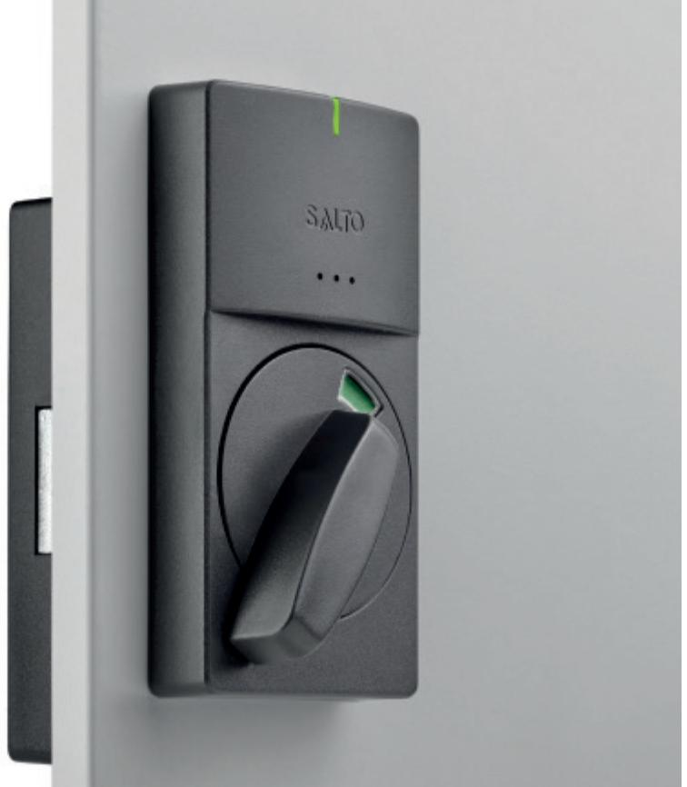
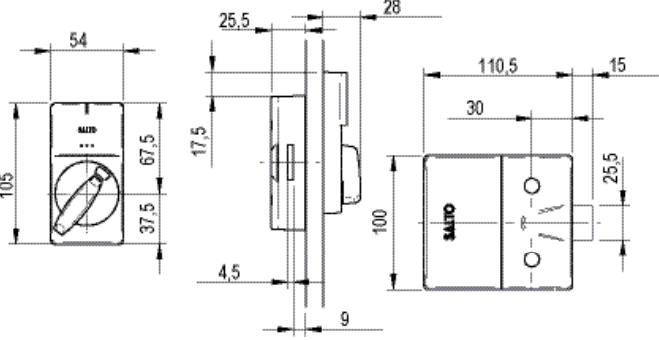

# PRODUKTBLAD

# XS4 SKÅPLÅS av SALTO

XS4 Skåplås BLE skapar hög säkerhet till ett brett urval av skåp, kabinetter, lådor etc. genom att integrera det i SALTOs trådlösa passersystem. Den nya elektroniken gör det möjligt att integreraBluetooth-teknik för användning av JustIN Mobile-teknik och SALTO BLUEnet trådlös online-teknik i samma hårdvara. Du kan nu anpassa nivån på funktionalitet när du programmerar enheterna.

Batteripaket, elektroniska komponenter och låsmekanismen är placerade på insidan av dörren, vilket skyddar dem mot eventuell vandalism eller sabotage.

www.saltosystems.com

# XS4 SKÅPLÅS Lx050

Publications of SALTO SYSTEMS S.L. are protected by copyright and all rights are reserved. SALTO SYSTEMS publications may not be reproduced in any form or by any means without written permission from the copyright owner.

| Utsidesmått:                  | 54mm x 105mm x 28mm                                                                            |
|-------------------------------|------------------------------------------------------------------------------------------------|
| Insidesmått:                  | 100mm x 110,5mm x 25mm                                                                         |
| Tjocklek på skåpdörr/låda:    | 10mm upp till 50mm.                                                                            |
| Hakregelskydd                 | 15mm                                                                                           |
| Strömförsörjning:             | 3 alkaline batterier (LR03 AAA 1,5V). Alternativt 3 Lithium batterier (FR03 - AAA 1,5V). |
| Antal öppningar:              | • Mifare/Desfire: 75.000* • BLE: 60.000*                                                    |
| Maximalt antal logghändelser: | 1,861                                                                                          |
| Miljö:                        | Temperatur: 0°C till +60°C; Luftfuktighet: 0 till 95%                                       |
| Certifikat:                   | CE, FCC, IC, RCM                                                                               |
| Material/Färg:                | • Antrasit (grå) (A) PC+ABS + BioCote • Vit (M) ASA-PC + BioCote                         |
| *Beroende av hur det används  |                                                                                                |

### TEKNISK DATA: TEKNISK RITNING:

#### ALTERNATIV:

#### LÄSARFÄRG:

Antracit grå: •

Vit*: •

*Vit utsida, antracit utsida

#### LÄSTEKNIKER::

| MIFARE:*          | • |
|-------------------|---|
| BLE Smart:        | • |
| NFC:              | • |
| Legic:**          | — |
| HID iCLASS® Seos: | • |
| Picopass:         | — |
| i-Button:         | — |

* MIFARE® (DESFire EV2, Plus, Ultralight C, Classic - ISO/IEC 14443) ** Legic Prime och Legic Advant

#### TEKNOLOGIPLATTFORMAR:

#### SALTO SPACE:

| — |
|---|
| — |
| • |
| — |
| • |
|   |

* BLUEnet kommunikationen kan påverkas vid installation på metalldörr och kan innebära att fler noder eller repeaters krävs. Kontrolllera innan installation.

#### SALTO KS:

SALTO KS: •

#### SALTO SALLIS:

SALLIS: —

| Tilldelat skåp:            | Ett speciellt skåp tilldelas en unik användare.                                  |
|----------------------------|-------------------------------------------------------------------------------------|
| Skåp med fri tilldelning*: | Alla som har en ID kodbärare för SALTO kan välja ett slumpvis ledigt skåp. |
| Familjetilldelat skåp:     | Flera användare med SALTO kodbärare kan tilldelas ett speciellt skåp.         |
|                            |                                                                                     |

* Kompatibelt med RFID och NFC.

Ej tillgängligt för smartphone som använder BLE.

