# Low-power Keypad C1000LP

Art. No.: 480005 (black), 480006 (white)

# User Manual

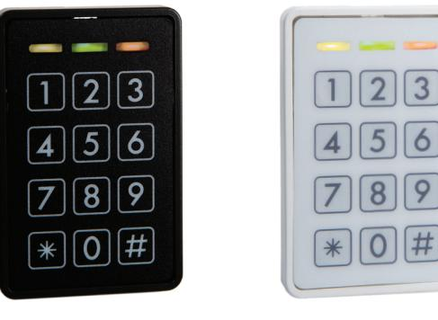

C1000LP_usermanual_ENGmar20

**Conlan ApS • Amalienborgvej 15 • DK-9400 Nørresundby • Tel: +45 72 40 60 03 • www.conlan.dk • info@conlan.dk •** 

# Table of Content

| 1.  | Introduction                                                                                                                                                                                                                 | page 3                                                               |  |
|-----|------------------------------------------------------------------------------------------------------------------------------------------------------------------------------------------------------------------------------|----------------------------------------------------------------------|--|
| 2.  | Installation                                                                                                                                                                                                                 | page 3                                                               |  |
| 3.  | Programming users 3.1 User positions 3.2 Programming user codes 3.3 Programming user codes on                                                                                                              | page 4 page 4 page 4                                           |  |
|     | special positions 3.4 Smart enrolling                                                                                                                                                                                  | page 5 page 6                                                     |  |
| 4.  | Battery Management                                                                                                                                                                                                           | page 6-7                                                             |  |
| 5.  | Configuring C1000LP 5.1 Service code 5.2 Configuration overview 5.3 Changing Master Code 5.4 Changing Service Code 5.5 LED Indications 5.6 Output setup 5.7 Special settings | page 8 page 8 page 8 page 9 page 9 page 10 page 11 |  |
| 6.  | Blocking (Duress)                                                                                                                                                                                                            | page 12                                                              |  |
| 7.  | Manual reset page 12                                                                                                                                                                                                      |                                                                      |  |
| 8.  | Technical specifications page 12                                                                                                                                                                                       |                                                                      |  |
| 9.  | One time-, day- and period codes page 13-14                                                                                                                                                                               |                                                                      |  |
| 10. | page 14 Free locker                                                                                                                                                                                                       |                                                                      |  |

# 1. Introduction

C1000LP is a low power keypad that works on electronic locks with open collector or H-Bridge mode.

In standby mode is the yellow LED is lit (● ○ ○) By correct code lights yellow and green LED (● ● ○) By incorrect code lights the red LED (○ ○ ●)

C1000LP has a buzzer for indicating while keying, correct code, incorrect etc. and 2 transistor outputs, independant from each other, so the C1000LP can give access by code.

The C1000LP is a stand alone unit, the can be programmed directly by Master code and Service code.

# 2. Installation

Mount the reader on a even surface.

Connect the wires to power supply, door strike etc. (use supplied diode)

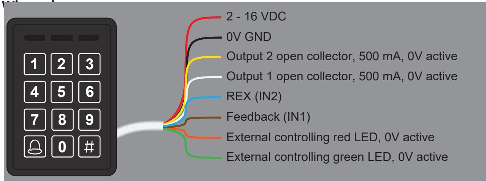

**Note:** Right after applying the voltage all LED's lights and the buzzer sounds **do not** touch the reader untill the yellow LED lights and the buzzer is silent.

# 3. Programming users

Programming the C1000LP is simple and easy to understand.

### 3.1 User positions

C1000LP has 200 user positions, which can contain a code. The positions are divided as following:

| User position | Function                                                              |
|---------------|-----------------------------------------------------------------------|
| 1 - 100       | Activates output 2 (The code is position 1 is 1234 - factory default) |
| 101 - 150     | Activates output 1                                                    |
| 151 - 190     | Activates output 1 and 2                                              |
| 191 - 200     | Reserved for special functions                                        |

### 3.2 Programming user codes

The Master code is used to program/change/delete the users. By default the Master code is **4711**.

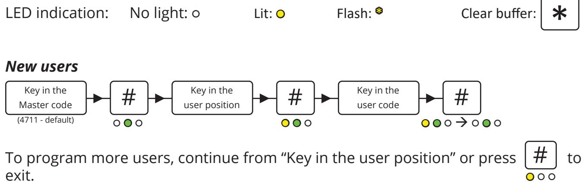

### *Changing codes*

It's the same procedure as programming new users, just overwrite the user position.

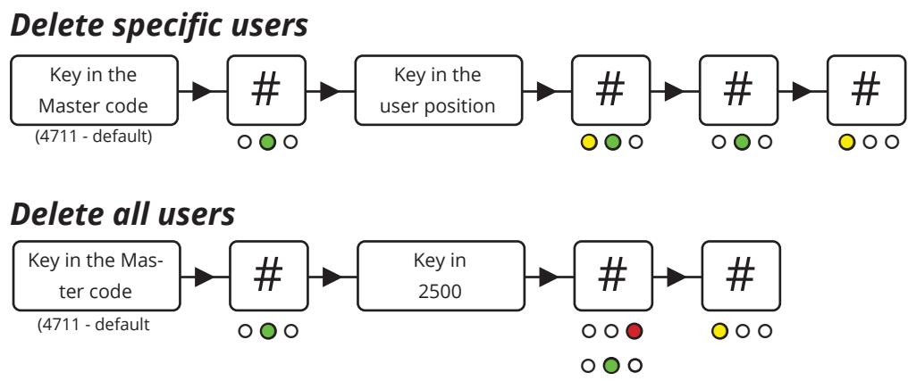

### 3.3 Programmming codes for special functions

Programming the codes is described in 3.2 and 3.3. This entry activates the output(s) for 5 seconds (factory setting). Only 1 user can enter at the time.

#### *Programming the same user twice*

By programming the same code on the same position twice toggles the output. *(Ie. the code is entered to unlock the door and entered to lock it again).*

### *Programming the same user 3 times*

By programming the same code on the same position 3 times, the output is designated as switch on only.

*(Ie. the door is permanently unlocked when the code is entered).*

### *Programming the same user 4 times*

By programming the same code on the same position 4 times, the output is designated as switch off only.

*(Ie. the door is only locked when the code is entered).*

### 3.4 Smart enrolling

This position makes it possible to program codes quicker without entering new positions. Key in a position and it counts automatically to the next position. Codes can be programmed alternatively as you see fit.

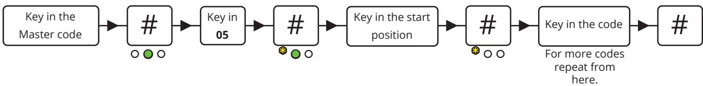

**Note:** This programming mode overwrites existing positions.

### 4. Battery management

Gives a warning before opening the door, when the battery is at approx 10% charge.

Preset Battery low warning (1#):

| Position | Select chemistry     | Series cell count  |
|----------|----------------------|--------------------|
| 0        | Disable              |                    |
| 1        | Alkaline 1,5V        | (0,95V) 3-10 cells |
| 2        | Lithium 3V           | (2,3V) 1-5 cells   |
| 3        | Li-poly/Li-ion 3, 7V | (3,37V) 1-4 cells  |
| 4        | Lead Acid 2, 1V      | (1,95V) 2-7 cells  |
|          |                      |                    |

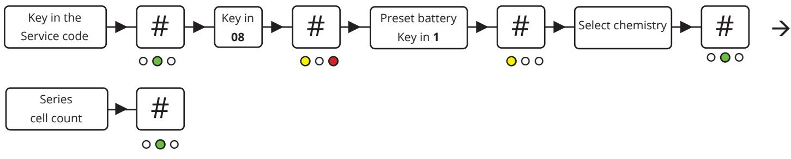

Here is an example of how you preset the battery when having a 12V Lead Acid with 6 cells. See following instructions.

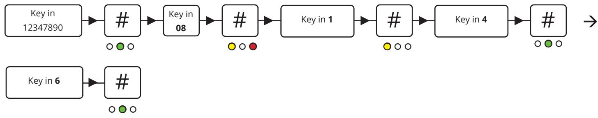

Custom battery low warning (2#):

If you do not have any of the mentioned battery types, you can customize your battery size. See following instructions.

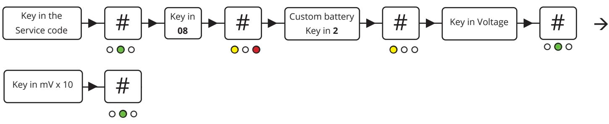

Here is an example of how you preset the customized battery low warning. In this example we want the battery to send a warning at 10,8V.

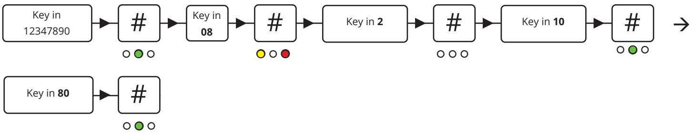

When the battery is running low it will give you a warning when you type in your user code. The red LED will flash while the buzzer beeps for about 3 seconds. The output is hereafter activated.

# 5. Configuration of C1000LP

### 5.1 The Service code

The Service code is used for C1000LP's advanced settings such as changing the Master code and Service code, LED indications and much more. The overview of the settings and the factory settings can be seen in 4.2 *Configuration overview*.

The Service code is **12347890** (factory setting).

#### **Note: Before the Service code can be used must the voltage be turned OFF and ON (the Service code can now be entered within 10 seconds).**

After entering the Service code the reader is in programming mode (the green LED lights). Each time a setting is made the C1000LP goes back to the previous point and the next setting can be made.

The navigation is by entering the position/ value followed by **#**.

### 5.2 Configuration overview

| Position | Setting                                     | Factory default                            |  |
|----------|---------------------------------------------|--------------------------------------------|--|
| 00       | Master code (1 to 8 digits)                 | 4711                                       |  |
| 01       | Service code (1 to 8 digits)                | 12347890                                   |  |
| 02       | LED indications                             | Normal = Yellow, active = Yellow and green |  |
| 03       | Output setup                                | Output time for 1 and 2 is 5 seconds       |  |
| 04       | Special functions                           |                                            |  |
| 05       | Smart enrolling                             |                                            |  |
| 06       | Input setup                                 |                                            |  |
| 07       | Time                                        |                                            |  |
| 08       | Battery management                          |                                            |  |
| 09       | Locker reserve time                         |                                            |  |
| 2500     | All codes on the user positions are deleted |                                            |  |
| 0250     | Reset to factory default                    |                                            |  |

### 5.3 Changing the Master code

By default the Master code is **4711** and can only be used to program, change or delete users on the C1000LP. To change the Master code, enter the following:

# 5.4 Changing the Service code

The Service code is used to configure the C1000LP's settings.

To change the Service code, enter the following within 10 seconds after power on:

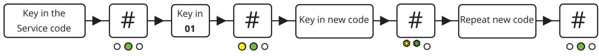

## 5.5 LED indications

The C1000LP's 3 LED's can be adjusted at will.

To adjust the LED indications enter the following:

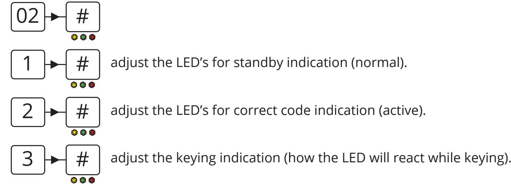

To adjust the LED's press on the following:

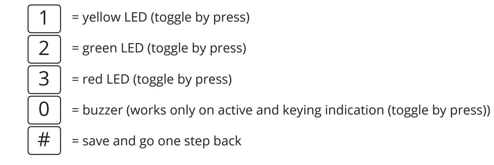

To save the settings press or press to go back to the previous point (not saving). # *

### 5.6 Output setup

The C1000LP has 2 outputs that can be set to H-Bridge output or open collector output. By default is the C1000LP set to H-Bridge output with Lock delay in 5 seconds.

To configure the output settings use the following steps:

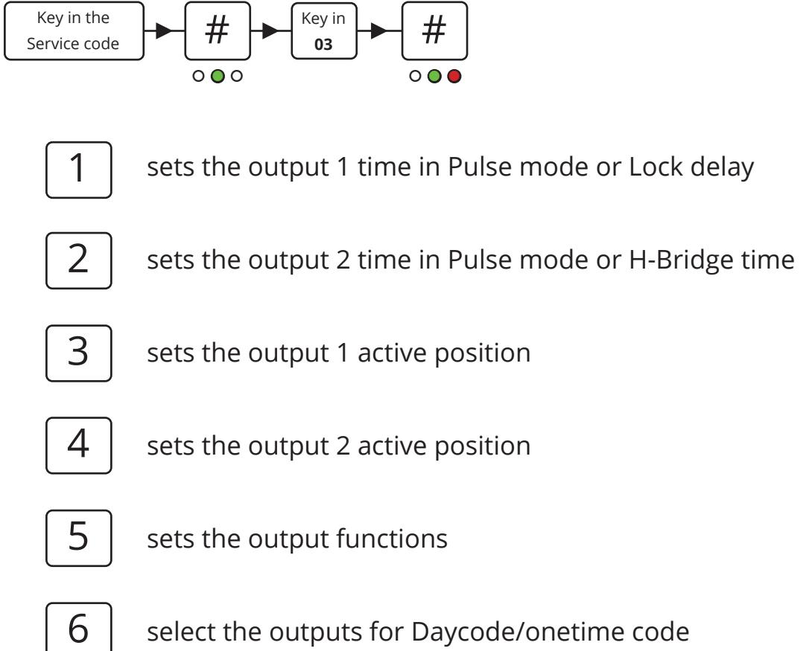

Please use the configuration scheme under "03" section for correct navigation for OC setup

**Note:** In time setting for Pulse mode it is in Milisec x 10 instead of hours.

## 5.7 Special settings

These settings is used to change the C1000LP's special functions such as turning the buzzer on/off etc.

To change these settings, key in: = Service code without timeout (● = inactive / ● = active) = Master code be changed by Master code (● = inactive / ● = active) = Mute reader (● = Off / ● = On) = Bell on OC1 (● = Off / ● = On) = Onetime code (● = Off / ● = On) = Day code (● = Off / ● = On) = Locker mode (● = Off / ● = On) = Free locker mode (● = Off / ● = On) 04 # ● ○ ○ 1 2 3 4 5 6 7 8

### **Special positions**

User position 191 to 197 can activate special setting 3 to 6 with a code. The programming is the same procedure as programming a user code just use the positions mentioned below:

- 191 = Toggle buzzer
- 193 = Reset of free locker
- 194 = Toggling the star key to activate output 1 (white wire)
- 195 = Toggle onetime code mode
- 196 = Toggle Daycode mode
- 197 = Deactivate the user codes
- 198 = Seed code
- 199 = Digit count for one/day code

| To save the settings press | # | or press | * | to go back to the previous step |
|----------------------------|---|----------|---|---------------------------------|
| (no saving).               |   |          |   |                                 |

**Note:** In case of power disruption the special functions will go back to the setup made by service code.

# 6. Blocking

The C1000LP is blocked for 1 minute after 4 incorrect codes.

LED indication: ○ ○ *

# 7. Manual reset

The C1000LP can be reset to factory default manually.

- Turn the voltage off.
- Connect the yellow and brown wire.
- Turn the voltage on (2 16 V DC) the readers LED's lights and the buzzer sounds.
- Turn the voltage off and disconnect the yellow and brown wire.

The C1000LP is now reset to factory default and the user codes are deleted.

# 8. Technical specifications

| Voltage range:      | 2 - 16V DC                                                 |
|---------------------|------------------------------------------------------------|
| Mifare reading:     | Max. 50 mm                                                 |
| Output:             | 2x open collector, max. 500mA                              |
| Input:              | External buzzer/Feedback (brown) and REX, 0V active (blue) |
| Protection rate:    | IP67                                                       |
| Color:              | Black or white                                             |
| Cable:              | 2,5 meter white, 8 cores                                   |
| Dimensions (HxBxD): | 130x50x8 mm                                                |

# 9. One time-, day- and period codes

The C1000LP offers 3 advanced code types that can be used either once, for a day or for a specific period. First, the codes must be generated either via the Conlan Code Generator (download available at conlan.eu), via the Conlan Day Code app (available for both Android and iOS), or the website www.conlan.app

First, enter a seed number. This number can be any number between 1 and 9999999. Then the code length must be indicated. Here it is best to avoid 4 or 8 digits, so that the codes does not intervene with the service- or mastercode. Default code length is set to 6 digits.

#### **Conlan Code Generator for Windows**

This is for administration of one time and day codes. After you have pressed enter, a number of one time codes will be shown on the left, the day code at the top, and future day codes via the calender. All codes can be exported to a file if needed.

| Seed:            | 90    |                  |          |    |    |    |                   |    |
|------------------|-------|------------------|----------|----|----|----|-------------------|----|
| Digit Count:     | 6     |                  |          |    |    |    |                   |    |
| One Code         |       | Dav Code: 201806 |          |    |    |    |                   |    |
| Use              | Reset |                  |          |    |    |    |                   |    |
|                  |       | 28-05-2015       |          |    | -> |    | 28-05-2015        |    |
| 472812           |       |                  |          |    |    |    |                   |    |
| 289036           |       |                  |          |    |    |    |                   |    |
| 807009           |       | 4                | mai 2015 |    |    |    | P                 |    |
| 572450           |       |                  |          |    |    |    |                   |    |
| 293859           |       | ma               | ti       | on | to | fr | lø                | 50 |
| 314918           |       | 27               | 28       | 29 | 30 | 1  | 2                 | 3  |
| 185399           |       | 4                | 5        | 6  | 7  | 8  | 9                 | 10 |
| 257818           |       | 11               | 12       | 13 | 14 | 15 | 16                | 17 |
| 897656 155786 |       | 18               | 19       | 20 | 21 | 22 | 23                | 24 |
| 937581           |       | 25               | 26       | 27 | 28 | 29 | 30                | 31 |
| 806396           |       | 1                | 2        | 3  | 4  | 5  | 6                 | 7  |
| 115242           |       |                  |          |    |    |    | I daq: 28-05-2015 |    |
| 474492           |       |                  |          |    |    |    |                   |    |

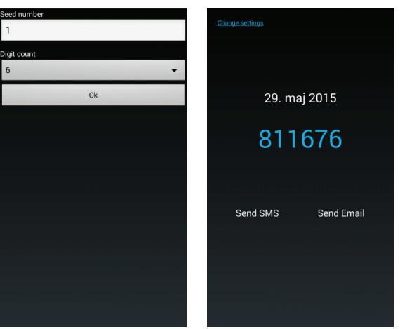

#### **Conlan Day Code app**

For administration of day codes. The codes can also be sent out either via SMS or email.

#### **Www.conlan.app**

Through this website you can administrate both day codes and period codes. Period codes can be set to between 1-28 days. The codes can via the website be sent directly to an email adress.

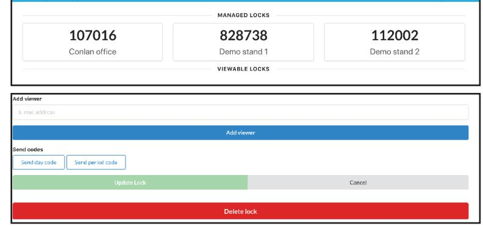

When the information is specified, the C1000LP can be set:

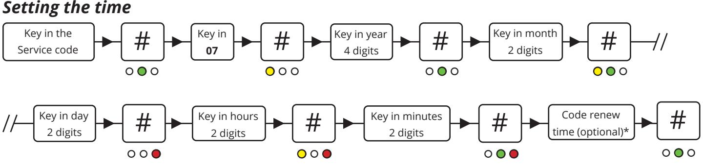

*Code renew time = This is the time on which the one time, day or period codes change to the next day. Default is 00:00. If you don't want to change the default time, simply press #.

### *Activation of One-time-/day code*

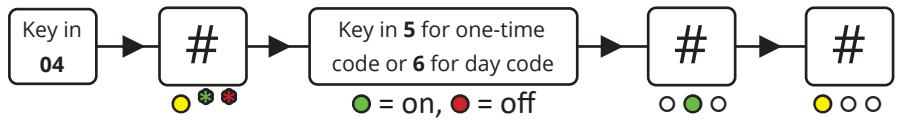

Finally, the reader must know how many digits the one-time-/day codes have and the seed number. This is done in the same way as programming a user code: Position 198 is for seed and position 199 is for digits.

**Please note:** It is important that the seed number in position 198 is the last to be keyed in. This way all the codes will be generated correctly.

# 10. Free locker

The Free locker function can be used for access control, especially for access control where the user often switches.

Function: Key in a code, and if the cabinet is free, it will lock and can only be unlocked with the same code.

The locker reserve time function can be set to between 1-255 minutes. This means that the locker automatically will unlock after a given time. To access this function, please see the provided configuration scheme for the reader under position 09.

### **Free locker reset**

The user positon 193 will make a reset of the free locker function. Please see section 5.7 "special positions" in this manual to see line of procedure.