**Innovativ IoT plattform för säkerhet och fastighetsautomation**

# **INSTALLATIONSMANUAL**

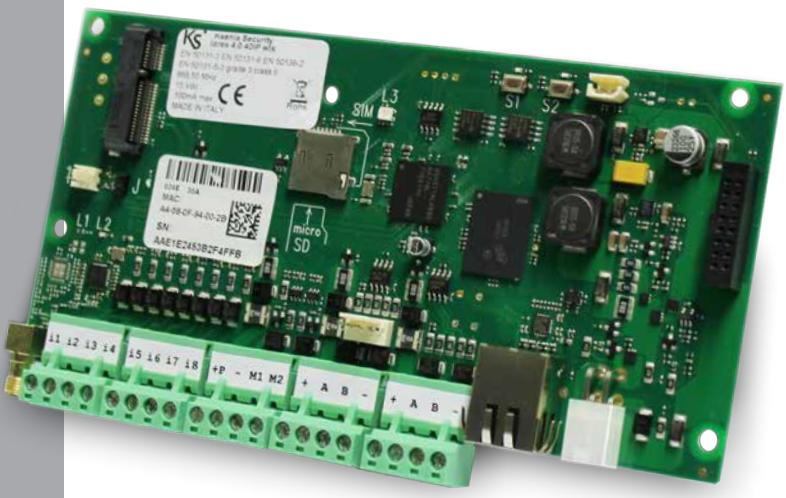

1

**2019-06-26**

## **INSTALLATÖRSKOD: 123456 HUVUDKOD: 000001**

**För programmering via portalen www.kseniasecureweb.com eller via APP, lokalt via webserver eller manöverpanel), se sidan 12 i denna handbok.**

#### **APP LARES 4.0**

På etiketten nedan kan du hitta serienumret på din centrapparat lares 4.0. Skanna den via din användarapp APP lares 4.0 för att styra och övervaka ditt säkerhetssystem.

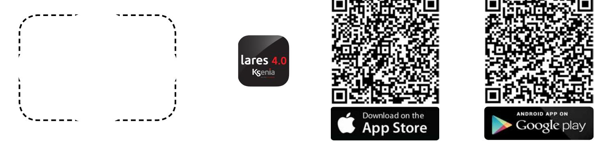

#### **Till installatören:**

Använd det markerade området ovan för att placera kopian av etiketten med serienumeret på centralapparaten, så användaren kan skanna den med sin APP för att ansluta till centrapparaten.

**VIKTIGT**

**Det finns även en snabbinstruktion för programmering av lares 4.0, se separat manual.**

**INDEX**

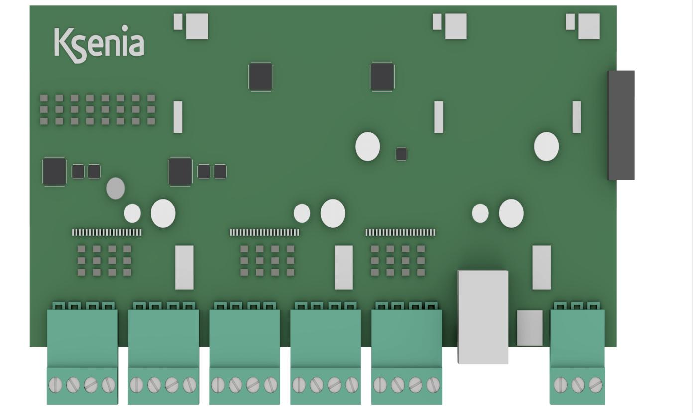

# **Innehållsförteckning**

| SPECIFIKATION HÅRDVARA / MJUKVARA 4      |  |
|---------------------------------------------|--|
| INGÅENDE KOMPONENTER 5                   |  |
| VÄGGMONTERING6                              |  |
| MONTERING AV LOCK 7                      |  |
| MODERKORT lares 4.INGÅENDE KOMPOENETER8     |  |
| LYSDIODER OCH ÅTERSTÄLLNING 9            |  |
| ANSLUTNING AV NÄTSPÄNNING 9              |  |
| GSM / 3G10                                  |  |
| PSTN 10                                  |  |
| KS-BUSS ANSLUTNING RS-485 11             |  |
| KOMPATIBLA ENHETER 11                    |  |
| RADIOBASERADE TILLBEHÖR11                   |  |
| CENTRALAPPARAT KONFIGURATION12              |  |
| INSTALLATÖRSMENY (MANÖVERPANEL)13           |  |
| SKILLNADER MELLAN LARES OCH LARES 4.0 14 |  |
| PROGRAMMERING AV CENTRALAPPARAT16           |  |
| ANVÄNDARANVISNING ergo LCD 17            |  |
| INTYG 23                                 |  |
|                                             |  |

#### **SPECIFIKATION HÅRDVARA / MJUKVARA**

**lares 4.0** presenterar den mest avancerade och stabila plattformen för den digitala framtiden (**IoT**) vilket står för både säkerhet, videoövervakning, passagesystem och hemautomation.

|                                                                                       | lares 4.0 HÅRVARA - MJUKVARA |                |                    |                       |                        |
|---------------------------------------------------------------------------------------|------------------------------|----------------|--------------------|-----------------------|------------------------|
|                                                                                       | lares 4.0 - 16               | lares 4.0 - 40 | lares 4.0 - 40 wls | lares 4.0 -140 wls | lares 4.0 - 644 wls |
| Ingångar                                                                              |                              |                |                    |                       |                        |
| Antal sektioner (varav är radio)                                                      | 16 (40)                      | 40 (40)        | 4 (40)             | 140 (64)              | 64 (64)                |
| Valbara motståndsvärden                                                               | 2                            | 4              | 4                  | 14                    | 64                     |
| Utgångar                                                                              |                              |                |                    |                       |                        |
| Antal utgångar (varav är radio)                                                       | 16 (16)                      | 40 (40)        | 40 (40)            | 140 (128)             | 644 (128)              |
| Virituell utgångar (timers)                                                           |                              |                |                    |                       |                        |
| Moderkort                                                                             |                              |                |                    |                       |                        |
| Programmerbara in- och utgångar                                                       | 2                            | 2              | 2                  | 2                     | 2                      |
| Ingångar                                                                              | 8                            | 8              | 8                  | 8                     | 8                      |
| Radiomottagare 868 MHz                                                                | -                            | -              |                    |                       |                        |
| Mjukvara                                                                              |                              |                |                    |                       |                        |
| Antal områden                                                                         | 4                            | 12             | 12                 | 20                    | 30                     |
| Antal tillkopplingslägen                                                              | 8                            | 32             | 32                 | 64                    | 128                    |
| Hashtag nummer                                                                        | 2                            | 12             | 12                 | 20                    | 64                     |
| Antal händelser i logg                                                                | 1500                         | 1500           | 5000               | 10000                 | 10000                  |
| Antal användare (koder och brickor)                                                   | 16                           | 64             | 128                | 512                   | 1024                   |
| Antal scenarier                                                                       | 8                            | 32             | 32                 | 128                   | 512                    |
| Antal händelser kopplare till scenarier                                               | 32                           | 64             | 64                 | 128                   | 1024                   |
| Antal IP kameror                                                                      | 4                            | 12             | 12                 | 20                    | 30                     |
| Installatörsapp                                                                       |                              |                |                    |                       |                        |
| Användarapp                                                                           |                              |                |                    |                       |                        |
| Buss                                                                                  |                              |                |                    |                       |                        |
| Manöverpaneler (ergo, ergo S, M & volo)                                               | 6                            | 24             | 24                 | 40                    | 64                     |
| Expansionskort (auxi, auxi relä, auxi 10)                                             | 4                            | 24             | 24                 | 64                    | 250                    |
| Strömförsörjning/separator opis / divide                                              | 4                            | 12             | 12                 | 20                    | 64                     |
| Radiomottagare duo BUS (64 tillbehör)                                                 | 2                            | 2              | 2 *                | 2 *                   | 2 *                    |
| Sirener radius och imago (in- och utomhus)                                            | 6                            | 24             | 24                 | 40                    | 64                     |
| Multifunktionssensor domus                                                            | -                            | 8              | 8                  | 32                    | 64                     |
| Radio                                                                                 |                              |                |                    |                       |                        |
| Detektorer (poli, nanus, unum, velum, nebula)                                         | 16                           | 40             | 40                 | 64                    | 64                     |
| Siren imago                                                                           | 3                            | 3              | 3                  | 5                     | 5                      |
| Fjärrkontroller opera                                                                 | 16                           | 64             | 64                 | 64                    | 64                     |
| Repeater duo                                                                          | 2                            | 2              | 2                  | 2                     | 2                      |
| Radiomodul auxi wls                                                                   | 8                            | 20             | 20                 | 64                    | 64                     |
| Notifikationer                                                                        |                              |                |                    |                       |                        |
| Antal kontaktlistor                                                                   | 8                            | 8              | 8                  | 16                    | 32                     |
| Antal kontakter i varje lista                                                         | 8                            | 8              | 8                  | 8                     | 8                      |
| Antal händelsegrupper kopplade                                                        | 16                           | 32             | 32                 | 64                    | 128                    |
| Hårdvara                                                                              |                              |                |                    |                       |                        |
| Spänning                                                                              | 15 VDC / 3.4 A (50 watt)     |                |                    |                       |                        |
| Strömförbrukning                                                                      | 100mA                        |                |                    |                       |                        |
| Temperaturområde                                                                      | 5 till + 40 grader           |                |                    |                       |                        |
| IP klass                                                                              |                              |                | IP 34              |                       |                        |
| * om moderkortet redan har en radiomottagare kan 1 st radiomottagare duo bus anslutas |                              |                |                    |                       |                        |
| 4                                                                                     |                              |                |                    |                       |                        |

#### **INGÅENDE KOMPONENTER**

Nedan visas alla delar i centralapparat lares 4.0. Bilden visar också strömförsörjningen. Anslutningar i detalj: Var uppmärksam på jordanslutningen. Det stora hålet på boxens botten ger en stor passage av kablar.

| 1. Stort hål för kablar   | 10. Anslutningsplintar                                         |
|---------------------------|----------------------------------------------------------------|
| 2. Monteringsplatta       | 11. Batterianslutningar, vid behov använd batterikontaktdon    |
| 3. Hål i kapsling         | 12. Strömförsörjningsplintar                                   |
| 4. Hål för moderkort      | 13. 2A Säkring                                                 |
| 5. Hål för moderkort      | 14. Hål för fästa kablar                                       |
| 6. Sabotagekontakt        | 15. Slitsar för lock. Använd medföljande 4 skruvar             |
| 7. Batteri                | 16. Hål för metallkapsling, vid behov använd plastdistanser |
| 8. Strömförsörjningskabel | 17. Mikrobrytare                                               |
| 9. Moderkort lares 4.0    |                                                                |

 Ingår för anslutning av nätaggregatet och batteriet. De två terminalerna är för strömförsörjningen (15Vdc), medföljande två terminaler är för batteriet 12V.

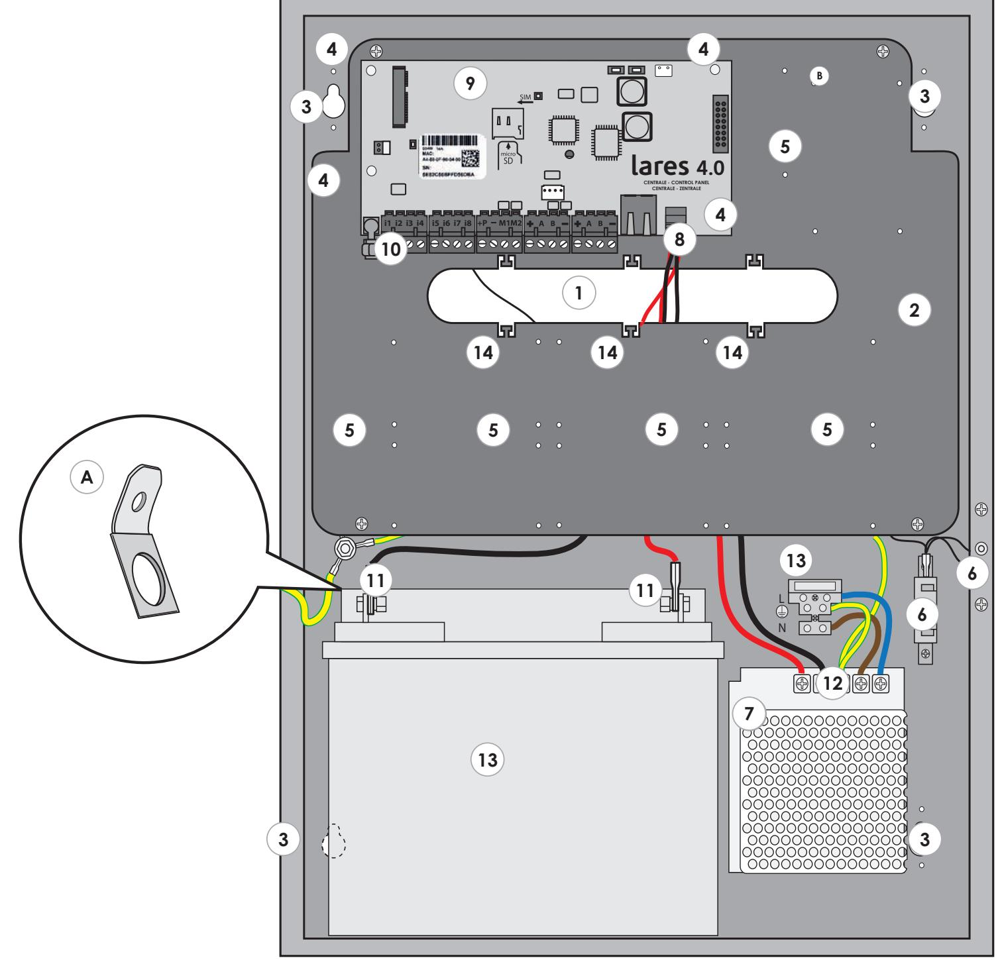

#### **VÄGGMONTERING**

- För att montera kapsling och dess komponeter följ dessa instruktioner nedan:
- 1. Skruva fast kapslingen på väggen med medföljande skruvar.
- 2. Dra kablarna som visas på bilden.
- 3. Fäst kablarna till fästöglor.

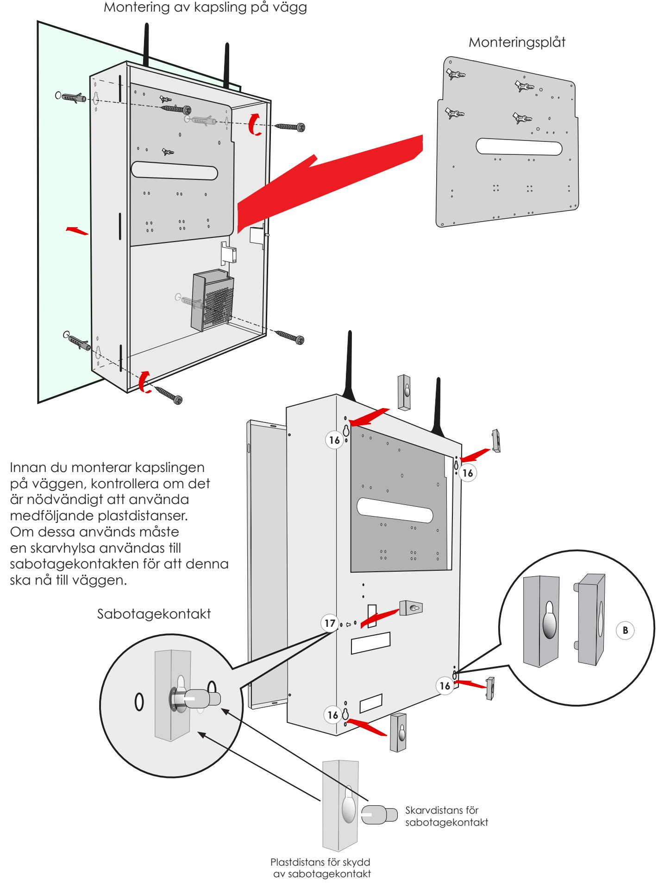

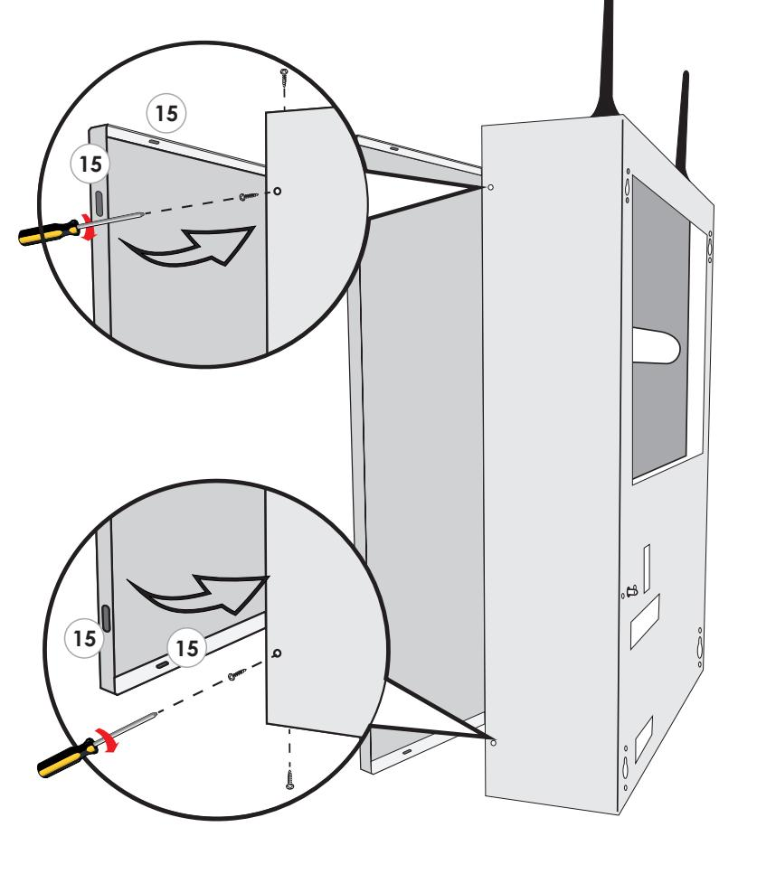

#### **Fäst locket på kapslingen:**

7

När du har stängt locket skruva fast med de medföljande skruvarna vid de angivna punkterna:

- Anslut matning 230 VAC via en avsäkrad matning (t.ex.10A).
- Strömförsörjningen har en intern säkring (50W F3.15A). Installation och service måste utföras av behörig personal.

- Dra skyddsjord direkt till strömförsörjningen.
- Strömförsörjningsledarna måste vara 1.5 mm².
- Kryssa i vilken modell av installerad centralapparat det är på etiketten som sitter utanpå kapslingen.

| - 40 - 40 wls       |  |
|------------------------|--|
| - 140 wls - 644 wls |  |
| opis                   |  |
|                        |  |
|                        |  |

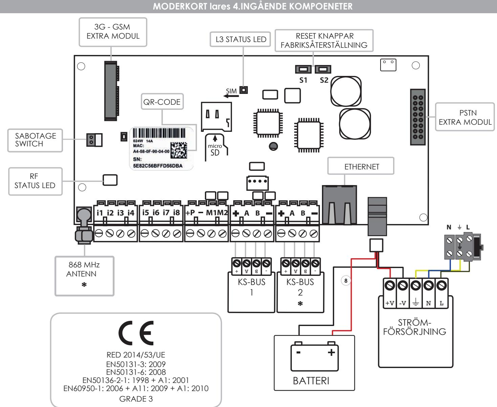

*** lares 4.0 - 40:** Denna typ av modell har inte en inbyggd radiomottagare eller en andra bussanslutning.

Obs: Strömförsörjningskabel (8) ingår för anslutning av strömförsörjning och batteriet består av fyra kablar, två kablar för strömförsörjning (15Vdc), och två kablar för batteriet 12V.

#### **Om lares 4.0 installeras i metallkapsling KSI 7402117.010 eller KSI 7403130.010 justera strömförsörjningen till 15V.**

| i1, i2, i3, i4, i5,i6, i7, i8 = M1, M2 = | Ingångsplintar. In och utgångsplintar (transistor 500mA max). |
|---------------------------------------------|------------------------------------------------------------------|
| +P =                                        | Plusplint för strömförsörjning (1.5A max).                       |
| - =                                         | Minusplint för strömförsörjning.                                 |

| + | KS-BUSS                | Plusplint för matning (15V 1,5 A Max) |
|---|------------------------|---------------------------------------|
| A |                        | Data A                                |
| B |                        | Data B                                |
| - | Minusplint för matning |                                       |

|                                       |                                                                                                                                  | LYSDIODER OCH ÅTERSTÄLLNING                                                                                                                                                                                                                                                                                                                                                                                                                                                                                                                                                 |
|---------------------------------------|----------------------------------------------------------------------------------------------------------------------------------|-----------------------------------------------------------------------------------------------------------------------------------------------------------------------------------------------------------------------------------------------------------------------------------------------------------------------------------------------------------------------------------------------------------------------------------------------------------------------------------------------------------------------------------------------------------------------------|
| STATUS LED RD - L2 STATUS LED - L3 | GRÖN blinkande: VIT blinkande: LILA blinkar: RÖD blinkande: GUL blinkande: BLÅ blinkar: FAST GUL: FAST RÖD: | Denna LED blinkar varje gång centralapparaten erhåller ett giltigt radiopaket. Centralapparaten har en RGB-LED (L3) som beroende på status, indikerar olika uppgifter: Normal drift. Initialiseringsfasen. NOR-minneformatering. Uppdatering av fast programvara. Fabriksåterställning. Återställning efter inläsning av backupfil, efter detta en firmwareuppdatering samt återställning av databasen. NOR-minnesåtkomstproblem, utför en formatering av centralapparaten. Firmware problem. Kontakta Ksenia Security för teknisk assistans. |
|                                       |                                                                                                                                  |                                                                                                                                                                                                                                                                                                                                                                                                                                                                                                                                                                             |

#### **Återställning till grundprogrammering:**

Tryck på S1-knappen i 4 sekunder, statusdioden L3 börjar blinka röd-grön färg. När LEDlysdioden L3 blir fast röd, släpp knappen.

**Frånkoppla från SecureWeb:** Tryck på S2-knappen, status lysdioden L3 börjar blinka grön / blå. När LED-lysdioden L3 blir fast blå är proceduren klar.

**Komplett formatering av centralapparaten:** Tryck på S1 och S2 samtidigt, LED L3 blinkar röd / blå växelvis. Efter 4 sekunder, när L3 blir fast lila, sker nu en återställning av fabriksdata och avregistreringen från SecureWeb, om du fortsätter att trycka på knapparna i ytterligare 10 sekunder börjar lysdioden blinka lila och nu startar en fullständig formatering.

**VARNING** - utför endast den här proceduren om L3-lysdioden lyser fast gul.

#### **ANSLUTNING AV NÄTSPÄNNING**

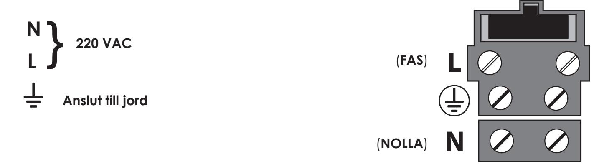

#### **Innan du slår på spänningen så måste du kontrollera att alla nödvändiga kablar har anslutits:**

- Om GSM-modul används ska ett mikro SIM-kort användas och att GSM-antennen har anslutits.
- Om PSTN-modulen används, sätt i RJ11-kontakten både för inkommande och utkommande telelinje.
- Kontrollera att anslutningen till RF 868-antennen har kopplats med hjälp av SMA-kontakten.
- Kontrollera om anslutningen av manöverpanelens BUS-terminalerna är korrekt anslutna.
- Anslut Ethernet-kabeln till nätverkskontakten och routern.
- Anslut alla kablar till detektorer och sirener.
- Anslut kabel för nätspänning.
- Anslut batteriet med de medföljande kablarna.

För mer information om inkoppling se nästa stycke.

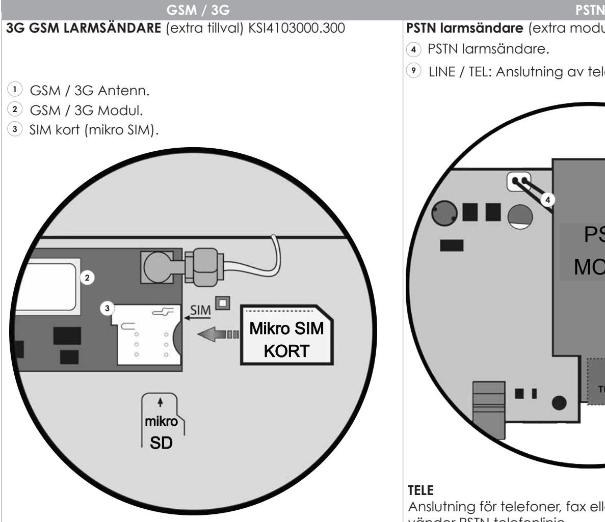

#### **FUNKTIONER:**

- Talmeddelanden och / eller SMS.
- Separata SMS för varje sektion.
- Avbryter uppringning när systemet frånkopplas.
- Larmsändning med tal med möjlighet till personliga meddelanden.
- Talmeddelanden inspelat via MP eller med "text till tal"(olika tal och språk med "loquendo" licens)
- Tal och ljud med digital hög kvalité.
- GSM störningsdetektering.
- Contact ID larmöverföring.
- SIA DC-09.

**VIKTIGT:** Innan SIM kort placeras i GSM modul, se till att ta bort PIN kod på kortet.

### **NOTERINGAR:**

- Kontrollera att SIM kortet placeras rätt enligt illustration ovan.
- Att enheten inte är kompatiblel med operatörer som bara stödjer UMTS nätverk (t ex 3).
- **PSTN larmsändare** (extra modul) KSI4200001.300
- **4** PSTN larmsändare.
- **9** LINE / TEL: Anslutning av telefonlinje.

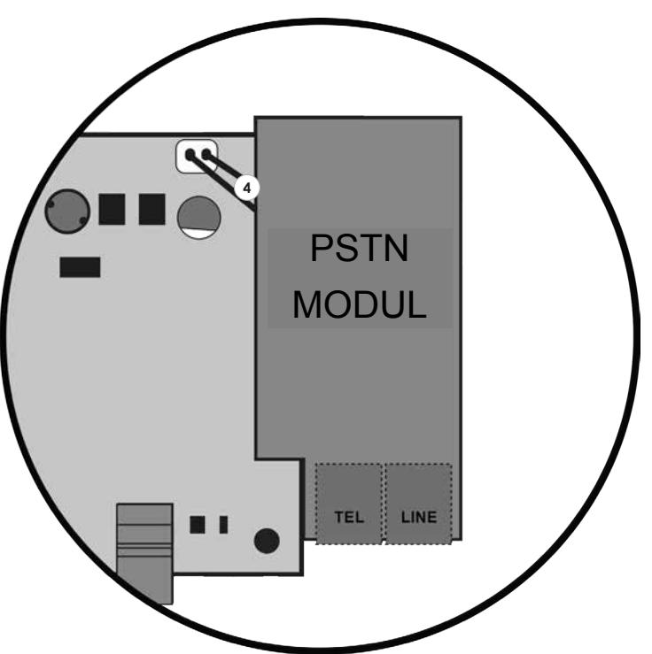

### **TELE**

Anslutning för telefoner, fax eller andra enheter som använder PSTN telefonlinje.

### **LINE**

Anslutning för inkommande telelinje.

### **FUNKTIONER:**

- Talmeddelanden.
- "Avbryter uppringning" när systemet är frånkopplat.
- Larmsändning med tal med möjlighet till personliga meddelanden.
- Talmeddelanden inspelat via MP eller med "text till tal"(olika tal och språk med "loquendo" licens).
- Contact ID larmöverföring.

#### **KS-BUSS ANSLUTNING RS-485**

Tillbehör i larmsystem Ksenia är anslutna via KS-bussen. Det rekommenderas inte att överskrida 500 m mellan centralapparat och ett busstillbehör samt den maximala längden för en buss mer än 1000 m (avstånd avser busskommunikation ej strömförsörning). Använd alltid en partvinnad samt skärmad kabel där skärmen ansluts i centralapparaten till jord, men inte andra ändan. Partvinning är viktigast men det är en fördel om den även är skärmad. Se figur nedan för exempel.

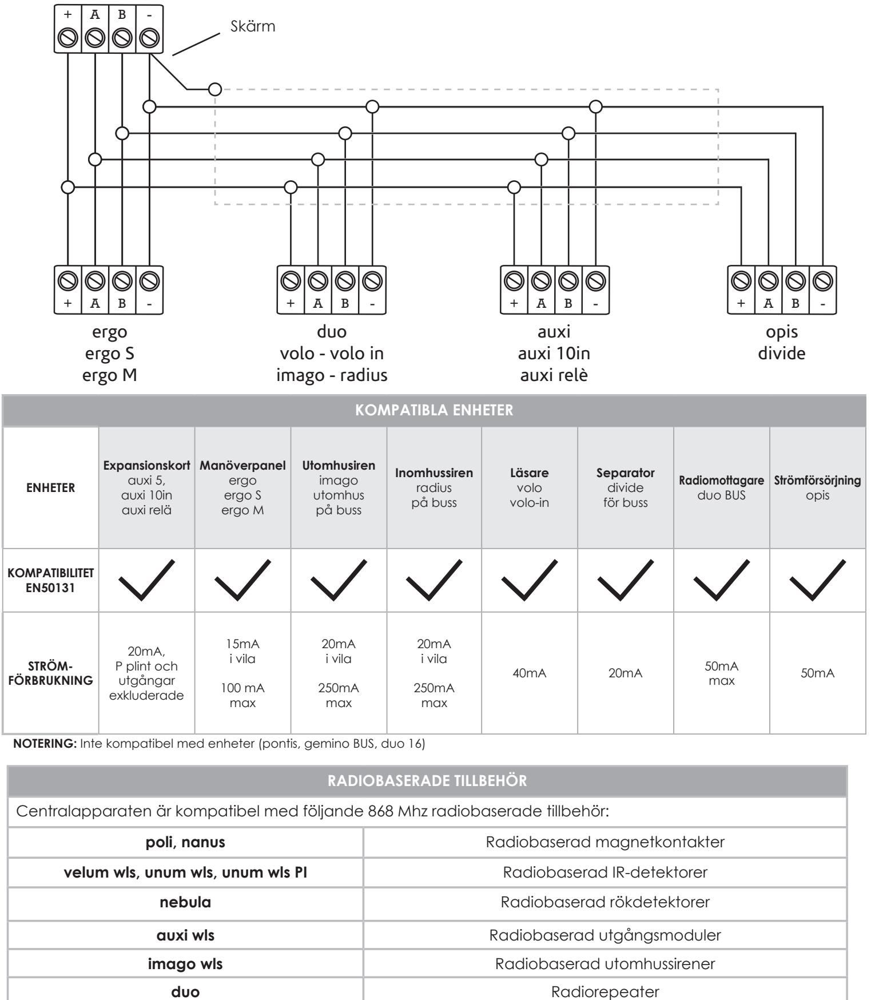

**opera** Radiobaserad fjärrkontroll

#### **CENTRALAPPARAT KONFIGURATION**

#### **Centralapparat lares 4.0 kan programmeras på följande sätt:**

- **1.** Via fjärr, tack vare **APP Ksenia PRO** som finns tillgänglig för iOS och Android.
- **2.** Via fjärr, via portal: **www.kseniasecureweb.com.**
- **3.** Via **webserver**, uppkopplad via lokalt eller peer-to-peer till centralapparat.

Generellt så kan alla konfigurationer utföras med användning av någon av metoderna som beskrivits ovan; De få undantagen rapporteras i följande avsnitt.

### **NOTERING:**

- **• Grundprogrammerad installatörskod är 123456.**
- **• För att erhålla access till "Installatörsmenyn" för att programmera är inte möjligt om systemet är tillkopplat eller om systemet har blivit blockerat av någon användare**.

#### **1. PROGRAMMERING VIA APP:**

Ladda ner appen 'SecureWeb' för en mobil enhet via AppStore eller PlayStore. Logga in på appen med samma inloggningsuppgifter som du använder för att logga in på 'Reserved Area' på websidan **www.kseniasecurity.com**, om du inte är registerad än måste det ske på ovanstående hemsida.

Registering är strikt personlig och tillåter programmering av obegränsat antal centralapparater.

För att lägga till en enhet klicka på "Enheter", där listas alla centralapparater och som är redo att programmeras. För att konfigurera en ny centralapparat trycker du på + (högst upp till höger), skannar QR-koden som finns på moderkortet eller anger manuellt det 16-siffriga serienumret.

### **2. PROGRAMMERING VIA MOLNTJÄNST OCH WEBLÄSARE:**

Den använder tjänsten Ksenia´s molntjänst **SecureWeb**, via portalen:

**www.kseniasecureweb.com**, som är reserverad Ksenia-installatörer. Logga in på appen med samma inloggningsuppgifter som du använder för att logga in på 'Reserved Area' på websidan **www.kseniasecurity.com**, om du inte är registerad än måste det ske på ovanstående hemsida.

Registering är strikt personlig och tillåter programmering av obegränsat antal centralapparater.

För att lägga till en enhet klicka på "Enheter", där listas alla centralapparater och som är redo att programmeras. För att konfigurera en ny centralapparat trycker du på + (högst upp till höger) och anger manuellt det 16-siffriga serienumret som du hittar på moderkortet och klicka sen på "Registrera ny centralapparat".

### **3. PROGRAMMERING LOKALT VIA WEBSERVER:**

Lokalt uppkopplad via webserver. Centralapparaten har alltid som standard DHCP aktiverad, då finns det två möjligheter att ta reda på IP-adressen: via manöverpanelen, går du in i installatörsmenyn eller använder en webläsare och web servern och anger: **https://KS-BOARD-xx-yy-zz** (ersätter xx-yy-zz med de sista sex siffrorna i MAC-adressen som finns på etiketten). Om nätverket inte har en DHCP server eller du är direktansluten med en nätverkskabel mellan dator och centralapparart är standardadressen **https://192.168.2.97**.

#### **Notering: s´Som grundprogrammerat kommunicerar bara centralapparaten via protokoll för krypterad transport av data (https) på port 443.**

#### **INSTALLATÖRSMENY (MANÖVERPANEL)**

I detta avsnitt beskrivs hur man programmerar systemet via manöverpaneI. För att komma till installatörsmenyn ange installatörskod (grundprogrammerat **123456**).

I installatörsmenyn används följande knappar för att navigera:

- **ENTER**: För att öppna meny och bekräfta val.
- **ESC:** Minst att gå tillbaka till föregående meny.
- **UP PIL, SKROLLA MEDURS**, **NED PIL, SKROLLA MOTURS** för att skrolla i menyer.

#### **Menyträd i installatörsläget:**

- **• Systemhantering** Systemhantering
**Återställa larml:** Alla larm stoppas, sabotage och larmminne kommer raderas.

**Stoppa larm:** All pågående larmöverföring och larmkommunikation som ligger i kö (SMS, talmeddelanden, e-post, etc.) kommer att raderas.

**Låsa system:** Följande val kan väljas att låsas:

**Inget lås:** Normalt driftläge.

 **Låsa larm:** Ingen åtgärd gällande larm kommer att ske. **Låsa åtgärder:** Centralapparaten är låst inget åtgärder kommer att utföras.

- **• Användarhantering:** Här kan RF-ID brickor läggas till användare.
- **• Händelselogg:** Händelselogg för alla händelser med förklaringar.
- **• Fellista:** Lista på problem.
- **• Sektionstatus:** Lista på programmerade sektioner.
- **• Sektionstest:** Test av sektioner.
- I**nstallatör:** Uppgifter om installatören: **Ändra kod:** Ändra installatörskoden **Beskrivning** Namn på installatör. **Nummer:** Telefonnummer till installatör.
- **• Uppdatera:** För att uppdatera firmware från SD kort.
- **• Backupp:**

**Skapa ny:** Programmerad data kommer att sparas på SD kortet.

**Återställa:** Programmerad data kommer att läsas från SD kortet och programmera om centralapparaten. **• Netvärk:** Nätverksinställningar, för att läsa och ändra nätverksinställningar:

**IP adress**

### **Subnet mask**

#### **Gateway**

**DHCP server:** Denna meny visas endast om centralapparaten har en statisk IP adress och tanken är att aktivera DHCP.

- **• Språk:** Val av språk i manöverpanelen.
#### **SKILLNADER MELLAN LARES OCH LARES 4.0**

**lares 4.0** plattform innehåller otaliga innovationer, i det här avsnittet beskrivs de viktiga skillnaderna jämfört med den tradionella lares plattformen (lares 16IP/48IP/128IP), informationen är framtagen för att hjälpa installatörer som vanligtvis installerade lares att migrera till den nya plattformen.

#### **Det här avsnittet kan också användas som en snabbguide för snabb åtkomst till konfigurationen.**

#### **Från hårdvarans synvinkel, med hänvisning till moderkortet, är huvudskillnaderna följande:**

- Det finns 8 ingångar (och inte 6).
- Det finns 2 konfigurerbara in / utgångar (och inte 4).
- Ingångar plint Ix och in / utgångar plint Mx i centralapparaten om de är konfigurerade som en sektion, kan det inte hantera direkt en interiasensor.
- Matningsspänningen på kortet är 15Vdc (och inte 14.2V).
- Det finns möjlighet till två tilläggsmoduler, en för PSTN-anslutningen och en annan för GSM (3G och i framtiden 4G).
- Modeller **lares 4,0 40 wls, lares 4,0 140 wls, lares 4,0 644 wls** har två bussar som är helt oberoende av varandra.
- Lares versioner **lares 4,0 40 wls, lares 4,0-140 wls, lares 4,0 644 wls** har integrerad 868 MHz radiomottagare på kretskortet. Detta fungerar som en alternativ huvudmottagare till en av mottagarna på bussen. Det är möjligt att inaktivera mottagaren ombord för att ansluta två mottagare på BUS. Centralapparaten stöder alltid två repeaters.
- Moderkortet har en SD-korts plats som för närvarande används för säkerhetskopiering av programmering, för att återställa från en sparad konfiguration och för uppdatering av firmware.

Gällande kommunikationsbussens synvinkel är all kringutrustning kompatibla, med undantag för gemino BUS, pontis, duo 16.

Gällande programmering kan lares 4.0-plattformen inte programmeras av PC-program basis. Programmering sker via gränssnittet i webbservern, och via app **Ksenia PRO** och via portalen **www.kseniasecureweb.com** eller genom att ansluta direkt till centralapparaten via en nätverkskabel.

Vid direkt anslutning med en nätverkskabel är standardinställningen med centralapparat är protokollet för krypterad transport av data därför måste IP adressen anges https: //.

Det är testat med olika webbläsare, men rekommenderat att helst använda Google Chrome. Vid uppkoppling till en centralapparat kan du se nuvarande programmeringen som används för närvarande i centralapparaten. För att ändra en programmering måste du öppna en session genom att trycka på penn ikonen i övre högra hörnet.

I den här fasen kan du göra alla ändringar i programmeringen. Om det finns felaktig information anges dessa med ett rött utropstecken ovanför spara ikonen och förhindrar att data sparas tills dessa avvikelser har åtgärdats. När du sparar en konfiguration tillämpas inte den programmeringen i centralapparaten, för att programmeringen ska tillämpas, är det nödvändigt att trycka på V-ikonen.

### **När det gäller programmering är huvudskillnaderna följande:**

- Det finns en ny gruppering, kallad Hashtags (smarta etiketter), som kan tillämpas på sektioner, utgångar, användare, manöverpaneler och läsare. Från scenarierna är det möjligt, till exempel, aktivera två utgångar individuellt (exempel belysning 1 och belysning 2, men om man har associerat dem med en Hashtag #belysning, aktiverar utgångarna med #belysning, kan man med ett kommando låta centralapparaten att inaktivera båda två samtidigt.
- BUSS och trådlösa enheter är grupperade efter typ och identifieras individuellt, så att centralapparaten på lämpligt sätt kan hantera även de minsta skillnaderna mellan dem. Till exempel på lares 16IP/48IP/128IP i basis finns det bara en modell av manöverpanel, på lares 4.0 finns **ergo** (och **ergo-rev.0**, hårdvaruversion av ergomanöverpanel fram till maj 2017) samt **ergo S** och **ergo M**.
- Sektionstillhörigheten av vad en sektion ska tillhöra för plint i centralapparat eller expansionskort görs direkt i programmeringen av sektioner, och att man även associerar den med tillgängliga kringutrustning.
- Utgångar har ett funktionssätt att dom styrs av när larm utlöses i områden, det är alltså inte nödvändigt att konfigurera ett scenario för att aktivera utgångar.
- Timers finns inte längre, men dessa har ersatts av virtuella utgångar, i kombination med utgångsaktivering och utgångsdeaktivering av händelser.
- För varje utgång är det också möjligt att välja olika aktiveringslägen i lokalt eller via fjärr när en utgång ska styras via APP, vilket möjliggör till exempel en aktivering av en utgång lokalt i ett nätverk utan PIN kod och via fjärr med PIN kod.
- Adressboken med koder, brickor och fjärrkontroller grupperas nu i en ny struktur, kallad användare. För varje användare kan man välja vilken typ av meddelande som ska tas emot, tilldela en PIN-kod, en bricka och en fjärrkontroll (endast i det sista fallet med fjärrkontroll begränsas till högst 64 användare).
- Beroende på storlek av centralapparat kan upp till 512 scenarier konfigureras, vilka alla också kan hanteras på distans (vilket överstiger gränsen med råge på 10 på lares 16IP/48IP/128IP plattformen). Scenarierna är en lista över maximalt 16 åtgärder, som kan hantera **utgångar** (aktivering, deaktivering, växling), **sektioner** (förbikoppling, inkoppling, växling), **användare** (aktivering, inaktivering), **områden** tillkoppling / frånkoppling.

### **• Tillkopplingslägen kan aktiveras med 4 forceringsnivåer:**

| TIllkoppling med EN50131:                    | Områden kan endast tillkopplas om alla sektioner är stängda.                                                                                            |
|----------------------------------------------|---------------------------------------------------------------------------------------------------------------------------------------------------------|
| Manual BY-PASS:                              | Manuell förbikoppling - om det finns öppna sektioner vid tillkoppling så kommer manöverpanelen att fråga om att öppna sektioner ska förbikopplas. |
| Forcerad tillkoppling:                       | Tillkoppling sker även om det finns öppna sektioner, men systemet utlöser larm.                                                                      |
| Forcerad tillkoppling med autoförbikoppling: | Om det finns öppna sektioner vid tillkoppling kommer dessa att automatiskt förbikopplas.                                                             |

- För varje scenario är det också möjligt att välja olika aktiveringslägen i lokalt eller via fjärr via APP, vilket möjliggör till exempel en aktivering lokalt i ett nätverk utan PIN kod och via fjärr med PIN kod.
- Scenarierna tilldelas sedan att tillhöra specifika händelser för att aktiveras, grupperade efter kategori.
- För att skicka olika meddelanden (SMS, talmeddelanden, e-post, etc) måste kontaktlistor skapas och sedan associeras i avsnittet Meddelanden till händelser som ska rapporteras.
- För att skapa talmeddelanden ska det ske med **text-till-tal Loquendo,** det kan dock endast ske via portalen **www.kseniasecureweb.com**, efter att ha köpt en licens (en för varje företag) som finns på ett skrapkort.

Med manöverpanel kan inga funktioner programmeras. När installatörsmenyn öppnas med installatörskod stoppas inte den normala funktionen i systemet. För att blockera larm och övriga funktioner är det nödvändigt att välja Blockera larm eller Blockera Åtgärder i Sys. konfigurationsmenyn.

#### **PROGRAMMERING AV CENTRALAPPARAT**

Samma gränssnitt finns tillgängligt via portalen **www.kseniasecureweb.com**, via **Ksenia PRO** mobil APP, eller med direktanslutning. Gränssnittet och visning anpassar sig automatiskt till upplösning och skärmstorleken på skärm som används. Det kan vara PC / MAC, surfplatta eller smartphone.

I det här avsnittet beskrivs huvudfunktionerna som finns i menyn, medan detaljerna finns i programmeringshandboken.

- **• Hem:** Det är startsidan för programmeringen, den innehåller systemets realtidsinformation, versionsinformation, och 10 senaste händelserna i händelseloggen.
- **• Inställningar:** Innehåller två flikar: **Allmänna inställningar:** Inställningar som påverkar systemet i allmänhet. **Nätverk:** Nätverksinställningar.
- **• Händelselogg:** Den här sidan visar centralapparatens händelselogg.
- **• Hashtags:** Programmering av hashtags, "smarta etiketter" som kan tilldelas sektioner, utgångar, manöverpaneler och användare.
- **• Områden:** Programmering av områden.
- **• Busstillbehör:** Innehåller 5 flikar, för att konfigurera enheter som är anslutna på bussen: **Expansionsmoduler:** Programmering av auxi, auxi 10, auxi reläer / auxi-L. **Isolatorer:** Programmering av strömförsörjning opis och separator divide. **Radiomottagare:** Programmering av radiomottagare duo. **Manöverpaneler:** Programmering av manöverpaneler ergo (rev.0), ergo S, ergo M, ergo, volo och volo-in. **Sirener:** Programmera bussirener: Imago BUS och radius BUS.
- **• Radiobaserade tillbehör:** Innehåller 4 flikar, för att programmera radiobaserade 868 MHz-enheter: **Radiobaserad sirener:** Det gör det möjligt att konfigurera sirener imago wls. **Radiobaserade repeater:** Programmering repeater duo (inställd som repeater). **Radio I/O-moduler:** Programmering av radio I/O moduler auxi wls. **Radiobaserade detektorer:** Programmering av magnetkontakter, (poli och nanus), av IR-detektorer unum wls och velum wls och av rökdetektorer nebula wls.
- **• IP-kameror:** Programmering av IP-kameror.
- **• Layout:** Innehåller 8 flikar, för systemkonfiguration: **Tillkopplingsslägen:** Konfiguration av de olika tillkopplingslägen som är länkade till områden. **Sektioner:** Programmering av sektioner (ingångar). **Utgångar:** Programmering av utgångar (även virtuella - Timers). **Användare:** Programmering av användare (adressbok, koder, taggar, fjärrkontroller). **Scenarier**: Programmering av scenarier (lista över åtgärder). **Händelser:** Programmering av händelser, som scenarierna är associerade med. **Kontaktlistor**: Listor över användare som erhåller larmmeddelanden. **Meddelanden:** Programmering av vilka händelser som ska skickas till kontaktlistan för att i sin tur skicka röstalarm, sms, e-post, etc.
- **• Realtid:** realtidsfönster för systemstatus.
- **• Röstmeddelanden:** Sida för att genera talmeddelanden (inte tillgänglig via direktanslutning).

#### **ANVÄNDARANVISNING ergo LCD**

I detta avsnitt beskrivs hur manöverpanel ergo används

#### **MANÖVERPANELENS HANDHAVANDE**

V.g se manual för ergo LCD KEYPAD för knappar och menyer.

#### **ÖVRE RADEN PÅ DISPLAYEN**

När manöverpanelen är i standby läge visas systemstatus på den övre visningsraden. Information som kan visas är (i prioriterad ordning):

- **• PROGRAMMERING:** Centrapparaten utför en ny programmering.
- **• TILLBEHÖR SAKNAS:** En eller flera busstillbehör saknas (kommunicerar inte med centralapparaten).
- **• ÅTGÄRDER BLOCKED:** Installatören har blockerat åtgärder i centralapparaten (se Installatörsmenyn Systemhantering-Blockering).
- **• LARM BLOCKERAD:** Installatören har blockerat larm från centralapparaten ((se Installatörsmenyn Systemhantering-Blockering).
- **• SABOTAGE:** Minst ett område som manöverpanelen styr är i sabotage.
- **• LARM !:** Minst ett område som manöverpanelen styr har utlöst larm.
- **• SABOTAGE MINNE:** Minst ett område som manöverpanelen styr har ett sabotageminne (sabotagelarm har utlösts tidigare).
- **• LARMMINNE:** Minst ett område som manöverpanelen styr har ett larmminne (larm har utlösts tidigare).
- **• FEL FINNS:** Minst ett fel finns.
- **• FEL HAR FUNNITS:** Åtminstone ett fel har uppstått, men finns ej kvar längre.
- **• INPASSERINGSTID:** Minst ett område som manöverpanelen styr har aktiverat inpasseringsvarning.
- **• UTPASSERINGSTID:** Minst ett område som manöverpanelen styr har aktiverat utpasseringsvarning.
- **• TILLKOPPLINGSVARNING:** Minst ett område som manöverpanelen styr har aktiverat tillkopplingsvarning.
- **• UPPRINGNING PÅGÅR:** en uppringning är startad.
- **• FBK / TEST SEKTION:** Minst en sektion är i testläge, eller är manuellt förbikopplad.
- **• SYSTEM OK:** Systemet är OK. inga fel eller larm föreligger.
- **• INFO FINNS:** Denna information är endast synlig om centralapparaten är programmerad att följa EN50131 grade 3. Nu visas inte systemstatus automatiskt, informationen innebär att det finns något att kontrollera, men kan avläsas först efter att en behörig kod har angetts.

#### **DISPLAY NEDRE RADEN**

Informationen som normalt visas på manöverpanelen övre display rad kan inaktiveras av installatören. Om så är fallet, för att visa denna information måste en giltig användarkod eller en giltig bricka användas.

På övre raden visas texten **"Ksenia Security"** om allt är okej, om fel finns så visas **"INFO FINNS"**. Om systemet är frånkopplat så visas alltid "Ksenia Security".

Informationen på den nedre raden kan anpassas per manöverpanel. Följande information kan väljas:

- Tid och datum.
- Tillkopplingsstatus (aktivt scenario).
- Utomhustemperatur (minst en extern siren imago BUS måste finnas i systemet).
- Inomhustemperatur (minst en inomhussiren radius BUS eller manöverpanel med temperaursensor måste finnas ii systemet).
- GSM-operatör.
- Påverkade sektioner.

**NOTERING!** När man är i en användarmeny kommer manöverpanelen att återgå till standby om ingen knappar har tryckts ner inom 30 sekunder.

### **FUNKTIONER i STANDBYLÄGE**

I standby-läget kan 6 olika åtgärder göras med hjälp av knappar:

- **• ENTER-tangen**t: Visar mer information om systemstatus (övre raden) som kan bläddras med hjälp pilknappar eller scroll hjulet.
- **• #** Knapp: områdesstatus, som kan bläddras med hjälp pilknappar eller scroll hjulet.
- **• *** Knapp: sektionsstatus, som kan bläddras med hjälp pilknappar eller scroll hjulet.
- **• 0-9** knappar (nedtryck i minst 3 sekunder): Aktiverar vald macro åtgärd (om det är programmerat och aktiverat).
- **• 0-9** knappar: För att ange en användarkod (standard: 000001).
- **• ESC**-knapp (i minst 3 sekunder): Fryser manöverpanel för rengöringsändamål.

Om manöverpanelen inte är inprogrammerad i systemet visas endast **"SYSTEM OK"** och användarkoder är inaktiverade. Installatörskoden är alltid aktiverad.

#### **ANVÄNDFUNKTIONER / SCENARIER**

Användarkoden är alltid 6 siffror lång. Efter att en användarkod har angetts så kan användaren välja i en lista över scenarier (med start av den mest använda, baserade på funktioner som är programmerade) eller huvudmenyn. Till exempel:

Två scenarier är alltid aktiverade; knapp 0 ('**Frånkoppling**') och knapp 1 ('**Tillkoppling**'). När kod anges så kommer manöverpanelen att föreslå att utföra den mest använda av dessa. Om ingen tangent trycks in inom 3 sekunder kommer föreslaget scenario att utföras och manöverpanelen kommer att återgå till viloläge.

**SNABBKNAPPAR:** För en snabbare användning kan användaren även mata in användarkoden. följt av siffran för det önskade scenariot eller med # (FYRKANT) -knappen för att komma in i användarmenyn.

#### **UTFÖRA FLERA SCENARIER I SAMMA SEKVENS**

Efter inmatning av användarkod kan en siffra matas in följd av **ENTER**-knappen. Det valda scenariot kommer att utföras, och nu är det möjligt att trycka en annan siffra, följt av **ENTER**-knappen. Det nya scenariot kommer att utföras också, och så vidare. Med hjälp av **ENTER**-knappen kan användaren utföra fler scenarier med att användarkoden anges endast en gång. Det är också möjligt att använda scrollhjulet för att välja ett scenario och utföra det med hjälp av **ENTER**-knappen.

### **HUVUDMENY**

#### **För att gå in i en undermeny måste ENTER-tangenten användas.**

- **• Återställ larm:** Pågående larm stoppas och larmminnet raderas.
- **• Områdesstatus:** Områdesstatus för områden att visas.
- **• Sektionsstatus:** Sektionens realtidsstaus visas. dessutom använder du ENTER-tangenten igen så kommer sektioner förbikopplas.
- **• Ändra KOD:** Välj detta alterntiv för ändra koden.
- **• Ergo-alternativ:** Om du väljer det här alternativet kan parametrarna för ergo-manöverpanelen ändras. **Bakgrundsbelysning:** Bakgrundsbelysningsnivån kan väljas från normal, maximal och ekonomi. **Volym:** Volymen kan väljas från normal, hög, max, låg, av. **Varning:** Varningsfunktionen kan aktiveras eller inaktiveras. **Knappkänslighet:** Känsligheten för knapparna kan väljas från låg, medium, hög.
- **• Avancerade alternativ:** Se val i nästa stycke.
- **• Problemlista:** Lista över problem kommer att visas.
- **• Stoppa samtal:** Den här åtgärden stoppar och återställer all pågående larmkommunikation (telefonsamtal, sms och e-post).

#### **ADVANCERADE ALTERNATIV**

Denna meny kan endas nås om en huvudkod först anges.

- **• Händelselogg:** Händelselogg med alla händelser som visar nyaste händelsen först. När ENTER knappen trycks in kommer mer information att visas.
- **• Aktivera underhåll:** Denna funktion aktiverar / deaktiverar möjlighet för installatören att få acces till systemet för underhåll.
- **• Testrapport:** Denna funktion generear en periodisk testrapport. Den befintliga periodiska testrapporteringen med programmerad timer kommer inte att påverkas av detta test.
- **• Datum och tidinställning:** För att ställa datum och tid.
- **• Nätverk:** Inställning nätverksinställningar:
	- **IP address Address mask Gateway address**
- **• Användarhantering:** Det här alternativet tillåter huvudanvändaren att hantera användarparametrar. **Beskrivning:** Användarbeskrivningen kan ändras. **Hantera koder:**

 **Aktivera kod:** Aktivera / inaktivera den valda användarkoden. **Ändra kod:** Ändra koden för den valda användaren. **Aktivera bricka:** Bricka kan aktiveras eller inaktiveras. **Fjärrkontroll:** Fjärrkontroller kan aktiveras eller inaktiveras.

- **• Unum WLS LED:** För att aktivera den röda lysdioden i varje trådlös rörelsedetektor varje gång detektor kommunicerar med centralapparaten. Detta är mycket användbart för att verifiera funktion i rörelsedetektor och test av det trådlösa nätverket. Funktionen är aktiv i 10 minuter.
- **• Byt ut LEXAN:** det här alternativet tillåter användaren att öppna manöverpanel ergo utan att sabotagelarm utlöses (för att byta LEXAN inlägg). Vänligen se separata ergo manualen för öppning manöverpanelen.

#### **RFID BRICKOR**

RFID brickor beter sig precis som användarkoden gör. Lägg RFID-brickan mot loggan på manöverpanelen för att få access till systemet för att till- och frånkoppla och styra systemet via manöverpanelen.

### **Avfallshantering (RAEE-direktivet)**

Varning! Använd inte ett vanligt sopnedkast för att kassera denna utrustning.

Använd elektrisk och elektronisk utrustning måste behandlas separat i enlighet med den relativa lagstiftningen som kräver korrekt behandling och återvinning av begagnad elektrisk och elektronisk utrustning. Efter genomförandet av direktiv i medlemsstaterna kan privata hushåll inom EU återlämna sin använda elektriska och elektroniska utrustning till utsedda inkassofaciliteter gratis *. Lokala återförsäljare kan också acceptera begagnade produkter kostnadsfritt om en liknande produkt köps från dem.

Om elektrisk eller elektronisk utrustning används avr batterier eller ackumulatorer, måste dessa kasseras separat enligt lokala bestämmelser. Korrekt bortskaffande av denna produkt garanterar att den genomgår nödvändig behandling, återvinning och återvinning. Detta förhindrar eventuella negativa effekter på både miljö och folkhälsa som kan uppstå genom olämplig hantering av avfall.

### *** Kontakta lokal myndighet för ytterligare information.**

Installation av dessa system måste utföras strikt i enlighet med instruktionerna som beskrivs i denna bruksanvisning och i enlighet med gällande lokala lagar och stadgar. Denna produkt har designats och tillverkats med högsta kvalitet och prestanda som Ksenia Security antog. Rekommenderas att det installerade systemet ska testas fullständigt minst en gång i månaden. Testprocedurer beror på systemkonfigurationen. Rådgör medl installatören om vilka procedurer som ska följas. Ksenia Security ansvarar inte för skador som uppstår vid felaktig installation eller underhåll av obehörig personal. Innehållet i den här guiden kan ändras utan föregående meddelande från Ksenia Security.

- 

| KSI1410040.300 | Centrale / Control Panel / centrale d'alarme lares 4.0 - 40wls  |
|----------------|-----------------------------------------------------------------|
| KSI1410140.300 | Centrale / Control Panel / centrale d'alarme lares 4.0 - 140wls |
| KSI1410644.300 | Centrale / Control Panel / centrale d'alarme lares 4.0 - 644wls |
| KSI141X096.3XX | Centrale / Control Panel / centrale d'alarme lares 4.0 wls 96   |

## **MILJÖ**

**lares 4.0 är konstruerad och tillverkad med följande egenskaper för att minska dess miljöpåverkan:**

**INTYG**

T031:2017

- **Ingen PVC**
- **Halogenfria laminat och blyfritt PCBA**
- **Låg konsumtion**
- **Förpackningen realiserades huvudsakligen med återvunna fibrer och material**

Designad och tillverkad i Italien

T 014 / 1th Edition 2003 + A1:2002 + A2:2003 + A3:2005 CE

- EN50131-1 EN50131-3 EN50131-5-3:2005 + A1:2008 • EN50131-6 • EN50131-10 • EN50136-1:2012 • EN50136-2:2013

IMQ - SISTEMI DI SICUREZZA EN50131-3 GRADO / GRADE 3 CLASSE / CLASS II

