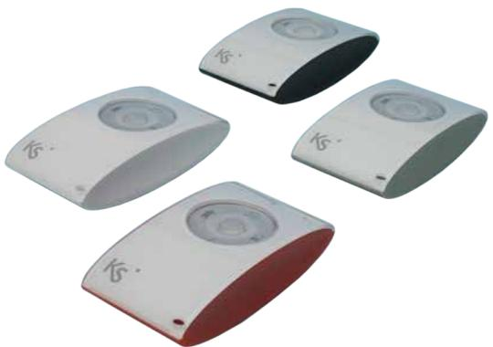
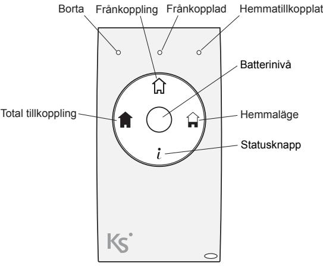
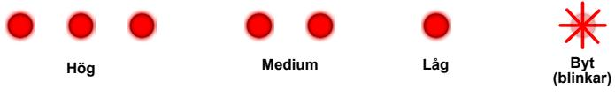
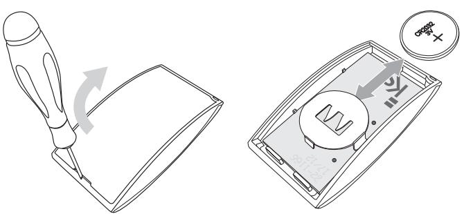

# **Fjärrkontroll opera, med radioöverföring - 12260-63**

Installationsanvisning

#### **Introduktion**

**opera** är en fjärrkontroll som snabbt och enkelt kan koppla till och från Ksenia larmsystem utan att behöva komma ihåg några koder. Flera fjärrkontroller kan användas till systemet och överfallslarm kan aktiveras genom lång intryckning av valfri knapp.

Tack vare den dubbelriktade kommunikationen kan fjärrkontrollen inte bara användas för att styra upp till sju olika funktioner utan också visa larmanläggningens status (tillkoppling, bortaläge eller hemmaläge) på tre lysdioder.

Aktivering av en funktion bekräftas med lysdiod och vibration (vibration måste aktiveras av installatören). Efter sändning och när mottagningen är bekräftad återgår enheten i viloläge, vilket ger en batterisparfunktion.

**opera** finns i Ksenias fyra standardfärger, vit, röd, silver och svart.

# **Handhavande**

Aktivering av funktioner med **opera** bekräftas genom att motsvarande lysdiod lyser rött och med en kort vibration (vibrationfunktionen måste aktiveras av installatören). Aktuella status visas också om statusknappen trycks in.

## **Felindikering**

Om aktivering av en funktion misslyckas (t.ex om man är utanför täckningsområdet) så indikeras det på fjärrkontrollen genom att alla tre lysdioderna blinkar samtidigt.

## **Batteri**

Tryck in centrumknappen "Batterinivå" för att visa batterinivån enligt nedanstående bild. När batteriet måste bytas blinkar en lysdiod.

#### **Batterinivån indikeras med lysdioderna**

## **Batteribyte**

Batteribyte sker enligt bilderna nedan.

*Varning! Använd endast rekommenderad batterityp, annars finns risk för explosion.* 

## **Inlärning**

- 1. Aktivera inlärningsläget från programmet **basis**.
- 2. Tryck in *i* -knappen under tre sekunder.
- 3. Se ytterligare information i programmeringsmanualen till **lares**.

# **Vibrator**

Vibratorn är en tillvalsfunktion som måste programmeras av installatören i programvaran **basis.** Vid leverans är vibratorn frånkopplad för att spara på batteriet. När vibratorn är tillkopplad kopplas den automatiskt ifrån vid låg batterinivå.

# **Teknisk specifikation**

| Batteri:          | 3 V, typ CR 2032A.                                                       |
|-------------------|--------------------------------------------------------------------------|
| Batterilivslängd: | Upp till sex år.                                                         |
| Frekvens:         | 868 MHz.                                                                 |
| Räckvidd:         | Upp till 400 m i öppen terräng.                                          |
| Vibrator:         | Justerbar och avstängningsbar i batterispar syfte (av installatören). |
| Arbetstemperatur: | + 5 till + 40 °C.                                                        |
| Mått (L x B x D): | 58 x 30 x 15 mm.                                                         |