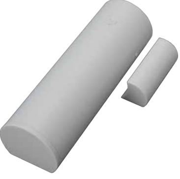
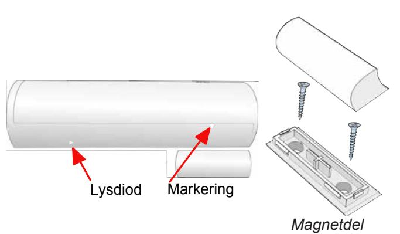
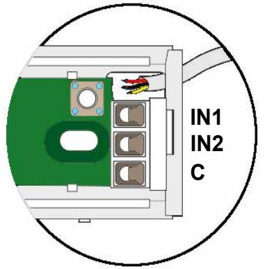
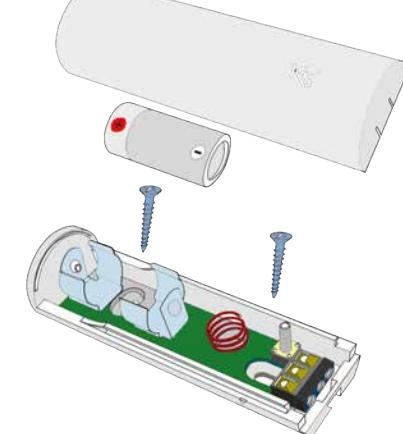

# **Magnetkontakt poli, med radioöverföring - 12254**

Installationsanvisning

### **Introduktion**

**poli** är en radiobaserad magnetkontakt med tvåvägs kommunikation och två extra programmerbara ingångar som t.ex. kan användas för att ansluta externa trådbundna magnetkontakter eller glaskrossdetektorer. Det innebär att den kan användas som en liten trådlös expansionsmodul (upp till 3 sektioner).

**poli** skickar regelbundet ett övervakningsmeddelande till **lares** (med en programmerbar pollning, standard 5 minuter), som skickar ett svarsmeddelande för att bekräfta överföringen. En lysdiod blinkar när enheten sänder ett larm, sabotage eller återställning inom 10 minuter efter skickad programmering. Vid låg batterinivå skickas en varning till mottagaren.

Batterilivslängden påverkas av följande faktorer:

- Signalstyrkan.
- Antalet gånger den öppnas / stängs (antal sändningar).
- Pollning.

**Notera:** Om pollningen ändras, så ändras det först i magnetkontakten när en programmeringen har skickats och magnetkontakten påverkas genom att t.ex. öppna eller stänga fönstret. Rekommenderad pollningstid är **15-20 min**.

# **Montering - installation**

Montera sändardelen upptill på dörr- eller fönsterkarmen och magnetdelen på dörrbladet eller fönstret. Kontrollera att magneten inte är längre än 10 mm ifrån markeringen på sändardelens sida när dörren eller fönstret är stängt.

**OBS!** Montera inte magnetkontakten på eller nära metallytor.

Radiostörningar kan förkorta sändningens räckvidd, prova därför alltid kommunikationen innan montering sker.

# **Inkoppling av extraingångar**

### **Inlärning**

- 1. Aktivera inlärningsläget från centralappaten **lares**.
- 2. Montera batteriet i magnetkontakten (se nedan).
- 3. Stäng magnetkontaktens kapsling.
- 4. Se ytterligare information i programmeringsmanualen till **lares**.

#### **Batteri**

Montera det medföljande batteriet enligt bilden ovan. Vid byte får endast batteri av typen 3V CR-123A användas. **poli** rapporterar låg batterispänning vid 1,8 V till radiomottagaren **duo**.

# **Teknisk specifikation**

| Batteri:          | 3 V, typ CR-123A.                                    |
|-------------------|------------------------------------------------------|
| Batterilivslängd: | Upp till fyra år beroende på pollning.               |
| Arbetstemperatur: | + 5 till + 40 ºC.                                    |
| Frekvens:         | 868 MHz.                                             |
| Räckvidd:         | Upp till 400 m beroende på omgivning.                |
| Mått (L x B x D): | Sändardel: 92 x 31 x 26. Magnetdel: 35 x 15 x 15. |

Godkännande: Europa / CE, Europa / EN50131-4