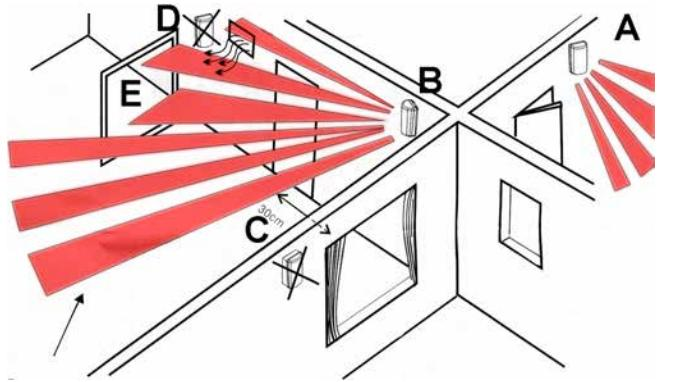
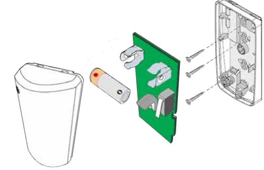
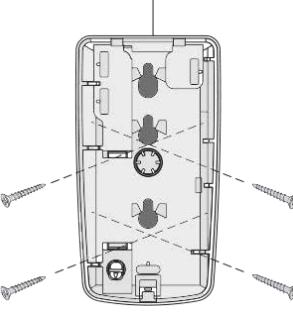
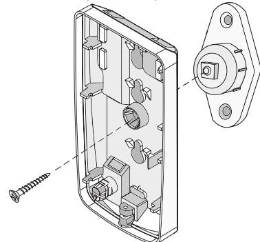
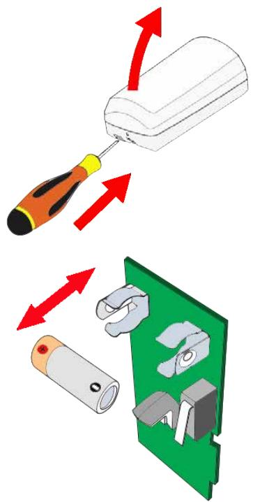

# **12252-53 - Radiobaserad IR-detektor unum WLS / unum WLS PI**

Installationsanvisning

#### **Introduktion**

**Unum WLS** är en radiobaserad IR-detektor (868 MHz). **unum WLS PI** har samma fina egenskaper som **unum WLS**, men är dessutom husdjursimmun och är konstruerad för att inte utlösa larm när husdjur (max. 10 kg) detekteras.

Detektorn har sabotageskydd i form av bortbrytningsskydd och skydd mot öppning av kapslingen.

**unum WLS** skickar regelbundet ett övervakningsmeddelande till **lares** (med en programmerbar pollning, standard 5 minuter), som skickar ett svarsmeddelande för att bekräfta överföringen. En lysdiod blinkar när enheten sänder ett larm, sabotage eller återställning inom 10 minuter efter skickad programmering. Vid låg batterinivå (2,1 V) skickas en varning till mottagaren.

Batterilivslängden påverkas av följande faktorer:

- Signalstyrkan.
- Antalet gånger den påverkas (antal sändningar).
- Pollning.

**Notera:** Om pollningen ändras, så ändras det först i IR-detektorn när en programmeringen har skickats och IR-detektorn har påverkas. Rekommenderad pollningstid är **15-20 min**.

Det är möjligt att stänga av PIR-sensorn när systemet är frånkopplat (standardinställning), vilket drastiskt minskar strömförbrukningen och ökar batteriets livslängd. Om detektorn används i system för hemautomatisering kan avstängningsfunktionen kopplas bort.

### **Montering**

- 1. Monteringshöjd 1,8 till 2,1 meter över området som ska detekteras.
- 2. Detektorn ska monteras så att en tänkt inkräktare passerar genom minst två avkänningsfält.
- 3. Se till att det är fri sikt över det detekterade området.
- 4. Väggtemperaturen ska vara ungefär samma som i det bevakade området.
- 5. Den ska riktas så att den inte "ser" mot fönster eller reflekterat solljus.
- 6. Montera detektorn minst 30 cm från fönster eller reflekterat ljus (C).
- 7. Montera inte detektorn nära värmekällor (D).
- 8. Detektorn kan inte detektera genom glas (E).

#### **Väggmontering**

- A. Detektorn monteras plant på vertikal vägg ( ± 2° ).

#### **Hörnmontering**

**B.** Hörnmontering sker med hålen i 45° i kapslingens bakstycke.

## **Montering med fäste** (tillbehör)

# **Inlärning**

- 1. Tryck på "**lär in radiobaserade enheter automatiskt"** i programmet basis.
- 2. Öppna detektorns kapsling, anslut batteriet och tryck sabotagekontakten
- 3. Stäng detektorns kapsling.
- 4. Se ytterligare information i programmeringsmanualen till **lares**.

## **Byte av batteri**

Demontera detektorns framstycke. Byt batteriet (3 V, typ CR123A).

# **Gångtest**

Gångtestläget aktiveras varje gång batteriet sätts på plats och kapslingens framstycke stängs. För att aktivera gångtestläget när detektorn är monterad måste kapslingen öppnas och batteriet tas bort. Sätt tillbaka batteriet och stäng kapslingen och gångtestläget aktiveras under 10 minuter. Vid detektering av nävaro blinkar lysdioden och det är minst 3 sekunder mellan varje indikering. Statusläget överförs till centralapparaten **lares** var 30:e sekund.

## **Teknisk specifikation**

| Batteri:          | 3 V, typ CR123A.                    |
|-------------------|-------------------------------------|
| Batterilivslängd: | Upp till 4 år beroende på pollning. |
| Frekvens:         | 868 MHz.                            |
| Räckvidd:         | Upp till 400 m i öppen terräng.     |
| Arbetstemperatur: | + 5 till + 40 °C.                   |
| Mått (L x B x D): | 113 x 60 x 45 mm.                   |