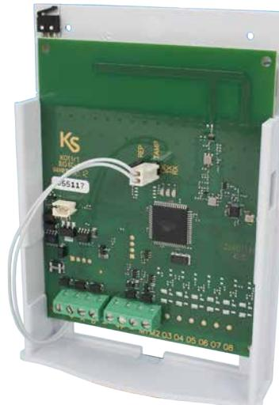
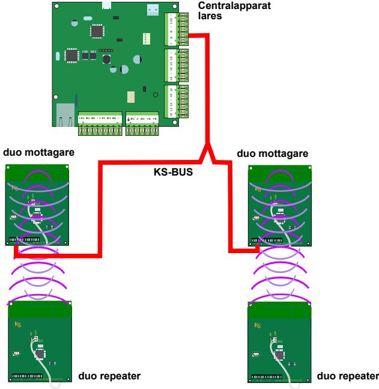
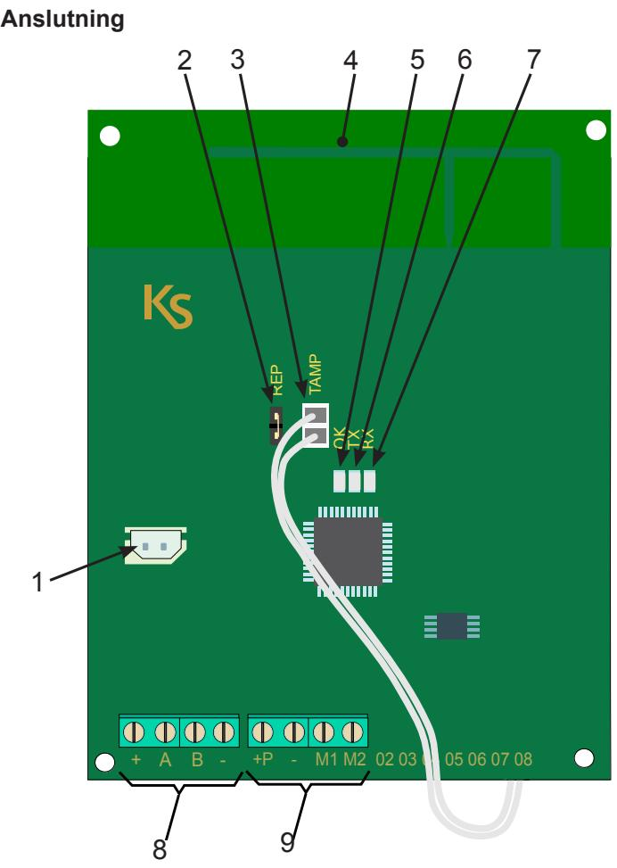
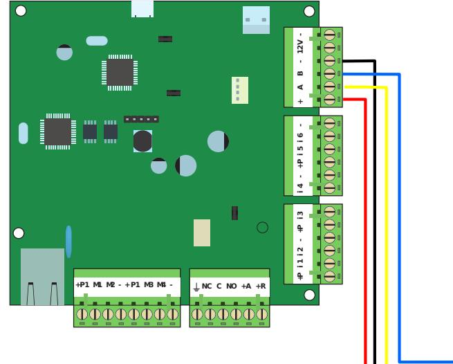
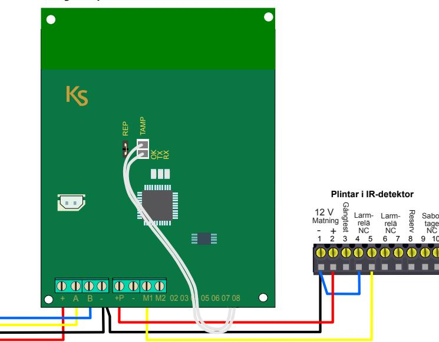
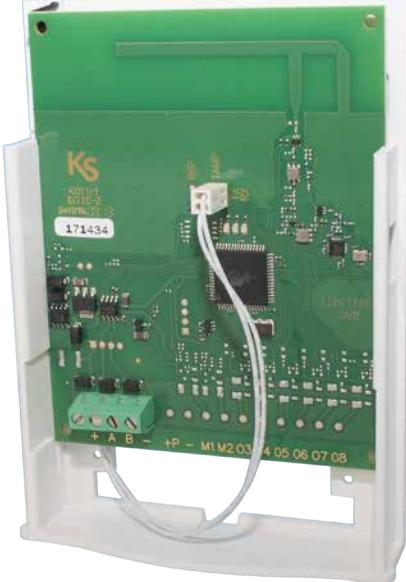
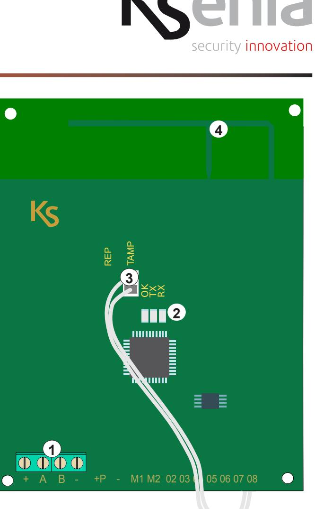

# **Radiomottagare/repeater duo 12250**

Installationsanvisning

# **Introduktion**

**duo** är radiomottagare eller repeater med dubbelriktad kommunikation som använder frekvensbandet vid 868 MHz och tar emot signaler från olika enheter (IR-detektorer, handsändare och magnetkontakter) och skickar dem vidare till centralapparaten **lares**.

**duo** kan användas som mottagare och anslutas via **KS-BUS**  eller som reapeter i det trådlösa systemet. Antennen är inbyggd på kretskortet.

I samma system kan maximalt 4 **duo** användas, två som mottagare och två som repeatrar.

Varje **duo** gör det möjligt att utöka en centralapparat **lares** med;

- 64 trådlösa sändarenheter (detektorer och magnetkontakter etc).
- 128 trådlösa sektioner.
- 20 **opera** fjärrkontroller.

Principbild som visar maximal utbyggnad av system med duo

- 1. Anslutning av lithiumbatteri 7,4 V (vid användning som repeater).
- 2. Bygelstift, bygel AV vid användning som repeater.
- 3. Anslutning av sabotagebrytare för larm vid öppning av kapslingen.
- 4. Inbyggd antenn på kretskortet.
- 5. OK lysdiod; fast sken vid korrekt funktion blinkar vid fel eller sabotagelarm.
- 6. TX lysdiod; lyser vid radiosändning.
- 7. RX lysdiod; lyser vid radiomottagning.
- 8. Plintar för anslutning av **KS-BUS**.
- 9. In- eller utgångsplintar, programmerbara samt detektormatning.

### **Repeater**

**duo** kan också fungera som en signalförstärkare/repeater och då behöver endast 12 VDC anslutas. Den konfigureras då som en repeater och gör det möjligt att fördubbla den trådlösa räckvidden. När duo används som repeater bestämmer systemet dynamiskt och automatiskt den bästa vägen för kommunikationen. **duo** kan även förses med ett laddningsbart 7,4 V lithiumbatteri som ger duo reservkraft vid ett strömavbrott. En bygel på kretskortet ska vara AV vid användning som repeater.

### **Inkopplingsexempel**

Här visas ett inkopplingsexempel för anslutning av **duo** till centralapparaten **lares** och anslutning av en IR-detektor till **duo**.

**Centralapparat lares Mottagare/Repeater Duo 64**

### **Tekniska data**

| Spänning:         | 13,8 VDC (KS-BUS)      |
|-------------------|------------------------|
| Strömförbrukning: | 50 mA                  |
| Frekvens:         | 868 MHz .              |
| Räckvidd:         | 400 m i öppen terräng. |
| Antal kanaler:    | Max. 64 st.            |
| Antal sektioner:  | Max. 128 st.           |
| Drifttemperatur:  | -5°C till +40°C        |
| Mått (H x B x D): | 140 x 100 x 28 mm      |

### **Godkännande**

Europa / CE Europa / EN50131-4 avsnitt 3 Reserv

Sabotage

> NC

# **Radiomottagare duo-16 12251**

# Installationsanvisning

# **Introduktion**

Radiomottagare **duo-16** är radiomottagare med dubbelriktad kommunikation som använder frekvensbandet vid 868 MHz och tar emot signaler från olika enheter (IR-detektorer, handsändare och magnetkontakter) och skickar dem vidare till centralapparaten **lares**.

**NOTERA: duo-16** kan endast användas till centralapparaterna lares 16/16IP och ansluts via **KS-BUS.** Antennen är inbyggd på kretskortet.

- 1. Plintar för anslutning av **KS-BUS**.
- 2. OK lysdiod; fast sken vid korrekt funktion blinkar vid fel eller sabotagelarm. TX - lysdiod; lyser vid radiosändning. RX - lysdiod; lyser vid radiomottagning.
- 3. Anslutning av sabotagebrytare.
- 4. Inbyggd antenn på kretskortet.

#### **Tekniska data**

| Spänning:                  | 13,8 VDC (KS-BUS).                |
|----------------------------|-----------------------------------|
| Strömförbrukning:          | 50 mA max.                        |
| Frekvens:                  | 868 MHz .                         |
| Räckvidd:                  | Upp till 400 m beroende på miljö. |
| Antal sektioner (trådlös): | Max. 16 st.                       |
| Drifttemperatur:           | +5°C till +40°C                   |
| Mått (H x B x D):          | 140 x 100 x 28 mm                 |