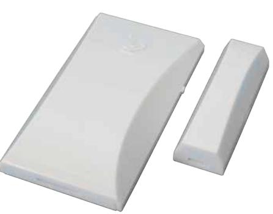
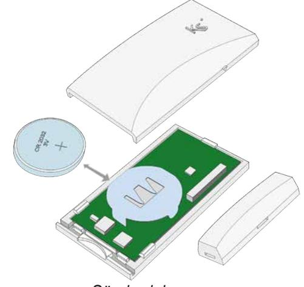

# **Magnetkontakt nanus poli, med radioöverföring - 12249**

Installationsanvisning

#### **Introduktion**

**nanus poli** är en liten radiobaserad magnetkontakt med tvåvägs kommunikation.

**nanus poli** skickar regelbundet ett övervakningsmeddelande till **lares** (med en programmerbar pollning, standard 5 minuter), som skickar ett svarsmeddelande för att bekräfta överföringen. En lysdiod blinkar när enheten sänder ett larm, sabotage eller återställning inom 10 minuter efter skickad programmering. Vid låg batterinivå skickas en varning till mottagaren.

Batterilivslängden påverkas av följande faktorer:

- Signalstyrkan.
- Antalet gånger den öppnas / stängs (antal sändningar).
- Pollning.

**Notera:** Om pollningen ändras, så ändras det först i magnetkontakten när en programmeringen har skickats och magnetkontakten påverkas genom att t.ex. öppna eller stänga fönstret. Rekommenderad pollningstid är **20-25 min**.

## **Montering - installation**

Montera sändardelen upp till på dörr- eller fönsterkarmen och magnetdelen på dörrbladet eller fönstret. Kontrollera att magneten inte är längre än 10 mm ifrån markeringen på sändardelens sida när dörren/fönstret är stängt.

**OBS!** Montera inte magnetkontakten på eller nära metallytor. Radiostörningar kan förkorta sändningens räckvidd, prova därför alltid kommunikationen innan montering sker.

## **Inlärning**

- 1. Aktivera inlärningsläget från centralappaten **lares**.
- 2. Montera batteriet i magnetkontakten (se nedan).
- 3. Stäng magnetkontaktens kapsling.
- 4. Se ytterligare information i programmeringsmanualen till **lares**.

*Sändardel*

## **Batteri**

Montera det medföljande batteriet enligt bilden ovan. Vid byte får endast batteri av typen 3V CR-2032 användas. **nanus poli** rapporterar låg batterispänning vid 1,8 V till radiomottagaren **duo**.

## **Teknisk specifikation**

| Batteri:          | 3 V, typ CR 2032.                                      |
|-------------------|--------------------------------------------------------|
| Batterilivslängd: | Upp till tre år beroende på pollning.                  |
| Frekvens:         | 868 MHz.                                               |
| Räckvidd:         | Upp till 250 m i öppen terräng.                        |
| Arbetstemperatur: | + 5 till + 40 °C.                                      |
| Mått (L x B x D): | Magnet; 36 x 12 x 14,5 mm. Kontakt; 53 x 30 x 9 mm. |

Godkännande: Europa / CE, Europa / EN50131-4