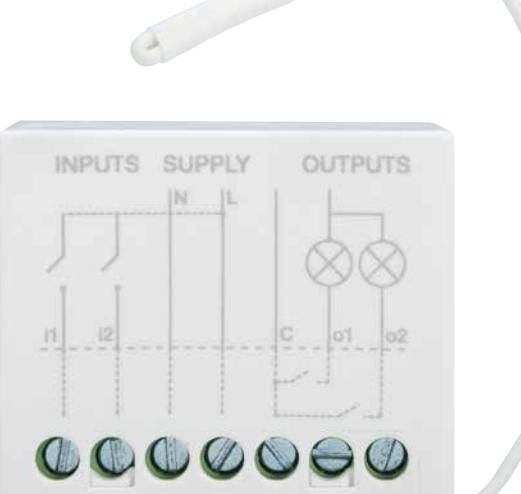
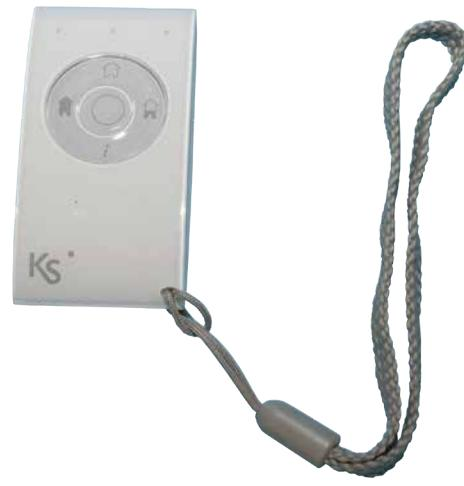
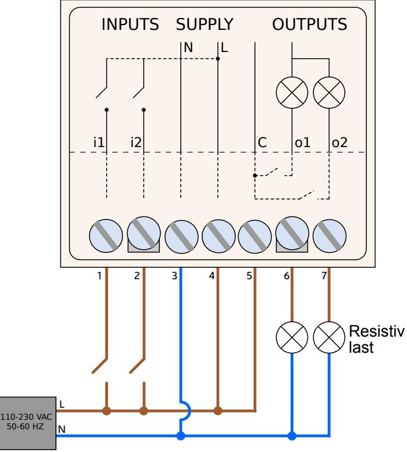

# **Radiobaserad expansionsmodul auxi 230V**

# **auxi wls**

## Produktbeskrivning

**Auxi wls** är en radiobaserad modul med två ingångar och två reläutgångar. Enheten drivs direkt med 230 VAC och reläutgångarna kan belastas med 1000 watt resistiv last. **Auxi wls** är idealisk för fjärrstyrning av belysning, hemautomatiseringar (såsom markiser och garageportar etc). **Auxi wls** kan användas till Ksenia larmsystem eller som en fristående enhet och utgångarna kan då styras via ingångarna på enheten eller med fjärrkontrollen **opera**  (beställs separat). Upp till 32 olika fjärrkontroller kan läras in för varje enhet. Den kompakta storleken gör det möjligt att montera den i små utrymmen som i t.ex. eldosor.

### Teknisk specifikation

| Strömförsörjning: | 110 - 230 VAC 50 - 60 Hz.      |
|-------------------|--------------------------------|
| Frekvens:         | 868 MHz.                       |
| Räckvidd          | Upp till 150 m öppen terräng.  |
| Ingångar:         | Två st, sluter till fas.       |
| Utgångar:         | Två st (5A 250 AC - 5A 30 VDC) |
| Arbetstemperatur: | -20 till +55 °C.               |
| Mått:             | 42 × 35 × 20 mm.               |
| IP-klass:         | IP20.                          |

### Beställningsinformation

| Produkt                   | Beställningsnr |
|---------------------------|----------------|
| Radiobaserad auxi 230V    | 12247          |
| Fjärrkontroll opera vit   | 12260          |
| Fjärrkontroll opera svart | 12261          |
| Fjärrkontroll opera grå   | 12262          |
| Fjärrkontroll opera röd   | 12263          |

