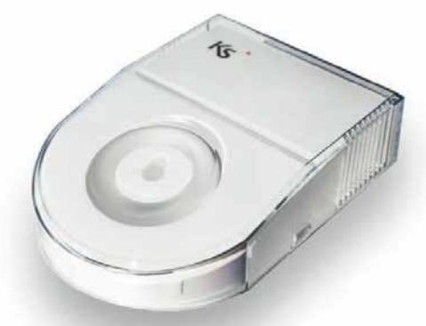
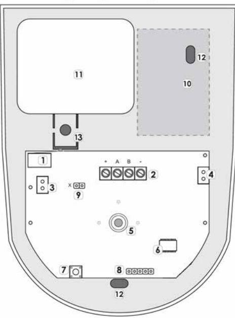
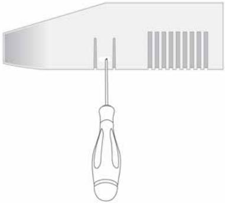
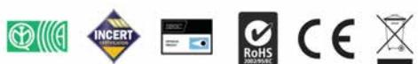

# radius Indoor siren & Emergency Light Installation guide

## **INTRODUCTION**

The radius self-powered indoor siren is actually a professional (acoustic & optical) sounder which shows a unique and exclusive design, extremely slim (max. 37 mm thick) associated with a modern technology aimed to combine the best possible performances with the maximum energy saving: very high sound pressure, 3W power LED Alarm Light which also acts as emergency light in case of main power's black-out. The siren is fully controlled by a microprocessor which checks the possible status of the device and sends the appropriate signal. The battery is steadily monitored and its malfunctioning immediately signalized to the lares 4.0 control panel.

On top of the automatic protection for preventing wire-cutting actions, radius is protected by 2 tamper switches against cover opening and against removal from the wall. The siren is equipped with a precision temperature sensor to display the indoor temperature in the ergo Ksenia keypads and for Home Automation applications.

## **DESCRIPTION OF THE PRODUCT**

#### **LEGEND**

- 1. Tamper protection
- 2. Connection clamps
- 3. Buzzer Connector
- 4. Battery Connector
- 5. Power LED
- 6. Microcontroller
- 7. Tamper protection
- 8. Reserved Connector
- 9. Programming Jumper X
- 10. Battery housing
- 11. Buzzer
- 12. Wall fixing holes

### **CONNECTION DESCRIPTION**

| TERMINALS DESCRIPTION |                                                                                                          |  |  |  |
|-----------------------|----------------------------------------------------------------------------------------------------------|--|--|--|
| + A B -               | A, B: KS-BUS terminals for lares 4.0 control panel. + , -: Siren power supply (12Vcc)                 |  |  |  |
| X Jumper              | X not present (default): connect the battery X present: the emergency light feature is not available. |  |  |  |

Complete configuration through lares 4.0 control panel. Refer to the Programming Manual of lares 4.0 control panel for further information.

If programmed, light emergency function will be activated when the panel detects a mains fault, with maximum 5sec. delay.

### **INSTALLATION**

The siren is provided partially assembled, ready for the installation. On the base are already present the board and the buzzer, it is provided the light diffuser and the cover with 4 colored lexans. Refer to the picture above (in paragraph "Description of the product"), the siren needs to be fixed on the wall using the point labeled with n.12. The cable should pass under the battery place.

For connection diagram refer to previous paragraph.

To enjoy light emergency feature you MUST connect the battery "KSI7207008.00 - Lithium-Ion Battery 7.4 Vdc-850 mAh" (optional) on connector label with n.4. **IMPORTANT: If battery is not used, set the jumper 'X' ON**. Place the battery.

Place the light diffuser using the fixing hole indicated with n.13. Chose the colored lexan cover and apply it on the base. Finally place the screw on the top of the cover.

To open the siren, press on the side opening with a screw-driver as shown on picture below.

#### **TECHNICAL DATA**

- Power Supply: 9 14Vdc
- Consumption: 15mA stand-by, 250mA max
- Ultra-modern design with additional Emergency Light function
- Acoustic and Lighting signal in case of wire cutting action
- High Sound Pressure Piezoelectric Buzzer (>100 dBA at 1m)
- Integrated Temperature Sensor: ±0,1°C
- Backup Battery
- Operative temperature: from +5° to +40 °C
- Dimensions (W x H x D): 102×142×37 mm max
- Weight (with battery): 300 g

### **QUANTITY DATA**

| lares 4.0 models                         | wls 96 | 16 | 40 | 40 wls | 140 wls | 644 wls |
|------------------------------------------|--------|----|----|--------|---------|---------|
| Maximum number of radius indoor siren | 1      | 6  | 24 | 24     | 40      | 64      |

Technical data, appearance, functionality and other product characteristics may change without notice.

#### **CERTIFICATIONS**

Europe CE EN50131- 4 Grade 3 class II T031:2014 SSF 1014 Larmklass 3

