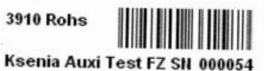
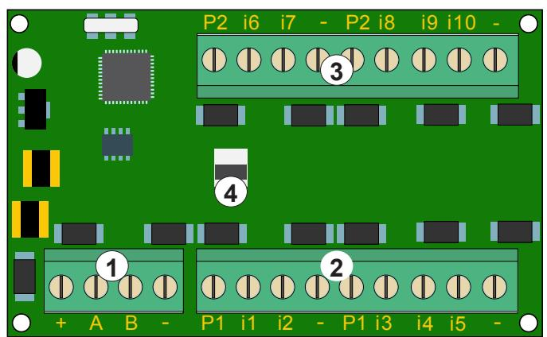

# **12166 - Expansionsmodul auxi 10 IN**

Installationsanvisning

## **Introduktion**

**auxi 10 IN** är en expansionsmodul som ökar antalet ingångar hos larmsändaren **gemino** eller centralapparaten **lares**.

**auxi** ansluts till **gemino** eller **lares** via den fyrtrådiga bussledningen KS-BUS. Den har 10 ingångar och tar upp två platser av expansionsmodul auxi i programmeringen.

Det är mycket enkelt att anpassa **auxi** till systemet, inga dipomkopplare behöver ställas in. **auxi** anpassar sig automatiskt till **gemino** och **lares** och identifierar sig med det unika serienummer som finns tryckt på en etikett på kretskortet.

Alla Ksenias kapslingar har hål för montering av expansionsmodul **auxi** 10 IN.

# **Serienummeretikett**

På kretskortet sitter en etikett med det unika sexsiffriga serienumret som identifierar enheten när flera expansionsmoduler ansluts i samma system.

Ovan visas ett exempel på en etikett med serienummer.

#### **Anslutning**

- 1. Anslutning av bussledningen KS-BUS.
- 2. Anslutningsplintar, ingångar som sluter eller bryter till minus (jord).
- 3. Anslutningsplintar, ingångar som sluter eller bryter till minus (jord).
- 4. Anslutning av sabotagebrytare.

#### **Plintar**

### **+, A, B, - :**

Plintar för anslutning till bussledningen KS-BUS.

# **P1:**

Plint för anslutning av strömförsörjning, skyddad av en 1,5 A självåterställande säkring.

- **(minus)**:
Jordplint, gemensam minus.

**Ingångar i1,i2,i3,i4,i5**:

Ingångar (expansionskort nr 1).

**Ingångar i6,i7,i8,i9,i10:**

Ingångar (expansionskort nr 2).

#### **Teknisk specifikation**

| Spänning:         | 13,8 VDC.                          |
|-------------------|------------------------------------|
| Strömförbrukning: | 20 mA (utom plint P och utgångar). |
| Ingångar.         | 10 ingångar.                       |
| Utgångar:         | Finns ej.                          |
| Strömmatning:     | 1,5 A automatisk termosäkring.     |
| Kretskortsmått:   | 75 × 60 × 15 mm.                   |