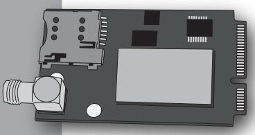
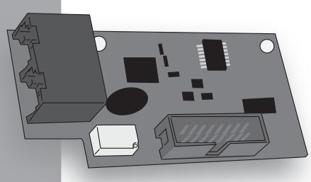

## **KSI4102000.300 Modulo GSM/GPRS per lares wls e lares 4.0 GSM/GPRS module for lares wls and lares 4.0 KSI4103000.300**

**Modulo 3G per lares wls e lares 4.0 3G module for lares wls and lares 4.0**

**Per l'installazione e la programmazione di questo dispositivo fare riferimento al manuale d'installazione Uso e Manutenzione della centrale lares wls 96-IP e lares 4.0.**

**NOTA: il dispositivo è fornito senza antenna, che deve però essere necessariamente installata per un corretto funzionamento. A seconda della installazione utilizzare una delle antenne compatibili presenti sul listino Ksenia Security.**

**Please refer to the Installation use and maintenance manual of the lares wls 96-IP and lares 4.0 for detail regarding the installation and use of this device.**

**NOTE: this device is provided without the antenna, that must be installed for proper functionality. According to the installation type, please select the right antenna available on the Ksenia Security price list.**

Classificazione secondo la EN50136-2, SP2 - SP4.

Classe ambientale II.

Il dispositivo può essere programmato per l'invio delle seguenti comunicazioni: messaggi vocali preregistrati; SMS; contact ID con protocollo SIA-DC03; segnalazioni via GPRS con protocollo SIA-DC09 con cifratura.

05/05/2017 R30027.100

## **KSI4200001.300 Modulo PSTN per lares wls e lares 4.0 PSTN module for lares wls and lares 4.0**

 **Per l'installazione e la programmazione di questo dispositivo fare riferimento al manuale d'installazione Uso e Manutenzione della centrale lares wls 96-IP e lares 4.0.**

**Please refer to the Installation use and maintenance manual of the lares wls 96-IP and lares 4.0 for detail regarding the installation and use of this device.**

Classificazione secondo la EN50136-2, SP2.

Classe ambientale II

Il dispositivo può essere programmato per l'invio delle seguenti comunicazioni: messaggi vocali preregistrati; SMS; contact ID con protocollo SIA-DC03; Menù vocale Contact ID

05/05/2017 R30027.100