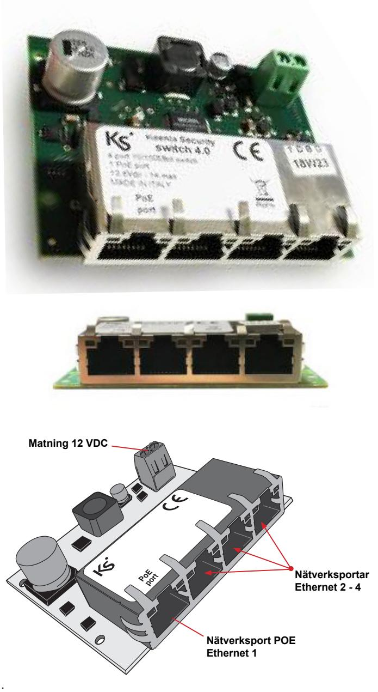
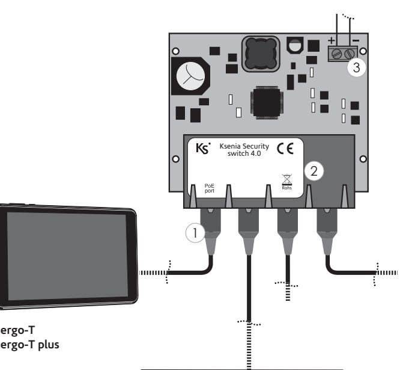
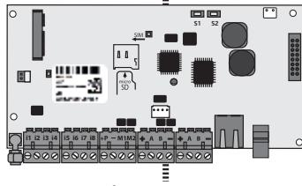

## **PoE Switch 4.0**

Installationsanvisning

**Allmänt PoE Switch 4.0**

PoE Switch 4.0 är en 10/100Mbit Ethernet POE switch avsedd för att monteras i larmsystem lares 4.0 för att användas tillsammans med touchpaneln ergo-T och ergo-T plus.

Den har 4 Ethernet-nätverksportar varav en som är PoE (Power over Ethernet) och avsett för ansluta nätverkskabel direkt till en ergo-T eller ergo-T plus. Enheten strömförsörjs direkt från centralapparat lares 4.0 och därför säkerställs matning till manöverpanelen oavsett nätbortfall.

## **Teknisk specifikation**

Matning: 12VDC (13,8Vdc / 1A max) Portar: 4 portar 10/100Mbit varav 1 PoE-port 13W max Mått: 75x60x16 mm

## **Inkoppling**

- 1 Ethernet/PoE port
- 2 Ethernet port 2 4
- 3 Spänning 12 VDC

**lares 4.0**