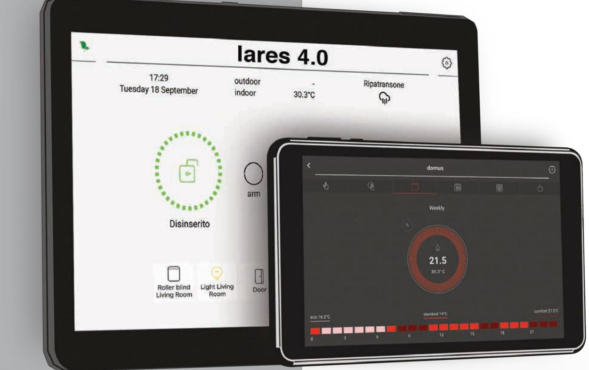
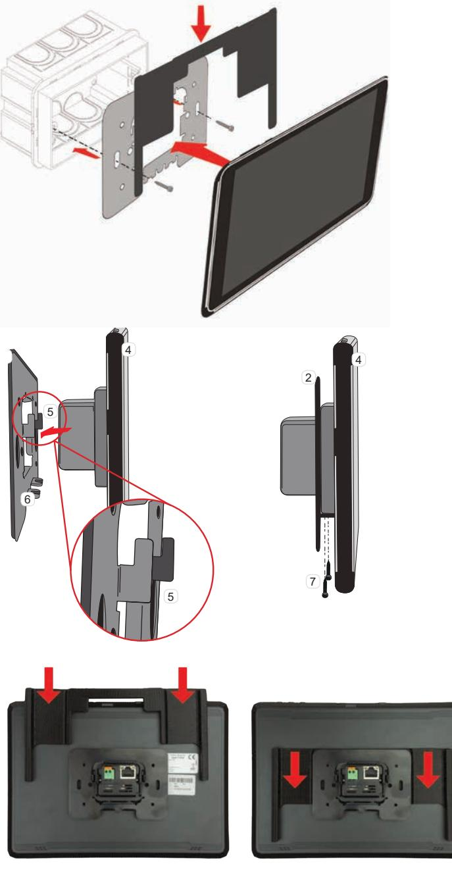
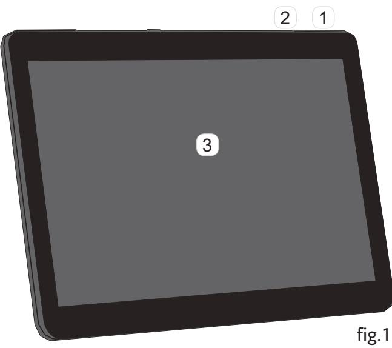
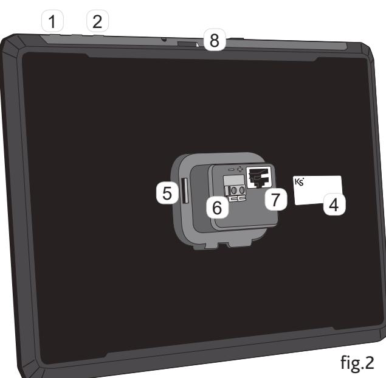
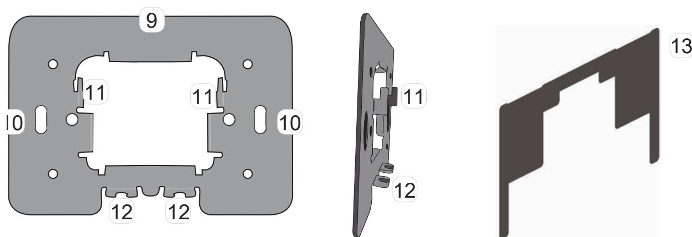
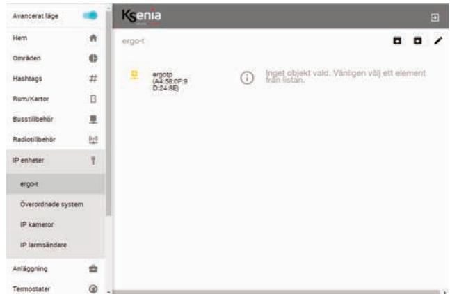
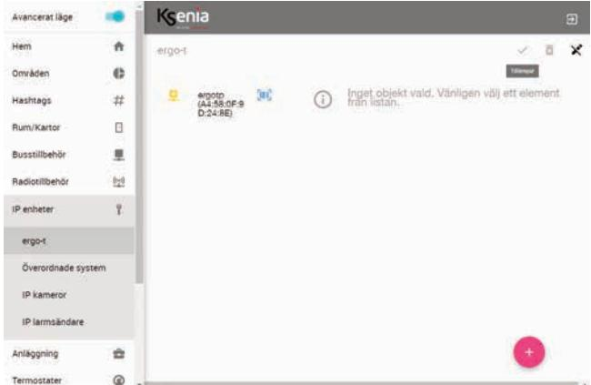
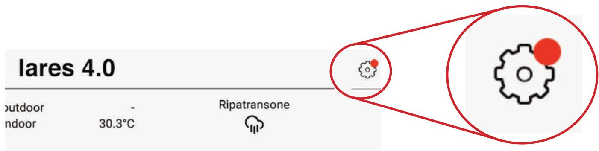

# KSI2100040.302 KSI2100041.302 **TOUCHMANÖVERPANEL**

# **INSTALLATIONSMANUAL**

2020-01-13

# **ALLMÄNT**

ergo-T / ergo-T plus är manöverpaneler med touchdisplay, avsedd för att användas tillsammans med centralapparater i lares 4.0-serien. Manöverpanelen ansluts till det lokala nätverket (Ethernet) via en nätverkskabel till en nätverks- switch, helst av PoE typ som har en spännings- backup med batteri. Manöverpanel ergo-T / ergo-T plus kan drivas av PoE eller via spänning mellan 10 VDC och 15 VDC.

# **TEKNISK SPECIFIKATION**

## **ergo-T**

- IP-gränssnitt: PoE 13W max
- Strömförsörjning: 10-15Vdc, 700 Ma max
- Kapacitiv touchteknik: 7 "TFT
- Upplösning: 1920x1200 (FHD)
- CPU: Rockchip 3368 Octacore
- GPU: Mali-400MP GPU
- Operativsystem: Android 7.0
- RAM: 2 GB
- Nand Flash: 8 GB
- SD-kortplats: max 32 GB

#### **ergo-T plus**

- IP-gränssnitt: PoE 13W max
- Strömförsörjning: 10-15Vdc, 700mA max
- Kapacitiv touchteknik:: 10 "TFT
- Upplösning: 1920x1200 (FHD)
- CPU: Rockchip 3368 Octa-kärna
- GPU: Mali-400MP GPU
- Operativsystem: Android 7.0
- RAM: 2 GB
- Nand Flash: 8 GB
- SD-kortplats: max 32 GB

# **INSTALLATION**

Manöverpanel ergo-T / ergo-T plus, ska installeras på en plan väggyta tillsammans med metallplåten som är förborrad för montering direkt i en apparatdosa (60mm skruvavstånd).

För att montera manöverpanelen anslut först kablaget och sruva fast plåten i kopplingsdosan.

Se sedan till så att stödhakarna på metallplåten kommer rätt i hålen på manöverpanelen. Skjut därefter manöverpanelen nedåt för att låsa anordningen.

Lås och förankra enheten med de medföljande skruvarna. Skjut sedan in det medföljande mellanlägget i plast mellan manöverpanelens baksida och metallplåten.

## **FUNKTIONER**

- 1 Strömbrytare
- 2 Volymknappar
- 3 Kapacitiv touch: 7 "
- 4 MAC-adressetikett
- 5 Anslutningshus
- 6 12 VDC Matning
- 7 IP-gränssnitt Ethernet / PoE
- 8 Micro SD-kortplats (framtida användning)
- 9 Metallstödplatta
- 10 Hål för apparatdosa
- 11 Låsflikar
- 12 Hölje för låsskruvar
- 13 Mellanlägg

# **Knapparnas funktion**

#### **Volymknappar:**

För att höja och sänka volymen.

## **Tangentknapp / standby:**

Med en lång tryckning är den möjligt att slå på / av enheten. Med en kort tryck på enheten kom- mer att stå i viloläge, i detta tillstånd kommer

anslutningen med panelen kommer att avbrytas.

# **DRIFTSÄTTNING**

- 1. Anslut enheten och ta av den skyddande genomskinliga plastfilmen på pekskärmen.
- 2. För att slå på enheten, tryck på knappen i några sekunder. När uppstartfasen är klar kan du logga in på ksenia swecureweb via dator eller mobil app.
- 3. Öppna upp programmeringsmenyn för IP enheter och välj ergo-t.
- 4. Om manöverpanelen har anslutits korrekt kommer manöverpanelen att hittas och visas enligt nedanstående bild.

- 5. Öppna programmeringssesionen genom att trycka på pennsymbolen .

- 6. Klicka på den blåa streckkoden och sedan på för att spara och därefter på för att tillämpa.

| Avancerat lage     |   | Kenia         | ம்                                    | Avancerat lage                  |     | Kenia         |                                 | ದ                                 |
|--------------------|---|---------------|---------------------------------------|---------------------------------|-----|---------------|---------------------------------|-----------------------------------|
| Hem                | 1 | ergo-t        | 188 X 글                         | Hem                             | A   | argo-I        |                                 | ノ ロ ×                             |
| Områden            | 0 |               |                                       | Områden                         | 0   |               |                                 |                                   |
| Hashtags           | ਸ | ergo-t plus 1 | ergotp (A4:58:0F:9D:24:8E)            | Hashtags                        | #   | ergo-t plus 1 | ergo-t plus 1                   |                                   |
| Rum/Kartor         | B |               | 播 真人怎么 965bet官网 24 BE 4 ■ 211.4 | 12 42 47 17 11 11 Rum/Kartor | ದ   |               | S                               | IIII A4 58 (IF 9D 24 8E 图 2114 |
| Busstillbehör      | 更 |               |                                       | Busstillbehör                   | 트   |               |                                 |                                   |
| Radiotillbehör     | 上 |               | 10020144                              | Radiotillbehör                  | 010 |               | 10.020144                       |                                   |
| IP enheter         |   |               | ਲ                                     | IP enheter                      | T   |               | Sections                        |                                   |
| ergo-r             |   |               | 后引一 ergo-t plus 1                  | Anlaggning                      | ਦੇ  |               | ergo-t plus 1 Chelder        |                                   |
| Overordnade system |   |               | Calder                                | Termostater                     | 0   |               | Art (2)                         | 216                               |
| IP kameror         |   |               | Asia (8) x V                    | Inställningar                   | ದ   |               | alle bould A4:58:0F.9D 24:8E |                                   |
| IP larmsändare     |   |               | WENloa A4 58 OF 9D 24 8E           | Talmeddelanden                  | માં |               | Aktryera overnifiring           |                                   |
| Anlaggning         | 0 |               | Aldivera Uvervaluning 19           | Realtid                         | か   |               |                                 | +9                                |
| Termostater        | ತ |               |                                       | Händelselogg                    | a   |               |                                 |                                   |

## **UPPDATERINGAR**

Manöverpanel ergo-T / ergo-T plus kan själv hämta uppdateringar vilket enkelt kan installeras utan att installatören behöver vara på plats.

Om det finns en uppdatering att installera visas detta med en röd indikation i högra hörnet på knappen "Inställningar".

Klicka på denna knapp och välj "Installera uppdateringar". Manöverpanelen kommer att starta om innan den återvänder till "Hem"-sidan.

|                          | Konfiguration |
|--------------------------|---------------|
| Larmsystem               | V             |
| പ Lokalanslutning        | >             |
| Ω Ändra kod              | >             |
| ☆ Radera favoriter       |               |
| Mörkt tema               |               |
| Normal läge              |               |
| Lås upp enhet            |               |
| Installera uppdateringar |               |