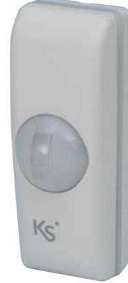
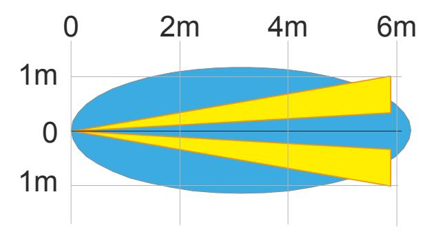

#### Produktbeskrivning

**velum** är en liten och diskret ridådetektor med **kombinationsdetektering**, IR - och mikrovågsdetektering. Medföljande avmaskningslinser kan göra den **husdjursimmun** och anpassa den för detektering av t.ex. fönster, passager och jalusier.

Detekteringsvinkeln är på ca 7,5° och räckvidden är justerbar.

### Teknisk specifikation

| Spänning:          | 9 - 15 VDC.                       |
|--------------------|-----------------------------------|
| Ström:             | Max. 27 mA, i vila 15 mA @ 12 VDC |
| Larmperiod:        | 3 sek.                            |
| Larmrelä:          | 100 mA /24 V                      |
| Sabotagerelä:      | 100 mA /30 V                      |
| Mikrovågsfrekvens: | 24 GHz                            |
| Arbetstemperatur:  | - 10 ºC till 55 ºC                |
| Fuktighet:         | 95 %                              |
| Mått (B x H x D):  | 87 x 32 x 35 mm                   |
| Färg:              | Grå.                              |

# Detekteringsområde

Ovanifrån

### **Certifiering**

Europa / RoHS, CE, EN50131-2-2 Klass 2

## Beställningsinformation

| Produkt                | Beställningsnr |
|------------------------|----------------|
| IR-ridådetektor, velum | 12212          |

