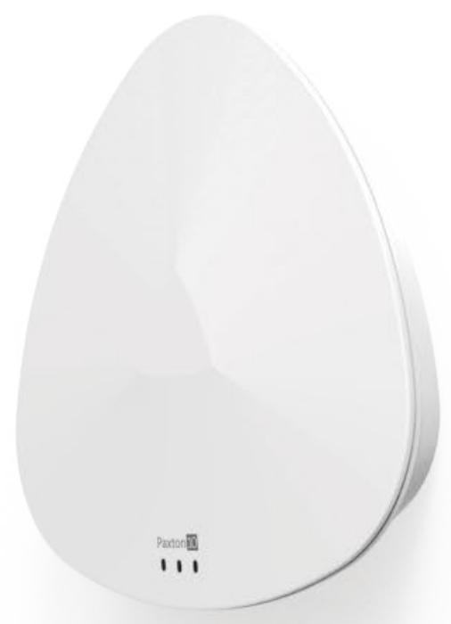
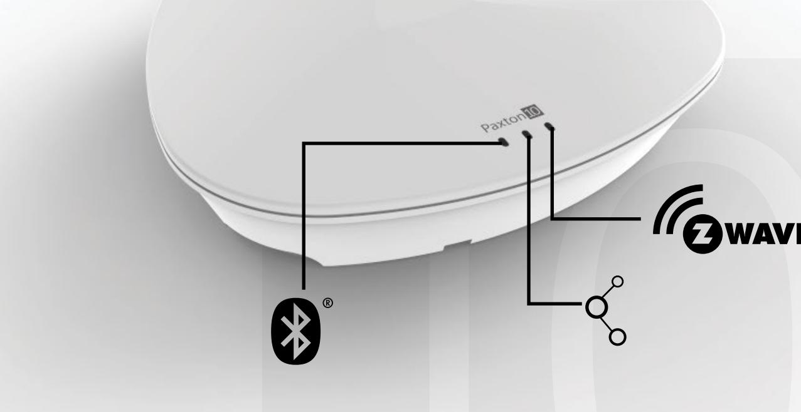
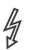

# Paxton10:s trådlösa anslutning

## Översikt

Den trådlösa anslutningen gör det möjligt för den prisbelönta PaxLock Pro att ansluta till Paxton10-systemet. Dessutom gör den det möjligt för Paxton10-systemet att ansluta och ta kontroll över en mängd definierade Z-Wave-certifierade slutenheter. Dessa enheter gör i sin tur det möjligt för Paxton10 att styra och dimma belysning, växla elektriska apparater eller övervaka byggnader med sensorer.

### Funktioner

DS0014-SE

- Z-Wave- och BLE-anslutningsbarhet
- Enkel "plug and play"-installation
- Visuell diagnostik och felsökning via LED-lampor

### Specifikationer

#### System

| Maximalt antal PaxLock Pros per anslutning   | 10  |
|----------------------------------------------|-----|
| Maximalt antal Z-Wave-enheter per anslutning | 200 |
| Antal kaskadkopplade enheter per dörrcentral | 3   |

### El

| Strömförbrukning | 300mA (Max)         |
|------------------|------------------------|
| Driftspänning    | Drivs av RS485, 30 VDC |

### Kommunikation

| Maxlängd på dataledning - dörrcentral till dörrcentral | 100m                     |
|--------------------------------------------------------|--------------------------|
| Maxlängd på dataledning - anslutning till anslutning   | 100m                     |
| Dataanslutning                                         | RS485/Paxton10-protokoll |
| Trådlöst                                               | Bluetooth® 2.4GHz        |
|                                                        | Z-Wave EU-regioner       |
|                                                        | (868,40 MHz, 869,85 MHz) |

#### Maskinvara

| Dimensioner (B x H x D) | 164mm x 163mm x 34mm                 |  |
|-------------------------|--------------------------------------|--|
| LED-lampor              | Grön LED - diagnostik, kommunikation |  |
|                         | Blå LED - Bluetooth®                 |  |
|                         | Röd LED - Z-Wave                     |  |
| Garanti                 | 5-årig Paxtongaranti                 |  |

Miljö

| Arbetstemperatur | 0°C - +45°C    |                                     |
|------------------|----------------|-------------------------------------|
| IP-klass         |                | Ej tillämpligt - om enheten används |
|                  |                | utomhus måste den monteras i ett    |
|                  | lämpligt hölje |                                     |
| Montering        |                | Endast ytmontering                  |
|                  |                |                                     |