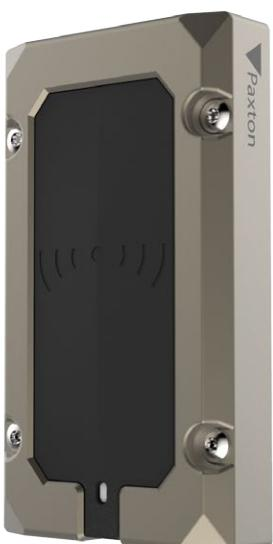
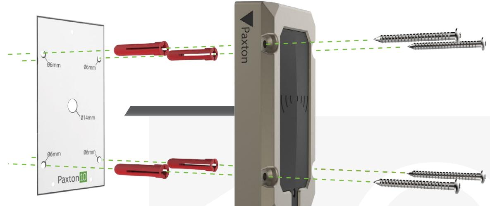

# Paxton10:s sabotagebeständiga Slimline-läsare

## Översikt

Den sabotagebeständiga läsaren stöder en stor mängd funktioner i sin slitstarka IK10-certifierade design.

Den sabotagebeständiga läsaren stöder all ledande teknik som baseras på identifiering via passerbricka, däribland HID Prox®, MIFARE®, Paxton och EM. Dessutom har läsaren Bluetooth®-stöd för kommunikation med hands-free-baserade autentiseringsmetoder och autentiseringsmetoder med lång räckvidd samt smarttelefoner via Paxton-appen.

## Funktioner

- IK10-certifierad
- IP67-certifierad
- Lästeknik i flera format vilket innebär kompatibilitet med Paxton, MIFARE, HID Prox®, EM och mer
- Inbyggt stöd för lågenergi-Bluetooth® gör det möjligt att kommunicera med mobiltelefoner och bärbara enheter - Enkel installation med fyra kablar
- 
- Gör det enkelt att använda de många olika typer av passerbrickor på marknaden genom att erbjuda stöd för alla samtidigt
- Energisparläge med kapacitiv uppväckning

DS0023-SE

### specifikationer

System

| Kompatibilitet med kodbrickor | Paxton EM4100/02, Sony ®, FeliCa Lite-S   |
|-------------------------------|-------------------------------------------|
|                               | MIFARE® Classic, MIFARE®, MIFARE® Plus,   |
|                               | DESFire® EV1/EV2 , MIFARE Ultralight®,    |
|                               | MIFARE Ultralight C®, MIFARE Mini®, NFC®, |
|                               | Hitag2, HID® Prox 125kHz låg frekvens     |

El

| Strömförbrukning | 1W    | (Max)    |
|------------------|-------|----------|
| Driftspänning    | 12V   |          |
| Strömförbrukning | 40mA  | (Passiv) |
|                  | 100mA | (Max)    |

#### Kommunikation

| RFID-frekvens  | 125kHz & 13.56MHz        |
|----------------|--------------------------|
| Dataanslutning | RS485/Paxton10-protokoll |
| Bluetooth®     | 2.4GHz                   |

#### Maskinvara

| Dimensioner (B x H x D)                             | 57.6mm x 106mm x 19.5mm |
|-----------------------------------------------------|-------------------------|
| Kabeltyp                                            | 22AWG, 4 tvinnat par    |
| Kabellängd                                          | 5m / 16ft               |
| Maxlängd på kabelförlängning (Dörrcentral - Läsare) | 100m / 328ft            |
| Ljud                                                | Piezo-klocka            |
| Färg                                                | Svart                   |
| Kapslingsmaterial                                   | ASTM B86                |
| Garanti                                             | 5-årig Paxtongaranti    |

Miljö

| Arbetstemperatur | -35°C - +66°C      |
|------------------|--------------------|
| IP-klass         | IP67               |
| IK-klass         | IK10               |
| Montering        | Endast ytmontering |

© Paxton Ltd 1.0.0