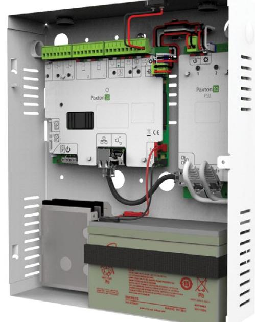
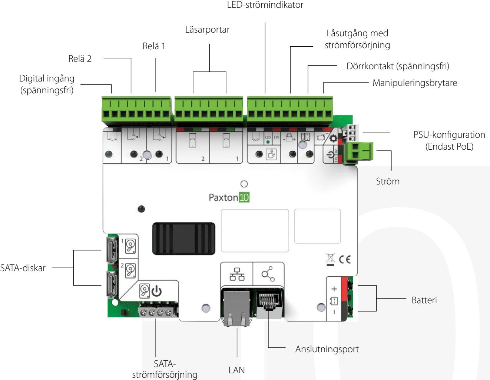

# Pax ton10:s dörrcentral med video

# Översikt

Paxton10:s dörrcentral med video består av en kombination av en dörrcentral för en enda dörr och en videoinspelare. Dörrcentralen med video gör att det inte behövs någon ytterligare integration, vilket innebär att det är mycket enkelt att installera den i ett åtkomststyrningssystem med videoinspelning.

Två SATA-hårddiskar kan installeras samtidigt i RAID1 konfiguration.

## Funktioner

- Samma funktion som i dörrcentraler för enskilda dörrar
- Inbyggd videoinspelare med lagringsyta som kan utökas
- Enkel plug-and-play-installation
- Strömförsörjning via PoE+ eller 12 V DC
- Lokalt lagrade program gör att systemet fortsätter fungera även om anslutningen till servern förloras
- Femårsgaranti
- Anslutning för extrabatteri
- Låsutgång med strömförsörjning
- Enkla och intuitiva anslutningsmöjligheter

Öppningsknapp och

### specifikationer

El

| Strömförbrukning               |                                                  |
|--------------------------------|--------------------------------------------------|
| Vid batteriuppladdning         | Viloläge - 114 mA/5,9W                           |
|                                | Max - 160 mA/8,3W                                |
| När batteriet är fullt         | Viloläge - 74 mA/3,87W                           |
|                                | Max - 122 mA/6,39W                               |
| Dörrcentralens ingångsspänning | 12V - 24V dc                                     |
| Backupbatteri                  | 12 V DC, 7 Ah (Valfritt)                         |
| Utström för lås                | 12V dc/ 1A                                       |
| Reläström                      | 30V dc/ 2A                                       |
| RS485 anslutningsutgång        | 24 V DC, 750 mA max (endast Paxton-anslutningar) |
| RS485 läsarutgång              | 12 V DC, 1 A max (endast Paxton-läsare)          |
| PoE-strömförsörjning           | INGÅNG: 42,5-57 V DC, 25,5W (IEEE 802.3at Typ 2) |
|                                | UTGÅNG: 12,8 V DC, 1,8 A                         |
| 4 A strömförsörjning           | INGÅNG: 100-240 V AC, 50/60 Hz, 1,5A             |
|                                | UTGÅNG: 12,8 V DC, 4 A                           |

#### Kommunikation

| Dataanslutning |
|----------------|
|----------------|

#### Maskinvara

| Dimensioner (B x H x D)                    | 275mm x 320mm x70 mm                  |
|--------------------------------------------|---------------------------------------|
| Ingång för dörrkontakt                     | Ja                                    |
| Spänningsfri digital ingång                | 1                                     |
| Ingång från öppningsknapp                  | Push to make                          |
| Ingång för manipuleringsbrytare            | Ja                                    |
| Reläer                                     | 2                                     |
| Maximalt antal läsare/knappsatser per dörr | 2                                     |
| Garanti                                    | 5-årig Paxtongaranti                  |
| Videolagring                               | 2 x SATA-ingångar för RAID1-konfigura |
|                                            | tion (drivrutiner ingår inte)         |

IP

Miljö

| IP-klass N/A   | Arbetstemperatur | 0°C - 45°C |  |
|-------------------|------------------|------------|--|
|                   |                  |            |  |
| Montering Vägg |                  |            |  |