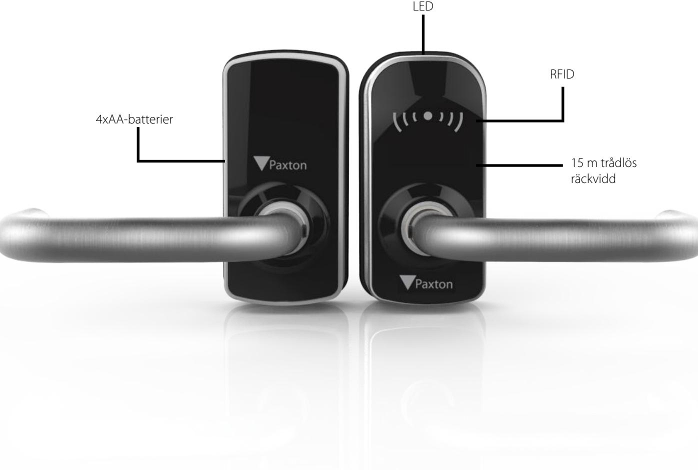

# Paxton10 PaxLock Pro - Euro

## Översikt

PaxLock Pro är Paxtons tredje generation av elektriska dörrhandtag - detta är en robust, funktionsrik och estetisk produkt som passar flera olika installationer.

Den nya och patenterade designen har framtagits med syftet att vara både enkel att installera och intuitiv. Dessutom täcks den av Paxtons branschledande garanti på fem år.

PaxLock Pro har två driftslägen - fristående och därmed inte uppkopplad, eller uppkopplad till ett Paxton10-system via Paxton10:s trådlösa anslutning.

## Funktioner

DS0016-SE

- Dubbelfrekvensläsare
- Trådlös händelserapportering i realtid
- När PaxLock Pro låses upp rör sig handtaget fritt
- Kompatibelt med både EU-DIN-lås och skandinaviska låshus
- Dubbel funktionalitet (fristående och uppkopplad) i en och samma enhet

## Specifikationer

### System

| Maximalt antal passerbrickor/användare - fristående | 10,000                                         |
|-----------------------------------------------------|------------------------------------------------|
| Maximalt antal passerbrickor/användare - uppkopplad | 50,000                                         |
| Kompatibilitet med kodbrickor                       | Paxton, EM4100/02, MIFARE®, MIFARE ®           |
|                                                     | Classic, MIFARE® DESFire® EV1, MIFARE Plus®,   |
|                                                     | MIFARE Ultralight®, MIFARE Ultralight C®,      |
|                                                     | MIFARE Mini®, HID® Prox, Sony ®, FeliCa Lite-S |
|                                                     | Hitag2, NFC                                    |
| Lagrade händelser                                   | 16,000                                         |
| Hands-free-kompatibel                               | Ja - nudda för att få åtkomst                  |
| Dörröppningstid                                     | 1-60 sekunder                                  |
| Tyst drift                                          | Ja                                             |
| Dörrtrafik                                          | Vanligtvis upp till 75                         |
|                                                     | användningstillfällen per dag                  |

| Batterityp | 4x AA 1,5V alkalisk          |
|------------|------------------------------|
| Batteritid | 55,000 användningstillfällen |

## Kommunikation

El

| Trådlöst                                                              | Bluetooth® 2.4GHz (IEEE 802.15.4 |
|-----------------------------------------------------------------------|-------------------------------------|
| Standardkanal                                                         | 25                                  |
| Rekommenderade trådlösa enheter till Paxton10:s trådlösa anslutningar | 10                                  |
| Typisk trådlös räckvidd                                               | Bluetooth® 15m/50ft              |
| Kryptering                                                            | AES128                              |

### Maskinvara

| Mått (BxHxD)                   | 64mm x 127mm x 44mm  |
|--------------------------------|----------------------|
| Mått inklusive handtag (BxHxD) | 155mm x 127mm x 93mm |
| Garanti                        | 5-årig Paxtongaranti |
|                                |                      |

### Miljö

| Arbetstemperatur | Osäkrad sida: -20°c ~ +55°C |
|------------------|-----------------------------|
|                  | Säkrad sida: 0°c ~ +49°c    |
| IP-klass         | IP55                        |
| IK-klass         | IK10                        |

Certifieringar: EMC-EN301-489-1, Radio EN 302-291-, Radio EN 300-330-1, Radio EN 302-328, Säkerhet IEC/EN 60950-1, Säkerhet EN 60950-22, IP-testning EN 60529*, IK-testning EN 62262, Brand EN 1634-1, EN179:2008 376-1331AB/D**.