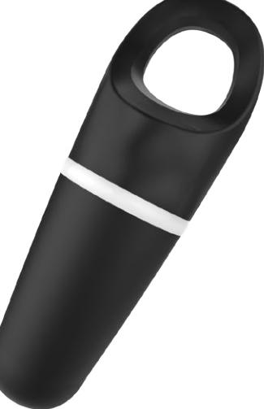

# Paxton10:s närhetsbricka

## Översikt

Paxton10:s närhetsbrickor ger utökad kryptering mellan brickan och läsaren, och utgör därmed en säker autentiseringsmetod i praktiskt format.

#### Funktioner

- Säker krypterad autentiseringsmetod
- Livstidsgaranti

### Specifikationer

El

Bärvågsfrekvens 125kHz

Maskinvara

Dimensioner (B x H x D) Garanti

Miljö

Arbetstemperatur

14mm x 125mm x 10mm Livstidsgaranti

-20°C - +55°C

© Paxton Ltd 1.0.0