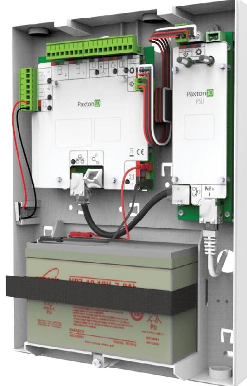
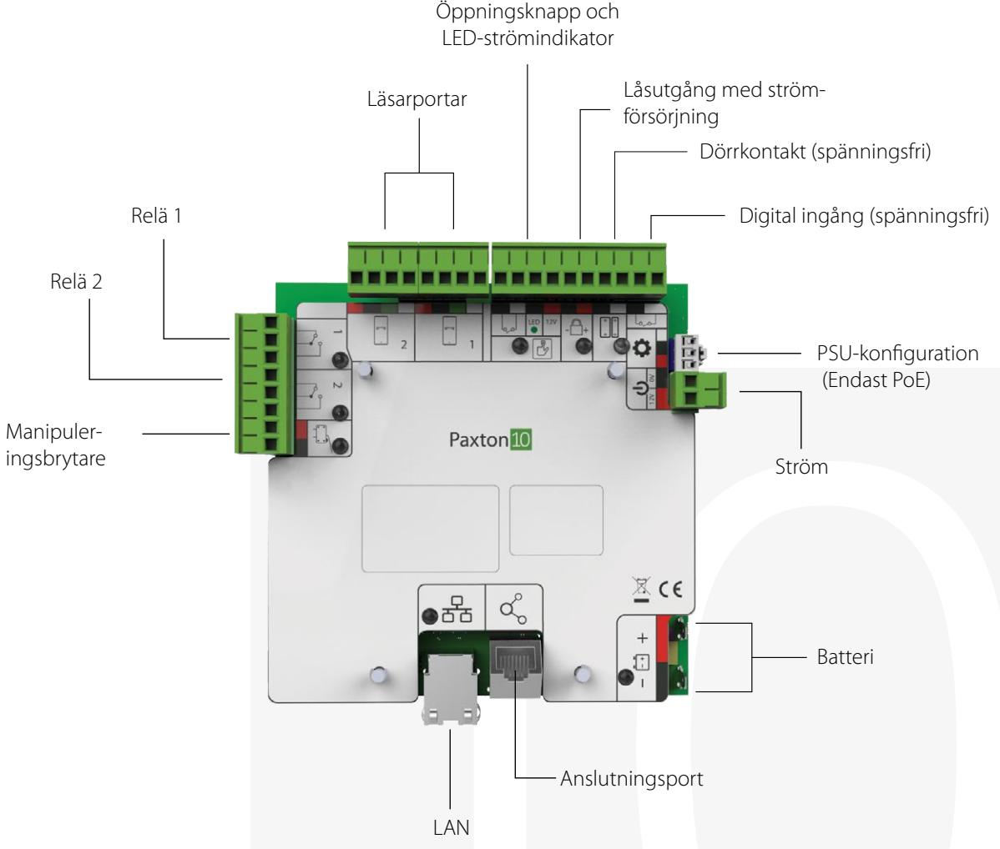

# Pax ton10:s central för enskilda dörrar

## Översikt

Paxton10:s central för enskilda dörrar har designats med enkelhet i fokus. Tydligt markerade terminaler ger problemfri installation så att dörrar kan styras och övervakas.

Denna produkt erbjuder flexibilitet och möjligheten att använda antingen 12 V DC eller befintlig nätverksinfrastruktur via PoE.

## Funktioner

- Enkel plug-and.-play-installation
- Lokalt lagrade program gör det möjligt för systemet att fortsätta fungera även om serveranslutningen bryts
- Femårsgaranti
- Kan användas antingen med PoE eller 12 V DC
- Anslutningar för reservbatteri
- Låsutgång med strömförsörjning

## specifikationer

El

| Strömförbrukning               |                                                  |
|--------------------------------|--------------------------------------------------|
| Vid batteriuppladdning         | Viloläge - 97 mA / 5,08 W                        |
|                                | Max -108 mA / 5,6W                               |
| När batteriet är fullt         | Viloläge - 105 mA / 5,5 W                        |
|                                | Max -108 mA / 5,6W                               |
| Dörrcentralens ingångsspänning | 12V dc                                           |
| Backupbatteri                  | 12 V DC, 7 Ah (Valfritt)                         |
| Utström för lås                | 12V dc/ 1A                                       |
| Reläström                      | 30V dc/ 2A                                       |
| RS485 anslutningsutgång        | 24 V DC, 750 mA max (endast Paxton-anslutningar) |
| RS485 läsarutgång              | 12 V DC, 1 A max (endast Paxton-läsare)          |
| PoE-strömförsörjning           | INGÅNG: 36-57 V DC, 25,5W (IEEE 802.3at Typ 2)   |
|                                | UTGÅNG: 12,8 V DC, 1,8 A                         |
| 2A Power Supply                | INGÅNG: 100-240 V AC, 50/60 Hz, 1,2A             |
|                                | UTGÅNG: 13,8 V DC, 2 A                           |

#### Kommunikation

| Dataanslutning |  | IP |
|----------------|--|----|
|----------------|--|----|

### Maskinvara

| Dimensioner (B x H x D)                    | 236mm x 322mm x 77mm |  |
|--------------------------------------------|----------------------|--|
| Kabeltyp                                   |                      |  |
| Ingång för dörrkontakt                     | Ja                   |  |
| Spänningsfri digital ingång                | 1                    |  |
| Ingång från öppningsknapp                  | Push to make         |  |
| Ingång för manipuleringsbrytare            | Ja                   |  |
| Reläer                                     | 2                    |  |
| Maximalt antal läsare/knappsatser per dörr | 2                    |  |
| Garanti                                    | 5-årig Paxtongaranti |  |

### Miljö

| Arbetstemperatur | 0°C - 45°C |  |
|------------------|------------|--|
| IP-klass         | N/A        |  |
| Montering        | Vägg       |  |
|                  |            |  |

© Paxton Ltd 1.0.0