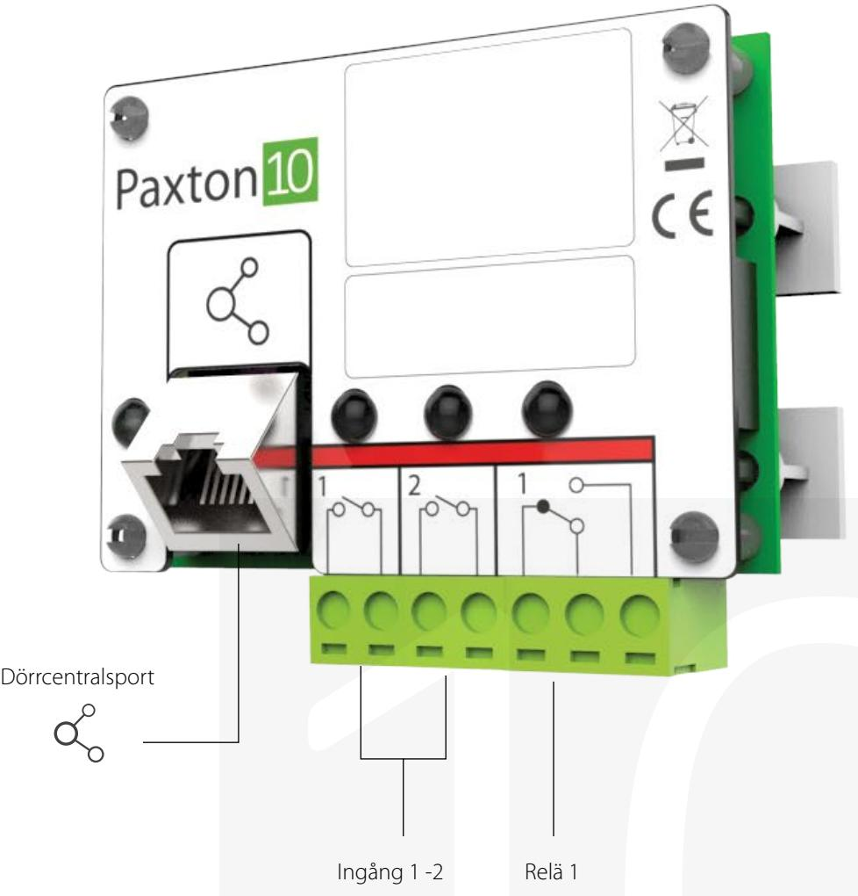

# Paxton10-larmanslutning

## Översikt

Larmanslutningen är särskilt designat för att ansluta befintliga larmsystem till Paxton10:s intelligenta byggnadssystem. Beroende på larmstatus kan Paxton10 styra andra apparater i byggnaden för att vidta rätt åtgärd, så som att öppna branddörrarna vid brandlarm. Det går också att aktivera/inaktivera inbrottslarm beroende på om byggnaden ska öppnas eller säkras i början eller slutet av dagen.

## Funktioner

- LED-lampor för felsökning
- Övervakning och kontroll av inbrottslarm
- Övervakning av brandlarm
- Designat att passa med andra anslutningar i anslutningsskyddet eller i särskilda larmlådor
- Tydlig och intuitiv markering

## Specifikationer

El

| Strömförbrukning      | 2W        |
|-----------------------|-----------|
| Driftspänning         | 30V DC    |
| Reläutgångar ström    | 2A        |
| Reläkontakt isolering | N/A       |
| Reläkontakt spänning  | 30V AC/DC |

### Kommunikation

| Maximal längd på dataledningen (Paxton10-dörrcentralen > Paxton10-larmanslutning) | 100m                    |
|-----------------------------------------------------------------------------------|-------------------------|
| Dataanslutning                                                                    | RS485/Paxton10 protocol |

### Maskinvara

| Dimensioner (B x H x D)         | 51mm x 68mm x 34 mm  |
|---------------------------------|----------------------|
| Ingång för manipuleringsbrytare | Nej                  |
| Reläer                          | 1                    |
| Ingångar                        | 2                    |
| Garanti                         | 5-årig Paxtongaranti |

#### Miljö

| Arbetstemperatur | 0°C - +55°C         |
|------------------|---------------------|
| IP-klass         | N/A                 |
| Montering        | Endast i plasthölje |

