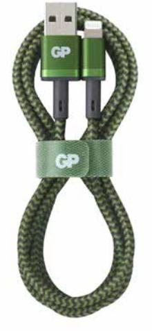
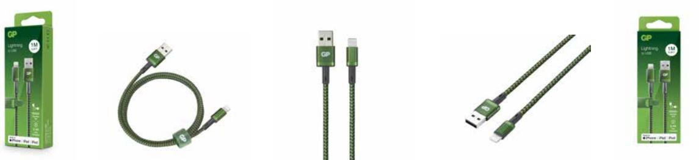

## GP USB-kabel CL1B, USB-A till Apple Lightning (MFi), 1m

Snabbladda, eller synka, din Appleprodukt med denna USB-A till Lightning-kabel på 1 meter från GP. Lätt att ta med sig tack vare det medföljande kardborrebandet. 

- 1 meter
- Inget sladdtrassel med nylonbeklädd kabel
- Output: 5V/2.4A (Max. 12W)
- MFi-certifierad

#### **ARTICLE INFORMATION:**

Art.no: 405169 EAN: 4891199190704 E-nummer: 57 207 16

# GP USB-kabel CL1B, USB-A till Apple Lightning (MFi), 1m

### **Technical specifikation**

| Färg               | Verde      |  |  |
|--------------------|------------|--|--|
| Spänning (Volt)    | 0.000      |  |  |
| Tillverkningsland  | Kina       |  |  |
| Statistiskt nummer | 8504405590 |  |  |
| E-nummer           | 57 207 16  |  |  |
| Nobb-nr            | 56673101   |  |  |
| Batteristorlek     | On the go  |  |  |

### **Packaging information**

|                 | EXKRT          | INKRT          | 1-P           | ST       |
|-----------------|----------------|----------------|---------------|----------|
| EAN kod         | 04891199190728 | 04891199190711 | 4891199190704 |          |
| Längd (mm)      | 225.000        | 210.000        | 20.000        | 1000.000 |
| Höjd (mm)       | 156.000        | 68.000         | 150.000       | 0.000    |
| Bredd (mm)      | 190.000        | 178.000        | 57.000        | 0.000    |
| Bruttovikt (kg) | 1.95000        | 0.97500        | 0.09750       | 0.09750  |
| Net Weight (kg) | 1.26000        | 0.63000        | 0.06300       | 0.06300  |
| Gross Volume    | 0.00667        | 0.00000        | 0.00000       | 0.00033  |
| Net Volume      | 0.00000        | 0.00000        | 0.00000       | 0.00000  |
| Antal ST        | 20             | 10             | 1             | 1        |

**Page 2/2**