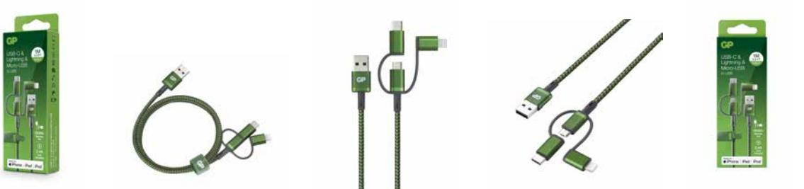

## GP 3-in-1 USB-kabel CY1A, USB-C + Micro-USB + Apple Lightning (MFi) till USB-A, 1m

Denna 3-i-1-kabel är helt superb när du har många enheter med olika USB-portar, till exempel iOS och Android. En kabel med USB-A till Micro-USB i grunden, med utbytbara USB-C och Apple Lightning adaptrar, uppfyller alla ladd-krav med endast en kabel. 

- 1 meter
- Inget sladdtrassel med nylonbeklädd kabel
- Output: 5V/2.4A, 9V/2A, 12V/1.5A (Max. 18W)
- Stödjer QC (Quick Charge) 3.0

#### **ARTICLE INFORMATION:** Art.no: 405172

EAN: 4891199191060 E-nummer: 5720719

**Page 1/2**

# GP 3-in-1 USB-kabel CY1A, USB-C + Micro-USB + Apple Lightning (MFi) till USB-A, 1m

### **Technical specifikation**

| Spänning (Volt) 0.000 Tillverkningsland Kina Statistiskt nummer 8504405590 E-nummer 5720719 Nobb-nr 56673033 | Färg | Verde |
|-----------------------------------------------------------------------------------------------------------------------------------------|------|-------|
|                                                                                                                                         |      |       |
|                                                                                                                                         |      |       |
|                                                                                                                                         |      |       |
|                                                                                                                                         |      |       |
|                                                                                                                                         |      |       |
| Batteristorlek On the go                                                                                                             |      |       |

### **Packaging information**

|                 | EXKRT          | INKRT          | 1-P           | ST       |
|-----------------|----------------|----------------|---------------|----------|
| EAN kod         | 04891199191084 | 04891199191077 | 4891199191060 |          |
| Längd (mm)      | 225.000        | 210.000        | 20.000        | 1000.000 |
| Höjd (mm)       | 156.000        | 68.000         | 150.000       | 0.000    |
| Bredd (mm)      | 190.000        | 178.000        | 57.000        | 0.000    |
| Bruttovikt (kg) | 1.30000        | 0.65000        | 0.09750       | 0.09750  |
| Net Weight (kg) | 0.70000        | 0.35000        | 0.06300       | 0.06300  |
| Gross Volume    | 0.00667        | 0.00000        | 0.00000       | 0.00033  |
| Net Volume      | 0.00000        | 0.00000        | 0.00000       | 0.00000  |
| Antal ST        | 20             | 10             | 1             | 1        |

**Page 2/2**