# ID Lock 150

Bruksanvisning Användarmanual User Manual

# Gratulerer med din nye

ID Lock 150!

Gratulerer som eier av en ID Lock 150. Vi har gjort det vi kan for å designe en elektronisk lås som er sikker, lett å bruke og lett å montere. Vi håper du blir fornøyd med valget ditt!

Vi viser til den enhver tid gjeldende bruksanvisning som er tilgjengelig på vår nettside idlock.no. Der vil du også finne informasjon og tips til bruk og vedlikehold.

Les også gjennom brukervilkårene før du begynner med montering av låsen din.

Vennlig hilsen Alle oss i ID Lock

### Grattis till ditt nya ID Lock 150!

Grattis! Du är nu ägare till ett ID Lock 150. Vi har gjort vad vi kan för att designa ett elektroniskt lås som är säkert, lätt att använda och enkelt att installera. Vi hoppas att du kommer vara nöjd med ditt val!

Vi hänvisar till den nuvarande användarmanualen som finns tillgänglig på vår hemsida idlock.se. Där finns även information och tips till bruk och underhåll.

Läs även användarvillkoren innan du börjar installera ditt lås.

Med vänliga hälsningar Vi alla i ID Lock

### Congratulations on your new ID Lock 150!

Thank you for choosing ID Lock 150. We have put all our efforts into designing an electronic door lock which is secure, easy to use and easy to install. We hope you will be satisfied with your choice!

Updated User manuals are available at our website idlock.no. There you will also find useful information regarding operation and maintenance.

Also make sure to read through the terms and conditions before you begin installing your new lock.

Best regards from All of us at ID Lock

### Brukervilkår

Les dette før du begynner

ID Lock 150 er designet for å fungere i et krevende nordisk miljø. Dersom låsen monteres i henhold til bruksanvisning er det lite sannsynlig at feil vil forekomme.

Det er reklamasjonsrett på låsen i henhold til nasjonal lovgivning i det landet du kjøpte din ID Lock. Feil forårsaket av en forsettlig, uaktsom eller ukyndig bruk eller montasje, eller i strid med våre retningslinjer eller manualer vil medføre bortfall av reklamasjonsretten. Uansvarlig bruk eller montering kan resultere i ett eller flere av følgende punkter: Produktsvikt, tap av eiendeler, evt. personskader.

Låsen anbefales brukt i temperaturområdet -25ºC til +70ºC. Dersom låsen monteres i kystnære strøk kan korrosjon forekomme.

Utvendig enhet har klassifisering IP55. Det betyr at den tåler vannsprut fra alle retninger når den er montert korrekt på din dør. Låsen tåler ikke høytrykkspyling.

ID Lock passer de fleste dører produsert etter SIS 817383 (fra 1978 og nyere). Eventuelle tilpasninger som må utføres kan ikke leverandør holdes ansvarlig for. Leverandør kan heller ikke holdes ansvarlig for å erstatte andre deler enn produktet uansett av direkte eller indirekte årsak.

Minst én RFID-brikke må programmeres og oppbevares som nødåpningsmulighet.

Låsen må være oppdatert til versjon 1.5.0 for at alle funksjoner skal være tilgjengelig.

### Villkor

Läs detta innan du börjar

ID Lock 150 är utformad för att fungera i en krävande nordisk miljö. Om låset är monterat enligt bruksanvisningen är det osannolikt att fel kommer att uppstå.

Reklamationsrätt på låset är i enlighet med nationell lagstiftning i det land du köpt ditt ID Lock. Fel som orsakats av avsiktlig, oaktsam eller obehörig användning eller montering eller som strider mot våra policys eller manualer leder till att garantin upphör. Oansvarig användning eller montering kan leda till ett eller flera av följande: Produktfel, förlust av tillgångar eller personskada.

Låset rekommenderas för användning inom intervallet -25ºC till +70ºC. Om låsen är monterat i ett kustområde kan det förekomma korrosion.

Den externa enheten har IP55-klassificering. Det betyder att det kan stå emot vattenspray från alla håll när den är korrekt monterad på din dörr. Låset tål inte högtrycksspolning.

ID Lock passar de flesta dörrar tillverkade enligt SIS 817383 (1978 och senare). Eventuella justeringar som måste göras kan inte leverantören hållas ansvarig för. Leverantören kan inte hållas ansvarig för att ersätta andra delar än själva produkten för någon direkt eller indirekt anledning.

Minst en RFID-bricka måste programmeras och lagras som nödåtkomst.

Låset måste uppdateras till version 1.5.0 för att alla funktioner ska vara tillgängliga.

Rengjøring av kodelåsen gjøres uten bruk av løsemiddel. Benytt kun en klut fuktet med rent vann.

Rengöring av kodlås görs utan användning av lösningsmedel. Använd endast en trasa fuktad med rent vatten.

### Terms and conditions

Read this before installation

ID Lock 150 has been designed to function even in a demanding, Nordic climate. If the lock is installed in compliance with the User manual, the probability for malfunction is minimal.

The lock is covered by the implemented consumer laws in the country it was originally purchased. Malfunctions caused by either willfully, neglectant or unqualified use or installation, or in disagreement with our terms, conditions or User manuals, will waive any rights to file complaints. Reckless or irresponsible use or installation may lead to one or more of the following results: Product failure, loss of property or harm to people.

The lock's recommended operating range is -25ºC to 70ºC. If the lock is installed in coastal areas, corrotion may occur.

The exterior unit holds an IP55 classification. This means that it is resistant to water spray from all directions. The lock does not resist pressure washing or similar.

ID Lock is suited for most doors manufactured in accordance with SIS 817383 (1978 and newer). ID Lock cannot be held responsible for any eventual customisations of the door. ID Lock cannot be held liable to replace any items other than the product, regardless of direct or indirect cause.

At least one RFID keyfob must be programmed to the lock, and kept in case it is needed for emergy unlocking.

The lock must be updated to version 1.5.0 for all features to be available.

Cleaning must be done without the use of solvents. Use only pure water on a damp cloth.

### Monteringssett

- 1. . . . .Utvendig låse-enhet
- 2. . . . .Innvendig låse-enhet
- 3. . . . .Låskasse
- 4. . . . .Skruesett låskasse
- 5. . . . .Sluttstykke
- 6. . . . .Sluttstykkeadapter 44 mm
- 7. . . . .Skruesett sluttstykke
- 8. . . . .Vriderpinne for håndtak 105 mm
- 9. . . . .Vriderpinne for håndtak 120 mm
- 10. . . .Låskasseadapter (3 stk. i ulik lengde)
- 11. . . .Knappvriderbeskytter
- 12. . . .Skruesett for dørtykkelse 40-55 mm
- 13. . . .Skruesett for dørtykkelse 56-70 mm
- 14. . . .Skruesett for dørtykkelse 71-84 mm
- 15. . . .RFID nøkkelbrikker 5 stk.

### Monteringssats

- 1. . . . .Extern låsanordning
- 2. . . . .Intern låsanordning
- 3. . . . .Låshus
- 4. . . . .Skruv till låshus
- 5. . . . .Slutbleck
- 6. . . . .Slutbleckadapter 44 mm
- 7. . . . .Skruv till slutbleck
- 8. . . . .Tryckespinne för handtag 105 mm
- 9. . . . .Tryckespinne för handtag 120 mm
- 10. . . .Låshusadapter (3 stycken i olika längder)
- 11. . . .Vred skydd
- 12. . . .Skruvsats för dörrtjocklek 40-55 mm
- 13. . . .Skruvsats för dörrtjocklek 56-70 mm
- 14. . . .Skruvsats för dörrtjocklek 71-84 mm
- 15. . . .RFID nyckelbrickor 5 st.

### Assembly kit

- 1. . . . .Exterior locking unit
- 2. . . . .Interior locking unit
- 3. . . . .Mortise lock
- 4. . . . .Screws for mortise lock
- 5. . . . .Strike plate
- 6. . . . .Strike plate adapter 44 mm
- 7. . . . .Screws for strike plate
- 8. . . . .Through spindle 105 mm
- 9. . . . .Through spindle 120 mm
- 10. . . .Mortise lock adapter (3 pcs. in different lengths)
- 11. . . .Thumbturn protective cover
- 12. . . .Screws for doors 40-55 mm
- 13. . . .Screws for doors 56-70 mm
- 14. . . .Screws for doors 71-84 mm
- 15. . . .RFID keyfobs 5 pcs.

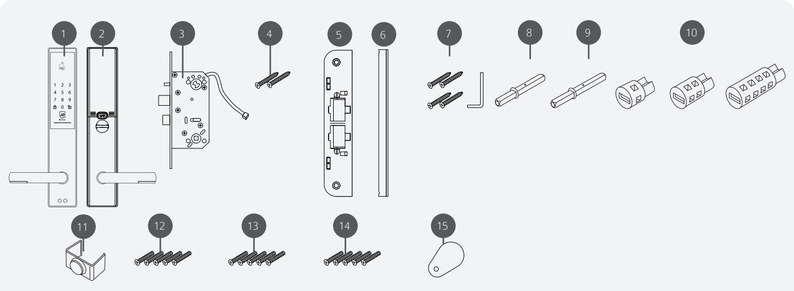

### Nødvendig verktøy Nödvändiga verktyg

For å kunne montere ID Lock 150 vil du som et minimum ha behov for følgende verktøy:

- Skrutrekker PH2
- Drill
- 10 mm bor

För att installera ID Lock 150 behöver du minst följande verktyg:

- Skruvmejsel PH2
- Borrmaskin
- 10 mm borr

### Required tools

To properly perform the fitting of ID Lock 150 you will as a minimum need the following tools:

- Screwdriver PH2
- Drill
- 10 mm drill bit

### Kompatibilitet Sjekk at låsen og sluttstykket passer

Din nye ID Lock er laget for å passe dører iht. dørstandarden SIS 817383. Sjekk at din dør er kompatibel på følgende, enkle måte:

- 1 Sjekk om dørbladets tykkelse er mellom 40-84 mm
- 2 Mål ny låskasse mot gammel for å undersøke om det er riktig størrelse på låskassen
- 3 Mål sluttstykket mot gammelt sluttstykke for å undersøke om det har samme størrelse
- 4 Demonter ditt gamle sluttstykke.
- 5 Sett inn medfølgende sluttstykke, og påse at det passer i karmens utfresing. Hvis sluttstykket ikke dekker hele utfresingens bredde, må du benytte deg av sluttstykkeadapteret.
- 6 Demonter din gamle låskasse.
- 7 Sett inn medfølgende låskasse, og påse at det passer i dørbladets utfresing.

### Kompatibilitet Kontrollera att låshus och slutstycke passar

Ditt nya ID Lock är tillverkat för att passa dörrar enligt standard SIS 817383. Kontrollera att din ytterdörr är kompatibel på följande, enkla sätt:

- 1 Kontrollera att dörrbladets tjocklek är mellan 40-84 mm.
- 2 Jämför det nya låshuset mot det gamla för att se om de har samma storlek.
- 3 Jämför det nya och det gamla slutstycket för att se om de har samma storlek.
- 4 Demontera ditt gamla slutstycke.
- 5 Montera det medföljande slutstycket och kontrollera att det passar i karmens urfräsning. Om det nya slutstycket inte täcker hela urfräsningen skall du använda dig av medföljande adapter för slutstycket.
- 6 Demontera ditt gamla låshus.
- 7 Montera medföljande låshus och kontrollera att det passar i dörrbladets urfräsning.

### Før du setter i gang

- 1 For at ID Lock skal kunne monteres på din dør, MÅ du borre et hull i dørbladet.
- 2 Vi anbefaler at du har en alternativ inngang mens du monterer.
- 3 Ha alltid ett 9-volts batteri tilgjengelig ute, for eksempel i hanskerommet på bilen.
- 4 Etter at batteriene er satt i vil hengsleretning detekteres.
- 5 Skal du bruke Z-wave, kan dette medføre økt batteriforbruk.

### Innan du sätter igång

- 1 För att ditt ID Lock skall kunna monteras på din dörr måste du borra ett extra hål i dörrbladet.
- 2 Vi rekommenderar att du har en alternativ ingång till huset medan du monterar.
- 3 Ha alltid ett 9-volts batteri tillgängligt på utsidan, t.ex. i handskfacket på din bil.
- 4 Efter att batterierna har satts in, kommer gångjärnets riktning att upptäckas.
- 5 Skall du använda Z-wave kan detta medföra ökad strömförbrukning.

## Compatibility

### Check to see if the mortise lock and strike plate fits

Your new ID Lock is designed to be installed in doors following the SIS 817383 standard. Use the following checklist to make sure that your door is compatible:

- 1 Confirm that your door leaf's thickness is between 40-84 mm
- 2 Compare the measurements of the ID Lock mortise lock against your existing to ensure they have the same dimensions
- 3 Measure your current strike plate and compare with your existing strike plate to ensure the same dimensions
- 4 Remove your old strike plate.
- 5 Insert the supplied strike plate, and make sure it fits correctly in the groove of the door frame. If the strike plate does not cover the routed width of the door jamb, you must use the supplied strike plate adapter.
- 6 Remove your old mortise lock.
- 7 Insert the supplied mortise lock, and make sure it fits properly in the door leaf.

### Before you begin

- 1 To install ID Lock on your door, you will have to drill a hole through the door leaf.
- 2 We recommend having an alternative entrance during installation.
- 3 Always keep a 9 Volt battery in hand at all times, for instance in your car's glove box.
- 4 After inserting the batteries, the hinge direction will be detected.
- 5 Be advised that use of the optional Z-Wave module may increase battery consumption.

Side 6

### Norsk Svenska English

## ID Lock Updater ID Lock Updater

Firmwaren i ID Lock 150 kan oppdateres ved hjelp av mobilappen «ID Lock 150 Updater». Appen er gratis og tilgjengelig for Apple iOS og Android.

## ID Lock Updater

Firmware för ID Lock 150 kan uppdaterasmed mobilappen "ID Lock 150 Updater". Appen är gratis och tillgängligför Apple iOS- och Android.

ID Lock 150 firmware can be updated using the mobile app "ID Lock 150 Updater". The app is free and available for Apple iOS and Android.

## Sluttstykke

1/2: Settes i karmside

- 1 Sørg for at sluttstykket passer i dørkarmen
- 2 Sett sluttstykket inn jevnt med karmside ( A ) Fig-01.
- 3 Innsatt sluttstykke kan nå ved behov justeres mer mot låskasse hvis nødvendig ( B ) Fig-02.

#### Fig-01: Viser sluttstykket som føres inn i karmside ( A ).

- A Sluttstykke som jevnt med karmside.
- B Sluttstykket skal passe med utfresingsmål i karmsiden.

### Fig-02: Viser hvordan sluttstykket kan justeres nærmere låskasse ved behov. ( B ).

- C Justerer avstand mellom sluttstykke låskasse ved behov. Avstanden må være mellom 2-5 mm.
## Slutbleck

1/2: monteras i karmsidan

- 1 Se till att slutblecket passar in i dörrkarmen
- 2 Sätt in slutblecket jämnt med karmsidan ( A ) Fig-01.
- 3 Det monterade slutblecket kan nu justeras mer mot låshuset, om nödvändigt ( B ) Fig-02.

#### Fig-01: Visar slutblecket som sätts in i karmsidan ( A ).

- A Slutbleck monteras jämnt med karmsidan.
- B Slutbleck ska matcha urfräsningen på karmsidan.

### Fig-02: Visar hur slutblecket kan justeras närmare låshuset vid behov. ( B )

- C Justera avståndet mellan lås och slutbleck efter behov. Avståndet måste vara mellan 2-5 mm.
### Strike plate

1/2: Fitting in door jamb

- 1 Make sure that the strike plate fits the slot in the door jamb
- 2 Insert the strike plate flush with the door jamb ( A ) Fig-01.
- 3 The mounted strike plate may now be adjusted further towards the mortise lock if needed ( B ) Fig-02.

#### Fig-01: Shows the strike plate being mounted in the door jamb ( A ).

- A Strike plate flush with jamb side.
- B The strike plate must seat properly in the jamb mortise.

### Fig-02: Shows how the strike plate may be adjusted closer to the mortise lock if needed ( B ).

- C Adjusts the distance between strike plate and mortise lock if needed. Distance must be between 2-5 mm.
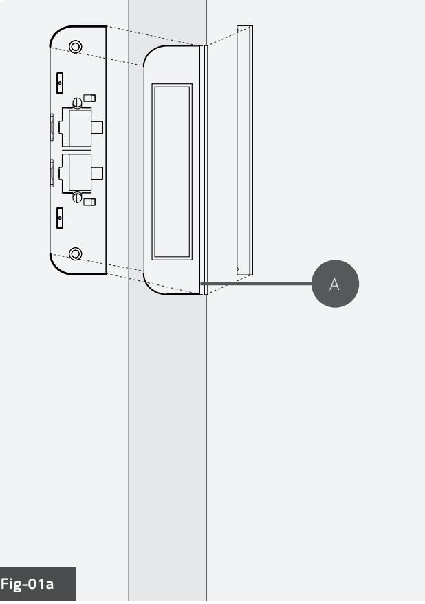

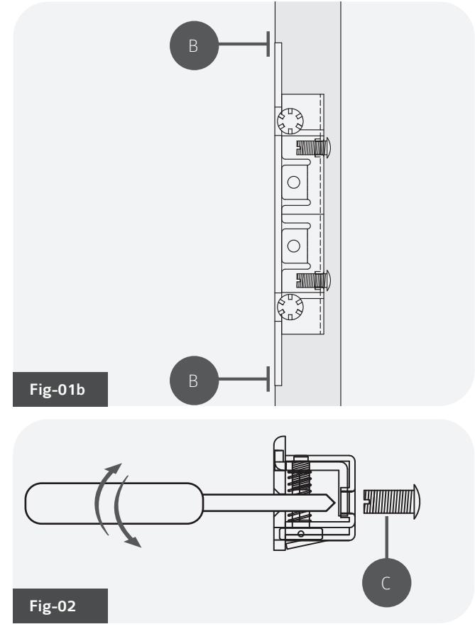

## Sluttstykke

2/2: Settes i karmside

- 4 Sluttstykket skrues og festes i karmside i rekkefølgen ( A – D ) Fig-03.
Fig-03: Viser festeskruene ( A – D ). Bruk skruer som vedlagt i skruesett for sluttstykket.

- 1 Frontplaten på sluttstykket festes først i karmsiden med skruene ( A – B ).
- 2 På innsiden festes sluttstykket ytterligere med skråstilte skruer ( C – D ). Dette skaper en jevn fordeling av kreftene som virker inn på sluttstykket, samtidig som det det øker motstandskraften mot innbrudd og manipulasjon.

### Slutbleck

2/2: Monteras i karmsidan

- 4 Slutblecket skruvas och fästs i karmsidan i följande ordning ( A – D ) Fig-03.
Fig-03: Visar skruvarna (A - D). Använd skruvarna som är bifogade i skruvsatsen för slutblecket.

- 1 Fronten på slutblecket fästs först i karmsidan med skruvarna ( A – B ).
- 2 Inuti, fäst slutblecket ytterligare med de konformade skruvarna ( C - D) Detta skapar en jämn fördelning av krafterna som verkar på slutblecket, samtidigt som motståndet mot inbrott och manipulation ökar.

# Strike plate

2/2: Fitting in door jamb

- 4 The strike plate is fastened with screws in the direction ( A – D ) Fig-03.
Fig-03: Shows the screws in ( A – D ). Use the screws supplied to fasten the strike plate.

- 1 Strike plate front is first fastned with the screws ( A – B ).
- 2 Additional fastening of the strike plate on the inside is done with the angled screws ( C – D ).

This ensures an even distribution of the forces applied to the strike plate. It also increases resistance towards attempted break-ins and manipulation.

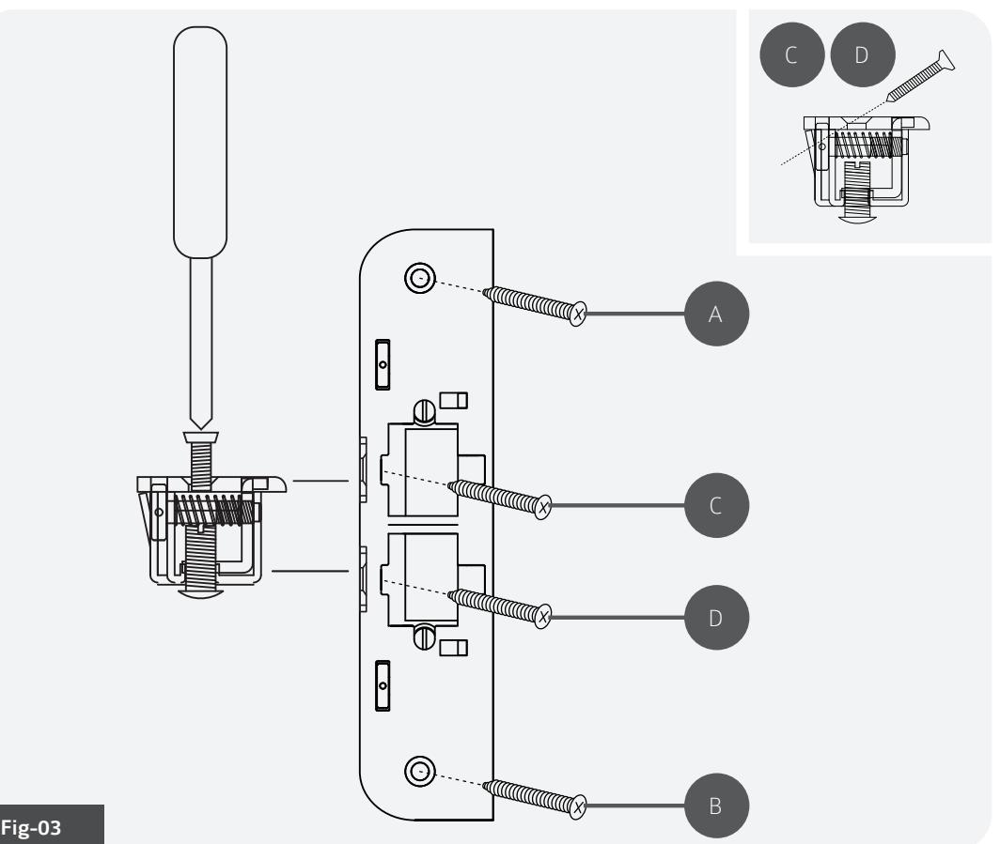

1/4: Vriderpinne og låskasse

### 1 Justering av låskasse

Juster låskassen på din ID Lock – 150 slik at fallen har lik slagretning som din gamle låskasse. Justeringen illustreres i sin helhet av Fig-04.

1 Trykk ned skruen på baksiden av låskassen med et skrujern ( A ). Fallen spretter ut av låsstolpen slik at den kan snus.

2 Snu så fallen enten ved hjelp av skrujern ( A ) eller ved å vri på selve fallen ( B ).

## Förberedelser

1/4: Vred och låshus

### 1 Justering av låshuset

Justera låshuset på din ID Lock - 150 så att fallet har samma riktning som ditt gamla låshus. Justeringen illustreras i sin helhet av Fig-04.

1 Tryck ned skruven på låshusets baksida med en skruvmejsel ( A ). Tryckfallet trycks ut ur låshuset så att den kan vridas.

2 Vrid tryckfallet antingen med hjälp av en skruvmejsel ( A ) eller genom att vrida på själva tryckfallet ( B ).

### Preparations

1/4: Through spindle and mortise lock

### 1 Adjusting the mortise lock

Adjust the mortise lock so the latch bolt is in the same direction as the on the lock body being replaced. The adjustment is shown in Fig-04.

1 Use a screwdriver to push down the screw on the rear of the mortise lock body. ( A ). The latch bolt pops out so it can be reversed.

2 Turn the latch bolt with the help of either a screwdriver or ( A ) by manually turning the latch bolt itself ( B ).

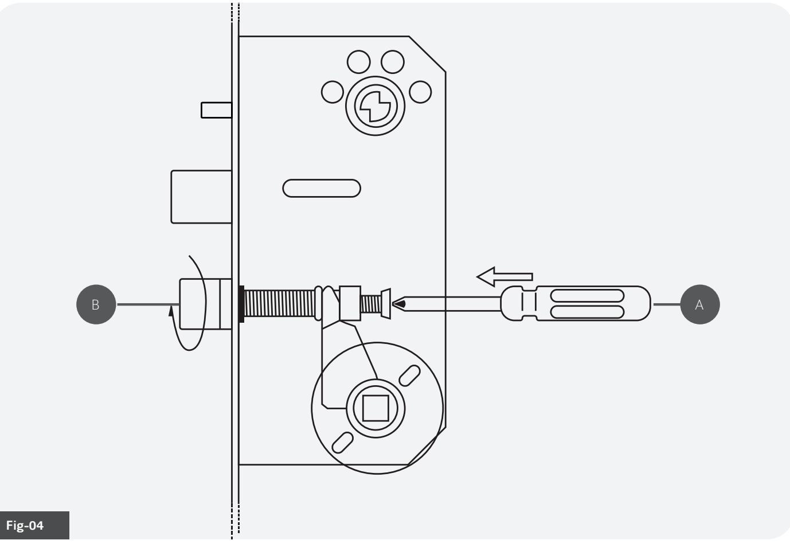

### 2/4: Justeringer av håndtak

### 3 Har du høyre- eller venstrehengslet dør Fig-05a?

Dette finner du ut ved å stå på utsiden av døren og se hvilken side hengslene sitter på.

1 Høyre-hengsel ( B )

- 2 Venstre-hengsel ( A )
Noter hengsleretning. Den må programmeres når låsen er ferdig montert.

- 4 Juster håndtakene ( A B ) Fig-05b:
- 1 Løsne hvert håndtak fra utgangsstillingen ved å skru løs skruen på innsiden ( A ).
- 2 Juster håndtaket i riktig retning ( B ). Sjekk nå at den nedadgående innfellingen i enden på håndtaket er på nedsiden.
- 3 Det kan hende at du må bytte innsidehåndtaket mot utsidehåndtaket for å få dette rett

OBS! Det kan være pakninger mellom håndtakene og låsenheten. Hvis så er tilfelle, sørg for at disse ikke faller ut ved evt. bytte av innside- og utsidehåndtak.

## Förberedelser

2/4: Justeringar av handtag

- 3 Har du höger- eller vänsterhängd dörr Fig-05a?
Detta kan du se genom att stå på utsidan av dörren och se vilken sida gångjärnen sitter på.

- 1 Höger gångjärn (B)
- 2 Vänster gångjärn (A)

Notera hängningen. Den måste programmeras när låset är färdig monterat.

### 4 Justera handtagen ( A – B ) Fig-05b:

- 1 Lossa handtagen från utgångspositionen genom att skruva loss skruven på baksidan
- 2 Justera handtaget i rätt riktning (B). Kontrollera nu att det frästa spåret i handtagets ände pekar nedåt.
- 3 Det kan hända att du behöver byta invändigt handtag mot utvändigt handtag för att få det rätt

OBS! Det kan vara packningar mellan handtagen och låsanordningen. Om så är fallet, se till att dessa inte faller ur vid ev. byte mellan in- och utvändigt handtag.

## Preparations

### 2/4: Handle adjustments

### 3 Is your door right or left swung Fig-05a?

Assuming the door is outward opening, stand on the outside and look at the door straight on.

- 1 Right hinged ( B ) 2 Left hinged ( A )
Take note of the hinge direction. It must be programmed when the lock installation is completed.

- 4 Handle adjustments ( A B ) Fig-05b:
- 1 Use the screw on the inside to loosen each of the handles from their shipping position ( A ).

2 Set the handle in the correct position ( B ). Check to ensure that the bevel at the end of the handle is facing downwards.

3 You may have to swap the handles from the inside and outside unit to get the bevel in the correct position.

Note! There might be gaskets between the handles and each lock unit. If so, ensure that the gaskets do not fall out while swapping handles.

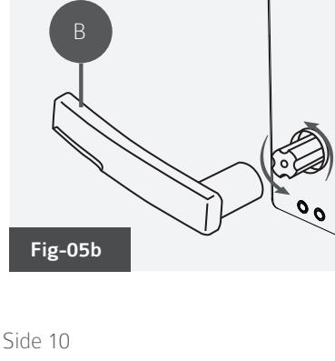

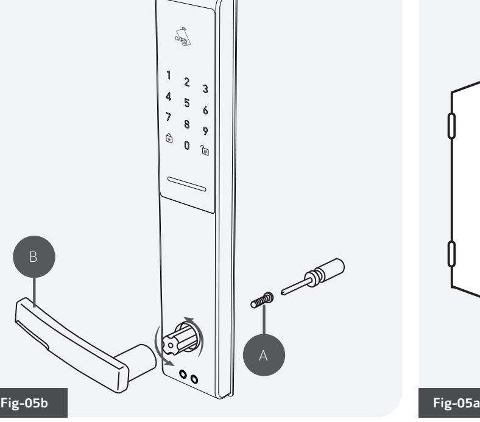

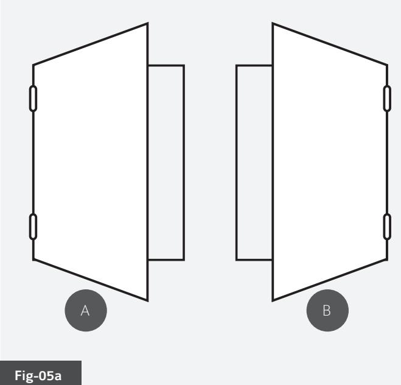

### 3/4: Innvendig enhet demonteres fra bakplate

- 6 Den innvendige enheten er montert sammen mot en bakplate.
Disse skal nå skilles fra hverandre som i Fig-06:

- 1 Ta av batteridekselet, og skru ut de to skruene som sitter øverst ( A ) og ( C ).
- 2 Skru ut de to skruene som sitter nederst ( D ) og ( B ) .
- 3 Legg så bakplaten ( E ) med pakningen og skruene (A – D) klar til senere.

### Förberedelser

3/4: Intern låsenhet demonteras från bakplattan

### 6 Den inre enheten är monterad på en bakplatta.

Dessa bör nu separeras från varandra som i Fig-06:

- 1 Ta bort batterilocket och skruva loss de två övre skruvarna ( A ) och ( C ).
- 2 Lossa de två skruvarna längst ner ( D ) och ( B ).
- 3 Lägg bakplattan ( E ) med packning och skruvar ( A-D ) åt sidan så länge.

### Preparations

3/4: Disassemble interior unit from back plate

### 6 The interior unit is mounted on a back plate.

These two parts should now be disassembled from each other as shown in Fig-06:

- 1 Remove the battery cover, and unscrew the two top screws ( A ) and ( C ).
- 2 Unscrew the two lower screws ( D ) and ( B ) .

3 Put aside the back plate ( E ) with the gasket and screws (A – D) for later use.

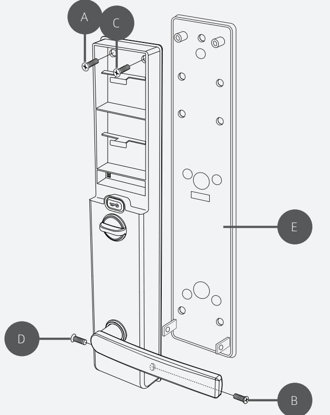

### 4/4: Klargjør døren for montering

Ved valg av type bor (10 mm): Vær oppmerksom på at døren kan bestå av både aluminium og/eller stålplater.

- 1 Sett inn låskassen i døren.
- 2 Sett inn håndtakets vriderpinne ( D ) Fig-07.
- 3 Sett på bakplaten slik anvist av ( E – H ) Fig-07.
- 4 Sentrer bakplaten mot dørbladet etter innsatt vriderpinne ( D ) Fig-07, slik at hjørnene ( E-F ) står horisontal med hverandre. Påse at bakplaten ( F-H ) er vertikalt på linje med dørblad.
- 5 Marker borehull (134 mm fra sentrum av vriderpinnen) ( D - I ) Fig-07.
- 6 Ta ut vriderpinnen, skru ut låskassen og ta vekk bakplaten.
- 7 Bruk riktig type bor, og lag et rett 10 mm gjennomgangshull i dørbladet etter markering av borehull ( I )
- 8 Fjern urenheter og smuss på begge sider av dørbladet på den flaten selve låssystemet skal stå mot. Dette sikrer at pakningene sitter optimalt.

### Förberedelser

4/4: Förbered dörren för montage

Vid val borrtyp (10 mm): Observera att dörren kan vara uppbygd av både aluminium- och / eller stålplattor.

- 1 Sätt in låshuset i dörrbladet.
- 2 Sätt i handtagets tryckespinne ( D ) Fig-07.
- 3 Sätt på bakplattan enligt instruktioner i ( E – H ) Fig-07.
- 4 Centrera bakplattan mot dörrbladet efter att du sätter in tryckespinnen ( D ) Fig-07, så att hörnen ( E-F ) står horisontella med varandra. Se till att bakplattan ( F-H ) är vertikalt inriktad mot dörrbladet
- 5 Markera för borrhållet (134 mm från centrum på tryckespinnen) ( D - I ) Fig-07.
- 6 Ta bort tryckespinnen, skruva loss låshuset och ta bort bakplattan.
- 7 Använd rätt borr och gör ett rakt 10 mm genomgående hål i dörrbladet efter borrhålsmarkering (I)
- 8 Avlägsna damm och smuts på båda sidor av dörrbladet på den ytan som själva låssystemet ska fästas mot. Detta säkerställer att packningarna tätar optimalt.

### Preparations

### 4/4: Prepare the door for installation

When choosing drill bit (10 mm): Please note that the door might contain structural sheets of aluminum and/or steel.

- 1 Insert the mortise lock into the door.
- 2 Insert the through spindle ( D ) Fig-07.
- 3 Apply the backing plate as shown ( E – H ) Fig-07.
- 4 Center the backing plate using the through spindle ( D ) Fig-07, so that the corners ( E-F ) are in a horisontal position towards each other. Make sure that the backing plate ( F-H ) is vertically aligned witht the door leaf.
- 5 Mark the bore hole (134 mm from the center of the through spindle ( D - I ) Fig-07.
- 6 Remove the through spindle, unscrew the mortise lock and remove the backing plate.
- 7 Use the correct type drill bit, and makea straight 10 mm through hole in the door leaf following the marking (I)
- 8 Remove any dirt or impurities on both sides of the door leaf where the lock will be mounted. This ensures proper and optimal functioning of the gaskets.

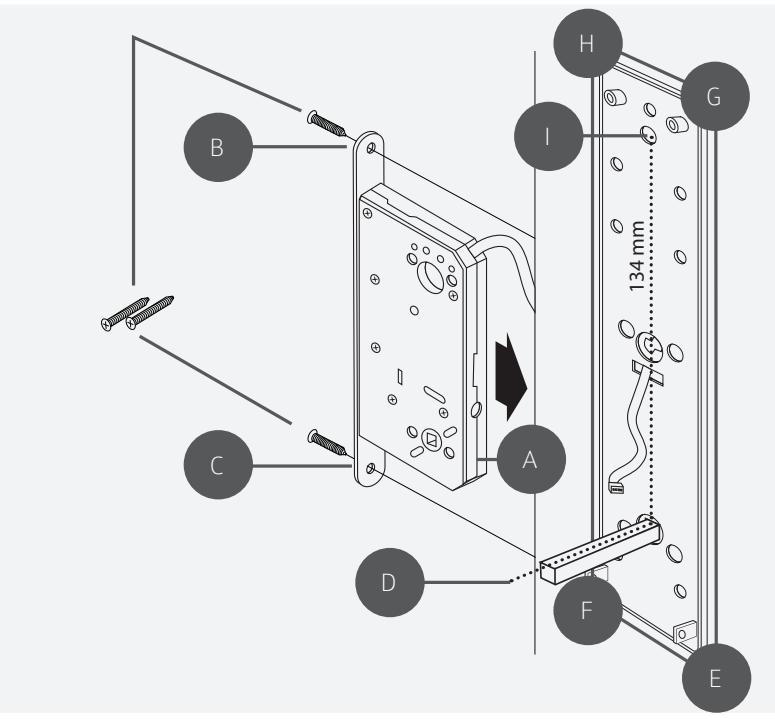

1/8: Sette i låskasse og vriderpinne

### 1 Låskassen settes inn i dørbladet.

Låskassen settes halvveis inn i dørbladet. Trekk så ledningen mot innsiden gjennom øverste åpning ( A ) Fig-08a.

### 2 Vriderpinnen for håndtaket settes inn mot låskassen.

Påse at vriderpinne er montert med mest mulig lengde på innsiden av døren som i Fig-08b. Føres gjennom låskasse inntil den fjærbelastede tappen spretter opp på andre siden av låskassen.

# Montage

1/8: Sätt i låshus och tryckespinne

### 1 Låshuset sätts in i dörrbladet

Tryck in låshuset halvvägs in i dörrbladet. Lirka ut ledningarna mot insidan av det översta hålet i dörrbladet ( A ) Fig-08a.

### 2 Tryckespinnen för handtaget förs in i låshuset

Se till att tryckespinnen monteras med mesta möjliga längd på insidan av dörrbladet se Fig-08b. För in tryckespinnen till dess att den fjäderbelastade tappen sprätter upp på motsatt sida av låshuset.

### Installation

1/8: Insert mortise lock and through spindle

- 1 Mortise lock is inserted into door leaf.
Insert mortise lock half-way into the door leaf. Gently pull the cable towards the inside through the topmost opening ( A ) Fig-08a.

### 2 Through spindle is inserted into mortise lock

Make sure that the through spindle is installed with the longest part facing towards the interiour side of the door as shown in Fig-08b. The through spindle is fed through the mortise lcok until the spring loaded pin releases at the other side of the mortise lock.

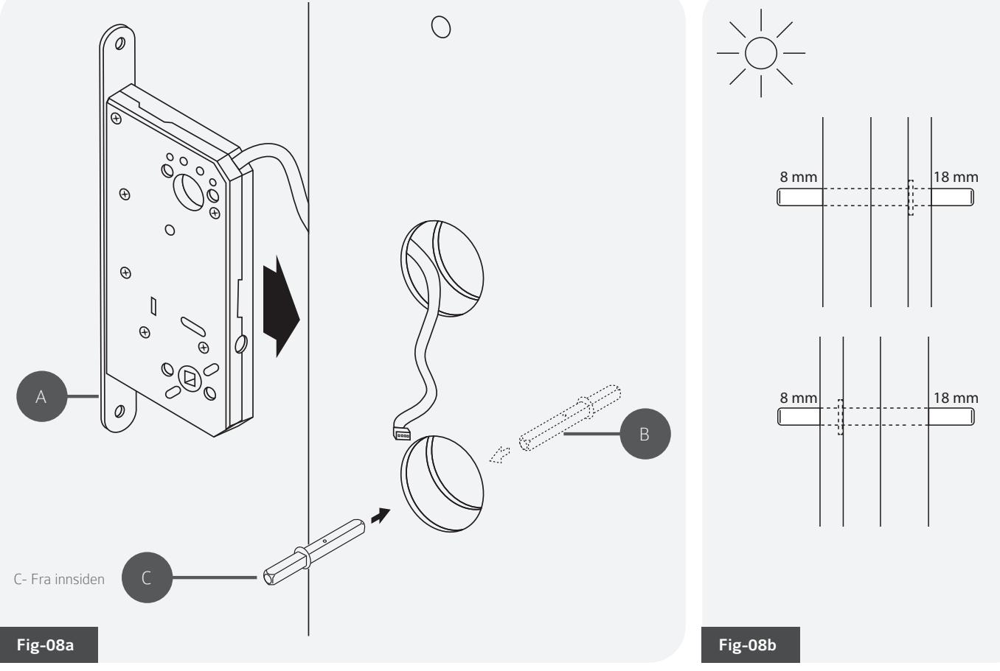

2/8: Utvendig enhet settes på

- 3 Utvendig enhet settes på som anvist av Fig-09.
- 1 Ledningen fra utvendig enhet strekkes mot innsiden ( A ) og på oversiden av låskassen. Gjøres inntil det ikke er ledningslengde igjen.
- 2 De 4 nederste festestolpene ( C-F ) føres inn i låskassen.

Den øverste festestolpen ( G ) føres inn i det klargjorte 10 mm hullet. Samtidig føres vriderpinnen til håndtaket

( B ) inn i håndtaket.

## Montage

2/8: Utvändig låsenhet installeras

- 3 Utvändig låsenhet installeras enligt Fig-09.
- 1 Kabeln från den utvändiga enheten dras mot insidan (A) och på översidan av låshuset. Dra tills det inte finns någon ledningslängd kvar.
- 2 De 4 nedre monteringsfästena (C-F) sätts in i låshuset. Sätt in det övre monteringsfästet (G) i det förberedda 10 mm hålet. Samtidigt för

du tryckespinnen till handtaget ( B ) in i handtaget.

## Installation

2/8: Exterior unit is installed

- 3 The exterior unit is installed as shown in Fig-09.
- 1 The cable from the exterior unit is gently pulled towards the inside ( A ) and on the top side of the mortise lock. Pull until there is no leftover cable length.
- 2 The lowest 4 fastening columns ( C-F ) gets inserted into the mortise lock. The topmost fastening column ( G ) is inserted in the already drilled 10 mm hole. At the same time the handle spindle ( B ) is inserted into the handle.

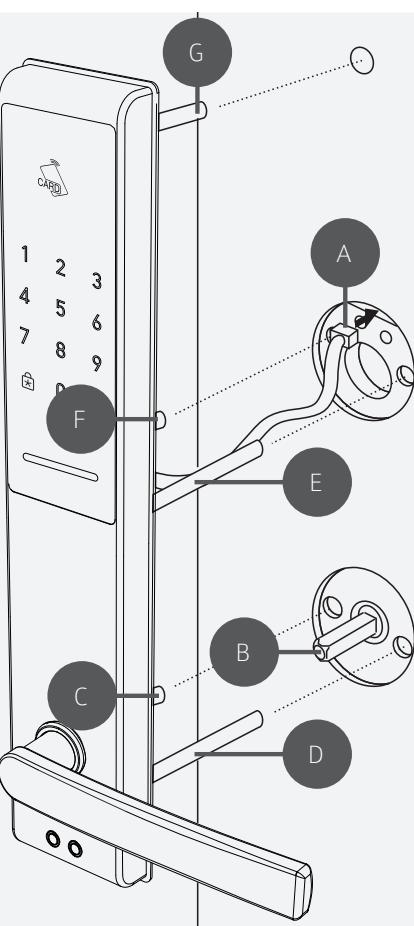

#### Fig-09

3/8: Låskasse og låskasseadapter

4 Låskasse skrues fast ( A – B ) Fig-10.

Skrues fast hvor anvist av ( A ) og ( B ) med et jevnt fordelt trykk, inntil låskassestolpen sitter jevnt i låskassehuset.

### 5 Låskasse–adapter settes inn i låskasse ( A ) Fig-11a.

Sett låskasse-adapteret inn i låskassen fra innsiden ( A ).

Fig-11a: Velg adapter som passer best for din dørtykkelse. Forsøk med det korteste først. Viser låskasse–adapter slik det settes inn i låskassen fra innsiden. ( A ).

Fig-11b: Viser hvordan ledningene skal plasseres på utsiden av festestolpene ( A ).

### Montage

3/8: Låshuset och låshus-adapter

4 Låshuset skruvas fast ( A – B ) Fig-10.

Skruvarna skruvas fast med en jämn kraft som illustrerade i ( A ) och ( B ), tills låshuset sitter jämnt i dörrbladet.

### 5 Låshus–adapter sätts in i låshuset ( A ) Fig-11a.

Sätt in låshus-adapter i låshuset från insidan ( A ).

Fig-11a: Välj den adapter som bäst passar din dörrtjocklek. Prova det kortaste först. Visar låshus-adapter när den sitter in i låshuset från insidan ( A ).

Fig-11b: Visar hur ledningarna ska placeras på utsidan av monteringsskruvarna ( A ).

### Installation

3/8: Mortise lock and mortise lock adapter

4 The mortise lock is fastened with screws ( A – B ) Fig-10.

The screws are fastened as shown in (A) and ( B ) with an even force, until the face plate is flush with the door leaf mortise.

5 Mortise lock adapter is inserted in lock body ( A ) Fig-11a.

Insert the mortise lock adapter into the lock body from the inside ( A ).

Fig-11a: Choose the adapter best suited for your door's thickness. Begin with the shortest one. Illustrates the proper insertion from the inside ( A ).

Fig-11b: Shows how the cables are run on the outside of the fastening columns ( A ).

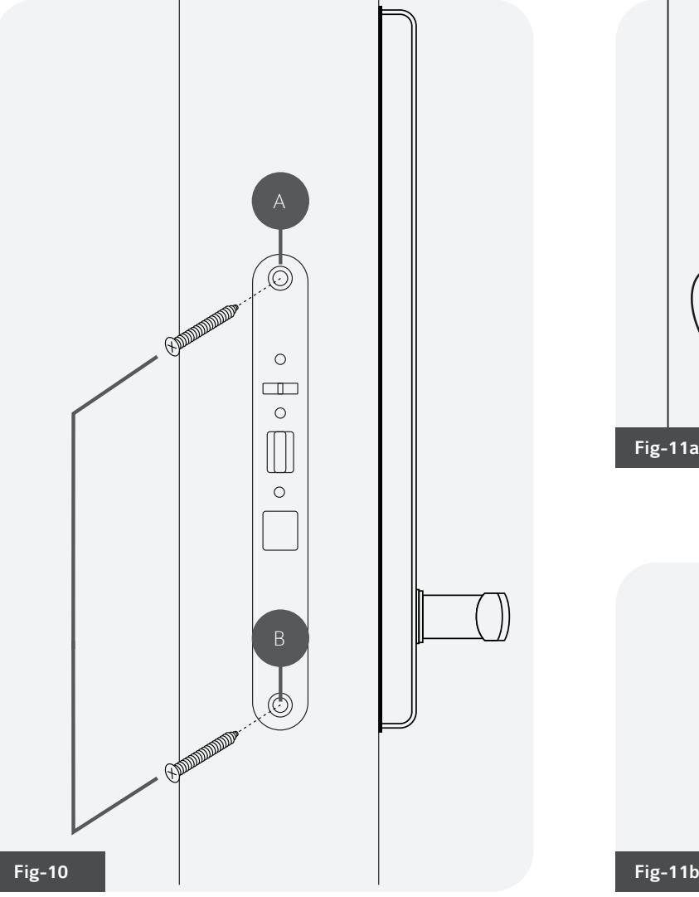

Fig-11a A

A

#### Norsk Svenska English

### Montering

4/8: Innvendig bakplate monteres på

- 6 Bakplate festes til utvendig enhet som anvist av Fig-12 ( A-G ).
- 1 Bakplaten settes mot dørbladet i retningen "oppover" som anvist av pil Fig-12.
- 2 Ledningene føres gjennom åpningen merket "CABLE ENTRY" på bakplate. Område ( G ).
- 3 Ledningene må legges på utsiden av Monteringsskruene ( B og C ).
- 4 Skru til bakplaten med et jevnt fordelt trykk i rekkefølge ( A - E ).
- 5 Se til at gummipakningene ligger jevnt mot dørbladet i alle hjørner ( F ).

### Montage

4/8: Inre bakplatta monteras

- 6 Bakplattan sätts fast på utsidan enligt Fig 12 ( A-G ).
- 1 Placera bakplattan mot dörrbladet i riktningen "uppåt" enligt pilen Fig-12.
- 2 Ledningarna förs genom öppningen märkt "CABLE ENTRY" på bakplattan. Område ( G ).
- 3 Ledningarna måste läggas på utsidan av monteringsskruvarna ( B och C ).
- 4 Skruva på bakplattan med jämnt fördelat tryck i ordning ( A - E ).
- 5 Kontrollera att trycket på gummitätningarna är jämnt fördelat på dörrbladet i alla hörn ( F ).

### Installation

4/8: Interior backing is installed

- 6 The backing plate is fitted to the exterior unit as shown in Fig-12 ( A-G ).
- 1 The backing plate is held towards the door leaf with the arrow pointing upwards Fig-12.
- 2 The cables are fed through the opening marked on the backing plate marked "CABLE ENTRY" ( G ).
- 3 The cables must be positioned on the outside of the fastening columns ( B and C ).
- 4 Tighten the backing plate with an even pressure in using going from ( A - E ).
- 5 Make sure that the rubber gaskets are evenly positioned towards the door leaf in all four corners ( F ).

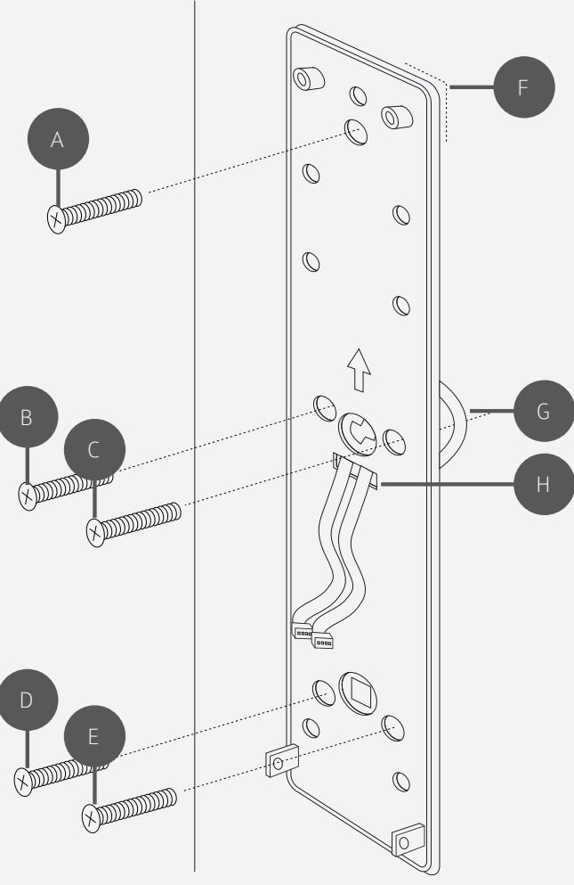

5/8: Tidligere innsatt låskasse–adapter

- 7 Viktig: Låskasse–adapteret skal nå kontrolleres om det kan rotere fritt uten hindringer fra ledninger. Det er viktig at låskasse-adapter er helt innsatt.
Slik illustrert av Fig-13 ( A-B ) . Se til at reile i låskasse ( B ) samtidig trekker seg inn og ut av låskasse.

Montage

5/8: Tidigare insatt låshus-adapter

- 7 Viktig: Låshus-adaptern ska nu kontrolleras om den kan rotera fritt utan hinder från ledningarna. Det är viktigt att låshus-adaptern är helt insatt.
Illustrerad i Fig-13 ( A-B ). Se till att låsregeln i låshuset ( B ) rör sig fritt in och ut ur låshuset.

Installation

5/8: Previously inserted mortise lock adapter

7 Important: The mortise lock adapter will now be tested to ensure free rotation without any cable intereference. It is important that the adapter is firmly seated.

Illustrated in Fig-13 ( A-B ) . Make sure that the deadbolt in the mortise lock ( B ) at the same time extends and retracts form the mortise lock body.

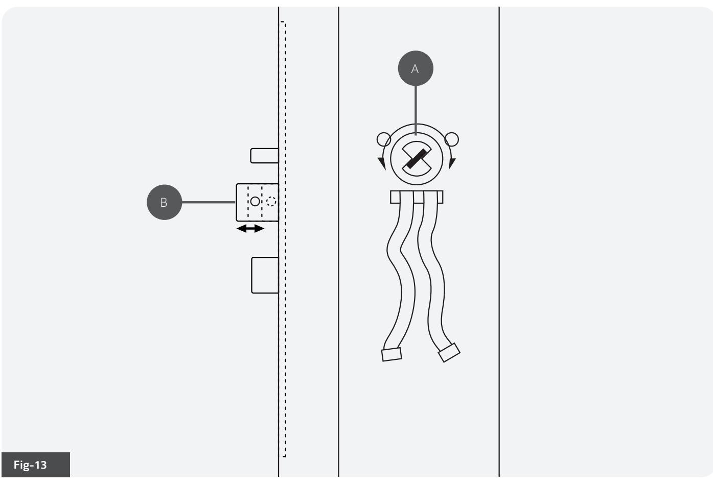

6/8: Innvendig kretskort blir tilkoblet

- 8 Tilkoblingen mot innvendig kretskort (PCB) blir montert som anvist av ( A-B ) Fig-14.
1 Hvit ledning på hvitt kontaktpunkt. ( A ). 2 Svart ledning på svart kontaktpunkt ( B ).

Begge kontakter må monteres rett vei.

### Montage

6/8: Anslut kretskort

- 8 Anslutningen till det inre kretskortet (PCB) monteras enligt anvisningarna ( A-B ) Fig-14.
- 1 Vit ledning på vit kontaktpunkt ( A ).
- 2 Svart ledning på svart kontaktpunkt ( B ).

Både kontakterna måste monteras i rätt riktning.

### Installation

6/8: Connecting the interior PCB

- 8 The connection of the interior PCB is done as shown in ( A-B ) Fig-14.
1 White cable to white port ( A ). 2 Black cable to black port ( B ).

Both contacts must be installed in the right direction.

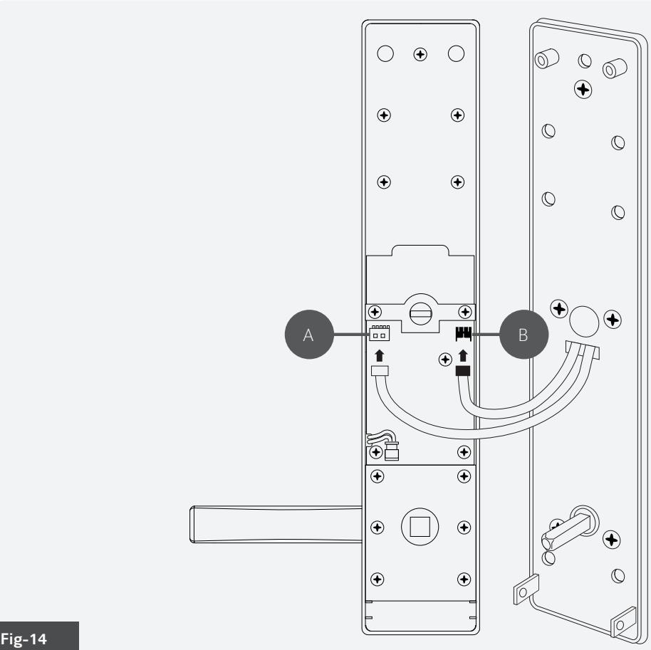

7/8: Innvendig enhet settes på

- 9 Treff bakplaten med tilkoblet innvendig enhet som anvist av ( A-B ) Fig-15.
- 1 Se til at knappevriderpinnen treffer låskasse-adapteret i låskassen, ( A ).
- 2 Se til at håndtak-vriderpinne treffer inn mot håndtak ( B ).

Montage 7/8: Invändig enhet monteras

9 Montera bakplattan med den inkopplade invändiga enheten enligt instruktioner från ( A-B ) Fig-15.

- 1 Kontrollera att pinnen för låsvredet passar i låshus-adaptern ( A ).
- 2 Kontrollera att tryckespinnen passar handtaget ( B ).

Installation

7/8: Interior unit is installed

- 9 Mate the now connected interior unit with the backing plate as shown in ( A-B ) Fig-15.
- 1 Ensure that the thumbturn spindle is correctly positioned in the mortise lock ( A ).
- 2 Check to see that the handle spindle is positioned correctly in the handle ( B ).

A B

8/8: Innvendig enhet monteres mot bakplate

- 10 Innvendig enhet blir festet mot bakplaten som anvist av ( A- D ) Fig-16.
- 1 Finn frem de 2 skruene med stort hode som ble skrudd ut fra toppen ( A og C ) og de 2 skruene med lite hode ( B og D ) for å skille innvendig enhet fra bakplaten tidligere.
- 2 Skru til innvendig enhet med et jevnt fordelt trykk i rekkefølgen ( A - D ).

### Montage

8/8: Inre enhet monteras på bakplatta

- 10 Den inre enheten fästs mot bakplattan enligt anvisningar ( A- D ) Fig-16.
- 1 Ta fram på de 2 stora skruvarna som skruvades upp från toppen (A och C) och de två små skruvarna (B och D) för att separera den inre enheten från bakplattan tidigare.
- 2 Skruva på den inre enheten med jämnt fördelat tryck i riktning (A - D)

### Installation

8/8: Interior unit is fitted to the backing plate

- 10 The interior unit is fastened to the backing plate as shown in ( A- D ) Fig-16.
- 1 Use the 2 screws with larger heads that were removed from the topmost fastening holes ( A and C ) and the 2 screws with smaller heads ( B og D )
- 2 Tighten screws with an even pressure in the direction shown ( A - D ).

#### Fig-16

### Gjør følgende

1/2: Manuelle funksjonstester

- 1 Ha døren i åpen posisjon, og sjekk at begge håndtakene beveger seg "synkront" med hverandre ved å dra ned håndtaket fra enten utsiden ( A ) eller innsiden ( B ) Fig-17.
Sjekk samtidig at fallen i låskassen (som styrt av håndtak) virker etter hensikten. Hvis håndtakene ikke beveger seg synkront må produktet demonteres.

#### Følgende kan da være årsaken:

- 1 Lengre vriderpinne må benyttes. Vriderpinne som illustrert mellom ( A ) og ( B ) Fig-17.
- 2 Mangler vriderpinne for håndtak.
- 3 Vriderpinne er montert feil vei
- X Sensorfalle
- Y Reile
- Z Falle

### Gör följande 1/2: Manuella

funktionstester

- 1 Håll dörren öppen och kontrollera att båda handtag rör sig "synkront" med varandra, genom att dra ner handtaget från utsidan ( A ) eller insidan ( B ) Fig-17
Kontrollera samtidigt att tryckfallet i låshuset (som styrs av handtaget) fungerar. Demontera produkten om handtagen inte rör sig synkront.

#### Följande kan vara orsaken:

- 1 Längre tryckespinne måste användas. Tryckespinne som illustreras mellan ( A ) och ( B ) Fig-17
- 2 Tryckespinne för handtag saknas.
- 3 Tryckespinnen är fel monterad
- 
- X Sensorkolv
- Y Låskolv
- Z Tryckesfall

## Do the following

1/2: Manual function tests

- 1 Keep the door in an open position, and check to see that the handles move synchronously. Do this by depressing the handle from either the outside ( A ) or inside ( B ) Fig-17.
At the same time, check to see that the latch in the mortise lock (controlled by the handles) functions as intended. If the handles does not move in sync, you will have to reinstall the product.

### This might be the cause:

- 1 The use of a longer through spindle might be required as shown between ( A ) and ( B ) Fig-17.
- 2 Through spindle is missing or not installed at all
- 3 Through spindle is installed the wrong way
- 
- X Sensor latch
- Y Deadbolt
- Z Closing latch

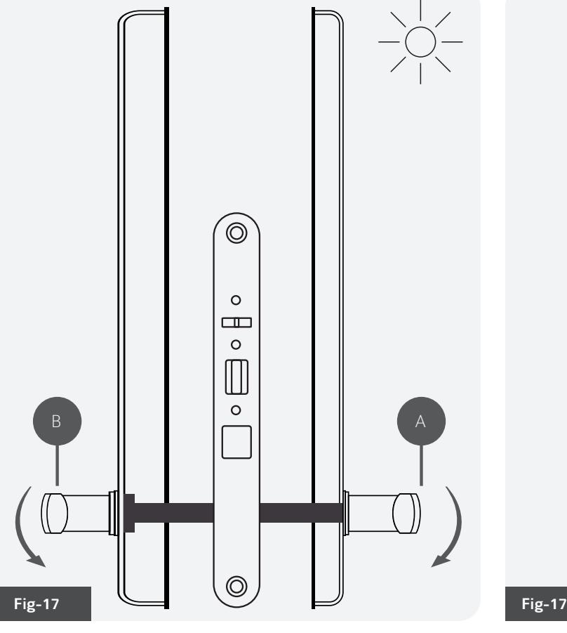

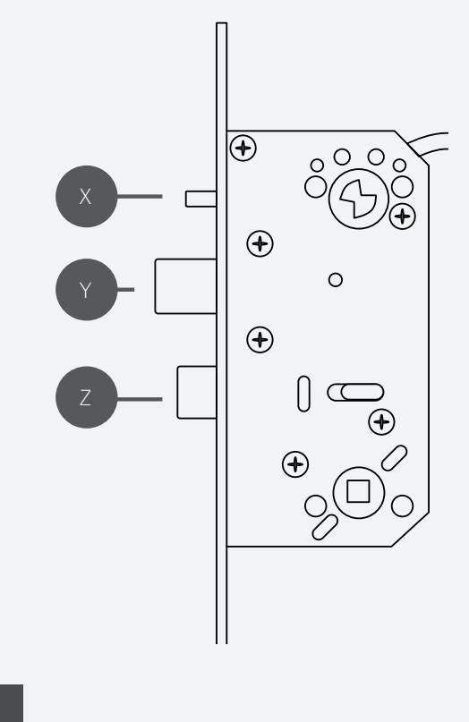

## Gjør følgende

2/2: Manuelle funksjonstester

- 2 Ha døren i åpen posisjon. Bruk knappvrider på innsiden og se til at reilen i låskassen trekker seg inn og ut uten å gi særlig motstand tilbake til knappvrideren. Slik illustrert av ( A - B ) Fig-18.
Hvis knappvrider skulle ha problemer med styring av reilen må produktet demonteres.

#### Følgende kan være årsaken:

- 1 Ledninger rundt låskasse–adapteret kan være i veien.
## Gör följande 2/2: Manuella

funktionstester

- 2 Håll dörren i öppet läge. Använd låsvredet på insidan och se till att låskolven i låshuset åker in och ut utan större motstånd. Se illustration ( A - B ) Fig-18.
Om låsvredet skulle ha problem med styrning av låsregel måste produkten demonteras.

#### Följande kan vara orsaken:

- 1 Ledningar runt låshus-adaptern kan vara i vägen.
### Do the following

2/2: Manual function tests

- 2 Keep the door in an open position. Use the thumbturn on the inside and make sure that the deadbolt moves freely in and out of the mortise body without any particular restriction in the thumbturn. Shown in ( A - B ) Fig-18.
If the deadbolt operation using the thumbturn is difficult or restricted, you will have to reinstall the product.

### The following might be the cause:

- 1 Cables surrounding the mortise lock adapter might be in the way.
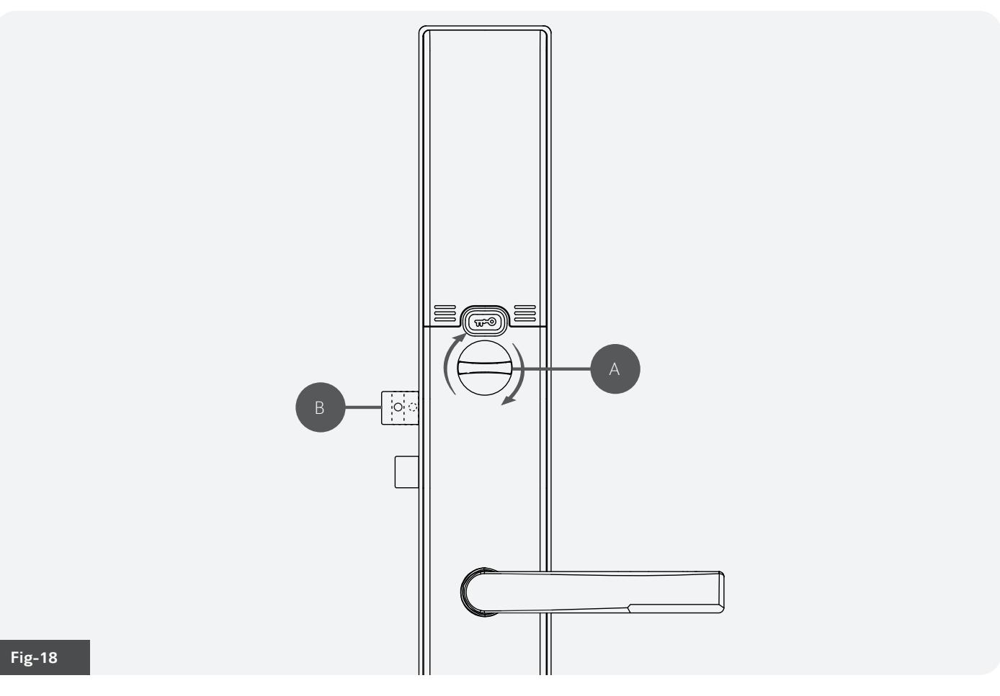

| Norsk                                                                    | Svenska                                                        | English                                                                      |
|--------------------------------------------------------------------------|----------------------------------------------------------------|------------------------------------------------------------------------------|
| Beskyttelsen fjernes Utvendig enhet                                   | Ta bort skyddet Utvändig enhet                              | Protective film is removed Exterior unit                               |
| Fjern beskyttelsen fra berøringspan elet som illustrert ( A ) Fig-19. | Ta bort skyddet från pekskärmen enligt bilden ( A ) Fig. 19 | Remove the protective film from the touch panel as shown in ( A ) Fig-19. |

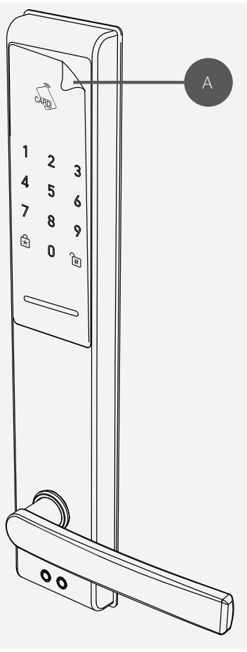

#### Norsk Svenska English

### Sluttstykke

1/2: Justeringer mot en tett og smidig dør

1 Justeringer gjøres ved å vri på justeringshjulene ( A - B ) Fig-20.

Bruk vedlagt unbrakonøkkel i skruesett for sluttstykke.

- 1 «Mottaker-leppe» for reile ( E ) justeres gjennom justeringsmekanisme ( A )
- 2 «Mottaker-leppe» for falle ( F ) justeres gjennom justeringsmekanisme ( B )

#### Rett pakningstrykk og funksjon

Juster mottaker-leppene ( E – F ) slik at døren sitter tett mot karmen, uten "slark" i låst posisjon.

- X Sensorfalle
- Y Reile
- Z Falle

### Slutbleck

1/2: Justeringar för en tätt och smidig dörr

1 Justeringar görs genom att vrida justeringshjulen ( A - B ) Fig-20.

Använd insexnyckeln som ingår i förpackningen för slutblecket.

1 Plösen för tryckfallet ( E ) justerad genom justeringsmekanism (A)

2 Plösen för låskolv ( F ) justeras genom justeringsmekanism (B)

#### Rätt packningstryck och funktion

Justera plösen ( E - F ) så att dörren sitter nära karmen, utan att "glappa" i låst läge

### X Sensorkolv

- Y Låskolv
- Z Tryckesfall

### Strike plate

1/2: Adjustments to ensure a tight closing door

1 Adjustments are made turning the adjustment wheels ( A - B ) Fig-20.

Use the unbraco tool included in the screw kit for strike plate

- 1 Receiving flange ( E ) for deadbolt is adjusted using ( A )
- 2 Receiving flange ( F ) for closing latch is adjusted using ( B )

#### Correct gasket pressure and function

Adjust the flanges ( E – F ) so the door is closed tight to the jamb, without any wiggle room when locked.

- X Sensor latch
- Y Deadbolt
- Z Closing latch

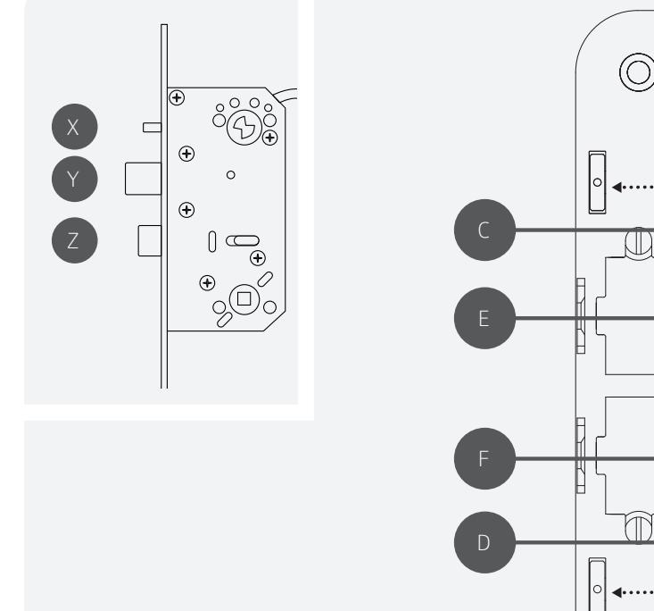

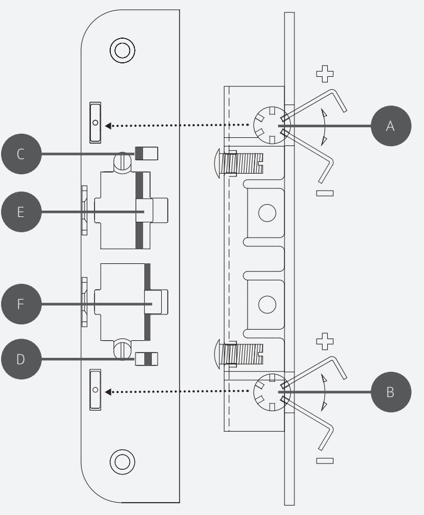

Fig-20

### Sluttstykke

2/2: Justeringer mot en tett og smidig dør

### 2 Rett justeringsforhold mellom mottakere for reile og falle

Juster mottakerleppe for reile ( A ) ca +3,5-4.0 mm i forhold til mottakerleppe for falle ( B ). Dette har sin bakgrunn i at breddene på fallen er 14 mm, mens reilen er 10,6 mm i låskassen.

Det er viktig å få dette rett, ettersom fallen i låskassen skal treffe mottak i sluttstykket, også etter døren er i låst posisjon.

### Slutbleck

2/2: Justeringar för en tätt och smidig dörr

### 2 Korrekta inställningsförhållande mellan mottagare för låskolv och tryckesfall

Justera plös för låskolv för låsregel ( A ) ca + 3,5- 4,0 mm, i förhållande till plös för tryckfall ( B ). Detta är för att tryckesfallens bredd är 14 mm, medan låskolv är 10,6 mm i låshuset.

Det är viktigt att få detta rätt, eftersom låskolven i låshuset ska passa rätt in i slutblecket, även efter att dörren är i låst läge.

### Strike plate

2/2: Adjustments to ensure a tight closing door

2 Correct ratio between flanges for deadbolt and latch

Adjust the flange for the deabolt ( A ) approx. +3,5-4.0 mm, in relation to the flange for the closing latch ( B ).

This is because the width of the closing latch 14 mm, while the deabolt is 10,6 mm wide inside the mortise lock.

It is very important to get this right, as the closing latch in the mortise lock must fit with the strike plate.

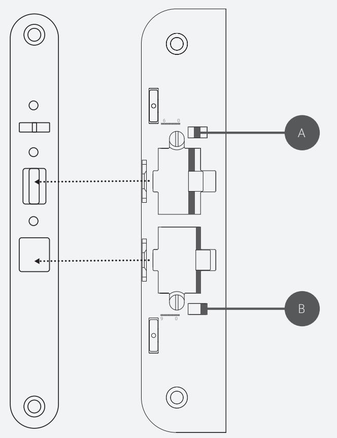

Fig-21

#### Norsk Svenska English

## Sluttstykke

### Sjekkliste for korrekt utførte justeringer

- 1 Ved lukking og låsing av dør: ( A – C ) Fig-22
Dør skal kunne lukkes og låses ( A ) uten at man samtidig skal legge vekt eller press på selve døren.

### 2 Ved opplåsning av dør: ( A – C ) Fig-23

Når døren er låst skal man dra ned håndtaket en gang ( C ). Døren skal forbli låst mot sluttstykket i samme posisjon. Reilen skal treffe mottak ( C ) i sluttstykket i det man slipper håndtaket opp igjen ( C ) .

Idet reilen treffer mottak i sluttstykket, vil fallen ( B ) bli fristilt inni sluttstykket med ca. 3,5-4.0 mm margin. Dette gjør at ved en opplåsning så må falle ( B ) kunne rotere fritt tilbake i låskassen uten motstand.

## Slutbleck

Checklista för korrekta justeringar

- 1 Vid stängning och låsning av dörren: ( A – C ) Fig-22
Dörren måste kunna stängas och låsas ( A ) utan att behöva lägga till extra vikt eller tryck

2 Vid upplåsning av dörren: ( A – C ) Fig-23

När dörren är låst, tryck ned handtaget en gång ( C ). Dörren måste förbli låst mot slutblecket i samma position. Tryckesfallen måste slå tillbaka i slutblecket när handtaget släpps ( C ).

När låskolven träffar slutblecket, kommer Tryckesfallen ( B ) att friställs inuti slutblecket med ungefärligt 3,5-4,0 mm marginal. Detta gör att låskolven ( B ) ska kunna röra sig fritt i låshuset utan motstånd.

## Strike plate Checklist for correct adjustments

- 1 When closing and locking the door: ( A – C ) Fig-22
The door must be able to be both closed and locked ( A ) without having to apply weight or pressure to the door.

### 2 When unlocking the door: ( A – C ) Fig-23

When the door is locked, depress the handle once ( C ). The door must remain locked towards the strike plate. The latch must re-seat in the stike plate ( C ) when handle is released.

As the latch connects with the strike plate, the deadbolt ( B ) will be released with a 3.5-4.0 mm margin inside the mortise. This dictates the need for the deadbolt ( B ) to freely rotate in the mortise lock without any resistance.

A B B C A C Fig-22 Fig-23

### Tilbehør Beskyttelsesdeksel for knappvrider

Knappvriderdekselet kan monteres som anvist av ( A ) Fig-24. Dekselet anbefales benyttet kun når bortesikker-modus er aktivert.

Merket sidekant på deksel ( B ) brukes til å feste deksel på hver sin side av innvendig enhet på lås.

Til vanlig brukes knapp ( C ) for opp- og igjen-låsinger. Dekselet bør bare brukes i bortesikker-modus.

### Tillbehör Skyddslock för låsvred

Skyddslocket för vredet monteras enligt instruktionerna från ( A ) Fig-24. Det rekommenderas att använda locket endast när borta-läge är aktiverat.

Den märkta sidokanten på locket ( B ) används för att säkra locket på vardera sida av den invendiga enheten på låset.

Vanligtvis används knapp ( C ) för låsning och upplåsning. Locket ska endast användas i borta-läge

Accessories Thumbturn protective cover

The protective cover for the thumbturn can be installed as shown in ( A ) Fig-24. It is recommended to use the cover only when Away mode is activated.

The side edges on the cover ( B ) is used to clip the cover onto each side of the interior unit of the lock.

In normal use the key button ( C ) is used to lock and unlock. The cover should only be installed when the lock is set to Away mode.

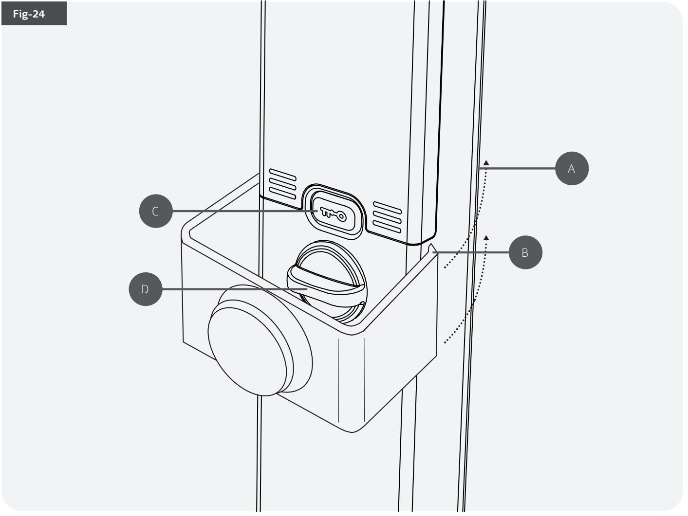

# Velg riktig retning

for dørhengsel

Henglseretning må stilles inn umiddelbart etter at batterier er satt inn!

Låsen må programmeres til å kjenne til ytterdørens hengselside. Dette finner du ut ved å se på døren fra utsiden, og notere hvilken side hengslene er montert.

For høyrehengslet dør:

- Viktig: Døren må være i åpen posisjon.
- 1 Trykk [nøkkelknapp] i 3 sek. til touchpanelet aktiveres

2 Tast [1234] etterfulgt av [*]

- 3 Tast [2] etterfulgt av [*]
- 4 Tast [9]

### For venstrehengslet dør:

### Viktig: Døren må være i åpen posisjon.

- 1 Trykk [nøkkelknapp] i 3 sek. til touchpanelet aktiveres
- 2 Tast [1234] etterfulgt av [*]
- 3 Tast [2] etterfulgt av [*]
- 4 Tast [7]

## Välj rätt riktning för dörrens gångjärn

Dörrens hängning måste ställas in omedelbart efter att man satt i batterierna!

Låset måste programmeras för att känna till ytterdörrens hängning. Detta ser du genom att titta på dörren från utsidan och se vilken sida gångjärnen är monterade.

För dörrar med höger gångjärn: Viktigt: Dörren måste vara i öppen position. 1 Håll in [nyckelknappen] i 3 sek. till touchpanelen aktiveras

2 Tryck [1234] följt av [*]

3 Tryck [2] följt av [*]

4 Tryck [9]

För vänster gångjärn dör: Viktigt: Dörren måste vara i

- öppen position.
- 1 Håll [nyckelknappen] i 3 sek. till touchpanelen aktiveras
- 2 Tryck [1234] följt av [*]
- 3 Tryck [2] följt av [*]
- 4 Tryck [7]

Programvare 1.5.0 eller nyere vil sette hengselrettningen automatisk når setter på strøm når døren er åpen

For å starte dette fra meny, bruk fremgansgsmåten for venstrehengslet dør. For å sette mottsatt hengselretning, følg fremgangsmåten for høyrehengslet dør.

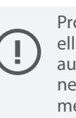

#### Programvara 1.5.0 eller senare ställer automatiskt in gångjärnets riktning när strömmen slås på när dörren är öppen.

För att starta detta från menyn, använd proceduren för vänster gångjärn. För att ställa in motsatt gångjärnsriktning, följ proceduren för den högra gångjärnsdörren.

# Setting the correct

Door hinge direction

Hinge direction must be programmed immediately after the batteries are inserted!

The lock must be programmed to know which way the hinges on the door are mounted. The hinge can beidentified by standing on the outside and looking straight at the door, and then taking note of which side the hinges are places.

### For right hinged:

Important: The door must be in open position.

- 1 Push [keybutton] for 3 sec. until touch panel is activated
- 2 Enter [1234] followed by [*]
- 3 Press [2] followed by [*]
- 4 Press [9]

For left hinged:

Important: The door must be in open position.

- 1 Push [keybutton] for 3 sec. until touch panel is activated
- 2 Enter [1234] followed by [*]
- 3 Press [2] followed by [*]
- 4 Press [7]

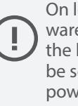

On locks with firmware 1.5.0 or newer the hinge direction will be set automaticly at power on, if the door is open.

To start this from the menu, use the left hinged door approach. To set the opposite hinge direction, follow the procedure for the right-hinged door.

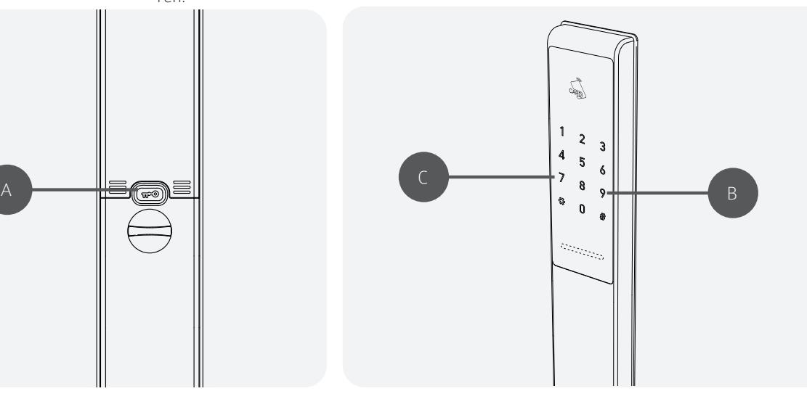

Norsk Svenska English

### Introduksjon til bruk av ID Lock 150

ID Lock 150 har to menyer:

A Tilgangsmeny (Menyvalg 1) B Innstillinger (Menyvalg 2)

Åpne tilgangsmenyen (Døren må være åpen og ulåst)

- 1 Aktiver panel ved å holde inne [nøkkelknapp] i 3 sekunder
- 2 Tast [masterkode] etterfulgt av [*]

3 Tast [1] etterfulgt av [*]

Du er nå i tilgangsmenyen, og kan endre masterkode, legge til/slette/endre servicekoden, brukerkoder eller RFID-brikker.

Åpne innstillingsmenyen (Døren må være åpen og ulåst)

1 Aktiver panel ved å holde inne [nøkkelknapp] i 3 sekunder 2 Tast [masterkode] etterfulgt av [*]

- 3 Tast [2] etterfulgt av [*]
Du er nå i innstillingsmenyen, og kan endre volum, hengselretning, låsemodus, gjenlåsing og Z-Wave-oppsett.

### Användarintroduktion till ID Lock 150

ID Lock 150 har två menyer:

- A Åtkomstmeny (Menyval 1)
- B Inställningar (Menyval 2)

Öppna åtkomstmenyn (Dörren måste vara öppen och olåst)

- 1 Aktivera panelen genom att hålla in [nyckelknappan] i 3 sekunder
- 2 Ange [masterkoden] följt av [*] 3 Tryck [1] följt av [*]

Du är nu i åtkomstmenyn och kan ändra masterkoden, lägga till / ta bort / ändra service kodän, användarkoder eller RFID-brickor.

Öppna innställningsmeny (Dörren måste vara öppen och olåst)

- 1 Aktivera panelen genom att hålla in [nyckelknappan] i 3 sekunder 2 Ange [masterkoden] följt av [*] 3 Tryck [2] följt av [*]
Du är nu innställningsmeny och kan ändra volym, dörrbladshängning, låsläge, lås- och Z-Wave-inställning.

### Introduction to using ID Lock 150

ID Lock 150 has two menus:

- A Access menu (Menu choice 1)
- B Settings menu (Menu choice 2)

Open the Access menu (The door must be open and unlocked)

- 1 Activate the touch panel by pressing [keybutton] for 3 seconds
- 2 Enter [master pin] followed by [*]
- 3 Press [1] followed by [*]

You have now entered the Access menu, and are able to change the master PIN, add/remove service PIN, user PINs and RFID keyfobs.

Open the Settings menu (The door must be open and unlocked)

- 1 Activate the touch panel by pressing [keybutton] for 3 seconds
- 2 Enter [master pin] followed by [*]
- 3 Press [2] followed by [*]

You have now entered the Settings menu, and can make changes to the volume setting, hinge direction, relocking and Z-Wave settings.

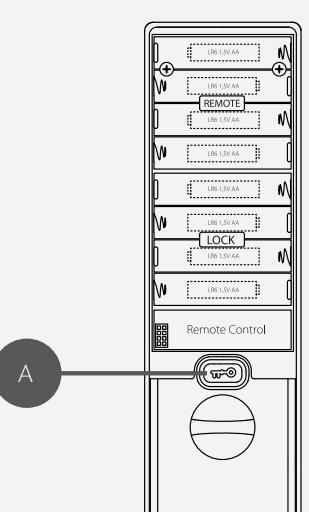

#### Norsk Svenska English

### PIN-koder og RFID nøkkelbrikker Registrere masterkode

#### Viktig: [1234] er standard

masterkode og må endres før du tar i bruk låsen.

- 1 Trykk [nøkkelknapp] ( A ) Fig-02 i tre sekunder inntil touchpanelet aktiveres
- 2 Tast [masterkode] etterfulgt av [*]
- 3 Tast [1] etterfulgt av [*]
- 4 Tast [1] etterfulgt av [*]
- 5 Tast [ny masterkode] (4 til 15 siffer) etterfulgt av [*]
- 6 Bekreft [ny masterkode]
- 7 Bekreft med [#]
- 8 Blå LED blinker som bekreftelse

Det finnes ingen måte å slette masterkoden på. Ved tilbakestilling av systemet blir masterkoden satt til opprinnelig standardkode: [1234]

- 1 Trykk [nøkkelknapp] ( A ) Fig-02 i tre sekunder inntil touchpanelet aktiveres.
- 2 Tast [masterkode] etterfulgt av [*]
- 3 Tast [1] etterfulgt av [*]
- 4 Tast [3] etterfulgt av [*]
- 5 Velg [PIN Index 1-25] etterfulgt av [*]
- 6 Tast ønsket PIN etterfulgt av [#]
- 7 OK-lyd høres. LED blinker blått som bekreftelse

- 1 Trykk [nøkkelknapp] ( A ) Fig-02 i tre sekunder inntil touchpanelet aktiveres.
- 2 Tast [masterkode] etterfulgt av [*]
- 3 Tast [1] etterfulgt av [*]
- 4 Tast [4] etterfulgt av [*]
- 5 Velg [PIN Index 1-25] etterfulgt av [#]
- 6 OK-lyd høres. LED blinker blått som bekreftelse

Hvis du ønsker å slette alle programmerte PIN-koder, tast [0] i punkt 5 ovenfor.

### PIN-koder och RFID nyckelbricka Programmera masterkoden

### Viktig: [1234] är standard

masterkod och måste ändras innan låset kan tas i bruk

- 1 Håll [nyckelknapp] ( A ) Fig-02 i tre sekunder till touchpanelen aktiveras.
- 2 Ange [masterkoden] följt av [*]
- 3 Tryck [1] följt av [*]
- 4 Tryck [1] följt av [*]
- 5 Ange [ny masterkod] (4 till 15 siffror) följt av [*]
- 6 Bekräfta [ny masterkod]
- 7 Bekräfta med [#]
- 8 Blå LED blinkar som bekräftelse

Det finns inget sätt att radera masterkoden. När systemet återställs, kommer masterkoden att ställas om till den ursprungliga standardkoden: [1234]

#### Registrere PIN-koder Adding PIN Registrera PIN-koder

- 1 Håll [nyckelknapp] ( A ) Fig-02 i tre sekunder till touchpanelet aktiveras.
- 2 Ange [masterkoden] följt av [*]
- 3 Tryck [1] följt av [*]
- 4 Tryck [3] följt av [*]
- 5 Välj [PIN Index, 1-25] följt av [*]
- 6 Tryck önskad PIN följt av [#]
- 7 OK-signal hörs. LED blinkar blå som bekräftelse

#### Slette PIN-koder Deleting PIN Radera PIN-koder

- 1 Håll [nyckelknapp] ( A ) Fig-02 i tre sekunder till touchpanelet aktiveras.
- 2 Ange [masterkoden] följt av [*]
- 3 Tryck [1] följt av [*]
- 4 Tryck [4] följt av [*]
- 5 Välj [PIN Index 1-25] följt av [#]
- 6 OK-signal hörs. LED blinker blått som bekräftelse

Om du vill radera alla programmerade PIN-koder, slår du [0] i punkt 5 ovan.

### PIN and RFID keyfobs Programming master PIN

#### Note: [1234] is the default

master PIN, and must be changed before you begin using the lock.

- 1 Press [key button] ( A ) Fig-02 for 3 seconds until touch panel activates
- 2 Enter [masterkode] followed by [*]
- 3 Press [1] followed by [*]
- 4 Press [1] followed by [*]
- 5 Enter [new master PIN] (4 to 15 numbers) followed by [*]
- 6 Confirm [new master PIN]
- 7 Confirm by pressing [#]
- 8 Blue LED flashes to confirm

It is not possible to delete the master PIN. By resetting the system, the master PIN will also be reset to the default value [1234]

- 1 Press [key button] ( A ) Fig-02 for three seconds until touch panel activates.
- 2 Enter [master PIN] followed by [*]
- 3 Press [1] followed by [*]
- 4 Press [3] followed by [*]
- 5 Choose [PIN Index 1-25] followed by [*]
- 6 Enter desired PIN followed by [#]
- 7 Confirmation sound audible. Blue LED flashes to confirm new PIN registered.

- 1 Press [key button] ( A ) Fig-02 for three seconds until touch panel activates.
- 2 Enter [master PIN] followed [*]
- 3 Press [1] followed by [*]
- 4 Press [4] followed by [*]
- 5 Choose [PIN Index 1-25] followed by [#]

6 Confirmation sound audible. Blue LED flashes to confirm PIN has been deleted.

If you wish to delete all programmed PINs, press [0] in step 5 above.

### Servicekode

Tids- eller bruksbegrenset PIN

### Døren skal være åpen

- 1 Trykk [nøkkelknapp] i 3 sek. til touchpanelet aktiveres
- 2 Tast [masterkode] etterfulgt av [*]
- 3 Tast [1] etterfulgt av [*]

4 Tast [2] fulgt av [*] for servicekodemeny

5 Tast [servicekode] (4-15 siffer) etterfulgt av [*]

### 6 Velg [SERVICEMODUS] (se nedenfor)

- 7 Vent på kvitteringslyd og blinkende BLÅ led for bekreftelse av innstilling
#### SERVICEMODUS

- [0] Slette servickode
- [1] 1 gangs bruk
- [2] 2 gangers bruk
- [3] 5 gangers bruk
- [4] 10 gangers bruk
- [7] Alltid aktiv
- [8] 12 timers varighet
- [9] 24 timers varighet

### Deaktivere opplåsing med masterkode

Slik stiller du inn alternativene for opplåsing med masterkode og service kode.

Masterkode må forsatt benyttes ved adgang til menyen. Minst en brukerkodemå være aktiv, for å kunne deaktivere Mastekoden.

#### Døren skal være åpen

1 Trykk [nøkkelknapp] i 3 sek. til touchpaneletaktiveres

2 Tast [masterkode] etterfulgt av [*]

3 Tast [1] etterfulgt av [*]

4 Tast [5] etterfulgt av [*]

- 5 Tast [pinmodus]
### PINMODUS

[0] Deaktiver opplåsing med både master-og servicekode.

[1] Aktiverer mulighet for opplåsing medbåde master- og servicekode.

[2] Aktiverer eller deaktiverer opplåsingmed masterkode.

[3] Aktiverer eller deaktiverer opplåsingmed servicekode.

### Norsk Svenska English

### Servicekod

Tids- eller funktionsbegränsad PIN

### Dörren skall vara öppen

1 Håll in [nyckelknappen] i 3 sek. till touchpanelen aktiveras

- 2 Ange [masterkoden] följt av [*]
- 3 Tryck [1] följt av [*]

4 Tryck [2] följt av [*] för servicemenyn

5 Ange [servicekoden] (4-15 siffror) följt av [*]

6 Tryck [SERVICEMODUS] (se nedan) 7 Vänta på signalen och blinkande BLÅ LED för bekräftelse av inställning

#### SERVICEMODUS

- [0] Radear servicekode
- [1] 1 gångs bruk
- [2] 2 gångers bruk
- [3] 5 gångers bruk
- [4] 10 gångers bruk
- [7] Alltid aktiverad
- [8] 12 timmars varaktighet
- [9] 24 timmars varaktighet

### Inaktivera upplåsning av masterkod

Så här ställer du in alternativet för upplåsning av masterkod och servicekod. Masterkod fortsätter att användas när du öppnar menyn. Minst en användarkod måste vara aktiv för att inaktivera masterkoden.

#### Dörren skall vara öppen

1 Håll in [nyckelknappen] i 3 sek. til touchpanelen aktiveras

2 Ange [masterkoden] följt av [*]

- 3 Tryck [1] följt av [*]
- 4 Tryck [5] följt av[*]
- 5 Tryck [PIN-modus]

### PINMODUS

[0] Inaktivera upplåsning med bådemaster- och servicekod.

[1] Aktiverar möjligheten att låsa uppmed både master- och servicekod.

[2] Aktiverar eller inaktiverar upplåningav masterkod.

[3] Aktiverar eller inaktiverar upplåsning med servicekod.

### Service PIN Time or usage limited PIN

### The door must be open

- 1 Push [keybutton] for 3 sec. until touch panel is activated
- 3 Enter [master PIN] followed by [*]
- 4 Press [1] followed by [*]
- 4 Press [2] and [*] for Service PIN menu
- 5 Enter [service PIN] (4-15 numbers) followed by [*]
- 6 Enter [SERVICEMODE] (see below)
- 7 Wait for confirmation sound and a the blue flashin LED confirmation.

#### SERVICEMODE

- [0] Delete servicepin
- [1] 1 time use
- [2] 2 times use
- [3] 5 times use
- [4] 10 times use
- [7] Always active
- [8] 12 hour duration
- [9] 24 hour duration

### Deactivate unlocking with masterpin

Set the master code and service code unlock options.

Master Code still needs to be used when accessing the menus. At least one user pin must be active in order to disable the Master pin.deaktivere Mastekoden.

#### The door must be open

1 Push [keybutton] for 3 sec. until touch panel is activated

- 2 Enter [master PIN] followed by [*]
- 3 Press [1] followed by [*]
- 4 Press [5] followed by [*]
- 5 Press [pinnmodus]

#### PINMODUS

[0] Deactivate unlocking with bothmaster and service pin.

[1] Activate the opportunity for unlockingwith both master and service pin.

[2] Activate or deactivate unlockingwith masterpin.

[3] Activate or deactivate unlockingwith servicepin.

## RFID nøkkelbrikker

Registrering

- 1 Trykk [nøkkelknapp] i tre sekunder inntil touchpanelet aktiveres.
- 2 Tast [masterkode] etterfulgt av [*]
- 3 Tast [1] etterfulgt av [*]
- 4 Tast [6] etterfulgt av [*]
- 5 Velg [RFID index 1-25] etterfulgt av [*]
- 6 Hold nøkkelbrikken foran RFID-symbolet på utvendig enhet
- 7 OK-lyd høres.Bekreft med [#] når du er ferdig
- 8Blå LED blinker som bekreftelse
- 9

- 1 Trykk [nøkkelknapp] i tre sekunder inntil touchpanelet aktiveres.
- 2 Tast [masterkode] etterfulgt av [*]
- 3 Tast [1] etterfulgt av [*]
- 4 Tast [7] etterfulgt av [*]
- 5 Velg [RFID index 1-25].
- 6 Bekreft med [#] når du er ferdig

Ønsker du å slette alle registrerte RFID nøkkelbrikker, deretter tast [0] i punkt 5 ovenfor.

### RFID-modus Deaktivering av opplåsing med RFID-brikker

RFID-modus lar deg aktivere eller deaktivere muligheten for å låse opp med RFID-brikker. Benyttes hvis du ønsker kun opplåsing med PIN eller via modul.

- 1 Trykk [nøkkelknapp] i tre sekunder inntil touchpanelet aktiveres.
- 2 Tast [masterkode] etterfulgt av [*]
- 3 Tast [1] etterfulgt av [*]
- 4 Tast [8] etterfulgt av [*]
- 5 Tast [rfidmodus]

### RFIDMODUS

- [0] Deaktiverer opplåsing med RFID
- [1] Aktiverer opplåsing med RFID

## RFID nyckelbrickor Registrering

- 1 Håll [nyckelknapp] i tre sekunder till touchpanelen aktiveras.
- 2 Ange [masterkoden] följt av [*]
- 3 Tryck [1] följt av [*]
- 4 Tryck [6] följt av [*]
- 5 Välj [RFID index 1-25] följt av [*]
- 6 Håll knappsatsen framför RFID-symbolen på den externa enheten
- 7 OK-signalen hörs.Bekräfta med [#] när du är kla
- 8 Blå LED blinkar som bekräftelse

### Radera

1 Håll [nyckelknapp] i tre sekunder till touchpanelen aktiveras.

- 2 Ange [masterkoden] följt av [*]
- 3 Tryck [1] följt av [*]
- 4 Tryck [7] följt av [*]
- 5 Välj [RFID index 1-25].
- 6 Bekräfta med [#] när du är klar

Vill du radera alla registrerade RFID-nyckelringar, slå [0] i punkt 5 ovan.

### RFID-läge Inaktiverar upplåsning av RFID-brickor

Med RFID-läge kan du aktivera eller inaktiveramöjligheten att låsa upp med RFID-brickor. Används om du bara vill låsa upp med PIN eller via modul.

1 Håll [nyckelknapp] i tre sekunder till touchpanelen aktiveras.

2 Ange [masterkoden] följt av [*]

- 3 Tryck [1] följt av [*]
- 4 Tryck [8] följt av [*]
- 5 Tryck [rfidmodus]

### RFIDMODUS

[0] DEAKTIVERER UPPLÅSING AV RFID [1] AKTIVERAR UPPLÅSING AV RFID

### RFID keyfobs Adding RFID

- 1 Press [key button] for three seconds until touch panel activates.
- 2 Enter [master PIN] followed by [*]
- 3 Press [1] followed by [*]
- 4 Press [6] followed by [*]
- 5 Choose [RFID index 1-25] followed by [*]
- 6 Present the keyfob to the RFID icon on the exterior unit
- 7 Confirmation sound audible.
- 8 Confirm by pressing [#] when finished
- 9 Blue LED flashes as confirmation

### Sletting Deleting RFID

- 1 Press [key button] for three seconds until touch panel is activated
- 2 Enter [master PIN] followed by [*]
- 3 Enter [1] followed by [*]
- 4 Enter [7] followed by [*]
- 5 Chose [RFID index 1-25].
- 6 Confirm by pressing [#] when finished

If you wish to delete all registered RFID keyfobs, enter [0] in step 5 above.

### RFID-mod Deactivating unlocking of RFID-keyfobs

RFID-mod allows you to activate or deactivate

unlocking with RFID-keyfobs. use only PIN or module if you want.

1 Press [key button] - for three seconds until touch panel activates. 2 Enter [master PIN] followed by [*] 3 Press [1] followed by [*] 4 Press [8] followed by [*] 5 Press [rfidmode]

### RFIDMODUS

[0] DEACTIVATE UNLOCKING WITH RFID [1] ACTIVATE UNLOCKING WITH RFID

## Innstillinger

Deaktiver automatisk låsing

- 1 Åpne døren. Hold inne innvendig [nøkkelknapp] i 3 sek inntil utsidepanelet aktiveres
- 2 Tast [masterkode] etterfulgt av [*]

3 Tast [2] etterfulgt av [*]

- 4 Tast [4]
## Aktivere automatisk låsing Smekklås

- 1 Åpne døren. Hold inne innvendig [nøkkelknapp] i 3 sek inntil utsidepanelet aktiveres
- 2 Tast [masterkode] etterfulgt av [*]
- 3 Tast [2] etterfulgt av [*]
- 4 Tast [6]

## Inställningar

Deaktivera automatisk låsning

- 1 Öppna dörren. Håll inne [nyckelknapp] i 3 sek tills den yttre panelen är aktiverad
- 2 Ange [masterkoden] följt av [*] 3 Tryck [2] följt av [*]
- 4 Tryck [4]

### Aktivera automatisk låsning

- 1 Öppna dörren. Håll inne [nyckelknapp] i 3 sek tills den yttre panelen är aktiverad.
- 2 Ange [masterkoden] följt av [*]
- 3 Tryck [2] följt av [*]
- 4 Tryck [6]

## Settings

### Deactivate automatic locking

- 1 Open door. Press and hold interior [key button] for three seconds until touch panel is activated
- 2 Enter [master PIN] followed by [*]
- 3 Press [2] followed by [*]
- 4 Press [4]

### Activate automatic locking

### 1 Open door. Press and hold interior [key button] for three seconds until touch panel is activated

- 2 Enter [master PIN] followed by [*]
- 3 Press [2] followed by [*]
- 4 Press [6]

### Gjenlåsing Aktivering og deaktivering

Som standard vil ID Lock automatisk låse igjen hvis en låst dør ikke blir åpnet etter opplåsing. Deaktivering av gjenlåsing hindrer dette.

Døren må være åpen og ulåst.

- 1 Hold inne [nøkkelknapp] i tre sekunder
- 2 Tast [masterkode] etterfulgt av [*]
- 3 Tast [2] etterfulgt av [*] for innstillinger
- 4 Tast [8]
- 5 Trykk [0] for å deaktivere gjenlåsing eller [1] for å aktivere

## Omlåsning

## Aktivering och avaktivering

Som standard, låser ID Lock automatiskt igen om en låst dörr inte öppnas efter upplåsningen. Deaktivering av omlåsning hindrar detta.

Dörren måste vara öppen och olåst.

- 1 Håll in [nyckelknappen] i tre sekunder
- 2 Ange [masterkoden] följt av [*]
- 3 Tryck [2] följt av [*] for inställningar
- 4 Tryck [8]
- 5 Tryck [0] för att inaktivera låsning eller [1] för att aktivera

### Relock Activation and deactivation

By default, the ID Lock will automatically relock the door if an already locked door gets unlocked, but remains unopened. This is avoided by deactivating relocking.

The door must be open and unlocked. 1 Press [key button] for three seconds until touch panel activates

- 2 Enter [master PIN] followed by [*]
- 3 Press [2] followed by [*]
- 4 Press [8]
- 5 Press [0] to deactivate relock or [1] to activate relock

#### Norsk Svenska English

## Innstillinger

Lyd og varsler

### Lyd opp:

- 1 Hold inne innvendig [nøkkelknapp] i 3 sek inntil utsidepanelet aktiveres
- 2 Tast [masterkode] etterfulgt av [*]
- 3 Tast [2] etterfulgt av [*]
- 4 Tast [3] gjentatte ganger inntil du når ønsket lydnivå
- 5 Tast [#]

## Inställningar

Ljud och varningar

### Ljud upp:

- 1 Håll [nyckelknapp] i 3 sek till touchpanelen aktiveras
- 2 Ange [masterkoden] följt av [*]
- 3 Tryck [2] följt av [*]
- 4 Tryck flera gånger på [3] tills du når önskad ljudnivå.
- 5 Tryck [#]

### Settings Sounds and warnings

### Increase audio levels:

- 1 Press [key button] for three seconds until touch panel activates
- 2 Enter [master PIN] followed by [*]
- 3 Enter [2] followed by [*]
- 4 Press [3] repeatedly until you reach desired audio level
- 5 Press [#] to confirm

### Lyd ned:

- 1 Hold inne innvendig [nøkkelknapp] i 3 sek inntil utsidepanelet aktiveres
- 2 Tast [masterkode] etterfulgt av [*]
- 3 Tast [2] etterfulgt av [*]
- 4 Tast [1] gjentatte ganger inntil du når ønsket lydnivå
- 5 Tast [#]

### Ljud ned:

- 1 Håll [nyckelknapp] i 3 sek till touchpanelen aktiveras
- 2 Ange [masterkoden] följt av [*]
- 3 Tryck [2] följt av [*]
- 4 Tryck flera gånger på [1] tills du når önskad ljudnivå.
- 5 Tryck [#]

### Decrease audio levels:

- 1 Press [key button] for three seconds until touch panel activates
- 2 Enter [master PIN] followed by [*]
- 3 Enter [2] followed by [*]
- 4 Press [1] repeatedly until you reach desired audio level
- 5 Press [#] to confirm

### Z-Wave

Inkludering og ekskludering av dørlåsen

Døren må være åpen og ulåst.

- 1 Hold inne [nøkkelknapp] i tre sekunder
- 2 Tast [masterkode] etterfulgt av [*]
- 3 Tast [2] etterfulgt av [*] for innstillinger
- 4 Tast [5] for å sette låsen i Z-Wave inclusion/exclusion
- 5 Vent på kvitteringslyd og BLÅ led for bekreftelse av innstilling

### Z-Wave local reset:

Døren må være åpen og ulåst.

OBS! Z-Wave lokal tilbakestilling fører til at du må gjennomføre ny inclusion-prosedyre med din gateway.

Dersom låsen allerede er koblet til et netverk, vil local reset gjøre at låsen tilbakestilles til fabrikkinstillinger.

- 1 Hold inne [nøkkelknapp] i tre sekunder
- 2 Tast [masterkode] etterfulgt av [*]
- 3 Tast [2] etterfulgt av [*] for innstillinger
- 4 Tast [0] for å nullstille alle innstillinger på Z-Wave-modul

Montert Z-Wave-modul kan medføre økt batte-

riforbruk.

- 5 Vent på kvitteringslyd og BLÅ led for bekreftelse av innstilling
### Z-Wave

Inkludering och uteslutning av dörrlåsen

Dörren måste vara öppen och olåst.

- 1 Håll in [nyckelknappen] i tre sekunder
- 2 Ange [masterkoden] följt av [*]
- 3 Tryck [2] följt av [*] for inställningar
- 4 Tryck [5] for att sätta låsen i Z-Wave inclusion/exclusion
- 5 Vänta på OK-signal och BLÅ led for bekräftelse av inställning.

### Z-Wave local reset:

Dörren måste vara öppen och olåst. OBS! Z-Wave Local Reset gör att du kan slutföra ett nytt inkopplingsförfarande med din gateway.

Om låset redan är anslutet till ett nätverk kommer lokal återställning att låsas återställs till fabriksinställningar.

1 Håll in [nyckelknappen] i tre sekunder

- 2 Ange [masterkoden] följt av [*]
- 3 Tryck [2] följt av [*] for inställningar
- 4 Tryck [0] för att återställa alla inställningar på Z-Wave-modulen
- 5 Vänta på OK-signal och BLÅ led for bekräftelse av inställning.

Monterad Z-Wave modul kann medföra ökad batteriförbrukning.

Z-Wave Door lock inclusion and exclusion

Door must be open and unlocked.

- 1 Press [key button] for three seconds
- 2 Enter [master PIN] followed by [*]
- 3 Press[2] followed by [*] for settings
- 4 Press [5] to set the lock in Z-Wave inclusion/exclusion mode

5 Wait for confirmation sound and the flashing blue LED

### Z-Wave local reset:

Door must be open and unlocked. Note! Z-Wave local reset necessitates performing a new inclusion-procedure with your gateway.

If the lock is already connected to a network, local reset will cause the lock to be reset to factory settings.

- 1 Press [key button] for three seconds
- 2 Enter [master PIN] followed by [*]
- 3 Press [2] followed by [*]
- 4 Press [0] to reset all settings on Z-Wave module

5 Wait for confirmation sound and the flashing blue LED

Installed Z-Wave module may cause increased battery consumption.

# Daglig bruk

Låse opp døren

### PIN:

- 1 Berør (aktiver) utsidepanel med håndflaten eller baksiden av alle fingrene
- 2 Tast [PIN]
- 3 Tast [#]

### RFID

- 1 Berør (aktiver) utsidepanel
- 2 Vis RFID-brikke foran leser.

### Aktivering av bortemodus

- 1 Når døren er låst, tast gyldig PIN-kode etterfulgt av [*]
- 2 Låsen bekrefter bortemodus med blinkende RØDT lys i hengelås-symbolene

### Deaktivering av bortemodus

- 1 Lås opp døren
- 2 Låsen bekrefter deaktivert bortemodus med blinkende GRØNT lys i hengelås-symbolene

### Daglig bruk Låse igjen døren

### Manuell låsing

Berør utsidepanelet med håndflaten eller baksiden av fingrene, slik at panelet dekkes.

### Automatisk låsing

Dør låses automatisk etter ca 3 sek.

Kontroller at RØD LED-diode bølger frem og tilbake.

### PIN:

- 1 Tryck (aktivera) ytterpanelen med handflatan eller baksidan av alla fingrarna
- 2 Ange [PIN]
- 3 Tryck [#]

### RFID

- 1 Tryck (aktivera) ytterpanelen
- 2 Håll RFID-brickan framför läsaren.

### Aktivering av borta-läge

- 1 När dörren är låst, ange en giltig PIN-kod följt av [*]
- 2 Låset bekräftar borta-läge med blinkande RÖD ljus i hänglåsens symboler

### Avaktivering av borta-läge

- 1 Lås upp dörren
- 2 Låset bekräftar avaktiverat borta-läge med blinkande GRÖNT ljus i hänglås symbolerna

### Daglig användning Lås dörren

### Manuell låsning

Tryck (aktivera) ytterpanelen med handflatan eller baksidan av alla fingrarna

### Automatiskt låsning

Dörren låses automatiskt efter ca 3 sek.

Kontrollera att den röda LED-dioden blinkar fram och tillbaka.

### Daily use Unlocking the door

### PIN:

- 1 Touch (activate) exterior touch panel with the back of your hand or the back of all fingers
- 2 Enter [PIN]
- 3 Enter [#]

### RFID

- 1 Touch (activate) exterior touch panel
- 2 Present RFID keyfob to the RFID icon

### Activating away mode

- 1 When the door is locked, enter any programmed [PIN] followed by [*] 2 The lock confirms away mode with the padlock icons flashing RED
### Deactivating away mode

- 1 Unlock door
- 2 The lock confirms away mode deactivated with the padlock icons flashing Green

### Daily Use Locking the door

### Manual locking

Touch the exterior touch panel with the back of your hand or the back of all your fingers.

### Automatic locking

The door will lock itself after approx. three seconds.

Check to see that the LED displays a waving RED light as confirmation.

Norsk Svenska English

Daglig användning

Lås upp dörren

## Utløsende alarmer Alarm triggers

ID Lock kodelås utløser en innebygget alarm i følgende tilfeller:

### TEMPERATUR

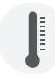

Utløses ved høye temperaturer (+55 °C) på innsiden av døren, i det området ID Lock kodelåsen står.

#### Deaktivering:

Alarmen kan ikke deaktiveres, men skrur seg selv av når temperaturen har sunket. Kan stanses ved å ta ut batteriene av låsenheten.

#### Hensikt:

Tiltrekker seg folks oppmerksomhet fra utsiden.

Veileder og varsler folk på innsiden mot utgangene, spesielt i uoversiktlige og røykfylte bygninger.

## Utlösning av larm

ID Lock kodlås utlöser ett inbyggt larm i följande fall:

### TEMPERATUR

Utlöst vid hög temperatur (+55 ° C) på insidan av dörren, i närområdet där ID Lock kodlåset är monterad.

#### Avaktivering:

Larmet kan inte avaktiveras, men stängs av när temperaturen har sjunkit. Kan stoppas genom att ta bort batterierna från låsenheten.

#### Ändamål:

Lockar uppmärksamhet från utsidan. Vägleder och varnar människor på insidan mot utgångarna, särskilt i områden som är svår orienterade eller rökiga.

The ID Lock will trigger the built in alarm in the following scenarios:

### TEMPERATURE

Triggered if high temperatures (+55 °C) is detected on the inside, in the vicinity where the lock is installed

#### Deactivation:

The alarm cannot be deactivated, but will turn itself off when the temperature is reduced. May be forced silent by removing all batteries from the unit.

#### Intention:

Attracts attention from the outside. Guides and warns people on the inside towards exits, particularly useful in buildings hard to navigate and filled with smoke.

### INNBRUDD

Dør og karm blir forsøkt skilt fra hverandre. Angrep mot dørblad rundt låskasse.

### Deaktiverings- og tilbakestillingsprosedyre:

Deaktiveres ved å aktivere panel og taste gyldig PIN etterfulgt av [#].

#### Hensikt:

Tiltrekker seg uønsket oppmerksomhet fra utsiden mot uvedkommende.

Alarm utløses i god tid før uvedkommende har brutt opp dør.

### INBROTT

Vid försök att separera dörr och karm från varandra. Angrep mot dörrblad runt låshuset.

#### Deaktiverings- och återställningsprocedur:

Inaktivera genom att aktivera panelen och ange giltig PIN-kod följt av [#].

### Ändamål:

Lockar oönskad uppmärksamhet från utsidan.

Larmet utlöses i god tid innan den obehöriga personen har brutit upp dörren.

### BREAKIN ATTEMPTS

Door leaf and jamb attempting to be separated. Attack towards door leaf close to the mortise lock.

#### Procedure for deactivation and resetting:

Alarm is deactivated by activating the touch panel and then entering any programmed [PIN ] followed by [#].

#### Intention:

Attracts attention from the outside. Alarm will sound well before unwanted visitors have managed to break in through the door.

### Norsk Svenska English

Fra utside ved utladete batterier: ( A – B ) Fig-26

- 1 Plasser et 9V batteri mot polene på utvendig enhet ( A ).
- 2 Betjen lås på vanlig måte ( B ), mens du stabilt holder batteriet mot polene ( A ).
- 3 Sett i nye batterier omgående på innvendig enhet.

Fra innsiden ved utladete eller manglende batterier:

- 1 Fjern beskyttende knappevrider deksel dersom dette er montert ( A ) Fig-27.
- 2 Vri om knappevrider for opplåsning.
- 3 Sett i nye batterier omgående på innvendig enhet.

## Tilbake til fabrikkinnstillinger

- 1 Hold inne åpneknapp mens du setter inn batterier.
- 2 Når du hører kvitteringstone slipper du knappen.
- 3 Du hører da en ny kvitteringstone.

Enheten er fabrikkinstillt.

- Viktig: Alle innstillinger, koder og RFID-brikker er slettet
#### Nødåpningsmuligheter Emergency opening Nödöppningsmöjligheter

Från utsidan, vid urladdade batterier: ( A - B ) Fig-26

- 1 Placera ett 9V-batteri mot polerna på den externa enheten ( A ).
- 2 Använd lås normalt ( B ) medan du håller fast batteriet mot polerna (A).
- 3 Sätt in nya batterier omedelbart på den interna enheten.

Från insidan, vid urladdade eller saknade batterier:

- 1 Ta bort skyddslocket för vredet om den är monterad (A) Fig-27.
- 2 Vrid runt för vredet för upplåsning.
- 3 Sätt in nya batterier omedelbart på den interna enheten.

### Tillbaka till fabriksinställningar

- 1 Tryck och håll ner öppningsknappen när du sätter i batterierna.
- 2 När du hör bekräftelsesignal, släpp knappen.
- 3 Du hör en ny bekräftelsesignal

Enheten är fabriksinställd.

- Viktigt: Alla inställningar, koder och RFID-brickor har raderats
From the outside, in case of discharged batteries: ( A – B ) Fig-26

- 1 Place a 9V battery on the battery poles on the exterior unit ( A ).
- 2 Operate the lock as usual ( B ), while steadying the battery towards the battery poles ( A ).
- 3 Immediately insert new batteries to the interior unit.

From the inside in case of discharged or missing batteries:

- 1 If fitted, remove protective thumbturn cover ( A ) Fig-27.
- 2 Operate thumbturn to unlock.
- 3 Immediately insert new batteries to the interior unit.

## Factory reset

- 1 Press and hold [key button] while inserting batteries
- 2 When confirmation sound is heard, release the button.
- 3 Another confirmation sound is heard

The unit has been reset to factory settings.

Note: All settings, PINs and RFID keyfobs will be deleted.

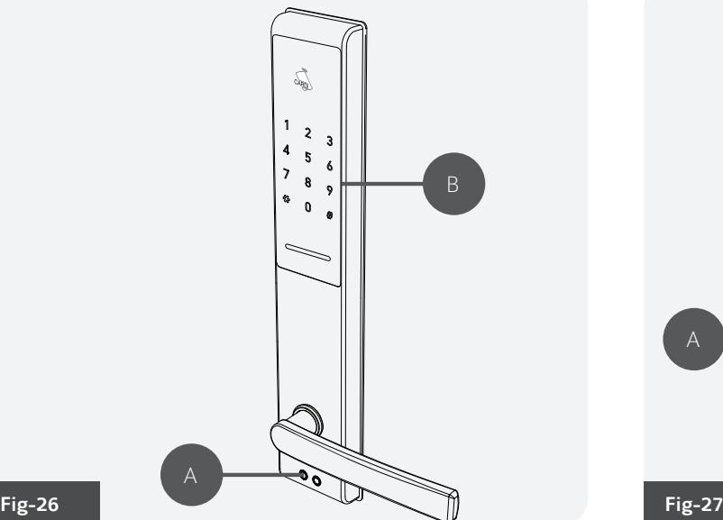

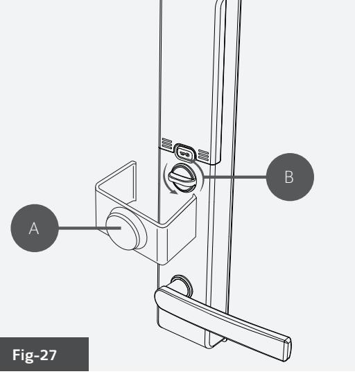

### Teknisk sammendrag Technical summary

Kodelås -150-serien:

#### Miljø:

- Innsideenhet: IP21
- Utsideenhet: IP55
- Låskasse: IP55

#### Temperaturer:

- Utendørs: -25º C til 70º C
- Innendørs: 0º C til 70º C

#### Minnekapasitet:

- 25 x RFID tags
- 1 x Masterkode (4-8 siffer)
- 25 x Brukerkode (4-8 siffer)
- 1 x Midlertidige kode (4-8 siffer)

#### Batterilevetid:

Se informasjon på idlock.no.

Låskasse -150 serien:

#### CE-godkjent:

- STANDARD: EN 14846:2008
- RATING: 3 | X | 9 | | L | 7 | 1 | 3

### Sertifiseringer Certifications

ID Lock RFID kodelås er CE-godkjent og sertifisert som oppsummert fra tabell. CE-merket finnes på innsiden av batterideksel sammen med serienummeret.

#### Communauté Européenne

Er beviset på at produktet oppfyller sikkerhetskravene som er fastsatt i direktivene som er listet i tabell nedenfor. CE-merking er myndighetspålagt.

Related standards for R&TTE Directives 1999/5/EC of 9th March

Safety: EN 60950-1:2006/A11:2009

EMC: EN 301 489-1:V1.9.2(2011.09) EN 301 489-3:V1.6.1(2013.06)

Radio: EN 300 330-1:V1.8.1(2015.03) EN 300 330-2:V1.6.1(2015.03)

Health: Not Assessed

Eiendom vedrørende og tilhørende dette produktet som er forbeholdt ID Lock: Varemerke, Varemerkenavn, Design, Patenter, Copyright, Proprietære rettigheter

## Teknisk sammanfattning

### Kodlås -150-serien:

#### Miljö:

- Intern enhet: IP21
- Extern enhet: IP55
- Låshus: IP55

#### Temperaturer:

- Utomhus: -25º C til 70º C
- Inomhus: 0º C til 70º C

#### Minneskapacitet:

### • 25 x - RFID brickor

- 1 x Masterkod (4-8 siffror)
- 25 x Användarkoder (4-8 siffror)
- 1 x Service kod (4-8 siffror)

#### Batteritid:

Se information på idlock.no.

Låshus -150 serien:

#### CE godkänd:

- STANDARD: EN 14846:2008
- RATING: 3 | X | 9 | | L | 7 | 1 | 3

### Certifieringar

ID Lock RFID kodlås är CE-godkänd och certifierad som summerat i tabellen. CE-märket är placerat inuti batteriluckan tillsammans med serienumret

Communauté Européenne

Bevis på att produkten uppfyller de säkerhetskrav som anges i direktiven i tabellen nedan. CE-märkning krävs enligt lag.

Related standards for R&TTE Directives 1999/5/EC of 9th March

Safety: EN 60950-1:2006/A11:2009

EMC: EN 301 489-1:V1.9.2(2011.09) EN 301 489-3:V1.6.1(2013.06)

Radio: EN 300 330-1:V1.8.1(2015.03) EN 300 330-2:V1.6.1(2015.03)

Health: Not Assessed

Egendom av ID Lock rörande denna produkt: Varumärket, Varumärkesnamn, Design, Patenter, Copyright, Proprietära rättigheter

### Electronick lock 150 series:

#### Environment:

- Interior unit: IP21
- Exterior unit: IP55
- Mortise lock: IP55

#### Temperatures:

- Outside: -25º C til 70º C
- Inside: 0º C til 70º C

#### Memory capacity:

- 25 x RFID keyfobs
- 1 x Master PIN (4-8 numbers)
- 25 x User PINs (4-8 numbers)
- 1 x Service PIN (4-8 numbers)

#### Battery life:

See information provided on idlock.no

Mortise lock 150 series:

#### CE approval:

- STANDARD: EN 14846:2008
- RATING: 3 | X | 9 | | L | 7 | 1 | 3

ID Lock RFID electronic door lock holds a CE certification as summarized from table. The CE mark is found on the inside of the battery cover on the interior unit, together with the serial number.

Communauté Européenne Is proof that the product adheres to the safety standards set in the directives listed below. CE certification is required by the government.

Related standards for R&TTE Directives 1999/5/EC of 9th March

Safety: EN 60950-1:2006/A11:2009

EMC: EN 301 489-1:V1.9.2(2011.09) EN 301 489-3:V1.6.1(2013.06)

Radio: EN 300 330-1:V1.8.1(2015.03) EN 300 330-2:V1.6.1(2015.03)

Health: Not Assessed

Properties belonging to ID Lock with regards to this product: Brand name and design, product name, design, patents, proprietary rights

Side 40

Norsk Svenska English

| Standard            | Released      | Remarks                                |
|---------------------|---------------|----------------------------------------|
| EN 14846            | 2008          |                                        |
| EN 60950-1          | 2006/A11:2009 |                                        |
| EN 301 489-1 V1.9.2 | 2011-09       |                                        |
| EN 301 489-3 V1.6.1 | 2013-06       |                                        |
| EN 300 330-1 V1.8.1 | 2015-03       |                                        |
| EN 300 330-2 V1.6.1 | 2015-03       |                                        |
| EN 1634-1           | 2014          | El30 on specific door brand and model. |

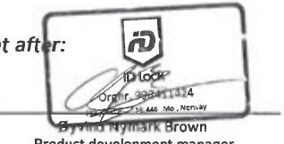

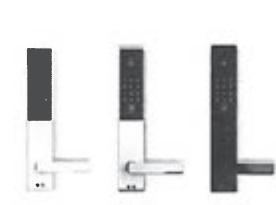

### Viktig!

Hengsleretning detekteres når batteriene settes i dersom låsen er oppdatert til firmware versjon 1.5.0 eller nyere. Døren må være åpen og ulåst for at hengsleretning kan detekteres. Den vil låse og låse opp reilen ved oppstart.

### Manuell låsing

- UTFØRES FRA UTSIDEN
- 1 Lukk døren
- 2 Berør betjeningspanelet

#### Aktivere/deaktivere Bortemodus

- 1 Lukk og lås døren
- 2 Berør betjeningspanel
- 3 Tast [gyldig kode] etterfulgt av [*]

#### Bortemodus deaktiveres ved vanlig opplåsing

#### Innstilling

- Z-Wave Inclusion
- 1 Sett GW/Hub i inclusion-modus
- 2 Hold inne nøkkelknapp
- 3 Angi [Master-PIN] [*]
- 4 Gå inn i innstillinger med [2] [*]
- 5 Tast [5]

#### Legge til/slette RFID-brikke

- 1 Hold inne nøkkelknapp
- 2 Angi [Master-PIN] [*]
- 3 Gå inn i adgangsmeny med [1] [*]
- 4 Legg til [6] [*] eller [7] [*] for å slette
- 5 Velg indeks [1-25], eller [0] for alle [#] (0 kan kun brukes ved sletting)

#### Innstilling

- Volum opp/ned
- 1 Hold inne nøkkelknapp
- 2 Angi [Master-PIN] [*]
- 3 Gå inn i innstillinger med [2] [*]
- 4 Tast [1] for -ned
- 5 Tast [3] for -opp 6 Avslutt med [#]

### Registrere

#### Service-PIN

- 1 Hold inne nøkkelknapp
- 2 Tast [Master-PIN] [*]
- 3 Tast [1] [*]
- 4 Tast [2] [*]
- 5 Tast [ny Service-PIN] [*]
- 6 Tast [service-PIN-modus]

### Innstilling 4 Tast [0] Innstilling Z-Wave Exclusion 1 Sett GW/Hub i exclusion-modus 2 Hold inne nøkkelknapp 3 Angi [Master-PIN] [*] 4 Gå inn i innstillinger med [2] [*] Sett låsen til fabrikksinnstilling 1 Fjern alle batteriene 2 Sett inn ett og ett batteri 3 Når det fjerde batteriet settes inn, trykk og hold inne nøkkelknappen til kvitteringstone høres. 1 Berør betjeningspanel Lås opp med PIN UTFØRES FRA UTSIDEN 1 Berør betjeningspanel 2 Tast [gyldig PIN] [#] 4 Tast [1] [*] 1 Hold inne nøkkelknapp 2 Angi [Master-PIN] [*] 3 Gå inn i innstillinger med [2] [*] 4 Tast [7] for å detektere retning, eller 5 Tast [9] for å angi motsatt NB! Bruk kun dersom deteksjon feiler.

- 5 Tast [5]
#### Registrere ny bruker-PIN

- 1 Hold inne nøkkelknapp
Velg hengsleretning.

- 2 Angi [Master-PIN] [*]
- 3 Gå inn i adgangsmeny med [1] [*]
- 4 Tast [3] [*]
- 5 Velg indeks [1-25] [*] 6 Tast [ny bruker-PIN] [#]

#### Innstilling

#### Automatisk/manuell låsing

- 1 Hold inne nøkkelknapp
- 2 Angi [Master-PIN] [*]
- 3 Gå inn i innstillinger med [2] [*]
- 4 Tast [6] for -automatisk låsing
- 5 Tast [4] for -manuell låsing

#### Service-PIN-modus

- [0] Slett servicepin
- [1]: Gyldig 1 gang
- [2]: Gyldig 2 ganger
- [3]: Gyldig 5 ganger
- [4]: Gyldig 10 ganger
- [7]: Alltid aktivert
- [8]: Gyldig 12 timer
- [9]: Gyldig 24 timer

### Registrere ny master-PIN

- 1 Hold inne nøkkelknapp
- 2 Angi [Master-PIN] [*]
- 3 Gå inn i adgangsmeny med [1] [*]
- 
- 5 Tast [ny kode] [*]
- 6 Gjenta [ny kode] [#]

### Lås opp med RFID

UTFØRES FRA UTSIDEN

- 
- 2 Vis gyldig RFID-brikke

#### Slå av innbruddsalarm

- 1 Berør betjeningspanel
- 2 Tast [gyldig PIN] [#]

- Z-Wave Local Reset
- 1 Hold inne nøkkelknapp
- 2 Angi [Master-PIN] [*]
- 3 Gå inn i innstillinger med [2] [*]

#### Slette bruker-PIN

- 1 Hold inne nøkkelknapp
- 2 Angi [Master-PIN] [*]
- 3 Gå inn i adgangsmeny med [1] [*]
- 4 Tast [4] [*]
- 5 Velg indeks [1-25] eller [0] for alle [#]

#### Innstilling

- Gjenlåsing av/på
- 1 Hold inne nøkkelknapp
- 2 Angi [Master-PIN] [*]
- 3 Gå inn i innstillinger med [2] [*]
- 4 Gå inn i gjenlåsing med [8]
- 5 Tast [0] for -gjenlåsing av
- 6 Tast [1] for -gjenlåsing på

Side 41

#### Standardinnstillinger Master PIN: 1234

Hengsleretning: Høyre Gjenlåsing: På

Låsemodus: Automatisk

### Viktigt!

Gångjärnens riktning upptäcks när batterierna sätts i om låset uppdateras till firmware version 1.5.0 eller senare. Dörren måste vara öppet och olåst för att hängning ska upptäckas. Den låser och låser upp regeln vid start.

#### Manuell låsning

- UTFÖRES FRÅN UTSIDAN
- 1 Stäng dörren
- 2 Aktivera ytterpanelen

#### Aktivera/deaktivera Bortaläge

- 1 Stäng och lås dörren
- 2 Aktivera ytterpanelen
- 3 Tryck [giltig kod] följt av [*]

Bortaläge deaktiveras vid vanlig upplåsning

#### Inställning

#### Z-Wave Inclusion

- 1 Aktivera inclusion-läge på GW/hub
- 2 Tryck och håll in nyckelknappen
- 3 Tryck [Master-PIN] [*]
- 4 Gå in i inställningar med [2] [*]
- 5 Tryck [5]

#### Lägg till/radera RFID-bricka

- 1 Tryck och håll in nyckelknappen
- 2 Ange [Master-PIN] [*]
- 3 Gå in i åtkomstmeny med [1] [*]
- 4 Legg til [6] [*] och [7] [*] for rader
- 5 Välj index [1-25], eller [0] för alla (0 kan endast användas vid radering)

#### Inställning

#### Volym upp/ned

- 1 Tryck och håll in nyckelknappen
- 2 Tryck [Master-PIN] [*]
- 3 Gå in i inställningar med [2] [*]
- 4 Tryck [1] för -ned
- 5 Tryck [3] för -upp
- 6 Avsluta med [#]

### Registrera

- Service-PIN
- 1 Tryck och håll in nyckelknappen
- 2 Tryck [Master-PIN] [*]
- 3 Tryck [1] [*]

Side 42

- 4 Tryck [2] [*]
- 5 Tryck [ny Service-PIN] [*]
- 6 Tryck [service-PIN-läge]

#### Välj hängning

- 1 Tryck in nyckelknapp
- 2 Ange [Master-PIN] [*]
- 3 Gå in i inställningar med [2] [*]
- 4 Tryck [7] för att upptäcka riktning, eller
- 5 Tryck [9] för att ange det motsatta OBS! Använd endast om detekteringen misslyckas.

#### Låsa upp med PIN

- UTFÖRES FRÅN UTSIDAN
- 1 Aktivera ytterpanelen
- 2 Tryck [giltig PIN] [#]

#### Fabriksinställningar

- 1 Ta ut alla batteri
- 2 Sätt in ett batteri i taget
- 3 När det fjärde batteriet sätts in, tryck och håll in nyckelknappen tills kvitteringston hörs.

#### Inställning

### Z-Wave Exclusion

- 1 Aktivera exclusion-läge på GW/hub
- 2 Tryck och håll in nyckelknappen
- 3 Tryck [Master-PIN] [*]
- 4 Gå in i inställningar med [2] [*]
- 5 Tryck [5]

#### Registrera ny användar-PIN

- 1 Tryck och håll in nyckelknappen
- 2 Ange [Master-PIN] [*]
- 3 Gå in i åtkomstmeny med [1] [*]
- 4 Tryck [3] [*]
- 5 Välj index [1-25] [*]
- 6 Tryck [ny användar-PIN] [#]

#### Inställning

#### Automatisk/manuell låsing

- 1 Tryck och håll in nyckelknappen
- 2 Tryck [Master-PIN] [*]
- 3 Gå in i inställningar med [2] [*]
- 4 Tryck [6] för -automatisk låsning
- 5 Tryck [4] för -manuell låsning

#### Service-PIN-läge

- [0] Radear servicekode
- [1]: Giltig 1 gång
- [2]: Giltig 2 gånger
- [3]: Giltig 5 gånger
- [4]: Giltig 10 gånger
- [7]: Alltid aktiverad
- [8]: Giltig 12 timmar
- [9]: Giltig 24 timmar

### Registrera ny master-PIN

- 1 Tryck in nyckelknapp
- 2 Ange [Master-PIN] [*]
- 3 Gå in i åtkomstmeny med [1] [*]
- 4 Tryck [1] [*]
- 5 Tryck [ny kod] [*]
- 6 Upprepa [ny kod] [#]

### Låsa upp med RFID

- UTFÖRES FRÅN UTSIDAN 1 Aktivera ytterpanelen
- 2 Visa giltig RFID-bricka

#### Stäng av larm

- 1 Aktivera ytterpanelen
- 2 Tryck [giltig PIN] [#]

#### Inställning

4 Tryck [0]

Inställning

4 Tryck [4] [*]

Omlåsning av/på

Radera användar-PIN Tryck och håll in nyckelknappen Ange [Master-PIN] [*] Gå in i åtkomstmeny med [1] [*]

Z-Wave Local Reset Tryck och håll in nyckelknappen Tryck [Master-PIN] [*] Gå in i inställningar med [2] [*]

Standardinställningar Master PIN: 1234 Hängning: Höger Omlåsning: På

Låsfunktion: Automatiskt

 Tryck och håll in nyckelknappen Tryck [Master-PIN] [*] Gå in i inställningar med [2] [*] Gå in i omlåsning med [8] Tryck [0] för -omlåsning av Tryck [1] för -omlåsning på

5 Välj index [1-25] eller [0] för alla [#]

#### English All Functions Quick Reference Guide

### Important!

Hinge direction is detected when batteries are inserted if the lock is updated to firmware version 1.5.0 or above. The door must be open and unlocked for hinge detection to start. It will lock and unlock the deadbolt during setup.

#### Manual locking

#### LOCK IS OPERATED FROM THE OUTSIDE

- 1 Close the door
- 2 Touch the panel

#### Activate/deactivate away mode

- 1 Close and lock the door
- 2 Touch the panel
- 3 Enter [valid PIN] followed by [*]

Away mode is deactivated when the door is unlocked.

#### Settings

#### Z-Wave Inclusion

- 1 Put GW/Hub in inclusion mode
- 2 Press and hold key button on ID Lock
- 3 Enter [Master PIN] [*]
- 4 Press [2] [*] for settings menu
- 5 Press [5]

#### Add/delete RFID keyfob

- 1 Press and hold key button
- 2 Enter [Master PIN] [*]
- 3 Press [1] [*] to enter access menu
- 4 To add [6] [*] or [7] [*] to delite
- 5 Choose index [1-25], or [0] for all [#] (0 can only be used when deleting)

#### Settings

#### Volume increase/decrease

- 1 Press and hold key button
- 2 Enter [Master PIN] [*]
- 3 Press [2] [*] to enter settings menu
- 4 Press [1] for volume increase
- 5 Press [3] for volume decrease
- 6 Save settings with [#]

### Register

#### Service PIN

- 1 Press and hold key button
- 2 Enter [Master PIN] [*]
- 3 Press [1] [*]
- 4 Press [2] [*]
- 5 Enter [new Service PIN] [*]
- 6 Enter [service PIN mode]

#### Set hinge direction 1 Press key button 2 Enter [Master PIN] [*]

- 3 Press [2] [*] for settings menu
- 4 Press [7] for hinge detection, or
- 5 Press [9] to toggle setting
- 

### Open with PIN

#### LOCK IS OPERATED FROM THE OUTSIDE

- 1 Touch the panel
- 2 Enter [valid PIN] [#]

#### Reset to factory settings

- 1 Remove all batteries
- 2 Insert the batteries one by one
- 3 While the fourth battery is inserted, press and hold the key button until a receipt tone is heard

### Settings

#### Z-Wave Exclusion

- 1 Put GW/Hub in exclusion mode
- 2 Press and hold key button on ID Lock
- 3 Enter [Master PIN] [*]
- 4 Press [2] [*] for settings menu
- 5 Press [5]

#### Add new user PIN

- 1 Press and hold key button
- 2 Enter [Master PIN] [*]
- 3 Press [1] [*] to enter access menu
- 4 Press [3] [*]
- 5 Choose index [1-25] [*]
- 6 Enter [new user PIN] [#]

### Settings

#### Automatic/manual locking

- 1 Press and hold key button
- 2 Enter [Master PIN] [*]
- 3 Press [2] [*] to enter settings menu
- 4 Press [6] for automatic locking
- 5 Press [4] for manual locking

#### Service PIN mode

- [0] Delete servicepin
- [1]: 1 time use
- [2]: 2 times use
- [3]: 5 times use
- [4]: 10 times use
- [7]: Always valid
- 
- [8]: Valid 12 hours
- [9]: Valid 24 hours

### Register new Master PIN

- 1 Press key button
- 2 Enter [Master-PIN] [*]
- 3 Press [1] [*] to enter access menu
- 4 Press [1] [*]
- 5 Enter [new Master PIN] [*]
- 6 Repeat [new Master PIN] [#]

### Unlock with RFID

#### LOCK IS OPERATED FROM THE OUTSIDE

- 1 Touch the panel
- 2 Present valid RFID keyfob

#### Reset burglar alarm

- 1 Touch the panel
- 2 Enter [valid PIN] [#]

Z-Wave Local Reset

2 Enter [Master PIN] [*] 3 Press [2] [*] for settings menu

1 Press and hold key button on ID Lock

Settings

Relocking on/off 1 Press and hold key button 2 Enter [Master PIN] [*]

Delete user PIN Press and hold key button Enter [Master PIN] [*] Press [1] [*] to enter access menu

Settings

4 Press [0]

4 Press [4] [*]

Default Settings Master PIN: 1234 Hinge direction: Right Relocking: On Lock Mode: Automatic

 Press [2] [*] to enter settings menu Access relocking by pressing [8] Press [0] for relocking off Press [1] for relocking on

5 Choose index [1-25] or [0] for alle [#]

Side 43

