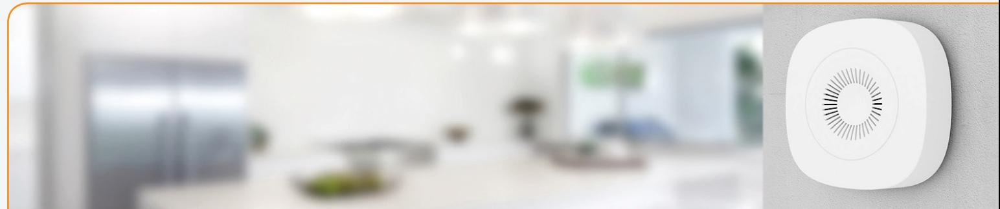
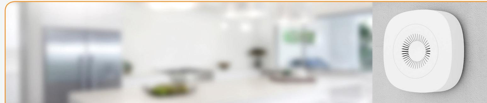

# **Air Quality Sensor Wireless monitoring of indoor air quality**

Since most of today's people spend the majority of their time indoors, the quality of indoor air is critical to human health, work performance, and comfort. By monitoring the levels of volatile organic compounds (VOCs), the wireless, battery-driven Air Quality Sensor will enable your customers to monitor indoor air quality and ensure that the air inside a room is clean and healthy.

- 
- **• Continuous monitoring of VOC levels**
- **• Accurate humidity, temperature and air quality reporting**
- **• Easy mounting and installation**

## **Supervise VOC levels**

Unlike outdoor air, indoor air is recycled continuously, increasing the concentration of compounds. VOCs are organic chemicals in indoor air coming from various different sources, including paint, building materials, glues, furnishings, tobacco smoking, as well as people and their activities. Some VOCs can have short- and long-term negative effects on health. The wireless Air Quality Sensor detects the TVOC, which refers to the total concentration of VOCs present simultaneously in the air. This gives your customers an opportunity to continuously monitor VOCs in order to prevent negative health effects. See the table below for recommendations about the TVOC level. Moreover, the sensor features long range, and accurate temperature and humidity reporting. To ensure calibration, the sensor must be exposed to clean air for at least 10 minutes every week.

|   | LEVEL     | HYGIENIC RATING          | RECOMMENDATION                                | TVOC [µg/m³]    | TVOC [ppb]  |
|---|-----------|--------------------------|-----------------------------------------------|-----------------|-------------|
| 5 | Unhealthy | Situation not acceptable | Intense ventilation necessary                 | 10'000 - 25'000 | 2200 - 5500 |
| 4 | Poor      | Major objections         | Intensified ventilation / airing necessary | 3'000 - 10'000  | 660 - 2200  |
| 3 | Moderate  | Some objections          | Intensified ventilation recommended           | 1'000 - 3'000   | 220 - 660   |
| 2 | Good      | No relevant objections   | Ventilation/airing recommended                | 300 -1'000      | 65 - 220    |
| 1 | Excellent | No objections            | Target value                                  | < 300           | 0 - 65      |

#### www.develcoproducts.com

## **Air Quality Sensor - Technical specifications**

**Model number: AQSZB-110**

### **General**

| Dimensions (W x H) | 70 x 70 x 21 mm White                              |  |  |
|--------------------|-------------------------------------------------------|--|--|
| Colour             |                                                       |  |  |
| Power supply       | Battery: 2 x AA, exchangeable                         |  |  |
|                    | Battery life: 2 years, reporting every 5 minutes      |  |  |
|                    | Resolution: 0.1 Volt                                  |  |  |
| Radio              | Sensitivity: -97 dBm                                  |  |  |
|                    | Output power: up to +7 dBm                            |  |  |
| Environment        | Operation temperature 0 to +50°C                      |  |  |
|                    | IP class: IP20                                        |  |  |
| Functions          |                                                       |  |  |
| VOC sensor         | Range: 0 to 60000 ppb                                 |  |  |
|                    | Resolution: 1 - 32 ppb                                |  |  |
|                    | Reporting: configurable                               |  |  |
| Temperature sensor | Range: 0 to +50°C                                     |  |  |
|                    | Resolution: 0.1°C (accuracy typical ± 0.2°C)          |  |  |
|                    | Sample time: 30 s                                     |  |  |
|                    | Reporting: configurable                               |  |  |
| Humidity sensor    | Range: 0 to 100% RH                                   |  |  |
|                    | Resolution: 1% RH (accuracy typical 2%, 20-80% RH)    |  |  |
| Communication      |                                                       |  |  |
| Wireless protocol  | Zigbee Home Automation                                |  |  |
|                    | Zigbee end-device                                     |  |  |
| Certifications     | Conforming to CE, RED, EMC, RoHS and REACH directives |  |  |
|                    | Zigbee 3.0 certified                                  |  |  |
|                    |                                                       |  |  |