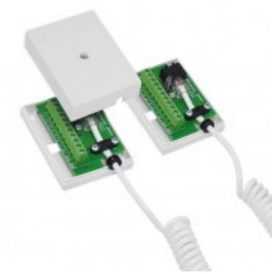
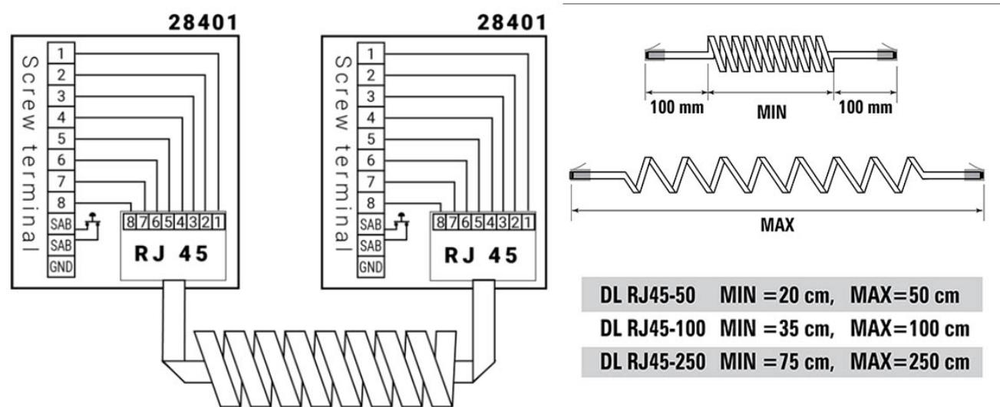

# DL RJ45

## Karmöverföring med spiralkabel och RJ45 kontakt

### **Produktdetajler:**

Sabotageskydd Ja

Anslutning RJ 45, skruv

Karmöverföringen består av två kopplingsdosor (28401) med RJ45-kontakt samt 10 skruvanslutningar varav 2 är för sabotagekontakten. Dosan är också försedd med kabel-avlastingsskydd för RJ45-kontakten. Skruvanslutningarna har hissfunktion för säker montering. Dosan har sabotagekontakt för skydd mot öppning av kapslingen. Kabeln är utförd i PUR vilket innebär att den är mer elastisk och hållbar än en PVC-kabel. Kabeln finns i 3 storlekar, 50 cm, 100 cm samt 250 cm (rekommenderad utdragen längd).

#### **BESTÄLLINGSINFORMATION**

| Typ         | E nr | Beskrivning                                          |
|-------------|------|------------------------------------------------------|
| DL RJ45-50  |      | Karmöverföring med RJ45 kontakt, spiralkabel, 50 cm  |
| DL RJ45-100 |      | Karmöverföring med RJ45 kontakt, spiralkabel, 100cm  |
| DL RJ45-250 |      | Karmöverföring med RJ45 kontakt, spiralkabel, 250 cm |

### **Relaterade produkter och tillbehör:**

| JB RJ45 Kopplingsdosa i metall, 12 pol med RJ45-kontakt |  |
|---------------------------------------------------------------------|--|
| 28401.03 KOPPLINGSBOX "MINI" MED RJ 45                     |  |
| 28402.03 KOPPLINGSBOX "MINI" MED RJ 45, SKÄRMAD            |  |
| 3090 KOPPLINGSPLINT 16 POL MED 2x RJ 45, SKÄRMAD           |  |

Powered by TCPDF (www.tcpdf.org)