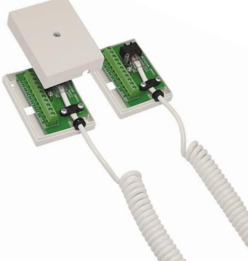
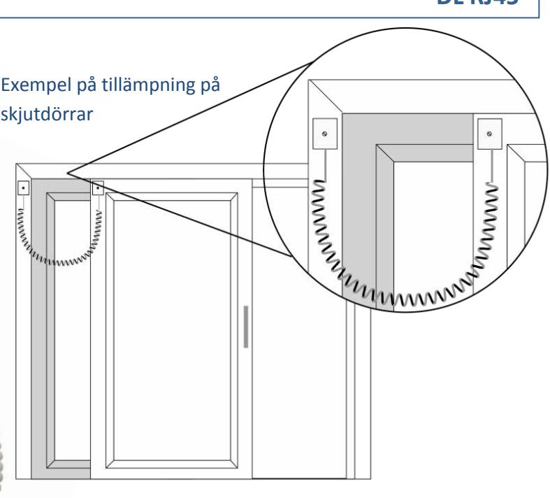
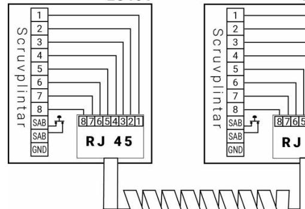
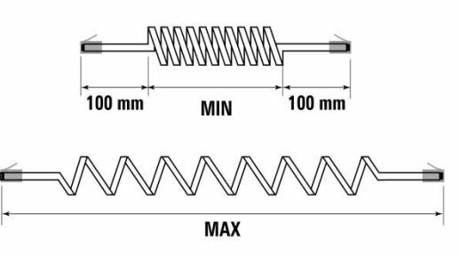

## **Detektorer Karmöverföring med spiralkabel och RJ45 kontakt**

# **Datablad och instruktionsmanual DL RJ45**

## **BESKRIVNING**

Karmöverföringen består av två kopplingsdosor (28401) med RJ45-kontakt samt 10 skruvanslutningar varav 2 är för sabotagekontakten. Dosan är också försedd med kabelavlastingsskydd för RJ45-kontakten. Skruvanslutningarna har hissfunktion för säker montering. Dosan har sabotagekontakt för skydd mot öppning av kapslingen.

Kabeln är utförd i PUR vilket innebär att den är mer elastisk och hållbar än en PVC-kabel. Kabeln finns i 3 storlekar, 50 cm, 100 cm samt 250 cm (rekommenderad utdragen längd).

#### **TEKNISKA DATA**

| Sabotageskydd                |              | Ja, 50 mA         |  |
|------------------------------|--------------|-------------------|--|
| Anslutning                   |              | Skruvplint        |  |
| Ledaranslutning (skruvplint) |              | 0,2 - 2,5 mm2     |  |
| Kabelanslutning              |              | RJ45 kontakt      |  |
| Kapsling, färg               |              | ABS plast vit     |  |
| Mått dosor (LxBxH)mm         |              | 58x76x27          |  |
| Spriallängd                  | DL RJ45-50   | ca 20 cm - 50 cm  |  |
|                              | DL RJ45-100  | ca 35 cm - 100 cm |  |
|                              | DL RJ 45-250 | ca 75 cm - 250 cm |  |

**SKRUVPLINT**

| DL RJ45-50     MIN =20 cm,   MAX=50 cm |                                    |
|----------------------------------------|------------------------------------|
|                                        | DL RJ45-100 MIN =35 cm, MAX=100 cm |
|                                        | DL RJ45-250 MIN =75 cm. MAX=250 cm |

### **BESTÄLLNINGSINFORMATION**

| Typ         | E-nr | Beskrivning                                          |
|-------------|------|------------------------------------------------------|
| DL RJ45-50  |      | Karmöverföring med RJ45 kontakt, spiralkabel, 50 cm  |
| DL RJ45-100 |      | Karmöverföring med RJ45 kontakt, spiralkabel, 100 cm |
| DL RJ45-250 |      | Karmöverföring med RJ45 kontakt, spiralkabel, 250 cm |