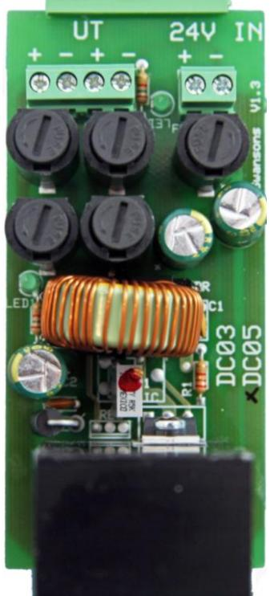
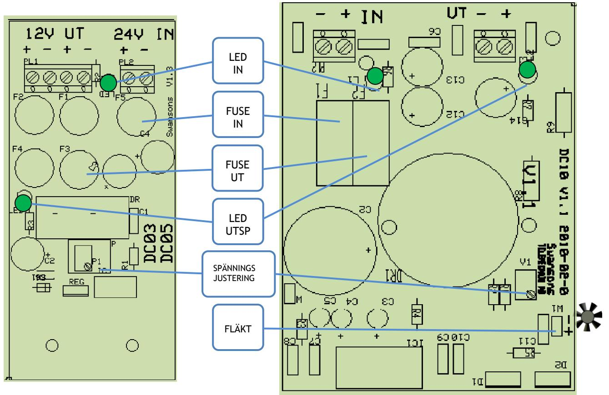

 **DC5**

## **BESKRIVNING DC5/10 SM40**

Switchad DC/DC omvandlare avsedd att snäppas fast på DIN-skena i strömförsörjningsaggregatet.  **Strömförsörjning med plats för batteri**

> Används då man behöver flera utspänningar i samma batteribackup, till exempel om man behöver 16V utspänning som är avbrottsfri.

Mycket kompakt utförande, med säkringar på både in och utgång. DC5 har 1 polig avsäkrad ingång och 2st 2 poliga grupper för utgången. DC10 har 1 polig avsäkrad ingång och en enpoligt avsäkrad utgång. Utgång, temperaturstyrd, för styrning av fläkt.

Utspänningen är justerbar mellan 5-20V. LED-indikering av in och utspänning.

TEKNISKA DATA Inspänning DC 22-35VDC Utspänning 5-20VDC Max ström 5/10A

| E-Nummer  | Typ  | Beskrivning                    |           |
|-----------|------|--------------------------------|-----------|
| 52 570 61 | DC5  | DC/DC omvandlare 24V/12VDC 5A  | 50X110X80 |
| 52 570 62 | DC10 | DC/DC omvandlare 24V/12VDC 10A | 75X140X90 |

Postadress/Postal address **Swansons Telemekanik AB** Hålstensvägen 4 SE-446 37 Älvängen

Telefon nr/Telephone no +46(0)303-746 320 Hemsida/Webb www.swtm.se

Telefax nr/Telefax no +46(0)303-748 490 e-post info@swtm.se

VAT.NO SE556289017701

## INKOPPLINGSANVISNING DC5  **SM40**

- Anslut först kablarna mellan gruppsäkringskortet och spänningskällan.  **Strömförsörjning med plats för batteri**
	- Kontrollera att utspänningen är riktig och att den gröna lysdioderna tänds.
	- Om lysdiod för spänningsindikering ej tänds kontrollera inspänning och ingångssäkringarna.
	- Löser säkringarna, kontrollera inkoppling och inkopplade apparater. F5 – 3,15A ingångssäkring, F1-F4 – 3,15A utgångssäkring.
	- Vid behov justera utspänningen på DC/DC omv med pot P1 ( 5-20V utsp.)
	- Anslut lasten

## INKOPPLINGSANVISNING DC10

- Anslut först kablarna spänningskällan.
- Kontrollera att utspänningen är riktig och att den gröna lysdioden tänds
- Om lysdiod för spänningsindikering ej tänds kontrollera inspänning och ingångssäkringarna.
- Löser säkringarna, kontrollera inkoppling och inkopplade apparater. F1 – 7,5A ingångssäkring, F2 – 10A utgångssäkring.
- Vid behov justera utspänningen på DC/DC omv med pot V1 ( 5-20V utsp.)
- Anslut lasten
- Skruva fast fläkten i förberett hål i kapslingen, anslut fläkten till W1

Postadress/Postal address **Swansons Telemekanik AB** Hålstensvägen 4 SE-446 37 Älvängen

Telefon nr/Telephone no +46(0)303-746 320 Hemsida/Webb www.swtm.se

Telefax nr/Telefax no +46(0)303-748 490 e-post info@swtm.se

VAT.NO SE556289017701