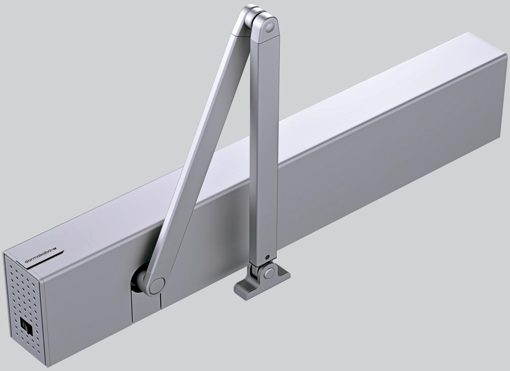

# ED 100, ED 250

Manual för montering och idrifttagning

WN 059807 45532/14005 – 2019-07

**SV**

# **Innehåll**

| 1 | Allmänt                    | 2  |
|---|----------------------------|----|
| 2 | Säkerhet                   | 3  |
| 3 | Produktbeskrivning         | 4  |
| 4 | Förberedelse av montering  | 10 |
| 5 | Montering av drivanordning | 20 |
| 6 | Anslutning av tillbehör    | 31 |

# **1 Allmänt**

Denna dokumentation innehåller viktiga anvisningar för montering och säker drift. Läs dessa anvisningar innan du börjar med monteringen. För att garantera din säkerhet måste du iaktta alla bifogade anvisningar. Felaktig montering kan leda till allvarliga personskador. Användning av styrelement, inställningar eller förfaranden som inte finns beskrivna i denna dokumentation kan orsaka elektriska stötar, fara genom elektrisk spänning/ ström och/ eller fara genom mekaniska processer.

## 1.1 Ändamålsenlig användning

EED 100 och ED 250 är elektromekaniska drivanordningar till slagdörrar och är uteslutande avsedda att öppna och stänga slagdörrar inomhus med en dörrbladsvikt på max. 160 resp. 400 kg. Motsvarande utrustning väljer man beroende på dörrbladens bredd och vikt. Kontrollera före montering på en rök- eller brandskyddsdörr om utrustningen har godkänts för användning på respektive dörr. Innan du börjar med monteringen måste du med hjälp av tabellen i kapitel 4 förvissa dig om att din utrustning är lämplig för respektive dörrsituation och att dörren är utrustad med gångjärn som passar för den automatiska driften. Kabellängden för externa komponenter får inte överskrida 30 m.

#### 1.2 Ansvarsfriskrivning

ED 100 och ED 250 får endast användas för det avsedda ändamålet. Egenmäktiga ändringar på dörrsystemet befriar dormakaba Deutschland GmbH från allt ansvar för skador som uppstår som ett resultat av dessa. För användning av tillbehör som inte har godkänts av dormakaba ansvaras inte.

#### 1.3 Riskanalys av montör

Tillverkaren, dvs. den person som utför monteringen, och uppdragsgivaren/operatören måste vid planeringen av utrustningen gemensamt genomföra en individuell riskbedömning. Vi hänvisar i detta sammanhang till formuläret "Riskanalys", som du kan använda som hjälp vid genomförandet. Du hittar det under fliken PRODUKTER på vår webbplats www.dormakaba.de. På grund av speciella rumsliga situationer och dörrens förväntade användargrupper kan det vara meningsfullt att använda säkerhetssensorer även vid lågenergidrift.

| 7  | Idrifttagning                 | 33 |
|----|-------------------------------|----|
| 8  | Installering av Upgrade Cards | 34 |
| 9  | Parametrering/service         | 36 |
| 10 | Diagnos/felsökning            | 42 |
| 11 | Felmeddelanden                | 44 |
|    |                               |    |

#### 1.4 Särskilda säkerhetskrav för personer som är i behov av skydd

Om riskbedömningen visar att dörrbladen kan stöta till och skada en person, måste extra sensorer monteras för att utesluta denna risk. Detta gäller särskilt om även barn, äldre människor eller handikappade använder dörrsystemet.

#### 1.5 Standarder, lagar, riktlinjer och föreskrifter

Den senaste versionen av de allmängiltiga och landsspecifika standarderna, lagarna, direktiven och föreskrifterna måste följas.

#### 1.6 Hänvisningar/föreskrifter som ska beaktas vid användning av ED 100 och ED 250 på rök- eller brandskyddsdörrar är:

- Informationsblad om användning av dörrhållare
- Riktlinjer för dörrhållare från Institut für Bautechnik, Berlin

## 1.7 Övriga risker

Beroende på byggnadens konstruktion, dörrvariant och skyddsmöjlighet kan övriga faror (t.ex. lätta kläm- och stötskador och fara för barn, som lämnats utan uppsikt) inte uteslutas. De faror som hör ihop med det farliga stället på slagdörrens (gäller även manuellt drivna dörrar) bakkant är allmänt kända för alla som använder en dörr. Detta riskfyllda ställe kan inte påverkas av drivanordningens tillverkare och på grund av konstruktion och teknisk funktion är ett skydd ofta inte möjligt. Ett klämskydd (exempelvis gummi- eller textilskydd) för detta ändamål finns att köpa i fackhandeln och ingår inte i leveransen.

#### 1.8 Instruktion

Efter framgångsrik inställning, idrifttagning och funktionskontroll av dörrsystemet ska monteringsoch bruksanvisningen samt användarmanualen lämnas över till operatören och en instruktion för användning och skötsel av dörrsystemet genomföras.

Om inget annat anges, är alla angivna mått i mm.

## 1.9 Användning Säkerhetsanvisningar

## **FARA**

Detta signalord påvisar en omedelbart farlig situation som leder till dödsfall eller allvarliga personskador om den inte undviks.

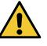

#### **VARNING**

Detta signalord påvisar en omedelbart farlig situation som leder till dödsfall eller allvarliga personskador om den inte undviks.

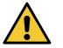

## **OBS**

Detta signalord påvisar en potentiellt farlig situation som kan resultera i mindre eller lätta skador om den inte undviks.

#### **AKTNING**

Detta signalord påvisar möjligen farliga situationer som kan leda till sakskador eller skador på miljön om dessa inte undviks.

#### **TIPS OCH REKOMMENDATIONER**

Detta signalord visar hur du använder enheten effektivt och problemfritt..

# **2 Säkerhet**

**FARA**

#### 2.1 Säkerhetsanvisningar

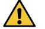

#### **Livsfara genom elektrisk ström**

Demonteras av behörig elektriker som endast arbetar med elsystem.

- Innan arbetet på elsystem och utrustning påbörjas måste strömmen vara bortkopplad, vilket gäller under hela arbetets gång.

#### **Livsfara genom elektrisk ström**

I dörrens drivsystem finns spänningsförande komponenter.

- Inga metallföremål får föras in i dörrens drivsystem

#### **Livsfara genom elektrisk ström**

Om ED 100 eller ED 250 monteras på ett metalliskt dörrblad, föreligger fara för strömöverföring från dörrbladet.

- Jorda dörrblad.
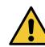

## **VARNING**

#### **Skaderisk vid glaskross**

Skador på glasdelar kan leda till att glaset krossas.

- Använd säkerhetsglas för glasdörrblad och sidodelar.

|  |  | OBS |
|--|--|-----|
|--|--|-----|

#### **Skaderisk genom klämning**

För dörrar med drivenhet föreligger skäroch klämrisk från stängerna och spakens glidskena

- Informera de som använder dörren om denna risk.
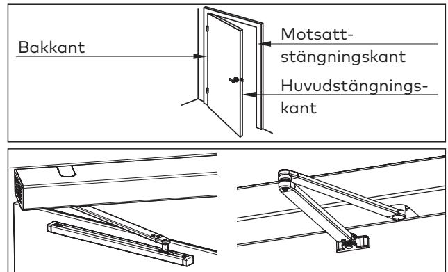

# **3 Produktbeskrivning**

## 3.1 Driftsystem

Driftsystemet innehåller alla huvudkomponenter. Man väljer driftsystem så att det passar dörrbladens bredd och vikt.

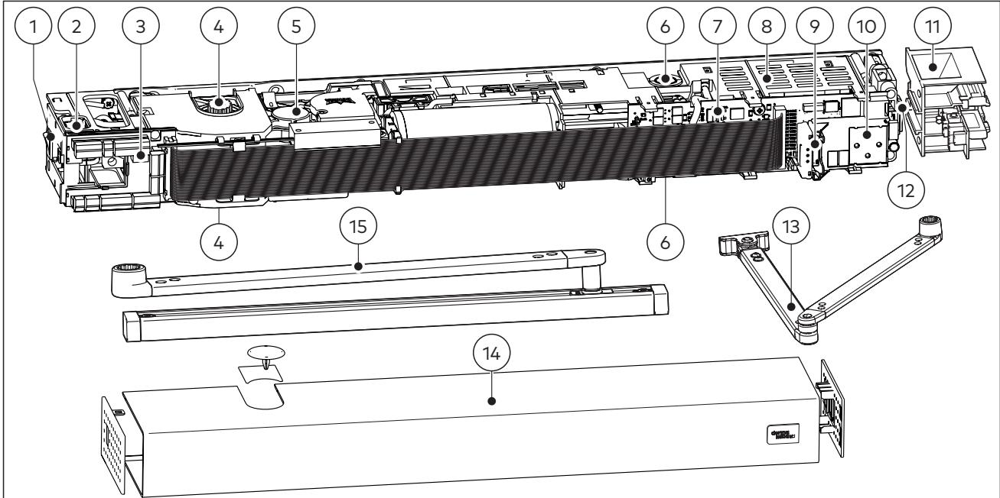

- (1) Nätströmbrytare
- (2) Nätanslutning
- (3) Anslutningskretskort
- (4) Dubbelsidig axelutgång
- (5) Driftsystem (motor/växel/stängningsfjäder)
- (6) Justering av stängningskraft
- (7) Styrning
- (8) Kopplingsnätdel

## 3.2 Funktioner

## 3.2.1 Driftsätt

ED 100, ED 250 kan användas på två olika sätt, som dörrstängare eller som automatisk drivanordning för slagdörrar. I läget för dörrstängning (se kapitlet "Parametrering/service", parameter hd = 1) har drivanordningen optimerats för manuell användning. Med den vid detta driftsätt tillgängliga Power-Assist-funktionen ska detta driftsätt användas när dörrarna huvudsakligen används manuellt och ett förfarande som påminner om dörrstängning önskas. Det automatiska läget (se kapitlet "Parametrering/ service", parameter hd = 0) är i första hand avsett för automatisk användning efter impulsgivning genom en rörelsedetektor eller sensor.

## 3.2.2 Power-Assist-funktion

I läget för dörrstängning kan Power-Assist-funktionen (se kapitlet "Parametrering/service", parameter hd = 1) aktiveras. En servoassistans aktiveras då vid manuell öppning. Denna servoassistans anpassas automatiskt till dörrstängarens inställda storlek. Styrkan på servoassistansen är inställbar så att kraven i DIN 18040, DIN Spec 1104, CEN/TR 15894,

- (9) Kortplats för Upgrade Cards
- (10) Användargränssnitt med informationsdisplay
- (11) * ED Cover Basic RM, ED Cover Vario RM
- (12) Intern programknapp
- (13) * Standardarmar
- (14) * Beklädnad komplett
- (15) * Glidskena (set)
- * Inte i driftsystemets leveransomfattning

BS 8300/2100 och dokument "M" uppfylls hela vägen ända upp till EN 6. Det minsta inställbara öppningskraft ä23 N (5 lbf), så länge dörrhållaren inte är utlöst eller försörjningsspänningen bortfaller. Med Power-Assist-funktionen kan kraven i EN 1154 uppfyllas och samtidigt ges barriärfri tillgång vid normal drift.

En kombination med Push & Go-funktionen eller regleringen av vindlast är inte möjlig, eftersom dessa motverkar en lätt manuell öppning.

## 3.2.3 Push & Go

Vid båda driftsätten kan Push & Go-funktionen (se kapitlet "Parametrering/service", parameter PG = 1) aktiveras. En automatisk öppning utförs om dörren flyttas manuellt ur positionen "STÄNGD" med en vinkel på 4° i riktning "ÖPPEN".

## 3.2.4 Reglering av vindlast

Drivanordningarna ED 100 och ED 250 är särskilt lämpliga för användning på ytterdörrar som utsätts för skiftande vindlaster eller på inomhusdörrar som avdelar rum där tryckskillnader kan uppstå. I automatiskt läge övervakar regleringen av vindlaster den faktiska körhastigheten och anpassar

körhastigheten när den avviker från det inställda värdet. I kombination med Upgrade Card Full-Energy kan drivanordningen tillhandahålla upp till 150 N vid huvudstängningskanten, som då kan användas för att minska inverkan från miljön.

Stängningsprocessen för de sista 5° kan underlättas ytterligare med hjälp av det elektroniska anslaget. Dörrarna kan även användas manuellt och vi rekommenderar då användning av Push & Gofunktionen.

## 3.3 Lågenergiprodukt

ED 100/250 kan ställas in så att kraven på låg energianvändning (Low Energy-drivanordning) enligt EN 16005 eller DIN 18650, ANSI 156.19 och BS 7036-4 uppfylls. Under idrifttagningen måste driftparametrarna anpassas för att överensstämma med uppgifterna för respektive standard.

Den nödvändiga säkerheten i systemet uppnås genom följande egenskaper:

- Reducerade dynamiska krafter när det gäller dörrblad/beröring
- Låga körhastigheter
- Reducerade statiska krafter när det gäller dörrblad/beröring
- Kraftbegränsning

Efter den automatiska inlärningskörningen måste på grund av systemtoleranser de faktiska krafterna vid dörrbladet mätas och vid behov förändras för att lokala standarder och föreskrifter ska kunna iakttas. Användning av ytterligare säkerhetssensorer för säkring av rotationsrörelsen är inte föreskriven, men kan ske om detta krävs på grund av riskanalysen, som måste utföras individuellt. Säkringen av bakkanten måste betraktas separat.

## 3.4 Manöverelement

Drivanordningarna ED 100 och ED 250 är elektromekaniska drivanordningar. Det är samspelet mellan växelmotor och styrning som gör automatisk öppning och stängning möjlig. För detta ändamål måste styrningen känna till vissa dörrparametrar, för att nå ett optimalt förfarande.

Styrningen är utrustad med ett användargränssnitt med 4 knappar och en 2-siffrig display. Med hjälp av denna kan alla inställningar som anges i parameterlistan utföras.

Under idrifttagningen konfigureras knapparnas funktion och displayen på ett sätt som garanterar att knapparna alltid visar samma funktioner och att tal och siffror redovisas korrekt, oberoende av monteringsriktning. Förklaringen till knapparna kan tas loss och vridas.

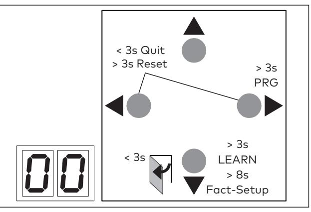

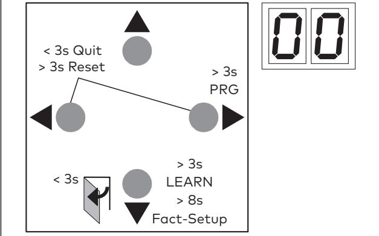

Genom att trycka på knapparna kan följande funktioner utföras:

#### **Nedre knappen**

- Inställning av monteringsriktning efter nätåterställning
- Bläddra i parametrar och felmeddelanden
- Minska parametervärdet
- Öppningsimpuls
- Inlärningskörning
- Återställning med fabriksinställning (Fact-Setup)

#### **Övre knappen**

- Bläddra i parametrar och felmeddelanden
- Öka parametervärdet

#### **Höger knapp**

- Anropa parametermenyn
- Ändra vald parameter
- Spara ändrat värde

#### **Vänster knapp**

- Avbryt parameterändring
- Stäng parametermenyn

#### **Vänster och höger knapp samtidigt**

- Felkvittering
- Återställning

## 3.5 Upgrade Cards

Med Upgrade Cards kan funktionsomfattningen för drivanordningarna till slagdörrar ED 100 och ED 250 utvidgas. Vid installationen av Upgrade Cards utbyts information mellan driftstyrningen och respektive Upgrade Card och samordnas permanent. Den önskade funktionen kan användas så länge respektive Upgrade Card är installerat i driftsystemet.

- Det Upgrade Card som installerats först blir en container-modul. I container-modulen lagras funktionerna till andra Upgrade Cards. Varje styrning har endast en container-modul.
- Statusen för respektive Upgrade Card visas med 3 integrerade lysdioder. Den röda lysdioden lyser vid Upgrade Card DCW så snart DCW-deltagare är registrerade och visar att DCW-telegram utbyts.

#### 3.5.1 Kombinationsmöjligheter

Det finns olika funktioner tillgängliga. För att man ska kunna skilja på dem är Upgrade Cards färgade.

| Upgrade Card    | färg               | ED 100 | ED 250 |
|-----------------|--------------------|--------|--------|
| Full-Energy     | blå                | X      |        |
| Full-Energy     | blå transparent |        | X      |
| Brandskydd      | röd                | X      |        |
| Brandskydd      | röd transparent |        | X      |
| Professional    | grön               | X      | X      |
| DCW             | gul                | X      | X      |
| Barriärfritt WC | swart              | X      | X      |

## 3.5.2 Upgrade Card Full-Energy – blå/blå transparent

Genom att använda Upgrade Card Full-Energy blir hela inställningsområdet i parametern för öppningsoch stängningshastighet samt öppnings- och stängningskraft tillgänglig. Användning i 2-flygliga system är möjlig.

## 3.5.3 Upgrade Card brandskydd – röd/röd transparent

Upgrade Card brandskydd krävs för uppbyggnad av en dörrhållare enligt EN 14637 eller liknande standarder. Endast med installerat Upgrade Card brandskydd står den ledningsövervakade detektoringången för anslutning av RM-ED eller den integrerade brandvarnaren till förfogande. Funktionen Full-Energy aktiveras automatiskt. Användning i 2-flygliga system är möjlig.

## 3.5.4 Upgrade Card Professional – grön

Genom användning av Upgrade Card Professional kan funktionen sköterskor-sängar, utvidgad tid för öppethållning och strömstöt aktiveras. Användning i 2-flygliga system är möjlig.

## 3.5.5 Upgrade-Card DCW – gul

Upgrade-Card DCW möjliggör anslutning av DCWkapabla tillbehörskomponenter till drivanordningen. Användning i 2-flygliga system är möjlig.

## 3.5.6 Upgrade Card barriärfritt WC – svart

Genom användning av Upgrade Card barriärfritt WC kommer styrningens in- och utgångar att förses med nödvändiga funktioner för precis denna användning, och de nödvändiga tillbehörskomponenterna kan anslutas direkt. Upgrade Card "Barriärfritt WC" används inte i 2-flygliga system.

## 3.6 Tillbehör

Förutom de omfattande dormakaba-tillbehören finns det många impulsgivare, lås, säkerhetssensorer och ytterligare tillbehör från andra tillverkare som kan drivas med motorerna ED 100 och ED 250. dormakaba kan inte garantera kompatibilitet för andra tillverkares produkter. Om dessa utrustningar ändå används kan detta leda till att drivanordningarnas fullständiga funktion inte är tillgänglig eller att utrustningarna inte fungerar korrekt. Även skador på drivanordningen eller den anslutna utrustningen är möjliga. Drivanordningen kan tillhandahålla maximalt 1,5 A vid 24 V DC för externa förbrukare. Om ett högre behov (även under kort tid) behövs, ska en extern strömförsörjning användas för att undvika felfunktioner på drivanordningen.

## 3.6.1 Impulsgivare

Som impulsgivare betecknas i allmänhet utrustning av följande konstruktionstyp:

Radar-rörelsedetektor, sensorknapp, tryckknapp, passiv infraröd-rörelsedetektor, , brytare, , radio, IR-mottagare, passersystem, telefonanläggningar och porttelefoner

#### **Minimikrav:**

Driftspänning vid försörjning genom drivanordningen: 24 V DC +/- 5 % Impulslängd: min. 200 ms Potentialfri utgång: (Vid användning på signalingång inne, detektor ute eller natt/bank) Utgång med spänning (telefonanläggningar):

max. 24 V DC/AC +/- 5 %

## 3.6.2 Lås

Som lås betecknas i allmänhet utrustning av följande konstruktionstyp:

Elektriska dörröppnare, motorlås, flerpunktslås med övervakningskontakt, låsmagneter.

Motorlås utan återkoppling från lås kan anslutas direkt till drivanordningen, om utlösningstiden är mindre än 4 sekunder. För att garantera en säker drift för kombinationen drivanordning och lås, måste låset motsvara följande specifikation:

#### **Minimikrav:**

Driftspänning vid försörjning genom drivanordningen: 24 V DC +/- 5 %

Driftspänning vid extern försörjning:

max. 48 V DC/AC Belastning av kontakten mellan relä och lås: max. 1 A Inkopplingstid elektrisk dörröppnare:

min. 30 %

Inkopplingstid motorlås:

100 %

## 3.6.3 Nyckelbrytare ST 32 DCW

| Nyckel vänster > 3s: | En ansluten DCW-programknapp kopplar om till Från och den röda                           |  |
|-------------------------|---------------------------------------------------------------------------------------------|--|
|                         | lysdioden lyser.                                                                            |  |
| Nyckel höger < 3s:   | Natt/bank-impuls                                                                            |  |
| Nyckel höger > 3s:   | En ansluten DCW-programknapp kopplar om till Automatik och den gröna lysdioden lyser. |  |

## 3.6.4 I/O-modul DCW

Adress: 00 (Inställning DIP-brytare) In 1 – In 4 är utan funktion Funktioner för Out 1 till Out 4 (inställbara via handterminal)

| ingen funktion   | 4 | Dörr stängd och låst    |
|------------------|---|-------------------------|
| Dörren är stängd | 5 | Information eller fel   |
| Dörren är öppen  | 6 | större än dörrvinkel x° |
| Störning         |   |                         |
|                  |   |                         |

#### **Fabriksinställning:**

| Out 1 | 4 | Out 2 2 | Out 3 5 | Out 4 6 |  |
|-------|---|---------|---------|---------|--|
|       |   |         |         |         |  |

# 3.7 Tekniska data

| Användningsvillkor                                        |                                                               |  |  |
|-----------------------------------------------------------|---------------------------------------------------------------|--|--|
| Omgivningstemperatur                                      | - 15 – + 50 °C                                                |  |  |
| Endast för torra rum                                      | relativ luftfuktighet max. 93% icke-kondenserande       |  |  |
| Spänningsförsörjning                                      | 230 V AC +10 % / -15 %, 50 Hz                              |  |  |
| Kapslingsklass                                            | IP 20                                                         |  |  |
| Allmänt                                                   |                                                               |  |  |
| Mått (B x H x D)                                          | 685 x 70 x 130 mm                                             |  |  |
| min. avstånd gångjärn 2-flyglig                        | 1 400 mm                                                      |  |  |
| min. avstånd gångjärn 2-flyglig med ESR                | 1 450 mm                                                      |  |  |
| min. avstånd gångjärn 2-flyglig med VARIO beklädnad | 1 500 mm                                                      |  |  |
| Motorvikt                                                 | 12 kg                                                         |  |  |
| Spänningsförsörjning för externa förbrukare            | 24 V DC +/- 5 %, 1,5 A                                        |  |  |
| Dörröppningsvinkel                                        | max. 95° – 110° beroende på typ av montering            |  |  |
| Säkring på plats                                          | 16 A                                                          |  |  |
| Driftljud                                                 | max. 50 dB (A)                                                |  |  |
| Ingångar                                                  |                                                               |  |  |
| Anslutningsklämmmor                                       | max. 1,5 mm2                                                  |  |  |
| Impulsgivare potentialfri                                 | Inne och ute (stängningskontakt)                           |  |  |
| Natt/bank (porttelefon)                                | 8–24 V DC/AC + 5 %                                            |  |  |
| Natt/bank (nyckelbrytare)                              | Stängningskontakt/ öppningskontakt                         |  |  |
| Säkerhetssensor                                           | BS och BGS (öppningskontakt)                               |  |  |
| Testsignal säkerhetssensor                             | BS och BGS                                                    |  |  |
| Avstängning motorfunktion (nyckelbrytare)           | Öppningskontakt/ stängningskontakt                         |  |  |
| Utgångar                                                  |                                                               |  |  |
| Anslutningsklämmmor                                       | max. 1,5 mm2                                                  |  |  |
| Potentialfri statuskontakt                             | Dörr stängd dörr öppen störning dörr stängd och låst |  |  |

| Integrerade funktioner                        |                                                                                   |  |  |  |
|-----------------------------------------------|-----------------------------------------------------------------------------------|--|--|--|
| Anslag                                        | Inställbar kraft                                                                  |  |  |  |
| Öppethållningstid vid automatisk öppning   | 0–30 sekunder (tillval 0–180 sekunder)                                         |  |  |  |
| Öppethållningstid natt/ bank               | 0–30 sekunder                                                                     |  |  |  |
| Öppethållningstid vid manuell öppning      | 0–30 sekunder                                                                     |  |  |  |
| Förhållande vid blockering                 | Reversera/ dörrstängningsfunktion                                              |  |  |  |
| Utlösningstid dörröppnare                  | 0–4 sekunder                                                                      |  |  |  |
| Låsbekräftelse                                | Motorlås                                                                          |  |  |  |
| Reglering av vindlast                         | till 150 N                                                                        |  |  |  |
| Spänningsoberoende bromskoppling           | Inställbar med potentiometer                                                   |  |  |  |
| LED-statusvisning grön röd gul       | - Kontroll driftspänning - störningsmeddelande - serviceintervallindikering |  |  |  |
| Integrerad programknapp                    | Från automatik permanent öppen utgång (endast vid 1-flygliga system)  |  |  |  |
| Användargränssnitt med informationsdisplay | Statusvisning och parametrering                                                |  |  |  |
| Kortplats för Upgrade Cards                | Utökning av funktionsomfånget                                                  |  |  |  |
| Uppdatering gränssnitt                        | Uppdatering Firmware                                                              |  |  |  |
| TMP – Temperatur styrningsprogram          | Överbelastningsskydd                                                              |  |  |  |
| IDC – Initial-Drive Control                | Optimering av körkurvor                                                           |  |  |  |
| Cykelräknare                                  | 0–1 000 000 (logiskt delat)                                                    |  |  |  |
| Power-Assist-funktion                         | Servoassistans vid manuell öppning                                             |  |  |  |
| Push & Go-funktion                            | Dörröppning vid manuell rörelse på 4°                                          |  |  |  |

| ED 250                                                    |                                         |  |  |  |
|-----------------------------------------------------------|-----------------------------------------|--|--|--|
| Max. effektförbrukning                                    | 240 Watt                                |  |  |  |
| Stängningskraft                                           | EN 4–7 steglöst inställbar              |  |  |  |
| Max. dörrbladsvikt upp till 300 mm försänkningsdjup | 400 kg, beroende på dörrbladsbredden |  |  |  |
| Max. dörrbladsvikt 301–500 mm djup försänkningsdjup | 160 kg                                  |  |  |  |
| Dörrbladsbredd                                            | 700–1600 mm                             |  |  |  |
| Dörrbladsbredd brandskydd                              | 700–1400 mm                             |  |  |  |
| Öppningshastighet 0 – 90°                              | 3* – 12 sekunder                        |  |  |  |
| Stängningshastighet 90 – 0°                            | 4* – 21 sekunder                        |  |  |  |
| Axelförlängning                                           | 20/30/60/90 mm                          |  |  |  |
| Försänkningsdjup glidskena (CPD)                       | +/- 30 mm (-60 mm)                      |  |  |  |
| Försänkningsdjup standardarmar                         | 0–500 mm                                |  |  |  |
| ED 100                                                    |                                         |  |  |  |
| Max. effektförbrukning                                    | 120 Watt                                |  |  |  |
| Stängningskraft EN 1154                                   | EN 2– 4 steglöst inställbar             |  |  |  |
| Max. dörrbladsvikt upp till 300 mm försänkningsdjup | 160 kg, beroende på dörrbladsbredden |  |  |  |
| Dörrbladsbredd                                            | 700–1100 mm                             |  |  |  |
| Öppningshastighet 0 – 90°                              | 3* – 12 sekunder                        |  |  |  |
| Stängningshastighet 90 – 0°                            | 4* – 21 sekunder                        |  |  |  |
| Axelförlängning                                           | 20/30/60 mm                             |  |  |  |
| Försänkningsdjup glidskena (CPD)                       | +/- 30 mm (-60 mm)                      |  |  |  |
| Försänkningsdjup standardarmar                         | 0–300 mm                                |  |  |  |

* Automatisk begränsning beroende på dörrbladets vikt vid driftsätt Low-Energy enligt EN 16005 eller DIN 18650, BS 7036-4 och ANSI 156.19. Max. hastigheter nås endast vid driftsätt Full-Energy, en låg dörrbladsvikt och en inlärd öppningsvinkel på minst 95°.

## 3.8 Momentöversikt

| ED 100                                                         |                                                                     |                |                                                                                                                   |                |
|----------------------------------------------------------------|---------------------------------------------------------------------|----------------|-------------------------------------------------------------------------------------------------------------------|----------------|
| Typ av montering                                               | Montering på karmöverstycke gångjärnssidan glidskena dragande |                | Montering på karmöverstycke på motsatt sida till gångjärnen standardarmar tryckande/ glidskena tryckande |                |
|                                                                | minimal                                                             | maximal        | minimal                                                                                                           | maximal        |
| Stängarens storlek EN 1154                                     | EN 3                                                                | EN 4           | EN 3                                                                                                              | EN 4           |
| Manuellt stängningsmoment (Nm)***                              | 18                                                                  | 37             | 18                                                                                                                | 37             |
| Automatiskt stängningskraft (N)**                              | 20                                                                  | FE: 150/LE: 67 | 20                                                                                                                | FE: 150/LE: 67 |
| Manuellt öppningsmoment (Nm)                                   | 40                                                                  | 50             | 40                                                                                                                | 55             |
| Automatiskt öppningskraft (N)**                                | 20                                                                  | FE: 150/LE: 67 | 20                                                                                                                | FE: 150/LE: 67 |
| Öppningskraft manuellt aktiverad Power Assist-funktion (N)* | 23                                                                  | 23             | 23                                                                                                                | 23             |

#### **ED 250**

| Typ av montering                                               | Montering på karmöverstycke gångjärnssidan glidskena dragande |                | Montering på karmöverstycke på motsatt sida till gångjärnen standardarmar tryckande/ glidskena tryckande |                |
|----------------------------------------------------------------|---------------------------------------------------------------------|----------------|-------------------------------------------------------------------------------------------------------------------|----------------|
|                                                                | minimal                                                             | maximal        | minimal                                                                                                           | maximal        |
| Stängarens storlek EN 1154                                     | EN 4                                                                | EN 6           | EN 4                                                                                                              | EN 7           |
| Manuellt stängningsmoment (Nm)***                              | 26                                                                  | 65             | 26                                                                                                                | 90             |
| Automatiskt stängningskraft (N)**                              | 20                                                                  | FE: 150/LE: 67 | 20                                                                                                                | FE: 150/LE: 67 |
| Manuellt öppningsmoment (Nm)                                   | 55                                                                  | 85             | 60                                                                                                                | 90             |
| Automatiskt öppningskraft (N)**                                | 20                                                                  | FE: 150/LE: 67 | 20                                                                                                                | FE: 150/LE: 67 |
| Öppningskraft manuellt aktiverad Power Assist-funktion (N)* | 23                                                                  | 23             | 23                                                                                                                | 23             |

FE Med installerat Upgrade Card Full-Energy eller brandskydd

LE Low-Energy basutrustning utan Upgrade Card

* Vid maximalt inställt Power-Assist-stöd, verksamt från ca 3° öppningsbredd

** Detta moment är tillgängligt vid automatisk öppning i automatiskt läge.

*** Vid monteringssättet glidskena tryckande reduceras krafterna med ca 33 %

# **4 Förberedelse av montering**

- **1.** Kontrollera med hjälp av följande data om utrustningen uppfyller de nödvändiga kraven. Om parametrarna iakttas kan du påbörja monteringen.

|                                     |                   | ED 100   |          | ED 250 |  |
|-------------------------------------|-------------------|----------|----------|--------|--|
|                                     |                   | EN 3 – 4 | EN 4 – 6 | EN 7   |  |
| Standardarmar 225 29271xxx       |                   | F/225    | F/225    | F/125  |  |
| Standardarmar 500 29272xxx       |                   | F/300    | F/500    | o      |  |
| Glidskena dragande 29275xxx      |                   | F/30     | F/30     | o      |  |
| Glidskena tryckande 29275xxx     |                   | o        | F/EN4/30 | o      |  |
| Glidskena CPD dragande 29276xxx  |                   | F/60     | F/60     | o      |  |
| Glidskena CPD tryckande 29276xxx |                   | o        | o        | o      |  |
| Axelförlängning                     | 20 mm 29278012 | F        | F        | F      |  |
|                                     | 30 mm 29278013 | F        | F        | F      |  |
|                                     | 60 mm 29278016 | F        | F        | F      |  |
|                                     | 90 mm 29278019 | x        | F/350    | o      |  |

- **F** Lämplig för användning på standard- och brand- och rökskyddsdörrar.
- **F/xxx** Lämplig för användning på standard- och brandoch rökskyddsdörrar, försänkningsdjupet är begränsat till xxx mm.
- **F/EN4/xxx** Lämplig för användning på standard- och brand- och rökskyddsdörrar begränsat till EN4, försänkningsdjupet är begränsat till xxx mm.
- **o** Lämplig för användning på standarddörrar.
- **x** Kombination ej möjlig
- **2.** Välj motsvarande borrmönster på sidorna 11–18 beroende på respektive monteringssituation.
- **3.** Borra de hål i dörrblad och karm/vägg som visas på borrmönstret.

#### **Montering på gångjärnssidan dragande med glidskena och kort stagbult**

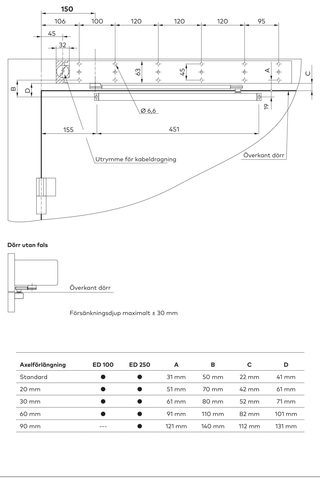

#### **Montering på gångjärnssidan dragande med glidskena och lång stagbult**

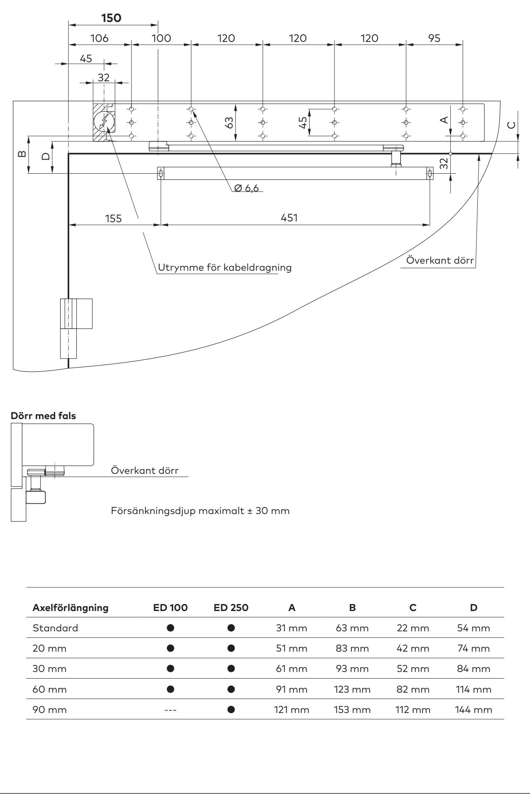

#### **Montering på gångjärnssidan dragande med glidskena CPD och kort stagbult**

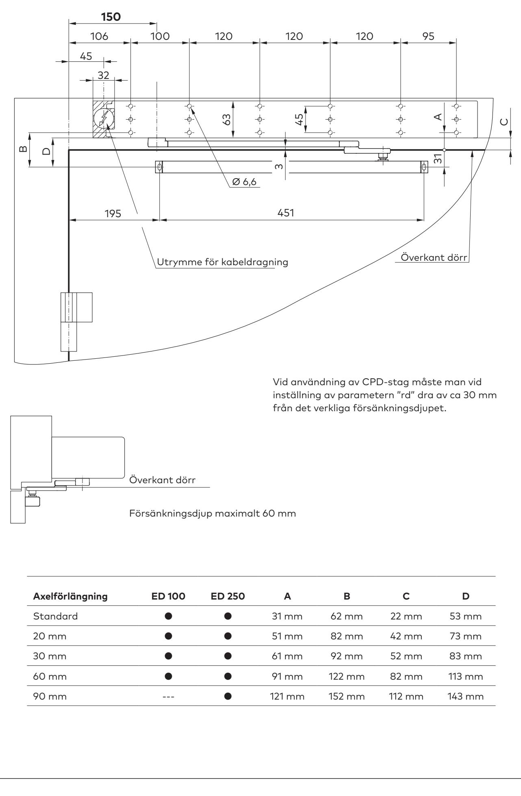

#### **Montering på gångjärnssidan dragande med glidskena CPD och lång stagbult**

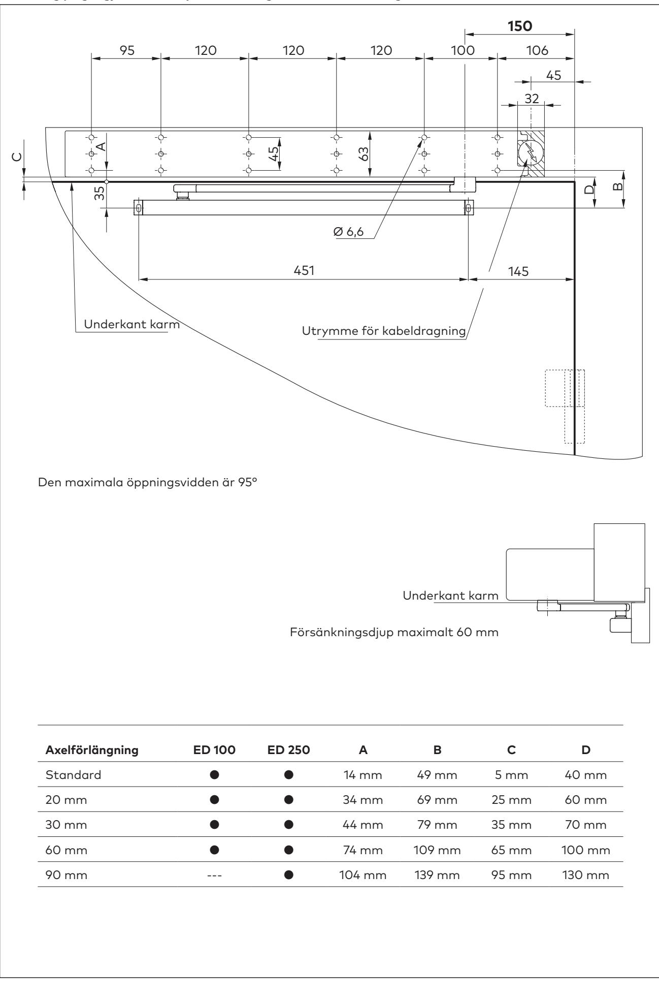

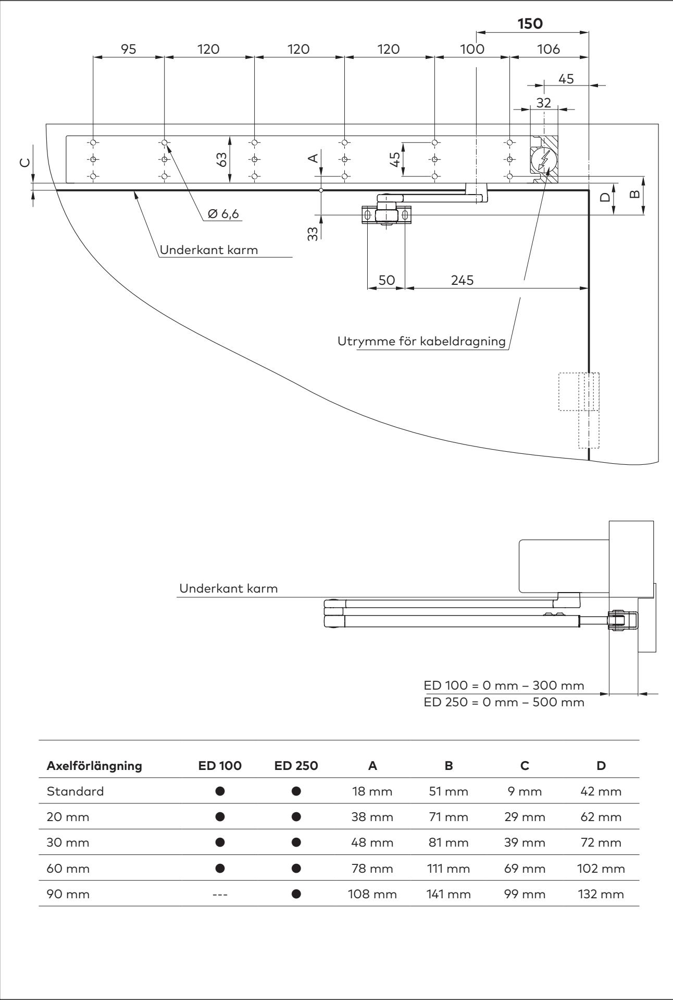

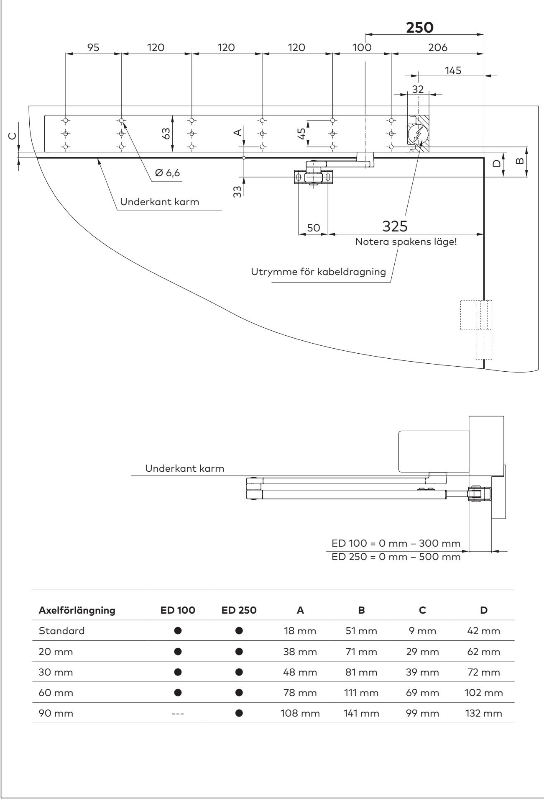

#### **Montering på en central dörr tryckande med glidskena CPD och kort stagbult**

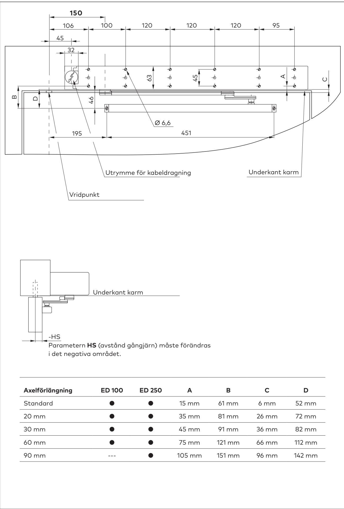

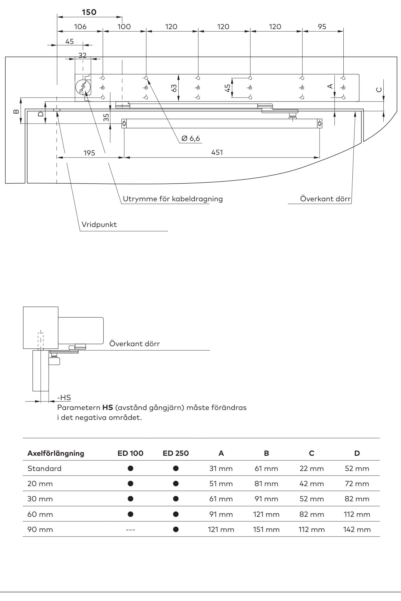

# **5 Montering av drivanordning**

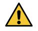

#### **VARNING**

**Nedfallande delar kan orsaka personskador** Nedfallande delar eller verktyg kan orsaka personskador.

- Säkra arbetsplatsen mot olovligt beträdande.
Det tillvägagångssätt som beskrivs här är ett exempel. Byggtekniska eller lokala förutsättningar, befintliga hjälpmedel eller andra omständigheter kan göra ett annat tillvägagångssätt meningsfullt.

## 5.1 Förutsättningar

- Installationsplatsen är utrustad med en 230 V/50- 60 Hz anslutning med en säkring på 16 A.
- Dörrbladet måste vara i ett mekaniskt felfritt skick och vara lättlöpande.

#### **Standardåtdragningsmoment**

M 5 ....... 5 Nm M 6 .... 9,5 Nm M 8 ..... 23 Nm M 10 .... 46 Nm M 12 ... 79 Nm

## 5.2 Verktyg som behövs

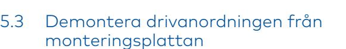

- **1.** Demontera drivanordningen från monteringsplattan.
- **2.** Dra ut 230 V stickkontakten.
- **3.** Skilj drivanordningen från monteringsplattan. Använd för detta ändamål en skruvmejsel som hävstång mellan motor och basplatta.
- **4.** Lägg en bit trä eller liknande under drivanordningen, så att anslutningsdelen inte kan lossna.

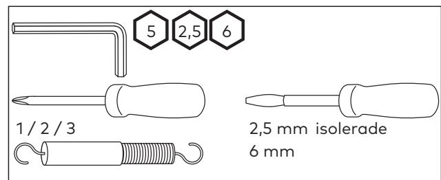

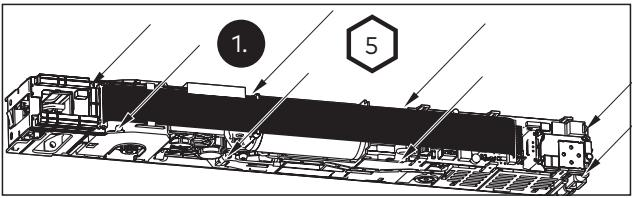

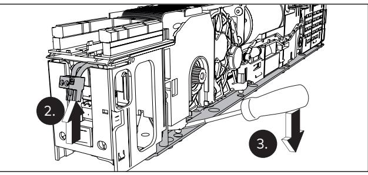

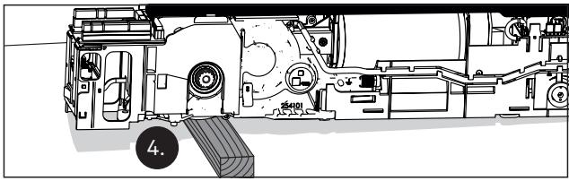

## 5.4 Valfria monteringssteg

- 5.4.1 Lägg kabel för integrerad brandvarnare (tillval)
Se monteringsanvisning ED Cover Basic RM, ED Cover VARIO RM.

## 5.4.2 Montering av dragavlastning (tillval)

Montera dragavlastningen innan du sätter fast monteringsplattan på dörren/väggen.

- **1.** Ta bort skruven och ta loss nätanslutningen från monteringsplattan.
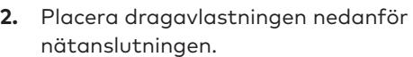

- **3.** Skruva fast nätanslutningen och dragavlastningen på monteringsplattan.
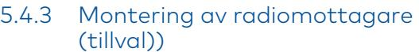

- **1.** Skruva radiomottagarens kretskort på drivanordningen.
- **2.** För ledningen genom fästet.

- **3.** Anslut radiomottagaren.
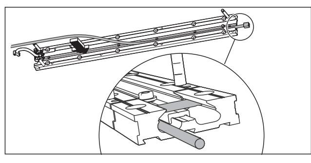

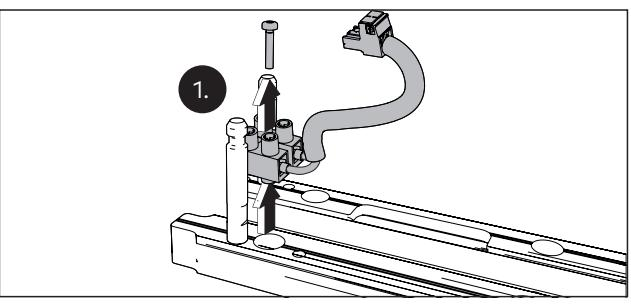

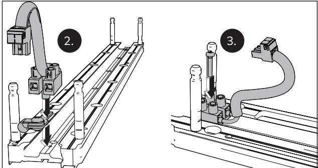

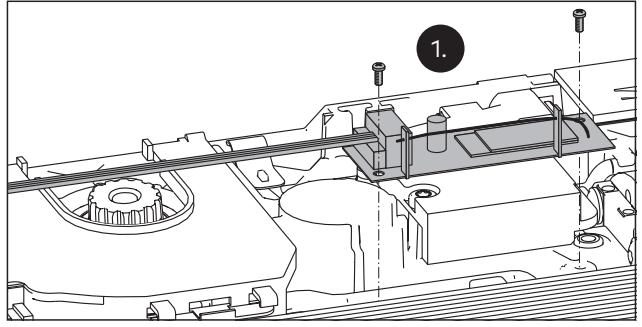

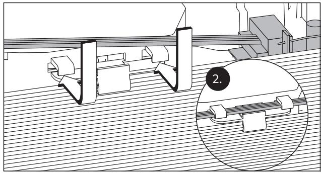

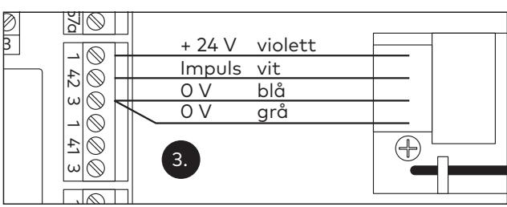

## 5.5 Montering av monteringsplattan

- **1.** Skruva fast monteringsplattan med 12 skruvar i de förberedda hålen.

#### **TIPS OCH REKOMMENDATIONER**

För montering använd pluggar och skruvar som anpassats till underlaget.

- **2.** Slå in den medföljande låsbulten med en hammare i det nedre av de båda hålen..
#### **FARA!**

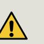

Livsfara genom elektrisk ström. Demonteras av behörig elektriker som endast arbetar med elsystem..

- **3.** Kläm fast 230 V anslutningsledningen.
- **4.** Böj änden på jordledningen till en ögla och skruva fast den på jordningsskruven.

## 5.6 Montering av drivanordningen på monteringsplattan

- **1.** För anslutningsledningarna genom kåpan och sätt fast drivanordningen på basplattans bultar.
- **2.** Tryck fast drivanordningen tills den hakas fast hörbart.
- **3.** Dra åt de 8 skruvarna hårt.
- **4.** Sätt i nätkontakten.

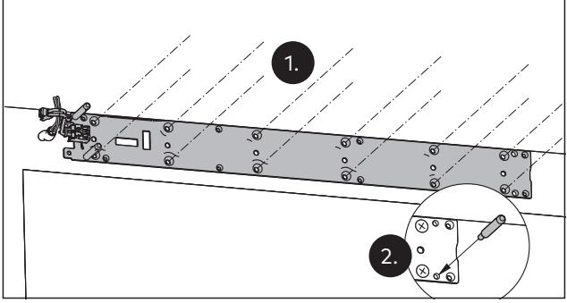

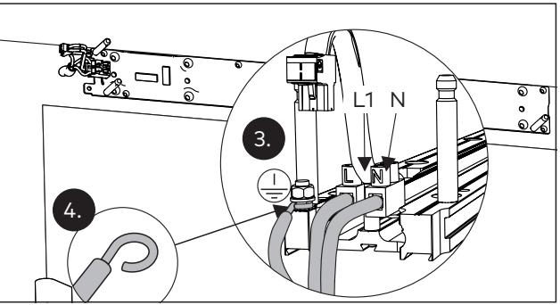

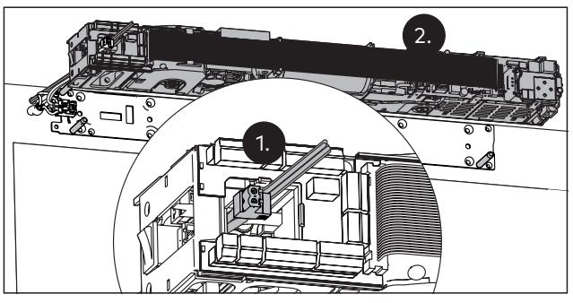

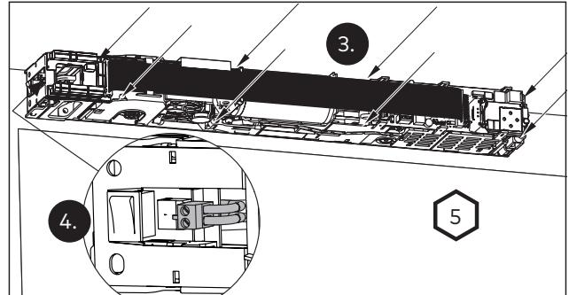

## 5.7 Montering av ED Cover Basic RM (tillval)

Montera den integrerade brandvarnaren på drivanordningen.

Monteringen beskrivs i monteringsanvisning ED Cover Basic RM, ED Cover VARIO RM.

#### 5.8 Slå in axelförlängningen i staget

- **1.** Slå in axelförlängningen i staget.
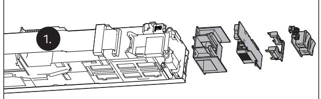

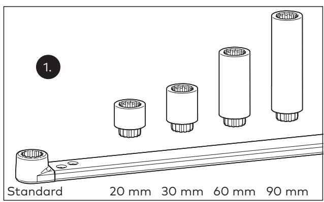

## 5.9 Montering av glidskenan

- **1.** För in stagbulten (kort = 9 mm eller **lång** = 24 mm) ii glidstycket och sätt fast den med en låsbricka. Den korta bulten används vid dörrar utan fals.
- **2.** För in de enskilda delarna i glidskenan precis som bilden visar och skruva fast fästdonen.
- (1) Ändkåpa
- (2) Fästdon
- (3) Glidskena
- (4) Anslag
- (5) Buffert
- (6) Glidstycke
- **3.** Skruva fast glidskenan med 2 skruvar i de förberedda hålen. För montering använd pluggar och skruvar som anpassats till underlaget.
- **4.** Sätt fast ändlock på glidskenan.

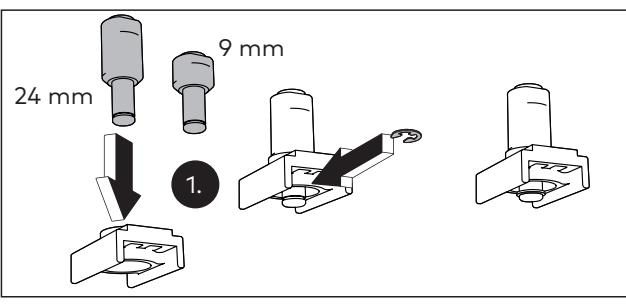

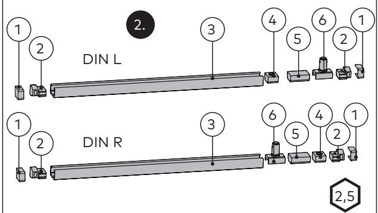

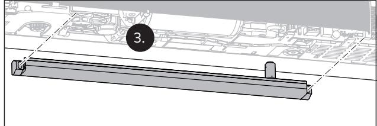

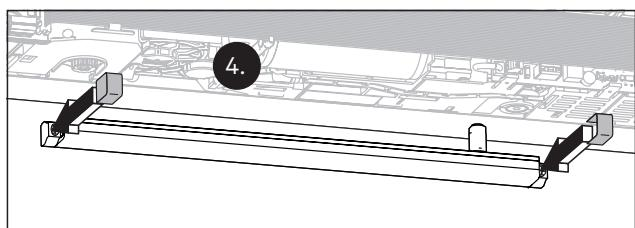

## 5.10 Montering av glidskenans stag CPD

Vid användning av glidskenans stag CPD måste denna monteras ihop..

- **1.** Vid användning av glidskenans stag CPD måste denna monteras ihop.
- (1) Gångjärnssida DIN höger och motsatt sida till gångjärnen DIN vänster
- (2) Gångjärnssida DIN vänster och motsatt sida till gångjärnen DIN höger

## 5.11 Montera spak

För att kunna montera spaken i rätt position, måste axeln föras till nolläget.

- **1.** Ställ in fjäderförspänningen på ca 10 varv, se "Ställ in fjäderspänning" på sida 26.
	- ‣ Axeln vrider sig i nolläge.
- **2.** Vrid fjäderspänningen tillbaka till 0 varv.
- **3.** Sätt in spaken i en vinkel på ca 12° från axelns drift.
- **4.** Vrid på spaken med drivaxeln ca 10° i dörröppnarens riktning.
- **5.** Ta spaken från axeln.
- **6.** Vrid spaken ett snäpp i dörröppnarens riktning.
- **7.** Sätt in spaken på axeln.
- **8.** Skruva fast spaken till 23 Nm.

- **9.** Skruva fast spakbultarna i spaken.
- **10.** Skruva fast spakbultarna till 8–10 Nm.

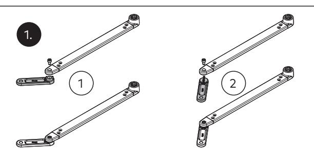

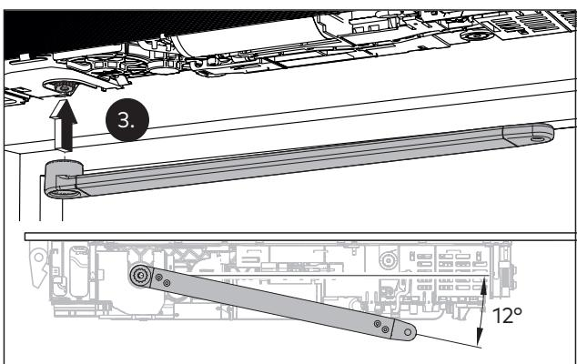

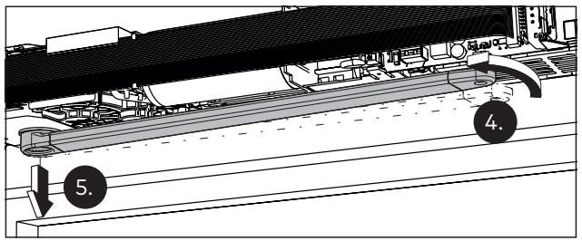

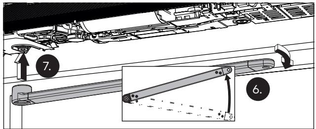

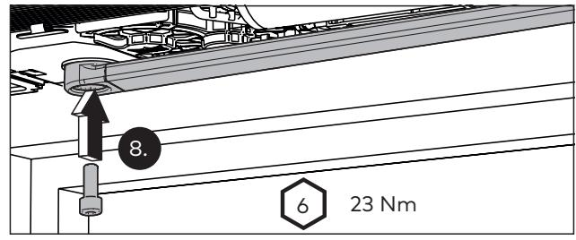

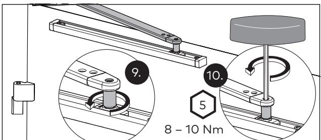

#### 5.12 Montera normalstänger

För att kunna montera spaken i rätt position, måste axeln föras till nolläget

- **1.** Ställ in fjäderförspänningen på ca 10 varv, se "Ställ in fjäderspänning" på sida 26.
	- ‣ Axeln vrider sig i nolläge.
- **2.** Sätt in spaken (B) i en vinkel på 90° från axelns drift.
- **3.** Skruva fast spaken till 23 Nm.
- **4.** Skruva fast teleskoparmen (A) med 2 skruvar i dörrbladet.
- **5.** Sätt fast locken på teleskoparmens gångjärn.
- **6.** Lossa de 2 skruvarna på teleskoparmen.
- **7.** Tryck på teleskoparmens kulhuvud när du för in spaken.
- **8.** Vrid stängerna så att teleskoparmen är i 90° vinkel från dörrbladet.
- **9.** Skruva fast de 2 skruvarna.

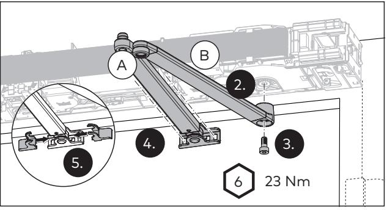

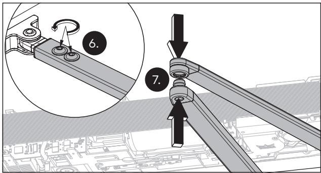

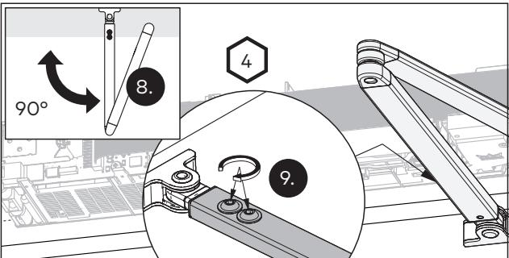

## 5.13 Inställning av bromskoppling

- **1.** Se till att nätspänningen är frånslagen.
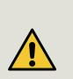

**VARNING!**

Klämrisk i dörren. Vid felaktigt monterad stickkontakt fungerar inte bromskretsen. Dörren kan stängas hastigt

- **2.** Sätt på kontakten beroende på monteringssätt. (A) = montering dragande
	- (B) =montering tryckande

## 5.14 Inställning av fjäderspänning

Vid leverans är fjädern avspänd. För drift krävs en förspänning på minst 10 varv. Inställningen testas vid inlärningskörningen. Vid för låg fjäderspänning avbryts inlärningskörningen. Om fjäderinställningen ändras måste en ny inlärningskörning genomföras.

- **1.** Titta i tabellen för att ta reda på de nödvändiga hela varven för inställning av fjädern och ställ in fjäderspänningen-

| Urval EN klass               |      |      |      |      |      |
|------------------------------|------|------|------|------|------|
| Dörrbladsbredd i mm       | 950  | 1100 | 1250 | 1400 | 1600 |
| EN Klasse                    | EN 3 | EN 4 | EN 5 | EN 6 | EN 7 |
| min. stängnings              | 18   | 26   | 37   | 54   | 87   |
| moment vid 2°                | Nm   | Nm   | Nm   | Nm   | Nm   |
| Varv för fjäderinställningen |      |      |      |      |      |
| ED 100                       | 14   | 16   | --   | --   | --   |
| ED 250                       | --   | 14   | 18   | 24   | 24   |
| Kombinationsmöjlighet armar  |      |      |      |      |      |
| Standardarmar                | X    | X    | X    | X    | X    |
| Glidskena                    | X    | X    | X    | X    |      |

Tabellen visar ungefärliga värden, därför måste stängningsmomentet vid 2° testas och vid behov korrigeras enligt EN 1154. Vid försänkningsdjup större än 300 mm ska dessutom det minsta stängningsmomentet mellan 88° – 92° kontrolleras.

## 5.15 Inställning av stängningshastigheten i strömlöst tillstånd

- **1.** Ställ in stängningshastigheten på potentiometern.
Det är absolut nödvändigt att ställa in hastigheten. Om det tar mindre än 3 sekunder för dörren att stängas leder detta till felmeddelande 73 (test av bromskoppling).

## 5.16 Idrifttagning av drivanordningen

- **1.** Ta drivanordningen i drift. För detta ändamål se idrifttagning på sida 33.
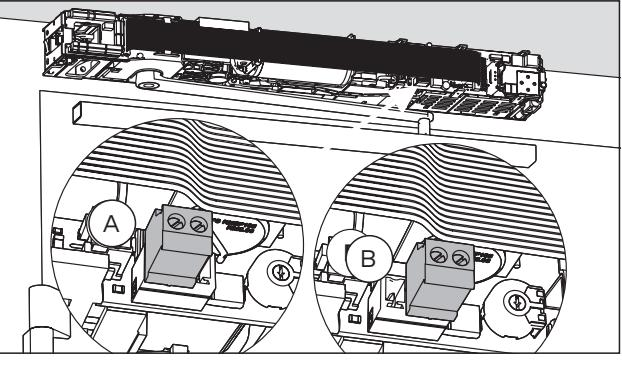

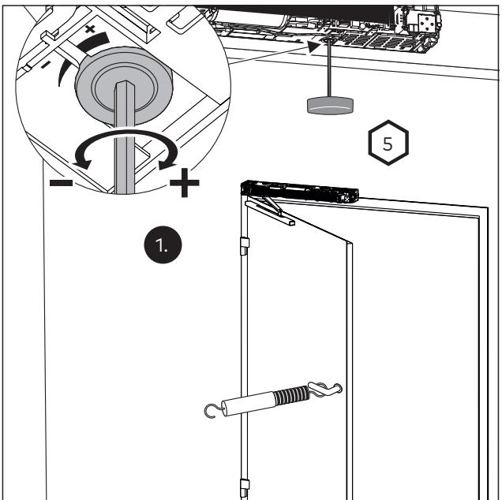

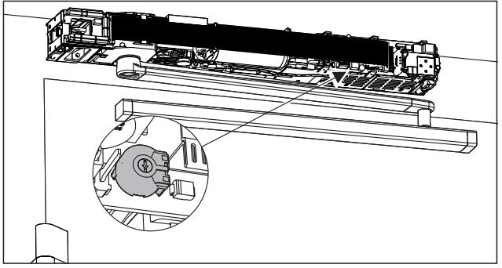

## 5.17 Ställ in anslaget på glidskenan

Anslaget måste ställas in så att den inställda öppningsvinkeln inte kan överskridas genom manuell tryckning.

- **1.** Ställ in programknappen i läget PERMANENT ÖPPEN.
	- ‣ Dörren körs upp till inställd öppningsvidd.
- **2.** Skjut fram bufferten och anslaget upp till 5 mm före glidstycket.
- **3.** Skruva fast anslaget.

## **VARNING!**

dormakaba rekommenderar att du använder dörrstoppare. Vid montering av normalstängerna måste en dörrstoppare användas.

# 5.18 Montering av beklädnad

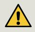

**VARNING!** Se till att inga ledningar kläms.

- **1.** Sätt på kåpan på drivanordningen och tryck fast den tills den hörbart klickar på plats.
- **2.** Sätt fast axelkåpan.

**3.** Sätt fast sidobeklädnaderna.

längdskillnader mot kåpan.

På sidan med programknappen kan insticksdjupet varieras genom inklickning för att utjämna mindre

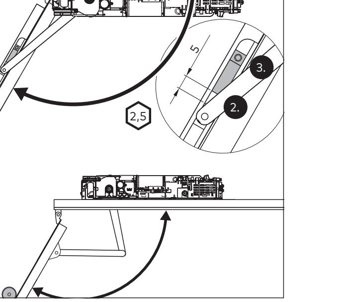

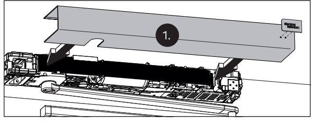

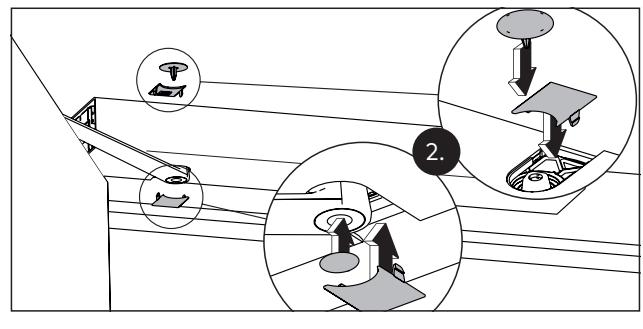

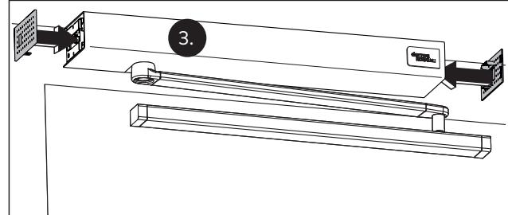

3.

6.

2.

1.

4.

5.

# 5.19 Montering av 2-flyglig dörr (tillval)

Utför följande moment innan du monterar drivanordningarna:

- **1.** Dra loss anslutningskabeln på båda drivanordningarna.
- **2.** Dra ut kretskorten med de interna programknapparna uppåt.
- **3.** På den drivanordning som inte ska byggas in på nätanslutningens sida trycker du in de 3 klämmorna på kopplingsplinten och tar loss den.
- **4.** Öppna de båda luckorna ovanför nätanslutningens kretskort.
- **5.** Dra loss kontakterna.
- **6.** Ta bort nätanslutningens kretskort.
- **7.** Stäng båda luckorna och sätt fast kopplingsplinten.

- **8.** Lägg monteringsplattorna på ett plant underlag och rikta in dem exakt.
- **9.** Mät kåpans längd och räkna med hjälp av formeln Kåpans längd – 91 = X ut längden på de ihopmonterade monteringsplattorna.
- **10.** Skruva ihop monteringsplattorna. Beakta därvid hänvisningarna på bilderna 4 och 5a – 5c.

## **TIPS OCH REKOMMENDATIONER**

När monteringsplattorna monterats, sätter du på drivanordningarna och kontrollerar om beklädnaden passar.

- **11.** Beräkna gångjärnens mått.
**X** 8.

9.

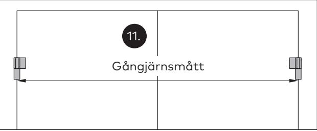

**12.** Koppla ihop monteringsplattorna. Det finns 3 möjligheter att förbinda monteringsplattorna med varandra. Vilken av dessa som används bestäms genom gångjärnens mått.

Gångjärnsmått 1400–1415 mm = förbindelse "A" Gångjärnsmått 1416–1475 mm = förbindelse "B" Gångjärnsmått från 1476 mm = förbindelse "C"

#### **Förbindelse "A"**

Gångjärnsmått 1400–1415 mm Koppla ihop monteringsplattorna med det långa skarvdonet.

#### **Förbindelse "B"**

Gångjärnsmått 1416–1475 mm Koppla ihop monteringsplattorna med det långa skarvdonet och den lilla mellanplattan.

#### **Förbindelse "C"**

Gångjärnsmått från 1476 mm Koppla ihop monteringsplattorna med de korta skarvdonen och den anpassade mellanplattan.

- **13.** Skruva fast monteringsplattorna med vardera 12 skruvar i de förberedda hålen.

#### **TIPS OCH REKOMMENDATIONER**

För montering använd pluggar och skruvar som anpassats till underlaget.

- **14.** Slå in den medföljande låsbulten i det nedre av de båda hålen med hjälp av en hammare.
#### **FARA!**

Livsfara genom elektrisk ström. Demonteras av behörig elektriker som endast arbetar med elsystem.

- **15.** Kläm fast 230 V anslutningsledningen.
- **16.** Böj änden på jordledningen till en ögla och skruva fast den på jordningsskruven.
- **17.** Lägg nätanslutningskabeln för den andra drivanordningen och eventuellt kabeln till programknappen i monteringsplattornas spår och fäst dem med de bifogade små plastplattorna.
- **18.** Montera båda drivanordningarna (se sidan 22).

Om utrustningen ska förses med en elektrisk stängningsföljdreglering måste denna nu byggas in (se monteringsanvisning ED 100/250 ESR).

Om utrustningen ska förses med en ED Cover Vario RM måste denna nu byggas in (se monteringsanvisning ED Cover Basic RM, ED Cover VARIO RM.

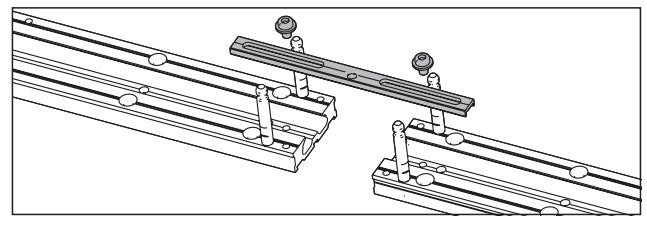

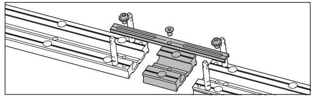

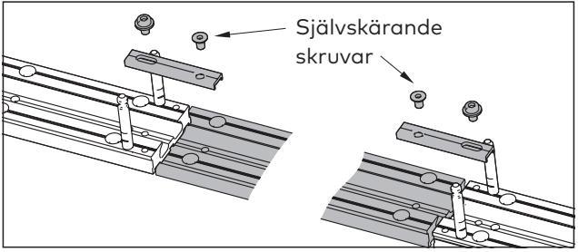

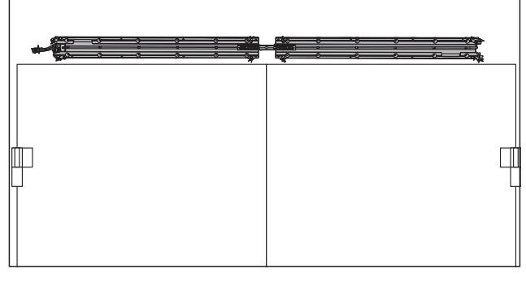

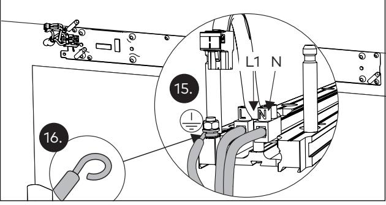

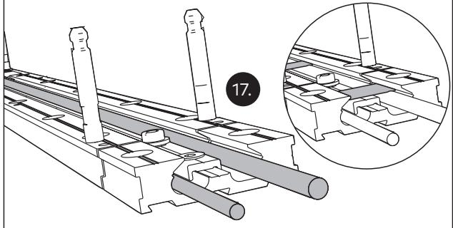

- **19.** Sätt den nya programknappen på plats i fästet på den borttagna nätströmbrytaren och anslut till det aktiva dörrbladets drivanordning. Anslutningen utförs på kopplingsplinten på klämmorna för den externa programknappen.
- **20.** Om du har monterat programknappen på det aktiva dörrbladets drivanordning måste anslutningskabeln kortas. Kabeländarna ska förses med kabelskor.
- **21.** För in kommunikationskabeln i de båda "liggande" kontakterna på styrningen.
- **22.** Anslut nätanslutningskabeln för den andra drivanordningen.
- A visar anslutningen på det aktiva dörrbladet.

- B visar anslutningen på det stillastående dörrbladet.
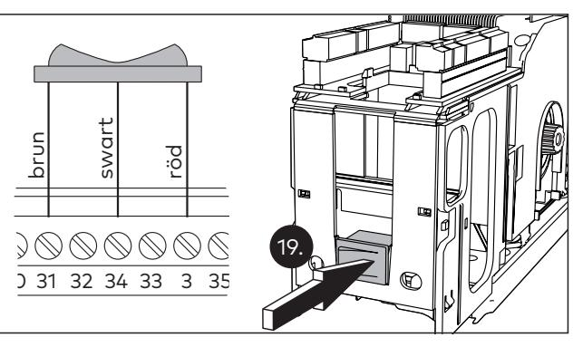

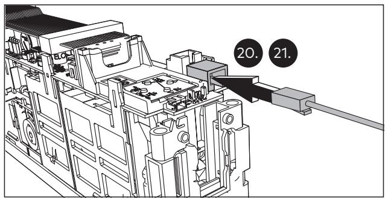

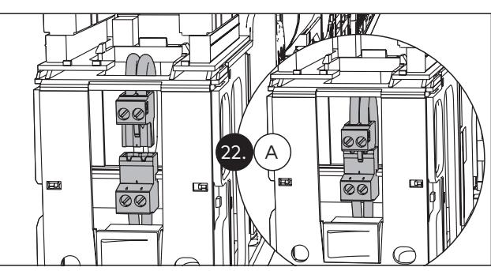

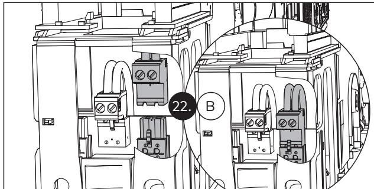

# **6 Anslutning av tillbehör**

- **1.** Kläm fast anslutningskablarna på kontakterna och sätt fast kontakterna på kopplingsplinten.
- Maximalt 1,5 A totallast på klämmorna 1, 1G och 3, maximalt 1 A last och klämmorna 1G
- Maximalt 30 m kabellängd vid användning av J-Y(ST)Y 0,8 mm

# 6.1 Plinttilldelning

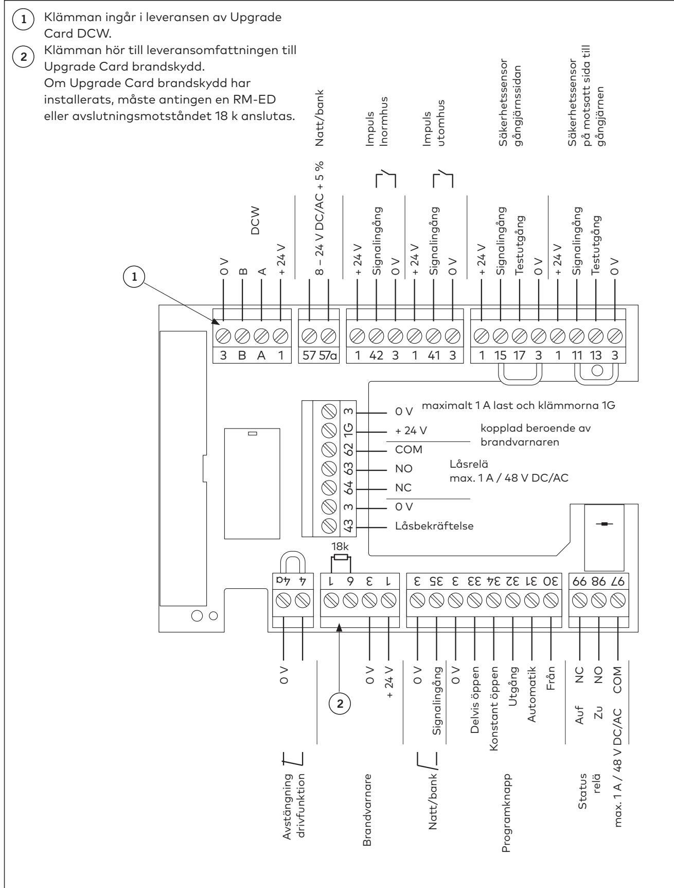

## 6.2 Plinttilldelning vid användning av Upgrade Card barriärfritt WC

Dörrsystemet måste utrustas med följande komponenter:

- Vilström-dörröppnare eller ett lämpligt motordrivet paniklås
- På insidan med ett dörrhandtag och på utsidan med en knopp
- Inne och ute med vippor
- På utsidan med en statusdisplay för indikering av ledigt/upptaget
- På insidan med en upptagetindikering

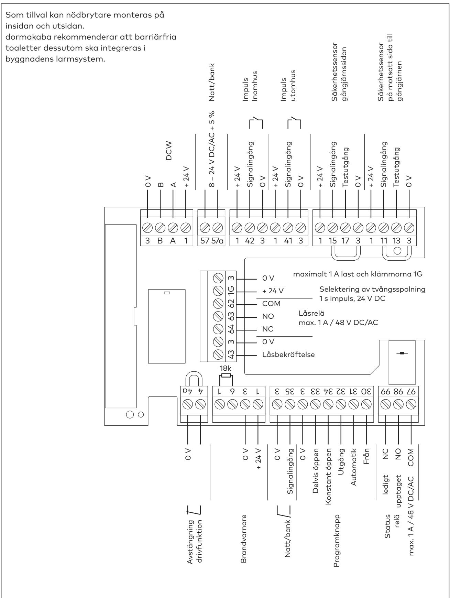

eller

# **7 Idrifttagning**

(även efter återställning med fabriksinställning (Fact-Setup))

## 7.1 Förutsättningar

- Drivanordningen är komplett installerad och korrekt ansluten till dörrbladet.
- De separat levererade komponenterna som programknappar och impulsgivare (radardetektorer, natt/bank-nyckelbrytare) måste vara monterade och anslutna.
- Motorn är kall.

## 7.2 Idrifttagning av drivanordningen

- **1.** Slå på drivanordningen på nätströmbrytaren.
	- ‣ Displayen visar en teckenföljd som visar aktuell status på bearbetningen.

Systemet testas.

2 fram- och tillbakahoppande segment i mitten visar att styrningen väntar på interna signaler (maximalt 1 sekund).

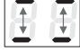

2 upp- och nerhoppande understreck visar att inbyggnadsläget kan matas in. Vid felaktig inmatning visas tecknen på displayen upp och ner.

- **2.** Tryck den nedre knappen (krävs endast vid första idrifttagningen).
Utrustningens identifikationskod "rullar" över displayen. ED 100 resp. ED 250 och firmware version (visat med XX XX).

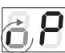

Litet, cirkulerande "o" och "P" visar att ytterligare en parametrering krävs (endast under första idrifttagningen eller efter återställning med fabriksinställning).

- **3.** Ställ in parametrarna: Typ av montering (AS), försänkningsdjup (rd) och dörrbredd (Tb). Dessa parametrars betydelse och värdemängd hittar du på tabellen på sidan 34.
## 7.3 Ändring av parametrar

- **1.** Tryck på knappen i 3 sekunder för att anropa parametermenyn.
- **2.** Tryck på knapparna för att välja önskad parameter. eller **3.** Tryck på knappen för att visa parametervärdet. **4.** Tryck på knappen för att visa ändringens värde. => värdet blinkar **5.** Tryck på knapparna för att ställa in önskat värde. eller **6.** Tryck på knappen för att spara det
- **7.** Tryck på knappen för att gå tillbaka till parametermenyn.
- **8.** Tryck på knapparna för att välja nästa parameter.

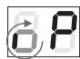

När parametreringsläget lämnats visar displayen ett litet cirkulerande "o" och "P".

# 7.4 Genomföra inlärningskörning

Inlärningskörningen måste utföras med kall motor. Under inlärningskörningen får dörrbladet inte flyttas eller hållas öppen manuellt, eftersom styrningen då inte kan beräkna parametern korrekt. Säkerhetssensorerna och impulsgivarna ska vara avstängda under inlärningskörningen så att inlärningskörningens förlopp inte störs. Brandvarnaren och avstängning av driftfunktion ska vara aktiverade.

- **1.** Säkra dörrbladens rörelseområde.
- **2.** Stäng dörren och ställ in programknappen i läget FRÅN.

Litet, cirkulerande "o" och "O" visar att en inlärningskörning krävs.

- **3.** Tryck på knappen i 3 sekunder.
	- ‣ Dörren utför olika rörelser och displayen visar en följd av tecken. Dörrbladets rörelser får inte stoppas.

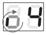

Dörren står i 70° position och väntar på att öppningsbredden ska ställas in.

- **4.** Skjut dörren till önskat öppetläge och tryck på knappen .
Om fjäderspänningen är för låg visar displayen det lilla cirkulerande "o" och "F".

- **5.** Öka i så fall fjäderspänningen och starta inlärningskörningen på nytt.
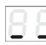

Dörren är klar för drift.

## **TIPS OCH REKOMMENDATIONER**

Efter den automatiska inlärningskörningen måste på grund av systemtoleranser de faktiska krafterna vid dörrbladet mätas och vid behov förändras för att de lokala standarderna och föreskrifterna ska kunna iakttas.

ändrade värdet.

## 7.5 Idrifttagning av ett 2-flygligt system

- **1.** Ta det aktiva dörrbladet i drift.
- **2.** Ställ efter inlärningskörningen in programknappen i läget PERMANENT ÖPPEN.
- **3.** Ta det stillastående dörrbladet i drift.

#### **Ytterligare parametrering**

- På det aktiva dörrbladet: Ställ in parametern >dL< (dörrtyp) på "1". Ställ in parametern >Ad< (vinkel för eftergång) på det önskade värdet.
- På det stillastående dörrbladet: Ställ in parametern >dL< på "2".

## 7.6 Sökning efter nollpunkten efter nätåterställning

Under sökning efter nollpunkten visar displayen det lilla cirkulerande "o" och "b".

7.7 Idrifttagning med integrerad brandvarnare

Se monteringsanvisning ED Cover Basic RM, ED Cover VARIO RM).

# **8 Installering av Upgrade Cards**

#### 8.1 Förutsättningar:

- Drivanordningen är komplett monterad.
- Inlärningskörningen har lyckats och är slutförd.
- Nätspänningen är inkopplad.
- Programknappen befinner sig i läget FRÅN.
- Informationsdisplayen visar viloläget.

## 8.2 Användning i 2-flygliga system

#### **Full-Energy:**

Upgrade Card Full-Energy kan installeras på en eller båda drivanordningarna.

#### **Brandskydd:**

Upgrade Card brandskydd måste installeras på båda drivanordningarna.

#### **Professional:**

Upgrade Card Professional installeras endast på det aktiva dörrbladets drivanordning.

#### **DCW:**

Upgrade Card DCW installeras endast på den drivanordning, på vilken DCW-produkter ska anslutas.

## 8.3 Installation av första Upgrade Card

- **1.** Sätt i nämnda Upgrade Card i kortplatsen (se sidan 4 position 9).
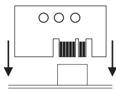

- ‣ Den gula lysdioden blinkar en gång när kortet sätts i.
- ‣ Uppgifterna överförs. Kommunikationen mellan modulerna visas genom att den gröna lysdioden blinkar långsamt.

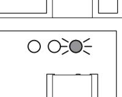

- ‣ Motsvarande funktion är nu upplåst och kan aktiveras (se sidan 39, parameter F1–F8).
- ‣ Systemet är klart för drift.

## 8.4 Installation av ytterligare Upgrade Cards

Du kan installera ytterligare Upgrade Cards. Det första installerade Upgrade Card fungerar som container modul. Alla önskade funktioner kan användas så länge container-modulen är installerad i drivsystemet.

- **1.** Ta bort container-modulen.
**2.** Sätt fast nästa Upgrade

‣ Funktionen kopieras till drivsystemet och nämnda Upgrade Card

Card.

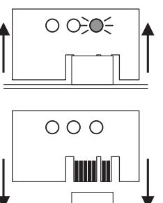

- görs ogiltigt. **3.** Ta bort nämnda Upgrade Card, så snart den gula lysdioden tänds.
- **4.** Sätt fast container-modulen.
	- ‣ Styrningen känner igen container-modulen och sparar den nya funktionen i den.
	- ‣ En långsamt blinkande grön lysdiod indikerar problemfri drift, funktionen kan aktiveras (se sidan 39, parameter F1 – F8).

Beakta även följande vid installationen:

- Om container-modulen avlägsnas så avaktiveras de funktioner som låsts upp tidigare efter ett tag.
- För att kunna utföra en nyinstallation av Upgrade Cards måste en utvidgad fabriksinställning genomföras.
- Vid byte av styrningen flyttas container-modulen från den gamla till den nya styrningen. Den nya styrningen synkroniseras med container-modulen och alla funktioner är nu åter tillgängliga.
- Om ett redan upplåst Upgrade Card sätts i avvisas detta. Detta visas genom en snabbt blinkande gul lysdiod. Modulen görs då inte ogiltig.
- Om container-modulen från en främmande styrning sätts i kommer container-modulen att avvisas. Detta visas genom snabbt blinkande gul och grön lysdiod. Modulen kan endast synkroniseras med en styrning.

## 8.4.1 Installation av Upgrade Card brandskydd

- **1.** Installera Upgrade Card brandskydd enligt beskrivningen under punkt 8.3 och 8.4.
- **2.** Sätt i den medföljande ljusledaren i sidobeklädnadens större borrhål på nätströmbrytarens sida.

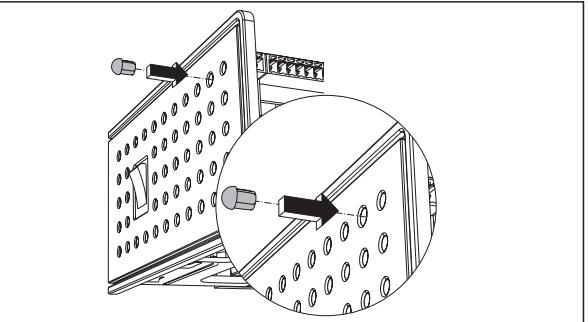

# 8.4.2 Upgrade Card barriärfritt WC

- **1.** Installera Upgrade Card barriärfritt WC enligt beskrivningen under punkt 8.3 och 8.4.
- **2.** Stäng av ED 100, ED 250 och slå på dem igen så att funktionerna verkställs. Beakta den ändrade plinttilldelningen under punkt 6.2 vid användning av Upgrade Card barriärfritt WC.

# **9 Parametrering/service**

Efter genomförd inlärningskörning kan drivanordningen köras med grundparametrarna. Systemet erbjuder dessutom möjligheten att anpassa körningens parametrar enligt faktiska villkor samt att aktivera utökade funktioner. Dessa parametrar bör ställas in enligt användarens önskemål redan vid idrifttagningen.

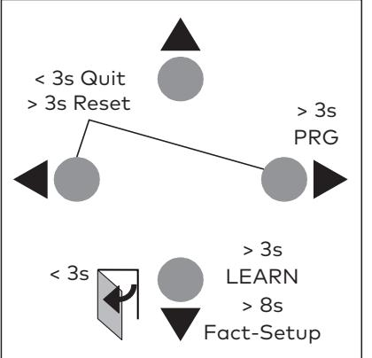

| Parameter/visning                     |  | Värdeområde                                                                                           | Enhet fabriksinställning = fetstil | Förklaring                                                                                                                                                                                                                                                                                                                                                                                                                                                                                                                                                                                                                                                                                                     |
|---------------------------------------|--|-------------------------------------------------------------------------------------------------------|------------------------------------------|----------------------------------------------------------------------------------------------------------------------------------------------------------------------------------------------------------------------------------------------------------------------------------------------------------------------------------------------------------------------------------------------------------------------------------------------------------------------------------------------------------------------------------------------------------------------------------------------------------------------------------------------------------------------------------------------------------------|
| Typ av montering                      |  | 0 – 5                                                                                                 | 0                                        | Montering på karmöverstycke gångjärnssida, glidskena dragande                                                                                                                                                                                                                                                                                                                                                                                                                                                                                                                                                                                                                                                  |
|                                       |  |                                                                                                       | 1                                        | Montering på karmöverstycke på motsatt sida till gångjärnen, saxarmar tryckande                                                                                                                                                                                                                                                                                                                                                                                                                                                                                                                                                                                                                             |
|                                       |  |                                                                                                       | 2                                        | Montering på karmöverstycke på motsatt sida till gångjärnen, glidskena tryckande                                                                                                                                                                                                                                                                                                                                                                                                                                                                                                                                                                                                                            |
|                                       |  |                                                                                                       | 3                                        | OHC_R                                                                                                                                                                                                                                                                                                                                                                                                                                                                                                                                                                                                                                                                                                          |
|                                       |  |                                                                                                       | 4                                        | OHC_L                                                                                                                                                                                                                                                                                                                                                                                                                                                                                                                                                                                                                                                                                                          |
|                                       |  |                                                                                                       | 5                                        | Montering på karmöverstycke på motsatt sida till gångjärnen, saxarmar tryckande EN7                                                                                                                                                                                                                                                                                                                                                                                                                                                                                                                                                                                                                         |
| Försänkningsdjup                      |  | ED 100: – 3 – 30 ED 250: – 3 – 50                                                                  | 0                                        | Försänkningsdjupet ställs in i steg om 10 mm. Det nödvändiga måttet finns på monteringsritningarna. Vid användning av CPD-staget måste man dra av ca 30 mm från det verkliga försänkningsdjupet.                                                                                                                                                                                                                                                                                                                                                                                                                                                                                                      |
| Dörrbladsbredd                        |  | ED 100: 7 – 11 ED 250: 7 – 16                                                                      | 10                                       | Falsen räknas med i dörrbladsbredden. Dörrens bredd anges i steg om 100 mm.                                                                                                                                                                                                                                                                                                                                                                                                                                                                                                                                                                                                                                 |
| Dörrtyp                               |  | 0 – 4                                                                                                 | 0                                        | 1-flyglig dörr                                                                                                                                                                                                                                                                                                                                                                                                                                                                                                                                                                                                                                                                                                 |
|                                       |  |                                                                                                       | 1                                        | 2-flyglig dörr, aktivt dörrblad, överlappande dörrblad                                                                                                                                                                                                                                                                                                                                                                                                                                                                                                                                                                                                                                                         |
|                                       |  |                                                                                                       | 2                                        | 2-flyglig dörr, stillastående dörrblad, överlappande dörrblad                                                                                                                                                                                                                                                                                                                                                                                                                                                                                                                                                                                                                                                  |
|                                       |  |                                                                                                       | 3                                        | 2-flyglig dörr, aktivt dörrblad, ofalsade dörrblad                                                                                                                                                                                                                                                                                                                                                                                                                                                                                                                                                                                                                                                             |
|                                       |  |                                                                                                       | 4                                        | 2-flyglig dörr, stillastående dörrblad, ofalsade dörrbladl                                                                                                                                                                                                                                                                                                                                                                                                                                                                                                                                                                                                                                                     |
| Öppnings                              |  | ED 100: 8 – 50                                                                                        | Grad /                                   | Öppningshastigheten gäller för automatisk drift. Landsspecifika                                                                                                                                                                                                                                                                                                                                                                                                                                                                                                                                                                                                                                                |
| hastighet                             |  | ED 250: 8 – 60 (vid Low Energy respektive reducerat till max. 27°/sek.)                   | sekund 25                             | gränser måste iakttas och testas efter inställning. Det fulla inställningsområdet är endast tillgängligt vid installerat Upgrade Card Full-Energy. Hastigheten kan ändras med denna parameter. Att inställningen är tillåten kontrolleras genom interna övervakningar. Vid en överskridelse visas det inställda värdet växelvis med det faktiska värdet.                                                                                                                                                                                                                                                                                                                                        |
| Stängnings hastighet               |  | ED 100: 2 – 50 ED 250: 2 – 60 (vid Low Energy respektive reducerat till max. 27°/sek.) | Grad / sekund 25                   | Stängningshastigheten gäller för automatisk drift. Landsspecifika gränser måste iakttas och testas efter inställning. Det fulla inställningsområdet är endast tillgängligt vid installerat Upgrade Card Full-Energy. Hastigheten kan ändras med denna parameter. Att inställningen är tillåten kontrolleras genom interna övervakningar. Vid en överskridelse visas det inställda värdet växelvis med det faktiska värdet.                                                                                                                                                                                                                                                                   |
| Tid för öppethållning              |  | 0 – 30 (standard vid Low Energy min. 5 s) 0–180 med Upgrade Card Professional          | Sekunder 5                            | Tiden för öppethållning bör ställas in på så sätt att personerna har tillräckligt med tid för att passera dörren. Om en längre tid för öppethållning önskas kan inställningsområdet utökas till 180 sekunder med Upgrade Card Professional. Tiden för öppethållning startar efter det att kontakten/spänningen vid impulsgivningens ingångar, inomhus, utomhus, säkerhet, Push & Go öppnas/bryts och dörren befinner sig i öppet läge. Signalen kan utlösas igen. Med driftsättet Low Energy får den minsta tiden för öppethållning på 5 sekunder inte underskridas. Värden på 0–30 sekunder kan ställas in i steg om 1 sekund och värden över 30 sekunder i steg om 5 sekunder. |
| Tid för öppethållning Natt/bank |  | 0 – 30                                                                                                | Sekunder 10                           | Tiden för öppethållning natt/bank (nyckelbrytare) kan ställas in separat. Tiden för öppethållning natt/bank startar när kontakten vid impulsgivarens ingång natt/bank öppnas och dörren befinner sig i öppet läge. Signalen kan utlösas igen.                                                                                                                                                                                                                                                                                                                                                                                                                                                         |

| Parameter/visning                                                    | Värdeområde                    | Enhet fabriksinställning = fetstil | Förklaring                                                                                                                                                                                                                                                                                                                                                                                                                                                                                                                                                                                                             |
|----------------------------------------------------------------------|--------------------------------|------------------------------------------|------------------------------------------------------------------------------------------------------------------------------------------------------------------------------------------------------------------------------------------------------------------------------------------------------------------------------------------------------------------------------------------------------------------------------------------------------------------------------------------------------------------------------------------------------------------------------------------------------------------------|
| Tid för öppethållning vid manuell öppning                      | 0 – 30                         | Sekunder 1                            | Tiden för öppethållning efter manuell öppning fungerar vid varje ren manuell öppning, även vid aktiverad Power-Assist-funktion och efter stopp genom sensorlisten.                                                                                                                                                                                                                                                                                                                                                                                                                                               |
| Nedtoning av vägg BS                                              | 60 – 99                        | Grad 80                               | När inställd vinkel har uppnåtts ignoreras ingångssignalen på gångjärnssidans säkerhetssensor. Nedtoning av väggen behövs                                                                                                                                                                                                                                                                                                                                                                                                                                                                                           |
|                                                                      | 99 = avaktiverad            |                                          | när dörren öppnas mot ett hinder. Ju större den använda säkerhetssensorns avkänningsområde är, desto större måste området vara i vilken detektionen ignoreras. För personskyddets skull rekommenderar vi att detta område minimeras. Om vinkeln för nedtoning av väggen överskrids när dörren öppnas visas en snabbt blinkande punkt uppe till vänster på styrningens                                                                                                                                                                                                                                   |
|                                                                      |                                |                                          | display. Denna indikation slocknar om vinkeln underskrids.                                                                                                                                                                                                                                                                                                                                                                                                                                                                                                                                                             |
| Test säkerhetssensor                                              | 0 – 6                          | 0                                        | Test Från. Säkerhetssensorerna testas inte. För användning med säkerhetssensor IRS-2. I kombination med                                                                                                                                                                                                                                                                                                                                                                                                                                                                                                             |
|                                                                      |                                |                                          | säkerhetssensorer enligt EN 16005 eller DIN 18650 måste en av parametrarna 1–6 användas. Testnivån Low och High aktiv är beroende av sensorn och denna måste vara inställd på samma                                                                                                                                                                                                                                                                                                                                                                                                                              |
|                                                                      |                                |                                          | värde som på drivanordningen.                                                                                                                                                                                                                                                                                                                                                                                                                                                                                                                                                                                          |
|                                                                      |                                | 1                                        | Testsensor BS – nivå High aktiv                                                                                                                                                                                                                                                                                                                                                                                                                                                                                                                                                                                        |
|                                                                      |                                | 2                                        | Testsensor BS – nivå High aktiv                                                                                                                                                                                                                                                                                                                                                                                                                                                                                                                                                                                        |
|                                                                      |                                | 3                                        | Testsensor BS och sensor BGS – nivå High aktiv                                                                                                                                                                                                                                                                                                                                                                                                                                                                                                                                                                         |
|                                                                      |                                | 4                                        | Testsensor BS – nivå Low aktiv                                                                                                                                                                                                                                                                                                                                                                                                                                                                                                                                                                                         |
|                                                                      |                                | 5                                        | Testsensor BGS – nivå Low aktiv                                                                                                                                                                                                                                                                                                                                                                                                                                                                                                                                                                                        |
|                                                                      |                                | 6                                        | Testsensor BS och sensor BGS – nivå Low aktiv                                                                                                                                                                                                                                                                                                                                                                                                                                                                                                                                                                          |
| Impuls genom säkerhetssensor                                      | 0 – 1                          | 0                                        | Säkerhetssensorns ingångssignal ignoreras så snart dörren är stängd.                                                                                                                                                                                                                                                                                                                                                                                                                                                                                                                                                |
| på motsatt sida till gångjärnen                                   |                                | 1                                        | Vid stängd dörr kan man med hjälp av säkerhetssensorn utlösa en öppningsimpuls.                                                                                                                                                                                                                                                                                                                                                                                                                                                                                                                                     |
| Nedtoning säkerhetssensor                                         | 0 – 1                          | 0                                        | Säkerhetssensorn BS är inte aktiverad vid första körningen (nedtonad).                                                                                                                                                                                                                                                                                                                                                                                                                                                                                                                                              |
| BS vid första körningen                                           |                                | 1                                        | Säkerhetssensorn BS är aktiverad vid första körningen.                                                                                                                                                                                                                                                                                                                                                                                                                                                                                                                                                                 |
| Utlösningstid                                                        | 0 – 40                         | 100 ms                                   | Utlösningstiden startar efter impulsgivning. Dörren öppnas inte                                                                                                                                                                                                                                                                                                                                                                                                                                                                                                                                                        |
|                                                                      |                                | 1                                        | förrän utlösningstiden har gått ut. Vid inställningen "0" utförs inget tryck före utlösningen. Processen förändras beroende på vilket lås som används och i kombination med svarskontakten.                                                                                                                                                                                                                                                                                                                                                                                                                      |
| Utlösningskraft                                                      | 0 – 9                          | 0                                        | Utlösningskraften bestämmer den styrka med vilken dörren trycks i riktning mot "STÄNGD" innan den öppnas. Tiden ställs in med parametern utlösningstid. Trycket i riktning "STÄNGD" kan vara meningsfullt när man vill avlasta en eventuell elektrisk öppnare och garantera att den öppnar. Ju högre inställt värde, desto större belastning på armarnas fästen. Förläng systemets livslängd genom att endast ställa in kraften så högt som det verkligen krävs.                                                                                                                                     |
| Test PR-modul                                                        | 0 – 1                          | O                                        | Test från                                                                                                                                                                                                                                                                                                                                                                                                                                                                                                                                                                                                              |
|                                                                      |                                | 1                                        | Vid SVP-2000 DCW och vid M-SVP 2000 DCW från V1.5 kan en Power-Reserve-modul användas. Denna måste kontrolleras regelbundet. Detta test aktiveras automatiskt när en brandskyddsmodul registreras tillsammans med SVP-2000 DCW eller M-SVP 2000 DCW från V1.5. Parametern kan ställas på 0 i efterhand men kommer åter att aktiveras vid återställning till fabriksinställning. PR-modulens test genomförs en gång per dygn, 10 minuter efter påslagning av elnätet. Vid ett fel kommer utlösningar inte längre att genomföras, och det startas inga fler automatiska körningar med dörren. |
| Statisk kraft i                                                      | 2 – 15                         | 10 N                                     | De krafter som verkar på stängningskanten kan ändras via denna                                                                                                                                                                                                                                                                                                                                                                                                                                                                                                                                                         |
| öppningsriktning (grundparameter för reglering av vindlast) | (reducerat vid Low Energy)) | 6                                        | parameter. Att inställningen är tillåten kontrolleras genom interna övervakningar. Vid en överskridelse visas det inställda värdet växelvis med det verksamma värdet. På grund av systemtoleranser måste de verkliga krafterna på dörrbladet mätas och eventuellt förändras efter drivanordningens automatiska inlärningskörning för att motsvara lokala standarder och föreskrifter.                                                                                                                                                                                                                   |

| Parameter/visning                                                                         |  | Värdeområde                              | Enhet fabriksinställning = fetstil | Förklaring                                                                                                                                                                                                                                                                                                                                                                                                                                                                                                                                         |
|-------------------------------------------------------------------------------------------|--|------------------------------------------|------------------------------------------|----------------------------------------------------------------------------------------------------------------------------------------------------------------------------------------------------------------------------------------------------------------------------------------------------------------------------------------------------------------------------------------------------------------------------------------------------------------------------------------------------------------------------------------------------|
| Statisk kraft i stängningsriktning (grundparameter för reglering av vindlast) |  | 2 – 15 (reducerat vid Low Energy)) | 10 N 6                                | De krafter som verkar på stängningskanten kan ändras via denna parameter. Att inställningen är tillåten kontrolleras genom interna övervakningar. Vid en överskridelse visas det inställda värdet växelvis med det faktiska värdet. På grund av systemtoleranser måste de verkliga krafterna på dörrbladet mätas och eventuellt förändras efter drivanordningens automatiska inlärningskörning för att motsvara lokala standarder och föreskrifter.                                                                           |
| Impuls för anslag                                                                         |  | 0 – 9                                    | 0                                        | Förutom det mekaniska anslaget finns det ett motordrivet anslag för den automatiska driften. Med det motordrivna anslaget kan dörrtätningar eller lås övervinnas vid stängning. Inställningen ska starta med ett litet värde och sedan höjas för att förhindra skador på dörren. Det måste under alla omständigheter säkerställas att själva dörren och armarna/glidskenornas fästen är lämpliga för ytterligare och varaktigt inledda krafter. I tveksamma fall rekommenderar vi att välja den minsta möjliga inställningen. |
| Anslagsvinkel                                                                             |  | 2 – 10                                   | Grad 3                                | Med anslagsvinkeln fastställs dörröppningsvinkeln från vilken den motordrivna impulsen för anslaget är verksam.                                                                                                                                                                                                                                                                                                                                                                                                                                 |
| Låskraft                                                                                  |  | 0 – 9                                    | 0 = från 1 – 9 = till                 | Låskraften verkar permanent när dörren gått igen. Denna kraft ska hålla dörren i STÄNGD-position, även om vinden trycker mot dörren. Låskraften kan ställas in mellan 0 (från) och 9 (maximum).                                                                                                                                                                                                                                                                                                                                           |
| Push & Go                                                                                 |  | 0 – 1                                    | 0 = från 1 = till                     | Efter aktivering startas en automatisk öppning av dörren om den flyttas manuellt ur positionen "STÄNGD" med en vinkel på 4° i riktning "ÖPPEN". För den här funktionen måste dessutom värdet "hd" sättas på 0.                                                                                                                                                                                                                                                                                                                            |
| Typ av                                                                                    |  | 0 – 4                                    | 0                                        | Intern programknapp är aktiverad.                                                                                                                                                                                                                                                                                                                                                                                                                                                                                                                  |
| program knapp                                                                          |  |                                          | 1                                        | En extern programknapp med kontakter är ansluten till kopplingsplinten. Den interna programknappens anslutningskontakt måste dras ur.                                                                                                                                                                                                                                                                                                                                                                                                        |
|                                                                                           |  |                                          | 2                                        | En extern DCW-programknapp är ansluten till kopplingsplinten. Den interna programknappens anslutningskontakt måste dras ur.                                                                                                                                                                                                                                                                                                                                                                                                                     |
|                                                                                           |  |                                          | 3                                        | Styrning av programknappen via TMS-programvara.                                                                                                                                                                                                                                                                                                                                                                                                                                                                                                    |
|                                                                                           |  |                                          | 4                                        | Styrning av programknappen via TMS-programvara eller DCW-programknapp.                                                                                                                                                                                                                                                                                                                                                                                                                                                                          |
| EEPS DCW – förhållande efter nätåter ställning                                   |  | 0 – 1                                    | 0                                        | Vid ett strömavbrott eller efter en avstängning av drivanordningen kopplas programknappen automatiskt till den sist kända ställningen när strömmen kopplas till igen. Viktigt: Tidpunkten för tillkopplingen av ström kan även ligga utanför arbetstid och påverkar därmed den försäkringstekniska låsningen.                                                                                                                                                                                                                       |
|                                                                                           |  |                                          | 1                                        | Vid ett strömavbrott eller efter avstängning av drivanordningen kopplas programknappen automatiskt till ställningen FRÅN när strömmen kopplas till. Denna funktion ska användas när den försäkringstekniska låsningen krävs.                                                                                                                                                                                                                                                                                                              |
| Intern program knapp                                                                   |  | 0 – 1                                    | 0                                        | Den interna programknappens funktion övertas omedelbart efter omkoppling av drivanordningen.                                                                                                                                                                                                                                                                                                                                                                                                                                                    |
| – inkopplings fördröjning                                                              |  |                                          | 1                                        | Efter omkoppling av den interna programknappen övertas funktionen med en fördröjning på 10 sekunder. Denna funktion är praktisk när PGS måste ställas om och personen fortfarande måste passera dörren genom standarddetektorerna. En ytterligare knapp natt/bank är inte nödvändig.                                                                                                                                                                                                                                                   |
| Dagliga                                                                                   |  | 0 – 1                                    | 0                                        | Dörren låses alltid när den når positionen STÄNGD.                                                                                                                                                                                                                                                                                                                                                                                                                                                                                                 |
| upplåsningar                                                                              |  |                                          | 1                                        | I automatiskt driftläge låses dörren inte när den når positionen STÄNGD. Låskontakten förblir konstant tillkopplad. I kombination med motorlås uppnår man på så sätt en snabbare öppning. Vid användning av en elektrisk öppnare måste denna öppnare vara avsedd för 100 % inkopplingstid för att utesluta skador.                                                                                                                                                                                                                     |

| Parameter/visning                              |  | Värdeområde | Enhet fabriksinställning = fetstil | Förklaring                                                                                                                                                                                                                                                                                                                                                                                                                                     |  |
|------------------------------------------------|--|-------------|------------------------------------------|------------------------------------------------------------------------------------------------------------------------------------------------------------------------------------------------------------------------------------------------------------------------------------------------------------------------------------------------------------------------------------------------------------------------------------------------|--|
| Statusrelä funktion                         |  | 0 – 6       | 0 1                                   | Statusreläet är avaktiverat. Statusreläet kopplas till så snart den inställda STÄNGDA positionen uppnås.                                                                                                                                                                                                                                                                                                                                 |  |
|                                                |  |             | 2                                        | Statusreläet kopplas till så snart den inställda ÖPPNA positionen uppnås.                                                                                                                                                                                                                                                                                                                                                                   |  |
|                                                |  |             | 3                                        | Störning Alla störningar som leder till ett meddelande på den interna displayen meddelas med en utmatning på statusreläet.                                                                                                                                                                                                                                                                                                               |  |
|                                                |  |             | 4                                        | Dörr STÄNGD och låst.                                                                                                                                                                                                                                                                                                                                                                                                                          |  |
|                                                |  |             | 5                                        | Störning eller upplysning                                                                                                                                                                                                                                                                                                                                                                                                                      |  |
|                                                |  |             |                                          | Alla störningar eller upplysningar som leder till ett meddelande på den interna displayen meddelas med en utmatning på statusreläet.                                                                                                                                                                                                                                                                                                        |  |
|                                                |  |             | 6                                        | Statusreläet kopplas när dörren är mer öppen än parametern "statuskontakt vinkel". Parameterns värde kan endast förändras via handterminal.                                                                                                                                                                                                                                                                                              |  |
| Styrning                                       |  | 0 – 1       | 0                                        | Utgång 1G är oberoende av kontakt 4/4a.                                                                                                                                                                                                                                                                                                                                                                                                        |  |
| utgång 1G, med ingången 4/4a                |  |             | 1                                        | Låsutgången (klämma 1G) kopplar, så snart kontakt 4/4a öppnas. Kontakten kopplar varaktigt. För användning krävs därför en elektrisk öppnare med 100 % inkopplingstid, t.ex. vilström-öppnare (i spänningsfritt tillstånd alltid öppen dörr). Denna funktion aktiveras inte för motorlås via DCW.                                                                                                                                  |  |
| Cykelräknare                                   |  | 0 – 99      | 10.000                                   | Indikering sker stegvis upp till 10 000 cykler.                                                                                                                                                                                                                                                                                                                                                                                                |  |
|                                                |  |             | Cykler                                   | Exempel: Indikering 4 = 40 000 cykler, indikering 53 = 530 000 cykler. Med handterminalen kan värdet matas ut exakt. Värdet 99 på den inre displayen betyder 990 000 eller högre.                                                                                                                                                                                                                                                        |  |
| Radera felminne                                |  | 0 – 1       | 0                                        | Utan funktion.                                                                                                                                                                                                                                                                                                                                                                                                                                 |  |
|                                                |  |             | 1                                        | Felminnet raderas.                                                                                                                                                                                                                                                                                                                                                                                                                             |  |
| Återställ                                      |  | 0 – 1       | 0                                        | Därefter ställs parametern automatiskt in på 0 igen. Utan funktion.                                                                                                                                                                                                                                                                                                                                                                         |  |
| serviceintervall displayen (lysdiod gul) |  |             | 1                                        | Servicecyklerna och tidsräknaren återställs till värdena 200 000 cykler och 12 månader. En därifrån avvikande inställning måste genomföras med handterminalen (se även funktion Service-LED).                                                                                                                                                                                                                                         |  |
|                                                |  |             |                                          |                                                                                                                                                                                                                                                                                                                                                                                                                                                |  |
| Nivå fabriksinställning                     |  | 1 – 2       | 1                                        | Genom att trycka på knappen Fact-Setup på användargränssnittet > 8 sekunder kan drivanordningen återställas till fabriks inställningen. Med parametern SL kan man före utförandet av fabriksinställning bestämma vilka data som därvid ska raderas. Standard fabriksinställning: Alla parametrar återställs till fabriksinställningen. Eventuellt installerade Upgrade Cards blir kvar och behöver inte installeras på nytt. |  |
|                                                |  |             | 2                                        | Utvidgad fabriksinställning: Alla parametrar återställs till fabriksinställningen. Installerade Upgrade Cards raderas ur styrningens minne. Styrning och Upgrade Card kan åter användas oberoende av varandra (leveranstillstånd).                                                                                                                                                                                                 |  |
| Öppningsvinkel                                 |  | 0 – 110     | Grad                                     | Den öppningsvinkel som ställdes in vid inlärningskörningen visas här. Den kan endast förändras via en ny inlärningskörning. På grund av toleranser för montering och parametrar kan indikeringen avvika från den verkliga dörrpositionen.                                                                                                                                                                                             |  |
| Läge för dörrstängning/ automatiskt läge |  | 0 – 1       | 0                                        | Det automatiska läget bör användas när dörren oftast öppnas automatiskt och rörelsedetektorer används. Vid blockeringar under stängningen backar drivanordningen automatiskt. Körkurvan har optimerats för säker stängning. Regleringen av vindlasten och                                                                                                                                                                             |  |
|                                                |  |             |                                          | Push & Go-funktionen kan endast användas vid automatiskt läge.                                                                                                                                                                                                                                                                                                                                                                                 |  |
|                                                |  |             | 1                                        | Dörrstängningsläget ska användas när dörren huvudsakligen öppnas manuellt och endast sällan öppnas automatiskt. Vid blockeringar under stängningen stannar dörren kvar i aktuell position. Körkurvan är optimerad för manuell öppning. Power Assist-funktionen ska endast användas i dörrstängningsläge.                                                                                                                           |  |
| Power-Assist startvinkel                    |  | 1 – 5       | Grad 3                                | Inställning av den vinkel som Power Assist-funktionen ska verka ifrån. Ju mindre detta värde är, desto känsligare reagerar Power Assist-funktionen.                                                                                                                                                                                                                                                                                      |  |
| Power-Assist stödkraft                      |  | 0 – 10      | 0                                        | Inställning av Power Assist-stödkraften. Ju större värde, desto lättare kan dörren öppnas manuellt. Vid 0 är funktionen avaktiverad. Power Assist-funktionen är endast tillgänglig i läget för dörrstängning (hd=1). Om stödet ställs in för högt kan dörren öppnas av sig själv!                                                                                                                                                  |  |

| Parameter/visning                            |  | Värdeområde Enhet fabriksinställning = fetstil |            | Förklaring                                                                                                                                                                                                                                                                                                                                                                                                                                                                                                                                                                                                                                                                                                                                                                                                                                                                                                                            |  |
|----------------------------------------------|--|---------------------------------------------------------|------------|---------------------------------------------------------------------------------------------------------------------------------------------------------------------------------------------------------------------------------------------------------------------------------------------------------------------------------------------------------------------------------------------------------------------------------------------------------------------------------------------------------------------------------------------------------------------------------------------------------------------------------------------------------------------------------------------------------------------------------------------------------------------------------------------------------------------------------------------------------------------------------------------------------------------------------------|--|
| Stöd manuellt läge i positionen STÄNGD |  | 0 – 10 0                                             |            | Inställning av Power Assist-stödkraften i positionen STÄNGD. Ju större värde, desto lättare kan dörren öppnas manuellt ur positionen STÄNGD. Power Assist-funktionen är endast tillgänglig i läget för dörrstängning (hd=1).                                                                                                                                                                                                                                                                                                                                                                                                                                                                                                                                                                                                                                                                                                 |  |
| Upgrade Cards                                |  |                                                         |            |                                                                                                                                                                                                                                                                                                                                                                                                                                                                                                                                                                                                                                                                                                                                                                                                                                                                                                                                       |  |
|                                              |  | 0 – 3                                                   | 0          | Upgrade Card ej installerat, funktionen inte tillgänglig.                                                                                                                                                                                                                                                                                                                                                                                                                                                                                                                                                                                                                                                                                                                                                                                                                                                                             |  |
|                                              |  |                                                         | 1          | Upgrade Card installerat, funktionen inte aktiverad.                                                                                                                                                                                                                                                                                                                                                                                                                                                                                                                                                                                                                                                                                                                                                                                                                                                                                  |  |
|                                              |  |                                                         | 2 3     | Upgrade Card installerat, funktionen aktiverad. Upgrade Card avlägsnades, funktionen inte längre tillgänglig.                                                                                                                                                                                                                                                                                                                                                                                                                                                                                                                                                                                                                                                                                                                                                                                                                      |  |
| Upgrade Card brandskydd                   |  |                                                         | 0,2,3      | Efter installationen skiftar värdet till 2. Upgrade Card brandskydd krävs för uppbyggnad av en dörrhållare enligt EN 14637 eller liknande standarder. Endast med installerat Upgrade Card brandskydd står den ledningsövervakade detektoringången för anslutning av RM-ED eller den integrerade brandvarnaren till förfogande. Samtidigt aktiveras funktionen Full-Energy automatiskt.                                                                                                                                                                                                                                                                                                                                                                                                                                                                                                                              |  |
| Upgrade Card Full-Energy                  |  |                                                         | 0, 2, 3    | Efter installation av Upgrade Card aktiveras automatiskt värdet 2. Efter aktivering är det fullständiga inställningsområdet för                                                                                                                                                                                                                                                                                                                                                                                                                                                                                                                                                                                                                                                                                                                                                                                                    |  |
| Upgrade-Card                                 |  |                                                         |            | parametrarna So, Sc, Fo och Fc tillgängligt.                                                                                                                                                                                                                                                                                                                                                                                                                                                                                                                                                                                                                                                                                                                                                                                                                                                                                          |  |
| Professional                                 |  |                                                         |            |                                                                                                                                                                                                                                                                                                                                                                                                                                                                                                                                                                                                                                                                                                                                                                                                                                                                                                                                       |  |
| Strömstöt                                    |  |                                                         | 0, 1, 2, 3 | Efter installationen skiftar värdet till 1. Funktionen måste dessutom aktiveras genom att parametern F3 ställs in på värdet 2. Med strömstöt-funktionen kan en dörr styras efter behov via en tryckknapp utan tid för öppethållning. Dörren öppnas vid den första impulsen och stängs först efter den andra impulsen från tryckknappen. Tryckknapparna måste anslutas vid en natt/ bank-ingång (3 & 35 eller 57 & 57a). Detektorerna inne och ute styrs fortfarande via tiden för öppethållning (dd). Kombination med sjuksköterskor-sängar-funktionen är möjlig. Utöver natt/ bank-ingångarna kommer då även impulser vid ingångarna sjuksköterskor eller sängar att säkerställa en permanent öppethållning.                                                                                                                                                                                        |  |
| Utökad tid för                               |  |                                                         | 0, 2, 3    | Efter installation skiftar värdet till 2. Parametern dd:s                                                                                                                                                                                                                                                                                                                                                                                                                                                                                                                                                                                                                                                                                                                                                                                                                                                                             |  |
| öppethållning                                |  |                                                         |            | inställningsområde utökas då från 0–30 sekunder till 0–180 sekunder, dörren kan därmed hållas öppen längre.                                                                                                                                                                                                                                                                                                                                                                                                                                                                                                                                                                                                                                                                                                                                                                                                                        |  |
| Sjuks-köterskor sängar                    |  |                                                         | 0, 1, 2, 3 | Efter installationen skiftar värdet till 1. Funktionen måste dessutom aktiveras genom att parametern F5 ställs in på värdet 2. Vid 2-flygliga dörrar möjliggör denna funktion en åtskild (endast aktivt dörrblad, sjuksköterska) eller gemensam (aktivt och stillastående dörrblad, sängar) öppning. Impulsgivaren för sjuksköterskor öppningen måste anslutas till klämmorna på detektorn ute 41 & 3, och den för sängar-öppningen till klämmorna på detektorn inne 42 & 3. Om samtidigt funktionen Push & Go, parameter PG har aktiverats, öppnas vid manuell passering endast det aktiva dörrbladet automatiskt. Natt/bank-ingångarna öppnar endast det aktiva dörrbladet. Vid aktiverad funktion är programknappens funktion utgång inte tillgänglig. En kombination med funktionen strömstöt är möjlig. Impulserna på ingångarna sjuksköterskor eller sängar ger då en permanent öppning. |  |
| Upgrade Card handikapptoalett             |  |                                                         | 0, 1, 2, 3 | Efter installationen skiftar värdet till 1. Funktionen måste dessutom aktiveras genom att parametern F7 ställs in på värdet 2. Efter aktivering krävs dessutom en nätåterställning. För detta ändamål ska utrustningen stängas av och åter slås på efter 10 sekunder. Genom användning av Upgrade Card barriärfritt WC kommer styrningens in- och utgångar att förses med nödvändiga funktioner för just denna användning, och de nödvändiga tillbehörskomponenterna kan anslutas direkt.                                                                                                                                                                                                                                                                                                                                                                                                                        |  |
| Upgrade Card DCW                          |  |                                                         | 0, 2, 3    | Efter installation skiftar värdet till 2. Efter aktivering står DCW bussen på drivanordningen till förfogande. Följande komponenter kan anslutas: - programknapp EPS DCW (max. 2 styck), - motorlåsstyrning SVP-S 2x DCW (max. 2 styck) - motorlås SVP 2000 (max. 1 styck) - RM-ED (max. 2 styck) - nyckelbrytare ST 32 DCW (max. 2 styck) - I/O-modul DCW (max. 1 styck)                                                                                                                                                                                                                                                                                                                                                                                                                                                                                                                                     |  |

| Parameter/visning                                                    | Värdeområde | Enhet fabriksinställning = fetstil | Förklaring                                                                                                                                                                                                                                                                                                                                                                                                                                                     |
|----------------------------------------------------------------------|-------------|------------------------------------------|----------------------------------------------------------------------------------------------------------------------------------------------------------------------------------------------------------------------------------------------------------------------------------------------------------------------------------------------------------------------------------------------------------------------------------------------------------------|
| Konfiguration av gränssnittet COM1                                | 0 – 1       | 0                                        | Manuell drift. Gränssnittet har programmerats för att kommunicera med handterminalen                                                                                                                                                                                                                                                                                                                                                                        |
| (stående stickkontakt)                                            |             | 1                                        | TMS-programvara                                                                                                                                                                                                                                                                                                                                                                                                                                                |
| Öppnings dämpning vid öppning för i hand                    | 5 – 40      | 10°                                      | Här matas den vinkel in från vilken dörren bromsas när den öppnas för hand. Det inmatade värdet räknar bakåt från den inställda öppningsvinkeln. Exempel: Öppningsvinkel: 90° parameter bc: 12° => öppningsdämpning börjar vid 78°                                                                                                                                                                                                           |
| Dörrtjocklek                                                         | 0 – 99      | 03599 mm                              | Dörrtjockleken påverkar den uppmätta dörröppningsvinkeln. Om en mer exakt upplösning är nödvändig kan den verkliga dörrtjockleken anges.                                                                                                                                                                                                                                                                                                                 |
| Avstängning driftfunktion verkningsriktning                    | 0 – 1       | 0                                        | Öppningskontakt Vid öppnad kontakt stängs driftfunktionen av. Denna verkningsriktning måste användas vid nyckelbrytare som är utrustade med en växel- eller öppningskontakt.                                                                                                                                                                                                                                                                          |
|                                                                      |             | 1                                        | Stängningskontakt Vid stängd kontakt stängs driftfunktionen av. Denna verkningsriktning måste användas vid nyckelbrytare som är utrustade med en stängningskontakt.                                                                                                                                                                                                                                                                                   |
| Natt/bank verkningsriktning                                       | 0 – 1       | 0                                        | Stängningskontakt Natt/bank funktionen utlöses vid stängd kontakt. Denna verkningsriktning föredras med en nyckelbrytare eller inpasseringskontroll.                                                                                                                                                                                                                                                                                                  |
|                                                                      |             | 1                                        | Öppningskontakt Natt/bank funktionen utlöses vid öppnad kontakt. Denna verkningsriktning används ofta vid anslutning av en RWA- eller GLT-utrustning för att styra dörrar med en öppningskontakt.                                                                                                                                                                                                                                                     |
| Utlösning av dörrhållaren genom att koppla ifrån dörrbladet | 0 – 1       | 1                                        | Funktionen påslagen Om motorn används som dörrhållare kan den manuella utlösningen ske genom att dörrbladet stängs manuellt med 10° (+/- 2°) från den inlärda positionen för öppethållning. En manuell utlösningsknapp krävs inte.                                                                                                                                                                                                                 |
|                                                                      |             | 0                                        | Funktion avstängd Om motorn används som dörrhållare krävs under alla omständigheter en manuell utlösningsknapp för den manuella utlösningen.                                                                                                                                                                                                                                                                                                          |
| Vinkel för eftergång vid 2-flygliga dörrar                     | 0 – 30      | 030°                                     | Här ställer man in vinkeln som det aktiva dörrbladet ska ha uppnått innan det passiva dörrbladet börjar öppnas.                                                                                                                                                                                                                                                                                                                                             |
| Gångjärnsavstånd                                                     | + 5 – – 5   | 3                                        | Respektive gångjärnsavstånd är avgörande för den beräknade dörrvinkeln. Även om den endast har liten inverkan, så kan den i extrema fall ställas in för att höja exaktheten. Grundinställningen på parametern HS är 3, för 30 mm. Vid dörrar med vridpunkten i mitten måste här inställningen ändras i det negativa området. Efter det krävs en inlärningskörning eftersom systemet skapar en vinkeltabell beroende på inställda parametrar. |
| Specialfunktion                                                      | 0 – 1       | 0 = inte aktiv 1 = Aktiv              | OHC kontinuerlig drift via natt-/bankfunktion.                                                                                                                                                                                                                                                                                                                                                                                                                 |
| Specialfunktion                                                      | 0 – 1       | 0 = inte aktiv 1 = Aktiv              | OHC-ändrad hinderdetektering.                                                                                                                                                                                                                                                                                                                                                                                                                                  |
| Specialfunktion                                                      | 0 – 1       | 0 = inte aktiv 1 = Aktiv              | Backa när frisättning SL-BGS i läge hd=1.                                                                                                                                                                                                                                                                                                                                                                                                                      |

# **10 Diagnos/felsökning**

ED 100, ED 250 drivanordningar uppfyller en hög säkerhetsstandard och alla nödvändiga tekniska regler och krav. Interna såväl som externa säkerhetskretsar i drivanordningen övervakas cykliskt. Vid drift av utrustningen kan situationer uppstå som leder till ett felmeddelande. Drivanordningen försöker hitta orsaken och reagera på rätt sätt. Reaktionen beror på orsakens allvarlighetsgrad och sträcker sig från information till avstängning av motorns automatiska funktion. I detta fall kopplar motorn om till nöddrift och fungerar som dörrstängare. Dörren kan betjänas manuellt.

Informationen "In" och felmeddelanden "E0" ... "E9" visas på användargränssnittets display och den röda lysdioden på den interna programknappen. Visningen med hjälp av lysdioden sker i form av en kod och kan avläsas i feltabellen. Felmeddelandena "E0" ... "E9" läggs i felminnet och kan avläsas på användargränssnittets display eller med handterminalen. En aktuell felinformation tar alltid upp plats E0 för felmeddelanden. Genom ytterligare ett fel eller dess kvittering flyttas den till plats E1 för felmeddelanden. Maximalt 9 fel kan sparas i felminnena E1–E9 på detta sätt. Likadana felmeddelanden som uppstår efter varandra sparas inte på nytt.

#### För att anropa felmeddelanden E0 ... tryck kort på E9 .

## 10.1 Hantering av information "In"

Informationen syftar till att underlätta motorns underhåll och hänvisar till felaktiga tillstånd och även drifttillstånd som hämmar motorns automatiska drift.

#### **Exempel:**

- In 08 ->Nödavstängningen är nedtryckt och drivanordningen utför inga automatiska funktioner.
- In 01 ->En blockering hittades och drivanordningen fortsätter att arbeta.

Information kan sparas som ett felmeddelande om den förekommer upprepade gånger.

## 10.2 Hantering av felmeddelanden "E0" ... "E9"

Felmeddelanden tyder på ett hårdvarufel. Men även monteringsfel och manuell betjäning vid säkerhetstest kan orsaka felmeddelanden och systemet kopplar om till nöddrift. Det finns följande sätt att återställa felmeddelanden:

- Omkoppling av programknappen till Från eller återställning med Reset-knappen på användargränssnittet vid öppen beklädnad.
- Nätåterställning. Stänga av nätströmbrytaren. Återinkoppling efter 10 sekunder.

Före kvitteringen av ett felmeddelande bör alltid analysen och åtgärdande av orsaken ske. Ta hjälp av följande tabell.

| Störning                                                                                                                     | Möjlig orsak                                                                                                                                         | Åtgärd                                                                                                                                                                                                                                                                                                                                             |
|------------------------------------------------------------------------------------------------------------------------------|------------------------------------------------------------------------------------------------------------------------------------------------------|----------------------------------------------------------------------------------------------------------------------------------------------------------------------------------------------------------------------------------------------------------------------------------------------------------------------------------------------------|
| Dörren kan endast användas manuellt eller dörren öppnar sig inte automatiskt efter det att en öppningsimpuls har | Kontroll av den gröna lysdioden. Om den gröna lysdioden inte lyser föreligger ett problem med spänningsförsörjningen.                       | Nätbrytaren måste vara inkopplad. Försörjningen med nätspänning måste testas och vid behov återupprättas. Om nätspänning finns, men inga 24 V DC är tillgängliga måste nätdelen bytas ut.                                                                                                                                              |
| getts.                                                                                                                       | Kontroll av den röda lysdioden. När den röda lysdioden på nätbrytaren blinkar har styrningen hittat ett fel och nöddriften är aktiverad. | Sätt programknappen på läge Automatik eller Konstant öppen.                                                                                                                                                                                                                                                                                     |
|                                                                                                                              | Programknappen befinner sig i läge Från eller Utgång.                                                                                             | Sätt programknappen på läge Automatik eller Konstant öppen.                                                                                                                                                                                                                                                                                     |
|                                                                                                                              | En signal har skickas från säkerhetssensorn på gångjärnssidan och förhindrar öppnandet.                                                     | Av diagnosskäl visas säkerhetssensorernas signal direkt med LED-displayens 2 decimal-punkter påanvändargränssnittet. Vid registrering lyser respektive decimalpunkt. Sensorns kabeldragning och funktion måste testas. Om lysdioden uppe till vänster blinkar är nedtoningen av väggen aktiverad. Det föreligger inget fel |
| Under installationen: Det går mycket tungt att öppna dörren manuellt och stängningen utförs med hög hastighet.   | Bromskopplingens kontakt är i fel position.                                                                                                       | Kontakten måste positioneras beroende på de armar som används. Se sida 23 punkt 5.11.                                                                                                                                                                                                                                                        |

| Störning                                                              | Möjlig orsak                                                                                                | Åtgärd                                                                                                                                                                                                                                                                                                                                           |
|-----------------------------------------------------------------------|-------------------------------------------------------------------------------------------------------------|--------------------------------------------------------------------------------------------------------------------------------------------------------------------------------------------------------------------------------------------------------------------------------------------------------------------------------------------------|
| Inlärningskörningen kan inte startas.                              | Programknappen är i fel position.                                                                        | Ställ programknappen på positionen FRÅN.                                                                                                                                                                                                                                                                                                         |
|                                                                       | Signalen avstängning drift funktion (4/4a) är aktiverad.                                                 | Kontrollera brandvarnarens eller stoppsignalens kabeldragning vid 4/4a.                                                                                                                                                                                                                                                                       |
| Den interna/externa programknappen fungerar inte eller          | Parametern typ av programknapp är felaktigt inställd.                                                 | Den använda typen måste vara korrekt inställd som parameter typ av programknapp.                                                                                                                                                                                                                                                              |
| endast med fel                                                        | Den interna programknappens kabel är inte inkopplad.                                                     | Kontrollera kabeln och koppla in den vid behov.                                                                                                                                                                                                                                                                                                  |
|                                                                       | Anslutningsfel eller defekt brytare.                                                                     | Brytarens kabeldragning och funktion måste testas.                                                                                                                                                                                                                                                                                            |
| Dörren öppnas automatiskt, men stängs                              | Parametern tid för öppethåll ning är inställd på för lång tid.                                           | Minska tiden för öppethållning.                                                                                                                                                                                                                                                                                                                  |
| först efter lång tid eller inte alls.                              | Programknappen är i position konstant öppen.                                                             | Ställ om programknappen.                                                                                                                                                                                                                                                                                                                         |
|                                                                       | Säkerhetssensorn på motsatt sida till gångjärnen skickar en signal och denna förhindrar stängning. | Av diagnosskäl visas säkerhetssensorernas signal direkt med LED-displayens 2 decimal-punkter påanvändargränssnittet. Vid avkänning lyser respektive decimalpunkt. Sensorns kabeldragning och funktion måste testas. Om lysdioden uppe till vänster blinkar är nedtoningen av väggen aktiverad. Det föreligger inget fel. |
|                                                                       | En ansluten impulsgivare skickar en signal som förhindrar stängningen.                                | Den anslutna impulsgivarens kabeldragning måste testas. Under alla omständigheter ska en stängningskontakt användas. Signalingången 57/57a får användas med en främmande spänning. För lokalisering av felen ska signalledningarna 35, 57, 42 och 41 avlägsnas i ordningsföljd.                                                   |
| Körhastigheterna avviker starkt från de inställda parametrarna. | Inlärningskörningen utfördes med varm motor och därmed beräknades dörrbladets vikt fel.               | Upprepa inlärningskörningen med kall motor.                                                                                                                                                                                                                                                                                                      |

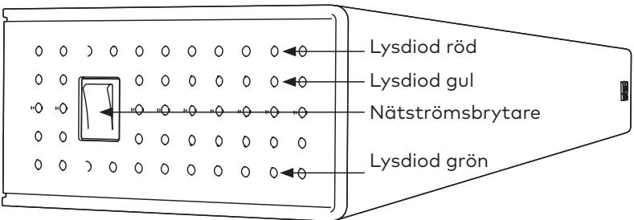

# **11 Felmeddelanden**

|       | Indikering Indikering lysdiod | Betydelse/orsak                                                                                                                                                                                          | Betydelse/orsak                                                                                                                                                                                                                                                                                                                                                                                                                                                                                                                                                                                                                                                          |
|-------|----------------------------------|----------------------------------------------------------------------------------------------------------------------------------------------------------------------------------------------------------|--------------------------------------------------------------------------------------------------------------------------------------------------------------------------------------------------------------------------------------------------------------------------------------------------------------------------------------------------------------------------------------------------------------------------------------------------------------------------------------------------------------------------------------------------------------------------------------------------------------------------------------------------------------------------|
| In 01 | ingen                            | blockering Dörren blockeras genom ett hinder och dörrens rörelse stoppades av drivanordningen.                                                                                                     | Dörrens rörelse bör testas i spänningslöst tillstånd och eventuellt befintliga trögheter måste åtgärdas. Konstant drift av en defekt dörr kan leda till skador på drivanordningen. En blockering utlöses ofta även genom personer. Detta kan bero på att sensorernas detektionsområde inte passar till motorns öppningshastighet och det därför inte går att undvika att personer kommer i kontakt med dörren vid genomgång. I detta fall ska sensorernas detektionsområde och/eller motorns öppningshastighet ökas. Testa att det fungerar genom att gå genom dörren.                                                                  |
| In 08 | ingen                            | Avstängning drivfunktion Kontakten 4/4a är öppnad. Motorn kopplar om till nöddrift och kan endast användas manuellt.                                                                               | En anordning för manövrering i nödsituationer, en nyckelbrytare eller ett annat säkerhetssystem kan anslutas till ingången. Antingen har systemet verkligen utlösts eller det föreligger ett fel. Utlösningen måste återställas. Drivanordningen startar driften automatiskt. Om detta inte är fallet måste kablarna och de orsakande systemen kontrolleras.                                                                                                                                                                                                                                                                                           |
| In 09 | ingen                            | Upgrade Card signalfel Det installerade Upgrade Card avlägsnades eller vid installation av 2 Upgrade Cards har det Upgrade Card som installerades först (container-modul) inte satts i igen. | Installerade Upgrade Cards måste sitta kvar i styrningen permanent och får inte avlägsnas. Om flera Upgrade Cards installeras fungerar det först använda Upgrade Card som container-modul och måste sättas in i styrningen sist (se kapitel Upgrade Cards). Om container-modulen är defekt måste en ny uppsättning funktionsmoduler användas.                                                                                                                                                                                                                                                                                                       |
| In 11 | Den röda lysdioden lyser   | Utlösning dörrhållare Dörrhållaren har utlösts.                                                                                                                                                       | Dörrhållaren kan utlösas automatiskt genom brandvarnaren eller manuellt genom handterminalen eller genom att dörrbladet kopplas ur. Enligt DIN 18263-4 måste återstarten utföras genom en medveten handling. Beroende på anläggningens konfiguration görs detta genom manuell öppning av dörren till inlärd öppningsvinkel, via PGS genom koppling i läge FRÅN eller återställning via knapparna och på den interna operatörspanelen. Därvid måste man se till att brandvarnaren inte har utlösts. Om en återställning inte lyckas kan brandvarnarens anslutning vara defekt och utrustningen måste kontrolleras av fackpersonal. |
| In 14 | ingen                            | 24V för externa komponenter tillhandahålls inte.                                                                                                                                                         | Den vanligaste orsaken är kortslutning av 24V-försörjningen.                                                                                                                                                                                                                                                                                                                                                                                                                                                                                                                                                                                                          |
| In 23 | ingen                            | larm vid låsning Dörren blockeras i positionen STÄNGD. Det är inte möjligt att öppna.                                                                                                              | Den vanligaste orsaken är en låst dörr. Felet kan undvikas om en nyckelbrytare installeras. Nyckelbrytaren registrerar låsets kopplingstillstånd och slår ifrån larmet i förekommande fall. Nyckelbrytarens användning rekommenderas då en permanent öppning mot den låsta dörren kan leda till skador på motorn eller dörren.                                                                                                                                                                                                                                                                                                                         |
| In 61 | ingen                            | Kommunikationsfel vid drift med 2-flyglig dörr Kommunikationen mellan de båda enheterna har avbrutits.                                                                                             | Kommunikationskabeln mellan de båda drivanordningarna måste kontrolleras. Efter en visuell kontroll testar du användningen av det korrekta gränssnittet på styrningen.                                                                                                                                                                                                                                                                                                                                                                                                                                                                                          |
| In 71 | ingen                            | Fel på det 2:a avstängningskriteriet. Testet av det 2:a avstängningskriteriet misslyckades.                                                                                                           | Efter att ett fel av det 2:a avstängningskriteriet fastställts, kommer testet att upprepas vid nästa stängningscykel. Om det inte finns något fel raderas informationen, annars fortsätter felet att visas.                                                                                                                                                                                                                                                                                                                                                                                                                                                     |
| In 72 | ingen                            | Koppling för strömmätning Det cykliskt genomförda testet av den interna kopplingen för strömmätning kunde inte utföras framgångsrikt.                                                           | Systemtoleranser och omgivningsvillkor påverkar strömmätningen. Därför kan den inte alltid slutföras framgångsrikt första gången. Information matas då ut. Detta kan exempelvis vara fallet om dörren används manuellt precis när mätning utförs. Testet upprepas automatiskt.                                                                                                                                                                                                                                                                                                                                                                            |

|                      | Indikering Indikering lysdiod | Betydelse/orsak                                                                                                                                                                                                                                                                                                                                     | Betydelse/orsak                                                                                                                                                                                                                                                                                                                                                                         |
|----------------------|----------------------------------|-----------------------------------------------------------------------------------------------------------------------------------------------------------------------------------------------------------------------------------------------------------------------------------------------------------------------------------------------------|-----------------------------------------------------------------------------------------------------------------------------------------------------------------------------------------------------------------------------------------------------------------------------------------------------------------------------------------------------------------------------------------|
| In 73                | ingen                            | Kontroll av bromskoppling Det cykliskt genomförda testet (en gång per dygn) av den interna bromskopplingen kunde inte slutföras framgångsrikt.                                                                                                                                                                                             | Systemtoleranser och omgivningsvillkor påverkar testet av bromskopplingen. Därför kan testet inte alltid slutföras framgångsrikt första gången. I så fall matas en information ut. Detta kan exempelvis vara fallet om dörren används manuellt precis när mätning utförs. Om testet utfaller negativt 10 gånger i rad, matas felmeddelandet E 73 ut.                  |
| In 91                | ingen                            | DCW-kommunikation Minst en anmäld DCW-enhet saknas                                                                                                                                                                                                                                                                                               | Anslut åter den motsvarande DCW-enheten. Om detta inte är möjligt måste en omstart av drivanordningen utföras. För detta ändamål trycks knapparna och på den interna operatörspanelen samtidigt i minst 3 sekunder.                                                                                                                                                   |
| E 02                 | 2 x Blinkar                   | Låsfel Drivanordningen försöker att öppna resp. stänga ett lås med återkoppling eller öppna resp. stänga ett DCW-lås. Därvid har ett fel uppstått.                                                                                                                                                                                         | Här kan man utgå ifrån att det finns en defekt på låset eller ett fel i kabeldragningen. Återkopplingen från låset måste kontrolleras resp. bytas ut.                                                                                                                                                                                                                             |
| E 03                 | 3 x Blinkar                   | DCW-programknapp saknas                                                                                                                                                                                                                                                                                                                             | Kontrollera och vid behov byta ut DCW programknappen.                                                                                                                                                                                                                                                                                                                                |
| E 04                 | 4 x Blinkar                   | Testfel säkerhetssensor Testet av de medföljande säkerhetssensorerna misslyckades. Före varje körning för öppning och stängning skickas en testsignal till motsvarande sensor. Drivanordningen förväntar sig ett svar inom en viss tidsperiod.                                                                                       | Först måste man kontrollera om parametern "Test säkerhetssensor" är konfigurerad enligt utrustningen. Därefter måste man kontrollera om testet också har aktiverats vid sensorerna och drivs på samma nivå. Testet är avstängt när sensorernas levereras.                                                                                                                   |
| E 12                 | 12 x Blinkar                  | EEPROM-fel Den interna minneskontrollen kunde inte avslutas positivt. Drivanordningen arbetar i stängningsläge.                                                                                                                                                                                                                            | Man kan försöka att uppnå en återinitialisering genom att ladda om giltig Firmware. Om detta misslyckas måste styrningen bytas ut.                                                                                                                                                                                                                                                |
| E 13                 | 13 x Blinkar                  | Detektion av överström Det tas mer ström från systemet än vad nätdelen kan leverera.                                                                                                                                                                                                                                                          | Drivningen tar upp för hög ström eller styrningens ändläge är defekt. I upprepade fall ska komponenterna motorns växelenhet och/eller styrningen bytas ut.                                                                                                                                                                                                                     |
| E 15                 | 15 x Blinkar                  | Inlärningskörning felaktig Inlärningskörningen kunde inte avslutas.                                                                                                                                                                                                                                                                              | Felet kan uppstå när inlärningskörningen avbrutits, t.ex. genom manipulering av dörren under processen. Inlärningskörningen måste startas om.                                                                                                                                                                                                                                     |
| E 25                 | 5 x Blinkar                   | SVP DCW PR modul Testet var negativt.                                                                                                                                                                                                                                                                                                            | Kontrollera dragningen av kablar och vid behov byt ut PR-modulen.                                                                                                                                                                                                                                                                                                                    |
| E 51 E 52 E 53 | 5 x Blinkar                   | Fel på inkrementalgivare Övervakningen av inkrementalgivare har hittat ett fel.                                                                                                                                                                                                                                                               | I händelse av fel måste först inkrementalgivarens och motorns stickanslutningar samt låsanordningens strömkrets kontrolleras med avseende på kortslutning. Om inget fel kan hittas måste motorns växelenhet bytas ut. Felet kan orsakas genom en defekt motor eller en kortslutning i låsanordningens strömkrets. Vid defekt motor måste motorns växelenhet bytas ut. |
| E 62                 | 6 x Blinkar                   | Den andra utrustningen har en inkompatibel Firmware-version för drift av 2-flyglig dörr.                                                                                                                                                                                                                                                         | Utrusta båda styrningarna med samma Firmware version.                                                                                                                                                                                                                                                                                                                                |
| E 63                 | 6 x Blinkar                   | Den andra utrustningen har en inkompatibel inställning av brandskydd.                                                                                                                                                                                                                                                                            | Vid utrustningar med 2-flyglig dörr måste Upgrade Card brandskydd installeras på båda styrningarna.                                                                                                                                                                                                                                                                               |
| E 71                 | 7 x Blinkar                   | Systemfel 1 (2. avstängningsväg) För att alltid kunna stänga av drivanordningen på ett säkert sätt används flera kopplingselement. Dessa kontrolleras cykliskt med avseende på funktion.                                                                                                                                                | Om testet konstant utfaller negativt måste styrningen bytas ut.                                                                                                                                                                                                                                                                                                                      |
| E 72                 | 7 x Blinkar                   | Systemfel 2 (koppling för strömmätning) Kopplingen för strömmätning tillhör säkerhetsanordningarna och testas cykliskt med avseende på funktion. Drivanordningen arbetar i nöddrift.                                                                                                                                                    | Om testet konstant utfaller negativt måste styrningen bytas ut.                                                                                                                                                                                                                                                                                                                      |
| E 73                 | 7 x Blinkar                   | Systemfel 3 (bromskoppling) Bromskopplingen är ett säkerhetselement i stängningsläge och testas var 24:e timme. Under testet stängs motorn av under pågående stängning och dörren körs fram till en fast inställd vinkel i nöddrift. Testet kan uppfattas som ett kort ryck vid dörrbladet och är inget skäl till reklamation. | Dörren stängs för snabbt i strömlöst tillstånd (under 3 sekunder). Kontrollera och vid behov sänk stängningshastigheten (se sidan 24, punkt 5.13). Om testet permanent utfaller negativt trots korrekt inställd stängningshastighet måste styrningen bytas ut.                                                                                                           |
| PF                   |                                  | Kortslutning av 24V matarspänning.                                                                                                                                                                                                                                                                                                                  | Korrigera kortslutning.                                                                                                                                                                                                                                                                                                                                                                 |

| Indikering Indikering | Betydelse/orsak lysdiod                                         | Betydelse/orsak                                             |
|-----------------------|--------------------------------------------------------------------|-------------------------------------------------------------|
| - 1                   | Energistyrning                                                     | Kördynamiken i riktning mot STÄNGT reduceras.               |
| - 2                   | Motorn är för varm (t.ex. vid en för hög omgivningstemperatur). | Kördynamiken i riktning mot ÖPPET och STÄNGT reduceras.  |
| - 3                   | Systemet reagerar automatiskt.                                     | Systemet stängs av i 3 minuter (läge för dörrstängning). |
| - 4                   |                                                                    | Tiden för öppethållning förlängs.                           |

**dormakaba Manual för montering och idrifttagning**

dormakaba Deutschland GmbH DORMA Platz 1 58256 Ennepetal Deutschland T: +49 2333 793-0 F: +49 2333 793-4950