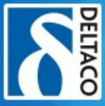
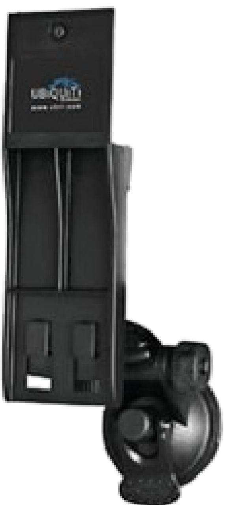
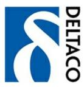
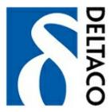

### **UBI-NS-WM**

Ubiquiti - Monteringssats - väggmontering, fönstermontering - för NanoStation2

#### **www.deltaco.se**

**SE** data@deltaco.se **FI** info@deltaco.fi **DK** info@deltaco.dk **NO** info@deltaco.no **EN** data@deltaco.se +46 (0) 8 555 76200 +358 (0) 20 712039 +45 3886 9171 +47 22 830906 +46 (0) 8 555 76200

# **Specifikationer**

| Designat för        | Ubiquiti NanoStation2           |
|---------------------|---------------------------------|
| Egenskaper          | Justerbar bredd, justerbar höjd |
| Monteringssats      | Inkluderat                      |
| Placering/montering | Väggmontering, fönstermontering |
| Produkttyp          | Monteringssats                  |

# **Logistikdata**

| Varumärke                   | Ubiquiti |
|-----------------------------|----------|
| Tillverkarens artikelnummer | NS-WM    |
| Intrastat                   | 83024900 |
| EAN-kod                     | N/A      |
| Antal per kolli             | N/A      |
| Vikt                        | 0.30 kg  |

#### **www.deltaco.se**

**SE** data@deltaco.se **FI** info@deltaco.fi **DK** info@deltaco.dk **NO** info@deltaco.no **EN** data@deltaco.se +46 (0) 8 555 76200 +358 (0) 20 712039 +45 3886 9171 +47 22 830906 +46 (0) 8 555 76200

