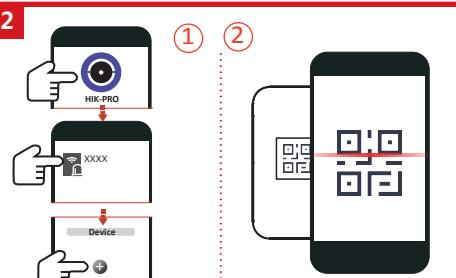
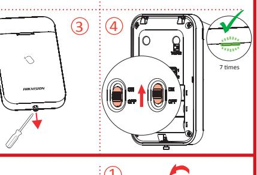
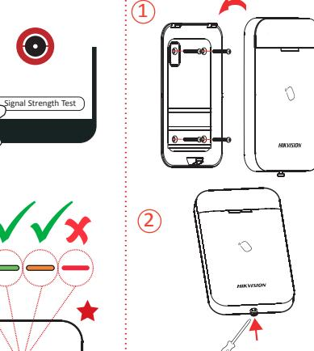
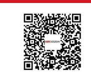
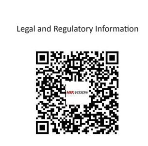

1. Indicator 2. Power Switch 3. Tamper Button 4. Serial Port

Scan the QR code for more information and operation help.

Indicator 1 status indicator(red, green, blue), and 4 area arming indicator (blue)

Power Supply 1.5V, 3 AA batteries, 2 years battery life span (10 times presenting each day)

124mm x 75mm x 21mm

176g (with battery), 106.5g(without battery)

Wireless Tag Reader DS-PT1-WE Quick Start Guide

Security Grade(SG) 2 Environmental Class(EC) II

Certified by Telefication

**1**

**3**

1 2

# User Manual

# Deutsch

**1**

3 4 AUFBAU

1. Statusanzeige 2. Ein-/Aus-Schalter

**2** 3. Sabotagetaste 4. Serieller Anschluss REGISTRIERUNG

**3** INSTALLATION

Prüfen Sie die Signalstärke.

Benutzerhandbuch

Scannen Sie den QR-Code für weitere Informationen und

## Bedienungshilfen.

| Technische Daten                 |                                                                                 |  |
|----------------------------------|---------------------------------------------------------------------------------|--|
| Frequenz                         | 868 MHz                                                                         |  |
| Methode                          | 2-Wege-Kommunikation                                                            |  |
| Entfernung                       | 1,2 km                                                                          |  |
| Sabotageschalter                 | 1, Rückseite manipulationssicher                                                |  |
| Statusanzeige                    | 1 Statusanzeige (rot, grün, blau) and 4 Bereichs-Scharfschaltanzeigen (blau) |  |
| Ein/Aus-Schalter/ Anlerntaste | 1                                                                               |  |
| Spannungsversorgung              | 1,5 V, 3 AA Batterien, Batterielebensdauer 2 Jahre (10 Lesungen pro Tag)     |  |
| Betriebsfeuchtigkeit             | 10 % bis 90 %                                                                   |  |
| Betriebstemperatur               | -10 °C bis +55 °C                                                               |  |
| Installation                     | Wandmontage                                                                     |  |
| Gewicht                          | 176 g (mit Batterien), 106,5 g (ohne Batterien)                                 |  |
| Abmessungen                      | 124 mm x 75 mm x 21 mm                                                          |  |

1

Installazione Montaggio a parete

Metodo Comunicazione bidirezionale

1. Indicatore 2. Interruttore di alimentazione

Per ulteriori informazioni e assistenza sull'utilizzo, scansionare il

Interruttore antimanomissione 1 pannello posteriore a prova di manomissione Indicatore 1 indicatore di stato (rosso, verde, blu) e

Alimentazione 3 batterie AA da 1,5 V, durata batterie 2 anni (10 presentazioni al giorno)

Da 10% a 90%

Da -10 °C a +55 °C

124 mm x 75 mm x 21 mm 176 g (con batteria), 106,5 g (senza batteria)

4 indicatori di inserimento area (blu)

3. Pulsante manomissione 4. Porta seriale

REGISTRAZIONE INSTALLAZIONE Controllo intensità del segnale. Manuale dell'utente

Frequenza 868 MHz

Distanza 1,2 km

# Español

**2 3**

**1** ASPECTO

1. Piloto 2. Interruptor de alimentación

3. Botón antimanipulación 4. Puerto serie

REGISTRO

INSTALACIÓN

Comprobar la intensidad de la señal.

## Manual de usuario

Escanee el código QR para obtener más información y ayuda sobre el funcionamiento.

## Especificación

| Frecuencia                                       | 868 MHz                                                                                      |
|--------------------------------------------------|----------------------------------------------------------------------------------------------|
| Método                                           | Comunicación bidireccional                                                                   |
| Distancia                                        | 1,2 km                                                                                       |
| Interruptor antimanipulación                     | 1, panel trasero antimanipulación                                                            |
| Piloto                                           | 1 piloto de estado (rojo, verde, azul) y 4 pilotos de armado de área (azul)               |
| Interruptor de alimentación/ botón de memoria | 1                                                                                            |
| Alimentación eléctrica                           | Pilas de 1,5 V, 3 AA, 2 años de vida útil de la batería (10 veces de presentación al día) |
| Humedad de funcionamiento                        | 10 % a 90 %                                                                                  |
| Temperatura de funcionamiento                    | De -10 °C a +55 °C                                                                           |
| Instalación                                      | Montaje en la pared                                                                          |
| Peso                                             | 176 g (con batería), 106,5 g (sin batería)                                                   |
| Dimensiones                                      | 124 mm x 75 mm x 21 mm                                                                       |

| Português                                                             |                                   |
|-----------------------------------------------------------------------|-----------------------------------|
| APRESENTAÇÃO 1                                                     |                                   |
| 1. Indicador 3. Botão de violação                                  | 2. Interruptor 4. Porta serial |
| REGISTRO 2 INSTALAÇÃO 3 Verifique a intensidade do sinal. |                                   |
| Manual do usuário                                                     |                                   |

Leia o código QR para mais informações e ajuda na operação.

| Especificações                  |                                                                                             |
|---------------------------------|---------------------------------------------------------------------------------------------|
| Frequência                      | 868 MHz                                                                                     |
| Método                          | Comunicação bidirecional                                                                    |
| Distância                       | 1,2 km                                                                                      |
| Chave de violação               | 1 painel traseiro à prova de violação                                                       |
| Indicador                       | 1 indicador de status (vermelho, verde e azul) e 4 indicadores de armação da área (azul) |
| Interruptor/botão "Aprender" | 1                                                                                           |
| Fonte de alimentação            | 3 baterias AA de 1,5 V com duração de 2 anos cada (10 usos por dia)                      |
| Umidade de operação             | 10% a 90%                                                                                   |
| Temperatura de operação         | -10 °C a +55 °C                                                                             |
| Instalação                      | Montagem na parede                                                                          |
| Peso                            | 176 g (com as baterias), 106,5 g (sem as baterias)                                          |
| Dimensões                       | 124 mm x 75 mm x 21 mm                                                                      |

# ASPECT

1. Indicateur 2. Interrupteur d'alimentation 3. Bouton antisabotage 4. Port série

**2** ENREGISTREMENT

INSTALLATION

Check signal strength. User Manual

Frequency 868 MHz Metod Two-way communication Distance 1.2 KM

Operation Humidity 10% to 90% Operation Temperature ﹣10℃ to +55℃ Installation Wall mounting

Tamper Switch 1, rear panel tamper-proof

Specification

Power Switch/ Learnt Button 1

Weight Dimension

**1**

Français

ENROLLMENT

English **1** APPEARANCE

**2 3**

**3** INSTALLATION

Vérifier la puissance du signal.

Manuel d'utilisation

Scannez le code QR pour obtenir plus d'informations ainsi qu'une aide concernant le fonctionnement de l'appareil.

## Spécification

| Fréquence                                             | 868 MHz                                                                                             |
|-------------------------------------------------------|-----------------------------------------------------------------------------------------------------|
| Mode                                                  | Communication bidirectionnelle                                                                      |
| Distance                                              | 1,2 km                                                                                              |
| Contact antisabotage                                  | 1 contact sur le panneau arrière                                                                    |
| Indicateur                                            | 1 voyant d'état (rouge, vert, bleu) et 4 voyants d'armement de zone (bleu)                       |
| Commutateur d'alimentation/ Bouton d'apprentissage | 1                                                                                                   |
| Alimentation électrique                               | 1,5 V, 3 piles AA, autonomie de fonctionnement de 2 ans (10 lectures de radioétiquette par jour) |
| Humidité de fonctionnement                            | 10 à 90 %                                                                                           |
| Température de fonctionnement                         | -10 à +55 °C                                                                                        |
| Installation                                          | Montage mural                                                                                       |
| Poids                                                 | 176 g (avec pile), 106,5 g (sans pile)                                                              |
| Dimensions                                            | 124 x 75 x 21 mm                                                                                    |

**1**

Italiano ASPETTO

codice QR.

Specifiche

Interruttore/Pulsante di apprendimento

Umidità operativa Temperatura operativa

Dimensioni Peso

**2 3**

## Nederlands

| VERSCHIJNINGSVORM 1        |                       |
|-------------------------------|-----------------------|
| 1. Pictogram                  | 2. Aan-/uitschakelaar |
| 3. Sabotageknop               | 4. Seriële poort      |
| INSCHRIJVING 2             |                       |
| INSTALLATIE 3              |                       |
| Controleer de signaalsterkte. |                       |
| Gebruiksaanwijzing            |                       |

Scan de QR-code voor meer informatie en assistentie bij de bediening.

| Specificatie                        |                                                                                    |
|-------------------------------------|------------------------------------------------------------------------------------|
| Frequentie                          | 868 MHz                                                                            |
| Methode                             | Bi-directionele communicatie                                                       |
| Afstand                             | 1,2 KM                                                                             |
| Sabotageschakelaar                  | 1, sabotagebestendig achterpaneel                                                  |
| Pictogram                           | 1 statusindicator (rood, groen, blauw) en 4 gebiedinschakelindicators (blauw)   |
| Aan-/uitschakelaar/ geleerd-knop | 1                                                                                  |
| Stroomvoorziening                   | 1,5 V, 3 AA-batterijen, 2 jaar batterijlevensduur (10 keer per dag presentatie) |
| Luchtvochtigheid tijdens bedrijf    | 10% tot 90%                                                                        |
| Bedrijfstemperatuur                 | -10°C tot +55°C                                                                    |
| Installatie                         | Wandmontage                                                                        |
| Gewicht                             | 176g (met batterij), 106,5g (zonder batterij)                                      |
| Afmetingen                          | 124mm x 75mm x 21mm                                                                |

## Čeština

| VZHLED 1                        |                 |
|------------------------------------|-----------------|
| 1. Indikátor                       | 2. Vypínač      |
| 3. Tlačítko neoprávněné manipulace | 4. Sériový port |
| REGISTRACE 2                    |                 |
| MONTÁŽ 3                        |                 |
| Zkontrolujte sílu signálu.         |                 |
| Návod k obsluze                    |                 |
|                                    |                 |

Další informace a nápovědu k ovládání získáte naskenováním kódu QR.

| Technické údaje                  |                                                                                       |
|----------------------------------|---------------------------------------------------------------------------------------|
| Frekvence                        | 868 MHz                                                                               |
| Metoda                           | Obousměrná komunikace                                                                 |
| Vzdálenost                       | 1,2 km                                                                                |
| Spínač neoprávněné manipulace | 1, ochrana před neoprávněnou manipulací zadního panelu                             |
| Indikátor                        | 1 indikátor stavu (červený, zelený, modrý) a 4 indikátory střežení oblasti (modré) |
| Vypínač / tlačítko učení         | 1                                                                                     |
| Napájení                         | 1,5 V, 3 baterie AA, životnost baterie 2 roky (přiložení 10krát za den)            |
| Provozní vlhkost                 | 10 % až 90 %                                                                          |
| Provozní teplota                 | −10 až +55 °C                                                                         |
| Montáž                           | Montáž na zeď                                                                         |
| Hmotnost                         | 176 g (s baterií), 106,5 g (bez baterie)                                              |
| Rozměry                          | 124 × 75 × 21 mm                                                                      |

## Dansk

| BESKRIVELSE 1         |                  |
|--------------------------|------------------|
| 1. Kontrollampe          | 2. Strømafbryder |
| 3. Manipulationskontakt  | 4. Seriel port   |
| REGISTRERING 2        |                  |
| INSTALLATION 3        |                  |
| Kontrollér signalstyrke. |                  |

Brugervejledning

Scan QR-koden for at få flere oplysninger og hjælp til betjening.

| Specifikation                    |                                                                                        |
|----------------------------------|----------------------------------------------------------------------------------------|
| Frekvens                         | 868 MHz                                                                                |
| Metode                           | Tovejskommunikation                                                                    |
| Rækkevidde                       | 1,2 km                                                                                 |
| Manipulationskontakt             | 1 på bagpanel, manipulationssikret                                                     |
| Kontrollampe                     | 1 statuskontrollampe (rød, grøn, blå) og 4 kontrollamper for områdetilkobling (blå) |
| Strømafbryder/ indlæringsknap | 1                                                                                      |
| Strømforsyning                   | 3 AA-batterier, 1,5 V, 2 års batterilevetid (10 visninger pr. dag)                  |
| Fugtighed ved drift              | 10-90 %                                                                                |
| Driftstemperatur                 | -10 °C til +55 °C                                                                      |
| Installation                     | Montering på væg                                                                       |
| Vægt                             | 176 g (med batteri), 106,5 g (uden batteri)                                            |
| Mål                              | 124 mm x 75 mm x 21 mm                                                                 |

## **1** Magyar

**2**

1. Jelző 2. Tápkapcsoló 3. Szabotázs gomb 4. Soros port

REGISZTRÁLÁS

**3** TELEPÍTÉS

KINÉZET

Ellenőrizze a jelerősséget. Felhasználói útmutató

Szkennelje be a QR-kódot további információkért és üzemeltetési segítségért.

| Specifikáció                 |                                                                                 |
|------------------------------|---------------------------------------------------------------------------------|
| Frekvencia                   | 868 MHz                                                                         |
| Mód                          | Kétirányú kommunikáció                                                          |
| Távolság                     | 1,2 km                                                                          |
| Szabotázskapcsoló            | 1, szabotázsbiztos hátsó panel                                                  |
| Jelző                        | 1 állapotjelző (piros, zöld, sárga) és 4 területélesítés-jelző (kék)         |
| Tápkapcsoló/ Tanítás gomb | 1                                                                               |
| Tápellátás                   | 1,5 V, 3 AA akkumulátor, 2 éves akkumulátor-élettartam (napi 10 prezentálás) |
| Üzemi páratartalom           | 10% – 90%                                                                       |
| Üzemi hőmérséklet            | -10 °C – +55 °C                                                                 |
| Telepítés                    | Falra szerelhető                                                                |
| Súly                         | 176 g (akkumulátorral), 106,5 g (akkumulátor nélkül)                            |
| Méretek                      | 124 mm x 75 mm x 21 mm                                                          |

## Polski

#### **1** ELEMENTY URZĄDZENIA

1. Wskaźnik 2. Przełącznik zasilania 3. Przycisk zabezpieczenia antysabotażowego 4. Port szeregowy

- **2** REJESTRACJA
**3** INSTALACJA

- Sprawdź siłę sygnału.
## Podręcznik użytkownika

Zeskanuj kod QR, aby uzyskać więcej informacji i opisów procedur.

| Specyfikacje                                       |                                                                                                   |  |
|----------------------------------------------------|---------------------------------------------------------------------------------------------------|--|
| Częstotliwość                                      | 868 MHz                                                                                           |  |
| Tryb                                               | Komunikacja dwukierunkowa                                                                         |  |
| Odległość                                          | 1,2 km                                                                                            |  |
| Przełącznik zabezpieczenia antysabotażowego     | Jeden, zabezpieczenie antysabotażowe panelu tylnego                                               |  |
| Wskaźnik                                           | wskaźnik stanu (czerwony, zielony, niebieski) i cztery wskaźniki uzbrojenia stref (niebieskie) |  |
| Przełącznik zasilania / przycisk zapamiętywania | 1                                                                                                 |  |
| Zasilanie                                          | Trzy baterie AA 1,5 V, zapewniające zasilanie przez dwa lata (10 odczytów każdego dnia)        |  |
| Wilgotność (użytkowanie)                           | Od 10% do 90%                                                                                     |  |
| Temperatura (użytkowanie)                          | Od –10°C do +55°C                                                                                 |  |
| Instalacja                                         | Montaż ścienny                                                                                    |  |
| Waga                                               | 176 g (z baterią), 106,5 g (bez baterii)                                                          |  |
| Wymiary                                            | 124 mm × 75 mm × 21 mm                                                                            |  |

## Română ASPECT 1. Indicator 2. Comutator alimentare 3. Buton alterare 4. Port serial ÎNSCRIERE INSTALARE Verificați intensitatea semnalului. Manual de utilizare

Scanați codul QR pentru mai multe informații și ajutor de operare.

**1**

**2 3**

| Specificații                               |                                                                                             |
|--------------------------------------------|---------------------------------------------------------------------------------------------|
| Frecvența                                  | 868 MHz                                                                                     |
| Metoda                                     | Comunicare bidirecțională                                                                   |
| Distanţă                                   | 1,2 KM                                                                                      |
| Comutator alterare                         | 1, panoul din spate anti-alterare                                                           |
| Indicator                                  | 1 indicator de stare (roșu, verde, albastru) și 4 indicator de armare a zonei (albastru) |
| Comutator de alimentare/ Buton învățare | 1                                                                                           |
| Alimentare electrică                       | 1,5 V, 3 baterii AA, durata de viață a bateriei de 2 ani (de 10 ori în fiecare zi)       |
| Umiditatea de funcționare                  | De la 10% la 90%                                                                            |
| Temperatura de funcționare                 | De la -10°C până la +55°C                                                                   |
| Instalare                                  | Montare pe perete                                                                           |
| Greutate                                   | 176 g (cu baterie), 106.5g (fără baterie)                                                   |
| Dimensiuni                                 | 124 mm x 75 mm x 21 mm                                                                      |

## **1** Slovenčina VZHĽAD 1. Indikátor 2. Vypínač 3. Tlačidlo ochrany pred cudzím zásahom 4. Sériový port

### **2** REGISTRÁCIA

**3** MONTÁŽ Skontrolujte intenzitu signálu.

## Návod na používanie

Ak chcete získať ďalšie informácie a pokyny na používanie, naskenujte QR kód.

## Špecifikácie

| Frekvencia                              | 868 MHz                                                                                  |
|-----------------------------------------|------------------------------------------------------------------------------------------|
| Metóda                                  | Obojsmerná komunikácia                                                                   |
| Vzdialenosť                             | 1,2 km                                                                                   |
| Prepínač ochrany pred cudzím zásahom | 1, ochrana zadného panela pred cudzím zásahom                                            |
| Indikátor                               | 1 indikátor stavu (červený, zelený, modrý) a 4 indikátory aktivovania oblasti (modrý) |
| Vypínač/tlačidlo učenia                 | 1                                                                                        |
| Zdroj napájania                         | 1,5 V, 3 batérie AA, výdrž batérií 2 roky (pri snímaní 10-krát za deň)                |
| Prevádzková vlhkosť                     | 10 % až 90 %                                                                             |
| Prevádzková teplota                     | -10 °C až +55 °C                                                                         |
| Montáž                                  | Montáž na stenu                                                                          |
| Hmotnosť                                | 176 g (s batériou), 106,5 g (bez batérie)                                                |
| Rozmery                                 | 124 mm x 75 mm x 21 mm                                                                   |

## **1** Türkçe GÖRÜNÜM

1. Gösterge 2. Güç Düğmesi 3. Kurcalama Düğmesi 4. Seri Port

**2** KAYIT

**3** KURULUM Sinyal gücünü kontrol edin.

Kullanım Kılavuzu

Daha fazla bilgi ve çalıştırma yardımı için QR kodunu tarayın.

| Özellikler                      |                                                                                       |
|---------------------------------|---------------------------------------------------------------------------------------|
| Frekans                         | 868 MHz                                                                               |
| Yöntem                          | İki yönlü iletişim                                                                    |
| Mesafe                          | 1,2 KM                                                                                |
| Kurcalama anahtarı              | 1, arka panel kurcalamaya dayanıklı                                                   |
| Gösterge                        | 1 durum göstergesi (kırmızı, yeşil, mavi) ve 4 alan devreye alma göstergesi (mavi) |
| Güç Düğmesi/ Öğrenilen Düğme | 1                                                                                     |
| Güç Kaynağı                     | 1,5 V, 3 AA pil, 2 yıl pil kullanım ömrü (her gün 10 kez)                          |
| Çalışma Nemi                    | %10 ila %90                                                                           |
| Çalışma Sıcaklığı               | -10 °C ila +55 °C                                                                     |
| Kurulum                         | Duvara montaj                                                                         |
| Ağırlık                         | 176 g (pille), 106,5 g (pilsiz)                                                       |
| Boyut                           | 124 mm x 75 mm x 21 mm                                                                |

### Hangzhou Hikvision Digital Technology CO.,Ltd. No.555 Qianmo Road, Binjiang District, Hangzhou 310052, China

De extra kracht moet gelijk zijn aan drie keer het gewicht van de apparatuur, maar niet minder dan 50N. De apparatuur en de bijbehorende bevestigingsmiddelen moeten tijdens de installatie stevig vast blijven zitten. De apparatuur, inclusief enige bijbehorende montageplaat, mag na de installatie niet worden beschadigd.

### INSTALLATIEWAARSCHUWING

- 
- 5. Stel de batterij niet bloot aan extreem lage luchtdruk, want dat kan een explosie of het lekken van brandbare vloeistof of gas tot gevolg hebben. 6. Verwijder gebruikte batterijen in overeenstemming met de instructies
	-

2. Onjuiste vervanging van de batterij door een onjuist type kan een beveiliging omzeilen (bijvoorbeeld in het geval van sommige typen lithiumbatterijen).

4. Laat de batterij niet in een omgeving met een extreem hoge temperatuur liggen, want dat kan een explosie of het lekken van brandbare vloeistof of gas tot gevolg hebben.

- 
- 
- 
- 
- 
- BATTERIJWAARSCHUWING 1. Er bestaat explosie- of brandgevaar wanneer de batterij door een onjuist type wordt vervangen.
- 3. Gebruik het product niet langer als het batterijvak niet goed sluit, en houd het buiten bereik van kinderen. 4. Als u vermoedt dat de batterijen zijn ingeslikt of in enig deel van het lichaam zijn gebracht, ga dan onmiddellijk op zoek naar medische hulp. 3. Gooi de batterij niet in vuur of een hete oven en plet of snij de batterij niet op mechanische wijze, want dat kan een explosie veroorzaken.
- 
- 
- 
- 2. Houd nieuwe en gebruikte batterijen buiten het bereik van kinderen.
- 
- 

vermeld onder de RE-richtlijn 2014/53/EU, de EMC-richtlijn 2014/30/EU, de RoHS-richtlijn 2011/65/EU.

- 
- 
- 
- 
- 1. Slik de batterij niet door, gevaar voor chemische brandwonden!
- 
- 
- BATTERIJWAARSCHUWING
- 
- informatie: www.recyclethis.info productdocumentatie voor specifieke informatie over de batterij. De batterij is gemarkeerd met dit symbool, dat letters kan bevatten die cadmium (Cd), lood (Pb) of kwik (Hg) aanduiden. Retourneer de batterij voor juist hergebruik aan uw lokale leverancier of lever deze in bij een aangewezen inzamelpunt. Zie: www.recyclethis.info voor meer informatie
- 
- 2006/66/EG (Batterijrichtlijn): Dit product bevat een batterij die binnen de Europese Unie niet mag worden weggegooid als ongesorteerd huishoudelijk afval. Zie de
- DIREITOS DE PROPRIEDADE INTELECTUAL OU DE PROTEÇÃO DE DADOS, OU QUAISQUER OUTROS DIREITOS DE PRIVACIDADE. O UTILIZADOR NÃO PODERÁ UTILIZAR ESTE PRODUTO PARA QUAISQUER UTILIZAÇÕES FINAIS PROIBIDAS, INCLUINDO O DESENVOLVIMENTO OU PRODUÇÃO DE ARMAS DE DESTRUIÇÃO MACIÇA, DESENVOLVIMENTO OU PRODUÇÃO DE QUÍMICOS OU ARMAS BIOLÓGICAS, BEPERKING DE RECHTEN VAN PUBLICITEIT, INTELLECTUEEL EIGENDOM, OF GEGEVENSBESCHERMING EN ANDERE PRIVACYRECHTEN. U MAG DIT PRODUCT NIET GEBRUIKEN VOOR ENIGE ONWETTIG EINDGEBRUIK, MET INBEGRIP VAN DE ONTWIKKELING OF DE PRODUCTIE VAN MASSAVERNIETIGINGSWAPENS, DE ONTWIKKELING OF DE PRODUCTIE VAN CHEMISCHE OF BIOLOGISCHE WAPENS, ALLE ACTIVITEITEN IN HET KADER VAN EVENTUELE NUCLEAIRE EXPLOSIEVEN OF ONVEILIGE NUCLEAIRE BRANDSTOFCYCLUS, OF TER ONDERSTEUNING VAN MENSENRECHTENSCHENDINGEN. IN HET GEVAL VAN ENIGE CONFLICTEN TUSSEN DEZE HANDLEIDING EN DE TOEPASSELIJKE WETGEVING, PREVALEERT DE LAATSTE.
- ANDERS, MET BETREKKING TOT HET PRODUCT, ZELFS ALS HIKVISION OP DE HOOGTE IS GEBRACHT VAN ZULKE SCHADE OF VERLIES. U ERKENT DAT DE AARD VAN INTERNET INHERENTE VEILIGHEIDSRISICO'S MET ZICH MEE BRENGT, EN HIKVISION GEEN ENKELE VERANTWOORDELIJKHEID NEEMT VOOR ABNORMALE WERKING, PRIVACYLEKKEN OF ANDERE SCHADE DIE VOORTVLOEIT UIT CYBERAANVAL, HACKERAANVAL, VIRUSINFECTIE, OF ANDERE INTERNETVEILIGHEIDSRISICO'S; HIKVISION BIEDT INDIEN NODIG ECHTER TIJDELIJK TECHNISCHE ONDERSTEUNING. U GAAT AKKOORD MET HET GEBRUIK VAN DIT PRODUCT IN OVEREENSTEMMING MET ALLE TOEPASBARE WETTEN EN UITSLUITEND U BENT VERANTWOORDELIJK VOOR DE GARANTIE DAT UW GEBRUIK OVEREENSTEMT MET DE TOEPASBARE WET. U BENT VOORAL VERANTWOORDELIJK DAT HET GEBRUIK VAN DIT PRODUCT GEEN INBREUK MAAKT OP DE RECHTEN VAN DERDEN, INCLUSIEF EN ZONDER

VOOR SPECIALE, BIJKOMENDE, INCIDENTELE OF INDIRECTE SCHADE, WAARONDER, ONDER ANDERE, SCHADE VAN VERLIES AAN ZAKELIJKE WINST, ZAKELIJKE ONDERBREKING OF VERLIES VAN GEGEVENS, CORRUPTIE OF SYSTEMEN, OF VERLIES VAN DOCUMENTATIE, ONGEACHT OF DIT VOORTVLOEIT UIT CONTRACTBREUK, BENADELING (INCLUSIEF NALATIGHEID), PRODUCTAANSPRAAKELIJKHEID OF

Dit product en, indien van toepassing, de meegeleverde accessoires, zijn gemarkeerd met "CE" en voldoen daardoor aan de toepasbare geharmoniseerde Europese normen zoals

2012/19/EU (WEEE-richtlijn): Producten die met dit symbool zijn gemarkeerd mogen binnen de Europese Unie niet worden weggegooid als ongesorteerd huishoudelijk afval. Retourneer dit product voor juist hergebruik aan uw lokale leverancier bij aanschaf van gelijkwaardige nieuwe apparatuur of lever het in bij een aangewezen inzamelpunt. Raadpleeg voor meer

eigenaren. Vrijwaringsclausule VOOR ZOVER MAXIMAAL TOEGESTAAN OP GROND VAN HET TOEPASSELIJK RECHT, WORDEN DEZE HANDLEIDING EN HET OMSCHREVEN PRODUCT, INCLUSIEF HARDWARE, SOFTWARE EN FIRMWARE, GELEVERD 'ZOALS ZE ZIJN', INCLUSIEF 'FOUTEN EN GEBREKEN'. HIKVISION GEEFT GEEN GARANTIES, EXPLICIET NOCH IMPLICIET, INCLUSIEF ZONDER BEPERKING OMTRENT VERKOOPBAARHEIED, TEVREDENHEID OMTRENT KWALITEIT OF GESCHIKTHEID VOOR EEN BEPAALD DOEL. HET GEBRUIK VAN HET PRODUCT DOOR U IS OP EIGEN RISICO. IN GEEN GEVAL IS HIKVISION VERANTWOORDELIJK

informatie in de handleiding is onderhevig aan verandering, zonder voorafgaande kennisgeving, als gevolg van firmware-updates of andere redenen. U kunt de nieuwste versie van deze handleiding vinden op de Hikvision-website (https://www.hikvision.com/). Gebruik deze handleiding onder begeleiding en ondersteuning van professionals die zijn opgeleid voor het ondersteunen van het product. en andere handelsmerken en logo's van Hikvision zijn eigendom van Hikvision in de verschillende jurisdicties. Andere handelsmerken en logo's zijn het eigendom van hun respectieve

©2020 Hangzhou Hikvision Digital Technology Co., Ltd. Alle rechten voorbehouden.

Over deze handleiding De handleiding bevat instructies voor het gebruik en beheer van het product. Foto's, grafieken, afbeeldingen en alle andere informatie hierna worden verstrekt voor beschrijving en uitleg. De

6. Deshágase de las pilas usadas conforme a las instrucciones.

©2020 Hangzhou Hikvision Digital Technology Co., Ltd. All rights reserved.

Please use this Manual with the guidance and assistance of professionals trained in supporting the Product.

IN THE EVENT OF ANY CONFLICTS BETWEEN THIS MANUAL AND THE APPLICABLE LAW, THE LATER PREVAILS.

3. If the battery compartment does not close securetyly, stop using the product and keep it away from children. 4. If you think batteries might have been swallowed or placed inside any part of the body, seek immediate medical attention.

listed under the RE Directive 2014/53/EU, the EMC Directive 2014/30/EU, the RoHS Directive 2011/65/EU.

2. Improper replacement of the battery with an incorrect type may defeat a safeguard (for example, in the case of some lithium battery types). 3. Do not dispose of the battery into fire or a hot oven, or mechanically crush or cut the battery, which may result in an explosion. 4. Do not leave the battery in an extremely high temperature surrounding environment, which may result in an explosion or the leakage of flammable liquid or gas. 5. Do not subject the battery to extremely low air pressure, which may result in an explosion or the leakage of flammable liquid or gas.

The additional force shall be equal to three times the weight of the equipment but not less than 50N. The equipment and its associated mounting means shall remain secure during the installation. After the installation, the equipment, including any associated mounting plate, shall not be damaged.

motivos. Visite el sitio web de Hikvision —https://www.hikvision.com/— para acceder a la última versión de este manual. Utilice este manual con la guía y asistencia de profesionales capacitados en el soporte del producto.

RISKS; HOWEVER, HIKVISION WILL PROVIDE TIMELY TECHNICAL SUPPORT IF REQUIRED.

1. Risk of fire or explosion if the battery is replaced by an incorrect type.

© 2020 Hangzhou Hikvision Digital Technology Co., Ltd. Todos los derechos reservados.

6. Dispose of used batteries according to the instructions

1. Do not ingest battery, Chemical Burn Hazard 2. Keep new and used batteries away from the children.

mencionados son propiedad de sus respectivos dueños.

sustancias peligrosas 2011/65/UE.

1. No ingiera la batería, peligro de quemadura química 2. Mantenga las baterías nuevas y usadas fuera del alcance de los niños.

ADVERTENCIA DE BATERÍA

PRECAUCIONES RELATIVAS A LA BATERÍA

PRECAUCIONES DE INSTALACIÓN

Manual at the Hikvision website (https://www.hikvision.com/).

ADVISED OF THE POSSIBILITY OF SUCH DAMAGES OR LOSS.

The Manual includes instructions for using and managing the Product. Pictures, charts, images and all other information hereinafter are for description and explanation only. The information contained in the Manual is subject to change, without notice, due to firmware updates or other reasons. Please find the latest version of this

©2020 Hangzhou Hikvision Digital Technology Co., Ltd. Tous droits réservés.

de ce manuel est mise à votre disposition sur le site Internet d'Hikvision (https://www.hikvision.com/).

EN CAS DE CONFLIT ENTRE CE MANUEL ET LES LOIS EN VIGUEUR, CES DERNIÈRES PRÉVALENT.

Pour de plus amples informations, consultez : www.recyclethis.info.

1. N'ingérez pas les piles. Vous encourez un risque de brûlure chimique. 2. Conservez les piles neuves et usagées hors de la portée des enfants.

1. Vous encourez un risque d'explosion lorsque vous remplacez la pile par un type incorrect.

informations, visitez le site Web : www.recyclethis.info.

©2020 Hangzhou Hikvision Digital Technology Co., Ltd. - Tutti i diritti riservati.

6. Éliminez les batteries usagées conformément aux instructions

Utilizzare il presente manuale sotto la supervisione e l'assistenza di personale qualificato nel supporto del prodotto.

IN CASO DI CONFLITTO TRA IL PRESENTE MANUALE E LA LEGGE VIGENTE, PREVARRÀ QUEST'ULTIMA.

1. Rischio di incendio o esplosione se la batteria è sostituita da una di tipo non idoneo.

©2020 Hangzhou Hikvision Digital Technology Co., Ltd. Všechna práva vyhrazena.

Tento návod používejte s vedením a pomocí odborníků vyškolených v oblasti podpory výrobku.

směrnice EMC 2014/30/EU a směrnice RoHS 2011/65/EU.

1. Nespolkněte baterii. Hrozí nebezpečí chemického popálení. 2. Nové a použité baterie uchovávejte mimo dosah dětí.

1. Při výměně baterie za nesprávný typ hrozí nebezpečí požáru nebo výbuchu.

BEZPEČNOSTNÍMI RIZIKY; SPOLEČNOST HIKVISION VŠAK V PŘÍPADĚ POTŘEBY POSKYTNE VČASNOU TECHNICKOU PODPORU.

odevzdáním svému dodavateli nebo na určeném sběrném místě. Další informace naleznete na adrese: www.recyclethis.info

Dodatečná síla by měla být rovna trojnásobku hmotnosti zařízení, avšak nejméně 50 N. Zařízení a související montážní prostředky musejí zůstat během

2. Vyměníte-li baterii za nesprávný typ, může dojít k poškození bezpečnostního prvku (například v případě některých typů lithiových baterií). 3. Baterii nevhazujte do ohně, nevkládejte do horké trouby, mechanicky ji nedrťte ani neřezejte. Mohlo by dojít k výbuchu. 4. Neponechávejte baterii v prostředí s extrémně vysokou teplotou, protože by mohlo dojít k výbuchu nebo úniku hořlavé kapaliny nebo plynu. 5. Nevystavujte baterii extrémně nízkému tlaku vzduchu, protože by mohlo dojít k výbuchu nebo úniku hořlavé kapaliny nebo plynu.

VÝBUŠNINAMI NEBO NEBEZPEČNÝM JADERNÝM PALIVOVÝM CYKLEM ČI K PODPOŘE PORUŠOVÁNÍ LIDSKÝCH PRÁV. V PŘÍPADĚ JAKÉHOKOLI ROZPORU MEZI TÍMTO NÁVODEM A PŘÍSLUŠNÝMI ZÁKONY PLATÍ DRUHÉ ZMÍNĚNÉ.

montáže zabezpečeny. Po montáži se zařízení včetně přidružené montážní desky nesmí poškodit.

3. Nezavře-li se bezpečně přihrádka na baterie, přestaňte výrobek používat a uchovávejte jej mimo dosah dětí. 4. Myslíte-li si, že mohlo dojít ke spolknutí baterií nebo jejich umístění uvnitř kterékoli části těla, okamžitě vyhledejte lékařskou pomoc.

RELAZIONE ALL'USO DEL PRODOTTO, ANCHE QUALORA HIKVISION SIA STATA INFORMATA DELLA POSSIBILITÀ DI TALI DANNI O PERDITE.

disponibile sul sito web di Hikvision (https://www.hikvision.com/).

TEMPESTIVO SUPPORTO TECNICO, SE NECESSARIO.

OPERAZIONI CONNESSE A VIOLAZIONI DEI DIRITTI UMANI.

sito: www.recyclethis.info

1. Non ingerire la batteria, rischio di ustioni chimiche 2. Tenere le batterie nuove e usate lontano dalla portata dei bambini. 3. Se il vano batteria non si chiude bene, interrompere l'uso del prodotto e tenerlo lontano dai bambini.

6. Smaltire le batterie usate nel rispetto delle istruzioni

www.recyclethis.info

AVVERTENZE PER LA BATTERIA PRECAUZIONI PER LA BATTERIA

Informace o tomto návodu

majetkem příslušných vlastníků. Prohlášení o vyloučení odpovědnosti

Hikvision (https://www.hikvision.com/).

PRECAUZIONI PER L'INSTALLAZIONE

www.recyclethis.info

VAROVÁNÍ TÝKAJÍCÍ SE BATERIÍ UPOZORNĚNÍ TÝKAJÍCÍ SE BATERIÍ

UPOZORNĚNÍ TÝKAJÍCÍ SE MONTÁŽE

6. Použité baterie zlikvidujte podle pokynů.

Informazioni sul presente Manuale

PRÉCAUTION D'INSTALLATION

MISE EN GARDE SUR LES BATTERIES PRÉCAUTION CONCERNANT LA BATTERIE

Esclusione di responsabilità

Veuillez utiliser ce mode d'emploi avec les conseils et l'assistance de professionnels spécialement formés dans la prise en charge de ce produit.

RISQUES DE SÉCURITÉ LIÉS À INTERNET ; TOUTEFOIS, HIKVISION FOURNIRA UNE ASSISTANCE TECHNIQUE DANS LES DÉLAIS, LE CAS ÉCHÉANT.

3. Si le compartiment des piles ne peut pas être complètement refermé, cessez d'utiliser le produit et conservez-le hors de la portée des enfants. 4. Si vous pensez que des piles ont été ingérées ou insérées à l'intérieur d'une partie du corps, consultez immédiatement un médecin.

Ce manuel fournit des instructions d'utilisation et de gestion du produit. Les images, les tableaux, les figures et toutes les autres informations ci-après ne sont donnés qu'à titre de description et d'explication. Les informations contenues dans ce manuel sont sujettes à modification sans préavis, en raison d'une mise à jour d'un micrologiciel ou pour d'autres raisons. La dernière version

et d'autres marques de commerce et logos de Hikvision appartiennent à Hikvision dans divers pays. Toutes les autres marques et tous les logos mentionnés appartiennent à leurs

VOUS ACCEPTEZ D'UTILISER CE PRODUIT CONFORMÉMENT À L'ENSEMBLE DES LOIS EN VIGUEUR. IL EST DE VOTRE RESPONSABILITÉ EXCLUSIVE DE VEILLER À CE QUE VOTRE UTILISATION SOIT CONFORME À LA LOI APPLICABLE. IL VOUS APPARTIENT SURTOUT D'UTILISER CE PRODUIT D'UNE MANIÈRE QUI NE PORTE PAS ATTEINTE AUX DROITS DE TIERS, Y COMPRIS, MAIS SANS S'Y LIMITER, LES DROITS DE PUBLICITÉ, LES DROITS DE PROPRIÉTÉ INTELLECTUELLE, OU LA PROTECTION DES DONNÉES ET D'AUTRES DROITS À LA VIE PRIVÉE. VOUS NE DEVEZ PAS UTILISER CE PRODUIT POUR TOUTE UTILISATION FINALE INTERDITE, NOTAMMENT LA MISE AU POINT OU LA PRODUCTION D'ARMES DE DESTRUCTION MASSIVE, LA MISE AU POINT OU LA FABRICATION D'ARMES CHIMIQUES OU BIOLOGIQUES, LES ACTIVITÉS DANS LE CONTEXTE LIÉ AUX EXPLOSIFS NUCLÉAIRES OU AU CYCLE DU COMBUSTIBLE NUCLÉAIRE DANGEREUX, OU SOUTENANT LES VIOLATIONS DES DROITS DE L'HOMME.

DANS LES LIMITES AUTORISÉES PAR LA LOI EN VIGUEUR, LE PRÉSENT MANUEL ET LE PRODUIT DÉCRIT, AINSI QUE SON MATÉRIEL, SES LOGICIELS ET SES MICROLOGICIELS, SONT FOURNIS « EN L'ÉTAT » ET « AVEC TOUS LES DÉFAUTS ET ERREURS ». HIKVISION NE FAIT AUCUNE GARANTIE, EXPLICITE OU IMPLICITE, Y COMPRIS, MAIS SANS S'Y LIMITER, DE QUALITÉ MARCHANDE, DE QUALITÉ SATISFAISANTE, OU D'ADÉQUATION À UN USAGE PARTICULIER. VOUS UTILISEZ LE PRODUIT À VOS PROPRES RISQUES. EN AUCUN CAS HIKVISION NE SERA TENU RESPONSABLE POUR TOUT DOMMAGE SPÉCIAL, CONSÉCUTIF, ACCESSOIRE OU INDIRECT, Y COMPRIS, ENTRE AUTRES, LES DOMMAGES RELATIFS À LA PERTE DE PROFITS D'ENTREPRISE, À L'INTERRUPTION D'ACTIVITÉS COMMERCIALES, OU LA PERTE DES DONNÉES, LA CORRUPTION DES SYSTÈMES, OU LA PERTE DES DOCUMENTS, S'ILS SONT BASÉS SUR UNE VIOLATION DE CONTRAT, UNE FAUTE (Y COMPRIS LA NÉGLIGENCE), LA RESPONSABILITÉ EN MATIÈRE DE PRODUITS, OU AUTRE, EN RAPPORT AVEC L'UTILISATION DU PRODUIT, MÊME SI HIKVISION A ÉTÉ INFORMÉ DE LA POSSIBILITÉ D'UN TEL DOMMAGE OU D'UNE TELLE PERTE. VOUS RECONNAISSEZ QUE LA NATURE D'INTERNET EST SOURCE DE RISQUES DE SÉCURITÉ INHÉRENTS, ET HIKVISION SE DÉGAGE DE TOUTE RESPONSABILITÉ EN CAS DE FONCTIONNEMENT ANORMAL, DIVULGATION D'INFORMATIONS CONFIDENTIELLES OU AUTRES DOMMAGES DÉCOULANT D'UNE CYBERATTAQUE, D'UN PIRATAGE INFORMATIQUE, D'UNE INFECTION PAR DES VIRUS, OU AUTRES

Ce produit et, le cas échéant, les accessoires qui l'accompagnent, sont estampillés « CE » et sont donc conformes aux normes européennes harmonisées en vigueur répertoriées sous la directive relative aux équipements radioélectriques 2014/53/UE, la directive sur les émissions électromagnétiques 2014/30/UE et la directive RoHS 2011/65/UE. 2012/19/UE (directive DEEE) : Dans l'Union européenne, les produits portant ce pictogramme ne doivent pas être déposés dans une décharge municipale où le tri des déchets n'est pas pratiqué. Pour un recyclage adéquat, remettez ce produit à votre revendeur lors de l'achat d'un nouvel équipement équivalent, ou déposez-le dans un lieu de collecte prévu à cet effet.

2006/66/CE (directive sur les batteries) : Ce produit renferme une batterie qui ne doit pas être déposée dans une décharge municipale où le tri des déchets n'est pas pratiqué, dans l'Union européenne. Pour plus de précisions sur la batterie, reportez-vous à sa documentation. La batterie porte le pictogramme ci-contre, qui peut inclure la mention Cd (cadmium), Pb (plomb) ou Hg (mercure). Pour la recycler correctement, renvoyez la batterie à votre revendeur ou déposez-la dans un point de collecte prévu à cet effet. Pour de plus amples

Il manuale contiene le istruzioni per l'uso e la gestione del prodotto. Le illustrazioni, i grafici e tutte le altre informazioni di seguito riportate servono unicamente a scopi illustrativi ed esplicativi. Le informazioni contenute nel manuale sono soggette a modifiche senza preavviso a seguito di aggiornamenti del firmware o per altri motivi. La versione più recente del presente manuale è

La force supplémentaire doit être égale à trois fois le poids de l'équipement et au minimum à 50 N. L'équipement et ses supports de montage doivent être maintenus fermement en place pendant l'installation. Après l'installation, l'équipement, y compris le plateau de montage associé le cas échéant, ne doit pas être endommagé.

2. Le remplacement de la pile par une pile du mauvais type peut conduire à l'annulation d'une protection (par exemple, dans le cas de certains types de batteries au lithium). 3. Ne jetez pas une batterie au feu ou dans un four chaud, ni ne broyez mécaniquement ou découpez une batterie, car cela pourrait engendrer une explosion. 4. Ne laissez pas une batterie dans un environnement ambiant extrêmement chaud, car vous encourez un risque d'explosion ou une fuite de liquide ou de gaz inflammable. 5. N'exposez pas une batterie à des pressions atmosphériques extrêmement basses, car vous encourez un risque d'explosion ou une fuite de liquide ou de gaz inflammable.

e gli altri marchi registrati e loghi di Hikvision sono di proprietà di Hikvision nelle varie giurisdizioni. Gli altri marchi registrati e loghi menzionati appartengono ai rispettivi titolari.

NELLA MISURA MASSIMA CONSENTITA DALLA LEGGE VIGENTE, QUESTO MANUALE E IL PRODOTTO DESCRITTO, CON IL SUO HARDWARE, SOFTWARE E FIRMWARE, SONO FORNITI "COSÌ COME SONO" E "CON TUTTI I DIFETTI E GLI ERRORI". HIKVISION NON RILASCIA ALCUNA GARANZIA, NÉ ESPRESSA NÉ IMPLICITA COME, SOLO A TITOLO DI ESEMPIO, GARANZIE DI COMMERCIABILITÀ, QUALITÀ SODDISFACENTE O IDONEITÀ PER UN USO SPECIFICO. L'UTENTE UTILIZZA IL PRODOTTO A PROPRIO RISCHIO. IN NESSUN CASO HIKVISION SARÀ RESPONSABILE VERSO L'UTENTE IN RELAZIONE A QUALSIASI DANNO STRAORDINARIO, CONSEQUENZIALE, ACCIDENTALE O INDIRETTO, COME, TRA GLI ALTRI, MANCATO PROFITTO, INTERRUZIONE DELL'ATTIVITÀ O PERDITA DI DATI, DANNEGGIAMENTO DI SISTEMI O PERDITA DI DOCUMENTAZIONE, DERIVANTI DA INADEMPIENZA CONTRATTUALE, ILLECITO (COMPRESA LA NEGLIGENZA), RESPONSABILITÀ PER DANNI AI PRODOTTI O ALTRIMENTI IN

L'UTENTE RICONOSCE CHE LA NATURA DI INTERNET PREVEDE RISCHI DI SICUREZZA INTRINSECHI E CHE HIKVISION DECLINA QUALSIASI RESPONSABILITÀ IN RELAZIONE A FUNZIONAMENTI ANOMALI, VIOLAZIONE DELLA RISERVATEZZA O ALTRI DANNI RISULTANTI DA ATTACCHI INFORMATICI, INFEZIONE DA VIRUS O ALTRI RISCHI LEGATI ALLA SICUREZZA SU INTERNET; TUTTAVIA, HIKVISION FORNIRÀ

Questo prodotto e gli eventuali accessori in dotazione sono contrassegnati con il marchio "CE" e sono quindi conformi alle norme europee armonizzate vigenti di cui alla Direttiva sulle energie rinnovabili RE 2014/53/UE, alla Direttiva sulla compatibilità elettromagnetica CEM 2014/30/UE e alla Direttiva sulla restrizione all'uso di sostanze pericolose RoHS 2011/65/UE. 2012/19/UE (Direttiva RAEE): I prodotti contrassegnati con il presente simbolo non possono essere smaltiti come rifiuti municipali indifferenziati nell'Unione Europea. Per lo smaltimento corretto, restituire il prodotto al rivenditore in occasione dell'acquisto di una nuova apparecchiatura o smaltirlo nei punti di raccolta autorizzati. Ulteriori informazioni sono disponibili sul

2006/66/CE (Direttiva sulle batterie): questo prodotto contiene una batteria e non è consentito smaltirlo con i rifiuti domestici indifferenziati, nell'Unione europea. Fare riferimento alla documentazione del prodotto per le informazioni specifiche sulla batteria. La batteria è contrassegnata con il presente simbolo, che potrebbe includere le sigle di cadmio (Cd), piombo (Pb) o mercurio (Hg). Per lo smaltimento corretto, restituire la batteria al rivenditore locale o smaltirla nei punti di raccolta autorizzati. Ulteriori informazioni sono disponibili sul sito:

V návodu jsou obsaženy pokyny k používání a obsluze výrobku. Obrázky, schémata, snímky a veškeré ostatní zde uvedené informace slouží pouze jako popis a vysvětlení. Informace obsažené v tomto návodu podléhají vzhledem k aktualizacím firmwaru nebo z jiných důvodů změnám bez upozornění. Nejnovější verzi tohoto návodu naleznete na webových stránkách společnosti

La forza applicata deve essere pari al triplo del peso dell'apparecchiatura e in ogni caso non inferiore a 50 N. L'apparecchiatura e gli utensili utilizzati per il montaggio devono rimanere al sicuro durante l'installazione. Dopo l'installazione, l'apparecchiatura e la piastra di montaggio non devono essere danneggiate.

2. La sostituzione della batteria con una di tipo non idoneo può impedire il corretto funzionamento dei sistemi di sicurezza (ad esempio con alcuni tipi di batterie al litio).

4. Se si pensa che una batteria possa essere stata ingerita o possa essere penetrata in una qualsiasi parte del corpo, rivolgersi immediatamente a un medico.

3. Non gettare le batterie nel fuoco o in un forno caldo ed evitare di schiacciarle o tagliarle, per prevenire il rischio di esplosioni. 4. Le batterie esposte a temperature ambientali eccessive possono esplodere o subire perdite di liquidi o gas infiammabili. 5. Le batterie sottoposte a una pressione atmosferica estremamente bassa possono esplodere o subire perdite di liquidi o gas infiammabili.

a ostatní ochranné známky a loga společnosti Hikvision jsou vlastnictvím společnosti Hikvision v různých jurisdikcích. Ostatní ochranné známky a loga uvedené v této příručce jsou

TATO PŘÍRUČKA A POPISOVANÉ PRODUKTY VČETNĚ PŘÍSLUŠNÉHO HARDWARU, SOFTWARU A FIRMWARU JSOU V MAXIMÁLNÍM ROZSAHU PŘÍPUSTNÉM PODLE ZÁKONA POSKYTOVÁNY, "JAK STOJÍ A LEŽÍ", A "SE VŠEMI VADAMI A CHYBAMI". SPOLEČNOST HIKVISION NEPOSKYTUJE ŽÁDNÉ VÝSLOVNÉ ANI PŘEDPOKLÁDANÉ ZÁRUKY ZARNUJÍCÍ MIMO JINÉ PRODEJNOST, USPOKOJIVOU KVALITU NEBO VHODNOST KE KONKRÉTNÍM ÚČELŮM. POUŽÍVÁNÍ TOHOTO PRODUKTU JE NA VAŠE VLASTNÍ RIZIKO. SPOLEČNOST HIKVISION V ŽÁDNÉM PŘÍPADĚ NENESE ODPOVĚDNOST ZA JAKÉKOLI ZVLÁŠTNÍ, NÁSLEDNÉ, NÁHODNÉ NEBO NEPŘÍMÉ ŠKODY ZAHRNUJÍCÍ MIMO JINÉ ŠKODY ZE ZTRÁTY OBCHODNÍHO ZISKU, PŘERUŠENÍ OBCHODNÍ ČINNOSTI NEBO ZTRÁTY DAT, POŠKOZENÍ SYSTÉMŮ NEBO ZTRÁTY DOKUMENTACE V SOUVISLOSTI S POUŽÍVÁNÍM TOHOTO VÝROBKU BEZ OHLEDU NA TO, ZDA TAKOVÉ ŠKODY VZNIKLY Z DŮVODU PORUŠENÍ SMLOUVY, OBČANSKOPRÁVNÍHO PŘEČINU (VČETNĚ NEDBALOSTI) ČI ODPOVĚDNOSTI ZA PRODUKT, A TO ANI V PŘÍPADĚ, ŽE SPOLEČNOST HIKVISION BYLA NA MOŽNOST TAKOVÝCHTO ŠKOD NEBO ZTRÁTY UPOZORNĚNA.

BERETE NA VĚDOMÍ, ŽE INTERNET SVOU PODSTATOU PŘEDSTAVUJE SKRYTÁ BEZPEČNOSTNÍ RIZIKA A SPOLEČNOST HIKVISION PROTO NEPŘEBÍRÁ ŽÁDNOU ODPOVĚDNOST ZA NESTANDARDNÍ PROVOZNÍ CHOVÁNÍ, ÚNIK SOUKROMÝCH ÚDAJŮ NEBO JINÉ ŠKODY VYPLÝVAJÍCÍ Z KYBERNETICKÉHO ČI HACKERSKÉHO ÚTOKU, NAPADENÍ VIREM NEBO ŠKODY ZPŮSOBENÉ JINÝMI INTERNETOVÝMI

Tento výrobek a dodávané příslušenství, je-li použito, jsou označeny značkou "CE" a proto splňují platné harmonizované evropské normy uvedené v rámci směrnice RE 2014/53/EU,

Směrnice 2012/19/ES (WEEE): Výrobky označené tímto symbolem nelze v Evropské unii likvidovat společně s netříděným domovním odpadem. Tento výrobek řádně recyklujte při zakoupení nového ekvivalentního výrobku vrácením svému místnímu dodavateli, nebo jej zlikvidujte odevzdáním v určených sběrných místech. Další informace naleznete na adrese:

Směrnice 2006/66/ES (týkající se baterií): Tento výrobek obsahuje baterii, kterou nelze v Evropské unii likvidovat společně s netříděným domovním odpadem. Konkrétní informace o baterii naleznete v dokumentaci výrobku. Baterie je označena tímto symbolem, který může obsahovat písmena značící kadmium (Cd), olovo (Pb) nebo měď (Hg). Baterii řádně zlikvidujte

SOUHLASÍTE S TÍM, ŽE TENTO PRODUKT BUDE POUŽÍVÁN V SOULADU SE VŠEMI PLATNÝMI ZÁKONY A VÝHRADNĚ ODPOVÍDÁTE ZA ZAJIŠTĚNÍ, ŽE VAŠE UŽÍVÁNÍ BUDE V SOULADU S PLATNOU LEGISLATIVOU. ODPOVÍDÁTE ZEJMÉNA ZA POUŽÍVÁNÍ PRODUKTU ZPŮSOBEM, KTERÝ NEPORUŠUJE PRÁVA TŘETÍCH STRAN, COŽ ZAHRNUJE MIMO JINÉ PRÁVO NA OCHRANU OSOBNOSTI, PRÁVO DUŠEVNÍHO VLASTNICTVÍ NEBO PRÁVO NA OCHRANU OSOBNÍCH ÚDAJŮ A DALŠÍ PRÁVA NA OCHRANU SOUKROMÍ. TENTO PRODUKT NESMÍTE POUŽÍVAT K JAKÝMKOLI NEDOVOLENÝM KONCOVÝM ÚČELŮM VČETNĚ VÝVOJE ČI VÝROBY ZBRANÍ HROMADNÉHO NIČENÍ, VÝVOJE NEBO VÝROBY CHEMICKÝCH ČI BIOLOGICKÝCH ZBRANÍ NEBO JAKÝCHKOLI ČINNOSTÍ SOUVISEJÍCÍCH S JADERNÝMI

L'UTENTE ACCETTA DI UTILIZZARE IL PRODOTTO IN CONFORMITÀ A TUTTE LE LEGGI VIGENTI E DI ESSERE IL SOLO RESPONSABILE DI TALE UTILIZZO CONFORME. IN PARTICOLARE, L'UTENTE È RESPONSABILE DEL FATTO CHE L'UTILIZZO DEL PRODOTTO NON VIOLI DIRITTI DI TERZI COME, SOLO A TITOLO DI ESEMPIO, DIRITTI DI PUBBLICITÀ, DIRITTI DI PROPRIETÀ INTELLETTUALE O DIRITTI RELATIVI ALLA PROTEZIONE DEI DATI E ALTRI DIRITTI RIGUARDANTI LA PRIVACY. L'UTENTE NON DEVE UTILIZZARE IL PRODOTTO PER SCOPI VIETATI, COMPRESI LO SVILUPPO O LA PRODUZIONE DI ARMI DI DISTRUZIONE DI MASSA, LO SVILUPPO O LA PRODUZIONE DI ARMI CHIMICHE O BIOLOGICHE, ATTIVITÀ COLLEGATE ALL'UTILIZZO DI ESPLOSIVI O COMBUSTIBILI NUCLEARI NON SICURI OPPURE IN

À propos de ce manuel

propriétaires respectifs. Clause d'exclusion de responsabilité

and other Hikvision's trademarks and logos are the properties of Hikvision in various jurisdictions. Other trademarks and logos mentioned are the

YOU ACKNOWLEDGE THAT THE NATURE OF INTERNET PROVIDES FOR INHERENT SECURITY RISKS, AND HIKVISION SHALL NOT TAKE ANY RESPONSIBILITIES FOR ABNORMAL OPERATION, PRIVACY LEAKAGE OR OTHER DAMAGES RESULTING FROM CYBER-ATTACK, HACKER ATTACK, VIRUS INSPECTION, OR OTHER INTERNET SECURITY

TO THE MAXIMUM EXTENT PERMITTED BY APPLICABLE LAW, THIS MANUAL AND THE PRODUCT DESCRIBED, WITH ITS HARDWARE, SOFTWARE AND FIRMWARE, ARE PROVIDED "AS IS" AND "WITH ALL FAULTS AND ERRORS". HIKVISION MAKES NO WARRANTIES, EXPRESS OR IMPLIED, INCLUDING WITHOUT LIMITATION, MERCHANTABILITY, SATISFACTORY QUALITY, OR FITNESS FOR A PARTICULAR PURPOSE. THE USE OF THE PRODUCT BY YOU IS AT YOUR OWN RISK. IN NO EVENT WILL HIKVISION BE LIABLE TO YOU FOR ANY SPECIAL, CONSEQUENTIAL, INCIDENTAL, OR INDIRECT DAMAGES, INCLUDING, AMONG OTHERS, DAMAGES FOR LOSS OF BUSINESS PROFITS, BUSINESS INTERRUPTION, OR LOSS OF DATA, CORRUPTION OF SYSTEMS, OR LOSS OF DOCUMENTATION, WHETHER BASED ON BREACH OF CONTRACT, TORT (INCLUDING NEGLIGENCE), PRODUCT LIABILITY, OR OTHERWISE, IN CONNECTION WITH THE USE OF THE PRODUCT, EVEN IF HIKVISION HAS BEEN

YOU AGREE TO USE THIS PRODUCT IN COMPLIANCE WITH ALL APPLICABLE LAWS, AND YOU ARE SOLELY RESPONSIBLE FOR ENSURING THAT YOUR USE CONFORMS TO THE APPLICABLE LAW. ESPECIALLY, YOU ARE RESPONSIBLE, FOR USING THIS PRODUCT IN A MANNER THAT DOES NOT INFRINGE ON THE RIGHTS OF THIRD PARTIES, INCLUDING WITHOUT LIMITATION, RIGHTS OF PUBLICITY, INTELLECTUAL PROPERTY RIGHTS, OR DATA PROTECTION AND OTHER PRIVACY RIGHTS. YOU SHALL NOT USE THIS PRODUCT FOR ANY PROHIBITED END-USES, INCLUDING THE DEVELOPMENT OR PRODUCTION OF WEAPONS OF MASS DESTRUCTION, THE DEVELOPMENT OR PRODUCTION OF CHEMICAL OR BIOLOGICAL WEAPONS, ANY ACTIVITIES IN THE CONTEXT RELATED TO ANY NUCLEAR EXPLOSIVE OR UNSAFE NUCLEAR FUEL-CYCLE, OR

Este manual incluye las instrucciones de utilización y gestión del producto. Las figuras, gráficos, imágenes y cualquier otra información que encontrará en lo sucesivo tienen únicamente fines descriptivos y aclaratorios. La información incluida en el manual está sujeta a cambios, sin aviso previo, debido a las actualizaciones de software u otros

y otras marcas comerciales y logotipos de Hikvision son propiedad de Hikvision en diferentes jurisdicciones. Las demás marcas comerciales y logotipos

Descargo de responsabilidad EN LA MEDIDA MÁXIMA PERMITIDA POR LAS LEYES APLICABLES, ESTE MANUAL Y EL PRODUCTO DESCRITO —INCLUIDOS SU HARDWARE, SOFTWARE Y FIRMWARE— SE SUMINISTRAN «TAL CUAL» Y «CON TODOS SU FALLOS Y ERRORES». HIKVISION NO OFRECE GARANTÍAS, EXPLÍCITAS O IMPLÍCITAS, INCLUIDAS, A MODO ENUNCIATIVO, COMERCIABILIDAD, CALIDAD SATISFACTORIA O IDONEIDAD PARA UN PROPÓSITO EN PARTICULAR. EL USO QUE HAGA DEL PRODUCTO CORRE BAJO SU ÚNICO RIESGO. EN NINGÚN CASO, HIKVISION PODRÁ CONSIDERARSE RESPONSABLE ANTE USTED DE NINGÚN DAÑO ESPECIAL, CONSECUENTE, INCIDENTAL O INDIRECTO, INCLUYENDO, ENTRE OTROS, DAÑOS POR PÉRDIDAS DE BENEFICIOS COMERCIALES, INTERRUPCIÓN DE LA ACTIVIDAD COMERCIAL, PÉRDIDA DE DATOS, CORRUPCIÓN DE LOS SISTEMAS O PÉRDIDA DE DOCUMENTACIÓN, YA SEA POR INCUMPLIMIENTO DEL CONTRATO, AGRAVIO (INCLUYENDO NEGLIGENCIA), RESPONSABILIDAD DEL PRODUCTO O EN RELACIÓN CON EL USO DEL PRODUCTO, INCLUSO CUANDO HIKVISION HAYA RECIBIDO UNA NOTIFICACIÓN DE LA POSIBILIDAD DE DICHOS DAÑOS O PÉRDIDAS. USTED RECONOCE QUE LA NATURALEZA DE INTERNET IMPLICA RIESGOS DE SEGURIDAD INHERENTES Y HIKVISION NO TENDRÁ NINGUNA RESPONSABILIDAD POR EL FUNCIONAMIENTO ANORMAL, FILTRACIONES DE PRIVACIDAD U OTROS DAÑOS RESULTANTES DE ATAQUES CIBERNÉTICOS, ATAQUES DE HACKERS, INFECCIONES DE VIRUS U OTROS RIESGOS DE SEGURIDAD DE INTERNET; SIN EMBARGO, HIKVISION PROPORCIONARÁ APOYO TÉCNICO OPORTUNO DE SER NECESARIO. USTED ACEPTA USAR ESTE PRODUCTO DE CONFORMIDAD CON TODAS LAS LEYES APLICABLES Y SOLO USTED ES EL ÚNICO RESPONSABLE DE ASEGURAR QUE EL USO

CUMPLA CON DICHAS LEYES. EN ESPECIAL, USTED ES RESPONSABLE DE USAR ESTE PRODUCTO DE FORMA QUE NO INFRINJA LOS DERECHOS DE TERCEROS, INCLUYENDO, DE MANERA ENUNCIATIVA MAS NO LIMITATIVA, DERECHOS DE PUBLICIDAD, DERECHOS DE PROPIEDAD INTELECTUAL, DERECHOS RELATIVOS A LA PROTECCIÓN DE DATOS Y OTROS DERECHOS RELATIVOS A LA PRIVACIDAD. NO UTILIZARÁ ESTE PRODUCTO PARA NINGÚN USO FINAL PROHIBIDO, INCLUYENDO EL DESARROLLO O LA PRODUCCIÓN DE ARMAS DE DESTRUCCIÓN MASIVA, EL DESARROLLO O PRODUCCIÓN DE ARMAS QUÍMICAS O BIOLÓGICAS, NINGUNA ACTIVIDAD EN EL CONTEXTO RELACIONADO CON ALGÚN EXPLOSIVO NUCLEAR O EL CICLO DE COMBUSTIBLE NUCLEAR INSEGURO O EN APOYO DE ABUSOS DE LOS DERECHOS HUMANOS. EN CASO DE HABER CONFLICTO ENTRE ESTE MANUAL Y LA LEGISLACIÓN VIGENTE, ESTA ÚLTIMA PREVALECERÁ. Este producto, y en su caso también los accesorios suministrados, tienen la marca "CE" y por tanto cumplen con las normas europeas armonizadas aplicables enumeradas en la Directiva de equipos de radio 2014/53/UE, la Directiva de compatibilidad electromagnética 2014/30/UE y la Directiva de restricción del uso de

equivalente o deshágase de él en el punto de recogida designado a tal efecto. Para ver más información, visite: www.recyclethis.info 2006/66/CE (directiva sobre baterías): Este producto lleva una batería que no puede ser desechada en el sistema municipal de basuras sin recogida selectiva dentro de la Unión Europea. Consulte la documentación del producto para ver la información específica de la batería. La batería lleva marcado este símbolo, que incluye unas letras indicando si contiene cadmio (Cd), plomo (Pb), o mercurio (Hg). Para un reciclaje adecuado, entregue la batería a su vendedor o llévela al

2. Una sustitución inadecuada de la batería por otra de tipo incorrecto podría inhabilitar alguna medida de protección (por ejemplo, en el caso de algunas baterías de litio). 3. No arroje la batería al fuego ni la meta en un horno caliente, ni intente aplastar o cortar mecánicamente la batería, ya que podría explotar. 4. No deje la batería en lugares con temperaturas extremadamente altas, ya que podría explotar o tener fugas de líquido electrolítico o gas inflamable. 5. No permita que la batería quede expuesta a una presión de aire extremadamente baja, ya que podría explotar o tener fugas de líquido electrolítico o gas inflamable.

punto de recogida de basuras designado a tal efecto. Para más información visite: www.recyclethis.info.

3. Si el compartimento de la batería no cierra debidamente, deje de usar el producto y manténgalo fuera del alcance de los niños. 4. Si sospecha que una batería ha sido tragada o introducida en alguna parte del cuerpo, busque atención médica de inmediato.

2012/19/UE (directiva RAEE, residuos de aparatos eléctricos y electromagnéticos): En la Unión Europea, los productos marcados con este símbolo no pueden ser desechados en el sistema de basura municipal sin recogida selectiva. Para un reciclaje adecuado, entregue este producto en el lugar de compra del equipo nuevo

This product and - if applicable - the supplied accessories too are marked with "CE" and comply therefore with the applicable harmonized European standards

2012/19/EU (WEEE directive): Products marked with this symbol cannot be disposed of as unsorted municipal waste in the European Union. For proper recycling, return this product to your local supplier upon the purchase of equivalent new equipment, or dispose of it at designated collection points. For more information

2006/66/EC (battery directive): This product contains a battery that cannot be disposed of as unsorted municipal waste in the European Union. See the product documentation for specific battery information. The battery is marked with this symbol, which may include lettering to indicate cadmium (Cd), lead (Pb), or mercury (Hg). For proper recycling, return the battery to your supplier or to a designated collection point. For more information see:www.recyclethis.info

About this Manual

Sobre este manual

INSTALLATION CAUTION

BATTERY CAUTION BATTERY WARNING

©2020 Hangzhou Hikvision Digital Technology Co., Ltd. Alle Rechte vorbehalten.

Установка Настенное крепление

Version dieser Bedienungsanleitung finden Sie auf der Hikvision-Website (https://www.hikvision.com/).

1

Датчик взлома 1, задняя панель защищена от взлома Индикатор 1 индикатор состояния (красный, зеленый, синий)

Электропитание 3 батареи типа AA, 1,5 В, 2 года службы

10–90%

от -10°C до +55°C

124 x 75 x 21 мм

1. Индикатор 2. Выключатель питания 3. Кнопка датчика взлома 4. Последовательный порт

Для получения дополнительной информации и ознакомления с руководством по эксплуатации отсканируйте QR-код.

Bitte verwenden Sie diese Bedienungsanleitung unter Anleitung und Unterstützung von Fachleuten, die für den Support des Produkts geschult sind.

(при 10 включениях каждый день)

176 г (с батареями), 106,5 г (без батарей)

IM FALL VON WIDERSPRÜCHEN ZWISCHEN DIESER BEDIENUNGSANLEITUNG UND GELTENDEM RECHT IST LETZTERES MASSGEBLICH.

der RE-Richtlinie 2014/53/EU, der EMV-Richtlinie 2014/30/EU und der RoHS-Richtlinie 2011/65/EU.

Die Bedienungsanleitung beinhaltet Anleitungen zur Verwendung und Verwaltung des Produkts. Bilder, Diagramme, Abbildungen und alle sonstigen Informationen dienen nur der Beschreibung und Erklärung. Die Änderung der in der Bedienungsanleitung enthaltenen Informationen ist aufgrund von Firmware-Aktualisierungen oder aus anderen Gründen vorbehalten. Die neueste

и индикатор постановки на охрану 4-х зон (синий)

und andere Marken und Logos von Hikvision sind das Eigentum von Hikvision in verschiedenen Ländern. Andere hier erwähnte Marken und Logos sind Eigentum ihrer jeweiligen Inhaber.

DIESE BEDIENUNGSANLEITUNG UND DAS BESCHRIEBENE PRODUKT MIT SEINER HARDWARE, SOFTWARE UND FIRMWARE WERDEN, SOWEIT GESETZLICH ZULÄSSIG, IN DER "VORLIEGENDEN FORM" UND MIT "ALLEN FEHLERN UND IRRTÜMERN" BEREITGESTELLT. HIKVISION ÜBERNIMMT KEINE AUSDRÜCKLICHEN ODER STILLSCHWEIGENDEN GARANTIEN, EINSCHLIESSLICH, ABER NICHT BESCHRÄNKT AUF DIE MARKTGÄNGIGKEIT, ZUFRIEDENSTELLENDE QUALITÄT ODER EIGNUNG FÜR EINEN BESTIMMTEN ZWECK. DIE NUTZUNG DES PRODUKTS DURCH SIE ERFOLGT AUF IHRE EIGENE GEFAHR. IN KEINEM FALL IST HIKVISION IHNEN GEGENÜBER HAFTBAR FÜR BESONDERE, ZUFÄLLIGE, DIREKTE ODER INDIREKTE SCHÄDEN, EINSCHLIESSLICH, JEDOCH NICHT DARAUF BESCHRÄNKT, VERLUST VON GESCHÄFTSGEWINNEN, GESCHÄFTSUNTERBRECHUNG, DATENVERLUST, SYSTEMBESCHÄDIGUNG, VERLUST VON DOKUMENTATIONEN, SEI ES AUFGRUND VON VERTRAGSBRUCH, UNERLAUBTER HANDLUNG (EINSCHLIESSLICH FAHRLÄSSIGKEIT), PRODUKTHAFTUNG ODER ANDERWEITIG, IN VERBINDUNG MIT DER VERWENDUNG DIESES PRODUKTS, SELBST WENN HIKVISION ÜBER DIE MÖGLICHKEIT DERARTIGER SCHÄDEN ODER

SIE ERKENNEN AN, DASS DIE NATUR DES INTERNETS DAMIT VERBUNDENE SICHERHEITSRISIKEN BEINHALTET. HIKVISION ÜBERNIMMT KEINE VERANTWORTUNG FÜR ANORMALEN BETRIEB, DATENVERLUST ODER ANDERE SCHÄDEN, DIE SICH AUS CYBERANGRIFFEN, HACKERANGRIFFEN, VIRUSINFEKTION ODER ANDEREN SICHERHEITSRISIKEN IM INTERNET ERGEBEN. HIKVISION WIRD JEDOCH BEI BEDARF ZEITNAH

Dieses Produkt und – sofern zutreffend – das mitgelieferte Zubehör sind mit "CE" gekennzeichnet und entsprechen daher den geltenden harmonisierten europäischen Normen gemäß

2012/19/EU (Elektroaltgeräte-Richtlinie): Produkte, die mit diesem Symbol gekennzeichnet sind, dürfen innerhalb der Europäischen Union nicht mit dem Hausmüll entsorgt werden. Für korrektes Recycling geben Sie dieses Produkt an Ihren örtlichen Fachhändler zurück oder entsorgen Sie es an einer der Sammelstellen. Weitere Informationen finden Sie unter:

2006/66/EC (Batterierichtlinie): Dieses Produkt enthält eine Batterie, die innerhalb der Europäischen Union nicht mit dem Hausmüll entsorgt werden darf. Siehe Produktdokumentation für spezifische Hinweise zu Batterien. Die Batterie ist mit diesem Symbol gekennzeichnet, das zusätzlich die Buchstaben Cd für Cadmium, Pb für Blei oder Hg für Quecksilber enthalten kann. Für korrektes Recycling geben Sie die Batterie an Ihren örtlichen Fachhändler zurück oder entsorgen Sie sie an einer der Sammelstellen. Weitere Informationen finden Sie unter:

SIE STIMMEN ZU, DIESES PRODUKT IN ÜBEREINSTIMMUNG MIT ALLEN GELTENDEN GESETZEN ZU VERWENDEN, UND SIE SIND ALLEIN DAFÜR VERANTWORTLICH, DASS IHRE VERWENDUNG GEGEN KEINE GELTENDEN GESETZE VERSTÖßT. INSBESONDERE SIND SIE DAFÜR VERANTWORTLICH, DIESES PRODUKT SO ZU VERWENDEN, DASS DIE RECHTE DRITTER NICHT VERLETZT WERDEN, EINSCHLIESSLICH, ABER NICHT BESCHRÄNKT AUF VERÖFFENTLICHUNGSRECHTE, DIE RECHTE AN GEISTIGEM EIGENTUM ODER DEN DATENSCHUTZ UND ANDERE PERSÖNLICHKEITSRECHTE. SIE DÜRFEN DIESES PRODUKT NICHT FÜR VERBOTENE ENDANWENDUNGEN VERWENDEN, EINSCHLIESSLICH DER ENTWICKLUNG ODER HERSTELLUNG VON MASSENVERNICHTUNGSWAFFEN, DER ENTWICKLUNG ODER HERSTELLUNG CHEMISCHER ODER BIOLOGISCHER WAFFEN, JEGLICHER AKTIVITÄTEN IM ZUSAMMENHANG MIT EINEM NUKLEAREN SPRENGKÖRPER ODER UNSICHEREN NUKLEAREN BRENNSTOFFKREISLAUF BZW. ZUR UNTERSTÜTZUNG VON

O Manual inclui instruções para utilizar e gerir o produto. As fotografias, os gráficos, as imagens e todas as outras informações doravante apresentadas destinam-se apenas a fins de descritivos e informativos. As informações que constam do Manual estão sujeitas a alteração, sem aviso prévio, devido a atualizações de firmware ou a outros motivos. Pode encontrar a versão mais recente

Die zusätzliche Belastung muss dem dreifachen Gewicht des Geräts entsprechen, jedoch mindestens 50 N. Das Gerät und die zugehörigen Befestigungsmittel müssen während der

4. Bewahren Sie Batterien nicht in einer Umgebung mit extrem hoher Temperatur auf. Das kann zu einer Explosion oder zum Auslaufen von entflammbarer Flüssigkeit oder Gas führen. 5. Setzen Sie Batterien keinem extrem niedrigen Luftdruck aus. Das kann zu einer Explosion oder zum Auslaufen von entflammbarer Flüssigkeit oder Gas führen.

Installation stets gesichert sein. Nach der Installation darf das Gerät, einschließlich der zugehörigen Montageplatte, nicht beschädigt werden.

2. Unsachgemäßer Austausch der Batterien durch einen falschen Typ kann eine Schutzvorrichtung umgehen (z. B. bei einigen Lithium-Batterietypen). 3. Batterien nicht durch Verbrennen, in einem heißen Ofen oder Zerkleinern oder Zerschneiden entsorgen. Das kann zu einer Explosion führen.

3. Wenn sich das Batteriefach nicht richtig schließt, stellen Sie den Gebrauch des Produkts ein und halten Sie es von Kindern fern. 4. Suchen Sie umgehend ärztliche Hilfe auf, wenn Sie vermuten, dass Batterien verschluckt oder in Körperöffnungen eingeführt wurden.

e outros logótipos e marcas comerciais da Hikvision são propriedade da Hikvision em vários territórios. Outras marcas comerciais e logótipos mencionados são propriedade dos respetivos

NA MEDIDA MÁXIMA PERMITIDA PELA LEI APLICÁVEL, ESTE MANUAL E O PRODUTO DESCRITO, COM O SEU HARDWARE, SOFTWARE E FIRMWARE, SÃO FORNECIDOS "TAL COMO ESTÃO" E "COM TODAS AS SUAS FALHAS E ERROS". A HIKVISION EXCLUI, DE FORMA EXPLÍCITA OU IMPLÍCITA, GARANTIAS DE, INCLUINDO E SEM LIMITAÇÃO, COMERCIABILIDADE, QUALIDADE DO SERVIÇO OU ADEQUAÇÃO A UMA FINALIDADE ESPECÍFICA. A SUA UTILIZAÇÃO DESTE PRODUTO É FEITA POR SUA CONTA E RISCO. EM NENHUMA CIRCUNSTÂNCIA, A HIKVISION SERÁ RESPONSÁVEL POR SI EM RELAÇÃO A QUAISQUER DANOS ESPECIAIS, CONSEQUENCIAIS, INCIDENTAIS OU INDIRETOS, INCLUINDO, ENTRE OUTROS, DANOS PELA PERDA DE LUCROS COMERCIAIS, INTERRUPÇÃO DA ATIVIDADE, PERDA DE DADOS, CORRUPÇÃO DE SISTEMAS OU PERDA DE DOCUMENTAÇÃO SEJA COM BASE NUMA VIOLAÇÃO DO CONTRATO, ATOS ILÍCITOS (INCLUÍNDO NIGLIGÊNCIA), RESPONSABILIDADE PELO PRODUTO OU, DE OUTRO MODO, RELACIONADA COM A

O UTILIZADOR RECONHECE QUE A NATUREZA DA INTERNET OFERECE RISCOS DE SEGURANÇA INERENTES E QUE A HIKVISION NÃO SERÁ RESPONSABILIZADA POR UM FUNCIONAMENTO ANORMAL, PERDA DE PRIVACIDADE OU OUTROS DANOS RESULTANTES DE ATAQUES INFORMÁTICOS, ATAQUES DE PIRATARIA, INFEÇÃO POR VÍRUS OU OUTROS RISCOS ASSOCIADOS À SEGURANÇA DA INTERNET. NO ENTANTO, A

Este produto e, se aplicável, os acessórios fornecidos, apresentam a marcação "CE" e, por isso, cumprem as normas europeias harmonizadas aplicáveis listadas na Diretiva 2014/53/UE relativa aos equipamentos de rádio, na Diretiva 2014/30/UE sobre compatibilidade eletromagnética (CEM) e na Diretiva 2011/65/UE relativa à restrição do uso de determinadas substâncias perigosas em

2012/19/UE (Diretiva REEE): Os produtos com este símbolo não podem ser eliminados como resíduos urbanos indiferenciados na União Europeia. Para uma reciclagem adequada, devolva este produto ao seu fornecedor local quando adquirir um novo equipamento equivalente ou elimine-o através dos pontos de recolha adequados. Para mais informações, consulte: www.recyclethis.info. 2006/66/CE (diretiva relativa a baterias): Este produto contém uma bateria que não pode ser eliminada como resíduo urbano indiferenciado na União Europeia. Consulte a documentação do produto para obter informações específicas acerca da bateria. A bateria está marcada com este símbolo, que poderá incluir inscrições para indicar a presença de cádmio (Cd), chumbo (Pb), ou mercúrio (Hg). Para reciclar o produto de forma adequada, devolva a bateria ao seu fornecedor ou coloque-a num ponto de recolha apropriado. Para mais informações, consulte: www.recyclethis.info.

O UTILIZADOR ACEITA UTILIZAR ESTE PRODUTO EM CONFORMIDADE COM TODAS AS LEIS APLICÁVEIS E SER O ÚNICO RESPONSÁVEL POR GARANTIR QUE A SUA UTILIZAÇÃO É CONFORME À LEI APLICÁVEL. PARTICULARMENTE, O UTILIZADOR É O RESPONSÁVEL PELA UTILIZAÇÃO DESTE PRODUTO DE MODO QUE NÃO INFRINJA OS DIREITOS DE TERCEIROS, INCLUINDO, ENTRE OUTROS, OS DIREITOS DE PUBLICIDADE,

QUAISQUER ATIVIDADES DESENVOLVIDAS NO ÂMBITO DE EXPLOSIVOS NUCLEARES OU CICLOS DE COMBUSTÍVEL NUCLEAR INSEGURO OU PARA APOIAR ABUSOS AOS DIREITOS HUMANOS.

A força adicional deve ser igual a três vezes o peso do equipamento, mas não inferior a 50 N. O equipamento e seus recursos de montagem associados devem permanecer seguros durante a instalação. Após a instalação, o equipamento, incluindo qualquer placa de montagem associada, não pode estar danificado.

2. A substituição de uma bateria por outra de tipo incorreto pode anular uma proteção ou garantia (p. ex., no caso de alguns tipos de bateria de lítio). 3. Não descarte as baterias em fogo ou forno quente nem as submeta a esmagamento ou corte mecânico, pois isso pode resultar em explosão. 4. Não deixe as baterias em um ambiente de temperatura extremamente alta, pois isso pode resultar em explosão ou vazamento de líquido ou gás inflamável. 5. Não exponha as baterias a uma pressão do ar extremamente baixa, pois isso pode resultar em explosão ou vazamento de líquido ou gás inflamável.

Hinweise zu dieser Bedienungsanleitung

Влажность в рабочем режиме Рабочая температура

Выключатель питания/ кнопка обучения

Haftungsausschluss

Вес Размеры

**1**

Русский

ВНЕШНИЙ ВИД

РЕГИСТРАЦИЯ УСТАНОВКА Проверка уровня сигнала. Руководство пользователя

Частота 868 МГц Метод Двусторонняя связь Дальность действия 1,2 км

Технические данные

**2 3**

VERLUSTE INFORMIERT WAR.

TECHNISCHEN SUPPORT LEISTEN.

MENSCHENRECHTSVERLETZUNGEN.

Acerca deste Manual

AVISO DE BATERIA CUIDADOS COM A BATERIA

CUIDADOS NA INSTALAÇÃO

proprietários. Aviso legal

www.recyclethis.info

www.recyclethis.info.

SICHERHEITSHINWEISE ZUR INSTALLATION

WARNHINWEISE ZU BATTERIEN SICHERHEITSHINWEISE ZU BATTERIEN

©2020 Hangzhou Hikvision Digital Technology Co., Ltd. Todos os direitos reservados.

1. Verschlucken Sie niemals eine Batterie, Verätzungen wären die Folge 2. Halten Sie neue und gebrauchte Batterien von Kindern fern.

6. Entsorgen Sie verbrauchte Batterien entsprechend den Anweisungen.

Utilize este Manual com a orientação e assistência de profissionais qualificados para fornecer suporte ao Produto.

1. Bei Austausch der Batterien durch einen falschen Typ besteht Feuer- oder Explosionsgefahr.

UTILIZAÇÃO DO PRODUTO, AINDA QUE A HIKVISION TENHA SIDO AVISADA SOBRE A POSSIBILIDADE DE TAIS DANOS OU PERDAS.

NA EVENTUALIDADE DA OCORRÊNCIA DE ALGUM CONFLITO ENTRE ESTE MANUAL E A LEGISLAÇÃO APLICÁVEL, ESTA ÚLTIMA PREVALECE.

3. Se o compartimento das baterias não fechar com segurança, pare de usar o produto e o mantenha afastado de crianças. 4. Se você acha que uma bateria pode ter sido engolida ou inserida em alguma parte do corpo, procure por atendimento médico imediatamente.

deste Manual no website da Hikvision (https://www.hikvision.com/).

HIKVISION PRESTARÁ APOIO TÉCNICO ATEMPADO, SE SOLICITA.

equipamentos elétricos e eletrónicos (EEE).

1. Não engula uma bateria, pois isso pode causar queimadura química interna. 2. Mantenha as baterias novas e usadas longe de crianças.

6. Descarte as baterias usadas de acordo com as instruções.

1. Risco de incêndio ou explosão se uma bateria for substituída por outra de tipo incorreto.

properties of their respective owners. Disclaimer

IN SUPPORT OF HUMAN RIGHTS ABUSES.

see: www.recyclethis.info

1. Peligro de fuego o explosión si se reemplaza la batería por un tipo incorrecto.

La fuerza adicional debe ser equivalente a tres veces el peso del equipo, pero no inferior a 50 N. El equipo y el soporte asociado deben permanecer seguros durante la instalación. Tras la instalación, no se debe dañar el equipo ni tampoco las placas de montaje asociadas.

### ©2020 Hangzhou Hikvision Digital Technology Co., Ltd. Minden jog fenntartva.

A kézikönyvről A jelen kézikönyv a termék használatával és kezelésével kapcsolatos utasításokat tartalmaz. A benne található képek, grafikonok, ábrák és valamennyi egyéb információ kizárólag leírás és magyarázat célját szolgálja. A jelen kézikönyvben foglalt információk bejelentés nélkül változhatnak firmware-frissítések, vagy egyéb okok miatt. A kézikönyv aktuális változata a Hikvision

weboldalán (https://www.hikvision.com/) található. Kérjük, hogy a kézikönyvet a termék támogatásában megfelelő képzettséggel rendelkező szakemberek útmutatásával és segítségével együtt használja.

 valamint a Hikvision egyéb védjegyei és logói a Hikvision tulajdonát képezik különböző joghatóságokban. Az említett egyéb védjegyek és logók a megfelelő tulajdonosok tulajdonát képezik. Felelősségkizárás EZT A KÉZIKÖNYVET, VALAMINT A BENNE SZEREPLŐ TERMÉKET ANNAK HARDVER-, SZOFTVER-ÖSSZETEVŐIVEL ÉS FIRMWARE-ÉVEL EGYÜTT "EREDETI FORMÁBAN" BIZTOSÍTJUK, "BELEÉRTVE AZOK ÖSSZES ESETLEGES HIBÁJÁT". A HIKVISION NEM VÁLLAL SEM KIFEJEZETT, SEM TÖRVÉNY ÁLTAL VÉLELMEZETT JÓTÁLLÁST, TÖBBEK KÖZÖTT – DE NEM KORLÁTOZVA – A TERMÉK ÉRTÉKESÍTHETŐSÉGÉRE, MEGFELELŐ MINŐSÉGÉRE, VALAMINT ADOTT CÉLRA VALÓ ALKALMASSÁGÁRA. A TERMÉKET KIZÁRÓLAG SAJÁT FELELŐSSÉGÉRE HASZNÁLHATJA. A HIKVISION SEMMILYEN ESETBEN SEM VÁLLAL FELELŐSSÉGET ÖN FELÉ SEMMILYEN KÜLÖNLEGES, KÖVETKEZMÉNYES, JÁRULÉKOS VAGY KÖZVETETT KÁRÉRT, BELEÉRTVE TÖBBEK KÖZÖTT A TERMÉK HASZNÁLATÁVAL ÖSSZEFÜGGÉSBEN AZ ÜZLETI HASZON ELVESZTÉSÉBŐL, AZ ÜZLETMENET MEGSZAKADÁSÁBÓL, VALAMINT AZ ADATOK VAGY DOKUMENTUMOK ELVESZTÉSÉBŐL EREDŐ KÁROKAT, TÖRTÉNJEN EZ SZERZŐDÉSSZEGÉS VAGY KÁROKOZÁS (BELEÉRTVE A GONDATLANSÁGOT) EREDMÉNYEKÉNT, MÉG AKKOR SEM, HA A HIKVISION VÁLLALATOT TÁJÉKOZTATTÁK AZ ILYEN KÁROK BEKÖVETKEZÉSÉNEK LEHETŐSÉGÉRŐL. ÖN TUDOMÁSUL VESZI, HOGY AZ INTERNET TERMÉSZETÉBŐL FAKADÓAN REJT KOCKÁZATOKAT, ÉS A HIKVISION SEMMILYEN FELELŐSSÉGET NEM VÁLLAL A RENDELLENES MŰKÖDÉSÉRT, A SZEMÉLYES ADATOK KISZIVÁRGÁSÁÉRT VAGY MÁS OLYAN KÁROKÉRT, AMELYEKET KIBERTÁMADÁSOK, HACKERTÁMADÁSOK, VÍRUSFERTŐZÉSEK VAGY MÁS INTERNETES BIZTONSÁGI VESZÉLYEK OKOZTAK; A HIKVISION AZONBAN KÉRÉSRE IDŐBEN MŰSZAKI TÁMOGATÁST NYÚJT. ÖN ELFOGADJA, HOGY EZT A TERMÉKET KIZÁRÓLAG A VONATKOZÓ TÖRVÉNYI ELŐÍRÁSOK BETARTÁSÁVAL HASZNÁLJA, ÉS HOGY A VONATKOZÓ TÖRVÉNYEKNEK MEGFELELŐ HASZNÁLAT KIZÁRÓLAG AZ

ÖN FELELŐSSÉGE. KÜLÖNÖSKÉPPEN AZ ÖN FELELŐSSÉGE, HOGY A TERMÉK HASZNÁLATA SORÁN NE SÉRTSE HARMADIK FÉL JOGAIT, BELEÉRTVE, DE NEM KORLÁTOZVA A NYILVÁNOSSÁGRA, SZELLEMI TULAJDONRA, ADATOK VÉDELMÉRE ÉS EGYÉB SZEMÉLYES ADATOKRA VONATKOZÓ JOGOKAT. A TERMÉKET NEM HASZNÁLHATJA TILTOTT CÉLRA, BELEÉRTVE A TÖMEGPUSZTÍTÓ FEGYVEREK FEJLESZTÉSÉT VAGY GYÁRTÁSÁT, A VEGYI VAGY BIOLÓGIAI FEGYVEREK FEJLESZTÉSÉT VAGY GYÁRTÁSÁT, VALAMINT BÁRMILYEN, ROBBANÁSVESZÉLYES VAGY NEM BIZTONSÁGOS NUKLEÁRIS HASADÓANYAG-CIKLUSSAL KAPCSOLATOS TEVÉKENYSÉGET, ILLETVE EMBERI JOGI VISSZAÉLÉSEKET TÁMOGATÓ MÓDON TÖRTÉNŐ FELHASZNÁLÁST. HA A JELEN KÉZIKÖNYV ÉS A HATÁLYOS TÖRVÉNY KÖZÖTT ELLENTMONDÁS TAPASZTALHATÓ, AKKOR AZ UTÓBBI A MÉRVADÓ.

#### Ez a termék és tartozékai (amennyiben vannak) "CE" jelöléssel vannak ellátva, ezáltal megfelelnek a következő irányelvekben foglalt harmonizált európai szabványoknak: 2014/53/EU

- (RE-irányelv), 2014/30/EU (EMC-irányelv), 2011/65/EU (RoHS-irányelv). 2012/19/EU (WEEE-irányelv): Az ezzel a jelzéssel ellátott termékeket nem lehet szelektálatlan kommunális hulladékként elhelyezni az Európai Unióban. A megfelelő újrahasznosítás
- érdekében vigye vissza ezt a terméket helyi beszállítójához, amikor új, egyenértékű berendezést vásárol, vagy adja le a kijelölt gyűjtőhelyeken. További információért keresse fel az alábbi honlapot: www.recyclethis.info 2006/66/EC (akkumulátorokról szóló irányelv): Ez a termék olyan akkumulátort tartalmaz, amelyet nem lehet szelektálatlan kommunális hulladékként elhelyezni az Európai Unióban. A
- termékdokumentációban további információkat talál az akkumulátorról. Az akkumulátor ezzel a jelzéssel van ellátva. A jelzésen megtalálhatók lehetnek a kadmiumot (Cd), ólmot (Pb) vagy higanyt (Hg) jelző betűjelek. A megfelelő újrahasznosítás érdekében vigye vissza ezt a terméket a beszállítójához, vagy vigye egy kijelölt gyűjtőhelyre. További információért keresse fel az alábbi honlapot: www.recyclethis.info

### AKKUMULÁTOR-FIGYELMEZTETÉS

1. Ne nyelje le az akkumulátort, mert az vegyi égési sérülést okozhat

- 2. Az új és használt akkumulátorok gyermekektől elzárva tartandók.
- 3. Ha az akkumulátorrekesz nem záródik megfelelően, ne használja a terméket, és gyermekektől tartsa elzárva. 4. Az akkumulátort lenyelésének vagy más testnyílásba helyezésének gyanúja esetén azonnal orvosi ellátást kell kérni.

### AKKUMULÁTOR-FIGYELMEZTETÉS

- 1. Ha az akkumulátort nem megfelelő típusúra cseréli, az robbanást okozhat. 2. Az akkumulátor nem megfelelő típussal történő helyettesítése hatástalanná tehet egy biztonsági berendezést (például bizonyos típusú lítiumion-akkumulátorok esetében). 3. Tilos az akkumulátort tűzbe vagy forró sütőbe tenni, illetve az akkumulátort összezúzni vagy felvágni, mert ez robbanást okozhat. 4. Tilos az akkumulátort rendkívül magas környezeti hőmérsékletnek kitenni, mert ez robbanást, illetve gyúlékony folyadék vagy gáz szivárgását idézheti elő. 5. Tilos az akkumulátort rendkívül alacsony légnyomásnak kitenni, mert ez robbanást, illetve gyúlékony folyadék vagy gáz szivárgását okozhatja. 6. Az elhasznált akkumulátorok hulladékkezelésekor kövesse az utasításokat
TELEPÍTÉSI FIGYELMEZTETÉS

A tartóerőtöbblet legyen egyenlő a berendezés súlyának háromszorosával, de legalább 50 N legyen. Telepítés során a berendezésnek és a szerelőanyagoknak biztonságosnak kell lenniük. A telepítés befejeztével a berendezés és a rögzítőlemez nem lehet sérült.

### © 2020 г. Hangzhou Hikvision Digital Technology Co., Ltd. Все права защищены.

О данном руководстве Настоящее руководство содержит инструкции по использованию устройства и управлению им. Изображения, графики и все другие сведения предназначены только для ознакомления. Настоящий документ может быть изменен без уведомления. Это связано с обновлением прошивки и другими причинами. Вы можете найти последнюю версию этого руководства на сайте

компании Hikvision (https://www.hikvision.com/). Пожалуйста, используйте это руководство при поддержке специалистов, имеющих опыт обслуживания данного устройства. и другие торговые марки и логотипы компании Hikvision являются интеллектуальной собственностью Hikvision в различных юрисдикциях. Другие торговые марки и логотипы,

упоминаемые в настоящем руководстве, являются собственностью соответствующих владельцев. Ограничение ответственности

В СТЕПЕНИ, МАКСИМАЛЬНО ДОПУСТИМОЙ ДЕЙСТВУЮЩИМ ЗАКОНОДАТЕЛЬСТВОМ, ОПИСЫВАЕМОЕ ЗДЕСЬ ИЗДЕЛИЕ, А ТАКЖЕ ПРИЛАГАЕМОЕ ПРОГРАММНОЕ И АППАРАТНОЕ ОБЕСПЕЧЕНИЕ ПРЕДОСТАВЛЯЮТСЯ «КАК ЕСТЬ», ТО ЕСТЬ С ВОЗМОЖНЫМИ ОШИБКАМИ И НЕТОЧНОСТЯМИ. КОМПАНИЯ HIKVISION НЕ ПРЕДОСТАВЛЯЕТ ЯВНЫХ ИЛИ ПОДРАЗУМЕВАЕМЫХ ГАРАНТИЙ В ОТНОШЕНИИ, КРОМЕ ПРОЧЕГО, ТОВАРНОГО СОСТОЯНИЯ, КАЧЕСТВА И СООТВЕТСТВИЯ УКАЗАННЫМ ЦЕЛЯМ. ОТВЕТСТВЕННОСТЬ ЗА ИСПОЛЬЗОВАНИЕ ПРОДУКТА НЕСЕТ ПОЛЬЗОВАТЕЛЬ. КОМПАНИЯ HIKVISION НЕ НЕСЕТ ОТВЕТСТВЕННОСТИ ПЕРЕД ПОТРЕБИТЕЛЕМ ЗА КАКОЙ-ЛИБО ПРЯМОЙ, ПОСЛЕДУЮЩИЙ, СЛУЧАЙНЫЙ ИЛИ КОСВЕННЫЙ УЩЕРБ, ВКЛЮЧАЯ УБЫТКИ ИЗ-ЗА ПОТЕРИ ПРИБЫЛИ, ПЕРЕРЫВА В ДЕЯТЕЛЬНОСТИ, ПОВРЕЖДЕНИЯ СИСТЕМ, ПОТЕРИ ДАННЫХ ИЛИ ДОКУМЕНТАЦИИ ПО ПРИЧИНАМ НАРУШЕНИЯ УСЛОВИЙ КОНТРАКТА, ПРАВОНАРУШЕНИЯ (ВКЛЮЧАЯ НЕБРЕЖНОСТЬ), ПРЕТЕНЗИЙ НА КАЧЕСТВО ПРОДУКТА, А ТАКЖЕ ПО ДРУГИМ ПРИЧИНАМ, СВЯЗАННЫМ С ИСПОЛЬЗОВАНИЕМ ДАННОГО ПРОДУКТА, ДАЖЕ ЕСЛИ КОМПАНИИ HIKVISION БЫЛО ИЗВЕСТНО О ВОЗМОЖНОСТИ ТАКОГО УЩЕРБА.

ВЫ СОГЛАШАЕТЕСЬ, ЧТО ИНТЕРНЕТ МОЖЕТ СОЗДАВАТЬ УГРОЗЫ БЕЗОПАСНОСТИ, В СВЯЗИ С ЧЕМ КОМПАНИЯ HIKVISION НЕ НЕСЕТ ОТВЕТСТВЕННОСТИ ЗА СБОИ В РАБОТЕ ОБОРУДОВАНИЯ, УТЕЧКУ ИНФОРМАЦИИ И ДРУГОЙ УЩЕРБ, ВЫЗВАННЫЙ КИБЕРАТАКАМИ, ХАКЕРАМИ, ВИРУСАМИ ИЛИ СЕТЕВЫМИ АТАКАМИ; ОДНАКО КОМПАНИЯ HIKVISION ОБЕСПЕЧИВАЕТ СВОЕВРЕМЕННУЮ ТЕХНИЧЕСКУЮ ПОДДЕРЖКУ, ЕСЛИ ЭТО НЕОБХОДИМО. ВЫ ОБЯЗУЕТЕСЬ ИСПОЛЬЗОВАТЬ ЭТОТ ПРОДУКТ В СООТВЕТСТВИИ СО ВСЕМИ ПРИМЕНИМЫМИ ЗАКОНАМИ И НЕСЕТЕ ПОЛНУЮ ОТВЕТСТВЕННОСТЬЮ ЗА СООТВЕТСТВИЕ ВАШЕГО ИСПОЛЬЗОВАНИЯ

ПРИМЕНИМОМУ ЗАКОНОДАТЕЛЬСТВУ. В ЧАСТНОСТИ, ВЫ ОТВЕТСТВЕННЫ ЗА ИСПОЛЬЗОВАНИЕ ЭТОГО ПРОДУКТА БЕЗ НАРУШЕНИЯ ПРАВ ТРЕТЬИХ СТОРОН, ВКЛЮЧАЯ, КРОМЕ ПРОЧЕГО, ПРАВА НА ПУБЛИЧНОЕ ИСПОЛЬЗОВАНИЕ, ПРАВА НА ИНТЕЛЛЕКТУАЛЬНУЮ СОБСТВЕННОСТЬ ИЛИ ЗАЩИТУ ДАННЫХ, А ТАКЖЕ ДРУГИЕ ПРАВА В ОТНОШЕНИИ ЛИЧНОЙ ИНФОРМАЦИИ. ВЫ НЕ ДОЛЖНЫ ИСПОЛЬЗОВАТЬ ЭТОТ ПРОДУКТ ДЛЯ ЗАПРЕЩЕННОЙ ДЕЯТЕЛЬНОСТИ, ВКЛЮЧАЯ РАЗРАБОТКУ И ПРОИЗВОДСТВО ОРУЖИЯ МАССОВОГО УНИЧТОЖЕНИЯ, ХИМИЧЕСКОГО ИЛИ БИОЛОГИЧЕСКОГО ОРУЖИЯ, ЛЮБЫЕ ДЕЙСТВИЯ, СВЯЗАННЫЕ С ЯДЕРНЫМИ ВЗРЫВАМИ ИЛИ НЕБЕЗОПАСНОЙ ПЕРЕРАБОТКОЙ ЯДЕРНОГО ТОПЛИВА, А ТАКЖЕ ПОДДЕРЖКУ НАРУШЕНИЯ ПРАВ ЧЕЛОВЕКА. В СЛУЧАЕ РАЗНОЧТЕНИЙ МЕЖДУ НАСТОЯЩИМ РУКОВОДСТВОМ И ДЕЙСТВУЮЩИМ ЗАКОНОДАТЕЛЬСТВОМ, ПОСЛЕДНЕЕ ИМЕЕТ ПРИОРИТЕТ.

#### Этот продукт и (если применимо) поставляемые аксессуары имеют маркировку "CE" и соответствуют применимым согласованным стандартам, перечисленным в Директиве по радиооборудованию 2014/53/EU RE, Директиве по электромагнитной совместимости 2014/30/EU EMC и Директиве по ограничению использования опасных веществ 2011/65/EU RoHS.

- ДИРЕКТИВА WEEE 2012/19/EU (по утилизации отходов электрического и электронного оборудования): продукты, отмеченные этим символом, запрещено утилизировать в Европейском союзе в качестве несортированных муниципальных отходов. Для надлежащей переработки возвратите этот продукт местному поставщику после покупки эквивалентного нового оборудования или утилизируйте его в предназначенных для этого пунктах сбора отходов. Для получения дополнительной информации посетите веб-сайт www.recyclethis.info
- Директива 2006/66/EC по обращению с батареями: этот продукт содержит батарею, которую запрещено утилизировать в Европейском союзе в качестве несортированных муниципальных отходов. Для получения точной информации о батарее см. документацию к продукту. Маркировка батареи может включать символы, которые определяют ее химический состав: кадмий (CD), свинец (Pb) или ртуть (Hg). Для надлежащей утилизации отправьте батарею местному поставщику или утилизируйте ее в специальных пунктах приема отходов. Для получения дополнительной информации посетите веб-сайт www.recyclethis.info

#### VÝSTRAHA TÝKAJÚCA SA BATÉRIE

- 1. Zabráňte prehltnutiu batérie, hrozí nebezpečenstvo chemických popálenín.
- 2. Nové a použité batérie uchovajte mimo dosahu detí. 3. Ak sa priečinok batérie nedá bezpečne zavrieť, prestaňte produkt používať a uchovajte ho mimo dosahu detí.
- 4. Ak si myslíte, že mohlo dôjsť k prehltnutiu batérií alebo ich vloženiu do akejkoľvek časti tela, okamžite vyhľadajte lekársku pomoc.
- UPOZORNENIE TÝKAJÚCA SA BATÉRIE 1. Riziko výbuchu alebo požiaru v prípade výmeny batérie za nesprávny typ.
- 2. Pri nevhodnej výmene batérie za nesprávny typ sa môže deaktivovať bezpečnostný prvok (napríklad pri niektorých typoch lítiových batérií). 3. Batériu nevkladajte do ohňa alebo horúcej rúry ani ju mechanicky nedrvte ani nerežte, pretože by to mohlo spôsobiť výbuch. 4. Batériu nenechávajte v prostredí s mimoriadne vysokou teplotou, čo môže viesť k výbuchu alebo úniku horľavých kvapalín alebo plynov. 5. Batériu nevystavujte mimoriadne nízkemu tlaku vzduchu, čo môže viesť k výbuchu alebo úniku horľavých kvapalín alebo plynov.

#### VÝSTRAHA PRI INŠTALÁCII 6. Použité batérie zlikvidujte podľa príslušných pokynov.

- Dodatočná sila pôsobiaca na zariadenie má dosahovať trojnásobok hmotnosti zariadenia, no nesmie byť menšia ako 50 N. Zariadenie a príslušné montážne prvky musia byť namontované pevne. Po montáži nesmie dôjsť k poškodeniu zariadenia ani príslušnej montážnej dosky.

UD20050B-A

### © 2020 Hangzhou Hikvision Digital Technology Co., Ltd. Wszelkie prawa zastrzeżone.

Opis podręcznika Podręcznik zawiera instrukcje dotyczące korzystania z produktu i obchodzenia się z nim. Zdjęcia, rysunki, wykresy i pozostałe informacje zamieszczono w podręczniku wyłącznie dla celów informacyjnych i opisowych. Informacje zamieszczone w podręczniku mogą ulec zmianie bez powiadomienia w związku z aktualizacjami oprogramowania układowego lub w innych okolicznościach. Najnowsza wersja tego podręcznika jest dostępna w witrynie internetowej firmy Hikvision (https://www.hikvision.com/).

Oprócz tego podręcznika należy korzystać z porad i pomocy specjalistów z działu pomocy technicznej związanej z produktem.

 oraz inne znaki towarowe i logo Hikvision są własnością firmy Hikvision w różnych jurysdykcjach. Inne znaki towarowe i logo użyte w podręczniku należą do odpowiednich właścicieli. Zastrzeżenia prawne W PEŁNYM ZAKRESIE DOZWOLONYM PRZEZ OBOWIĄZUJĄCE PRAWO TEN PODRĘCZNIK, OPISANY PRODUKT I ZWIĄZANE Z NIM WYPOSAŻENIE ORAZ OPROGRAMOWANIE APLIKACYJNE I UKŁADOWE SĄ UDOSTĘPNIANE BEZ GWARANCJI. FIRMA HIKVISION NIE UDZIELA ŻADNYCH WYRAŹNYCH ANI DOROZUMIANYCH GWARANCJI, TAKICH JAK GWARANCJE DOTYCZĄCE PRZYDATNOŚCI HANDLOWEJ, JAKOŚCI LUB PRZYDATNOŚCI DO OKREŚLONEGO CELU. UŻYTKOWNIK KORZYSTA Z PRODUKTU NA WŁASNE RYZYKO. NIEZALEŻNIE OD OKOLICZNOŚCI FIRMA HIKVISION NIE PONOSI ODPOWIEDZIALNOŚCI ZA STRATY SPECJALNE, WYNIKOWE, PRZYPADKOWE LUB POŚREDNIE, TAKIE JAK STRATA OCZEKIWANYCH ZYSKÓW Z DZIAŁALNOŚCI BIZNESOWEJ, PRZERWY W DZIAŁALNOŚCI BIZNESOWEJ, USZKODZENIE SYSTEMÓW ALBO STRATA DANYCH LUB DOKUMENTACJI, WYNIKAJĄCE Z NARUSZENIA UMOWY, PRZEWINIENIA (ŁĄCZNIE Z ZANIEDBANIEM), ODPOWIEDZIALNOŚCI ZA PRODUKT LUB INNYCH OKOLICZNOŚCI, ZWIĄZANE Z UŻYCIEM TEGO PRODUKTU, NAWET JEŻELI FIRMA HIKVISION ZOSTAŁA POINFORMOWANA O MOŻLIWOŚCI WYSTĄPIENIA TAKICH SZKÓD LUB STRAT. UŻYTKOWNIK PRZYJMUJE DO WIADOMOŚCI, ŻE KORZYSTANIE Z INTERNETU JEST ZWIĄZANE Z ZAGROŻENIAMI DLA BEZPIECZEŃSTWA, A FIRMA HIKVISION NIE PONOSI ODPOWIEDZIALNOŚCI ZA NIEPRAWIDŁOWE FUNKCJONOWANIE, WYCIEK POUFNYCH INFORMACJI LUB INNE SZKODY WYNIKAJĄCE Z ATAKU CYBERNETYCZNEGO, ATAKU HAKERA, DZIAŁANIA WIRUSÓW LUB INNYCH ZAGROŻEŃ DLA BEZPIECZEŃSTWA W INTERNECIE. FIRMA HIKVISION ZAPEWNI JEDNAK TERMINOWĄ POMOC TECHNICZNĄ, JEŻELI BĘDZIE TO WYMAGANE. UŻYTKOWNIK ZOBOWIĄZUJE SIĘ DO KORZYSTANIA Z PRODUKTU ZGODNIE Z OBOWIĄZUJĄCYMI PRZEPISAMI I PRZYJMUJE DO WIADOMOŚCI, ŻE JEST ZOBOWIĄZANY DO ZAPEWNIENIA ZGODNOŚCI UŻYCIA PRODUKTU Z OBOWIĄZUJĄCYMI PRZEPISAMI. W SZCZEGÓLNOŚCI UŻYTKOWNIK JEST ZOBOWIĄZANY DO KORZYSTANIA Z PRODUKTU W SPOSÓB, KTÓRY NIE NARUSZA PRAW STRON TRZECICH, TAKICH JAK PRAWA DO KOMERCYJNEGO WIZERUNKU, PRAWA DOTYCZĄCE WŁASNOŚCI INTELEKTUALNEJ LUB PRAWA ZWIĄZANE Z OCHRONĄ DANYCH I PRYWATNOŚCI. UŻYTKOWNIK NIE BĘDZIE UŻYWAĆ PRODUKTU DO CELÓW ZABRONIONYCH, TAKICH JAK OPRACOWANIE LUB PRODUKCJA BRONI MASOWEGO RAŻENIA ALBO BRONI CHEMICZNEJ LUB BIOLOGICZNEJ ORAZ DZIAŁANIA ZWIĄZANE Z MATERIAŁAMI WYBUCHOWYMI NUKLEARNYMI, NIEBEZPIECZNYM CYKLEM PALIWOWYM LUB ŁAMANIEM PRAW CZŁOWIEKA. W PRZYPADKU NIEZGODNOŚCI NINIEJSZEGO PODRĘCZNIKA Z OBOWIĄZUJĄCYM PRAWEM, WYŻSZY PRIORYTET BĘDZIE MIAŁO OBOWIĄZUJĄCE PRAWO.

Ten produkt i ewentualnie dostarczone z nim akcesoria oznaczono symbolem "CE" potwierdzającym zgodność z odpowiednimi ujednoliconymi normami europejskimi, uwzględnionymi w dyrektywie radiowej (RE) 2014/53/UE, dyrektywie 2014/30/UE w sprawie kompatybilności elektromagnetycznej (EMC) i dyrektywie 2011/65/UE w sprawie ograniczenia stosowania

- niektórych niebezpiecznych substancji w sprzęcie elektrycznym i elektronicznym (RoHS). Dyrektywa 2012/19/UE w sprawie zużytego sprzętu elektrycznego i elektronicznego (WEEE): Produktów oznaczonych tym symbolem nie wolno utylizować na obszarze Unii Europejskiej
- jako niesegregowane odpady komunalne. Aby zapewnić prawidłowy recykling, należy zwrócić ten produkt do lokalnego dostawcy przy zakupie równoważnego nowego urządzenia lub utylizować go w wyznaczonym punkcie zbiórki. Aby uzyskać więcej informacji, skorzystaj ze strony internetowej www.recyclethis.info.
- Dyrektywa 2006/66/WE w sprawie baterii i akumulatorów: Ten produkt zawiera baterię, której nie wolno utylizować na obszarze Unii Europejskiej jako niesegregowane odpady
- komunalne. Szczegółowe informacje dotyczące baterii zamieszczono w dokumentacji produktu. Bateria jest oznaczona tym symbolem, który może także zawierać litery wskazujące na zawartość kadmu (Cd), ołowiu (Pb) lub rtęci (Hg). Aby zapewnić prawidłowy recykling, należy zwrócić baterię do dostawcy lub przekazać ją do wyznaczonego punktu zbiórki. Aby uzyskać
- więcej informacji, skorzystaj ze strony internetowej www.recyclethis.info.

### OSTRZEŻENIE DOTYCZĄCE BATERII

- 1. Nie wolno połykać baterii, ponieważ może to spowodować oparzenie chemiczne.
- 2. Nowe i używane baterie należy przechowywać w miejscu niedostępnym dla dzieci. 3. Jeżeli zasobnik na baterie nie jest prawidłowo zamknięty, należy zrezygnować z użycia produktu i umieścić go w miejscu niedostępnym dla dzieci.
- 4. Jeżeli można przypuszczać, że baterie zostały połknięte lub w inny sposób dostały się do wnętrza ciała, należy niezwłocznie skorzystać z porady/pomocy medycznej.

#### PRZESTROGA DOTYCZĄCA BATERII

- 1. Zainstalowanie nieodpowiedniej baterii może spowodować pożar lub wybuch. 2. Zainstalowanie nieodpowiedniej baterii może spowodować zagrożenie (dotyczy to na przykład niektórych baterii litowych).
- 3. Wrzucenie baterii do ognia lub rozgrzanego pieca albo zgniecenie lub przecięcie baterii może spowodować wybuch. 4. Wysoka temperatura w otoczeniu może spowodować wybuch baterii albo wyciek palnej cieczy lub gazu. 5. Ekstremalnie niskie ciśnienie powietrza w otoczeniu może spowodować wybuch baterii albo wyciek palnej cieczy lub gazu.

### 6. Zużyte baterie należy utylizować zgodnie z instrukcjami.

- PRZESTROGA DOTYCZĄCA INSTALACJI Zazwyczaj używana jest dodatkowa siła trzykrotnie większa niż ciężar urządzenia, ale nie mniejsza niż 50 N. Urządzenie i elementy montażowe powinny być zabezpieczone podczas instalacji. Podczas instalacji należy chronić wyposażenie, takie jak płyta montażowa, przed uszkodzeniem.
- ©2020 Hangzhou Hikvision Digital Technology Co., Ltd. Všetky práva vyhradené.

#### Informácie o tejto príručke

Táto príručka obsahuje pokyny na používanie a správu produktu. Ilustrácie, grafy, obrázky a všetky ostatné informácie slúžia len na účely opisov a vysvetlení. Informácie uvedené v príručke sa môžu zmeniť bez predchádzajúceho upozornenia kvôli aktualizácii firmvéru alebo z iných dôvodov. Najnovšiu verziu tejto príručky nájdete na webovej lokalite spoločnosti Hikvision (https://www.hikvision.com/).

#### Túto príručku používajte spolu s usmernením a pomocou od odborníkov vyškolených v používaní produktu.

 a iné ochranné známky a logá spoločnosti Hikvision sú vlastníctvom spoločnosti Hikvision v rôznych jurisdikciách. Iné ochranné známky a logá sú vlastníctvom príslušných majiteľov. Odmietnutie zodpovednosti V MAXIMÁLNOM MOŽNOM ROZSAHU, KTORÝ POVOĽUJÚ PRÍSLUŠNÉ PRÁVNE PREDPISY, SA TÁTO PRÍRUČKA A OPÍSANÝ PRODUKT SPOLU S JEHO HARDVÉROM, SOFTVÉROM A FIRMVÉROM, DODÁVAJÚ V STAVE "AKO SÚ" A "SO VŠETKÝMI PORUCHAMI A CHYBAMI". SPOLOČNOSŤ HIKVISION NEPOSKYTUJE ŽIADNE VÝSLOVNÉ ANI PREDPOKLADANÉ ZÁRUKY, OKREM INÉHO VRÁTANE ZÁRUKY PREDAJNOSTI, USPOKOJIVEJ KVALITY ALEBO VHODNOSTI NA KONKRÉTNY ÚČEL. POUŽÍVANIE PRODUKTU JE NA VAŠE VLASTNÉ RIZIKO. SPOLOČNOSŤ HIKVISION V ŽIADNOM PRÍPADE NENESIE ZODPOVEDNOSŤ ZA ŽIADNE OSOBITNÉ, NÁSLEDNÉ, NÁHODNÉ ALEBO NEPRIAME ŠKODY, OKREM INÉHO VRÁTANE ŠKÔD Z UŠLÉHO PODNIKATEĽSKÉHO ZISKU, PRERUŠENIA PODNIKANIA, STRATY ÚDAJOV, POŠKODENIA SYSTÉMOV ALEBO STRATY DOKUMENTÁCIE, ČI UŽ NA ZÁKLADE PORUŠENIA ZMLUVY, PREČINU (VRÁTANE NEDBALOSTI), ZODPOVEDNOSTI ZA PRODUKT ALEBO INAK V SÚVISLOSTI S POUŽÍVANÍM PRODUKTU, A TO ANI V PRÍPADE, AK BOLA SPOLOČNOSŤ HIKVISION UPOZORNENÁ NA MOŽNOSŤ TAKÝCHTO ŠKÔD. UZNÁVATE, ŽE POVAHA INTERNETU UMOŽŇUJE INHERENTNÉ BEZPEČNOSTNÉ RIZIKÁ A SPOLOČNOSŤ HIKVISION NENESIE ŽIADNU ZODPOVEDNOSŤ ZA NEŠTANDARDNÚ PREVÁDZKU, ÚNIK OSOBNÝCH ÚDAJOV ANI ZA INÉ ŠKODY V DÔSLEDKU KYBERNETICKÉHO ÚTOKU, HAKERSKÉHO ÚTOKU, VÍRUSOVEJ INFEKCIE ALEBO INÝCH BEZPEČNOSTNÝCH RIZÍK SIETE INTERNET; V PRÍPADE POTREBY VŠAK

SPOLOČNOSŤ HIKVISION POSKYTNE VČASNÚ TECHNICKÚ PODPORU. SÚHLASÍTE S POUŽÍVANÍM TOHTO PRODUKTU V SÚLADE SO VŠETKÝMI PRÍSLUŠNÝMI ZÁKONMI A NESIETE VÝHRADNÚ ZODPOVEDNOSŤ ZA ZABEZPEČENIE, ABY VAŠE POUŽÍVANIE BOLO V SÚLADE S PRÍSLUŠNÝMI ZÁKONMI. STE OBZVLÁŠŤ ZODPOVEDNÍ ZA POUŽÍVANIE TOHTO PRODUKTU SPÔSOBOM, KTORÝ NEPORUŠUJE PRÁVA TRETÍCH STRÁN, OKREM INÉHO PRÁVA PUBLICITY, PRÁVA DUŠEVNÉHO VLASTNÍCTVA, PRÁVA NA OCHRANU ÚDAJOV A INÉ PRÁVA NA OCHRANU SÚKROMIA. TENTO PRODUKT NESMIETE POUŽÍVAŤ NA ŽIADNE ZAKÁZANÉ ÚČELY VRÁTANE VÝVOJA ALEBO VÝROBY ZBRANÍ HROMADNÉHO NIČENIA, VÝVOJA ALEBO VÝROBY CHEMICKÝCH ALEBO BIOLOGICKÝCH ZBRANÍ, AKÝCHKOĽVEK AKTIVÍT V SÚVISLOSTI S AKOUKOĽVEK JADROVOU VÝBUŠNINOU ALEBO

NEBEZPEČNÝM CYKLOM JADROVÉHO PALIVA, ALEBO NA PODPORU ZNEUŽÍVANIA ĽUDSKÝCH PRÁV. V PRÍPADE AKÉHOKOĽVEK NESÚLADU MEDZI TOUTO PRÍRUČKOU A PRÍSLUŠNÝMI PRÁVNYMI PREDPISMI MAJÚ PREDNOSŤ PRÍSLUŠNÉ PRÁVNE PREDPISY.

#### Tento produkt a aj prípadné dodávané príslušenstvo sú označené značkou "CE", a sú preto v súlade s príslušnými harmonizovanými európskymi normami uvedenými v smernici RE 2014/53/EÚ, smernici EMC 2014/30/EÚ, smernici RoHS 2011/65/EÚ.

- 2012/19/EÚ (smernica OEEZ): Produkty označené týmto symbolom sa v Európskej únii nesmú zneškodňovať ako netriedený komunálny odpad. Správny postup pri recyklácii znamená
- vrátiť produkt miestnemu dodávateľovi pri nákupe ekvivalentného nového zariadenia alebo zlikvidovať produkt na určených zberných miestach. Ďalšie informácie: www.recyclethis.info
- 2006/66/ES (smernica o batériách): Tento produkt obsahuje batériu, ktorá sa v Európskej únii nesmie likvidovať ako netriedený komunálny odpad. Konkrétne informácie o batérii nájdete
- v dokumentácii k produktu. Batéria je označená týmto symbolom, ktorý môže obsahovať aj písmená na označenie kadmia (Cd), olova (Pb) alebo ortuti (Hg). Správny postup recyklácie je odovzdať batériu dodávateľovi alebo na určené zberné miesto. Ďalšie informácie: www.recyclethis.info

### PİL UYARISI

- 1. Pili yutmayın, Kimyasal Yanık Tehlikesi 2. Yeni ve kullanılmış pilleri çocuklardan uzak tutun.
- 3. Pil bölmesi güvenli bir şekilde kapanmıyorsa ürünü kullanmayı bırakın ve çocuklardan uzak tutun.

### 4. Pillerin yutulmuş veya vücudun herhangi bir yerine yerleştirilmiş olabileceğini düşünüyorsanız, derhal tıbbi yardım alın.

- PİL DİKKAT
- 1. Pil yanlış bir türle değiştirildiğinde yangın veya patlama riski. 2. Pilin yanlış türde bir pille uygun olmayan şekilde değiştirilmesi korumayı geçersiz hale getirebilir (örneğin, bazı lityum pil türleri). 3. Pili ateşe veya sıcak fırına atmayın veya pili mekanik olarak patlayabilecek şekilde ezmeyin veya kesmeyin.
- 4. Pili, patlamaya veya yanıcı sıvı veya gaz sızıntısına neden olabilecek aşırı yüksek sıcaklıktaki bir ortamda bırakmayın. 5. Pili, patlamaya veya yanıcı sıvı veya gaz sızıntısına neden olabilecek aşırı düşük hava basıncına maruz bırakmayın. 6. Bitmiş pilleri yönetmeliklere göre atın

- MONTAJ DİKKAT Ek kuvvet, ekipmanın ağırlığının üç katına eşit olmalı, ancak 50 N'dan az olmamalıdır. Ekipman ve bağlı montaj araçları kurulum sırasında güvenli kalmalıdır. Kurulumdan sonra, ilgili montaj plakası da dahil, ekipman hasar görmemelidir.
Hangzhou Hikvision Digital Technology CO.,Ltd. No.555 Qianmo Road, Binjiang District, Hangzhou 310052, China

#### ©2020 Hangzhou Hikvision Digital Technology Co., Ltd. Toate drepturile rezervate.

Despre acest manual Manualul include instrucțiunile pentru utilizarea și gestionarea produsului. Fotografiile, graficele și imaginile, precum și celelalte informații expuse în continuare sunt prezente exclusiv în scop descriptiv și explicativ. Informațiile din Manual pot fi modificate fără notificare, ca urmare a actualizărilor de firmware sau din alte motive. Vă rugăm să găsiți cea mai recentă versiune a acestui manual pe site-ul web Hikvision (https://www.hikvision.com/).

#### Vă rugăm să utilizați acest manual cu îndrumarea și asistența profesioniștilor instruiți în asistența acordată pentru produs.

 și alte mărci comerciale și sigle ale Hikvision reprezintă proprietatea Hikvision în diferite jurisdicții. Alte mărci comerciale şi logo-uri menţionate reprezintă proprietatea deţinătorilor resepctivi. Declinarea răspunderii legale ÎN LIMITA LEGII APLICABILE, ACEST MANUAL şI PRODUSUL DESCRIS, ÎMPREUNĂ CU HARDWARE-UL, SOFTWARE-UL şI FIRMWARE-UL AFERENTE, SUNT OFERITE "AşA CUM SUNT" şI "CU TOATE DEFECţIUNILE şI ERORILE". HIKVISION NU OFERA NICIO GARANTIE, NICI IN MOD EXPRES SI NICI IMPLICIT, IN CEEA CE PRIVESTE INCLUSIV, DAR FARA LIMITARE LA COMERCIABILITATEA, CALITATEA SATISFĂCĂTOARE, SAU UTILITATEA PENTRU UN ANUMIT SCOP. DVS. VEŢI UTILIZA ACEST PRODUS PE PROPRIUL DVS. RISC. ÎN NICIUN CAZ, HIKVISION NU VA FI RĂSPUNZĂTOARE FAţĂ DE DVS. PENTRU ORICE DAUNE INDIRECTE, INCIDENTALE, SPECIALE, DAUNE PENTRU PIERDEREA PROFITULUI, INTRERUPEREA AFACERII SAU PIERDEREA DE DATE, DEFECTAREA SISTEMELOR SAU PIERDEREA DOCUMENTAţIEI, PE BAZA ÎNCĂLCĂRII CONTRACTULUI, UNEI INFRACţIUNI (INCLUSIV NEGLIJENţĂ), RĂSPUNDEREA PENTRU PRODUSE SAU PRINTR-UN ALT MOD LEGAT DE UTILIZAREA PRODUSULUI, CHIAR DACĂ HIKVISION A FOST INFORMATĂ ÎN PREALABIL DESPRE

POSIBILITATEA APARIţIEI UNOR ASTFEL DE DAUNE SAU PIERDERI. SUNTEţI DE ACORD CĂ INTERNETUL, PRIN NATURA SA, PRESUPUNE RISCURI INERENTE CU PRIVIRE LA SECURITATE, IAR HIKVISION NU ÎşI ASUMĂ NICIO RESPONSABILITATE PENTRU OPERARE NESATISFACATOARE, ABATERI PRIVIND CONFIDENţIALITATEA SAU ALTE DAUNE REZULTATE ÎN URMA UNUI ATAC CIBERNETIC, ATAC AL HACKERILOR, PREZENţEI UNUI VIRUS SAU ALTOR RISCURI PRIVIND SECURITATEA PE INTERNET; CU TOATE ACESTEA, HIKVISION VA OFERI SUPORT TEHNIC ÎN TIMP UTIL, DACĂ ESTE NECESAR. SUNTEţI DE ACORD SĂ UTILIZAţI ACEST PRODUS ÎN CONFORMITATE CU TOATE LEGILE APLICABILE, DEVENIND RESPONSABIL PENTRU UTILIZAREA ÎN CONFORMITATECU LEGEA APLICABILĂ. SUNTEţI, DE

ASEMENEA, RESPONSABIL PENTRU UTILIZAREA ACESTUI PRODUS FĂRĂ A ÎNCĂLCA DREPTURILE TERţILOR, INCLUSIV, DAR FĂRĂ A SE LIMITA LA DREPTURILE PUBLICITĂţII, DREPTURILE DE PROPRIETATE INTELECTUALĂ SAU DREPTUL LA PROTECţIA DATELOR şI ALTE DREPTURI PRIVATE. NU UTILIZAţI ACEST PRODUS PENTRU UTILIZĂRI FINALE INTERZISE, INCLUSIV DEZVOLTAREA SAU PRODUCţIA DE ARME DE DISTRUGERE ÎN MASĂ, DEZVOLTAREA SAU PRODUCţIA DE ARME CHIMICE SAU BIOLOGICE, ACTIVITĂţI LEGATE DE ORICE EXPLOZIBIL NUCLEAR SAU CICLU DE COMBUSTIBIL NUCLEAR CARE AR PRODUCE LIPSĂ DE SIGURANţĂ SAU ÎN SPRIJINUL ABUZURILOR ASUPRA DREPTURILOR OMULUI.

ÎN EVENTUALITATEA UNUI CONFLICT ÎNTRE ACEST MANUAL şI LEGISLAţIA APLICABILĂ, VA AVEA PRIORITATE ULTIMA DINTRE ACESTEA.

Acest produs şi, dacă este cazul, accesoriile furnizate sunt însemnate cu marcajul "CE" şi, drept urmare, este conform cu standardele europene armonizate aplicabile, enumerate în Directiva 2014/53/UE privind echipamentele radio, Directiva CEM 2014/30/UE şi Directiva RoHS 2011/65/UE.

- 2012/19/UE (Directiva WEEE): Produsele marcate cu acest simbol nu pot fi eliminate ca deşeu municipal nesortat în Uniunea Europeană. Pentru o reciclare adecvată, returnaţi acest produs furnizorului dvs. local la achiziţionarea unui nou echipament echivalent sau eliminaţi-l în punctele de colectare indicate. Pentru mai multe informații, a se vedea:
- www.recyclethis.info

#### 2006/66/CE (Directiva pentru baterii): Acest produs conţine o baterie care nu poate fi eliminată ca deşeu municipal nesortat în Uniunea Europeană. Consultaţi documentaţia produsului pentru informaţii specifice cu privire la baterie. Bateria este marcată cu acest simbol, care poate include litere pentru a indica substanţele cadmiu (Cd), plumb (Pb) sau mercur (Hg). Pentru o reciclare adecvată, returnaţi bateria furnizorului dvs. sau la un punct de colectare adecvat. Pentru mai multe informații, consultați:www.recyclethis.info

ve diğer Hikvision ticari markaları ve logoları, Hikvision'ın çeşitli yargı mercilerindeki mülkleridir. Adı geçen diğer ticari markalar ve logolar, kendi ilgili sahiplerinin mülkiyetindedir.

YÜRÜRLÜKTE OLAN YASALARCA İZİN VERİLEN AZAMİ ÖLÇÜDE, BU KILAVUZ VE DONANIMI, YAZILIMI VE ÜRETİCİ YAZILIMI İLE BİRLİKTE ANLATILAN ÜRÜN "TÜM ARIZALAR VE HATALAR" İLE BİRLİKTE "OLDUĞU GİBİ" SAĞLANMAKTADIR. HIKVISION, TİCARETE ELVERİŞLİLİK, TATMİN EDİCİ KALİTE VEYA BELİRLİ BİR AMACA UYGUNLUK DA DAHİL ANCAK BUNLARLA SINIRLI OLMAMAK ÜZERE AÇIK VEYA ZIMNİ HİÇBİR GARANTİ VERMEZ. ÜRÜNÜN SİZİN TARAFINIZDAN KULLANILMASI İLE İLGİLİ TÜM RİSKLER TARAFINIZA AİTTİR. HIKVISION, ÜRÜNÜN KULLANILMASIYLA BAĞLANTILI OLARAK SÖZLEŞME İHLALİ, HAKSIZ FİİL (İHMAL DAHİL), ÜRÜN YÜKÜMLÜLÜĞÜ VEYA BAŞKA BİR KONU NEDENİYLE İŞ KÂRI KAYBI, İŞ KESİNTİSİ, VERİ KAYBI, SİSTEMLERİN BOZULMASI VEYA BELGE KAYBI DA DAHİL ANCAK BUNLARLA SINIRLI OLMAMAK ÜZERE VE SÖZ KONUSU ZARARLARIN VE KAYIPLARIN OLASILIĞI ÖNCEDEN HIKVISION'A BİLDİRİLMİŞ OLSA BİLE HİÇBİR KOŞULDA ORTAYA

İNTERNETİN YAPISI NEDENİYLE GÜVENLİK RİSKLERİ BARINDIRDIĞINI VE HIKVISION'IN SİBER SALDIRI, BİLGİSAYAR KORSANI SALDIRISI, VİRÜS BULAŞMASI VEYA BAŞKA BİR İNTERNET GÜVENLİK RİSKİNDEN KAYNAKLANAN ANORMAL ÇALIŞMA, GİZLİLİK SIZINTISI VEYA BAŞKA ZARARLAR İÇİN HİÇBİR SORUMLULUK ALMAYACAĞINI KABUL EDERSİNİZ. ANCAK HIKVISION GEREKİRSE

BU ÜRÜNÜ YÜRÜRLÜKTEKİ TÜM YASALARA UYGUN OLARAK KULLANMAYI KABUL EDERSİNİZ VE KULLANIMINIZIN YÜRÜRLÜKTEKİ YASAYA UYGUN OLMASI SORUMLULUĞU TAMAMEN SİZE AİTTİR. ÖZELLİKLE BU ÜRÜNÜ, ALENİLİK HAKLARI, FİKRİ MÜLKİYET HAKLARI VEYA VERİ KORUMA VE DİĞER GİZLİLİK HAKLARI DA DAHİL ANCAK BUNLARLA SINIRLI OLMAMAK ÜZERE ÜÇÜNCÜ TARAFLARIN HAKLARINI İHLAL ETMEYECEK ŞEKİLDE KULLANMA SORUMLULUĞU SİZE AİTTİR. BU ÜRÜNÜ KİTLE İMHA SİLAHLARININ GELİŞTİRİLMESİ VEYA ÜRETİLMESİ, KİMYASAL VEYA BİYOLOJİK SİLAHLARIN GELİŞTİRİLMESİ VEYA ÜRETİLMESİ, NÜKLEER PATLAYICI VEYA GÜVENLİ OLMAYAN NÜKLEER YAKIT DÖNGÜSÜ BAĞLAMINDAKİ HERHANGİ BİR FAALİYET VEYA İNSAN HAKLARI İHLALLERİNİ DESTEKLEYEN FAALİYETLER DE DAHİL ANCAK BUNLARLA SINIRLI OLMAMAK ÜZERE HERHANGİ BİR YASAKLANMIŞ SON KULLANIM İÇİN KULLANMAMALISINIZ.

Bu ürün ve - varsa - birlikte verilen aksesuarlar da "CE" işaretlidir ve dolayısıyla RE Direktifi 2014/53/EU, EMC Direktifi 2014/30/EU, RoHS Direktifi 2011/ 65/EU'da listelenen geçerli

2012/19/EU (WEEE direktifi): Bu sembolle işaretlenen ürünler, Avrupa Birliği'nde ayrıştırılmamış belediye atığı olarak atılamaz. Doğru geri dönüşüm için, eşdeğer yeni ekipman satın

2006/66/EC (pil direktifi): Bu ürün, Avrupa Birliği'nde ayrıştırılmamış belediye atığı olarak atılamayacak pil içerir. Özel pil bilgileri için ürün belgelerine bakın. Pil, kadmiyum (Cd), kurşun (Pb) veya cıva (Hg) ibaresi içerebilecek bu sembolle işaretlenmiştir. Doğru geri dönüşüm için pili tedarikçinize veya belirlenmiş bir toplama noktasına iade edin. Daha fazla bilgi için bkz.:

Vejledningen indeholder anvisninger om brug og håndtering af produktet. Billeder, diagrammer, illustrationer og alle øvrige oplysninger herefter tjener kun som beskrivelse og forklaring. Oplysningerne i vejledningen er med forbehold for ændring uden varsel på grund af opdateringer af firmware eller andre årsager. Se den seneste udgave af denne vejledning på Hikvisions

VEJLEDNINGEN OG DET HERI BESKREVNE PRODUKT, INKL. HARDWARE, SOFTWARE OG FIRMWARE, LEVERES I STØRST MULIGT OMFANG, DER ER TILLADT VED LOV, "SOM DET ER OG FOREFINDES" OG "MED ALLE DEFEKTER OG FEJL". HIKVISION UDSTEDER INGEN GARANTIER, UDTRYKKELIGE ELLER UNDERFORSTÅEDE, INKL. UDEN BEGRÆNSNING, VEDRØRENDE SALGBARHED, TILFREDSSTILLENDE KVALITET ELLER EGNETHED TIL ET BESTEMT FORMÅL. DIN BRUG AF PRODUKTET SKER PÅ DIN EGEN RISIKO. UNDER INGEN OMSTÆNDIGHEDER ER HIKVISION ANSVARLIG OVER FOR DIG FOR SÆRLIGE SKADER, HÆNDELIGE SKADER, FØLGESKADER ELLER INDIREKTE SKADER, INKL. BL.A., SKADER SOM FØLGE AF DRIFTSTAB, DRIFTSFORSTYRRELSER ELLER TAB AF DATA, BESKADIGELSE AF SYSTEMER ELLER TAB AF DOKUMENTATION, UANSET OM DET ER BASERET PÅ KONTRAKTBRUD, SKADEVOLDENDE HANDLINGER (HERUNDER UAGTSOMHED), PRODUKTANSVAR ELLER PÅ ANDEN MÅDE I FORBINDELSE

DU ANERKENDER, AT INTERNETTET INDEHOLDER INDBYGGEDE SIKKERHEDSRISICI. HIKVISION PÅTAGER SIG INTET ANSVAR FOR UNORMAL DRIFT, LÆKAGE AF PERSONLIGE OPLYSNINGER ELLER ANDRE SKADER SOM FØLGE AF CYBERANGREB, HACKERANGREB, VIRUSKONTROL ELLER ANDRE INTERNETSIKKERHEDSRISICI. HIKVISION VIL DOG YDE EVENTUEL NØDVENDIG OG RETTIDIG TEKNISK BISTAND. DU ERKLÆRER DIG INDFORSTÅET MED AT BRUGE PRODUKTET I OVERENSSTEMMELSE MED ALLE GÆLDENDE LOVE, OG DU ER ENEANSVARLIG FOR AT SIKRE, AT DIN BRUG OVERHOLDER AL GÆLDENDE LOVGIVNING. DU ER ISÆR ANSVARLIG FOR AT BRUGE PRODUKTET PÅ EN MÅDE, DER IKKE KRÆNKER TREDJEPARTERS RETTIGHEDER, HERUNDER, UDEN BEGRÆNSNINGER, RETTIGHEDER VEDRØRENDE OFFENTLIG OMTALE, INTELLEKTUELLE EJENDOMSRETTIGHEDER ELLER RETTIGHEDER VEDRØRENDE DATABESKYTTELSE OG ANDRE RETTIGHEDER VEDRØRENDE PERSONLIGE OPLYSNINGER. DU MÅ IKKE BRUGE PRODUKTET TIL FORBUDTE SLUTANVENDELSER, HERUNDER UDVIKLING ELLER FREMSTILLING AF MASSEØDELÆGGELSESVÅBEN, UDVIKLING ELLER PRODUKTION AF KEMISKE ELLER BIOLOGISKE VÅBEN, AKTIVITETER I DEN KONTEKST, DER ER KNYTTET TIL ATOMBOMBER ELLER USIKKERT REAKTORBRÆNDSEL, ELLER SOM STØTTE TIL OVERTRÆDELSE AF MENNESKERETTIGHEDER.

Dette produkt og – hvis relevant – det medfølgende tilbehør er også CE-mærket og overholder derfor de gældende harmoniserede europæiske standarder opført i RE-direktivet

2012/19/EU (WEEE-direktivet): Produkter, der er mærket med dette symbol, kan ikke bortskaffes som almindeligt husholdningsaffald i EU. Med henblik på korrekt genbrug skal du aflevere produktet til din lokale leverandør ved køb af tilsvarende nyt udstyr eller aflevere det på et dertil indrettet afleveringssted. For yderligere oplysninger se: www.recyclethis.info. 2006/66/EF (batteridirektivet): Dette produkt indeholder et batteri, som ikke kan bortskaffes sammen med almindeligt husholdningsaffald i EU. Find specifikke oplysninger om batteriet i produktdokumentationen. Batteriet er mærket med dette symbol, som kan indeholde bogstaver, der indikerer indhold af kadmium (Cd), bly (Pb) eller kviksølv (Hg). Med henblik på korrekt genbrug skal du aflevere batteriet til din leverandør eller til et dertil indrettet afleveringssted. Se www.recyclethis.info for at få flere oplysninger

og andre af Hikvisions varemærker og logoer tilhører Hikvision i forskellige jurisdiktioner. Andre nævnte varemærker og logoer tilhører deres respektive ejere.

Примечание. Монтажное крепление должно выдерживать трехкратный вес оборудования и действие силы не менее 50 Н. Оборудование и соответствующие средства монтажа должны быть надежно закреплены во время установки. После установки осмотрите оборудование и монтажную пластину на предмет повреждений.

Den ekstra styrke skal være lig med tre gange vægten af udstyret, men ikke mindre end 50 N. Udstyret og dets tilhørende monteringsenheder skal holdes sikre under installationen. Udstyret, herunder eventuelle tilhørende monteringsplader, må ikke beskadiges under installationen.

2. Udskiftning af batteriet med et batteri af forkert type kan sætte en sikkerhedsforanstaltning ud af kraft (gælder fx for visse litium-batterityper). 3. Bortskaf ikke batteriet i åben ild eller en varm ovn. Knus ikke, og skær ikke i batteriet, da dette kan forårsage en eksplosion. 4. Opbevar ikke batteriet i omgivelser med ekstremt høje temperaturer, da det kan medføre en eksplosion eller lækage af brandfarlig væske eller luftart. 5. Udsæt ikke batteriet for omgivelser med ekstremt lavt lufttryk, da det kan medføre en eksplosion eller lækage af brandfarlig væske eller luftart.

#### AVERTIZARE PRIVIND BATERIA

1. Nu ingerați bateria, pericol de arsură chimică 2. Nu lăsați bateriile noi și folosite la îndemâna copiilor.

- 3. Dacă compartimentul pentru baterii nu se închide ferm, opriți utilizarea produsului și nu-l lăsați la îndemâna copiilor. 4. Dacă credeţi că bateriile ar fi putut fi înghiţite sau introduse în orice parte a corpului, solicitaţi asistenţă medicală imediată.
### ATENȚIONARE PRIVIND BATERIA

- 1. Pericol de incendiu sau explozie dacă bateria este înlocuită cu un tip incorect.
- 2. Înlocuirea bateriei cu una de un tip incorect poate cauza anularea protecţiei (de exemplu, anumite baterii de tip litiu). 3. Nu aruncaţi bateria în foc sau într-un cuptor fierbinte şi nu zdrobiţi mecanic sau tăiaţi bateria. Aceasta poate exploda.

Lütfen bu Kılavuzu, Ürünü destekleme konusunda eğitim almış profesyonellerin rehberliğinde ve onlardan yardım alarak kullanın.

BU KILAVUZ İLE GEÇERLİ YASALAR ARASINDA BİR ÇAKIŞMA OLMASI HALİNDE, GEÇERLİ YASALAR DİKKATE ALINACAKTIR.

1. При установке батареи несоответствующего типа существует опасность пожара или взрыва.

ÇIKAN HERHANGİ BİR ÖZEL, SONUCA DAYALI, ARIZİ VEYA DOLAYLI ZARARDAN YÜKÜMLÜ OLMAYACAKTIR.

- 4. Nu lăsaţi bateria într-un mediu cu o temperatură extrem de ridicată, deoarece acest lucru poate duce la explozie sau la scurgerea de lichid sau gaze inflamabile. 5. Nu expuneţi bateria la presiune atmosferică extrem de joasă, care poate duce la explozie sau la scurgerea de lichid sau gaze inflamabile. 6. Eliminaţi bateriile folosite conform instrucţiunilor
- ATENȚIONARE PRIVIND INSTALAREA

(https://www.hikvision.com/).

ZAMANINDA TEKNİK DESTEK SAĞLAYACAKTIR.

www.recyclethis.info

Feragatname

- Forța suplimentară trebuie să fie egală cu de trei ori greutatea echipamentului, dar nu mai puțin de 50 N. Echipamentul și mijloacele de montaj asociate trebuie să rămână sigure în timpul instalării. După instalare, echipamentul, inclusiv orice placă de montaj asociată, nu trebuie deteriorate.
yazılım güncellemeleri veya başka nedenlerden dolayı önceden haber verilmeksizin değiştirilebilir. Bu Kılavuzun en son sürümünü Hikvision web sitesinde bulabilirsiniz

aldıktan sonra bu ürünü yerel tedarikçinize iade edin veya belirtilen toplama noktalarına atın. Daha fazla bilgi için bkz.: www.recyclethis.info

3. Если отсек для батареи не закрывается достаточно плотно, прекратите эксплуатацию изделия и ограничьте доступ детей к нему. 4. Если вы думаете, что батарея была проглочена или каким-либо другим образом проникла в организм, немедленно обратитесь к врачу.

2. Установка батареи недопустимого типа может создать угрозу для безопасности (например, в случае некоторых типов литиевых батарей). 3. Не бросайте батарею в огонь или горячую печь, не сдавливайте и не разрезайте батарею, поскольку это может привести к взрыву. 4. Нахождение батареи в среде с чрезвычайно высокой температурой может привести к взрыву или к утечке горючей жидкости или газа. 5. Нахождение батареи в среде с чрезвычайно низким давлением воздуха может привести к взрыву или к утечке горючей жидкости или газа.

- ©2020 Hangzhou Hikvision Digital Technology Co., Ltd. Tüm hakları saklıdır.
Bu Kılavuz Hakkında Kılavuz, ürünün kullanımı ve yönetimi ile ilgili talimatları içerir. Resimler, çizelgeler, resimler ve buradaki diğer tüm bilgiler, yalnızca tanımlama ve açıklama amaçlıdır. Kılavuzda bulunan bilgiler,

uyumlaştırılmış Avrupa standartlarına uygundur.

ПРЕДУПРЕЖДЕНИЯ В СВЯЗИ С ИСПОЛЬЗОВАНИЕМ БАТАРЕИ МЕРЫ ПРЕДОСТОРОЖНОСТИ ПРИ РАБОТЕ С БАТАРЕЕЙ

1. Не проглатывайте батарею во избежание химического ожога 2. Храните новые и использованные батареи вдали от детей.

©2020 Hangzhou Hikvision Digital Technology Co., Ltd. Alle rettigheder forbeholdes.

6. Утилизируйте отслужившие батареи в соответствии с инструкциями

Du bedes anvende denne vejledning sammen med vejledning og hjælp fra professionelle, der er uddannet i at understøtte produktet.

MED BRUGEN AF PRODUKTET, SELVOM HIKVISION ER BLEVET UNDERRETTET OM MULIGHEDEN FOR SÅDANNE SKADER.

I TILFÆLDE AF UOVERENSSTEMMELSE MELLEM VEJLEDNINGEN OG GÆLDENDE LOVGIVNING GÆLDER SIDSTNÆVNTE.

3. Hvis batterirummet ikke lukker forsvarligt, skal du stoppe med at bruge produktet og holde det væk fra børn. 4. Hvis du tror, at en person har slugt et batteri eller placeret det i en del af kroppen, skal du øjeblikkeligt søge lægehjælp.

2014/53/EU, EMC-direktivet 2014/30/EU og RoHS-direktivet 2011/65/EU.

1. Der er risiko for brand eller eksplosion, hvis batteriet udskiftes med en forkert type.

Om denne vejledning

Ansvarsfraskrivelse

websted (https://www.hikvision.com).

МЕРЫ ПРЕДОСТОРОЖНОСТИ ПРИ УСТАНОВКЕ

ADVARSEL OM BATTERI ADVARSEL OM BATTERI

1. Slug ikke batteriet. Fare for kemisk ætsning 2. Hold nye og brugte batterier væk fra børn.

6. Bortskaf brugte batterier i henhold til anvisningerne

ADVARSEL OM INSTALLATION