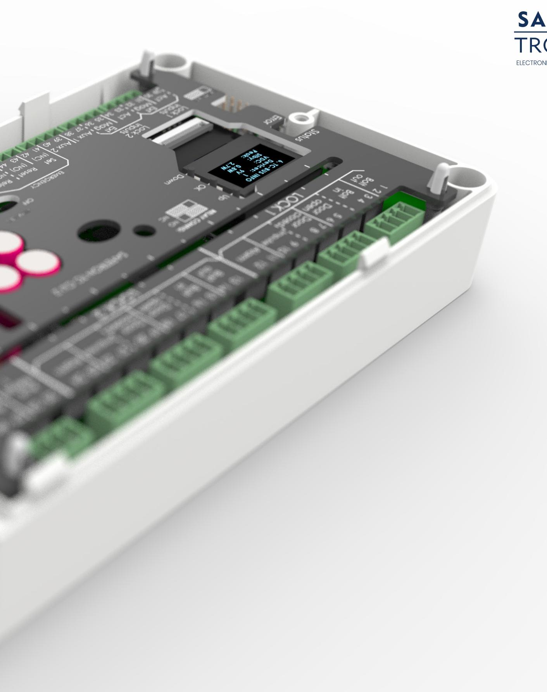
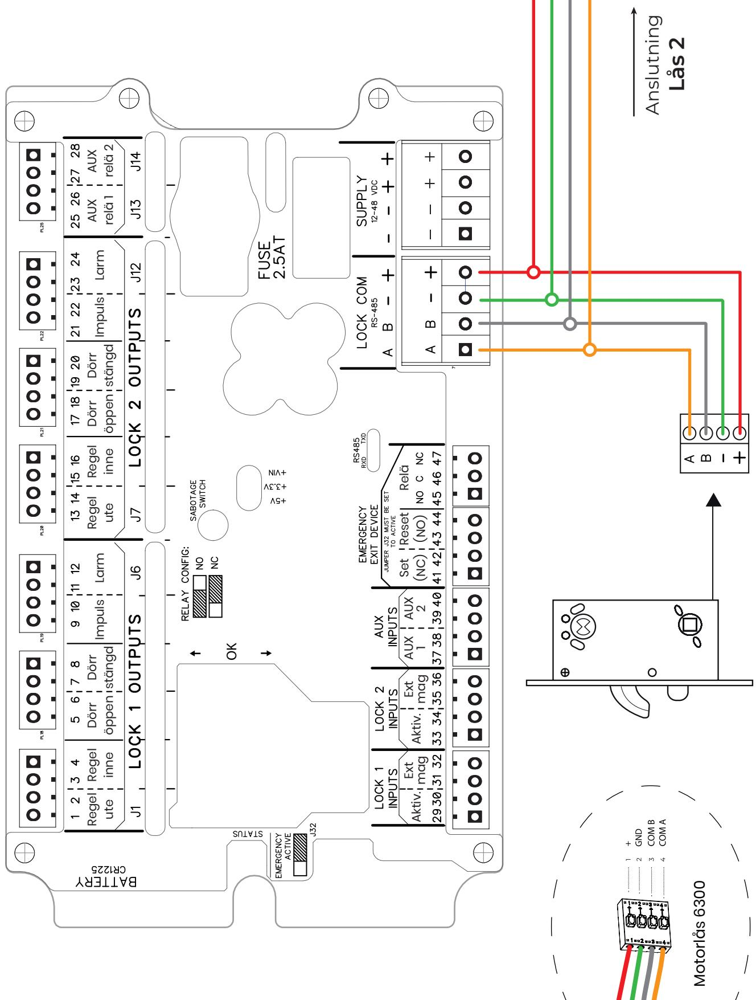
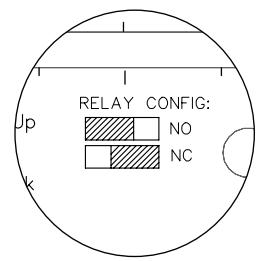
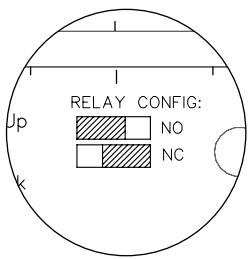
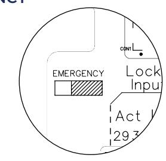
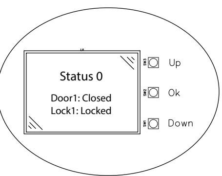
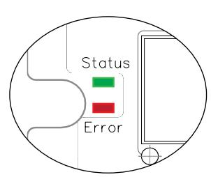
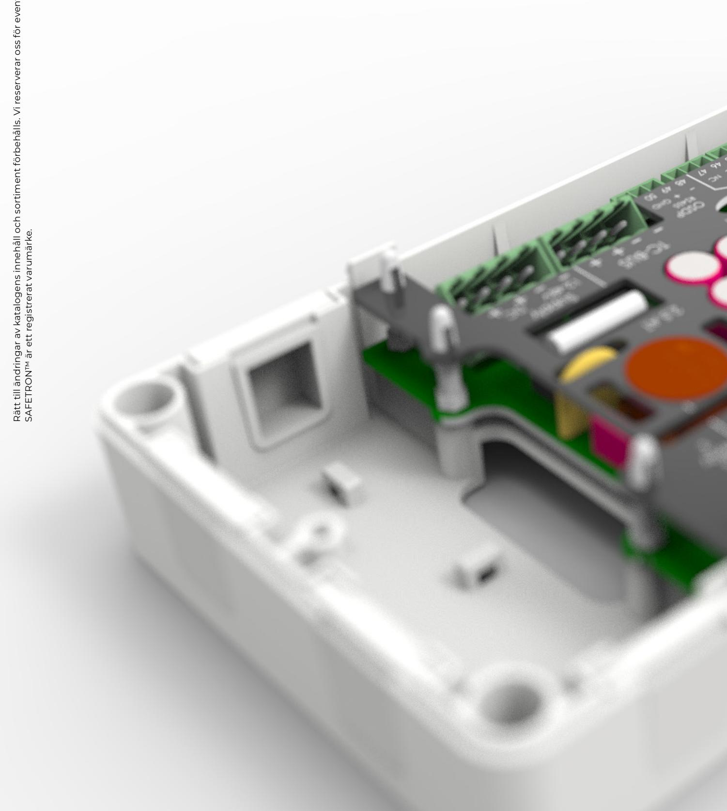

# STYRENHET CU2

Installationsanvisning 20211229

## **INNEHÅLLSFÖRTECKNING**

| Kabeldimensionering         | 3    |
|-----------------------------|------|
| SSF 3522                    | 3    |
| Inkopplingsritning CU2      | 4    |
| Installation av 1 motorlås  | 5    |
| Installation av 2 motorlås  | 6    |
| Funktionsbeskrivning reläer | 7    |
| Utbyte av enhet             | 7    |
| Aktivering av återinrymning | 7    |
| Meny display styrenhet      | 8-10 |
| Felkodslogg                 | 11   |
| Varningslogg                | 11   |

## **KABELDIMENSIONERING**

Kabel av typ data/tele/signal (enkelledare) med areor mellan 0,1-0,2 får inte användas som spänningsmatning av styrenheten. Safetron ger ingen funktionsgaranti på installationer som inte följer rekommendationer. Se tabell nedan.

Rekommenderad minsta kabelarea mellan spänningskälla (trafo, ej passage system)-styrenhet-låshus (totallängd)

| Kabellängd | 0-10m   | 11-20m  | 21-40m  | 61-80m  | 81-100m |
|------------|---------|---------|---------|---------|---------|
| 12-24 VDC  | 0,22mm2 | 0,34mm2 | 0,68mm2 | 1,36mm2 | 1,7mm2  |

#### **O.B.S**

Det är viktigt att strömförsörjningen till styrenheten har rätt dimensionerad kabel för att inte få spänningsfall som stör låsets funktion. Vid gemensam matning av flera lås/passagesystem/läsare/centraler och dylikt skall den sammanlagda strömförbrukningen tas i beaktande vid beräkning av kabelarea.

## **SSF 3522**

För att motorlåsen ska vara godkända enligt SSF 3522 låsklass 3, 4 och 5 skall inställningen SSF 3522 vara aktiverad i styrenhetens meny: Meny 20. SSF 3522 : **Enabled : YES**.

För att uppfylla SSF 3522 klass 4 och 5 skall även styrenheten vara installerad i ett skyddat utrymme med minst klass 3 låsning.

Aktivering av SSF 3522 läget i styrenheten innebär följande ändringar på reläutgångarna:

- Låskolv ute aktiv indikering 1-15 sek. Fabriksinställning: 10s
- Låskolv inne aktiv indikering 1-15 sek. Fabriksinställning: 10s
- Larm aktiv indikering 30-120 sek. Fabriksinställning: 30s.
- Öppettiden på aktivering 10 sek.

Separat utgång för akustiskt indikeringsdon som indikerar om den spärrande kolven eller annat spärrande organ förhindras i växlingen mellan fullt utlåst och förreglat läge och fullt upplåst läge eller att förregling inte sker. Denna utgång ska aktiveras senast 2 sekunder efter det att den spärrande kolven eller annat spärrande organ skulle varit i sitt ändläge, och vara aktiverat minimum 30 sekunder, maximum 2 minuter. Denna utgång ska brytas om spärrande kolv eller annat spärrande organnår fullt låst och förreglat läge.

**OBS!** Samtliga komponenter för låsenheten (låshus, slutbleck, dörrförstärkningsbehör) skall minst ha samma klassning för att hela låsenheten skall kunna klassas enligt SSF 3522.

#### **Villkor för SS-EN 14846**

Vid installation mellan motorlås och styrenhet enligt inkopplingsritning uppstår en parad krypterad signal som inte kan manipuleras genom extern åverkan på kabel. Denna inkoppling är en förutsättning för att motorlåsen skall uppfylla Grade 3 avseende "Security electrical manipulation" enligt SE-EN 14846.

## 5 **ANSLUT LÅSHUS** Anslutningskabel mellan låshus och styrenhet kopplas via plint i bakkant på låshuset. Via plint **LOCK COM** på styrenheten ansluts spänningsmatning +/- samt kommunikation A och B till motorlåset. Låshusets plint är självlåsande och skalad ledare ansluts. Anslutning kan assisteras genom att pressa in friställningsknappen på låshusets plint **MANÖVERSPÄNNING**  Manöverspänning kopplas in på plint märkt **SUPPLY 12-48V AC/DC** på styrenheten. **INITIERING** Initiering av låshusen sker automatiskt vid installation. **AKTIVERING** Aktivering via potentialfri slutning kopplas på plint 29-30, märkt **"Act" RELÄUTGÅNGAR 1-2 Regel ut** Aktiveras vid regel ute **3-4 Regel in** Aktiveras vid vid regel inne **5-6 Dörr öppen** Styrs av magnetavkänning i låsets stolpe **7-8 Dörr stängd** Styrs av magnetavkänning i låsets stolpe 1 2 3 4

- **9-10 Impuls** Sluter vid aktivering, för styrning av t.ex. elslutbleck **11-12 Larm** Aktiveras vid kolv blockerad eller dörr öppen (aktiveras i meny 4)
- 

6

**25-26 AUX 1** Ställbar reläutgång. Konfigueras i styrenhetens display, se sida 11

#### **OMSTÄLLNING NO/NC**

Reläutgångarna kan ställas i NO eller NC. Förvald inställning är NO.

För NO: flytt kortslutningsbygeln till de två vänstra stiften För NC: flytta kortslutningsbygeln till de två högra stiften

## **ANSLUT LÅSHUSEN**

Anslutningskabel mellan låshus och styrenhet kopplas via plint i bakkant på låshuset. Via plint **LOCK COM** på styrenheten ansluts spänningsmatning +/- samt kommunikation A och B parallellt till motorlås 1 och 2.

Anslut motorlåsen med varsin kabel eller seriekopplad i dörren genom samma karmöverföring.

Låshusets plint är självlåsande och skalad ledare ansluts. Anslutning kan assisteras genom att pressa in friställningsknappen på låshusets plint

## **MANÖVERSPÄNNING**  2

Manöverspänning kopplas in på plint märkt **SUPPLY 12-48V AC/DC** på styrenheten.

## 3

1

#### **ADRESSERING AV LÅSHUS**

Adressera motorlåsen med **Adress 1** resp. **Adress 2** i motorlåsets display. Detta görs under menyval **2: COMM SET**. Utan denna åtgärd kommer inte låsen att kunna initieras mot styrenheten.

Motorlåsen har alltid Adress 1 som standardinställning

## 4

5

**INITIERING** Initiering av låshusen sker automatiskt vid installation.

## **AKTIVERING**

Aktivering via potentialfri slutning kopplas in på varsin plint:

**Lås 1:** Plint 29-30, märkt **"Act" Lås 2:** Plint 33-34, märkt **"Act"**

## **RELÄUTGÅNGAR**

Båda motorlåsen får fullständigt signalutbyte genom varsitt avsnitt av reläutgångar

| Lås 1                                              |                                                                     |                                                                                                                                                                                                                                                                               |
|----------------------------------------------------|---------------------------------------------------------------------|-------------------------------------------------------------------------------------------------------------------------------------------------------------------------------------------------------------------------------------------------------------------------------|
| 1-2 3-4 5-6 7-8 9-10 11-12          | Regel ut Regel in Dörr öppen Dörr stängd Impuls Larm | Aktiveras vid regel ute Aktiveras vid regel inne Styrs av magnetavkänning i låsets stolpe Styrs av magnetavkänning i låsets stolpe Sluter vid aktivering, för styrning av t.ex. elslutbleck Aktiveras vid kolv blockerad eller dörr öppen (aktiveras i meny 4) |
| 25-26                                              | AUX 1                                                               | Ställbar reläutgång. Konfigueras i styrenhetens display, se sida 11                                                                                                                                                                                                           |
| Lås 2                                              |                                                                     |                                                                                                                                                                                                                                                                               |
| 13-14 15-16 17-18 19-20 21-22 23-24 | Regel ut Regel in Dörr öppen Dörr stängd Impuls Larm | Aktiveras vid regel ute Aktiveras vid regel inne Styrs av magnetavkänning i låsets stolpe Styrs av magnetavkänning i låsets stolpe Sluter vid aktivering, för styrning av t.ex. elslutbleck Aktiveras vid kolv blockerad eller dörr öppen (aktiveras i meny 4) |
| 27-28                                              | AUX 2                                                               | Ställbar reläutgång. Konfigueras i styrenhetens display, se sida 11                                                                                                                                                                                                           |

## **OMSTÄLLNING NO/NC**

Reläutgångarna kan ställas i NO eller NC. Förvald inställning är NO.

För NO: flytt kortslutningsbygeln till de två vänstra stiften För NC: flytta kortslutningsbygeln till de två högra stiften

7

## **FUNKTIONSBESKRIVNING**

| Namn                           | Beskrivning                                              |
|--------------------------------|----------------------------------------------------------|
| Regel ute                      | Ger signal vid regel ute                                 |
| Regel inne                     | Ger signal vid regel inne                                |
| Dörr öppen                     | Styrs av magnetavkänning i låsets stolpe                 |
| Dörr stängd                    | Styrs av magnetavkänning i låsets stolpe                 |
| Impuls                         | Sluter vid aktivering, för styrning av t.ex. elslutbleck |
| Larm                           | Ger signal vid larmhändelse                              |
| Regel ute (lås 2)              | Ger signal vid regel ute                                 |
| Regel inne (lås 2)             | Ger signal vid regel inne                                |
| Dörr öppen (lås 2)             | Styrs av magnetavkänning i låsets stolpe                 |
| Dörr stängd (lås 2)            | Styrs av magnetavkänning i låsets stolpe                 |
| Impuls (lås 2)                 | Sluter vid aktivering, för styrning av t.ex. elslutbleck |
| Larm (lås 2)                   | Ger signal vid larmhändelse                              |
| Aux relä 1                     | Ställbar reläutgång lås 1, se sida 11                    |
| Aux relä 2                     | Ställbar reläutgång lås 2, se sida 11                    |
| Aktivering (lås 1)             | Aktivering via potentialfri slutning                     |
| Extern magnet (lås 1)          | Ingång för extern magnetkontakt                          |
| Aktivering (lås 2)             | Aktivering via potentialfri slutning                     |
| Extern magnet (lås 2)          | Ingång för extern magnetkontakt                          |
| Aux relä 1                     | Ställbar reläingång lås 1, se sida 11                    |
| Aux relä 2                     | Ställbar reläingång lås 2, se sida 11                    |
| Återinrymning                  | Aktivering av återinrymning, kopplas från nödbeslag      |
| Återställning, återinrymning   | Återställning av återinrymning via slutning              |
| Larm (aktiverad återinrymning) | Larm NO/NC vid aktiv återinrymning                       |
|                                |                                                          |

## **AKTIVERING AV ÅTERINRYMNING**

För att aktivera återinrymningsfunktionen skall kortslutningsbygeln märkt **'EMERGENCY'** flyttas till den högra positionen enligt ritning till höger.

Anslut nödbehörets mikrobrytare (NC) **röd och svart** till styrenheten på plint 41-42. Vid aktiverat nödbehör kommer låset förbli upplåst tills dess att återställning sker.

Återställning sker genom potentialfri slutning på plint 43-44

## **UTBYTE AV ENHET**

## **Utbyte av låshus**

Vid byte av motorlåshus måste den gamla enheten av-initieras. Detta sker i menyval **3: COMM SET**. Välj **Device: unpaired**. Därefter kan ett nytt motorlås anslutas till styrenheten.

## **Utbyte av styrenhet**

Vid byte av styrenhet görs motsvarande procedur som ovan fast i motorlåsets display. Motorlåsets manipulationsskydd motverkar detta och kravställer att hakregeln är inlåst samt att magnetkontakten är bruten.

1. Lås in regel

- 2. Säkerställ att magnetkontakt är bruten
3. Gå till meny **10: Dev reset**, välj **Yes**. Därefter kan motorlåset anslutas till en ny styrenhet.

#### **STYRENHETENS DISPLAY**

Styrenheten är försedd med en navigeringsbar display för att enkelt kunna göra konfiguration samt statusuthämtning.

Växla i menyn genom att använda knapparna markerade med **'UP'** samt **'DOWN'**. Knappen markerad **'OK'** går in i menykonfiguration samt bekräftar markerat val.

#### **Fetmarkerad text indikerar fabriksinställt värde.**

| NR | MENY                   | VARIABLER                                                                                                               | BESKRIVNING                                                                                                                                                                                                                                                |
|----|------------------------|-------------------------------------------------------------------------------------------------------------------------|------------------------------------------------------------------------------------------------------------------------------------------------------------------------------------------------------------------------------------------------------------|
| 1  | Status                 | Status: 0   1 Door: Open   Closed                                                                              | Status 0 : Unpaired BUS. Enheter är ej initierade. Status 1 : Paired BUS. Enheter är initierade (auto efter 12h)                                                                                                                                        |
|    |                        | Lock: Locked   Unlocked                                                                                              | Door1 : Dörrstatus lås 1 Lock1 : Låsstatus lås 1                                                                                                                                                                                                        |
| 2  | Date / time            | HH:MM DD-MM-YY                                                                                                       | Aktuell tid och datum, ställd från fabrik GMT+1. Kan ändras manuellt genom att klicka på 'OK' och växla tid/datum.                                                                                                                                      |
| 3  | Com set                | BUS : Unpaired   Paired InterF : TC-Bus   RS-485                                                               | BUS : Om komunikationen är initierad eller inte. Initiera manuellt genom att klicka 'OK' och därefter växla till Paired. Vid utbyte av lås växlar man från 'Paired' till 'Unpaired' för att av-initiera och därmed tillåta en ny enhet.           |
|    |                        |                                                                                                                         | InterF : (Gäller endast 6100/6200/6300). Kommunikationsport, TC-BUS innebär tvåtrådsteknik, RS485 innebär fyrtrådsteknik.                                                                                                                            |
|    |                        |                                                                                                                         | Open Tmr : Öppettid vid aktivering innan låsning sker.                                                                                                                                                                                                     |
| 4  | Lock1 timer (lås 1) | Open Tmr : 4s   0-30s Bolt Dly. : 1,5s   0,5-5,0s ManL. Dly. : 0s   0-30s Door Lrm. : 0s   10-120s | Bolt Dly. : Tidsfördröjning från att dörr stängs till kolv påbörjar utlåsning.                                                                                                                                                                          |
|    |                        |                                                                                                                         | M.Un.Dly. : Tidsfördröjning vid manuell upplåsning via vred/ cylinder.                                                                                                                                                                                  |
|    |                        |                                                                                                                         | Door Lrm. : Dörrlarm vid öppen dörr sker efter detta ställda tidsvärde. Standardvärde 0s innebär inaktiv funktion.                                                                                                                                      |
| 5  | Lock2 timer (lås 2) |                                                                                                                         | Samma som meny 4 fast för lås 2                                                                                                                                                                                                                            |
| 6  | Inputs                 | Act1 : NO   NC Ext1 : NO   NC Act2 : NO   NC Ext2 : NO   NC                                        | Act1 : Aktiveringsingång för lås 1. Ställbar NO eller NC Ext1 : Ingång för externmagnet till lås 1. Ställbar NO eller NC Act2 : Aktiveringsingång för lås 2. Ställbar NO eller NC Ext2 : Ingång för externmagnet till lås 1. Ställbar NO eller NC |

## Fortsättning nästa sida

## **Fetmarkerad text indikerar fabriksinställt värde.**

| NR | MENY       | VARIABLER                                                                                                        | BESKRIVNING                                                                                                                                                                                                                                                                                                                                                                                                                                                                                                                                                                                                                                                                                                                                                                                                                                                                                                |
|----|------------|------------------------------------------------------------------------------------------------------------------|------------------------------------------------------------------------------------------------------------------------------------------------------------------------------------------------------------------------------------------------------------------------------------------------------------------------------------------------------------------------------------------------------------------------------------------------------------------------------------------------------------------------------------------------------------------------------------------------------------------------------------------------------------------------------------------------------------------------------------------------------------------------------------------------------------------------------------------------------------------------------------------------------------|
| 7  | AUX inputs | Aux1 : NO   NC Aux1 : Disabled   Funktionsval Aux2 : NO   NC Aux2 : Disabled   Funktionsval | Aux1 : Auxingång för lås 1. Ställbar NO eller NC Aux1 : Välj funktion för lås 1: • Dayblock : Dagblockering, vid slutning av denna ingång förblir låset upplåst efter första aktivering tills denna slutning släpps • Timer : Aktiverar lås. Har ej öppettid och påverkar inte impuls • ActivAll : Synkroniserad aktivering av lås 1 och lås 2 • ClrError : Nollställning av error logg via slutning • ClrWarn : Nollställning av varningslogg via slutning Aux2 : Auxingång för lås 2. Ställbar NO eller NC Aux2 : Välj funktion för lås 2, samma val som ovan.                                                                                                                                                                                                                                                                                                                |
| 8  | AUX relays | Aux1 : Disabled   Funktionsval Aux2 : Disabled   Funktionsval                                           | Aux1 : Välj funktion för lås 1: • Sabotage : Relä aktiveras vid öppning av enhetens kapsling. • Man. Unlk : Relä aktiveras vid manuell upplåsning. • Blocked : Relä aktiveras vid blockerad kolv. • Errors : Relä aktiveras när det finns rader i error logg. • Warnings : Relä aktiveras när det finns rader i varningslogg. • DoorLarm : Relä aktiveras vid uppställd dörr längre än angiven tid i Door Lrm. i meny 4 och meny 5. • Openers : Dörrautomatikstyrning, relä aktiveras vid aktivering och kolv inne. • Vital C. : Vital funktion stängd, relä aktiveras vid dörr stängd och lås låst. • Vital O. : Vital funktion öppen, relä aktiveras vid dörr öppen och lås upplåst. • Service : Relä aktiveras när service intervall uppnåtts. Serviceintervall är ställbart i meny 13 och meny 16. Aux2 : Välj funktion för lås 2, samma val som ovan. |
| 9  | BUS info   | VDC: Stby : Peak : Locks :                                                                              | VDC : Volt ut på BUS. Stby : Förbrukning i watt på BUS i standbyläge Peak : Maxförbrukning i watt på BUS sedan senaste uppstart Locks : Antal lås anslutna på BUS                                                                                                                                                                                                                                                                                                                                                                                                                                                                                                                                                                                                                                                                                                                                 |
| 10 | Dev reset  | No   Yes                                                                                                         | Funktion för att återställa Styrenhet CU2 till fabriksinställning. BUS blir även 'Unpaired'.                                                                                                                                                                                                                                                                                                                                                                                                                                                                                                                                                                                                                                                                                                                                                                                                            |
| 11 | Lock1 info | S/N : F/W : H/W : M/N :                                                                                 | S/N : Serienummer på låshus F/W : Firmware på låshus H/W : Hårdvaruversion på låshus M/N : Modellnummer på låshus                                                                                                                                                                                                                                                                                                                                                                                                                                                                                                                                                                                                                                                                                                                                                                                 |

Fortsättning nästa sida

## **MENYVAL DISPLAY STYRENHET**

| NR | MENY        | VARIABLER                                                                                             | BESKRIVNING                                                                                                                                                                                                                                                     |
|----|-------------|-------------------------------------------------------------------------------------------------------|-----------------------------------------------------------------------------------------------------------------------------------------------------------------------------------------------------------------------------------------------------------------|
| 12 | Lock1 stats | VDC: Rh : C : Cycles :                                                                       | VDC : Inkommande spänning till lås 1 Rh : Aktuell luftfuktighet i lås 1 C : Aktuell temperatur i lås 1 Cycles : Antal cykler låshus har genomfört (in/ut-låsning = 1)                                                                                  |
| 13 | Lock1 serv  | Service : NO   Done Notify : 100000   10000-500000 Date : Cycles :                     | Service : Välj 'Done' när service är utförd. Detta nollar cykelräk. Notify : Ställbar serviceintervall. Vid uppnått cykelantal går larm Date : Datum för senast utförd service Cycles : Antal cykler sedan senaste service                             |
| 14 | Lock2 info  |                                                                                                       | Samma som meny 11 fast för lås 2                                                                                                                                                                                                                                |
| 15 | Lock2 stats |                                                                                                       | Samma som meny 12 fast för lås 2                                                                                                                                                                                                                                |
| 16 | Lock2 serv  |                                                                                                       | Samma som meny 13 fast för lås 2                                                                                                                                                                                                                                |
| 17 | CU2 info1   | S/N : F/W : H/W : M/N :                                                                      | S/N : Serienummer på styrenhet F/W : Firmware på styrenhet H/W : Hårdvaruversion på styrenhet M/N : Modellnummer på styrenhet                                                                                                                          |
| 18 | CU2 info2   | M/D : I/D :                                                                                        | M/D : Tillverkningsdatum för enhet I/D : Installationsdatum för enhet, fastställs efter 12h drifttid.                                                                                                                                                        |
| 19 | CU2 environ | VDC: Runtime :                                                                                     | VDC : Inkommande spänning till styrenhet Runtime : Räknare sedan senaste uppstart av enhet                                                                                                                                                                   |
| 20 | SSF 3522    | Enable : NO   YES Bolt out : 10s   1-15s Bolt in : 10s   1-15s Blocked : 30s   30-120s | Enable : Växla till 'YES' för att aktivera SSF 3522 läge. Bolt Out : Tidsbegränsning hur länge kolv ute relä håller slutet Bolt in : Tidsbegränsning hur länge kolv inne relä håller slutet Blocked : Tidsbegränsning hur länge larmrelä håller slutet |
| 21 | Log error   | Nollställ genom att trycka på 'OK'                                                                    | Felkodslogg, se beskrivning på sida 11                                                                                                                                                                                                                          |
| 22 | Log warn    | Nollställ genom att trycka på 'OK'                                                                    | Varningslogg, se beskrivning på sida 11                                                                                                                                                                                                                         |

## **FELKODSMENY**

|  |  |  | Styrenheten loggar samtliga felkoder i meny 21 i styrenhetens display. |  |
|--|--|--|------------------------------------------------------------------------|--|
|  |  |  |                                                                        |  |
|  |  |  |                                                                        |  |
|  |  |  |                                                                        |  |

*Exempel*

| 07:43:21            | 32     | 1  |
|---------------------|--------|----|
| Tidpunkt för felkod | Felkod | ID |

## **ERRORLOGG (MENY 21)**

Akuta fel som kräver åtgärd loggas här. Error lysdiod tänds vid registrerade rader i errorlogg.

| NR | FELKOD           | BESKRIVNING                                                       |
|----|------------------|-------------------------------------------------------------------|
| 10 | PD Disconnected  | Lås bortkopplat från BUS                                          |
| 20 | Overcurrent      | Överström på LOCK COM. Maxnivå: 1.2A. Indikation för kortslutning |
| 21 | Low voltage      | Låg spänning. Min.nivå: 11V                                       |
| 22 | High voltage     | Hög spänning. Maxnivå: 50V                                        |
| 23 | Low humidity     | Låg luftfuktighet, under 4%                                       |
| 24 | High humidity    | Hög luftfuktighet, över 90%                                       |
| 25 | Low temperature  | Låg temperatur, under -20°C                                       |
| 26 | High temperature | Hög temperatur, över 70°C                                         |

## **VARNINGSLOGG (MENY 22)**

Varningar loggas här.

| NR | FELKOD       | BESKRIVNING                                                             |
|----|--------------|-------------------------------------------------------------------------|
| 31 | Bolt blocked | Kolv blockerad, id är adressen på låshus                                |
| 32 | Door larm    | Dörrlarm, dörr öppen längre än inställd maxtid                          |
| 33 | Manipulation | Manipulation av kolven, när kolven opåverkat tappar kolvlägesindikering |

STYRENHET CU2

## **SAFETRON AB**

Säterivägen 18 P.O. Box 2096 65002 Karlstad Sweden

Tel: +46 54 19 02 45 info@safetron.com www.safetron.com