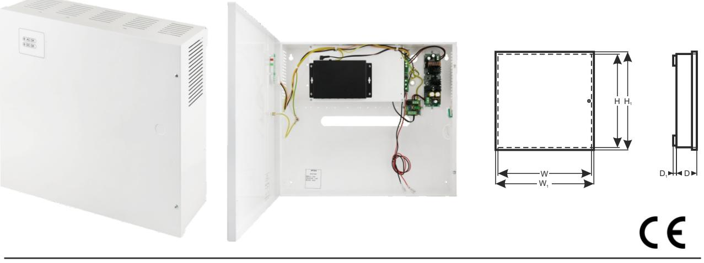

*Pulsar* ®

#### **APS64** v.1.0/I **APS 6-port switch 4x30W med reservkraft 64** PRODUKTKODE TYP: :

## **Features:**

- · Avbrottsfri strömförsörjning för 4 IP-enheter (52 V DC)
- · Switch med 6 portar 4 PoE-portar 10/100 Mb/s (dataöverföring och strömförsörjning) 2 portar 10/100Mb/s (UP LINK)
- · Läge med **Lång räckvidd** (upp till 250m)
- · 30 W för varje PoE-port, stöder enheter som uppfyller standarden IEEE802.3af/ vid **(PoE +**
- **BESKRIVNING**

APS64 är avsedd för oavbruten strömförsörjning av 4 IP-enheter (52 V DC-försörjning).

Systemets huvudsakliga komponenter inkluderar:

- PoE-switch med 6 portar
- 27,6 V buffertströmförsörjning med två 17 Ah / 12 V-batterier
- en omvandlare (DC/DC52230) som ökar spänningen till 52 V DC (matning till PoE-switchen)

Vid strömavbrott aktiveras omedelbart ett reservbatteri.

 Automatisk upptäckt av enheter som drivs med standarden PoE/PoE+ aktiveras vid portar 1-4 på switchen. UP LINK-portarna används för anslutning till en annan nätverksenhet. Lysdioderna på frontpanelen indikerar enhetens driftsstatus (beskrivs i tabell 8).

Switchen sitter inuti ett metallhölje (färg RAL 9003) med rum för två 17 Ah/12 V-batterier. Höljet är utrustat med en mikroswitch som aktiveras om luckan öppnas (frontpanelen). APS64 är försedd med två lysdioder på frontpanelen (röd lysdiod - indikerar en 230 V matningsspänning, grön lysdiod indikerar likspänning).

PoE-tekniken ansluter till nätverket och minskar installationskostnaderna eftersom den inte kräver en separat strömkabel till varje enhet. Metoden gör det möjligt att försörjs andra nätverksenheter.

Tel. +48-14-610-19-40, fax: +48-14- 610-19-50, www.pulsar.pl, e-mail: sales@pulsar.pl

· Metallhölje - färg vit RAL 9003

med batterifack för två 17 Ah/12 V-batterier · Stöder automatisk inlärning och automatiskt åldrande av MAC-adresser (1K storlek)

**SV**

# **SWITCHENS PARAMETRAR**

| Portar                  | 6 st 10/100 Mb/s-portar (4 st PoE + 2 st UP LINK) med automatisk hantering av |
|-------------------------|-------------------------------------------------------------------------------|
|                         | anslutningshastighet och MDI/MDIX Auto Cross                                  |
| PoE-strömförsörjning    | IEEE 802.3af/at (1÷4 portar), 52 V DC / 30 W i varje port *                   |
| Läge med lång           | Lång räckvidd, VLAN                                                           |
| räckvidd                |                                                                               |
| Protokoll, standarder   | IEEE802.3, 802.3u, 802.3x CSMA/CD, TCP/IP                                     |
| Bandbredd               | 1,6 Gbps                                                                      |
| Överföringsmetod        | Lagra-och-vidarebefordra                                                      |
|                         | Switchens strömförsörjning;                                                   |
| Synlig driftsindikering | Länk/Act;                                                                     |
|                         | PoE-status                                                                    |

*Pulsar* ®

* Det angivna värdet på 30 W är maximal belastning per port. Total maximal belastning 120W på samtliga portar.

För maximal livslängd rekommenderas en kontinuerlig belastning på maximalt 80W.

### **ELEKTRISKA PARAMETRAR**

| Nätförsörjning                       | ~200-240 V; 50 Hz                                    |
|--------------------------------------|------------------------------------------------------|
| Strömstyrka upp till                 | 1,4 A                                                |
| Strömförsörjning                     | 133 W                                                |
| Utgångsström vid PoE-portarna (RJ45) | 4 st 0,6 A ΣI=2,3A max.                              |
| Utgångsström vid PoE-portarna (RJ45) | 52 V DC                                              |
| Kortslutningsskydd SCP och           | 105% ÷ 150% PSU-effekt, manuell omstart              |
| överbelastningsskydd OLP             | (felet kräver frånkoppling av utgångskretsen för DC) |
| PSU-strömförbrukning                 | 250 mA/27,6 V DC                                     |
| Batteriets laddningsström            | 0,5 A max. /2 st 17 Ah (+/-5%)                       |
| Batterikretsskydd SCP och retur      | proppsäkring                                         |
| polaritetsanslutning                 |                                                      |
| Djupurladdningsskydd UVP             | U<19 V (± 5%) – frånkoppling av anslutningsbatteri   |
| Sabotageskydd:                       |                                                      |
| - MANIPULERINGS-indikator när höljet | - mikroswitch, NC-kontakter (stängt hölje),          |
| öppnas                               | 0,5 A@50 V DC (max.)                                 |

## **MEKANISKA PARAMETRAR**

| Mått                | W=397, H=350, D+D1=92+8 [+/- 2mm]                                     |
|---------------------|-----------------------------------------------------------------------|
|                     | W1=402, H1=355 [+/- 2mm]                                              |
| Batterifackets mått | 370 x 180 x 80mm (WxHxD) max                                          |
| Brutto- / nettovikt | 4,5 / 4,8 kg                                                          |
| Hölje               | Stålplatta, DC01 1,0mm färg vit RAL 9003                              |
| Förslutning         | Spårskruv x 2 (fram), (låsaggregat möjligt)                           |
| Anslutningar        | Strömförsörjning till enheterna: RJ45-uttag                           |
|                     | Ingång 230 V: Φ 0,63-2,50 (AWG 22-10)                                 |
|                     | Batteriutgång BAT: 6,3F-2,5                                           |
|                     | MANIPULERINGS-utgång: ledningar                                       |
| OBS!                | Höljet ska inte vidröra monteringsytan för att kablar ska kunna dras. |

wyjście TAMPER : przewody 30cm