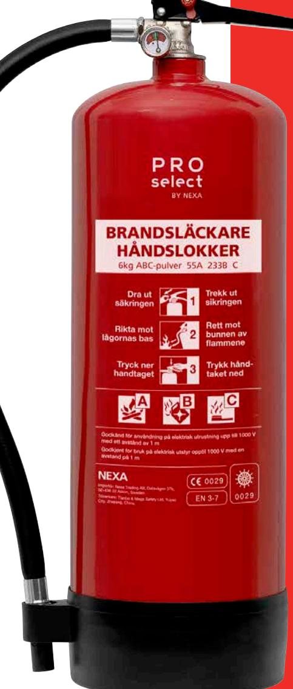

## BRANDSLÄCKARE 55A 6KG **Tang PD6S**

Tryckladdad pulversläckare med högsta släckeffektklassen, vilket innebär att den kan släcka en större yta.

Pulversläckare anses vara den mest mångsidiga släckaren och släcker de flesta bränder som kan uppstå.

En pulversläckare är frostbeständig och leder ej elektricitet vilket innebär att du även kan släcka bränder i elektrisk utrustning upp till 1000 V.

Tänk på att en pulversläckare bara går att använda en gång, sedan måste den laddas om.

Släckaren är återfyllningsbar av behörig servicetekniker."

3 Rekommenderas för för offentliga miljöer

- 3 Effektklass 55A 233B C
- 3 Fotring
- 3 MED/Wheelmark
- 3 EN 3-7
- 3 Väggfäste medföljer
- 3 Etikett på svenska / norska

## **TEKNISK DATA**

| Släckmedel       | 6 kg ABC-pulver    |
|------------------|--------------------|
| Drivgas          | Nitogen            |
| Arbetstryck      | 14 bar vid +20 °C  |
| Temperaturområde | -30 °C till +60 °C |
| Tömningstid      | 17 sekunder        |
| Säkerhetsavstånd | 1 meter            |
| Vikt fylld       | 9,3 kg             |
| Art nr           | 13427              |
| EL-nummer        | 62 002 97          |
| E-nummer         | 16 939 64          |
|                  |                    |

