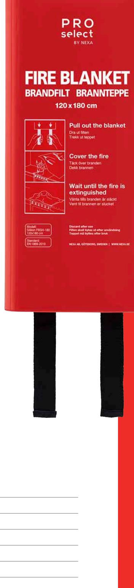

## BRANDFILT SILIKON 120x180 CM **FBSH-180**

En brandfilt rekommenderas som komplement till en brandsläckare, för att snabbt kunna släcka mindre bränder i exempelvis kläder eller kokkärl.

En silikonbelagd brandfilt kväver branden ännu snabbare än en vanlig brandfilt och minskar risken för återantändning avsevärt.

Placera brandfilten synligt där risk för brand kan förekomma, exempelvis i köket, verkstaden eller bredvid öppen spis.

FBSH-180 ligger i en snygg glansig hårdbox, perfekt när man behöver torka av ytan.

- 3 Minimalt med saneringsarbete efter släckning
- 3 Snabbare släckning, mindre risk för återantändning
- 3 Uppfyller kraven enligt EN1869:2019
- 3 Etikett på svenska / norska

| TEKNISK DATA       |                                    |
|--------------------|------------------------------------|
| Material brandfilt | Glasfiberväv med silikonbeläggning |
| Temperatur         | Tål temperaturer upp till 500 °C   |
| Mått filt (B x H)  | 180 x 120 cm                       |
| Mått box (B x H)   | 3,5 x 34 cm                        |
| Vikt               | 0,9 kg                             |
| Art nr             | 13622                              |
| EL-nummer          | 88 022 87                          |
| E-nummer           | 16 939 63                          |
|                    |                                    |

