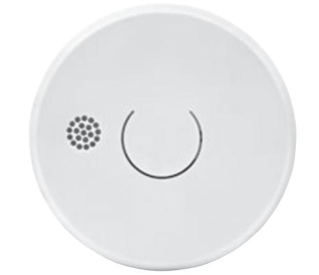

### OPTISK BRANDVARNARE Modell: MTS-166/9V och MTS-166/10Y

*Denna instruktionsfolder innehåller viktig information om hur man korrekt installerar och sköter brandvarnaren. Läs igenom hela denna folder före installation och behåll foldern för framtida referens.* 

Nexas brandvarnare MTS-166 är konstruerad för att känna av rökpartiklar och ge en tidig varning om brand skulle uppstå (förutsatt korrekt placering och underhåll).

#### **TEKNISK DATA**

| MTS-166/9V  |                |
|-------------|----------------|
| Batteri     | 9V brunsten    |
| Batteritid  | Upp till 3 år  |
|             |                |
| MTS-166/10Y |                |
| Batteri     | 9V lithium     |
| Batteritid  | Upp till 10 år |
|             |                |

#### *MTS-166/9V och MTS-166/10Y*

| Larmsignal       | 85 dB (A) vid 3 meter |
|------------------|-----------------------|
| Driftstemperatur | 0°C – 40°C            |
| Luftfuktighet    | 10 – 90 % RH          |
| Känslighet rök   | 0.08 – 0.18 db/m      |

#### **EGENSKAPER**

- Optisk sensor som detekterar pyrande bränder
- LED indikering för Larm och Spänning
- Tyst funktion / Pausknapp
- Varning för låg batterinivå
- Levereras med monteringsdetaljer
- 85dB larmsignal • Dammskydd medföljer
- 

#### **VIKTIGT**

- Ta inte bort eller koppla ifrån batteriet för att stoppa falsklarm. Öppna fönster eller ventilera luften runt brandvarnaren för att stoppa larmet och/eller tryck på pausknappen.
- Brandvarnaren är avsedd att användas i enbostadshus.
- Denna brandvarnare är inte lämplig för användning i byggnader som inte är bostäder. Brandvarnaren är inte en ersättning för ett fullvärdigt larmsystem som krävs enligt lag eller av brandmyndighet.
- Brandvarnaren upptäcker förbränningspartiklar i luften (rök). Den reagerar inte på flammor eller gas.
- Brandvarnaren är konstruerad att avge en larmsignal om en brand håller på att utvecklas.
- Brandvarnaren bör testas varje vecka och bytas ut vart tionde år.

#### **PLACERING AV BRANDVARNAREN**

En förutsättning för att brandvarnaren ska kunna ge tidig varning är att den är installerad där branden uppstår. Nexa rekommenderar därför att du installerar en brandvarnare i varje rum och på alla våningar.

**Enplans bostad:** För att få ett minimiskydd, placera larmet i entréhallen mellan boendeytorna (inklusive köket) och sovutrymmena. Placera den så nära boendeytorna som möjligt och se till att larmet kan höras vid vistelse i sovrummen. Se figur 1 för exempel.

**Flervånings bostad:** För att få ett minimiskydd, placera ett larm i trapphuset (entréplan) och ytterligare ett larm ovanför övervåningens trappavsats, samt ett larm i taket i källaren vid foten av trappan. Detta täcker källarvåningen men inte krypgrund och oinredda vindsutrymmen. Se exempel i figur 2.

#### **Takmontering**

Eftersom het rök stiger och sprids, rekommenderas du att montera den i taket på en central plats. Undvik områden där luften inte cirkulerar, t.ex. hörnutrymmen. Håll den även borta från föremål som kan förhindra ett fritt luftflöde. Placera enheten minst 30 cm från ljusarmaturer eller inredningsdetaljer som kan hindra rök/värme att nå fram till detektorn. Placera den minst 1 meter från väggen. Se figur 3A.

#### **Väggmontering, då takmontering ej är möjlig**

Undvik att montera enheten långt inne i ett hörn. Placera brandvarnarens övre kant minst 15 cm och högst 30 cm från taket. Se figur 3A.

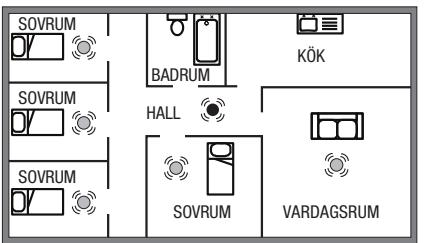

*FIGUR 1.* Enplans bostad

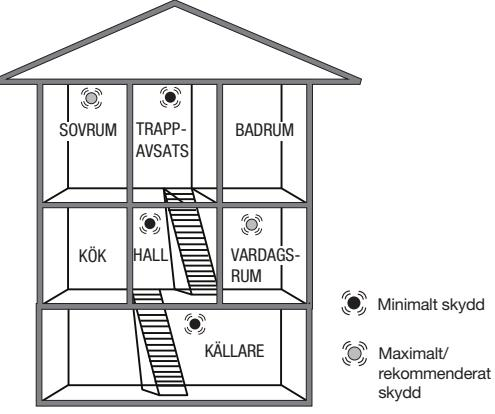

*FIGUR 2.* Flervånings bostad

#### **PLACERING I TAK OCH PÅ VÄGG**

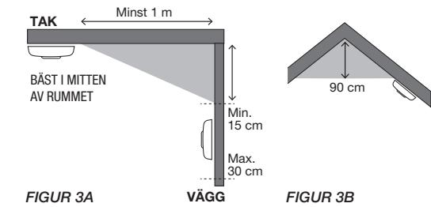

#### **I lutande tak**

På ytor som lutar eller innertak som går upp i nock, ska detektorn monteras 90 cm från den högsta punkten mätt horisontellt därför att stillastående luft under nocken kan hindra rök att nå fram till enheten. Se figur 3B.

**VÄGG**

*OBS: För rekommenderat/maximalt skydd ska ett larm finnas i varje rum (utom kök, badrum och garage). PLACERA INTE NÅGOT LARM I KÖKET eller i BADRUMMET då matos eller ånga kan aktivera larmet. PLACERA INTE NÅGOT LARM I GARAGET då det är risk att avgaserna aktiverar det.* 

### **MONTERING**

- 1. Ta bort monteringsplattan på baksidan av brandvarnaren genom att vrida monteringsplattan moturs.
- 2. Sätt i batteriet. Var noga med att du har rätt polaritet (+/-).
- 3. Testa brandvarnaren, se avsnitt TESTA
- 4. Installera monteringsplattan på valt ställe i taket. Var noga med placeringen av din brandvarnare.
- 5. Placera brandvarnaren mot monteringsplattan och vrid brandvarnaren medurs tills den klickar på plats.
- 6. Tryck på testknappen för att kontrollera att brandvarnaren fungerar korrekt.

#### **TESTA**

- Testa både före och efter installation för att vara säker på att de fungerar.
- Testa enbart med testknappen. Använd aldrig öppen eldslåga då detta kan förstöra brandvarnaren.
- Testa dina brandvarnare rutinmässigt 1 gång/vecka.

#### **TESTA BRANDVARNAREN**

- TRYCK och håll inne testknappen i **3 sekunder**, släpp
- Brandvarnaren avger larmsignal och röd LED blinkar snabbt.
- Röd LED indikering blinkar för att bekräfta radering.

#### **DRIFT**

- Röd LED blinkar en gång/minut, visar att batteriet är laddat och status är OK.
- Vid larm avger enheten en hög pulserande signal och röd LED blinkar snabbt.
- Vid låg batterinivå avger brandvarnaren en kort signal en gång/minut.

#### **PAUSFUNKTIONEN**

Brandvarnaren har en kombinerad knapp för test- och pausfunktion. Med pausfunktionen kan du stoppa larmsignalen om varnaren utlöses på grund av ett falsklarm. Du aktiverar pausfunktionen genom att trycka in test-/pausknappen i 3 sekunder under tiden som enheten larmar.

Larmet kommer att stoppas i 10 minuter och under denna period blinkar röd LED var 10:e sekund. Brandvarnaren återställs till normal känslighet efter att pausperioden på 10 minuter är över.

Vid behov trycker du in pausknappen igen för att återigen pausa larmet.

#### **TYST FUNKTION**

När larmet har låg batteri eller fellarmar kan man tysta larmet i 10 timmar genom att trycka på testknappen i 2-3 sekunder. Så om detta händer på natten kan man tillfälligt tysta larmet och vänta till morgonen för att byta batteri.

#### **VANLIGA ORSAKER OCH HUR MAN UNDVIKER FALSKLARM**

En brandvarnare detekterar och reagerar på rökpartiklar i luften. Rökpartiklarna gör att brandvarnaren larmar. Denna funktion innebär att brandvarnaren även kan reagera på dammpartiklar, fukt eller andra partiklar i form av pollen, insekter mm. Dessa faktorer är oftast orsaken till falsklarm.

#### **BRANDVARNARENS GARANTI**

Denna brandvarnare har 3 års begränsad garanti mot tillverkningsfel. (Gäller från inköpsdatum.) Batteriet täcks inte av garantin. Garantiansvaret är begränsat till värdet av en motsvarande brandvarnare. Defekta brandvarnare ska återlämnas till återförsäljaren tillsammans med en beskrivning av problemet. Godkänd reklamation ersätts med en ny brandvarnare av samma eller likvärdig typ. Vid reklamation måste kvitto som bekräftar inköpsdatum uppvisas.

### **UNDERHÅLL OCH RENGÖRING**

Brandvarnaren bör rengöras regelbundet och minst två gånger per år. Rengör din brandvarnare genom att dammsuga utvändigt längs öppningen mot den optiska kammaren, så att damm och smuts försvinner.

*VIKTIGT: Försök inte öppna brandvarnaren för att rengöra inuti, då gäller inte garantin.* 

#### **ÅTERVINNING**

- Enheten består huvudsakligen av återvinningsbart material.
- Släng inte förpackningen, enheten och innehållet i förpackningen med hushållssoporna, utan att följa gällande bestämmelser.
- Enligt EU-direktiv 2002/96/EG om avfall från elektrisk och elektronisk utrustning (WEEE), ska denna produkt återvinnas.
- För mer information, ring återförsäljaren eller den lokala myndighet som ansvarar för avfallshantering

## 15

0086 NEXA Trading AB Datavägen 37B 436 32 Askim, Sweden MTS-166 NEXA13538-CPR-632447 EN14604:2005/AC:2008 Brandvarnare för hushållsbruk

Tillverkare: Nexa Trading AB, Sverige

Prestandadeklarationen (DoP) finns på vår webbplats – www.nexa.se

| FELKÄLLA                                                                                                                                                                                                                                                                       | ÅTGÄRD                                                                                                                                                                                                                                                                                                        |
|--------------------------------------------------------------------------------------------------------------------------------------------------------------------------------------------------------------------------------------------------------------------------------|---------------------------------------------------------------------------------------------------------------------------------------------------------------------------------------------------------------------------------------------------------------------------------------------------------------|
| Ånga och fukt. Falsklarm kan uppstå om brandvarnaren är placerad för nära badrum, tvättstuga eller andra platser med hög luftfuktighet.                                                                                                                                  | Placera brandvarnaren minst 2 meter från badrum, tvättstuga eller andra platser där hög luftfuktighet kan förekomma.                                                                                                                                                                                       |
| Damm och smuts. Då luften passerar fritt genom detektions kammaren kommer brandvarnaren locka till sig en del damm och pollenpartiklar. Detta kan detta leda till falsklarm. Brandvarnaren kan också bli mer känslig p g a detta vilket kan medföra oönskade larm. | Dammsug brandvarnaren regelbundet, använd ett munstycke av plast så att elektroniken inte skadas. Undvik att montera brandvarnare på ställen med mycket damm och smuts. Sätt gärna en "hätta" över brandvarnaren eller ta bort den helt och hållet under tiden du utför renoveringsarbeten hemma. |

**Drag, damm och luftströmmar.** Falsklarm kan bero på att brandvarnaren har placerats för nära dörrar, fönster, ventilationssystem, fläktar, luftkanaler, värmepumpar eller liknande. Detta kan medföra att dammpartiklar virvlar upp och in i detektionskammaren. Installera inte brandvarnare där det är dragigt, i närheten av fönster och dörrar, ventilation, fläktar, luftkanaler, värmepumpar eller liknande. Hitta en bättre placering för brandvarnaren, längre bort från drag och luftströmmar.

**Temperaturvariationer** kan skapa kondens i detektionskammaren. Till exempel om brandvarnaren placeras i ett rum där fönster öppnas för ventilation under vintern, nära utgångar, balkongdörrar eller andra platser där det växlar mellan kallt och varmt.

**Ogynnsam placering.** Fel placering i en instabil inomhusmiljö, drag, närhet till elektriska apparater (EMC) och belysning kan orsaka falsklarm.

Undvik att montera brandvarnare i rum med snabba temperaturväxlingar eller nära fönster och dörrar som ofta öppnas och stängs. Flytta brandvarnaren till en plats med en mer jämn och stabil temperatur.

Placera brandvarnare minst 5 meter från öppna spisar, kaminer eller andra värmeapparater. 2 meter från ventilationskanaler, värmepumpar och luftkonditionering. 1 meter från lampor och lysrör.

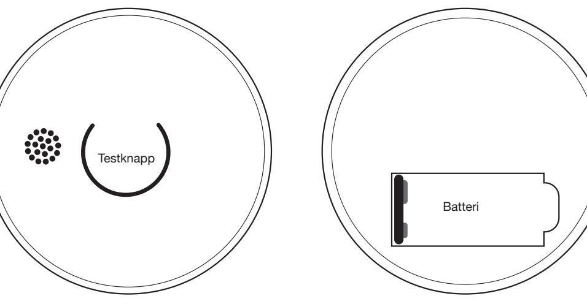

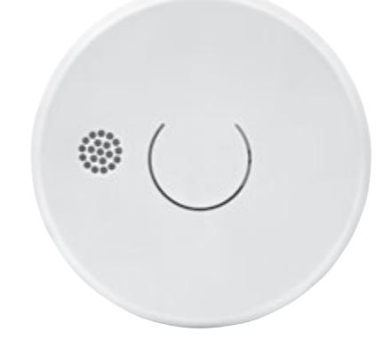

## OPTICAL SMOKE ALARM Model: MTS-166/9V and MTS-166/10Y

*This instruction folder contains important information on correct installation and maintenance of your smoke alarm. Read through the whole folder before installing it, and keep the folder for future reference.* 

Nexa's MTS-166 smoke alarm is designed to detect smoke particles and give an early warning if a fire should start (assuming correct placing and maintenance).

#### **TECHNICAL DATA**

| MTS-166/9V   |                |
|--------------|----------------|
| Battery      | 9V zinc carbon |
| Battery time | Up to 3 years  |
|              |                |
| MTS-166/10Y  |                |
| Battery      | 9V lithium     |
| Battery time | Up to 10 years |
|              |                |

*MTS-166/9V and MTS-166/10Y*

| Alarm signal          | 85 dB (A) at 3 metres |
|-----------------------|-----------------------|
| Operating temperature | 0°C – 40°C            |
| Ambient humidity      | 10 – 90% RH           |
| Sensitivity, smoke    | 0.08 – 0.18 db/m      |

#### **CHARACTERISTICS**

- Optical sensor to detect smouldering fires
- LED indication for Alarm and Voltage
- Silent Function / Pause Button
- Warning for low battery level • Complete with plugs and screws
- 85 dB alarm signal
- Dust cover included

#### **IMPORTANT**

- Do not remove or disconnect the battery to stop false alarms. Open windows or ventilate the air around the smoke alarm in order to stop it, and/or press the pause button.
- The smoke alarm is intended for use for use in singlefamily homes.
- This smoke alarm is not suitable for use in buildings that are not used for residential purposes. The smoke alarm is no substitute for a full alarm system that is required by law or by the fire authorities.
- The smoke alarm detects combustion particles in the air (smoke). It does not react to flames or gas.
- The smoke alarm is designed to emit an alarm signal if a fire is developing.
- The smoke alarm should be tested every week and replaced every ten years.

#### **POSITIONING THE SMOKE ALARM**

For the smoke alarm to provide an early warning, it has to be installed in the location where the fire starts. Therefore, Nexa recommends that you install smoke alarms in each room and on all floors.

**Single-level home:** To achieve minimum protection, position the alarm in the entrance hall between the living areas (including the kitchen) and the sleeping areas. Position it as close as possible to the living areas, and make sure the alarm can be heard by anyone in the bedrooms. See Figure 1, for example:

**Multi-storey home:** To achieve minimum protection, position and alarm in the stairwell (at ground level) and another alarm above the landing on the top floor, as well as an alarm on the ceiling in the basement at the foot of the stairs. This covers the basement level, but not crawl spaces and unfurnished attics. See the example in Figure 2.

#### **Ceiling installation**

Hot smoke rises and spreads, so installing your smoke alarm in a central location on the ceiling is recommended. Avoid areas where air does not circulate, e.g. corners. Also keep it away from objects that may prevent the free flow of air. Position the device at least 30 cm from light fittings or interior fittings that may prevent smoke/heat reaching the detector. Position it at least 1 metre away from the wall. See Figure 3A.

#### **Wall mounting, if ceiling mounting is not possible**

Avoid installing the device a long way into a corner. Position the upper edge of the smoke alarm at least 15 cm and no more than 30 cm away from the ceiling. See Figure 3A.

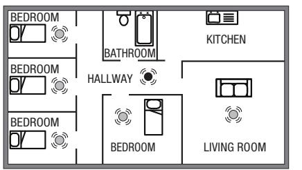

*FIGURE 1.* Single-level home

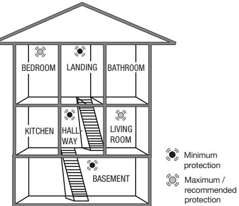

*FIGURE 2.* Multi-storey home

#### **LOCATION ON CEILING AND WALL**

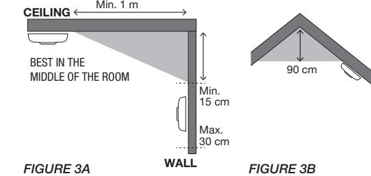

#### **Sloping ceilings**

In the case of sloping surfaces or ceilings that move up towards a ridge, the detector must be installed 90 cm from the highest point, measured horizontally, because still air under the ridge may prevent smoke reaching the device. See Figure 3B.

**WALL**

*Note: There must be an alarm in every room (except the kitchen, bathroom and garage) to provide recommended/maximum protection. DO NOT POSITION AN ALARM IN THE KITCHEN or BATHROOM as cooking smells or steam may activate the alarm. DO NOT POSITION AN ALARM IN THE GARAGE as there is a risk of it being triggered by exhaust fumes.* 

#### **INSTALLATION**

- 1. Remove the mounting plate on the back of the smoke alarm by rotating the mounting plate counterclockwise.
- 2. Insert the battery. Make sure you are using the correct polarity (+/-).
- 3. Test the smoke alarm, see the TESTING section
- 4. Install the mounting plate in a selected location on the ceiling. Take care when positioning your smoke alarm.
- 5. Place the smoke alarm on the mounting plate and rotate the smoke alarm clockwise until it clicks into place.
- 6. Press the test button to check that smoke alarm is working correctly.

#### **TESTING**

- Test your alarms both before and after installation so as to be sure that they are working.
- Only test your alarms using the test button. Never use a naked flame as this may destroy the smoke alarm.
- Get into the habit of testing your smoke alarms once a week.

#### **TESTING THE SMOKE ALARM**

- PRESS and hold down the test button for **3 seconds**, and then release it
- The smoke alarm emits an alarm signal and the red LED flashes rapidly.
- Red LED indication flashes to confirm deletion.

#### **OPERATION**

- Red LED flashes once a minute, indicating that the battery is charged and status is OK.
- On alarm, the device emits a loud pulsating signal and the red LED flashes rapidly.
- On low battery level, the smoke alarm emits a short signal once a minute.

#### **PAUSE FUNCTION**

The smoke alarm has a combined button for the test and pause functions. You can use the pause function to stop the alarm signal if the alarm is triggered due to a false alarm. You activate the pause function is activated by holding down the test/pause button for 3 seconds while the device is emitting an alarm.

The alarm will stop for 10 minutes and, during the period, the red LED flashes every 10 seconds. The smoke alarm is reset to normal sensitivity after the end of the 10-minute pause period.

If necessary, press the pause button again to pause the alarm again.

### **SILENT FUNCTION**

Silence function means when the alarm is low battery or fault alarm, end-user can silence the alarm for 10 hours by pressing the test button for 2-3 seconds. So, if this happens at night, the end-user can silence the alarm and wait until morning to change the battery.

#### **COMMON CAUSES AND HOW TO AVOID FALSE ALARMS**

Smoke alarms detect and react to smoke particles in the air. These smoke particles are what cause the smoke alarm to sound. This function means that the smoke alarm may also react to dust particles, moisture or other particles in the form of pollen, insects, etc. These factors frequently cause false alarms.

#### **SMOKE ALARM WARRANTY**

This smoke alarm has a three-year limited warranty against manufacturing faults. (Valid from the date of purchase.) The battery is not covered by the warranty. The warranty liability is limited to the value of a corresponding smoke alarm. Defective smoke alarms must be returned to the dealer together with a description of the problem. Compensation of a new smoke alarm of the same or an equivalent type will be given in the event of an approved complaint. A receipt confirming the date of purchase must be shown when submitting a complaint.

#### **MAINTENANCE AND CLEANING**

The smoke alarm should be cleaned regularly, and at least twice a year. Clean your smoke alarm by vacuuming externally along the opening to the optical chamber to remove any dust or dirt.

*IMPORTANT: Do not try to open the smoke alarm to clean inside as this will invalidate your warranty.* 

#### **RECYCLING**

- The device mainly comprises materials that can be recycled.
- Do not dispose of the packaging, device and packaging contents with household waste without following applicable provisions.
- This product must be recycled according to EU Directive 2002/96/EC on waste from electrical and electronic equipment (WEEE).
- For more information, phone your dealer or the local authority responsible for waste disposal.

# 15

0086 NEXA Trading AB Datavägen 37B SE-436 32 Askim, Sweden MTS-166 NEXA13538-CPR-632447 EN14604:2005/AC:2008 Smoke alarms for household use

Manufacturer: Nexa Trading AB, Sweden

The Declaration of Performance (DoP) can be found on our website – www.nexa.se

| FAULT SOURCE                                                      | REMEDY                                                             |
|-------------------------------------------------------------------|--------------------------------------------------------------------|
| Steam and moisture. A false alarm may be triggered if the         | Position the smoke alarm at least 2 metres away from the           |
| smoke alarm is positioned to close to a bathroom, laundry         | bathroom, laundry room or other locations where ambient            |
| room or other areas where ambient humidity is high.               | humidity may be high.                                              |
| Dust and dirt. The smoke alarm will attract a certain amount      | Vacuum the smoke alarm regularly, use a plastic nozzle so as       |
| of dust and pollen particles as the air passes freely through the | not to damage the electronics. Avoid installing smoke alarms       |
| detection chamber. This may lead to false alarms. The smoke       | in locations where there is a lot of dust and dirt. Ideally, place |
| alarm may also become more sensitive on account of this,          | a "hood" over the smoke alarm or remove it entirely while you      |
| which may result in unwanted alarms.                              | are carrying out renovations at home.                              |
| Draughts, dust and air flows. False alarms may be caused if the   | Do not install smoke alarms in draughty locations or close to      |
| smoke alarm is placed too close to doors, windows, ventilation    | windows or doors, ventilation, fans, air ducts, heat pumps         |
| systems, fans, air ducts, heat pumps and suchlike. This may       | and suchlike. Find a better location for your smoke alarm,         |
| cause dust particles to fly up and into the detection chamber.    | further away from draughts and air flows.                          |
| Temperature variations may cause condensation in the              | Avoid installing smoke alarms in rooms where the                   |
| detection chamber – if the smoke alarm is placed in a room        | temperature changes rapidly or close to windows or doors           |
| where windows are opened for ventilation in winter, for           | that are opened and closed frequently. Move the smoke              |
| example, or close to exits, balcony doors or other locations      | alarm to a location where the temperature is more consistent       |

**Adverse location.** Positioning the smoke alarm incorrectly in an unstable indoor environment may lead to false alarms due to draughts, close proximity to electrical devices (EMC) and lighting.

where conditions switch between hot and cold.

temperature changes rapidly or close to windows or doors that are opened and closed frequently. Move the smoke alarm to a location where the temperature is more consistent and stable.

Position smoke alarms at least 5 metres away from fireplaces, stoves or other heaters. 2 metres away from ventilation ducts, heat pumps and air conditioning. 1 metre away from lamps and fluorescent tubes.

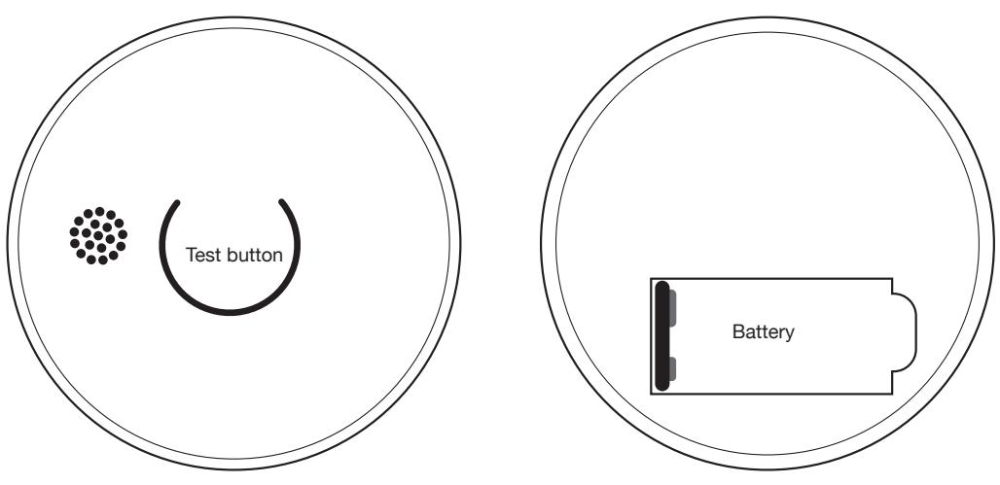

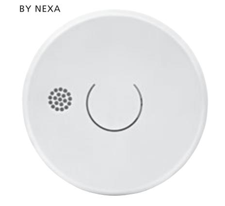

## OPTISK BRANNVARSLER Modell: MTS-166/9V og MTS-166/10Y

*Denne bruksanvisningen inneholder viktig informasjon om hvordan du installerer og håndterer brannvarsleren på riktig måte. Les gjennom hele bruksanvisning før installasjon, og ta vare på den for fremtidig referanse.* 

Nexas brannvarsler MTS-166 er konstruert for å registrere røykpartikler og gi tidlig varsel hvis det skulle oppstå brann (forutsatt riktig plassering og vedlikehold).

#### **TEKNISKE SPESIFIKASJONER**

| MTS-166/9V  |               |
|-------------|---------------|
| Batteri     | 9 V brunstein |
| Batteritid  | Opptil 3 år   |
|             |               |
| MTS-166/10Y |               |
| Batteri     | 9 V litium    |
| Batteritid  | Opptil 10 år  |

#### *MTS-166/9V og MTS-166/10Y*

| Alarmsignal       | 85 dB (A) ved 3 meter |
|-------------------|-----------------------|
| Driftstemperatur  | 0–40 °C               |
| Luftfuktighet     | 10–90 % RH            |
| Sensitivitet røyk | 0,08 – 0,18 db/m      |

#### **EGENSKAPER**

- Optisk sensor som detekterer glødende branner
- LED-indikator for alarm og spenning
- Stillefunksjon/pauseknapp
- Advarsel for lavt batterinivå
- Leveres med monteringstilbehør
- 85 dB alarmsignal • Støvbeskyttelse følger med

#### **VIKTIG**

- Ikke fjern eller koble fra batteriet for å stoppe falske alarmer. Åpne vinduer eller ventiler luften rundt brannvarsleren for å stoppe alarmen, og/eller trykk på pauseknappen.
- Brannvarsleren er beregnet på eneboliger.
- Denne brannvarsleren er ikke egnet for bruk i bygninger som ikke brukes til boligformål. Brannvarsleren er ikke en erstatning for et fullverdig alarmsystem som kreves ifølge loven eller av brannvernmyndighetene.
- Brannvarsleren oppdager forbrenningspartikler i luften (røyk). Den reagerer ikke på flammer eller gass.
- Brannvarsleren er utformet for å avgi en alarm hvis en brann er under utvikling.
- Brannvarsleren skal testes hver uke og byttes ut hvert tidende år.

#### **PLASSERING AV BRANNVARSLEREN**

En forutsetning for at brannvarsleren skal kunne varsle tidlig er at den er installert der brannen oppstår. Nexa anbefaler derfor at du installerer en brannvarsler i hvert rom og i alle etasjer.

**Enetasjes bolig:** For å få et minimumsnivå av beskyttelse plasseres alarmen i inngangspartiet mellom oppholdsrommene (inkludert kjøkkenet) og soverommene. Plasser den så nær oppholdsrommene som mulig, og sørg for at alarmen kan høres når du oppholder deg i soverommene. Se eksempel i figur 1.

**Bolig med flere etasjer:** For å få et minimumsnivå av beskyttelse plasseres én alarm i trappehuset (inngangsnivå) og ytterligere én alarm over trappeavsatsen i øverste etasje, samt én alarm i taket i kjelleren ved foten av trappen. Dette dekker kjelleren, men ikke krypkjeller og uinnredede loftsrom. Se eksempel i figur 2.

#### **Montering i taket**

Ettersom varm røyk stiger og spres, anbefales det at du monterer den på et sentralt sted i taket. Unngå områder der luften ikke sirkulerer, f.eks. i hjørner. Hold den dessuten unna gjenstander som kan hindre fri luftstrøm. Plasser enheten minst 30 cm fra lysarmaturer eller interiørdetaljer som kan hindre røyk/varme i å nå frem til detektoren. Plasser den minst 1 meter fra veggen. Se figur 3A.

**Veggmontering når montering i tak ikke er mulig** Unngå å montere enheten langt inne i et hjørne. Plasser brannvarslerens øvre kant minst 15 cm og maksimalt 30 cm fra taket. Se figur 3A.

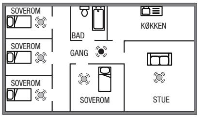

*FIGUR 1.* Enetasjes bolig

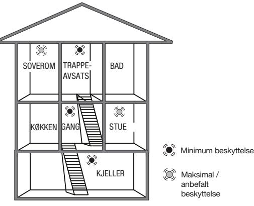

*FIGUR 2.* Bolig med flere etasjer

#### **PLASSERING I TAK OG PÅ VEGG**

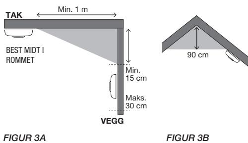

#### **I skrånende tak**

På overflater som skråner eller tak som går opp i møne, skal detektoren monteres 90 cm fra høyeste punkt målt horisontalt, fordi stillestående luft under mønet kan hindre røyk fra å nå enheten. Se figur 3B.

*OBS! For anbefalt/maksimal beskyttelse skal det monteres en alarm i hvert rom (unntatt kjøkken, bad og garasje). IKKE PLASSER EN ALARM I KJØKKENET eller på BADET, da matos eller damp kan aktivere alarmen. IKKE PLASSER EN ALARM I GARASJEN, da det er fare for at eksos vil aktivere den.* 

#### **MONTERING**

- 1. Ta av monteringsplaten på baksiden av brannvarsleren ved å vri monteringsplaten mot klokken.
- 2. Sett i batteriet. Pass på polariteten (+/–).
- 3. Test brannvarsleren se avsnittet TESTE
- 4. Installer monteringsplaten på valgt sted i taket. Vær nøye med plasseringen av brannvarsleren.
- 5. Plasser brannvarsleren mot monteringsplaten, og vri brannvarsleren mot klokken til den klikker på plass.
- 6. Trykk på testknappen for å kontrollere at brannvarsleren fungerer som den skal.

#### **TESTE**

- Test både før og etter installasjon for å være sikker på at den fungerer.
- Teste kun med testknappen. Bruk aldri åpen ild, da dette kan skade brannvarsleren.
- Test brannvarslerne rutinemessig 1 gang/uke.

#### **TESTE BRANNVARSLEREN**

- TRYKK på og hold inne testknappen i **3 sekunder**, slipp. • Brannvarsleren avgir et alarmsignal, og rød LED-
- indikator blinker fort.
- Rød LED-indikator blinker for å bekrefte sletting.

#### **DRIFT**

- Rød LED blinker én gang/minutt for å vise at batteriet er ladet og status er OK.
- Ved alarm avgir enheten et høyt pulserende signal, og den røde LED-en blinker fort.
- Ved lavt batterinivå avgir brannvarsleren et kort signal én gang/minutt.

#### **PAUSEFUNKSJON**

Brannvarsleren har en kombinert knapp for test- og pausefunksjon. Med pausefunksjonen kan du stoppe alarmsignalet hvis brannvarsleren utløses på grunn av en falsk alarm. Pausefunksjonen aktiveres ved å trykke inn test-/pauseknappen i 3 sekunder når en enhet avgir en alarm. Alarmen kommer til å stoppes i 10 minutter, og i denne perioden blinker den røde LED-en hvert 10. sekund. Brannvarsleren vil bli tilbakestilt til normal følsomhet etter at pauseperioden på 10 minutter har utløpt. Ved behov trykker du inn pauseknappen igjen for å sette alarmen på pause på nytt.

#### **STILLEFUNKSJON**

Når alarmen har lite batteri eller feilalarmer, kan alarmen stilles i 10 timer ved å trykke på testknappen i 2-3 sekunder. Så hvis dette skjer om natten, kan du midlertidig stille alarmen og vente til morgen med å skifte batteri.

#### **VANLIGE ÅRSAKER OG HVORDAN FALSK ALARM SKAL UNNGÅS**

En brannvarsler detekterer og reagerer på røykpartikler i luften. Røykpartiklene får brannvarsleren til å utløse en alarm. Denne funksjonen innebærer at brannvarsleren også reagerer på støvpartikler, fuktighet eller andre partikler i form av pollen, insekter, m.m. Disse faktorene er som oftest årsaken til en falsk alarm.

#### **BRANNVARSLERENS GARANTI**

Denne brannvarsleren har en begrenset garanti på 3 år mot produksjonsfeil. (Gjelder fra kjøpsdatoen.) Batteriet dekkes ikke av garantien. Garantiansvaret er begrenset til verdien av en tilsvarende brannvarsler. Defekte brannvarslere skal leveres tilbake til forhandleren sammen med en beskrivelse av problemet. Godkjent reklamasjon erstattes med en ny brannvarsler av samme eller likeverdig type. Ved reklamasjon må det fremvises en kvittering som bekrefte kjøpsdatoen.

#### **VEDLIKEHOLD OG RENGJØRING**

Brannvarsleren skal rengjøres regelmessig og minst to ganger i året. Rengjør brannvarsleren ved å støvsuge utvendig langs åpningen mot det optiske kammeret slik at støv og smuss forsvinner.

*VIKTIG: Ikke prøv å åpne brannvarsleren for å rengjøre den innvendig, da det vil føre til at garantien blir ugyldig.* 

#### **GJENVINNING**

- Enheten består hovedsakelig av materialer som kan gjenvinnes.
- Ikke kast emballasjen, enheten og innholdet i emballasjen sammen med husholdningsavfallet, men følg gjeldende bestemmelser.
- I henhold til EU-direktiv 2002/96/EF om avfall fra elektrisk og elektronisk utstyr (WEEE), skal dette produktet resirkuleres.
- Hvis du ønsker mer informasjon, kan du ringe forhandleren eller den lokale myndigheten som er ansvarlig for avfallshåndtering

15

0086 NEXA Trading AB Datavägen 37B 436 32 Askim, Sweden MTS-166 NEXA13538-CPR-632447 EN14604:2005/AC:2008 Brannvarsler for bruk i bolig

Produsent: Nexa Trading AB, Sverige

Ytelseserklæringen (DoP) er tilgjengelig på nettsiden vår – www.nexa.se

| FEILKILDE                                                                                                                                                                                                                                  | TILTAK                                                                                                                                                                                                                                       |
|--------------------------------------------------------------------------------------------------------------------------------------------------------------------------------------------------------------------------------------------|----------------------------------------------------------------------------------------------------------------------------------------------------------------------------------------------------------------------------------------------|
| Damp og fuktighet. Det kan oppstå en falsk alarm hvis brannvarsleren er plassert for nær bad, vaskerom eller andre steder med høy luftfuktighet.                                                                                     | Plasser brannvarsleren minst 2 meter fra bad, vaskerom eller andre steder der høy luftfuktighet kan forekomme.                                                                                                                            |
| Støv og smuss. Ettersom luften passerer fritt gjennom deteksjonskammeret, vil brannvarsleren trekke til seg en del støv og pollenpartikler. Dette kan føre til en falsk alarm. Brannvarsleren kan også bli mer følsom pga. dette, | Støvsug brannvarsleren regelmessig, bruk et munnstykke av plast slik at elektronikken ikke blir skadet. Unngå å montere brannvarslerne på steder med mye støv og smuss. Sett gjerne en "hette" over brannvarsleren, eller fjern den |

**Trekk, støv og luftstrømmer.** En falsk alarm kan skyldes at brannvarsleren er plassert for nær dører, vinduer, ventilasjonssystemer, vifter, luftkanaler, varmepumper eller lignende. Dette kan føre til at støvpartikler virvles opp og inn i deteksjonskammeret.

noe som kan føre til uønsket alarm.

**Temperaturvariasjoner** kan føre til kondens i deteksjonskammeret. For eksempel hvis brannvarsleren plasseres i et rom der vinduet åpnes for utlufting om vinteren, nær utganger, balkongdører eller steder der temperaturen veksler mellom varm og kald.

**Ufordelaktig plassering.** Feil plassering i et ustabilt innendørsmiljø, trekk, nær elektriske apparater (EMC) og belysning kan føre til en falsk alarm.

temperaturvekslinger eller nær vinduer og dører som ofte åpnes og lukkes. Flytt brannvarsleren til et sted med en jevnere og mer stabil temperatur.

Unngå å montere brannvarslere i rom med raske

fullstendig, når du skal utføre oppussingsarbeid i hjemmet.

Brannvarslere skal ikke installeres der det er trekk, i nærheten av vinduer og dører, ventilasjon, vifter, luftkanaler, varmepumper eller lignende. Finn en bedre plassering for brannvarsleren, lenger unna trekk og luftstrømmer.

Plasser brannvarslere minst 5 meter fra peiser, ovner eller andre varmeapparater. 2 meter fra ventilasjonskanaler, varmepumper og klimaanlegg. 1 meter fra lamper og lysrør.

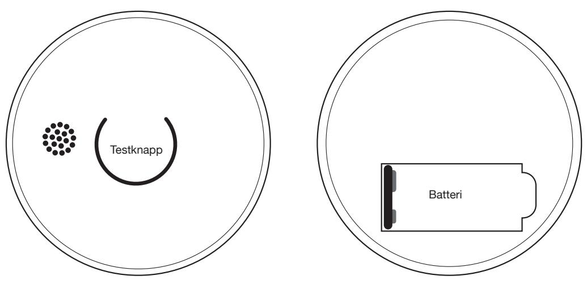