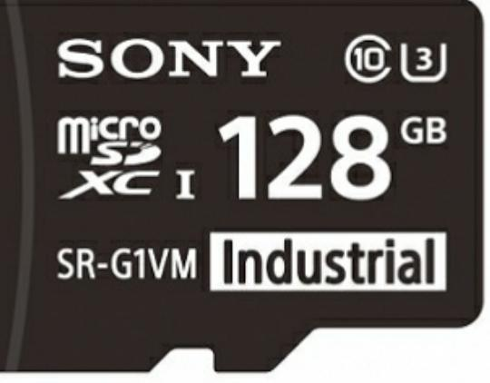
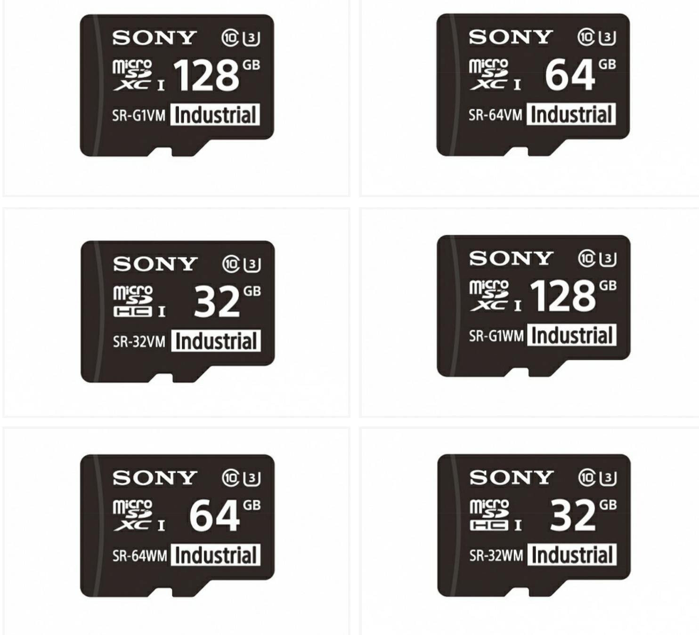

© 2004 - 2020 Sony Corporation. All rights reserved. Reproduction in whole or in part without written permission is prohibited. Features and specifications are subject to change without notice. The values for mass and dimension are approximate. All trademarks are the property of their respective owners.

1

# SD Cards For IP Security Cameras

Sony's Edge Storage Solution for IP Security Cameras

## Overview **32GB, 64GB and 128GB SR-VM and SR-WM series microSD memory cards. Longer lifespan and card diagnostics make microSD card ideal for heavy-use IP security camera recordings.**

Sony's longer-life SR-VM and SR-WM series microSD memory cards are ideal for use with IP security cameras. Since microSD cards are overwritten repeatedly during video recording on IP security cameras, their lifespan tends to be shorter compared to other applications. Sony's micoSD cards incorporate high endurance flash memory designed to last longer than low-cost consumer microSD cards. Combined with maintenance notification safeguards and a card diagnostic tool, the cards are ideal for heavy-duty use.

The SR-VM series cards come in three sizes: 32GB(SR-32VMA & SR-32VM), 64GB(SR-64VMA & SR-64VM) and 128GB(SR-G1VMA & SR-G1VM) and are designed for use at regular operational temperatures (-25ºC~85ºC).

The SR-WM series cards come in three sizes: 32GB(SR-32WMA & SR-32WM), 64GB(SR-64WMA & SR-64WM) and 128GB(SR-G1WMA & SR-G1WM) and are designed for use at wider operational temperatures (-45ºC~85ºC).

## **Longer lifespan professional microSD cards**

Sony has combined its expertise in flash memory cards with its camera experience to create a microSD card ideal for IP security camera applications. Adoption of high endurance MLC NAND flash memory extends the card's lifespan by approximately 10 times longer than consumer microSD card with TLC NAND flash memory*.

* This estimation is based on the condition where the recording video bit rate is 4Mbps. The actual lifespan may vary depending on the IP security camera used and other factors.

## **Lifespan Notification* safeguards against sudden stops of recording**

Lifespan Notification safeguards against sudden stops of recording due to reaching to the limit of rewriting cycles when it's time to be replaced.

* This function works with compatible IP security camera products only.

#### **Card diagnostic tool for trouble-shooting**

The card diagnostic tool (SD Card Info Viewer) is useful for trouble-shooting with the cards. The free to download software allows you to check the card status in detail when you encounter recording errors. The software is available when you purchase the SR-VM and SR-WM series microSD cards and can be downloaded from a Sony's support site*.

* Download from: http://www.sony.net/Products/memorycard/en_us/ipcamsd/dl.html

© 2004 - 2020 Sony Corporation. All rights reserved. Reproduction in whole or in part without written permission is prohibited. Features and specifications are subject to change without notice. The values for mass and dimension are approximate. All trademarks are the property of their respective owners.

Specifications Specifications

| Capacity                | Regular	Operation	Temperature	Model: SR-32VMA	&	SR-32VM:	32GB SR-64VMA	&	SR-64VM:	64GB SR- G1VMA	&	SR- G1VM:	128GB Wide	Operation	Temperature	Model |
|-------------------------|-----------------------------------------------------------------------------------------------------------------------------------------------------------------|
|                         | SR-32WMA	&	SR-32WM:	32GB SR-64WMA	&	SR-64WM:	64GB SR- G1WMA	&	SR- G1WM:	128GB                                                                             |
| Speed	Class             | Class10                                                                                                                                                         |
| UHS	Bus	Speed           | UHS-I	(SDR104)                                                                                                                                                  |
| UHS	Speed	Class         | U3                                                                                                                                                              |
| Video	Speed	Class       | Not 	supported                                                                                                                                                  |
| Seq.	Read	speed	(Max.)  | 95MB/s                                                                                                                                                          |
| Seq.	Write	speed	(Max.) | 60MB/s                                                                                                                                                          |
|                         |                                                                                                                                                                 |
| Lifespan	Notification   | ✔                                                                                                                                                               |
|                         | Regular	Operation	Temperature	Model:	-25℃ ~+85℃                                                                                                              |
| Operation	Temp .        | Wide	Operation	Temperature	Model:	-40℃~ +85℃                                                                                                                 |
|                         | SR-32VMA	&	SR-32VM:	68TB                                                                                                                                        |
|                         | SR-64VMA	&	SR-64VM:	137TB SR- G1VMA	&	SR- G1VM:	274TB                                                                                                        |
| TBW                     | SR-32WMA	&	SR-32WM:	68TB SR-64WMA	&	SR-64WM:	137TB SR- G1WMA	&	SR- G1WM:	274TB                                                                            |
| Accessory               | SR-32VMA	&	SR-64VMA	&	SR- G1VMA	&	SR 32WMA	&	SR-64WMA	&	SR- G1WMA:	SD	card adapter                                                                        |

## Notes

*1 *Only difference between SR-xxA and SR-xx is accessory (SD card adapter)

© 2004 - 2020 Sony Corporation. All rights reserved. Reproduction in whole or in part without written permission is prohibited. Features and specifications are subject to change without notice. The values for mass and dimension are approximate. All trademarks are the property of their respective owners.

Gallery

