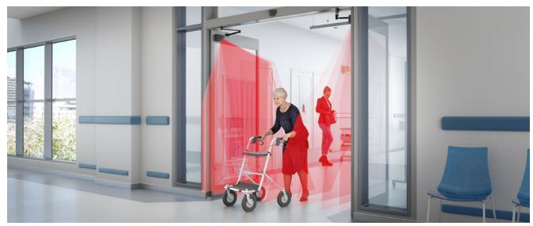
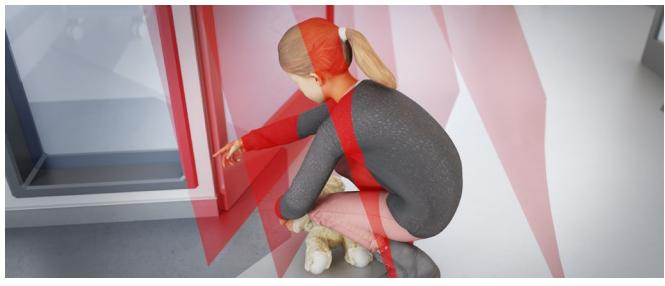
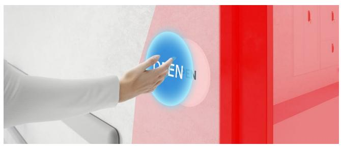
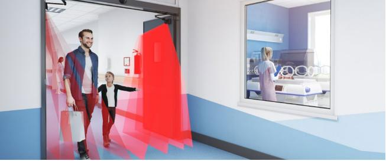
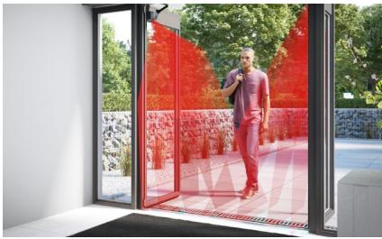
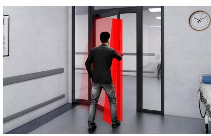
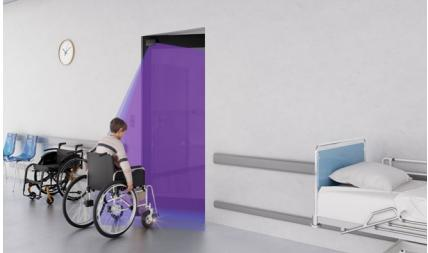
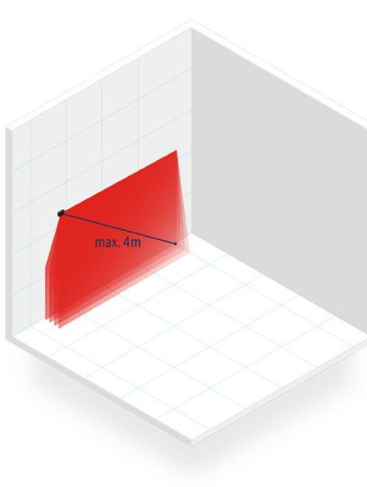
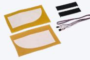

PRODUKTBLAD

**SV**

# **LZR®-FLATSCAN 3D SW**

Säkerhetssensor för svängdörrar

# **APPLIKATIONER TEKNIK ÖVERENSSTÄMMELSE**

# **BESKRIVNING VIDEO**

**LZR®-FLATSCAN 3D SW** är en säkerhetssensor för svängdörrar. Tack vare den laserbaserade time-of-flight-tekniken täcker det volymetriska detekteringsområdet hela dörrens öppningsområde, vilket säkerställer ökad komfort och säkerhet för användarna. Helt beröringsfri. All kontakt med användarna kan undvikas eftersom man slipper plötsliga och oväntade rörelser från dörrbladen. Gångjärnsområdet och dörrtröskelområdet är bättre skyddade för att undvika risken för kontakt.

Laser

E

R

L

A

U

Se produktvideon på vår youtube-kanal **BEA Sensors Europe** https://bit.ly/3f8Z5IS

# **Hög komfort för alla användare**

Om en person eller ett objekt befinner sig i gången säkerställer de fyra laserridåerna att inga plötsliga dörrörelser sker. All risk för kontakt med dörren kan undvikas, oavsett typ av svängdörr.

**Minimerar riskzonerna**

De högupplösta volymetriska ridåerna på LZR®-FLATSCAN 3D SW känner av såväl fingrar som objekt i hela detekteringsområdet. Dessustom är hela gångjärnsområdet och dörrtröskelområdet skyddat.

# **Hygienisk beröringsfri öppning**

Tack vare en tredje utgång har LZR®-FLATSCAN 3D SW även en aktiveringsfunktion som möjliggör hygienisk öppning samt öppning på kommando. Du kan välja mellan att skapa upp till två tryckknappar eller att använda ridåerna för att aktivera dörren, utan att behöva dra fram ny el.

# **En bakteriefri säkerhetslösning**

LZR®-FLATSCAN 3D SW är en hygienisk säkerhetslösning eftersom den inte kräver installation av mekaniskt fingerklämskydd. Här krävs varken underhåll eller rengöring för att bekämpa spridningen av bakterier.

### **TILLÄMPNINGAR**

### **INSTALLATION TILLBEHÖR**

Oberoende av golvtyp Utökat säkerhetsområde vid stängning Öppningsfunktion när någon närmar sig dörren

### **TEKNISKA DATA**

| • Detekteringsfältets storlek definieras genom |
|------------------------------------------------|
| två enkla handrörelser. Sensorn startar auto   |
| matiskt en öppningscykel för att läsa av och   |
| registrera miljön på några sekunder.           |
|                                                |

- Snabb och automatisk registrering
- Enkel att eftermontera eller kombinera me LZR®-FLATSCAN SW *. Tillbehör för glasdörr

| Teknik                                        | LASER-scanner, time-of-flight-mätning                                                                                                                                 |
|-----------------------------------------------|-----------------------------------------------------------------------------------------------------------------------------------------------------------------------|
| Detekteringssätt:                             | Närvaro                                                                                                                                                               |
| Max. detekteringsfält                         | 4 m (diagonalt) med 2 procents reflektivitet (dvs.: vid B = 1,5 m -> max. H = 3,7 m)                                                                                  |
| Öppningsvinkel                                | Säkerhet dörrblad: 80° / Säkerhet, gångjärnsområde: 20°                                                                                                               |
| Vinkelupplösning                              | Ridå 1: 0,2° / Ridå 2: 1° / Ridå 3: 1.7° / Ridå 4: 2,5°                                                                                                               |
| Typ. min. objektstorlek                       | 2 cm @ 4 m i ridå C1                                                                                                                                                  |
| Testföremål                                   | 700 mm × 300 mm × 200 mm (testkropp CA enligt EN16005 & DIN18650)                                                                                                     |
| Emissionsegenskaper IR LASER               | Våglängd 905 nm; max. effekt utgående puls 25 W; Klass 1                                                                                                              |
| Försörjningsspänning                          | 12-24 V DC ± 15 %                                                                                                                                                     |
| Effektförbrukning                             | ≤ 2 W                                                                                                                                                                 |
| Responstid                                    | Typ. <120 ms / Max. 220 ms (ridå 2)                                                                                                                                   |
| Utgång Max. brytspänning Max. brytström | 3 elektroniska reläer (galvanisk isolering - polaritetsoberoende) 42 V AC/DC 100 mA                                                                             |
| LED-signaler                                  | 1 RGB-lysdiod : detekterings-/utgångsstatus                                                                                                                           |
| Mått                                          | 145 mm (L) × 88 mm (H) × 60 mm (D) (monteringsstycke + 7 mm)                                                                                                          |
| Material - Färg                               | PC/ASA - Svart - Aluminium - Vit                                                                                                                                      |
| Lutningsvinklar                               | +2° till +5° (utan monteringsstycke)                                                                                                                                  |
| Skyddsgrad                                    | IP44 (EN 60529)                                                                                                                                                       |
| Temperaturintervall                           | -25 °C till +60 °C                                                                                                                                                    |
| Luftfuktighet                                 | 0–95 % icke-kondenserande                                                                                                                                             |
| Vibrationer                                   | < 2 G                                                                                                                                                                 |
| Överensstämmelse                              | EN 12978; EN ISO 13849-1 Pl "d"/ CAT2; IEC 60825-1; EN 60950-1; EN 61000-6-2; EN 61000-6-3; EN 62061 SIL 2; DIN 18650-1 (testkropp CA); EN 16005 (testkropp CA) |

Specifikationerna kan ändras utan föregående meddelande.

Alla värden är uppmätta under specifika förhållanden och med en specifik temperatur på 25 °C.

* Alla funktioner som är knutna till den tredje utgången är endast tillgängliga med motsvarande kabel om LZR®-FLATSCAN 3D SW har installerats som master.

**DISCLAIMER** Information is supplied upon the condition that the persons receiving it will make their own determination as to its suitability for their purposes prior to use. In no event will BEA be responsible for damages of any nature whatsoever resulting from the use of or reliance upon information from this document or the products to which the information refers./BEA has the right without liability to change descriptions and specifications at any time.

**WWW.BEASENSORS.COM**

BEA s.a. / LIEGE Science Park / Allée des Noisetiers 5 / 4031 Angleur • BELGIUM T +32 (0)4 361 65 65 / F +32 (0)4 361 28 58 / E info-eu@beasensors.com