i

# R1520

Industrial Dual SIM Cellular VPN Router

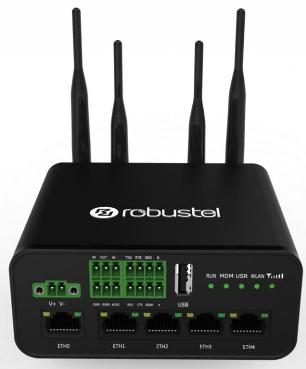


Guangzhou Robustel LTD www.robustel.com


#### **About This Document**

This document provides hardware and software information of the Robustel High-speed intelligent LTE router R1520, including introduction, installation, configuration and operation.

**Copyright© 2020 Guangzhou Robustel LTD All rights reserved.**

**Trademarks and Permissions**

are trademark of Guangzhou Robustel LTD. All other trademarks and trade

names mentioned in this document are the property of their respective owners.

#### **Disclaimer**

No part of this document may be reproduced in any form without the written permission of the copyright owner. The contents of this document are subject to change without notice due to continued progress in methodology, design and manufacturing. Robustel shall have no liability for any error or damage of any kind resulting from the use of this document.

**Technical Support** Tel: +86-20-29019902 Fax: +86-20-82321505

Email: [support@robustel.com](mailto:support@robustel.com) Web: [www.robustel.com](http://www.robustel.com/)

#### **Important Notice**

Due to the nature of wireless communications, transmission and reception of data can never be guaranteed. Data may be delayed, corrupted (i.e., have errors) or be totally lost. Although significant delays or losses of data are rare when wireless devices such as the router is used in a normal manner with a well-constructed network, the router should not be used in situations where failure to transmit or receive data could result in damage of any kind to the user or any other party, including but not limited to personal injury, death, or loss of property. Robustel accepts no responsibility for damages of any kind resulting from delays or errors in data transmitted or received using the router, or for failure of the router to transmit or receive such data.

#### **Safety Precautions**

#### **General**

- The router generates radio frequency (RF) power. When using the router, care must be taken on safety issues related to RF interference as well as regulations of RF equipment.
- Do not use your router in aircraft, hospitals, petrol stations or in places where using cellular products is prohibited.
- Be sure that the router will not be interfering with nearby equipment. For example: pacemakers or medical equipment. The antenna of the router should be away from computers, office equipment, home appliance, etc.
- An external antenna must be connected to the router for proper operation. Only uses approved antenna with the router. Please contact authorized distributor on finding an approved antenna.
- Always keep the antenna with minimum safety distance of 20 cm or more from human body. Do not put the antenna inside metallic box, containers, etc.
- RF exposure statements
	- 1. For mobile devices without co-location (the transmitting antenna is installed or located more than 20cm away from the body of user and nearby person)
- FCC RF Radiation Exposure Statement
	- 1. This Transmitter must not be co-located or operating in conjunction with any other antenna or transmitter.
	- 2. This equipment complies with FCC RF radiation exposure limits set forth for an uncontrolled environment. This equipment should be installed and operated with a minimum distance of 20 centimeters between the radiator and human body.

**Note**: Some airlines may permit the use of cellular phones while the aircraft is on the ground and the door is open. Router may be used at this time.

#### **Using the Router in Vehicle**

- Check for any regulation or law authorizing the use of cellular devices in vehicle in your country before installing the router.
- The driver or operator of any vehicle should not operate the router while driving.
- Install the router by qualified personnel. Consult your vehicle distributor for any possible interference of electronic parts by the router.
- The router should be connected to the vehicle's supply system by using a fuse-protected terminal in the vehicle's fuse box.
- Be careful when the router is powered by the vehicle's main battery. The battery may be drained after extended period.


#### **Protecting Your Router**

To ensure error-free usage, please install and operate your router with care. Do remember the following:

- Do not expose the router to extreme conditions such as high humidity / rain, high temperature, direct sunlight, caustic / harsh chemicals, dust, or water.
- Do not try to disassemble or modify the router. There is no user serviceable part inside and the warranty would be void.
- Do not drop, hit or shake the router. Do not use the router under extreme vibrating conditions.
- Do not pull the antenna or power supply cable. Attach/detach by holding the connector.
- Connect the router only according to the instruction manual. Failure to do it will void the warranty.
- In case of problem, please contact authorized distributor.


#### **Regulatory and Type Approval Information**

#### **Table 1:** Directives

| 2011/65/EU | The European RoHS2.0 2011/65/EU Directive was issued by the European parliament<br>and the European Council on 1 July 2011 on the restriction of the use of certain<br>Hazardous substances in electrical and electronic equipment. |  |
|------------|-------------------------------------------------------------------------------------------------------------------------------------------------------------------------------------------------------------------------------------|--|
| 2012/19/EU | The European WEEE 2012/19/EU Directive was issued by the European parliament<br>and the European Council on 24 July 2012 on waste electrical and electronic equipment.                                                              |  |
| 2013/56/EU | The European 2013/56/EU Directive is a battery Directive which published in the EU official gazette<br>on 10 December 2013. The button battery used in this product conforms to the standard of<br>2013/56/EU directive.            |  |

#### **Table 2:** Standards of the electronic industry of the People's Republic of China

| SJ/T<br>11363- | The electronic industry standard of the People's Republic of China SJ/T 11363-2006 "Requirements      |
|----------------|-------------------------------------------------------------------------------------------------------|
| 2006           | for Concentration Limits for Certain Toxic and Hazardous Substances in Electronic Information         |
|                | Products" issued by the ministry of information industry of the People's Republic of China on         |
|                | November 6, 2006, stipulates the maximum allowable concentration of toxic and hazardous               |
|                | substances in electronic information products.                                                        |
|                | Please see Table 3 for an overview of toxic or hazardous substances or elements that might be         |
|                | contained in product parts in concentrations above the limits defined by SJ/T 11363-2006.             |
| SJ/T<br>11364- | The electronic industry standard of the People's Republic of China SJ/T 11364-2014 "Labeling          |
| 2014           | Requirements for Restricted Use of Hazardous Substances in Electronic and Electrical Products"        |
|                | issued by the ministry of Industry and information technology of the People's Republic of China on    |
|                | July 9, 2014, stipulates the Labeling requirements of hazardous substances in electronic and          |
|                | electrical products, environmental protection use time limit and whether it can be recycled.          |
|                | This standard is applicable to electronic and electrical products sold within the territory of the    |
|                | People's Republic of China, and can also be used for reference in the logistics process of electronic |
|                | and electrical products.                                                                              |
|                | The orange logo below is used for Robustel products:                                                  |
|                | Indicates its warning attribute, that is, some hazardous substances are contained in the product.     |
|                | The "10" in the middle of the legend refers to the environment-friendly Use Period (EFUP) * of        |
|                | electronic information product, which is 10 years. It can be used safely during the environment       |
|                | friendly Use Period. After the environmental protection period of use, it should enter the recycling  |
|                | system.                                                                                               |
|                |                                                                                                       |
|                | *The term of environmental protection use of electronic information products refers to the term       |
|                | during which the toxic and hazardous substances or elements contained in electronic information       |
|                | products will not be leaked or mutated and cause serious pollution to the environment or serious      |
|                | damage to people and property under normal conditions of use.                                         |


#### **Table 3:** Toxic or Hazardous Substances or Elements with Defined Concentration Limits

| Name of the                          | Hazardous Substances |      |      |          |       |        |        |       |       |        |
|--------------------------------------|----------------------|------|------|----------|-------|--------|--------|-------|-------|--------|
| Part                                 | (Pb)                 | (Hg) | (Cd) | (Cr(VI)) | (PBB) | (PBDE) | (DEHP) | (BBP) | (DBP) | (DIBP) |
| Metal parts                          | o                    | o    | o    | o        | -     | -      | -      | -     | -     | -      |
| Circuit<br>modules                   | o                    | o    | o    | o        | o     | o      | o      | o     | o     | o      |
| Cables<br>and<br>cable<br>assemblies | o                    | o    | o    | o        | o     | o      | o      | o     | o     | o      |
| Plastic<br>and<br>polymeric<br>parts | o                    | o    | o    | o        | o     | o      | o      | o     | o     | o      |

o:

Indicates that this toxic or hazardous substance contained in all of the homogeneous materials for this part is below the limit requirement in RoHS2.0.

X:

Indicates that this toxic or hazardous substance contained in at least one of the homogeneous materials for this part *might exceed* the limit requirement in RoHS2.0.

-:

Indicates that it does not contain the toxic or hazardous substance.


#### **Document History**

Updates between document versions are cumulative. Therefore, the latest document version contains all updates made to previous versions.

| Date          | Firmware Version | Document Version | Change Description |
|---------------|------------------|------------------|--------------------|
| Jun. 11, 2020 | 3.1.0            | v 1.0.0          | Initial release    |


| Chapter 1 |       | Product Overview  10                  |  |  |  |  |  |
|-----------|-------|---------------------------------------|--|--|--|--|--|
| 1.1       |       | Introduction10                        |  |  |  |  |  |
| 1.2       |       | Package Contents10                    |  |  |  |  |  |
| 1.3       |       | Specifications 13                     |  |  |  |  |  |
| 1.4       |       | Dimensions14                          |  |  |  |  |  |
| Chapter 2 |       | Hardware Installation 15              |  |  |  |  |  |
| 2.1       |       | Definition of Power Interface15       |  |  |  |  |  |
| 2.2       |       | Interface Definition of 2 * 3 3.5mm15 |  |  |  |  |  |
| 2.3       |       | Interface Definition of 2 * 4 3.5mm16 |  |  |  |  |  |
| 2.4       |       | LED indicator 17                      |  |  |  |  |  |
| 2.5       |       | USB Interface18                       |  |  |  |  |  |
| 2.6       |       | Reset Button19                        |  |  |  |  |  |
| 2.7       |       | Ethernet Ports19                      |  |  |  |  |  |
| 2.8       |       | Insert or Remove SIM Card 20          |  |  |  |  |  |
| 3.2       |       | Attach External Antenna (SMA Type)21  |  |  |  |  |  |
| 3.3       |       | Mount the Router 22                   |  |  |  |  |  |
| 3.4       |       | Connect the Router to a Computer24    |  |  |  |  |  |
| 3.5       |       | Power Supply24                        |  |  |  |  |  |
| 3.6       |       | DI/DO Interface 25                    |  |  |  |  |  |
| 3.7       |       | AI Interface26                        |  |  |  |  |  |
| Chapter 3 |       | Initial Configuration  27             |  |  |  |  |  |
| 3.1       |       | Configure the PC27                    |  |  |  |  |  |
| 3.2       |       | Factory Default Settings30            |  |  |  |  |  |
| 3.3       |       | Log in the Router30                   |  |  |  |  |  |
| 3.4       |       | Control Panel31                       |  |  |  |  |  |
| Chapter 4 |       | Router Configuration 33               |  |  |  |  |  |
| 4.1       |       | Status33                              |  |  |  |  |  |
|           | 4.1.1 | System Information 33                 |  |  |  |  |  |
|           | 4.1.2 | Internet Status34                     |  |  |  |  |  |
|           | 4.1.3 | LAN Status34                          |  |  |  |  |  |
| 4.2       |       | Interface 35                          |  |  |  |  |  |
|           | 4.2.1 | Link Manager35                        |  |  |  |  |  |
|           | 4.2.2 | LAN 46                                |  |  |  |  |  |
|           | 4.2.3 | Ethernet50                            |  |  |  |  |  |
|           | 4.2.4 | Cellular51                            |  |  |  |  |  |
|           | 4.2.5 | WiFi57                                |  |  |  |  |  |
|           | 4.2.6 | USB 65                                |  |  |  |  |  |
|           | 4.2.7 | DI/DO66                               |  |  |  |  |  |
|           | 4.2.8 | AI70                                  |  |  |  |  |  |
|           | 4.2.9 | Serial Port 72                        |  |  |  |  |  |
| 4.3       |       | Network77                             |  |  |  |  |  |
|           | 4.3.1 | Route 77                              |  |  |  |  |  |
|           | 4.3.2 | Firewall 79                           |  |  |  |  |  |
|           | 4.3.3 | IP Passthrough 84                     |  |  |  |  |  |
|           |       |                                       |  |  |  |  |  |

| 4.4       |        | VPN85                                       |  |  |  |  |
|-----------|--------|---------------------------------------------|--|--|--|--|
|           | 4.4.1  | IPsec85                                     |  |  |  |  |
|           | 4.4.2  | OpenVPN 93                                  |  |  |  |  |
|           | 4.4.3  | GRE 106                                     |  |  |  |  |
| 4.5       |        | Services 107                                |  |  |  |  |
|           | 4.5.1  | Syslog107                                   |  |  |  |  |
|           | 4.5.2  | Event108                                    |  |  |  |  |
|           | 4.5.3  | NTP 112                                     |  |  |  |  |
|           | 4.5.4  | SMS113                                      |  |  |  |  |
|           | 4.5.5  | Email 114                                   |  |  |  |  |
|           | 4.5.6  | DDNS115                                     |  |  |  |  |
|           | 4.5.7  | SSH117                                      |  |  |  |  |
|           | 4.5.8  | GPS (Optional) 117                          |  |  |  |  |
|           | 4.5.9  | Web Server 123                              |  |  |  |  |
|           | 4.5.10 | Advanced 124                                |  |  |  |  |
| 4.6       |        | System125                                   |  |  |  |  |
|           | 4.6.1  | Debug125                                    |  |  |  |  |
|           | 4.6.2  | Update 126                                  |  |  |  |  |
|           | 4.6.3  | App Center126                               |  |  |  |  |
|           | 4.6.4  | Tools127                                    |  |  |  |  |
|           | 4.6.5  | Profile130                                  |  |  |  |  |
|           | 4.6.6  | User Management132                          |  |  |  |  |
| Chapter 5 |        | Configuration Examples 134                  |  |  |  |  |
| 5.1       |        | Cellular 134                                |  |  |  |  |
|           | 5.1.1  | Cellular Dial-Up134                         |  |  |  |  |
|           | 5.1.2  | SMS Remote Control136                       |  |  |  |  |
| 5.2       |        | VPN Configuration Example 138               |  |  |  |  |
|           | 5.2.1  | IPsec VPN138                                |  |  |  |  |
|           | 5.2.2  | OpenVPN 142                                 |  |  |  |  |
|           | 5.2.3  | GRE VPN144                                  |  |  |  |  |
| Chapter 6 |        | Introductions for CLI 146                   |  |  |  |  |
| 6.1       |        | What Is CLI146                              |  |  |  |  |
| 6.2       |        | How to Configure the CLI 148                |  |  |  |  |
| 6.3       |        | Commands Reference 148                      |  |  |  |  |
| 6.4       |        | Quick Start with Configuration ExampleS 149 |  |  |  |  |
|           |        | Glossary 156                                |  |  |  |  |


# Chapter 1 Product Overview

# 1.1 Introduction

The Robustel industrial dual SIM cellular VPN router (R1520) is a rugged cellular router can support 2G, 3G, and 4G LTE Cat 4 networks. It provides high-speed wireless network bandwidth for devices through wireless connections to ensure stable wireless network connections.

R1520 is a powerful router developed from RobustOS, a Robustel self-developed and Linux-based operating system which is designed to be used in Robustel devices. The RobustOS includes basic networking features and protocols providing customers with a very good customized user experience, which is more diverse, convenient, and practical. Meanwhile, Robustel offers a Software Development Kit (SDK) for partners and customers to allow additional customization by using C. It also provides rich Apps to meet fragmented IoT market demands.

# 1.2 Package Contents

Before installing your R1520 Router, verify the kit contents as following. **Note**: The following pictures are for illustration purposes only, not based on their actual sizes.

- 1 x Robustel R1520 High-speed intelligent LTE router
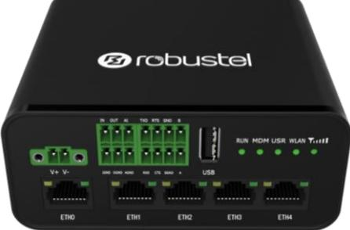

- 1 x 2-pin 3.5 mm male terminal block with lock for power supply


- 1 x 2*4-pin 3.5 mm male terminal block for serial port


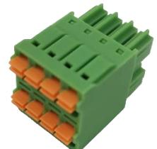

- 1 x 2*3-pin 3.5 mm male terminal block for DI/DO/AI interface


- 1 x SMA-J cellular antenna (rubber antenna)


- 1 x RP-SMA-J WiFi antenna (rubber antenna)
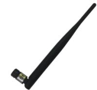

- Ethernet cable
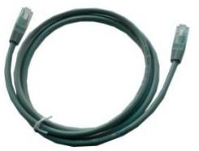

- 1 x SIM Card Sticker


#### **Optional Accessories** (sold separately)

- SMA-J cellular antenna (rubber antenna or Magnet antenna is optional) rubber antenna Magnet antenna


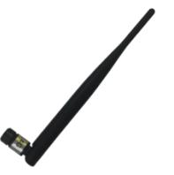


- RP-SMA-J WiFi antenna (rubber antenna or Magnet antenna is optional) rubber antenna Magnet antenna
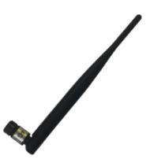

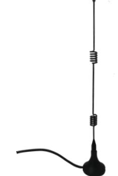

- SMA-J GPS antenna (Magnetic or adhesive is optional)


- 35 mm DIN Rail mounting kit


- AC/DC power adapter (12V DC,1.5 A;EU/US/UK/AU plug optional)


# 1.3 Specifications

#### Cellular Interface

- Number of antennas: 2 (MAIN + AUX)
- Connector: SMA-K
- SIM: 2 , Standard SIM or eSIM
- Standards: FDD LTE/TDD LTE, backward compatible to 2G/3G

#### Ethernet Interface

- Number of ports: 5 x 10/100 Mbps (It can be configured as 5x LAN or 4 x LAN + 1 x WAN)
- ETH0 port: supports 802.3at PD function
- Magnet isolation protection: 1.5 KV

#### WiFi Interface

- Number of antennas: 2 (WiFi1 + WiFi2)
- Connector: RP-SMA-K
- Standards: 802.11b/g/n, 2*2 MIMO, supports AP and Client modes
- Frequency bands: 2.4GHz
- Security: Open、WPA、WPA2、WEP
- Encryption: AES、TKIP、WEP64
- Data speed: Maximum rate is 300 Mbps

**GPS Interface** (Optional, depending on the cellular module)

- Number of antennas: 1
- Connector: SMA-K, 50 ohm characteristic impedance
- Positioning technology: GPS, QZSS, GLONASS, Galileo, BeiDou

#### **Serial Interface**

- Number of ports: 1 x RS-232 and 1 x RS-485
- Connector: 2 *4-pin 3.5 mm female socket
- ESD protection: ±8 KV Air
- RS-232: TxD, RxD, RTS, CTS, SGND
- RS-485: Data+ (A), Data- (B)

#### DI/DO

- Type: 1 x DI (wet contact) + 1 x DO (wet contact)
- Connector: 2*3-pin 3.5 mm female socket
- Isolation: 3KVDC
- Absolute maximum : "V+"+ 30 V DC(DI, 30 V DC(DO)
- Maximum input current of DI: 10 mA
- Maximum input current of DO: 100 mA

#### Analog Input

- Type: 1 x AI
- Connector: 2*3-pin 3.5 mm female socket(Shared with DI / DO)


Measuring range: 4 ~ 20mA / 0 ~ 24V

#### Others

- 1 x Reset button (Tact Switch)
- 1 x 480 Mbps high-speed USB 2.0 interface (host mode), Type A, 5V / 500 mA
- LED indicators 1 x RUN, 1 x Modem, 1 x USR, 1 x WiFi, 1 x RSSI

#### Power Supply and Consumption

- Connector: 2-pin 3.5 mm female socket with lock
- Input voltage: 9 to 36V DC
- Power consumption: Idle: 100 mA@12 V;
	- Data link: 1000 mA (peak) @12 V

#### Physical Characteristics

- Ingress protection: IP30
- Housing & Weight: Plastic, 250 g
- Dimensions: 105mm (length) x 90mm(width) x 46mm(thickness)
- Installations: Desktop, wall mounting or DIN rail mounting (Wall mounting and Din rail mounting installation requires additional installation accessories)
- Operating Temperature: -25~+70 °C
- Storage Temperature: -40~+85 °C
- Relative Humidity: 5~95% RH

# 1.4 Dimensions

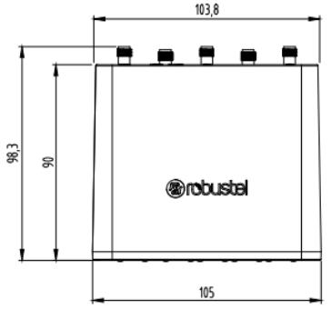

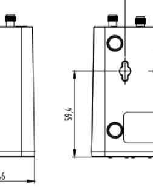

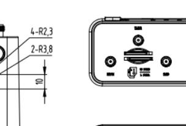

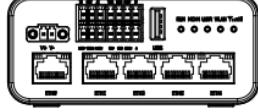


# Chapter 2 Hardware Installation

# 2.1 Definition of Power Interface

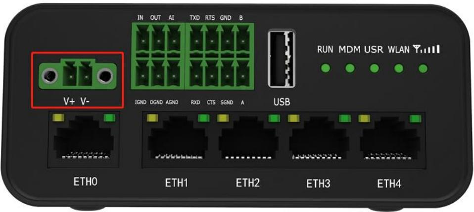

| PIN | Description | Note     |
|-----|-------------|----------|
| 1   | V+          | Positive |
| 2   | V-          | Negative |

# 2.2 Interface Definition of 2 * 3 3.5mm

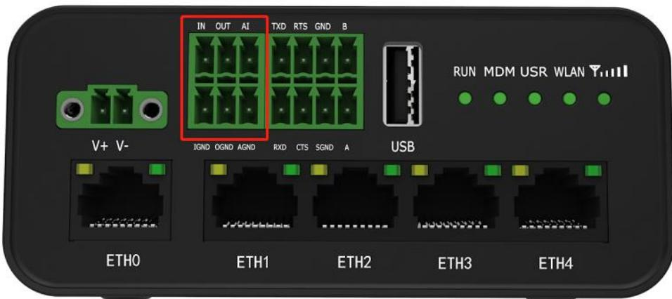


| PIN | DI   | DO   | AI   | Note                          |
|-----|------|------|------|-------------------------------|
| 1   | IN   |      | --   | Digital input positive        |
| 2   | --   | OUT  | --   | Digital output positive       |
| 3   | --   | --   | AI   | Analog input                  |
| 4   | IGND | --   | --   | Digital input negative        |
| 5   | --   | OGND | --   | Digital output negative       |
| 6   | --   | --   | AGND | Analog input signal<br>ground |

# 2.3 Interface Definition of 2 * 4 3.5mm

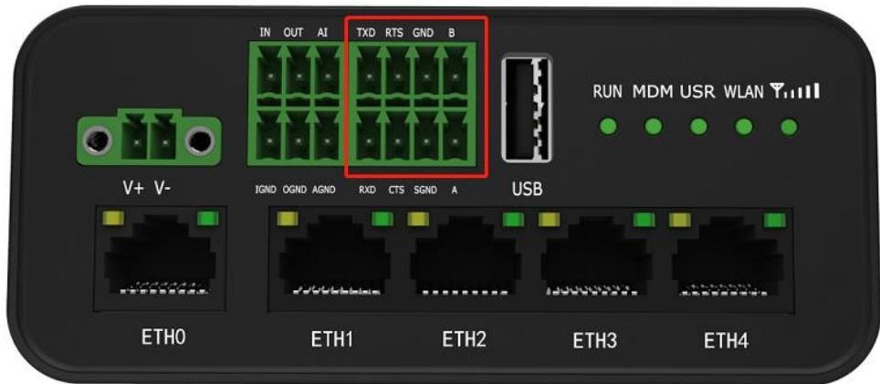

| PIN | RS-232 | RS-485 | Note                |
|-----|--------|--------|---------------------|
| 1   | TXD    | --     | Router <br>Device  |
| 2   | RTS    | --     | Router <br>Device  |
| 3   | --     | GND    | RS485 signal ground |
| 4   |        | B      | RS485 Data+ (B)     |
| 5   | RXD    | --     | Router <br>Device  |
| 6   | CTS    | --     | Router <br>Device  |
| 7   | SGND   | --     | RS232 signal ground |
| 8   | --     | A      | RS485 Data+ (A)     |


# 2.4 LED indicator


| Name |             | Color | Status       | Description                                          |  |
|------|-------------|-------|--------------|------------------------------------------------------|--|
| RUN  |             | Green | On, solid    | Router is powered on (System is initializing)        |  |
|      |             |       | On, blinking | Router starts operating                              |  |
|      |             |       | Off          | Router is powered off                                |  |
| MDM  |             | Green | On, solid    | Link connection is working                           |  |
|      |             |       | On, blinking | Data is sent and received.                           |  |
|      |             |       | Off          | Link connection is not working                       |  |
|      | USR-OpenVPN | Green | On, solid    | OpenVPN connection is established                    |  |
| USR  |             |       | Off          | OpenVPN connection is not established                |  |
|      | USR-IPsec   | Green | On, solid    | IPsec connection is established                      |  |
|      |             |       | Off          | IPsec connection is not established                  |  |
| RSSI |             | Green | On, solid    | Signal level: Best signal level                      |  |
|      |             |       |              | Wireless module : 21-31 dB ( High Signal strength)   |  |
|      |             | Green | On, blinking | Signal level: Average signal level                   |  |
|      |             |       |              | Wireless module : 11-20 dB ( Medium Signal strength) |  |
|      |             | Green | Off          | Signal level: Abnormal signal level                  |  |
|      |             |       |              | Wireless module : 1-10 dB ( Low Signal strength)     |  |
|      |             | Green | Off          | No signal                                            |  |
| WLAN |             | Green | On, solid    | WiFi is enabled and working properly                 |  |
|      |             | Green | Off          | WiFi is disabled or not working properly             |  |

**Note:** 1. click Services > Advanced > system > System Settings > Custom LED Indicator type to set the display type of USR LED.

- 2. When the LEDs start blinking one by one, the WLAN indicator will not turn on and off.


# 2.5 USB Interface

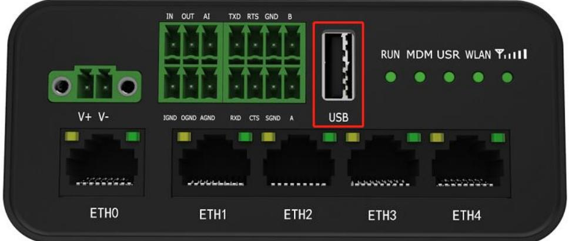

| Function | Operation                                                                           |
|----------|-------------------------------------------------------------------------------------|
|          | The USB interface can be used for batch firmware upgrades, but it cannot send       |
|          | or receive data with slave devices connected to the USB interface. The user can     |
| Firmware | insert a USB storage device, such as a U disk or a hard disk, at the USB interface. |
| upgrade  | If there is a configuration file or router firmware in the USB storage device, the  |
|          | router will automatically update the configuration file or firmware. For details,   |
|          | please refer to "4.2.6 USB".                                                        |


# 2.6 Reset Button

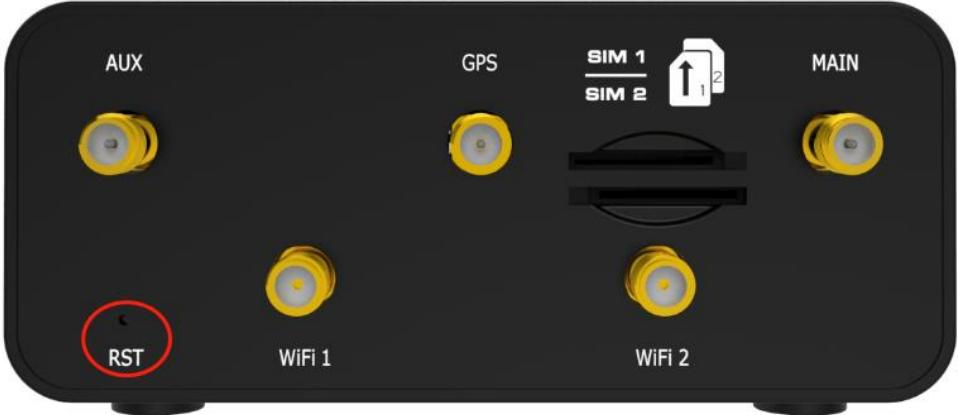

| Function           | Operation                                                                                       |
|--------------------|-------------------------------------------------------------------------------------------------|
| Reboot             | Press and hold the RST button for 2 to 7 seconds under the operating status.                    |
| Restore to factory | Wait for 0~20 seconds after powering up the router, press and hold the RST button with a        |
| default settings   | pointed bar until all five LEDs start blinking one by one, and release the button to return the |
|                    | router to factory defaults.                                                                     |

# 2.7 Ethernet Ports

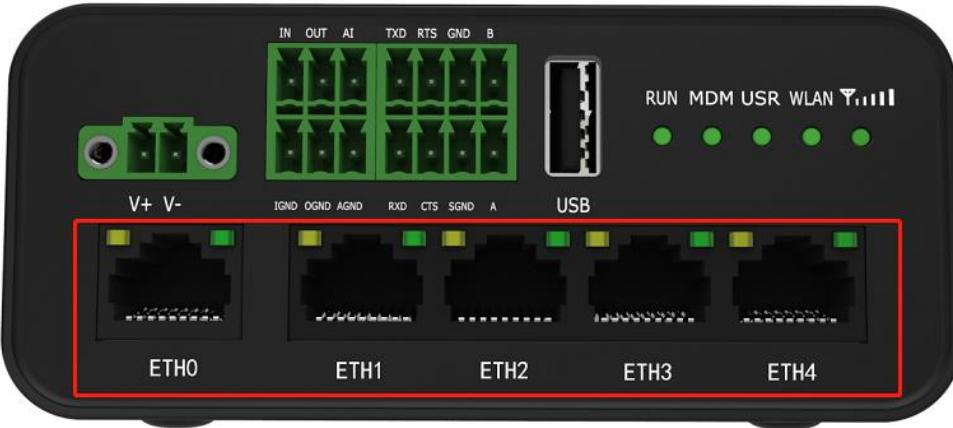


There are five Ethernet ports on R1520, including ETH0 (POE), ETH1, ETH2, ETH3 and ETH4. Each has two LED indicators. The green one is a link indicator but the yellow one doesn't mean anything. For details about status, see the table below.

| Indicator      | Status       | Description                   |
|----------------|--------------|-------------------------------|
| Link indicator | On, solid    | Connection is established     |
| (Green)        | On, blinking | Data is being transferred     |
|                | Off          | Connection is not established |

# 2.8 Insert or Remove SIM Card

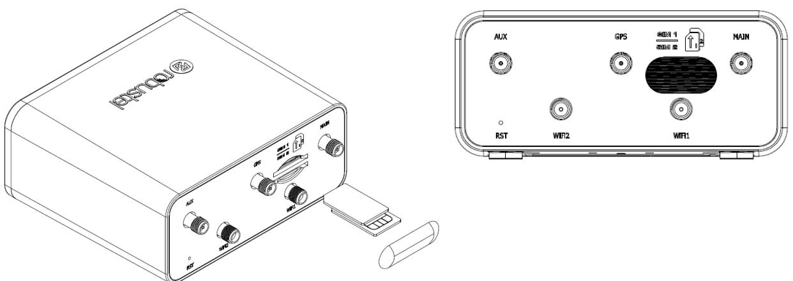

Insert or remove the SIM card as shown in the following steps.

#### **Insert SIM card**

- 1. Make sure router is powered off.
- 2. To insert SIM card, press the card with finger until you hear a click.
- 3. After the SIM card is inserted, attach the SIM card sticker to the card slot.

#### **Remove SIM card**

- 1. Make sure router is powered off.
- 2. Tear the SIM card sticker from the slot.
- 3. To remove SIM card, press the SIM card with finger until you hear a click and it pops out and then take out the card.

#### **Note:**

- 1. Use the specific M2M SIM card when the device is working in extreme temperature, because the regular card for long-time working in harsh environment will be disconnected frequently.
- 2. Do not touch the metal of the card surface in case information in the card will lose or be destroyed.


- 3. Do not bend or scratch the card.
- 4. Keep the card away from electricity and magnetism.
- 5. Make sure router is powered off before inserting or removing the card.

# 2.9 Attach External Antenna (SMA Type)

Attach an external SMA antenna to the router's antenna connector and twist tightly. Make sure the antenna is within the correct frequency range provided by the ISP and with 50 Ohm impedance. **Note:** Recommended torque for tightening is 0.35 N.m.

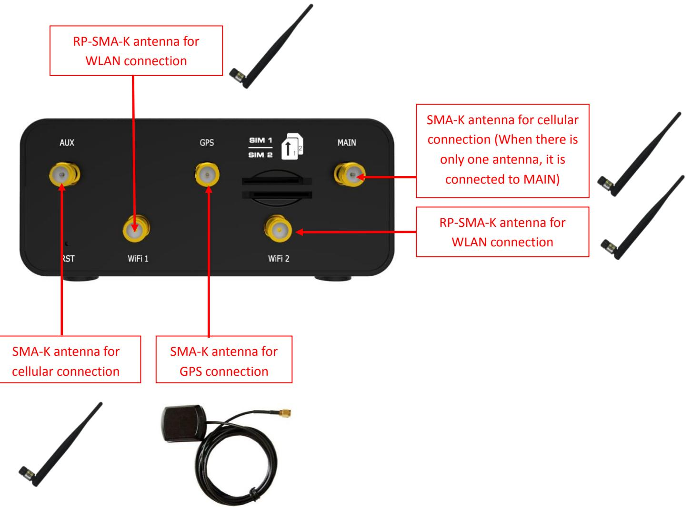


# 2.10 Mount the Router

The router can be placed on a desktop or mounted to a wall or a 35 mm DIN rail.

#### **Two methods for mounting the router**

- 1. Wall mounting (measured in mm)


First, drill holes on the wall, the distance between the two holes is 60mm, then knock the expansion pipe into the wall with a rubber hammer, align the screw with the expansion pipe, insert the screw and reserve the corresponding length, and finally fix the product on the wall.

**Note:** Recommended torque for mounting is 1.0 N.m, and the maximum allowed is 1.2 N.m.

- 2. DIN rail mounting (measured in mm) Option 1: Vertical installation
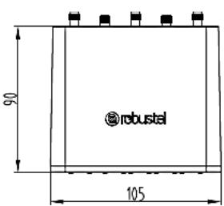

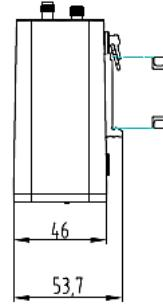


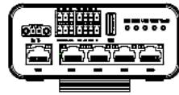

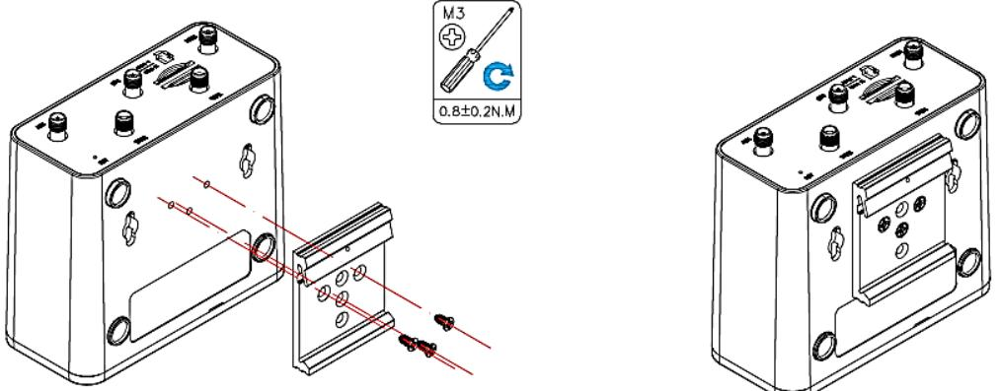

Use 3 pcs of M3*8 Black cross recessed countersunk head tapping screwsto mount the router on the DIN rail, and then hang the DIN rail on the holder. You need to choose a standard holder.

**Note:** Recommended torque for mounting is 0.8 N.m, and the maximum allowed is 1.0 N.m.

Option 2: Horizontal installation

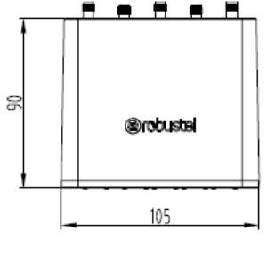

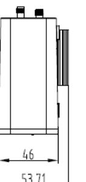

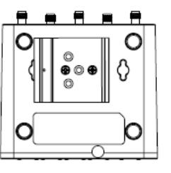

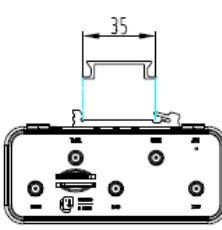

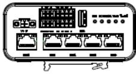


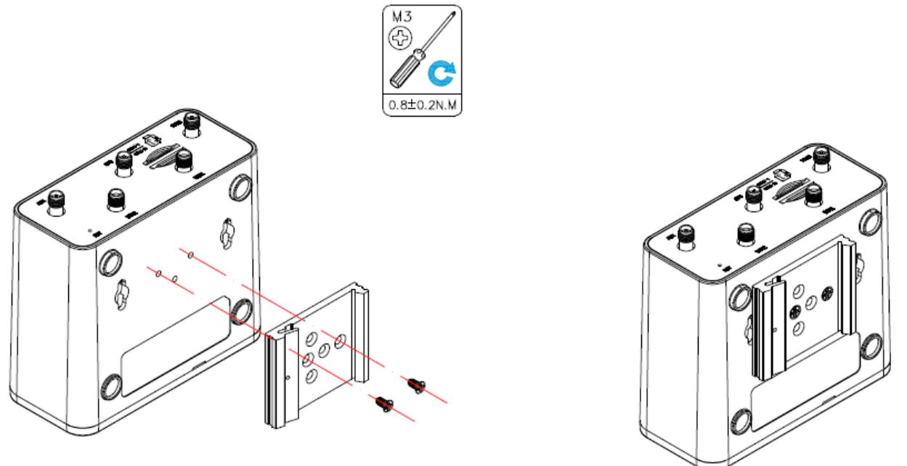

Use 3 pcs of M3*8 Black cross recessed countersunk head tapping screwsto mount the router on the DIN rail, and then hang the DIN rail on the holder. You need to choose a standard holder.

**Note:** Recommended torque for mounting is 0.8 N.m, and the maximum allowed is 1.0 N.m.

# 2.11 Connect the Router to a Computer

Connect the Ethernet port (ETH1 ~ ETH4) of the router to a PC with a standard crossover cable.

# 2.12 Power Supply


| PIN | Description                 | Note                                                 |
|-----|-----------------------------|------------------------------------------------------|
| 1   | Power<br>supply<br>Positive | Connect the adapter or battery positive (red wire)   |
| 2   | Power<br>supply<br>negative | Connect the adapter or battery negative (black wire) |

# 2.13 DI/DO Interface

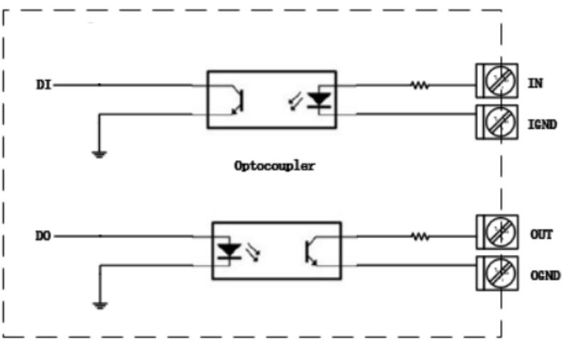

R1520 supports 1 channel DI and 1 channel DO, the internal schematic diagram is as shown above;

#### 1. DI application

R1520 DI input is internally isolated by opt coupler, internal current-limiting design, within the working level of 0 ~ 30V, external input does not need current limiting, DI input logic level range is as follows:

Logic 1 level range: min 3.5 V to max 30 V;

Logic 0 level range: min 0 V to max 1 V;

The application example is as follows:

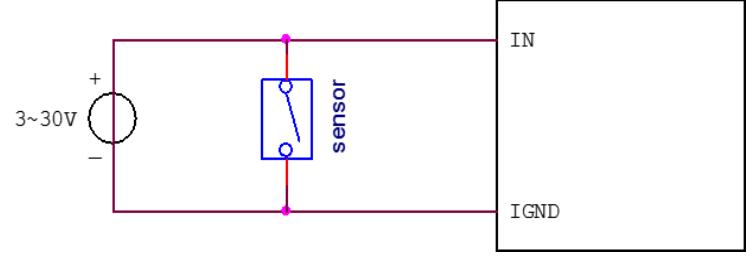

#### 2. DO application

R1520 DO output is internally isolated by opt ocoupler, OUT is OC gate output, Normal use requires external resistor pull-up, the pull-up voltage range is 3V ~ 30V (for actual use, please consult Robustel for selection of pull-up resistor); The application example is as follows:


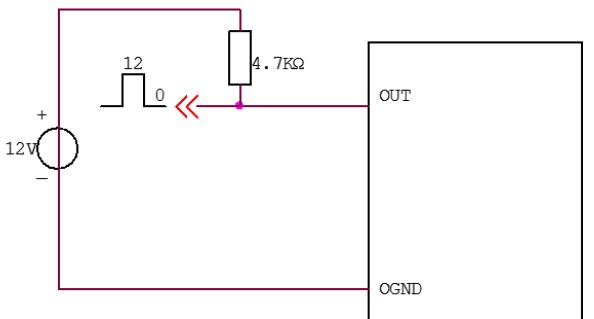

# 2.14 AI Interface

R1520 supports one channel AI interface for analog signal voltage and current measurement;

- 1. 0 ~ 24V voltage measurement, wiring as shown below:
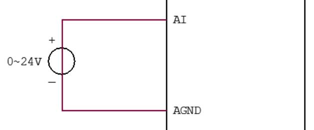

- 2. 4 ~ 20mA current signal measurement requires an external parallel 1.2kohm resistor, wiring as shown below:
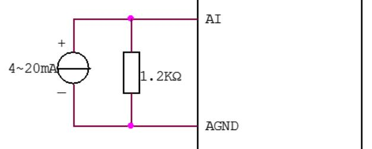


# Chapter 3 Initial Configuration

The router can be configured through your web browser that including IE 8.0 or above, Chrome and Firefox, etc. A web browser is included as a standard application in the following operating systems: Linux, Mac OS, Windows 98/NT/2000/XP/Me/Vista/7/8, etc. It provides an easy and user-friendly interface for configuration. There are various ways to connect the router, either through an external repeater/hub or connect directly to your PC. However, make sure that your PC has an Ethernet interface properly installed prior to connecting the router. You must configure your PC to obtain an IP address through a DHCP server or a fixed IP address that must be in the same subnet as the router. If you encounter any problems accessing the router web interface, it is advisable to uninstall your firewall program on your PC, as this tends to cause problems accessing the IP address of the router.

# 3.1 Configure the PC

There are two methods to get IP address for the PC. One is to obtain an IP address automatically from "Local Area Connection", and another is to configure a static IP address manually within the same subnet of the router. Please refer to the steps below.

Here take **Windows 7** as example, and the configuration for windows system is similar.

- 1. Click **Start > Control Panel**, double-click **Network and Internet**, and then double-click **Network Connections.**
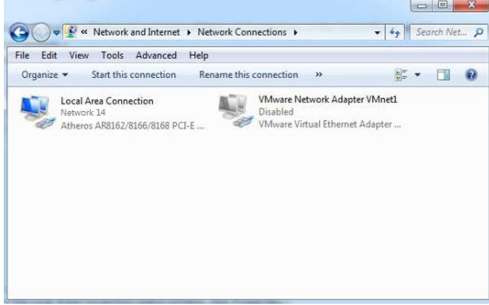


- 2. Click **Properties** in the window of **Local Area Connection Status**.

| - E<br>Local Area Connection Status |            |                               |
|-------------------------------------|------------|-------------------------------|
| General                             |            |                               |
| Connection                          |            | Internet                      |
| IPv4 Connectivity:                  |            |                               |
| IPv6 Connectivity:                  |            | No Internet access<br>Enabled |
| Media State:                        |            |                               |
| Duration:                           |            | 09:30:11                      |
| Speed:                              |            | 100.0 Mbps                    |
| Details                             |            |                               |
|                                     |            |                               |
| Activity                            |            |                               |
|                                     | Sent       | Received                      |
| Bytes:                              | 12,818,574 | 83,948,334                    |
|                                     |            | Diagnose                      |
|                                     |            | Close                         |

- 3. Choose **Internet Protocol Version 4 (TCP/IPv4)** and click **Properties**.

| D<br>Local Area Connection Properties                                                                                                                            |  |  |  |  |
|------------------------------------------------------------------------------------------------------------------------------------------------------------------|--|--|--|--|
| Networking                                                                                                                                                       |  |  |  |  |
| Connect using:                                                                                                                                                   |  |  |  |  |
| Qualcomm Atheros AR8162/8166/8168 PCI-E Fast Ether                                                                                                               |  |  |  |  |
| Configure                                                                                                                                                        |  |  |  |  |
| This connection uses the following items:                                                                                                                        |  |  |  |  |
| Client for Microsoft Networks<br>/Mware Bridge Protocol                                                                                                          |  |  |  |  |
| QoS Packet Scheduler<br>File and Printer Sharing for Microsoft Networks                                                                                          |  |  |  |  |
| Intemet Protocol Version 6 (TCP/IPv6)                                                                                                                            |  |  |  |  |
| Intemet Protocol Version 4 (TCP/IPv4)                                                                                                                            |  |  |  |  |
| Link-Layer Topology Discovery Mapper I/O Driver                                                                                                                  |  |  |  |  |
| Link-Layer Topology Discovery Responder                                                                                                                          |  |  |  |  |
| nstall.<br>Uninstall<br>Properties                                                                                                                               |  |  |  |  |
| Description                                                                                                                                                      |  |  |  |  |
| Transmission Control Protocol/Intemet Protocol. The default<br>wide area network protocol that provides communication<br>across diverse interconnected networks. |  |  |  |  |
|                                                                                                                                                                  |  |  |  |  |
| OK                                                                                                                                                               |  |  |  |  |


- 4. Two ways for configuring the IP address of PC
Obtain an IP address from the DHCP server automatically; Click **"Obtain an IP address automatically ";**

| Internet Protocol Version 4 (TCP/IPv4) Properties                                                                                                                                     |                                      |    |  |          |  |  |
|---------------------------------------------------------------------------------------------------------------------------------------------------------------------------------------|--------------------------------------|----|--|----------|--|--|
| General<br>Alternate Configuration                                                                                                                                                    |                                      |    |  |          |  |  |
| You can get IP settings assigned automatically if your network supports<br>this capability. Otherwise, you need to ask your network administrator<br>for the appropriate IP settings. |                                      |    |  |          |  |  |
|                                                                                                                                                                                       | O Obtain an IP address automatically |    |  |          |  |  |
| O Use the following IP address:                                                                                                                                                       |                                      |    |  |          |  |  |
| IP address:                                                                                                                                                                           |                                      |    |  |          |  |  |
| Subnet mask:                                                                                                                                                                          |                                      |    |  |          |  |  |
| Default gateway:                                                                                                                                                                      |                                      |    |  |          |  |  |
| O Obtain DNS server address automatically                                                                                                                                             |                                      |    |  |          |  |  |
| O Use the following DNS server addresses:                                                                                                                                             |                                      |    |  |          |  |  |
| Preferred DNS server:                                                                                                                                                                 |                                      |    |  |          |  |  |
| Alternate DNS server:                                                                                                                                                                 |                                      |    |  |          |  |  |
| Validate settings upon exit                                                                                                                                                           |                                      |    |  | Advanced |  |  |
|                                                                                                                                                                                       |                                      | OK |  | Cancel   |  |  |

#### **Use the following IP address:**

(Configured a static IP address manually within the same subnet of the router, click and configure "**Use the following IP address**"

| Internet Protocol Version 4 (TCP/IPv4) Properties                                                                                                                                     |                        |  |  |  |
|---------------------------------------------------------------------------------------------------------------------------------------------------------------------------------------|------------------------|--|--|--|
| General                                                                                                                                                                               |                        |  |  |  |
| You can get IP settings assigned automatically if your network supports<br>this capability. Otherwise, you need to ask your network administrator<br>for the appropriate IP settings. |                        |  |  |  |
| Obtain an IP address automatically                                                                                                                                                    |                        |  |  |  |
| O Use the following IP address:                                                                                                                                                       |                        |  |  |  |
| IP address:                                                                                                                                                                           | 192 . 168 . 0 .<br>2   |  |  |  |
| Subnet mask:                                                                                                                                                                          | 255 . 255 . 255 .<br>0 |  |  |  |
| Default gateway:                                                                                                                                                                      | 192 . 168 . 0 .<br>1   |  |  |  |
| Obtain DNS server address automatically                                                                                                                                               |                        |  |  |  |
| O Use the following DNS server addresses:                                                                                                                                             |                        |  |  |  |
| Preferred DNS server:                                                                                                                                                                 | 192 . 168 . 0<br>1     |  |  |  |
| Alternate DNS server:                                                                                                                                                                 |                        |  |  |  |
| Validate settings upon exit                                                                                                                                                           | Advanced               |  |  |  |
|                                                                                                                                                                                       | OK                     |  |  |  |

- 5. Click **OK** to finish the configuration.


# 3.2 Factory Default Settings

| Item        | Description                         |
|-------------|-------------------------------------|
| Username    | admin                               |
| Password    | admin                               |
| ETH0/POE    | Default WAN mode                    |
| ETH1        | 192.168.0.1/255.255.255.0, LAN mode |
| ETH2        | 192.168.0.1/255.255.255.0, LAN mode |
| ETH3        | 192.168.0.1/255.255.255.0, LAN mode |
| ETH4        | 192.168.0.1/255.255.255.0, LAN mode |
| DHCP Server | Enabled                             |

Before configuring your router, you need to know the following default settings.

# 3.3 Log in the Router

To log in to the management page and view the configuration status of your router, please follow the steps below.

- 1. On your PC, open a web browser such as Internet Explorer and Google, etc.
- 2. From your web browser, type the IP address of the router into the address bar and press enter. The default IP address of the router is [http://192.168.0.1/,](http://192.168.0.1/) though the actual address may vary.

| New Tab | ×                            |  |
|---------|------------------------------|--|
|         | < > C   https://192.168.0.1/ |  |

- 3. In the login page, enter the username and password, choose language and then click **LOGIN**. The default username and password are "admin".
**Note:** If enter the wrong username or password over 6 times, the login web will be locked for 5 minutes.


# 3.4 Control Panel

|                                                                   |                          |                                                              | Reboot<br>Logout<br>Save & Apply           |  |
|-------------------------------------------------------------------|--------------------------|--------------------------------------------------------------|--------------------------------------------|--|
| A It is strongly recommended to change the default password.<br>× |                          |                                                              |                                            |  |
|                                                                   | Status                   |                                                              |                                            |  |
| Status                                                            | へ System Information     |                                                              |                                            |  |
| Interface                                                         |                          | Device Model                                                 | R1520                                      |  |
| Network                                                           |                          | System Uptime                                                | 0 days, 00:30:19                           |  |
| VPN                                                               | System Time<br>RAM Usage |                                                              | Sat May 16 13:28:46 2020 (NTP not updated) |  |
| Services                                                          |                          |                                                              | 74M Free/128M Total                        |  |
|                                                                   |                          | Firmware Version                                             | 0511 (Rev 3198)                            |  |
| System                                                            |                          | Hardware Version                                             | 1.1                                        |  |
|                                                                   |                          | Kernel Version                                               | 4.9.152                                    |  |
|                                                                   |                          | Serial Number                                                |                                            |  |
|                                                                   | へ Internet Status        |                                                              |                                            |  |
|                                                                   |                          | Active Link                                                  |                                            |  |
|                                                                   |                          | Uptime                                                       |                                            |  |
|                                                                   |                          | IP Address                                                   |                                            |  |
|                                                                   |                          | Gateway                                                      |                                            |  |
|                                                                   |                          | DNS                                                          |                                            |  |
|                                                                   | へ LAN Status             |                                                              |                                            |  |
|                                                                   |                          | IP Address                                                   | 192.168.0.1/255.255.255.0                  |  |
|                                                                   |                          | MAC Address                                                  | 34:FA:40:0A:A4:2A                          |  |
|                                                                   |                          |                                                              |                                            |  |
|                                                                   |                          |                                                              |                                            |  |
|                                                                   |                          | Copyright © 2019 Robustel Technologies. All rights reserved. |                                            |  |
|                                                                   |                          |                                                              |                                            |  |

After successfully logging into the R1520 router, the home page is as shown in the figure below:

In the home page, the user can save the configuration, restart the router, log out, and so on.

Using the original username and password to log in the router, the page will pop up the following tab.

It is strongly recommended for security purposes that you change the default username and/or password.

Click the to close the popup. To change your username and/or password, see **4.6.6 User Management**.

| Control Panel |                                                                                                                                                                   |        |  |
|---------------|-------------------------------------------------------------------------------------------------------------------------------------------------------------------|--------|--|
| Item          | Description                                                                                                                                                       | Button |  |
| Save & Apply  | Click to save the current configuration into router's flash and apply the<br>modification on every configuration page, to make the modification<br>taking effect. |        |  |
| Reboot        | Click to reboot the router. If the Reboot button is yellow, it means that                                                                                         |        |  |
|               | some completed configurations will take effect only after reboot.                                                                                                 |        |  |


| Logout | Click to log the current user out safely. After logging out, it will switch to |  |
|--------|--------------------------------------------------------------------------------|--|
|        | login page. Shut down web page directly without logout, the next one can       |  |
|        | login web on this browser without a password before timeout.                   |  |
| Submit | Click to save the modification on current configuration page.                  |  |
| Cancel | Click to cancel the modification on current configuration page.                |  |

**Note:** The steps of how to modify configuration are as bellow:

- 1. Modify in one page;
- 2. Click under this page;
- 3. Modify in another page;
- 4. Click under this page;
- 5. Complete all modification;
- 6. Click .


# Chapter 4 Router Configuration

# 4.1 Status

# **4.1.1 System Information**

This section allows you to view the System Information of your Router.

| ^ System Information             |                                            |
|----------------------------------|--------------------------------------------|
| Device Model                     | R1520                                      |
|                                  | System Uptime 0 days, 01:45:48             |
| System Time                      | Sat May 16 14:44:15 2020 (NTP not updated) |
| RAM Usage                        | 76M Free/128M Total                        |
| Firmware Version 0511 (Rev 3198) |                                            |
| Hardware Version 1.1             |                                            |
| Kernel Version                   | 4.9.152                                    |
| Serial Number                    |                                            |
|                                  |                                            |

| System Information |                                                                                       |  |  |
|--------------------|---------------------------------------------------------------------------------------|--|--|
| Item               | Description                                                                           |  |  |
| Device Model       | Show the model name of your device.                                                   |  |  |
| System Uptime      | Show the current amount of time the router has been connected.                        |  |  |
| System Time        | Show the current system time.                                                         |  |  |
| RAM Usage          | Show the free memory and the total memory.                                            |  |  |
| Firmware Version   | Show the firmware version running on the router.                                      |  |  |
| Hardware Version   | Show the current hardware version.                                                    |  |  |
| Kernel Version     | Show the current kernel version.                                                      |  |  |
| Serial Number      | Show the serial number of your device, from which you can get information such as the |  |  |
|                    | router's time of delivery.                                                            |  |  |

# **4.1.2 Internet Status**

| ^ Internet Status |                                           |
|-------------------|-------------------------------------------|
| Active Link       | WWAN1                                     |
|                   | Uptime 0 days, 00:39:31                   |
|                   | IP Address - 10.122.74.11/255.255.255.248 |
| Gateway           | 10.122.74.9                               |
| DNS               | 210.21.4.130 221.5.88.88                  |

This section shows the Internet status information of your Router.

| Internet Status |                                                              |  |  |
|-----------------|--------------------------------------------------------------|--|--|
| Item            | Description                                                  |  |  |
| Active Link     | Show the current active link. WWAN1, WWAN2, WAN or WLAN.     |  |  |
| Uptime          | Show the current amount of time the link has been connected. |  |  |
| IP Address      | Show the IP address of current link.                         |  |  |
| Gateway         | Show the gateway address of the current link.                |  |  |
| DNS             | Show the current primary DNS server and secondary server.    |  |  |

# **4.1.3 LAN Status**

This section shows the router's LAN status information.

| LAN Status  |                                                    |  |  |
|-------------|----------------------------------------------------|--|--|
| Item        | Description                                        |  |  |
| IP Address  | Show the IP address and the Netmask of the router. |  |  |
| MAC Address | Show the MAC address of the router.                |  |  |


# 4.2 Interface

# **4.2.1 Link Manager**

This section allows you to setup the connection of Link Manager. Link manager is a network link backup function that provides mobile network and Ethernet link backups.

| Link Manager       | Status           |                         |
|--------------------|------------------|-------------------------|
| へ General Settings |                  |                         |
|                    | Primary Link     | 2<br>WWAN1<br>>         |
|                    | Backup Link      | WWAN2<br>V              |
|                    | Backup Mode      | (7)<br>Cold Backup<br>v |
|                    | Revert Interval  | 1<br>0                  |
|                    | Emergency Reboot | 2<br>OFF<br>ON          |

| General Settings @ Link Manager |                                                                                                                                                                                                                                                                                                                                                                                                                                                     |                |  |  |
|---------------------------------|-----------------------------------------------------------------------------------------------------------------------------------------------------------------------------------------------------------------------------------------------------------------------------------------------------------------------------------------------------------------------------------------------------------------------------------------------------|----------------|--|--|
| Item                            | Description                                                                                                                                                                                                                                                                                                                                                                                                                                         | Default        |  |  |
| Primary Link                    | Select from "WWAN1", "WWAN2", "WAN" or "WLAN".<br><br>WWAN1: Select to make SIM1 as the primary wireless link<br><br>WWAN1: Select to make SIM2 as the primary wireless link<br><br>WAN: Select to make WAN as the primary wired link<br><br>WLAN: Select to make WLAN as the primary wireless link<br>Note: WLAN link is available only if enable WiFi as Client mode, please<br>refer to 4.2.5 WiFi.                                          | WWAN1          |  |  |
| Backup Link                     | Select from "WWAN1" , "WWAN2", "WAN" or "None".<br><br>WWAN1: Select to make SIM1 as the backup wireless link<br><br>WWAN2: Select to make SIM2 as the backup wireless link<br><br>WAN: Select to make WAN as the backup wired link<br><br>WLAN: Select to make WLAN as the backup wireless link<br>Note: WLAN link is available only if enable WiFi as Client mode, please<br>refer to 4.2.5 WiFi.<br><br>None: Do not select any backup link |                |  |  |
| Backup Mode                     | Select from "Cold Backup", "Warm Backup" or "Load Balancing".<br><br>Cold Backup: The inactive link is offline on standby<br><br>Warm Backup: The inactive link is online on standby<br>Note: Warm backup mode is not available for dual SIM backup.<br><br>Load Balancing: Use two links simultaneously                                                                                                                                         | Cold<br>Backup |  |  |
| Revert Interval                 | Specify the number of minutes that elapses before the primary link is<br>checked if a backup link is being used in cold backup mode. 0 means disable<br>checking.<br>Note: Revert interval is available only under the cold backup mode.                                                                                                                                                                                                            | 0              |  |  |
| Emergency Reboot                | Click the toggle button to enable/disable this option. Enable to reboot the<br>whole system if no links available.                                                                                                                                                                                                                                                                                                                                  | OFF            |  |  |

**Note:** Click for help.


**Link Settings** allows you to configure the parameters of link connection, including WWAN1, WWAN2, WAN and WLAN. It is recommended to enable Ping detection to keep the router always online. The Ping detection increases the reliability and also costs the data traffic.

| へ Link Settings |       |             |                 |    |  |
|-----------------|-------|-------------|-----------------|----|--|
| Index           | Type  | Description | Connection Type |    |  |
| 1               | WWAN1 |             | DHCP            | P  |  |
| വ               | WWAN2 |             | DHCP            | Pi |  |
| ന               | WAN   |             | DHCP            | R  |  |
| র্ব             | WLAN  |             | DHCP            | Ri |  |

Click on the right-most of WWAN1/WWAN2/WAN/WLAN to enter the configuration window.

#### **WWAN1/ WWAN2**

| Link Manager       |            |  |  |
|--------------------|------------|--|--|
| へ General Settings |            |  |  |
| Index              | 1          |  |  |
| Type               | WWAN1<br>V |  |  |
| Description        |            |  |  |

The window is displayed as below when enabling the "Automatic APN Selection" option.

| へ WWAN Settings              |                         |           |
|------------------------------|-------------------------|-----------|
|                              | Automatic APN Selection | ON        |
| Dialup Number                |                         | *99***1#  |
|                              | Authentication Type     | Auto<br>V |
| Switch SIM By Data Allowance |                         | (2<br>OFF |
| Data Allowance               |                         | 0<br>0    |
|                              | Billing Day             | 0<br>1    |

The window is displayed as below when disabling the "Automatic APN Selection" option.


| A WWAN Settings              |           |
|------------------------------|-----------|
| Automatic APN Selection      | OFF       |
| APN                          | internet  |
| Username                     |           |
| Password                     |           |
| Dialup Number                | *99***1#  |
| Authentication Type          | Auto<br>V |
| Switch SIM By Data Allowance | (2<br>OFF |
| Data Allowance               | 0<br>0    |
| Billing Day                  | 0<br>1    |

| ^ Ping Detection Settings | C               |
|---------------------------|-----------------|
| Enable                    | ON              |
| Primary Server            | 8.8.8.8         |
| Secondary Server          | 114.114.114.114 |
| Interval                  | 3<br>300        |
| Retry Interval            | 3<br>5          |
| Timeout                   | 3<br>3          |
| Max Ping Tries            | 2<br>3          |

| へ Advanced Settings     |            |  |  |
|-------------------------|------------|--|--|
| NAT Enable              | ON         |  |  |
| Upload Bandwidth        | 0<br>10000 |  |  |
| Download Bandwidth      | 10000      |  |  |
| Overrided Primary DNS   |            |  |  |
| Overrided Secondary DNS |            |  |  |
| Debug Enable            | ON         |  |  |
| Verbose Debug Enable    | OFF        |  |  |

| Link Settings (WWAN) |                                                    |         |  |
|----------------------|----------------------------------------------------|---------|--|
| Item                 | Description                                        | Default |  |
| General Settings     |                                                    |         |  |
| Index                | Indicate the ordinal of the list.                  | --      |  |
| Type                 | Show the type of the link.                         | WWAN1   |  |
| Description          | Enter a description for this link. It can be null. | Null    |  |
| WWAN Settings        |                                                    |         |  |


| Link Settings (WWAN) |                                                                                 |            |  |  |
|----------------------|---------------------------------------------------------------------------------|------------|--|--|
| Item                 | Description                                                                     | Default    |  |  |
| Automatic APN        | Click the toggle button to enable/disable the "Automatic APN Selection"         | ON         |  |  |
| Selection            | option. After enabling, the device will recognize the access point name         |            |  |  |
|                      | automatically. Alternatively, you can disable this option and manually add      |            |  |  |
|                      | the access point name.                                                          |            |  |  |
| APN                  | Enter the Access Point Name for cellular dial-up connection, provided by        | internet   |  |  |
|                      | local ISP.                                                                      |            |  |  |
| Username             | Enter the username for cellular dial-up connection, provided by local ISP.      | Null       |  |  |
| Password             | Enter the password for cellular dial-up connection, provided by local ISP.      | Null       |  |  |
| Dialup Number        | Enter the dialup number for cellular dial-up connection, provided by local      | *99***1#   |  |  |
|                      | ISP.                                                                            |            |  |  |
| Authentication Type  | Select from "Auto", "PAP" or "CHAP" as the local ISP required.                  | Auto       |  |  |
| Switch SIM By Data   | Click the toggle button to enable/disable this option. After enabling, it will  |            |  |  |
| Allowance            | switch to another SIM when the data limit reached.                              | OFF        |  |  |
|                      | Note: Only used for dual SIM backup.                                            |            |  |  |
| Data Allowance       | Set the monthly data traffic limitation. The system will record the data        | 0          |  |  |
|                      | traffic statistics when data traffic limitation (MiB) is specified. The traffic |            |  |  |
|                      | record will be displayed in Interface > Link Manager > Status > WWAN            |            |  |  |
|                      | Data Usage Statistics. 0 means disable data traffic record.                     |            |  |  |
| Billing Day          | Specify the monthly billing day. The data traffic statistics will be            | 1          |  |  |
|                      | recalculated from that day.                                                     |            |  |  |
|                      | Ping Detection Settings                                                         |            |  |  |
| Enable               | Click the toggle button to enable/disable the ping detection mechanism, a       | ON         |  |  |
|                      | keep-alive policy of the router.                                                |            |  |  |
| Primary Server       | Router will ping this primary address/domain name to check that if the          | 8.8.8.8    |  |  |
|                      | current connectivity is active.                                                 |            |  |  |
| Secondary Server     | Router will ping this secondary address/domain name to check that if the        | 114.114.11 |  |  |
|                      | current connectivity is active.                                                 | 4.114      |  |  |
| Ping Interval        | Set the ping interval.                                                          | 300        |  |  |
| Ping Retry Interval  | Set the ping retry interval. When ping failed, the router will ping again       | 5          |  |  |
|                      | every retry interval.                                                           |            |  |  |
| Ping Timeout         | Set the ping timeout.                                                           | 3          |  |  |
| Max Ping Tries       | Set the max ping tries. Switch to another link or take emergency action if      | 3          |  |  |
|                      | the max continuous ping tries reached.                                          |            |  |  |
| Advanced Settings    |                                                                                 |            |  |  |
| NAT Enable           | Click the toggle button to enable/disable the Network Address Translation       | ON         |  |  |
|                      | option.                                                                         |            |  |  |
| Upload Bandwidth     | Set the upload bandwidth used for QoS, measured in kbps.                        | 10000      |  |  |
| Download Bandwidth   | Set the download bandwidth used for QoS, measured in kbps.                      | 10000      |  |  |
| Overrided Primary    | Override primary DNS will override the automatically obtained DNS.              | Null       |  |  |
| DNS                  |                                                                                 |            |  |  |
| Overrided Secondary  | Override secondary DNS will override the automatically obtained DNS.            | Null       |  |  |
| DNS                  |                                                                                 |            |  |  |


| Link Settings (WWAN) |                                                                             |         |  |
|----------------------|-----------------------------------------------------------------------------|---------|--|
| Item                 | Description                                                                 | Default |  |
| Debug Enable         | Click the toggle button to enable/disable this option. Enable for debugging | ON      |  |
|                      | information output.                                                         |         |  |
| Verbose Debug Enable | Click the toggle button to enable/disable this option. Enable for verbose   | OFF     |  |
|                      | debugging information output.                                               |         |  |

#### **WAN**

Router will obtain IP automatically from DHCP server if choosing "DHCP" as connection type. The window is displayed as below.

| Link Manager       |           |
|--------------------|-----------|
| ^ General Settings |           |
| Index              | 3         |
| Type               | WAN<br>V  |
| Description        |           |
| Connection Type    | DHCP<br>V |

The window is displayed as below when choosing "Static" as the connection type.

| へ General Settings        |             |
|---------------------------|-------------|
| Index                     | 3           |
| Type                      | WAN<br>V    |
| Description               |             |
| Connection Type           | Static<br>V |
|                           |             |
| ^ Static Address Settings |             |
| IP Address                | ಲಿ          |
| Gateway                   |             |
| Primary DNS               |             |

The window is displayed as below when choosing "PPPoE" as the connection type.

| A General Settings                  |                 |
|-------------------------------------|-----------------|
| Index                               | 3               |
| Type                                | WAN<br>V        |
| Description                         |                 |
| Connection Type                     | PPPoE<br>V      |
| A WAN Settings                      |                 |
| Data Allowance                      | ම<br>0          |
| Billing Day                         | ு<br>1          |
| A PPPoE Settings                    |                 |
| Username                            |                 |
| Password                            |                 |
| Authentication Type                 | Auto<br>V       |
| PPP Expert Options                  | ு               |
|                                     |                 |
| ^ Ping Detection Settings<br>Enable | ON              |
|                                     |                 |
| Primary Server                      | 8.8.8.8         |
| Secondary Server                    | 114.114.114.114 |
| Interval                            | 0<br>300        |
| Retry Interval                      | 0<br>5          |
| Timeout                             | 0<br>3          |
| Max Ping Tries                      | ு<br>3          |
|                                     |                 |
| A Advanced Settings                 |                 |
| NAT Enable                          | ON              |
| MTU                                 | 1500            |

| Auvaliced Sellings      |            |
|-------------------------|------------|
| NAT Enable              | ON         |
| MTU                     | 1500       |
| Upload Bandwidth        | 9<br>10000 |
| Download Bandwidth      | 10000      |
| Overrided Primary DNS   |            |
| Overrided Secondary DNS |            |
| Debug Enable            | ON         |
| Verbose Debug Enable    | OFF        |


| Link Settings (WAN) |                                                                                      |           |  |
|---------------------|--------------------------------------------------------------------------------------|-----------|--|
| Item                | Description                                                                          | Default   |  |
|                     | General Settings                                                                     |           |  |
| Index               | Indicate the ordinal of the list.                                                    | --        |  |
| Type                | Show the type of the link.<br>WAN                                                    |           |  |
| Description         | Enter a description for this link. It can be null.                                   | Null      |  |
| Connection Type     | Select from "DHCP", "Static" or "PPPoE".                                             | DHCP      |  |
|                     | Static Address Settings                                                              |           |  |
| IP Address          | Set the IP address with Netmask which can access the internet.                       | Null      |  |
|                     | IP address with Netmask, e.g. 192.168.1.1/24                                         |           |  |
| Router              | Set the router of the IP address in WAN port.                                        | Null      |  |
| Primary DNS         | Set the primary DNS.                                                                 | Null      |  |
| Secondary DNS       | Set the secondary DNS.                                                               | Null      |  |
|                     | PPPoE Settings                                                                       |           |  |
| Username            | Enter the username provided by your Internet Service Provider.                       | Null      |  |
| Password            | Enter the password provided by your Internet Service Provider.                       | Null      |  |
| Authentication Type | Select from "Auto", "PAP" or "CHAP" as the local ISP required.                       | Auto      |  |
| PPP Expert Options  | Enter the PPP Expert options used for PPPoE dialup. You can enter some               | Null      |  |
|                     | other PPP dial strings in this field. Each string can be separated by a              |           |  |
|                     | semicolon.                                                                           |           |  |
|                     | WAN Settings                                                                         |           |  |
| Data Allowance      | Set the monthly data traffic limitation. The system will record the data             | OFF       |  |
|                     | traffic statistics when data traffic limitation (MiB) is specified. The traffic      |           |  |
|                     | record will be displayed in Interface > Link Manager > Status > WWAN                 |           |  |
|                     | Data Usage Statistics. 0 means disable data traffic record.                          |           |  |
| Billing Day         | Specify the monthly billing day. The data traffic statistics will be                 | 1         |  |
|                     | recalculated from that day. If not set, traffic will not be counted.                 |           |  |
|                     | Ping Detection Settings                                                              |           |  |
| Enable              | Click the toggle button to enable/disable the ping detection mechanism, a            | ON        |  |
|                     | keep-alive policy of the router.                                                     |           |  |
| Primary Server      | Router will ping this primary address/domain name to check that if the               | 8.8.8.8   |  |
|                     | current connectivity is active.                                                      |           |  |
| Secondary Server    | Router will ping this secondary address/domain name to check that if the             | 114.114.1 |  |
|                     | current connectivity is active.                                                      | 14.114    |  |
| Interval            | Set the ping interval.                                                               | 300       |  |
| Retry Interval      | Set the ping retry interval. When ping failed, the router will ping again            | 5         |  |
|                     | every retry interval.                                                                |           |  |
| Timeout             | Set the ping timeout.                                                                | 3         |  |
| Max Ping Tries      | Set the max ping tries. Switch to another link or take emergency action if           | 3         |  |
|                     | the max continuous ping tries reached.                                               |           |  |
| Advanced Settings   |                                                                                      |           |  |
| NAT Enable          | Click the toggle button to enable/disable the Network Address Translation<br>option. | ON        |  |
| MTU                 | Enter the Maximum Transmission Unit.                                                 | 1500      |  |
|                     |                                                                                      |           |  |


| Upload Bandwidth      | Enter the upload bandwidth used for QoS, measured in kbps.                  | 10000 |
|-----------------------|-----------------------------------------------------------------------------|-------|
| Download Bandwidth    | Enter the download bandwidth used for QoS, measured in kbps.                | 10000 |
| Overrided Primary DNS | Override primary DNS will override the automatically obtained DNS.          | Null  |
| Overrided Secondary   | Override secondary DNS will override the automatically obtained DNS.        | Null  |
| DNS                   |                                                                             |       |
| Debug Enable          | Click the toggle button to enable/disable this option. Enable for debugging | ON    |
|                       | information output.                                                         |       |
| Verbose Debug Enable  | Click the toggle button to enable/disable this option. Enable for verbose   | OFF   |
|                       | debugging information output.                                               |       |

#### **WLAN**

Router will obtain IP automatically from the WLAN AP if choosing "DHCP" as the connection type. The specific parameter configuration of SSID is shown as below.

| Link Manager       |                        |           |
|--------------------|------------------------|-----------|
| へ General Settings |                        |           |
|                    | Index                  | 4         |
|                    | Type                   | WLAN<br>V |
|                    | Description            |           |
|                    | Connection Type        | DHCP<br>V |
| へ WLAN Settings    |                        |           |
|                    | SSID                   | router    |
|                    | Connect to Hidden SSID | OFF<br>ON |
|                    | Password               |           |

The window is displayed as below when choosing "Static" as the connection type.

| へ General Settings        |                 |             |    |
|---------------------------|-----------------|-------------|----|
|                           | Index           | 4           |    |
|                           | Type            | WLAN<br>V   |    |
|                           | Description     |             |    |
|                           | Connection Type | Static<br>V |    |
| ✔ WLAN Settings           |                 |             |    |
| へ Static Address Settings |                 |             |    |
|                           | IP Address      |             | ಲಿ |
|                           | Gateway         |             |    |
|                           | Primary DNS     |             |    |
|                           | Secondary DNS   |             |    |

R1520 does not support "PPPoE" WLAN connection types.


| ^ Ping Detection Settings |                 |
|---------------------------|-----------------|
| Enable                    | ON              |
| Primary Server            | 8.8.8.8         |
| Secondary Server          | 114.114.114.114 |
| Interval                  | ಲಿ<br>300       |
| Retry Interval            | 0<br>5          |
| Timeout                   | 0<br>3          |
| Max Ping Tries            | ಲಿ<br>3         |
|                           |                 |
| A Advanced Settings       |                 |
| NAT Enable                | ON              |
| MTU                       | 1500            |
| Upload Bandwidth          | 0<br>10000      |
| Download Bandwidth        | 10000           |
| Overrided Primary DNS     |                 |
| Overrided Secondary DNS   |                 |
| Debug Enable              | ON              |
| Verbose Debug Enable      | OFF             |

| Link Settings (WLAN)    |                                                                          |        |  |  |  |
|-------------------------|--------------------------------------------------------------------------|--------|--|--|--|
| Item                    | Description                                                              |        |  |  |  |
| General Settings        |                                                                          |        |  |  |  |
| Index                   | Indicate the ordinal of the list.                                        | --     |  |  |  |
| Type                    | Show the type of the link.                                               | WLAN   |  |  |  |
| Description             | Enter a description for this link. It can be null.                       | Null   |  |  |  |
| Connection Type         | Select from "DHCP" or "Static".                                          | DHCP   |  |  |  |
| WLAN Settings           |                                                                          |        |  |  |  |
| SSID                    | Enter a 1-32 characters SSID which your router wants to connect. SSID    | router |  |  |  |
|                         | (Service Set Identifier) is the name of your wireless network.           |        |  |  |  |
| Connect to Hidden SSID  | Click the toggle button to enable/disable this option. When router works | OFF    |  |  |  |
|                         | as Client mode and needs to connect any access point which has hidden    |        |  |  |  |
|                         | SSID, you need to enable this option.                                    |        |  |  |  |
| Password                | Enter an 8-63 characters password of the access point which your router  | Null   |  |  |  |
|                         | wants to connect.                                                        |        |  |  |  |
| Static Address Settings |                                                                          |        |  |  |  |
| IP Address              | Enter the IP address with Netmask which can access the Internet,         | Null   |  |  |  |
|                         | e.g. 192.168.1.1/24                                                      |        |  |  |  |
| Gateway                 | Enter the IP address of WiFi AP.                                         | Null   |  |  |  |
| Primary DNS             | Set the primary DNS.                                                     | Null   |  |  |  |


| Secondary DNS                   | Set the secondary DNS.                                                      |           |  |  |
|---------------------------------|-----------------------------------------------------------------------------|-----------|--|--|
| Null<br>Ping Detection Settings |                                                                             |           |  |  |
| Enable                          | Click the toggle button to enable/disable the ping detection mechanism, a   | ON        |  |  |
|                                 | keepalive policy of the router.                                             |           |  |  |
| Primary Server                  | Router will ping this primary address/domain name to check that if the      | 8.8.8.8   |  |  |
|                                 | current connectivity is active.                                             |           |  |  |
| Secondary Server                | Router will ping this secondary address/domain name to check that if the    | 114.114.1 |  |  |
|                                 | current connectivity is active.                                             | 14.114    |  |  |
| Interval                        | Set the ping interval.                                                      | 300       |  |  |
| Retry Interval                  | Set the ping retry interval. When ping failed, the router will ping again   | 5         |  |  |
|                                 | every retry interval.                                                       |           |  |  |
| Timeout                         | Set the ping timeout.                                                       | 3         |  |  |
| Max Ping Tries                  | Set the max ping tries. Switch to another link or take emergency action if  | 3         |  |  |
|                                 | the max continuous ping tries reached.                                      |           |  |  |
|                                 | Advance Settings                                                            |           |  |  |
| NAT Enable                      | Click the toggle button to enable/disable the Network Address Translation   | ON        |  |  |
|                                 | option.                                                                     |           |  |  |
| MTU                             | Enter the Maximum Transmission Unit.                                        | 1500      |  |  |
| Upload Bandwidth                | Enter the upload bandwidth used for QoS, measured in kbps.                  | 10000     |  |  |
| Download Bandwidth              | Enter the download bandwidth used for QoS, measured in kbps.                | 10000     |  |  |
| Overrided Primary DNS           | Override primary DNS will override the automatically obtained DNS.          | Null      |  |  |
| Overrided Secondary             | Override secondary DNS will override the automatically obtained DNS.        | Null      |  |  |
| DNS                             |                                                                             |           |  |  |
| Debug Enable                    | Click the toggle button to enable/disable this option. Enable for debugging | ON        |  |  |
|                                 | information output.                                                         |           |  |  |
| Verbose Debug Enable            | Click the toggle button to enable/disable this option. Enable for verbose   | OFF       |  |  |
|                                 | debugging information output.                                               |           |  |  |

#### **Status**

This page allows you to view the status of link connection and clear the monthly data usage statistics.

| Link Manager  |       | Status       |                                 |            |
|---------------|-------|--------------|---------------------------------|------------|
| へ Link Status |       |              |                                 |            |
| Index         | Link  | Status       | Uptime                          | IP Address |
| -             | WWAN1 | Connected    | 0 days, 01:03:29   10.122.74.11 |            |
| 2             | WWAN2 | Disconnected |                                 |            |

Click the right-most button to select the connection status of the current link.


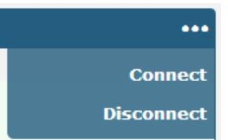

Click the row of the link, and it will show the details information of the current link connection under the row.

| Link Manager  |       | Status       |                  |                              |
|---------------|-------|--------------|------------------|------------------------------|
| ^ Link Status |       |              |                  |                              |
| Index         | Link  | Status       | Uptime           | IP Address                   |
| 1             | WWAN1 | Connected    | 0 days, 01:03:29 | 10.122.74.11                 |
|               |       |              | Index            | 1                            |
|               |       |              | Link             | WWAN1                        |
|               |       |              | Status           | Connected                    |
|               |       |              | Interface        | wwan                         |
|               |       |              | Uptime           | 0 days, 01:03:29             |
|               |       |              | IP Address       | 10.122.74.11/255.255.255.248 |
|               |       |              | Gateway          | 10.122.74.9                  |
|               |       |              | DNS              | 210.21.4.130 221.5.88.88     |
|               |       |              | RX Packets       | 42                           |
|               |       |              | TX Packets       | 46                           |
|               |       |              | RX Bytes         | 2962                         |
|               |       |              | TX Bytes         | 3568                         |
| 2             | WWAN2 | Disconnected |                  |                              |

| ‍ ~ WWAN Data Usage Statistics |       |
|--------------------------------|-------|
| WWAN1 Monthly Stats            | Clear |
| WWAN2 Monthly Stats            | Clear |
| ‍^ WAN Data Usage Statistics   |       |
| WAN Monthly Stats              | Clear |

WWAN usage data statistics and WAN usage data statistics respectively count the packet flow of the cellular module and WAN.

Click the button to clear the monthly data traffic usage statistics of SIM1 or SIM2. Data statistics will be

displayed only if enable the Data Allowance function in **Interface > Link Manager > Link Settings > WWAN1/WWAN2/WAN Settings > Data Allowance** .


| へ WWAN Settings              |           |
|------------------------------|-----------|
| Automatic APN Selection      | ON        |
| Dialup Number                | *99***1#  |
| Authentication Type          | Auto<br>V |
| Switch SIM By Data Allowance | 2<br>OFF  |
| Data Allowance               | 0<br>0    |
| Billing Day                  | 0<br>1    |

| へ WAN Settings |                |   |  |
|----------------|----------------|---|--|
|                | Data Allowance | C |  |
|                | Billing Day    |   |  |

# **4.2.2 LAN**

This section allows you to set the related parameters for LAN port. When ETH0 is configured as WAN, the router has four LAN ports, ETH1, ETH2, ETH3, and ETH4. The ETH1, ETH2, ETH3 and ETH4 can freely choose from lan0, lan1, lan2 and lan3. When ETH0 is configured as LAN, the router has five LAN ports, ETH0, ETH1, ETH2, ETH3, and ETH4. The ETH0, ETH1, ETH2, ETH3 and ETH4 can freely choose from lan0, lan1, lan2, lan3 or lan4. Whether it is four LAN ports or five LAN ports, lan0 must be selected by at least one LAN port. The default settings of ETH1/ETH2/ETH3/ETH4 are lan0 and their default IP are 192.168.0.1/255.255.255.0.

#### **LAN**

| LAN   |                    | Multiple IP            |                           | Status |    |
|-------|--------------------|------------------------|---------------------------|--------|----|
|       | ^ Network Settings |                        |                           |        | 0  |
| Index |                    | Interface   IP Address | Netmask                   |        |    |
|       | lan0               |                        | 192.168.0.1 255.255.255.0 |        | 2× |

**Note:** Lan0 cannot be deleted.

You may click to add a new LAN port, or click to delete the current LAN port. Now, click to edit the configuration of the LAN port.

| LAN                |               |
|--------------------|---------------|
| へ General Settings |               |
| Index              | 1             |
| Interface          | lan0<br>V     |
| IP Address         | 192.168.0.1   |
| Netmask            | 255.255.255.0 |
| MTU                | 1500          |


| General Settings @ LAN |                                                                           |               |
|------------------------|---------------------------------------------------------------------------|---------------|
| Item                   | Description                                                               | Default       |
| Index                  | Indicate the ordinal of the list.                                         | --            |
| Interface              | Show the editing port.                                                    | lan0          |
|                        | Note: Lan1 is available only if it was selected by one of ETH1~ETH4<br>in |               |
|                        | Ethernet > Ports > Port Settings.                                         |               |
| IP Address             | Set the IP address of the LAN port.                                       | 192.168.0.1   |
| Netmask                | Set the Netmask of the LAN port.                                          | 255.255.255.0 |
| MTU                    | Enter the Maximum Transmission Unit.                                      | 1500          |

The window is displayed as below when choosing "Server" as the mode.

| ^ DHCP Settings          |               |
|--------------------------|---------------|
| Enable                   | ON            |
| Mode                     | Server<br>V   |
| IP Pool Start            | 192.168.0.2   |
| IP Pool End              | 192.168.0.100 |
| Subnet Mask              | 255.255.255.0 |
|                          |               |
| ^ DHCP Advanced Settings |               |
| Gateway                  |               |
| Primary DNS              |               |
| Secondary DNS            |               |
| WINS Server              |               |
|                          |               |
| Lease Time               | 0<br>120      |

The window is displayed as below when choosing "Relay" as the mode.

| へ DHCP Settings          |            |
|--------------------------|------------|
| Enable                   | ON         |
| Mode                     | Relay<br>V |
| DHCP Server For Relay    |            |
| ^ DHCP Advanced Settings |            |
| Debug Enable             | OFF<br>ONA |


| LAN                                                                         |                                                                        |               |  |  |
|-----------------------------------------------------------------------------|------------------------------------------------------------------------|---------------|--|--|
| Item                                                                        | Description                                                            | Default       |  |  |
| DHCP Settings                                                               |                                                                        |               |  |  |
| Enable                                                                      | Click the toggle button to enable/disable the DHCP function.           | ON            |  |  |
| Mode                                                                        | Select the mode of DHCP from "Server" or "Relay".                      | Server        |  |  |
|                                                                             | <br>Server: Lease IP address to DHCP clients which have been          |               |  |  |
|                                                                             | connected to LAN port                                                  |               |  |  |
|                                                                             | <br>Relay: Router can be DHCP Relay, which will provide a relay       |               |  |  |
|                                                                             | tunnel to solve problem that DHCP Client and DHCP Server is not        |               |  |  |
|                                                                             | in a same subnet                                                       |               |  |  |
| IPv4 Pool Start                                                             | Define the beginning of the pool of IP addresses which will be leased  | 192.168.0.2   |  |  |
|                                                                             | to DHCP clients.                                                       |               |  |  |
| IPv4 Pool End                                                               | Define the end of the pool of IP addresses which will be leased to     |               |  |  |
|                                                                             | DHCP clients.                                                          |               |  |  |
| Subnet Mask                                                                 | Define the subnet mask of IP address obtained by DHCP clients from     | 255.255.255.0 |  |  |
|                                                                             | DHCP server.                                                           |               |  |  |
| DHCP Server for Relay                                                       | Enter the IP address of DHCP relay server.<br>Null                     |               |  |  |
|                                                                             | DHCP Advanced Settings                                                 |               |  |  |
| Router                                                                      | Define the router assigned by the DHCP server to the clients, which    | Null          |  |  |
|                                                                             | must be on the same network segment with DHCP address pool.            |               |  |  |
| Primary DNS                                                                 | Override primary DNS will override the automatically obtained DNS.     | Null          |  |  |
| Secondary DNS                                                               | Define the secondary DNS server assigned by the DHCP server to         | Null          |  |  |
|                                                                             | the Override secondary DNS will override the automatically obtained    |               |  |  |
|                                                                             | DNS.                                                                   |               |  |  |
| WINS Server                                                                 | Define the Windows Internet Naming Service obtained by DHCP            | Null          |  |  |
|                                                                             | clients from DHCP sever.                                               |               |  |  |
| Lease Time                                                                  | Set the lease time which the client can use the IP address obtained    | 120           |  |  |
|                                                                             | from DHCP server, measured in seconds.                                 |               |  |  |
| Static lease<br>Bind a lease to correspond an IP address via a MAC address. |                                                                        | Null          |  |  |
|                                                                             | format: mac,ip;mac,ip;, e.g. FF:ED:CB:A0:98:01,192.168.0.200           |               |  |  |
| Expert Options                                                              | Enter some other options of DHCP server in this field.                 | Null          |  |  |
|                                                                             | format: config-desc;config-desc, e.g. log-dhcp;quiet-dhcp              |               |  |  |
| Debug Enable                                                                | Click the toggle button to enable/disable this option. Enable for DHCP | OFF           |  |  |
|                                                                             | information output.                                                    |               |  |  |

# **Multiple IP**

| LAN   |                          | Multiple IP | Status        |    |
|-------|--------------------------|-------------|---------------|----|
|       | へ Multiple IP Settings / |             |               |    |
| Index | Interface                | IP Address  | Netmask       | +  |
|       | lan0                     | 10.0.0.1    | 255.255.255.0 | 2× |

You may click to edit the multiple IP of the LAN port, or click to delete the multiple IP of the LAN port. Now, click to add a new multiple IP of the LAN port.


| Multiple IP   |               |
|---------------|---------------|
| へ IP Settings |               |
| Index         |               |
| Interface     | lan0<br>V     |
| IP Address    | 10.0.0.1      |
| Netmask       | 255.255.255.0 |

| IP Settings |                                                      |      |  |  |
|-------------|------------------------------------------------------|------|--|--|
| Item        | Description<br>Default                               |      |  |  |
| Index       | Indicate the ordinal of the list.<br>--              |      |  |  |
| Interface   | Show the editing port, read only.<br>--              |      |  |  |
| IP Address  | Set the multiple IP address of the LAN port.<br>Null |      |  |  |
| Netmask     | Set the multiple Netmask of the LAN port.            | Null |  |  |

#### **Status**

This section allows you to view the status of LAN connection.

| LAN                |                     | Multiple IP       | Status            |                  |  |
|--------------------|---------------------|-------------------|-------------------|------------------|--|
|                    | へ Interface Status  |                   |                   |                  |  |
| Index              | Interface           | IP Address        | MAC Address       |                  |  |
| 1                  | lan0                | 192.168.0.1/255.2 | 34:FA:40:0B:68:AC |                  |  |
|                    | へ Connected Devices |                   |                   |                  |  |
| Index              | IP Address          | MAC Address       | Interface         | Inactive Time    |  |
| ਜ                  | 192.168.0.5         | D4:3A:65:05:FC:4A | lan0              | Os               |  |
| へ DHCP Lease Table |                     |                   |                   |                  |  |
| Index              | IP Address          | MAC Address       | Interface         | Expired Time     |  |
| ਜ                  | 192.168.0.5         | d4:3a:65:05:fc:4a | lan0              | 0 days, 01:51:32 |  |

Click the row of status, the details status information will be display under the row.

|       | へ Interface Status |                                     |                           |
|-------|--------------------|-------------------------------------|---------------------------|
| Index | Interface          | IP Address                          | MAC Address               |
| ਹੈ    | lan0               | 192.168.0.1/255.2 34:FA:40:0B:68:AC |                           |
|       |                    | Index 1                             |                           |
|       |                    | Interface                           | lan0                      |
|       |                    | IP Address                          | 192.168.0.1/255.255.255.0 |
|       |                    | MAC Address                         | 34:FA:40:0B:68:AC         |
|       |                    | RX Packets                          | 14470                     |
|       |                    | TX Packets                          | 12759                     |
|       |                    | RX Bytes                            | 2849614                   |
|       |                    | TX Bytes                            | 10657230                  |


# **4.2.3 Ethernet**

This section allows you to set the related parameters for Ethernet. There are five Ethernet ports on R1520 Router, including ETH0, ETH1, ETH2, ETH3 and ETH4 . ETH0 can be configured as the WAN port for the router to access the outer network or the LAN port for the lower end devices to connect with the router. ETH1, ETH2, ETH3 and ETH4 can only be configured as a LAN port for the lower device to connect to the router. The default factory settings of ETH0 is Wan. ETH1, ETH2, ETH3 and ETH4 are lan0, and the default IP is 192.168.0.1/255.255.255.0.

| Status<br>Ports |      |                 |     |
|-----------------|------|-----------------|-----|
| ^ Port Settings |      |                 | (2) |
| Index           | Port | Port Assignment |     |
| 1               | eth0 | wan             | P   |
| 2               | eth1 | lan0            | 12  |
| 3               | eth2 | lan0            | 12  |
| 4               | eth3 | lan0            | 12  |
| 5               | eth4 | lan0            |     |

Click the button on the right-most of eth1 to change the port parameters in the port window that pops up.

|       |  |             |                                   | Port Settings |  |  |
|-------|--|-------------|-----------------------------------|---------------|--|--|
| Item  |  | Description |                                   |               |  |  |
| Index |  |             | Indicate the ordinal of the list. |               |  |  |

port as a LAN port in **Interface > LAN > LAN > Network Settings > General Settings**,

you can click the drop-down list to select from "lan0", "lan1", "lan2" or"lan3"

Port Show the editing port, read only. --

Port Assignment Choose the Ethernet port's type, as a WAN port or a LAN port. When setting the

lan0


Click the status column to view the connection status of all Ethernet ports.

| Ports         |      | Status |  |
|---------------|------|--------|--|
| ^ Port Status |      |        |  |
| Index         | Port | Link   |  |
| 1             | eth0 | Down   |  |
| 2             | eth1 | Up     |  |
| 3             | eth2 | Down   |  |
| 4             | eth3 | Down   |  |
| 5             | eth4 | Down   |  |

Click the row of status, the details status information will be display under the row. Please refer to the screenshot below.

| Ports         |      | Status |       |      |
|---------------|------|--------|-------|------|
| ^ Port Status |      |        |       |      |
| Index         | Port | Link   |       |      |
| 1             | eth0 | Down   |       |      |
| 2             | eth1 | Up     |       |      |
|               |      |        | Index | 2    |
|               |      |        | Port  | eth1 |
|               |      |        | Link  | Up   |
| 3             | eth2 | Down   |       |      |
| 4             | eth3 | Down   |       |      |
| 5             | eth4 | Down   |       |      |

# **4.2.4 Cellular**

This section allows you to set the related parameters of Cellular. The R1520 Router has two SIM card slot. When inserting a single SIM card for the first time, both Sim1 and sim2 slots are available.

| Cellular |                              | Status       | AT Debug     |                  |    |  |  |
|----------|------------------------------|--------------|--------------|------------------|----|--|--|
|          | ^ Advanced Cellular Settings |              |              |                  |    |  |  |
| Index    | SIM Card                     | Phone Number | Network Type | Band Select Type |    |  |  |
|          | SIM1                         |              | Auto         | All              | R  |  |  |
| 2        | SIM2                         |              | Auto         | All              | Ci |  |  |

Click the right most button of SIM 1 to edit the parameters.


| Cellular           |           |
|--------------------|-----------|
| へ General Settings |           |
| Index              | 1         |
| SIM Card           | SIM1<br>V |
| Phone Number       |           |
| PIN Code           | ಲಿ        |
| Extra AT Cmd       | ಲಿ        |
| Telnet Port        | ಲಿ<br>0   |

The window is displayed as below when choosing "Auto" as the network type.

| ^ Cellular Network Settings |                      |              |  |
|-----------------------------|----------------------|--------------|--|
|                             | Network Type         | v ?<br>Auto  |  |
| Band Select Type            |                      | v (3)<br>AII |  |
| ^ Advanced Settings         |                      |              |  |
|                             | Debug Enable         | ON           |  |
|                             | Verbose Debug Enable | OFF          |  |

The window is displayed as below when choosing "Specify" as the band select type.

| ‍^ Cellular Network Settings |                  |             |  |
|------------------------------|------------------|-------------|--|
|                              | Network Type     | (7)<br>Auto |  |
|                              | Band Select Type | Specify     |  |


| へ Band Settings     |     |
|---------------------|-----|
| GSM 850             | OFF |
| GSM 900             | OFF |
| GSM 1800            | OFF |
| GSM 1900            | OFF |
| WCDMA 800           | OFF |
| WCDMA 850           | OFF |
| WCDMA 900           | OFF |
| WCDMA 1900          | OFF |
| WCDMA 2100          | OFF |
| WCDMA 1700          | OFF |
| LTE Band 1          | OFF |
| LTE Band 3          | OFF |
| LTE Band 5          | OFF |
| LTE Band 7          | OFF |
| LTE Band 8          | OFF |
| LTE Band 20         | OFF |
| へ Advanced Settings |     |
| Debug Enable        | ON  |
|                     |     |

| Cellular                    |                                                                                 |      |  |
|-----------------------------|---------------------------------------------------------------------------------|------|--|
| Item                        | Description                                                                     |      |  |
| Default<br>General Settings |                                                                                 |      |  |
| Index                       | Indicate the ordinal of the list.                                               | --   |  |
| SIM Card                    | Set the currently editing SIM card.                                             | SIM1 |  |
| Phone Number                | Enter the phone number of the SIM card.<br>Null                                 |      |  |
| PIN Code                    | Enter a 4-8 characters PIN code used for unlocking the SIM.<br>Null             |      |  |
| Extra AT Cmd                | Enter the AT commands used for cellular initialization.<br>Null                 |      |  |
| Telnet Port                 | Specify the Port listening of telnet service, used for AT over Telnet.<br>0     |      |  |
| Cellular Network Settings   |                                                                                 |      |  |
| Network Type                | Select from "Auto", "4G Only", "4G First".                                      | Auto |  |
|                             | <br>Auto: Connect to the best signal network automatically                     |      |  |
|                             | <br>4G Only: Only the 4G network is connected                                  |      |  |
|                             | <br>4G First: Connect to the 4G Network preferentially                         |      |  |
| Band Select Type            | Select from "All" or "Specify". You may choose certain bands if choosing<br>All |      |  |
|                             | "Specify".                                                                      |      |  |
| Advanced Settings           |                                                                                 |      |  |


| Cellular      |                                                                             |         |  |
|---------------|-----------------------------------------------------------------------------|---------|--|
| Item          | Description                                                                 | Default |  |
| Debug Enable  | Click the toggle button to enable/disable this option. Enable for debugging | ON      |  |
|               | information output.                                                         |         |  |
| Verbose Debug | Click the toggle button to enable/disable this option. Enable for verbose   | OFF     |  |
| Enable        | debugging information output.                                               |         |  |

This section allows you to view the status of the cellular connection.

| Cellular | Status       |             | AT Debug        |                            |
|----------|--------------|-------------|-----------------|----------------------------|
| A Status |              |             |                 |                            |
| Index    | Modem Status | Modem Model | IMSI            | Registration               |
|          | Ready        | EC20F       | 460019372994937 | Registered to home network |


| A Status |              |                                             |                            |                            |  |
|----------|--------------|---------------------------------------------|----------------------------|----------------------------|--|
| Index    | Modem Status | Modem Model                                 | IMSI                       | Registration               |  |
| 1        | Ready        | EC20F                                       | 460019372994937            | Registered to home network |  |
|          |              | Index                                       | 1                          |                            |  |
|          |              | Modem Status                                | Ready                      |                            |  |
|          |              | Modem Model                                 | EC20F                      |                            |  |
|          |              | Current SIM                                 | SIM1                       |                            |  |
|          |              | Phone Number                                |                            |                            |  |
|          |              | IMSI                                        | 460019372994937            |                            |  |
|          |              | ICCID                                       | 89860118801079009362       |                            |  |
|          |              | Registration                                | Registered to home network |                            |  |
|          |              | Network Provider                            | CHN-UNICOM                 |                            |  |
|          |              | Network Type                                | LTE                        |                            |  |
|          |              | Band<br>3<br>19 (-75dBm)<br>Signal Strength |                            |                            |  |
|          |              |                                             |                            |                            |  |
|          |              | RSRP                                        | -107 dBm                   |                            |  |
|          |              | RSRQ                                        | -7 dB                      |                            |  |
|          |              | SINR                                        | 21 dB                      |                            |  |
|          |              | Bit Error Rate                              | ਰੇ ਰੇ                      |                            |  |
|          |              | PLMN ID                                     | 46001                      |                            |  |
|          |              | Local Area Code                             | 2507                       |                            |  |
|          |              | Cell ID                                     | 6074702                    |                            |  |
|          |              | IMEI                                        | 862107045897238            |                            |  |
|          |              | Firmware Version                            | EC20CEFAGR06A09M4G         |                            |  |

#### Click the row of status, the details status information will be displayed under the row.

| Status                                             |                                                                                       |  |  |
|----------------------------------------------------|---------------------------------------------------------------------------------------|--|--|
| Item                                               | Description                                                                           |  |  |
| Index                                              | Indicate the ordinal of the list.                                                     |  |  |
| Modem Status                                       | Show the status of the radio module.                                                  |  |  |
| Modem Model                                        | Show the model of the radio module.                                                   |  |  |
| Current SIM                                        | Show the SIM card that your router is using: SIM1 or SIM2.                            |  |  |
| Phone Number                                       | Show the phone number of the current SIM.                                             |  |  |
|                                                    | Note: This option will be displayed if enter manually in Cellular > Advanced Cellular |  |  |
| Settings > SIM1 > General Settings > Phone Number. |                                                                                       |  |  |
| IMSI                                               | Show the IMSI number of the current SIM.                                              |  |  |
| ICCID                                              | Show the ICCID number of the current SIM.                                             |  |  |
| Registration                                       | Show the current network status.                                                      |  |  |
| Network Provider                                   | Show the name of Network Provider.                                                    |  |  |
| Network Type                                       | Show the current network service type, e.g. GPRS.                                     |  |  |


| Status           |                                                                             |  |  |
|------------------|-----------------------------------------------------------------------------|--|--|
| Item             | Description                                                                 |  |  |
| Band             | Show the band of the current network.                                       |  |  |
| Signal Strength  | Show the signal strength detected by the mobile.                            |  |  |
| RSRP             | Show the current RSRP when you register to the 4G network.                  |  |  |
| RSRQ             | Show the current RSRQ when you register to the 4G network.                  |  |  |
| SINR             | Show the current SINR when you register to the 4G network.                  |  |  |
| EC/IO            | Show EC/IO when registering to 3G networks.                                 |  |  |
| Bit Error Rate   | Show the current bit error rate.                                            |  |  |
| PLMN ID          | Show the current PLMN ID.                                                   |  |  |
| Local Area Code  | Show the current local area code used for identifying different area.       |  |  |
| Community ID     | Show the current Community ID used for locating the router.                 |  |  |
| IMEI             | Show the IMEI (International Mobile Equipment Identity) number of the radio |  |  |
|                  | module.                                                                     |  |  |
| Firmware Version | Show the current firmware version of the radio module.                      |  |  |

#### Click the "AT Debug" to detect the AT command.

| Cellular   | Status | AT Debug |      |
|------------|--------|----------|------|
| へ At Debug |        |          |      |
| Command    |        |          |      |
|            |        |          |      |
| Result     |        |          |      |
|            |        |          |      |
|            |        |          |      |
|            |        |          | Send |

| AT Debug |                                                                                    |         |  |
|----------|------------------------------------------------------------------------------------|---------|--|
| Item     | Description                                                                        | Default |  |
| Command  | Enter the AT command that you want to send to cellular module in this<br>text box. | Null    |  |
| Result   | Show the AT command responded by cellular module in this text box.                 | Null    |  |
|          | Click the button to send AT command.                                               | --      |  |

# **4.2.5 WiFi**

This section allows you to configure the parameters of WiFi AP and WiFi Clinet. Router supports either WiFi AP mode or Client mode, and defaults as AP.

#### **WiFi AP**

#### **Configure Router as WiFi AP**

| Click Interface > WiFi > WiFi, select "AP" as the mode and click "Submit". |  |  |  |  |  |  |
|----------------------------------------------------------------------------|--|--|--|--|--|--|
|                                                                            |  |  |  |  |  |  |
|                                                                            |  |  |  |  |  |  |
|                                                                            |  |  |  |  |  |  |
|                                                                            |  |  |  |  |  |  |

**Note:** Please remember to click **Save & Apply** after finish the configuration, so that the configuration can be took effect.

Click the **Access Point** column to configure the parameters of WiFi AP. By default, the security mode is set as "Disabled".

| WiFi               | Access Point | Advanced       |             | ACL |   | Status |  |
|--------------------|--------------|----------------|-------------|-----|---|--------|--|
| へ General Settings |              |                |             |     |   |        |  |
|                    |              | Enable         | ON          |     |   |        |  |
|                    |              | Wireless Mode  | 11bgn Mixed | V   |   |        |  |
|                    |              | Channel        | Auto        | >   | 2 |        |  |
|                    |              | SSID           | router      |     |   |        |  |
|                    |              | Broadcast SSID | ON          |     |   |        |  |
|                    |              | Security Mode  | Disabled    | >   | 0 |        |  |


#### The window is displayed as below when setting "WPA-Personal" as the security mode.

| WiFi               | Access Point              | Advanced       |              | ACL |   | Status |  |
|--------------------|---------------------------|----------------|--------------|-----|---|--------|--|
| A General Settings |                           |                |              |     |   |        |  |
|                    |                           | Enable         | ON           |     |   |        |  |
|                    |                           | Wireless Mode  | 11bgn Mixed  | V   |   |        |  |
|                    |                           | Channel        | Auto         | >   | 3 |        |  |
|                    |                           | SSID           | router       |     |   |        |  |
|                    |                           | Broadcast SSID | ON           |     |   |        |  |
|                    |                           | Security Mode  | WPA-Personal | V   | 0 |        |  |
|                    |                           | WPA Version    | Auto         | V   |   |        |  |
|                    |                           | Encryption     | Auto         | V   | 0 |        |  |
|                    |                           | PSK Password   |              |     | 0 |        |  |
|                    | Group Key Update Interval |                | 3600         |     |   |        |  |

The window is displayed as below when setting "WPA-Enterprise" as the security mode.

| WiFi               | Access Point                         | Advanced       |                | ACL |   | Status |  |
|--------------------|--------------------------------------|----------------|----------------|-----|---|--------|--|
| A General Settings |                                      |                |                |     |   |        |  |
|                    |                                      | Enable         | ON             |     |   |        |  |
|                    |                                      | Wireless Mode  | 11bgn Mixed    | V   |   |        |  |
|                    |                                      | Channel        | Auto           | >   | 3 |        |  |
|                    |                                      | SSID           | router         |     |   |        |  |
|                    |                                      | Broadcast SSID | ON             |     |   |        |  |
|                    |                                      | Security Mode  | WPA-Enterprise | V   | 0 |        |  |
|                    |                                      | WPA Version    | Auto           | V   |   |        |  |
|                    |                                      | Encryption     | Auto           | V   | 0 |        |  |
|                    | Radius Authentication Server Address |                |                |     |   |        |  |
|                    | Radius Authentication Server Port    |                | 1812           |     |   |        |  |
|                    | Radius Server Share Secret           |                |                |     |   |        |  |
|                    | Group Key Update Interval            |                | 3600           |     |   |        |  |

The window is displayed as below when setting "WEP" as the security mode.


| WiFi               | Access Point | Advanced       |             | ACL |   | Status |  |
|--------------------|--------------|----------------|-------------|-----|---|--------|--|
| へ General Settings |              |                |             |     |   |        |  |
|                    |              | Enable         | ON          |     |   |        |  |
|                    |              | Wireless Mode  | 11bgn Mixed | V   |   |        |  |
|                    |              | Channel        | Auto        | >   | 1 |        |  |
|                    |              | SSID           | router      |     |   |        |  |
|                    |              | Broadcast SSID | ON          |     |   |        |  |
|                    |              | Security Mode  | WEP         | V   | ල |        |  |
|                    |              | WEP Key        |             |     | 0 |        |  |

| General Settings @ Access Point 2G |                                                          |             |  |  |  |  |  |
|------------------------------------|----------------------------------------------------------|-------------|--|--|--|--|--|
| Item                               | Description                                              | Default     |  |  |  |  |  |
| Enable                             | Click the toggle button to enable/disable the WiFi       | OFF         |  |  |  |  |  |
|                                    | access point option.                                     |             |  |  |  |  |  |
| Wireless Mode                      | Select from "11bgn Mixed", "11b only", "11g only" and    | 11bgn Mixed |  |  |  |  |  |
|                                    | "11n only".                                              |             |  |  |  |  |  |
|                                    | <br>11bgn Mixed: mix three protocols for backward       |             |  |  |  |  |  |
|                                    | compatibility                                            |             |  |  |  |  |  |
|                                    | <br>11b only: IEEE 802.11b, 11 Mbps~2.4GHz              |             |  |  |  |  |  |
|                                    | <br>11g only: IEEE 802.11g, 54 Mbps~2.4GHz              |             |  |  |  |  |  |
|                                    | <br>11n only: IEEE 802.11n, 300 Mbps                    |             |  |  |  |  |  |
|                                    | The channel that different bandwidth can choose is as    |             |  |  |  |  |  |
|                                    | follows.                                                 |             |  |  |  |  |  |
|                                    | <br>Auto: Router will scan all frequency channels until |             |  |  |  |  |  |
|                                    | the best one is found                                    |             |  |  |  |  |  |
|                                    | <br>1~13 channel of 20MHz bandwidth will be fixed to    |             |  |  |  |  |  |
|                                    | work with this channel:                                  |             |  |  |  |  |  |
|                                    | 1–2412 MHz                                               |             |  |  |  |  |  |
|                                    | 2–2417 MHz                                               |             |  |  |  |  |  |
|                                    | 3–2422 MHz                                               |             |  |  |  |  |  |
|                                    | 4–2427 MHz                                               |             |  |  |  |  |  |
| Channel                            | 5–2432 MHz                                               | Auto        |  |  |  |  |  |
|                                    | 6–2437 MHz                                               |             |  |  |  |  |  |
|                                    | 7–2442 MHz                                               |             |  |  |  |  |  |
|                                    | 8–2447 MHz                                               |             |  |  |  |  |  |
|                                    | 9–2452 MHz                                               |             |  |  |  |  |  |
|                                    | 10–2457 MHz                                              |             |  |  |  |  |  |
|                                    | 11–2462 MHz                                              |             |  |  |  |  |  |
|                                    | 12–2467 MHz                                              |             |  |  |  |  |  |
|                                    | 13–2472 MHz                                              |             |  |  |  |  |  |
|                                    | <br>The frequency of 3~11 channels of 40MHz             |             |  |  |  |  |  |
|                                    | bandwidth available channel:                             |             |  |  |  |  |  |


| General Settings @ Access Point 2G |                                                           |          |  |  |  |  |
|------------------------------------|-----------------------------------------------------------|----------|--|--|--|--|
| Item                               | Description                                               | Default  |  |  |  |  |
|                                    | 1–2412 MHz                                                |          |  |  |  |  |
|                                    | 2–2417 MHz                                                |          |  |  |  |  |
|                                    | 3–2422 MHz                                                |          |  |  |  |  |
|                                    | 4–2427 MHz                                                |          |  |  |  |  |
|                                    | 5–2432 MHz                                                |          |  |  |  |  |
|                                    | 6–2437 MHz                                                |          |  |  |  |  |
|                                    | 7–2442 MHz                                                |          |  |  |  |  |
|                                    | 8–2447 MHz                                                |          |  |  |  |  |
|                                    | 9–2452 MHz                                                |          |  |  |  |  |
|                                    | 10–2457 MHz                                               |          |  |  |  |  |
|                                    | 11–2462 MHz                                               |          |  |  |  |  |
|                                    | 12–2467 MHz                                               |          |  |  |  |  |
|                                    | 13–2472 MHz                                               |          |  |  |  |  |
| SSID                               | Enter the Service Set Identifier, the name of your        | router   |  |  |  |  |
|                                    | wireless network. The SSID of a client and the SSID of    |          |  |  |  |  |
|                                    | the AP must be identical for the client and AP to be able |          |  |  |  |  |
|                                    | to communicate with each other. Enter 1 to 32             |          |  |  |  |  |
|                                    | characters.                                               |          |  |  |  |  |
| Broadcast SSID                     | Click the toggle button to enable/disable the SSID being  | ON       |  |  |  |  |
|                                    | broadcast. When enabled, the client can scan your         |          |  |  |  |  |
|                                    | SSID. When disabled, the client cannot scan your SSID.    |          |  |  |  |  |
|                                    | If you want to connect to the router AP, you need to      |          |  |  |  |  |
|                                    | manually enter the SSID of router AP at WiFi client side. |          |  |  |  |  |
| Security Mode                      | Select from "Disabled", "WPA-Personal", "WPA              | Disabled |  |  |  |  |
|                                    | Enterprise" or "WEP".                                     |          |  |  |  |  |
|                                    | <br>Disabled: User can access the WiFi without           |          |  |  |  |  |
|                                    | password                                                  |          |  |  |  |  |
|                                    | Note: It is strongly recommended for security             |          |  |  |  |  |
|                                    | purposes that you do not choose this kind of              |          |  |  |  |  |
|                                    | mode.                                                     |          |  |  |  |  |
|                                    | <br>WPA-personal: WiFi access protection, only one       |          |  |  |  |  |
|                                    | password is provided for identity authentication          |          |  |  |  |  |
|                                    | <br>WPA-Enterprise: Supports 802.1x RADIUS               |          |  |  |  |  |
|                                    | authentication.                                           |          |  |  |  |  |
|                                    | <br>WEP: Wired Equivalent Privacy provides encryption    |          |  |  |  |  |
|                                    | for wireless device's data transmission                   |          |  |  |  |  |
| WPA Version                        | Select from "Auto", "WPA" or "WPA2".                      | Auto     |  |  |  |  |
|                                    | <br>Auto: Router will choose automatically the most      |          |  |  |  |  |
|                                    | suitable WPA version                                      |          |  |  |  |  |
|                                    | <br>WPA2 is a stronger security feature than WPA         |          |  |  |  |  |


| General Settings @ Access Point 2G |                                                           |         |  |  |
|------------------------------------|-----------------------------------------------------------|---------|--|--|
| Item                               | Description                                               | Default |  |  |
| Encryption                         | Select from "TKIP" or "AES".                              | AES     |  |  |
|                                    | <br>TKIP: Temporal Key Integrity Protocol (TKIP)         |         |  |  |
|                                    | encryption uses a wireless connection. TKIP               |         |  |  |
|                                    | encryption can be used for WPA-PSK and WPA                |         |  |  |
|                                    | 802.1x authentication                                     |         |  |  |
|                                    | <br>AES: AES encryption uses a wireless connection.      |         |  |  |
|                                    | AES can be used for CCMP WPA-PSK and WPA                  |         |  |  |
|                                    | 802.1x authentication. AES is a stronger encryption       |         |  |  |
|                                    | algorithm than TKIP                                       |         |  |  |
|                                    | Note: The security mode will affect wireless              |         |  |  |
|                                    | communication rate. Different wireless modes support      |         |  |  |
|                                    | different encryption modes. For example, 802.11n          |         |  |  |
|                                    | supports neither WEP security mode nor TKIP               |         |  |  |
|                                    | algorithm. If they are used, the wireless communication   |         |  |  |
|                                    | rate will reduce to 54Mbps (802.11g mode). It is          |         |  |  |
|                                    | recommended to select AES in 802.11n mode.                |         |  |  |
| PSK Password                       | Enter the Pre share key password. Enter 8 to 63           | Null    |  |  |
|                                    | characters.                                               |         |  |  |
| Radius Authentication Serv         |                                                           | Null    |  |  |
| er Address                         | Enter the IP address of the Radius authentication server. |         |  |  |
| Radius Authentication Serv         |                                                           | 1812    |  |  |
| er Port                            | Enter the port of the Radius authentication server.       |         |  |  |
| Radius Server Share Secret         | Enter Radius to identify the server's Shared key.         | Null    |  |  |
| Group Key Update Interval          | Enter the time period of group key renewal.               | 3600    |  |  |
| WEP Key                            | Enter the WEP key. The key length should be 10 or 26      | Null    |  |  |
|                                    | hexadecimal digits depending on which WEP key is          |         |  |  |
|                                    | used, 64 digits or 128 digits.                            |         |  |  |


| A Advanced Settings     |                |  |
|-------------------------|----------------|--|
| Max Associated Stations | 64             |  |
| Beacon Interval         | 0<br>100       |  |
| DTIM Period             | 0<br>2         |  |
| RTS Threshold           | 0<br>2347      |  |
| Fragmentation Threshold | 0<br>2346      |  |
| Transmit Rate           | Auto<br>V      |  |
| 11N Transmit Rate       | Auto<br>V      |  |
| Transmit Power          | Max<br>V       |  |
| Channel Width           | 3<br>><br>Auto |  |
| Enable Short GI         | 2<br>ON        |  |
| Enable AP Isolation     | 0<br>OFF       |  |
| Debug Level             | none<br>V      |  |

| Advanced Settings @ Access Point |                                                                         |         |  |
|----------------------------------|-------------------------------------------------------------------------|---------|--|
| Item                             | Description                                                             | Default |  |
| Max Associated Stations          | Set the max number of clients allowed to access the router's AP. (0     | 0       |  |
|                                  | value means no limit)                                                   |         |  |
| Beacon Interval                  | Set the interval of time in which the router AP broadcasts a beacon     | 100     |  |
|                                  | which is used for wireless network authentication.                      |         |  |
| DTIM Period                      | Set the delivery traffic indication message period and the router AP    | 2       |  |
|                                  | will multicast the data according to this period.                       |         |  |
| RTS/CTS Threshold                | Set the threshold of "request to send", which is the request to send a  | 2347    |  |
|                                  | threshold. When the threshold set as 2347, the router AP will not       |         |  |
|                                  | send detection signal before sending data. And when the threshold       |         |  |
|                                  | set as 0, the router AP will send detection signal before sending data. |         |  |
| Fragmentation Threshold          | Set the fragmentation threshold of a WiFi AP. It is recommended that    | 2346    |  |
|                                  | you use the default value 2346.                                         |         |  |
| Transmit Rate                    | Specify the data transfer rate or default to automatic.                 | Auto    |  |
| 11N Transmit Rate                | Specifiy the data transfer rate in IEEE 802.11n WiFi mode or default    |         |  |
|                                  | to automatic.                                                           | Auto    |  |
| Transmit Power                   | Select the transmit power level. Select from "Max", "High",             | Max     |  |
|                                  | "Medium" or "Low".                                                      |         |  |
|                                  | Select from "20MHz" or "40MHz".                                         |         |  |
| bandwidth                        | Note: The 40MHz channel bandwidth provides an available data            | 20MHZ   |  |
|                                  | transfer rate that is more than twice that of a single 20MHz channel.   |         |  |
| Enable Short GI                  | Click the toggle button to enable/disable the Short Guard Interval      | ON      |  |
|                                  | option. Short GI is a blank time between two symbols, providing a       |         |  |
|                                  | long buffer time for signal delay. Using the Short GI would increase    |         |  |
|                                  | 11% in data rates, but also result in higher packet error rates.        |         |  |
| Enable AP Isolation              | Click the toggle button to enable/disable the AP isolation option.      | OFF     |  |


| Advanced Settings @ Access Point |                                                                       |         |  |
|----------------------------------|-----------------------------------------------------------------------|---------|--|
| Item                             | Description                                                           | Default |  |
|                                  | When enabled, the router will isolate all connected wireless devices. |         |  |
|                                  | The wireless device cannot access the router directly via WLAN.       |         |  |
| Debug Level                      | Select from "verbose", "deBug", "info", "notice", "warning" or        | none    |  |
|                                  | "none".                                                               |         |  |

| ACL                   |  |
|-----------------------|--|
| ▲ Access Control List |  |
| Index                 |  |
| Description           |  |
| MAC Address           |  |

| ACL Settings @ Access Point        |                                                                           |        |  |  |  |
|------------------------------------|---------------------------------------------------------------------------|--------|--|--|--|
| Item                               | Default                                                                   |        |  |  |  |
| Enable ACL                         | Click the toggle button to enable/disable this option.                    | OFF    |  |  |  |
| ACL Mode                           | Select ACL mode. Select from "Accept" or "Deny".                          | Accept |  |  |  |
|                                    | <br>Accept: Only the packets fitting the entities of the "Access Control |        |  |  |  |
|                                    | List" can be allowed                                                      |        |  |  |  |
|                                    | <br>Deny: All the packets fitting the entities of the "Access Control    |        |  |  |  |
|                                    | List" will be denied                                                      |        |  |  |  |
|                                    | Note: Router can only allow or deny devices which are included in         |        |  |  |  |
|                                    | "Access Control List" at one time.                                        |        |  |  |  |
| Access Control List @ Access Point |                                                                           |        |  |  |  |
| Index                              | Indicate the ordinal of the list.                                         | --     |  |  |  |
| Description                        | Enter a description for this access control list.                         | Null   |  |  |  |
| MAC Address                        | Add a MAC address here.<br>Null                                           |        |  |  |  |


This section allows you to view the status of AP.

| WiFi                  | Access Point              | Advanced    |                   | ACL            | Status |  |
|-----------------------|---------------------------|-------------|-------------------|----------------|--------|--|
| ^ AP Status           |                           |             |                   |                |        |  |
| Status                |                           |             | COMPLETED         |                |        |  |
| Channel               |                           |             | 1                 |                |        |  |
| Channel Width         |                           |             | 20 MHz            |                |        |  |
|                       |                           | MAC Address | 34:FA:40:09:D3:38 |                |        |  |
| へ Associated Stations |                           |             |                   |                |        |  |
| Index                 | MAC Address<br>IP Address |             | Name              | Connected Time | Signal |  |

**Note**: WiFi is off by default. Follow the steps below to enable it and configure the router as WiFi client.

#### **WiFi Client**

#### **Configure Router as WiFi Client**

Click **Interface > WiFi > WiFi**, select "Client" as the mode and regarding the AP type to choose the related Client Band then click "Submit".

| WiFi               |        |               |
|--------------------|--------|---------------|
| ^ General Settings |        |               |
|                    | Mode   | v ?<br>Client |
|                    | Region | C<br>SE       |

And then a "WLAN" column will appear under the Interface list.

|              | WiFi               |        |                  |
|--------------|--------------------|--------|------------------|
| Status       | へ General Settings |        |                  |
| Interface    |                    | Mode   | v   ලි<br>Client |
| Link Manager |                    | Region | ு<br>SE          |
| LAN          |                    |        |                  |
| Ethernet     |                    |        |                  |
| Cellular     |                    |        |                  |
| WiFi         |                    |        |                  |
| WLAN         |                    |        |                  |

Click **Interface > Link Manager > Link Settings**, and click the edit button of WLAN, then configure its related parameters.

| へ WLAN Settings        |        |
|------------------------|--------|
| SSID                   | router |
| Connect to Hidden SSID | ON OFF |
| Password               |        |

Click **Interface > WLAN** to configure the parameters of WiFi Client after setting the mode as Client.

#### Users can refresh the SSID scan results near the router. Click , and then click scan to refresh the surrounding SSID

| A Scan Results |                  |                   |           |         |      |
|----------------|------------------|-------------------|-----------|---------|------|
| Index          | SSID             | MAC Address       | Frequency | Signal  | Scan |
| 1              | Robustel-Visitor | 20:65:8E:BA:56:61 | 2412      | -72 dBm |      |
| 2              | DIRECT-mE-mix2s  | C2:4C:2C:EB:0C:90 | 2412      | -74 dBm |      |
| 3              | Robustel         | 20:65:8E:BA:56:60 | 2412      | -75 dBm |      |
| ব              | router-203       | 00:23:A7:AB:64:F4 | 2422      | -83 dBm |      |
| 5              | OpenWrt          | B8:27:EB:B6:C8:75 | 2462      | -89 dBm |      |

# **4.2.6 USB**

This section allows you to configure the USB parameters. The router's USB interface can be used to upgrade firmware


#### and upgrade configuration.

| ﻟ                  |                          |            |            |
|--------------------|--------------------------|------------|------------|
| USB                | Key                      |            |            |
| へ General Settings |                          |            |            |
|                    |                          | Enable USB | ON<br>OH-F |
|                    | Enable Automatic Upgrade |            | OFF<br>ON  |
|                    |                          |            |            |
| USB                | Key                      |            |            |
| ^ Key              |                          |            |            |
|                    | USB Automatic Update Key |            | Generate   |
|                    | USB Automatic Update Key |            | Download   |

| General Settings @ USB |                                                                                |         |  |  |  |
|------------------------|--------------------------------------------------------------------------------|---------|--|--|--|
| Item                   | Description                                                                    | Default |  |  |  |
| Enable USB             | Click the toggle button to enable/disable the USB option.                      | ON      |  |  |  |
| Enable Automatic       | Click the toggle button to enable/disable this option. Enable to automatically | OFF     |  |  |  |
| Upgrade                | update the firmware of the router when inserting a USB storage device with a   |         |  |  |  |
|                        | router firmware.                                                               |         |  |  |  |
| Key                    |                                                                                |         |  |  |  |
| Item                   | Description                                                                    | Default |  |  |  |
| USB Automatic Update   | Click<br>to generate a key, and click<br>to download the key.                  | --      |  |  |  |
| Key                    |                                                                                |         |  |  |  |

Note: when using the USB automatic upgrade function, the LEDs start blinking one by one, it means that the upgrade is in progress. When LEDs stop blinking one by one, and the USER Indicators is on, it means that the upgrade is completed. After upgrading, the device will not restart automatically. If there is no LEDs start blinking one by one all the time, it means there is an exception, and it does not enter into the automatic upgrade process.

# **4.2.7 DI/DO**

This section allows you to set the DI/DO parameters. Digital Input and Digital Output are the specific interfaces for R1520. The DI interface can be used for triggering alarm, while the DO can be used for controlling the slave device so as to realize real-time monitoring.

#### **DI**

| DI            |        | DO     |           | Status |    |
|---------------|--------|--------|-----------|--------|----|
| へ DI Settings |        |        |           |        |    |
| Index         | Enable | Mode   | Inversion |        |    |
| 1             | false  | ON-OFF | false     |        | Ri |


Click the right-most button of DI index 1 as below. The window is displayed as below when the default mode is "ON-OFF".

| DI                 |             |
|--------------------|-------------|
| へ General Settings |             |
| Index              | 1           |
| Enable             | OFF<br>ON   |
| Mode               | ON-OFF<br>V |
| Inversion          | OFF<br>ON   |
| Alarm On Content   | Alarm On    |
| Alarm Off Content  | Alarm Off   |

The window is displayed as below when choosing "Counter" as the mode.

| DI                 |              |
|--------------------|--------------|
| A General Settings |              |
| Index              | 1            |
| Enable             | OFF<br>ON    |
| Mode               | Counter<br>V |
| Inversion          | OFF          |
| Threshold Value    | 0            |
| Alarm On Content   | Alarm On     |
| Alarm Off Content  | Alarm Off    |

| General Settings @ DI |                                                                               |           |  |  |
|-----------------------|-------------------------------------------------------------------------------|-----------|--|--|
| Item                  | Description                                                                   |           |  |  |
| Index                 | Indicate the ordinal of the list.                                             | --        |  |  |
| Enable                | Click the toggle button to enable/disable the digital input function.         | OFF       |  |  |
| Mode                  | Select from "ON-OFF" or "Counter".                                            | ON-OFF    |  |  |
|                       | <br>ON-OFF: Alarm mode can be triggered at the DI access ON-OFF.             |           |  |  |
|                       | <br>Counter: Event counter mode                                              |           |  |  |
| Inversion             | The count is divided into a rising edge count of the level or a falling edge  | OFF       |  |  |
|                       | count. If the current rising edge count, the reverse edge is the falling edge |           |  |  |
|                       | count.                                                                        |           |  |  |
| Threshold Value       | The threshold value is a unique parameter when the mode is count. Set the     | 0         |  |  |
|                       | threshold value to trigger the DI alarm when the count value reaches the      |           |  |  |
|                       | threshold value.                                                              |           |  |  |
| Alarm On Content      | Show the content when alarm on.                                               | Alarm On  |  |  |
| Alarm Off Content     | Show the content when alarm off.                                              | Alarm Off |  |  |

**Note:** It defaults as high alarm, while turns to low alarm after enabling the "Inversion" button.


### **DO**

| DT            |        | DO              | Status                                          |      |           |    |
|---------------|--------|-----------------|-------------------------------------------------|------|-----------|----|
| ^ DO Settings |        |                 |                                                 |      |           |    |
| Index         | Enable | Alarm On Action | Alarm Off Action    Initial State  Alarm Source |      |           |    |
|               | false  | High            | Low                                             | Last | DI1 Alarm | 19 |

Click to enter the DO index 1, the configuration window is shown as below.

| DO                 |                |
|--------------------|----------------|
| へ General Settings |                |
| Index              | 1              |
| Enable             | OFF<br>ON      |
| Alarm On Action    | High<br>V      |
| Alarm Off Action   | Low<br>V       |
| Initial State      | Last<br>V      |
| Delay              | ಲಿ<br>O        |
| Hold Time          | ಲಿ<br>O        |
| Alarm Source       | DI1 Alarm<br>V |

The window is displayed as below when choosing "Pulse" as the alarm on action.

| DO                 |                  |                |   |
|--------------------|------------------|----------------|---|
| へ General Settings |                  |                |   |
|                    | Index            | 1              |   |
|                    | Enable           | OFF            |   |
|                    | Alarm On Action  | Pulse<br>V     |   |
|                    | Alarm Off Action | Low<br>V       |   |
|                    | Initial State    | Last<br>V      |   |
|                    | Delay            | 0              | 0 |
|                    | Hold Time        | 0              | 0 |
|                    | Low-level Width  | 1000           | 3 |
|                    | High-level Width | 1000           | ு |
|                    | Alarm Source     | DI1 Alarm<br>V |   |


#### The window is displayed as below when choosing "Pulse" as the alarm off action.

| DO                 |                |
|--------------------|----------------|
| A General Settings |                |
| Index              | 1              |
| Enable             | OFF            |
| Alarm On Action    | High<br>V      |
| Alarm Off Action   | Pulse<br>V     |
| Initial State      | Last<br>V      |
| Delay              | 3<br>0         |
| Hold Time          | 0<br>0         |
| Low-level Width    | 0<br>1000      |
| High-level Width   | 3<br>1000      |
| Alarm Source       | DI1 Alarm<br>V |

| General Settings @ DO |                                                                                                 |         |  |  |
|-----------------------|-------------------------------------------------------------------------------------------------|---------|--|--|
| Item                  | Description                                                                                     | Default |  |  |
| Index                 | Indicate the ordinal of the list.                                                               | --      |  |  |
| Enable                | Click the toggle button to enable/disable this DO.                                              | OFF     |  |  |
| Alarm On Action       | Digital Output initiates when there is an alarm. Selected from "High", "Low" or                 | High    |  |  |
|                       | "Pulse".                                                                                        |         |  |  |
|                       | <br>High: a high electrical level output                                                       |         |  |  |
|                       | <br>Low: a low electrical level output                                                         |         |  |  |
|                       | <br>Pulse: Generates a square wave as specified in the pulse mode parameters when<br>triggered |         |  |  |
| Alarm Off             | Digital Output initiates when alarm removed. Selected from "High", "Low" or "Pulse".            | Low     |  |  |
| Action                | <br>High: a high electrical level output                                                       |         |  |  |
|                       | <br>Low: a low electrical level output                                                         |         |  |  |
|                       | <br>Pulse: Generates a square wave as specified in the pulse mode parameters when              |         |  |  |
|                       | triggered                                                                                       |         |  |  |
| Initial State         | Specify the Digital Output status when powered on. Selected from "Last", "High" or              | Last    |  |  |
|                       | "Low".                                                                                          |         |  |  |
|                       | <br>Last: DO's status will consist with the status of last power off                           |         |  |  |
|                       | <br>High: DO interface is in high electrical level                                             |         |  |  |
|                       | <br>Low: DO interface is in low electrical level                                               |         |  |  |
| Delay                 | Set the delay time for DO alarm start-up. The first pulse will be generated after a             | 0       |  |  |
| (unit: 100ms)         | "Delay". Enter from 0 to 3000 (0=generate pulse without delay).                                 |         |  |  |
| Hold Time             | Set the hold time of DO status (Alarm On Action/Alarm Off Action). When the action              | 0       |  |  |
| (unit: s)             | time reach this specified time, DO will stop the action. Enter from 0 to 3000 seconds.          |         |  |  |
|                       | (0=keep on until the next action)                                                               |         |  |  |
| Low-level Width       | Set the low-level width. It is available when enabling Pulse as "Alarm On Action/Alarm          | 1000    |  |  |


| General Settings @ DO |                                                                                        |         |  |  |
|-----------------------|----------------------------------------------------------------------------------------|---------|--|--|
| Item                  | Description                                                                            | Default |  |  |
| (unit: ms)            | Off Action". In Pulse Output mode, the selected digital output channel will generate a |         |  |  |
|                       | square wave as specified in the pulse mode parameters. The low level widths are        |         |  |  |
|                       | specified here. Enter from 1000 to 3000.                                               |         |  |  |
| High-level            | Set the high-level width. It is available when enabling Pulse as "Alarm On             | 1000    |  |  |
| Width                 | Action/Alarm Off Action". In Pulse Output mode, the selected digital output channel    |         |  |  |
| (unit: ms)            | will generate a square wave as specified in the pulse mode parameters. The high level  |         |  |  |
|                       | widths are specified here. Enter from 1000 to 3000.                                    |         |  |  |
| Alarm Source          | Digital output activation can be activated by this alarm.                              | DI1     |  |  |

#### **Status**

This window allows you to view the status of DI/DO interface. It can also clear the counter alarm of DI in here. Click button to clear DI 1 or DI 2 monthly usage statistics info for counter alarm.

| DI                             |                   | DO              | Status           |        |  |  |  |
|--------------------------------|-------------------|-----------------|------------------|--------|--|--|--|
| ^ DI Status                    |                   |                 |                  |        |  |  |  |
| Index                          | Level             | Status          | Count            |        |  |  |  |
| 1                              | Low               | Alarm off       |                  |        |  |  |  |
|                                | へ Action Of Clear |                 |                  |        |  |  |  |
| Counter Alarm Of DI 1<br>Clear |                   |                 |                  |        |  |  |  |
|                                | A DO Status       |                 |                  |        |  |  |  |
| Index                          | Level             | Low-level Width | High-level Width |        |  |  |  |
| 1                              | Low               |                 |                  |        |  |  |  |
| A DO Control                   |                   |                 |                  |        |  |  |  |
|                                |                   |                 | Level Of DO1     | Toggle |  |  |  |

# **4.2.8 AI**

This section is used to set the parameters of analog input (AI). AI is a unique interface of R1520 router. The analog input is used to collect analog signals within a certain range, and is often used to collect continuously changing values such as voltage, current, temperature, and pressure of the sensor. The higher the accuracy of the ADC bits used for analog input, the finer the analog quantization and the more accurate the result.

| AI            |        | Status              |   |
|---------------|--------|---------------------|---|
| へ AI Settings |        |                     |   |
| Index         | Enable | Input Type Interval |   |
|               | false  | Voltage             | 5 |


Click the right-most button of DI index 1 as below. The window is displayed as below when the "input type" is "voltage".

| AI                 |                   |
|--------------------|-------------------|
| へ General Settings |                   |
| Index              | 1                 |
| Enable             | OFF<br>ON         |
| Input Type         | ල<br>Voltage<br>> |
| Min Threshold      | 1<br>3            |
| Max Threshold      | 1<br>20           |
| Interval           | 3<br>5            |

The window is displayed as below when the "input type" is "Current".

| AI                 |                    |
|--------------------|--------------------|
| へ General Settings |                    |
| Index              | 1                  |
| Enable             | OFF<br>ON          |
| Input Type         | ಲಿ<br>v<br>Current |
| Min Threshold      | ತಿ<br>4            |
| Max Threshold      | ಲಿ<br>16           |
| Interval           | ಲಿ<br>ട            |

| AI (Analog Input) |                                                                                         |         |  |  |
|-------------------|-----------------------------------------------------------------------------------------|---------|--|--|
| Item              | Description                                                                             | Default |  |  |
| Index             | Indicate the ordinal of the list.                                                       | --      |  |  |
| Enable            | Click the switch button to "ON" to turn on the analog input function.                   | OFF     |  |  |
|                   | Select from "Voltage" or "Current".                                                     |         |  |  |
| Input type        | <br>Voltage: The data collected is voltage                                             | Voltage |  |  |
|                   | <br>Current: The data collected is Current                                             |         |  |  |
|                   |                                                                                         |         |  |  |
| Min               | Set the minimum voltage threshold. When the voltage collected by the AI interface is    |         |  |  |
| Threshold@Volt    | less than the minimum voltage threshold, an event notification will be triggered. Unit: | 3       |  |  |
| age               | V.                                                                                      |         |  |  |
|                   |                                                                                         |         |  |  |
| Max               | Set the maximum voltage threshold. When the voltage collected by the AI interface is    |         |  |  |
| Threshold@Volt    | greater than the minimum voltage threshold, an event notification will be triggered.    | 20      |  |  |
| age               | Unit: V.                                                                                |         |  |  |
| Min               | Set the minimum current threshold. When the current collected by the AI interface is    | 4       |  |  |


| AI (Analog Input) |                                                                                         |         |  |  |
|-------------------|-----------------------------------------------------------------------------------------|---------|--|--|
| Item              | Description                                                                             | Default |  |  |
| Threshold@Curr    | less than the minimum voltage threshold, an event notification will be triggered. Unit: |         |  |  |
| ent               | mA.                                                                                     |         |  |  |
| Min               | Set the maximum current threshold. When the current collected by the AI interface is    |         |  |  |
| Threshold@Curr    | greater than the minimum voltage threshold, an event notification will be triggered.    | 16      |  |  |
| ent               | Unit: mA.                                                                               |         |  |  |
| Interval          | Collect the latest data every few seconds.                                              | 5       |  |  |

#### Click the "Status" column to view the status of the AI.

| AI          |         | Status                        |               |         |       |
|-------------|---------|-------------------------------|---------------|---------|-------|
| ^ AI Status |         |                               |               |         |       |
| Index       | Type    | Min Threshold   Max Threshold |               |         | Value |
| 1           | voltage | 3                             |               | 20      |       |
|             |         |                               | Index 1       |         |       |
|             |         |                               | Type          | voltage |       |
|             |         |                               | Min Threshold | 3       |       |
|             |         |                               | Max Threshold | 20      |       |

# **4.2.9 Serial Port**

This section allows you to set the serial port parameters. The R1520 router supports two serial ports, COM1 and COM2. It can also be modified according to requirements and configured as two COM1 or two COM2. The serial data can be converted into IP data or through IP data into serial data, and then the data can be transmitted through wired or wireless network, so as to realize the function of transparent data transmission.

| Serial Port            |      | Status |        |                              |    |
|------------------------|------|--------|--------|------------------------------|----|
| ^ Serial Port Settings |      |        |        |                              |    |
| Index                  | Port | Enable |        | Baud Rate   Application Mode |    |
|                        | COM1 | false  | 115200 | Transparent                  | R  |
| 2                      | COM2 | false  | 115200 | Transparent                  | Pi |

Click the right-most button of COM1 as below.


| Serial Port                        |             |
|------------------------------------|-------------|
| ^ Serial Port Application Settings |             |
| Index                              | 1           |
| Port                               | COM1<br>V   |
| Enable                             | OFF<br>ON   |
| Baud Rate                          | 115200<br>V |
| Data Bits                          | 8<br>V      |
| Stop Bits                          | 1<br>V      |
| Parity                             | None<br>V   |
| Flow Control                       | None<br>V   |
| ^ Data Packing                     |             |
| Packing Timeout                    | ಲಿ<br>50    |
| Packing Length                     | 1200        |

- In the "Server Settings" column, when "Transparent " is selected as the application mode and "TCP Client" as the protocol, the window is as follows:

| A Server Setting |                  |
|------------------|------------------|
| Application Mode | Transparent<br>V |
| Protocol         | TCP Client<br>V  |
| Server Address   |                  |
| Server Port      |                  |

When "Transparent " is selected as the application mode and "TCP Server" as the protocol, the window is as follows:

| A Server Setting |             |
|------------------|-------------|
| Application Mode | Transparent |
| Protocol         | TCP Server  |
| Local IP         |             |
| Local Port       |             |

When "Transparent " is selected as the application mode and "UDP" is used as the protocol, the window is as follows:


| へ Server Setting |                  |
|------------------|------------------|
| Application Mode | Transparent<br>V |
| Protocol         | UDP<br>V         |
| Local IP         |                  |
| Local Port       |                  |
| Server Address   |                  |
| Server Port      |                  |

- When "ModBus RTU Gateway" is selected as the application mode and "TCP Client" as the protocol, the window is as follows:

| A Server Setting |                     |
|------------------|---------------------|
| Application Mode | Modbus RTU Gatewa v |
| Protocol         | TCP Client<br>V     |
| Server Address   |                     |
| Server Port      |                     |

When "ModBus RTU Gateway" is selected as the application mode and "TCP Server" as the protocol, the window is as follows:

| A Server Setting |                     |
|------------------|---------------------|
| Application Mode | Modbus RTU Gatewa v |
| Protocol         | TCP Server<br>V     |
| Local IP         |                     |
| Local Port       |                     |

When selecting "ModBus RTU Gateway" as the application mode and "UDP" as the protocol, the window is as follows:

| ^ Server Setting |                     |
|------------------|---------------------|
| Application Mode | Modbus RTU Gatewa v |
| Protocol         | UDP<br>V            |
| Local IP         |                     |
| Local Port       |                     |
| Server Address   |                     |
| Server Port      |                     |

- When "ModBus ASCII Gateway" is selected as the application mode and "TCP Client" as the protocol, the window is as follows:


| ﮧ Server Setting |                      |
|------------------|----------------------|
| Application Mode | Modbus ASCII Gatev v |
| Protocol         | TCP Client<br>V      |
| Server Address   |                      |
| Server Port      |                      |

When selecting "ModBus ASCII Gateway" as the application mode and "TCP Server" as the protocol, the window is as follows:

| ^ Server Setting |                      |
|------------------|----------------------|
| Application Mode | Modbus ASCII Gatev v |
| Protocol         | TCP Server           |
| Local IP         |                      |
| Local Port       |                      |

When selecting "ModBus ASCII Gateway" as the application mode and "UDP" as the protocol, the window is as follows:

| ^ Server Setting |                      |
|------------------|----------------------|
| Application Mode | Modbus ASCII Gater v |
| Protocol         | UDP<br>V             |
| Local IP         |                      |
| Local Port       |                      |
| Server Address   |                      |
| Server Port      |                      |

| Serial Port                      |                                                                                                                          |         |  |  |  |  |
|----------------------------------|--------------------------------------------------------------------------------------------------------------------------|---------|--|--|--|--|
| Item                             | Description                                                                                                              | Default |  |  |  |  |
| Serial Port Application Settings |                                                                                                                          |         |  |  |  |  |
| Index                            | Indicate the ordinal of the list.                                                                                        | --      |  |  |  |  |
| Port                             | Show the current serial's name, read only.                                                                               | COM1    |  |  |  |  |
| Enable                           | Click the toggle button to enable/disable this serial port. When the status is OFF, the<br>serial port is not available. | OFF     |  |  |  |  |
| Baud Rate                        | Select from "300", "600", "1200", "2400", "4800", "9600", "19200", "38400", "57600"<br>or "115200".                      | 115200  |  |  |  |  |
| Data Bits                        | Select from "7" or "8".                                                                                                  | 8       |  |  |  |  |
| Stop Bits                        | Select from "1" or "2".                                                                                                  | 1       |  |  |  |  |
| Parity                           | Select from "None", "Odd" or "Even".                                                                                     | None    |  |  |  |  |
| Flow control                     | Select from "None", "Software" or "Hardware".                                                                            | None    |  |  |  |  |
| Data Packing                     |                                                                                                                          |         |  |  |  |  |
| Packing Timeout                  | Set the packing timeout. The serial port will queue the data in the buffer and send the                                  | 50      |  |  |  |  |
|                                  | data to the Cellular WAN/Ethernet WAN when it reaches the Interval Timeout in the                                        |         |  |  |  |  |
|                                  | field. The unit is milliseconds.                                                                                         |         |  |  |  |  |


| Serial Port    |                                                                                         |         |  |  |  |
|----------------|-----------------------------------------------------------------------------------------|---------|--|--|--|
| Item           | Description                                                                             | Default |  |  |  |
|                | Note: Data will also be sent as specified by the packet length even when data is not    |         |  |  |  |
|                | reaching the interval timeout in the field.                                             |         |  |  |  |
| Packing Length | Set the packet length. The Packet length setting refers to the maximum amount of        | 1200    |  |  |  |
|                | data that is allowed to accumulate in the serial port buffer before sending. When a     |         |  |  |  |
|                | packet length between 1 and 3000 bytes is specified, data in the buffer will be sent as |         |  |  |  |
|                | soon it reaches the specified length.                                                   |         |  |  |  |

| Server Settings        |                                                                    |             |  |  |  |  |
|------------------------|--------------------------------------------------------------------|-------------|--|--|--|--|
| Item                   | Description                                                        | Default     |  |  |  |  |
| Application Mode       | Select from "Transparent", "Modbus RTU Router" or "Modbus          | Transparent |  |  |  |  |
|                        | ASCII Router".                                                     |             |  |  |  |  |
|                        | <br>Transparent: Router will transmit the serial data             |             |  |  |  |  |
|                        | transparently                                                      |             |  |  |  |  |
|                        | <br>Modbus RTU Router: Router will translate the Modbus RTU       |             |  |  |  |  |
|                        | data to Modbus TCP data and sent out, and vice versa               |             |  |  |  |  |
|                        | <br>Modbus ASCII Router: Router will translate the Modbus ASCII   |             |  |  |  |  |
|                        | data to Modbus TCP data and sent out, and vice versa               |             |  |  |  |  |
| Protocol               | Select from "TCP Client", "TCP Server", or "UDP".                  | TCP Client  |  |  |  |  |
|                        | <br>TCP Client: Router works as TCP client, initiate TCP          |             |  |  |  |  |
|                        | connection to TCP server. Server address supports both IP          |             |  |  |  |  |
|                        | and domain name                                                    |             |  |  |  |  |
|                        | <br>TCP Server: Router works as TCP server, listening for         |             |  |  |  |  |
|                        | connection request from TCP client                                 |             |  |  |  |  |
|                        | <br>UDP: Router works as UDP client                               |             |  |  |  |  |
| Server Address         | Enter the address of server which will receive the data sent from  | Null        |  |  |  |  |
|                        | router's serial port. IP address or domain name will be available. |             |  |  |  |  |
| Server Port            | Enter the specified port of server which is used for receiving the | Null        |  |  |  |  |
|                        | serial data.                                                       |             |  |  |  |  |
| Local IP @ Transparent | Enter router's LAN IP which will forward to the internet port of   | Null        |  |  |  |  |
|                        | router.                                                            |             |  |  |  |  |
| Local Port @           | Enter the port of router's LAN IP.                                 | Null        |  |  |  |  |
| Transparent            |                                                                    |             |  |  |  |  |
| Local IP @ Modbus      | Enter the local IP of under Modbus mode.                           | Null        |  |  |  |  |
| Local Port @ Modbus    | Enter the local port of under Modbus mode.                         | Null        |  |  |  |  |

Click the "Status" column to view the current serial port type.

| Serial Port               |       | Status |    |                   |  |  |  |
|---------------------------|-------|--------|----|-------------------|--|--|--|
| ヘ Serial Port Status list |       |        |    |                   |  |  |  |
| Index                     | Type  | TX     | RX | Connection Status |  |  |  |
| 1                         | RS232 | 0B     | 0B |                   |  |  |  |
| 2                         | RS485 | 0B     | 0B |                   |  |  |  |


# 4.3 Network

# **4.3.1 Route**

This section allows you to set the static route. Static routes are routes based on destination addresses. Up to 20 static routes can be added to the router. Routing Information Protocol, or RIP (Route Information Protocol), is widely used in small networks with stable rate changes. The OSPF (Open Shortest Path First) protocol is used for decision routing within a single autonomous system and is suitable for large networks.

Click Network> Routing> Static Route to enter the static routing table, which allows users to manually add, delete, or modify static routing rules.

#### **Static Route**

| Click<br>to add static route. The maximum count is 20. |  |  |  |  |  |  |  |  |
|--------------------------------------------------------|--|--|--|--|--|--|--|--|
|                                                        |  |  |  |  |  |  |  |  |
|                                                        |  |  |  |  |  |  |  |  |
|                                                        |  |  |  |  |  |  |  |  |
|                                                        |  |  |  |  |  |  |  |  |
|                                                        |  |  |  |  |  |  |  |  |
|                                                        |  |  |  |  |  |  |  |  |
|                                                        |  |  |  |  |  |  |  |  |
|                                                        |  |  |  |  |  |  |  |  |

| Static Route |                                                                       |         |  |  |  |
|--------------|-----------------------------------------------------------------------|---------|--|--|--|
| Item         | Description                                                           | Default |  |  |  |
| Index        | Indicate the ordinal of the list.                                     | --      |  |  |  |
| Description  | Enter a description for this route.                                   | Null    |  |  |  |
| Destination  | Enter the IP address of destination host or destination network.      | Null    |  |  |  |
| Netmask      | Enter the Netmask of destination host or destination network.         | Null    |  |  |  |
| Router       | Define the router of the destination.                                 | Null    |  |  |  |
| Interface    | Choose the corresponding port of the link that you want to configure. | wwan    |  |  |  |


#### **Status**

This window allows you to view the status of route.

| Static Route  |             | Status          |             |           |        |  |
|---------------|-------------|-----------------|-------------|-----------|--------|--|
| ^ Route Table |             |                 |             |           |        |  |
| Index         | Destination | Netmask         | Gateway     | Interface | Metric |  |
| 1             | 0.0.0.0     | 0.0.0.0         | 10.122.74.9 | wwan      | 0      |  |
| 2             | 10.122.74.8 | 255.255.255.248 | 0.0.0.0     | wwan      | 0      |  |
| 3             | 172.16.0.0  | 255.255.0.0     | 0.0.0.0     | an0       | 0      |  |


# **4.3.2 Firewall**

This section allows you to set the firewall and its related parameters, including Filtering, Port Mapping, Custom Rules, DMZ and Status. Filtering rules allow users to custom accept or discard a specified access source, filtering its IP address or MAC address.

Click "> firewall > filter" to display as follows:

#### **Filtering**

The filtering rules can be used to either accept or block certain users or ports from accessing your router.

| Filtering                        | Port Mapping                | Custom Rules     |                             | DMZ    | Status   |   |
|----------------------------------|-----------------------------|------------------|-----------------------------|--------|----------|---|
| A General Settings               |                             |                  |                             |        |          |   |
|                                  |                             | Enable Filtering | ON                          |        |          |   |
|                                  | Default Filtering Policy    |                  | Accept                      | 3<br>> |          |   |
| A Access Control Settings        |                             |                  |                             |        |          |   |
|                                  | Enable Remote SSH Access    |                  | OFF                         |        |          |   |
|                                  | Enable Local SSH Access     |                  | ON                          |        |          |   |
|                                  | Enable Remote Telnet Access |                  | OFF                         |        |          |   |
|                                  | Enable Local Telnet Access  |                  | ON                          |        |          |   |
|                                  | Enable Remote HTTP Access   |                  | OFF                         |        |          |   |
|                                  | Enable Local HTTP Access    |                  | ON                          |        |          |   |
| Enable Remote HTTPS Access       |                             |                  | ON                          |        |          |   |
|                                  | Enable Remote Ping Respond  |                  | 0<br>ON                     |        |          |   |
|                                  | Enable DOS Defending        |                  | ON                          |        |          |   |
|                                  |                             | Enable Console   | C<br>ON                     |        |          |   |
|                                  | Enable VPN NAT Traversal    |                  | 3<br>OFF                    |        |          |   |
| C<br>A Whitelist Rules           |                             |                  |                             |        |          |   |
| Index                            | Description                 | Source Address   |                             |        |          | + |
| A Filtering Rules                |                             |                  |                             |        |          |   |
| Index Source Address Source Port |                             | Source MAC       | Target Address  Target Port |        | Protocol | t |

| Filtering         |   |
|-------------------|---|
| へ Whitelist Rules |   |
| Index             |   |
| Description       |   |
| Source Address    | ? |

Click to add whitelist rules. The maximum count is 50.


Click to add filtering rules. The maximum count is 50. The window is displayed as below when defaulting "All" or choosing "ICMP" as the protocol. Here take "All" as an example.

| Filtering         |           |
|-------------------|-----------|
| ^ Filtering Rules |           |
| Index             | 1         |
| Description       |           |
| Source Address    | ಲ         |
| Source MAC        | ಲಿ        |
| Target Address    | ಲಿ        |
| Protocol          | All<br>V  |
| Action            | Drop<br>V |

The window is displayed as below when choosing "TCP", "UDP" or "TCP-UDP" as the protocol. Here take "TCP" as an example.

| へ Filtering Rules |           |
|-------------------|-----------|
| Index             | 1         |
| Description       |           |
| Source Address    | ಲಿ        |
| Source Port       | ತಿ        |
| Source MAC        | ಲಿ        |
| Target Address    | ತಿ        |
| Target Port       | ಲಿ        |
| Protocol          | ТСР<br>V  |
| Action            | Drop<br>V |

| Filtering                |                                                                        |    |  |  |  |
|--------------------------|------------------------------------------------------------------------|----|--|--|--|
| Item                     | Description                                                            |    |  |  |  |
| General Settings         |                                                                        |    |  |  |  |
| Enable Filtering         | Click the toggle button to enable/disable the filtering option.        | ON |  |  |  |
| Default Filtering Policy | Select from "Accept" or "Drop". Cannot be changed when filtering       |    |  |  |  |
|                          | rules table is not empty.                                              |    |  |  |  |
|                          | <br>Accept: Router will accept all the connecting requests except the |    |  |  |  |
|                          | hosts which fit the drop filter list                                   |    |  |  |  |
|                          | <br>Drop: Router will drop all the connecting requests except the     |    |  |  |  |
|                          | hosts which fit the accept filter list                                 |    |  |  |  |
| Access Control Settings  |                                                                        |    |  |  |  |
| Enable Remote SSH Access | Click the toggle button to enable/disable this option. When enabled,   |    |  |  |  |
|                          | the Internet user can access the router remotely via SSH.              |    |  |  |  |


| Filtering                    |                                                                          |         |  |  |
|------------------------------|--------------------------------------------------------------------------|---------|--|--|
| Item                         | Description                                                              | Default |  |  |
| Enable Local SSH Access      | Click the toggle button to enable/disable this option. When enabled,     | ON      |  |  |
|                              | the LAN user can access the router locally via SSH.                      |         |  |  |
| Enable Remote Telnet Access  | Click the toggle button to enable/disable this option. When enabled,     | OFF     |  |  |
|                              | the Internet user can access the router remotely via Telnet.             |         |  |  |
| Enable Local Telnet Access   | Click the toggle button to enable/disable this option. When enabled,     | ON      |  |  |
|                              | the LAN user can access the router locally via Telnet.                   |         |  |  |
| Enable Remote HTTP Access    | Click the toggle button to enable/disable this option. When enabled,     | OFF     |  |  |
|                              | the Internet user can access the router remotely via HTTP.               |         |  |  |
| Enable Local HTTP Access     | Click the toggle button to enable/disable this option. When enabled,     | ON      |  |  |
|                              | the LAN user can access the router locally via HTTP.                     |         |  |  |
| Enable Remote HTTPS Access   | Click the toggle button to enable/disable this option. When enabled,     | ON      |  |  |
|                              | the Internet user can access the router remotely via HTTPS.              |         |  |  |
| Enable Remote Ping Respond   | Click the toggle button to enable/disable this option. When enabled,     | ON      |  |  |
|                              | the router will reply to the Ping requests from other hosts on the       |         |  |  |
|                              | Internet.                                                                |         |  |  |
| Enable DOS Defending         | Click the toggle button to enable/disable this option. When enabled,     | ON      |  |  |
|                              | the router will defend the DOS. Dos attack is an attempt to make a       |         |  |  |
|                              | machine or network resource unavailable to its intended users.           |         |  |  |
| Enable Console               | Click the toggle button to enable/disable this option. When enabled,     | ON      |  |  |
|                              | the user can access the router via Console.                              |         |  |  |
| Enable the vpn_nat traversal | Click the toggle button to enable/disable this option. When enabled,     | OFF     |  |  |
|                              | the router automatically modifies the IP address of the VPN header       |         |  |  |
|                              | received by WAN/WWAN to the IP address of the device under LAN           |         |  |  |
|                              | port and sends it out.                                                   |         |  |  |
| Whitelist Rules              |                                                                          |         |  |  |
| Item                         | Description                                                              | Default |  |  |
| Index                        | Indicate the ordinal of the list.                                        | --      |  |  |
| Description                  | Enter a description for this whitelist rule.                             | Null    |  |  |
| Source Address               | Defines if access is allowed from one or a range of IP addresses which   | Null    |  |  |
|                              | are defined by Source IP Address, or every IP addresses.                 |         |  |  |
| Filtering Rules              |                                                                          |         |  |  |
| Index                        | Indicate the ordinal of the list.                                        | --      |  |  |
| Description                  | Enter a description for this filtering rule.                             | Null    |  |  |
| Source Address               | Defines if access is allowed from one or a range of IP addresses which   | Null    |  |  |
|                              | are defined by Source IP Address, or every IP addresses.                 |         |  |  |
| Source Port                  | Specify an access originator and enter its source port.                  | Null    |  |  |
| Source MAC                   | Enter the MAC address of the defined source IP address.                  | Null    |  |  |
| Target Address               | Defines if access is allowed to one or a range of IP addresses which are | Null    |  |  |
|                              | defined by Target IP Address, or every IP addresses.                     |         |  |  |
| Target Port                  | Enter the target port which the access originator wants to access.       | Null    |  |  |
| Protocol                     | Select from "All", "TCP", "UDP", "ICMP" or "TCP-UDP".                    | All     |  |  |
|                              | Note: It is recommended that you choose "All" if you don't know          |         |  |  |
|                              | which protocol of your application to use.                               |         |  |  |


| Filtering |                                                                            |         |  |
|-----------|----------------------------------------------------------------------------|---------|--|
| Item      | Description                                                                | Default |  |
| Action    | Select from "Accept" or "Drop".                                            | Drop    |  |
|           | <br>Accept: When Default Filtering Policy is drop, router will drop all   |         |  |
|           | the connecting requests except the hosts which fit this accept             |         |  |
|           | filtering list                                                             |         |  |
|           | <br>Drop: When Default Filtering Policy is accept, router will accept all |         |  |
|           | the connecting requests except the hosts which fit this drop               |         |  |
|           | filtering list                                                             |         |  |

#### **Port Mapping**

Port mapping is defined manually in the router, and the data received from some ports in the public network are all forwarded to a port of an IP in the internal network. Click "network > firewall > port mapping" to display as follows:

| Filtering              |  | Port Mapping                | Custom Rules |            | DMZ      | Status |  |
|------------------------|--|-----------------------------|--------------|------------|----------|--------|--|
| ^ Port Mapping Rules / |  |                             |              |            |          |        |  |
| Index                  |  | Description   Internet Port | Local IP     | Local Port | Protocol |        |  |

Click to add port mapping rules. The maximum rule count is 50.

| Port Mapping         |              |
|----------------------|--------------|
| へ Port Mapping Rules |              |
| Index                | 1            |
| Description          |              |
| Remote IP            | ಲಿ           |
| Internet Port        | ಲಿ           |
| Local IP             |              |
| Local Port           | ಲಿ           |
| Protocol             | TCP-UDP<br>V |

| Port Mapping Rules |                                                                           |         |  |
|--------------------|---------------------------------------------------------------------------|---------|--|
| Item               | Description                                                               | Default |  |
| Index              | Indicate the ordinal of the list.                                         | --      |  |
| Description        | Enter a description for this port mapping.                                | Null    |  |
| Remote IP          | Specify the host or network which can access to the local IP address.     | Null    |  |
|                    | Empty means unlimited. e.g. 10.10.10.10/255.255.255.255 or                |         |  |
|                    | 192.168.1.0/24                                                            |         |  |
| Internet Port      | Set the internet port of router which can be accessed by other hosts from | Null    |  |
|                    | internet.                                                                 |         |  |
| Local IP           | Enter router's LAN IP which will forward to the internet port of router.  | Null    |  |


| Port Mapping Rules |                                                                     |         |  |
|--------------------|---------------------------------------------------------------------|---------|--|
| Item               | Description                                                         | Default |  |
| Local Port         | Enter the port of router's LAN IP.                                  | Null    |  |
| Protocol           | Select from "TCP", "UDP" or "TCP-UDP" as your application required. | TCP-UDP |  |

## **Custom Rules**

Custom rules, that is, rules that you define yourself. Click "Network> Firewall> Custom Rules" to display as follows:

| Filtering               | Port Mapping | Custom Rules | DMZ | Status |  |  |
|-------------------------|--------------|--------------|-----|--------|--|--|
| へ Custom Iptables Rules |              |              |     |        |  |  |
| Index<br>Description    | Rule         |              |     |        |  |  |

#### Click to add custom rules. The maximum rule count is 50.

| Custom Rules           |   |
|------------------------|---|
| へ Custom Iptables Rule |   |
| Index                  |   |
| Description            |   |
| Rule                   | 2 |

| Custom firewall Rules |                                           |      |  |  |
|-----------------------|-------------------------------------------|------|--|--|
| Item                  | Description                               |      |  |  |
| Index                 | Indicate the ordinal of the list.         | --   |  |  |
| Description           | Enter a description for this custom rule. | Null |  |  |
| Rule                  | Specify one custom rule.                  | Null |  |  |

#### **DMZ**

The DMZ, also known as the Demilitarized Zone, is being transformed into a large swath of land. It is to solve the problem that the access user of the external network cannot access the internal network server after installing the firewall, and set up a buffer between the non-secure system and the secure system. A DMZ host is an Intranet host that has open access to all ports except the occupied and forwarded ports to the specified address. Click "> firewall > DMZ" to display the following:

| Filtering      | Port Mapping      | Custom Rules         | DMZ | Status |
|----------------|-------------------|----------------------|-----|--------|
| ^ DMZ Settings |                   |                      |     |        |
|                |                   | Enable DMZ<br>ON OFF |     |        |
|                |                   | Host IP Address      |     |        |
|                | Source IP Address |                      | 2   |        |


| DMZ Settings      |                                                                           |         |  |
|-------------------|---------------------------------------------------------------------------|---------|--|
| Item              | Description                                                               | Default |  |
| Enable DMZ        | Click the toggle button to enable/disable DMZ. DMZ host is a host on the  | OFF     |  |
|                   | internal network that has all ports exposed, except those ports otherwise |         |  |
|                   | forwarded.                                                                |         |  |
| Host IP Address   | Enter the IP address of the DMZ host on your internal network.            | Null    |  |
| Source IP Address | Set the address which can talk to the DMZ host. 0.0.0.0 means for any     | Null    |  |
|                   | addresses.                                                                |         |  |

#### **Status**

This window allows you to view the status of chain input, chain forward and chain output.

| Filtering     |                 | Port Mapping |          | Custom Rules |     | DMZ       | Status      |  |
|---------------|-----------------|--------------|----------|--------------|-----|-----------|-------------|--|
| ^ Chain Input |                 |              |          |              |     |           |             |  |
| Index         | Packets         | Target       | Protocol | In           | Out | Source    | Destination |  |
| 1             | 0               | DROP         | tcp      | wwan         | 차   | 0.0.0.0/0 | 0.0.0.0/0   |  |
| 2             | 0               | DROP         | tcp      | wwan         | *   | 0.0.0.0/0 | 0.0.0.0/0   |  |
| 3             | 0               | DROP         | tcp      | wwan         | *   | 0.0.0.0/0 | 0.0.0.0/0   |  |
| 4             | 0               | REJECT       | tcp      | స            | *   | 0.0.0.0/0 | 0.0.0.0/0   |  |
| 5             | 52              | ACCEPT       | tcp      | 차            | 차   | 0.0.0.0/0 | 0.0.0.0/0   |  |
| б             | 0               | DROP         | tcp      | 차            | 차   | 0.0.0.0/0 | 0.0.0.0/0   |  |
| 7             | 0               | ACCEPT       | tcp      | お            | 本   | 0.0.0.0/0 | 0.0.0.0/0   |  |
| 8             | 0               | DROP         | tcp      | 차            | *   | 0.0.0.0/0 | 0.0.0.0/0   |  |
| 9             | 0               | ACCEPT       | icmp     | 개            | 차   | 0.0.0.0/0 | 0.0.0.0/0   |  |
| 10            | O               | DROP         | icmp     | 차            | 차   | 0.0.0.0/0 | 0.0.0.0/0   |  |
|               | へ Chain Forward |              |          |              |     |           |             |  |
| Index         | Packets         | Target       | Protocol | In           | Out | Source    | Destination |  |
| 1             | O               | TCPMSS       | tcp      | 사            | 次   | 0.0.0.0/0 | 0.0.0.0/0   |  |
|               | ^ Chain Output  |              |          |              |     |           |             |  |
| Index         | Packets         | Target       | Protocol | In           | Out | Source    | Destination |  |

# **4.3.3 IP Passthrough**

Click **Network > IP Passthrough > IP Passthrough** to enable or disable the IP Pass-through option.

| IP Passthrough     |                 |
|--------------------|-----------------|
| へ General Settings |                 |
|                    | OFF 2<br>Enable |

If router enables the IP Pass-through, the terminal device (such as PC) will enable the DHCP Client mode and connect to LAN port of the router; and after the router dial up successfully, the PC will automatically obtain the IP address and DNS server address which assigned by ISP. To use this function, the main link needs to be set to WWAN, and the backup link needs to be set to None.


# 4.4 VPN

# **4.4.1 IPsec**

This section allows you to set the IPsec and the related parameters. Internet Protocol Security (IPsec) is a [protocol](https://en.wikipedia.org/wiki/Protocol_suite)  [suite](https://en.wikipedia.org/wiki/Protocol_suite) for secure [Internet Protocol](https://en.wikipedia.org/wiki/Internet_Protocol) (IP) communications that works by [authenticating](https://en.wikipedia.org/wiki/Authentication) and [encrypting](https://en.wikipedia.org/wiki/Encryption) eac[h IP packet](https://en.wikipedia.org/wiki/Packet_(information_technology)#Example:_IP_packets) of a communication session.

Click **VPN > IPsec > general** to set IPsec parameters.

#### **General**

| General            | Tunnel                    | Status       |     | ×509  |  |
|--------------------|---------------------------|--------------|-----|-------|--|
| A General Settings |                           |              |     |       |  |
|                    |                           | Keepalive    | 20  | 0     |  |
|                    | Optimize DH Exponent Size |              |     | OFF ? |  |
|                    |                           | Debug Enable | OFF |       |  |

| General Settings @ General |                                                                             |         |  |  |  |  |
|----------------------------|-----------------------------------------------------------------------------|---------|--|--|--|--|
| Item                       | Description                                                                 | Default |  |  |  |  |
| Keepalive                  | Set the time to live in seconds. The router sends keep-alive packets to the | 20      |  |  |  |  |
|                            | NAT (Network Address Translation) server at regular intervals to prevent    |         |  |  |  |  |
|                            | the records on the NAT table from disappearing.                             |         |  |  |  |  |
|                            | Click the toggle button to enable/disable this option. When enabled, when   | OFF     |  |  |  |  |
| Optimize DH Size           | using dhgroup17 or dhgroup18, it helps to shorten the time to generate      |         |  |  |  |  |
|                            | the dh key.                                                                 |         |  |  |  |  |
|                            | Click the toggle button to enable/disable this option. Enable for IPsec VPN | OFF     |  |  |  |  |
| Debug Enable               | information output to the debug port.                                       |         |  |  |  |  |

## **Tunnel**

| General           |  | Tunnel             | Status  | ×509         |               |   |
|-------------------|--|--------------------|---------|--------------|---------------|---|
| へ Tunnel Settings |  |                    |         |              |               |   |
| Index             |  | Enable Description | Gateway | Local Subnet | Remote Subnet | - |

Click to add IPsec tunnel settings. The maximum count is 6.


| Tunnel             |                       |
|--------------------|-----------------------|
| A General Settings |                       |
| Index              | 1                     |
| Enable             | ON                    |
| Description        |                       |
| Gateway            | இ                     |
| Mode               | Tunnel<br>V           |
| Protocol           | ESP<br>V              |
| Local Subnet       | ಲಿ                    |
| Remote Subnet      | ಲಿ                    |
| Link Binding       | 3<br>Unspecified<br>V |

| General Settings @ Tunnel |                                                                                  |         |  |  |  |  |
|---------------------------|----------------------------------------------------------------------------------|---------|--|--|--|--|
| Item                      | Description                                                                      | Default |  |  |  |  |
| Index                     | Indicate the ordinal of the list.                                                | --      |  |  |  |  |
| Enable                    | Click the toggle button to enable/disable this IPsec tunnel.                     | ON      |  |  |  |  |
| Description               | Enter a description for this IPsec tunnel.                                       | Null    |  |  |  |  |
| Router                    | Enter the address of remote side IPsec VPN server. 0.0.0.0 represents for any    | Null    |  |  |  |  |
|                           | address.                                                                         |         |  |  |  |  |
| Mode                      | Select from "Tunnel" and "Transport".                                            | Tunnel  |  |  |  |  |
|                           | <br>Tunnel: Commonly used between routers, or at an end-station to a router,    |         |  |  |  |  |
|                           | the router acting as a proxy for the hosts behind it                             |         |  |  |  |  |
|                           | <br>Transport: Used between end-stations or between an end-station and a        |         |  |  |  |  |
|                           | router, if the router is being treated as a host-for example, an encrypted       |         |  |  |  |  |
|                           | Telnet session from a workstation to a router, in which the router is the        |         |  |  |  |  |
|                           | actual destination                                                               |         |  |  |  |  |
| Protocol                  | Select the security protocols from "ESP" and "AH".                               | ESP     |  |  |  |  |
|                           | <br>ESP: Use the ESP protocol                                                   |         |  |  |  |  |
|                           | <br>AH: Use the AH protocol                                                     |         |  |  |  |  |
| Local Subnet              | Enter the local subnet's address with mask protected by IPsec, e.g.              | Null    |  |  |  |  |
|                           | 192.168.1.0/24                                                                   |         |  |  |  |  |
| Remote Subnet             | Enter the remote subnet's address with mask protected by IPsec, e.g. 10.8.0.0/24 | Null    |  |  |  |  |
| Link binding              | Select the link to build Ipsec.                                                  | Unbound |  |  |  |  |

The window is displayed as below when choosing "PSK" as the authentication type.


| A IKE Settings           |               |
|--------------------------|---------------|
| IKE Type                 | IKEv1<br>V    |
| Negotiation Mode         | Main<br>V     |
| Encryption Algorithm     | 3DES<br>V     |
| Authentication Algorithm | SHA1<br>V     |
| IKE DH Group             | DHgroup2<br>V |
| Authentication Type      | PSK<br>V      |
| PSK Secret               |               |
| Local ID Type            | Default<br>V  |
| Remote ID Type           | Default<br>V  |
| IKE Lifetime             | 0<br>86400    |

The window is displayed as below when choosing "CA" as the authentication type.

| A IKE Settings           |               |
|--------------------------|---------------|
| IKE Type                 | IKEv1<br>V    |
| Negotiation Mode         | Main<br>V     |
| Encryption Algorithm     | 3DES<br>V     |
| Authentication Algorithm | SHA1<br>V     |
| IKE DH Group             | DHgroup2<br>V |
| Authentication Type      | CA<br>V       |
| Private Key Password     |               |
| IKE Lifetime             | 0<br>86400    |

The window is displayed as below when choosing "PKCS#12" as the authentication type.

| A IKE Settings           |               |
|--------------------------|---------------|
| IKE Type                 | IKEv1<br>V    |
| Negotiation Mode         | Main<br>V     |
| Encryption Algorithm     | 3DES<br>V     |
| Authentication Algorithm | SHA1<br>V     |
| IKE DH Group             | DHgroup2<br>V |
| Authentication Type      | PKCS#12<br>V  |
| Private Key Password     |               |
| IKE Lifetime             | 0<br>86400    |

The window is displayed as below when choosing "xAuth PSK" as the authentication type.


| A IKE Settings           |                |
|--------------------------|----------------|
| IKE Type                 | IKEv1<br>V     |
| Negotiation Mode         | Main<br>V      |
| Encryption Algorithm     | 3DES<br>V      |
| Authentication Algorithm | SHA1<br>V      |
| IKE DH Group             | DHgroup2<br>V  |
| Authentication Type      | xAuth PSK<br>V |
| PSK Secret               |                |
| Local ID Type            | Default<br>V   |
| Remote ID Type           | Default<br>V   |
| Username                 | 0              |
| Password                 | 0              |
| IKE Lifetime             | 0<br>86400     |

The window is displayed as below when choosing "xAuth CA" as the authentication type.

| A IKE Settings           |               |
|--------------------------|---------------|
| IKE Type                 | IKEv1<br>V    |
| Negotiation Mode         | Main<br>V     |
| Encryption Algorithm     | 3DES<br>V     |
| Authentication Algorithm | SHA1<br>V     |
| IKE DH Group             | DHgroup2<br>V |
| Authentication Type      | xAuth CA<br>V |
| Private Key Password     |               |
| Username                 | 0             |
| Password                 | 0             |
| IKE Lifetime             | 0<br>86400    |

| IKE Settings      |                                                                                  |         |  |  |
|-------------------|----------------------------------------------------------------------------------|---------|--|--|
| Item              | Description                                                                      | Default |  |  |
| IKE Type          | Select from "IKEv1" and "IKEv2".                                                 | IKEv1   |  |  |
| Negotiation Mode  | Select from "Main" and "Aggressive" for the IKE negotiation mode in phase 1.     | Main    |  |  |
|                   | If the IP address of one end of an IPsec tunnel is obtained dynamically, the IKE |         |  |  |
|                   | negotiation mode must be aggressive. In this case, SAs can be established as     |         |  |  |
|                   | long as the username and password are correct.                                   |         |  |  |
| Authentication    | Select from "MD5", "SHA1", "SHA2 256" or "SHA2 512" to be used in IKE            | MD5     |  |  |
| Algorithm         | negotiation.                                                                     |         |  |  |
| Encrypt Algorithm | Select from "3DES", "AES128", "AES192"and "AES256"to be used in IKE              | 3DES    |  |  |
|                   | negotiation.                                                                     |         |  |  |


| IKE Settings         |                                                                                 |          |
|----------------------|---------------------------------------------------------------------------------|----------|
| Item                 | Description                                                                     | Default  |
|                      | <br>3DES: Use 168-bit 3DES encryption algorithm in CBC mode                    |          |
|                      | <br>AES128: Use 128-bit AES encryption algorithm in CBC mode                   |          |
|                      | <br>AES128: Use 192-bit AES encryption algorithm in CBC mode                   |          |
|                      | <br>AES256: Use 256-bit AES encryption algorithm in CBC mode                   |          |
| IKE DH Group         | Select from "DHgroup1","DHgroup2", "DHgroup5", "DHgroup14",                     | DHgroup2 |
|                      | "DHgroup15", "DHgroup16", "DHgroup17" or "DHgroup18" to be used in key          |          |
|                      | negotiation phase 1.                                                            |          |
| Authentication Type  | Select from "PSK", "CA", "xAuth PSK" ,"PKCS#12"and "xAuth CA" to be used in     | PSK      |
|                      | IKE negotiation.                                                                |          |
|                      | <br>PSK: Pre-shared Key                                                        |          |
|                      | <br>CA: Certification Authority                                                |          |
|                      | <br>xAuth: Extended Authentication to AAA server                               |          |
|                      | <br>PKCS#12: Exchange digital certificate authentication                       |          |
| PSK Secret           | Enter the pre-shared key.                                                       | Null     |
| Local ID Type        | Select from "Default", "FQDN" and "User FQDN" for IKE negotiation.              | Default  |
|                      | <br>Default: Uses an IP address as the ID in IKE negotiation                   |          |
|                      | <br>FQDN: Uses an FQDN type as the ID in IKE negotiation. If this option is    |          |
|                      | selected, type a name without any at sign (@) for the local security            |          |
|                      | router, e.g., test.robustel.com                                                 |          |
|                      | <br>User FQDN: Uses a user FQDN type as the ID in IKE negotiation. If this     |          |
|                      | option is selected, type a name string with a sign "@" for the local            |          |
|                      | security router, e.g., test@robustel.com                                        |          |
| Remote ID Type       | Select from "Default", "FQDN" and "User FQDN" for IKE negotiation.              | Default  |
|                      | <br>Default: Uses an IP address as the ID in IKE negotiation                   |          |
|                      | <br>FQDN: Uses an FQDN type as the ID in IKE negotiation. If this option is    |          |
|                      | selected, type a name without any at sign (@) for the local security            |          |
|                      | router, e.g., test.robustel.com                                                 |          |
|                      | <br>User FQDN: Uses a user FQDN type as the ID in IKE negotiation. If this     |          |
|                      | option is selected, type a name string with a sign "@" for the local            |          |
|                      | security router, e.g., test@robustel.com                                        |          |
| IKE Lifetime         | Set the lifetime in IKE negotiation. Before an SA expires, IKE negotiates a new | 86400    |
|                      | SA. As soon as the new SA is set up, it takes effect immediately and the old    |          |
|                      | one will be cleared automatically when it expires.                              |          |
| Private Key Password | Enter the private key under the "CA" and "xAuth CA" authentication types.       | Null     |
| Username             | Enter the username used for the "xAuth PSK" and "xAuth CA" authentication       | Null     |
|                      | types.                                                                          |          |
| Password             | Enter the password used for the "xAuth PSK" and "xAuth CA" authentication       | Null     |
|                      | types.                                                                          |          |

If click **VPN > IPsec > Tunnel > General Settings**, and choose **ESP** as protocol. The specific parameter configuration is shown as below.


| Tunnel                   |                  |   |
|--------------------------|------------------|---|
| A General Settings       |                  |   |
| Index                    | 1                |   |
| Enable                   | ON               |   |
| Description              |                  |   |
| Gateway                  |                  | ு |
| Mode                     | Tunnel<br>V      |   |
| Protocol                 | ESP<br>V         |   |
| Local Subnet             |                  | 3 |
| Remote Subnet            |                  | 0 |
| Link Binding             | Unspecified<br>V | ு |
| V IKE Settings           |                  |   |
| A SA Settings            |                  |   |
| Encryption Algorithm     | 3DES<br>V        |   |
| Authentication Algorithm | SHA1<br>V        |   |
| PFS Group                | DHgroup2<br>V    |   |
| SA Lifetime              | 28800            | 3 |
| DPD Interval             | 30               | இ |
| DPD Failures             | 150              | ு |

When the protocol in "Virtual Private Network> IPsec> Tunnel> General Settings" selects "**AH**", the SA settings are displayed as follows:

| Tunnel             |                       |
|--------------------|-----------------------|
| A General Settings |                       |
| Index              | 1                     |
| Enable             | ON                    |
| Description        |                       |
| Gateway            | 3                     |
| Mode               | Tunnel<br>V           |
| Protocol           | AH<br>V               |
| Local Subnet       | 3                     |
| Remote Subnet      | 3                     |
| Link Binding       | 3<br>Unspecified<br>V |


| V IKE Settings           |               |  |  |  |
|--------------------------|---------------|--|--|--|
| A SA Settings            |               |  |  |  |
| Authentication Algorithm | SHA1<br>V     |  |  |  |
| PFS Group                | DHgroup2<br>V |  |  |  |
| SA Lifetime              | 3<br>28800    |  |  |  |
| DPD Interval             | 3<br>30       |  |  |  |
| DPD Failures             | 0<br>150      |  |  |  |
| A Advanced Settings      |               |  |  |  |
| Enable Compression       | OFF           |  |  |  |
| Enable Forceencaps       | 3<br>OFF      |  |  |  |
| Expert Options           | ಲಿ            |  |  |  |

| SA Settings        |                                                                                |          |  |
|--------------------|--------------------------------------------------------------------------------|----------|--|
| Item               | Description                                                                    | Default  |  |
| Encrypt Algorithm  | Select from "3DES", "AES128", "AES192"or "AES256" when you select "ESP"        | 3DES     |  |
|                    | in "Protocol". Higher security means more complex implementation and           |          |  |
|                    | lower speed. DES is enough to meet general requirements. Use 3DES when         |          |  |
|                    | high confidentiality and security are required.                                |          |  |
| Authentication     | Select from "MD5", "SHA1", "SHA2 256" or "SHA2 512" to be used in SA           | MD5      |  |
| Algorithm          | negotiation.                                                                   |          |  |
| PFS Group          | Select from "PFS(N/A)", "DHgroup1","DHgroup2", "DHgroup5",                     | DHgroup2 |  |
|                    | "DHgroup14", "DHgroup15", "DHgroup16", "DHgroup17" or "DHgroup18"              |          |  |
|                    | to be used in SA negotiation.                                                  |          |  |
| SA Lifetime        | Set the IPsec SA lifetime. When negotiating to set up IPsec SAs, IKE uses the  | 28800    |  |
|                    | smaller one between the lifetime set locally and the lifetime proposed by      |          |  |
|                    | the peer.                                                                      |          |  |
| DPD Interval       | Set the interval after which DPD is triggered if no IPsec protected packets is | 30       |  |
|                    | received from the peer. DPD is a Dead peer detection. DPD irregularly          |          |  |
|                    | detects dead IKE peers. When the local end sends an IPsec packet, DPD          |          |  |
|                    | checks the time the last IPsec packet was received from the peer. If the time  |          |  |
|                    | exceeds the DPD interval, it sends a DPD hello to the peer. If the local end   |          |  |
|                    | receives no DPD acknowledgment within the DPD packet retransmission            |          |  |
|                    | interval, it retransmits the DPD hello. If the local end still receives no DPD |          |  |
|                    | acknowledgment after having made the maximum number of                         |          |  |
|                    | retransmission attempts, it considers the peer already dead, and clears the    |          |  |
|                    | IKE SA and the IPsec SAs based on the IKE SA.                                  |          |  |
| DPD Failures       | Set the timeout of DPD (Dead Peer Detection) packets.                          | 150      |  |
| Advanced Settings  |                                                                                |          |  |
| Enable Compression | Click the toggle button to enable/disable this option. Enable to compress      | OFF      |  |
|                    | the inner headers of IP packets.                                               |          |  |
| Enable Forceencaps |                                                                                | OFF      |  |


| SA Settings    |                                                                           |         |  |
|----------------|---------------------------------------------------------------------------|---------|--|
| Item           | Description                                                               | Default |  |
| Expert Options | Add more PPP configuration options here, format: config-desc;config-desc, | Null    |  |
|                | e.g. protostack=netkey;plutodebug=none                                    |         |  |

#### **Status**

This section allows you to view the status of the IPsec tunnel.

| General |                       | Tunnel | Status | ×509 |  |
|---------|-----------------------|--------|--------|------|--|
|         | ^ IPSec Tunnel Status |        |        |      |  |
| Index   | Description           | Status | Uptime |      |  |

#### **x509**

User can upload the CA certificates for the IPsec tunnel in this section.

| General             |           | Tunnel              | Status    |             | ×509              |   |
|---------------------|-----------|---------------------|-----------|-------------|-------------------|---|
| A X509 Settings     |           |                     |           |             |                   | C |
|                     |           | Tunnel Name         |           | Tunnel 1    | <                 |   |
|                     |           | Local Certificate   |           | Choose File | No file chosen    | 4 |
|                     |           | Remote Certificate  |           | Choose File | No file chosen    | P |
|                     |           | Private Key         |           | Choose File | No file chosen    | + |
|                     |           | CA Certificate      |           | Choose File | No file chosen    | P |
|                     |           | PKCS#12 Certificate |           | Choose File | No file chosen    | + |
| A Certificate Files |           |                     |           |             |                   |   |
| Index               | File Name |                     | File Size |             | Modification Time |   |

| x509                |                                                                                |          |  |  |  |  |
|---------------------|--------------------------------------------------------------------------------|----------|--|--|--|--|
| Item                | Description                                                                    | Default  |  |  |  |  |
| X509 Settings       |                                                                                |          |  |  |  |  |
| Tunnel Name         | Choose a valid tunnel. Select from "Tunnel 1", "Tunnel 2", "Tunnel 3",         | Tunnel 1 |  |  |  |  |
|                     | "Tunnel 4", "Tunnel 5",or "Tunnel 6".                                          |          |  |  |  |  |
| Local Certificate   | Click on "Choose File" to locate the certificate file from local computer, and |          |  |  |  |  |
|                     | then import this file into your router.                                        | --       |  |  |  |  |
| Remote Certificate  | Click on "Choose File" to locate the certificate file from remote computer,    |          |  |  |  |  |
|                     | and then import this file into your router.                                    | --       |  |  |  |  |
| Private Key         | Click on "Choose File" to locate the private key file.                         | --       |  |  |  |  |
| CA Certificate      | Click on "Choose File" to locate the correct CA certificate file.              | --       |  |  |  |  |
| PKCS#12 Certificate | Click on "Choose File" to locate the PKCS # 12 certificate file.               | --       |  |  |  |  |


| x509              |                                                                          |         |  |  |  |
|-------------------|--------------------------------------------------------------------------|---------|--|--|--|
| Item              | Description                                                              | Default |  |  |  |
|                   | X509 Settings                                                            |         |  |  |  |
| Certificate Files |                                                                          |         |  |  |  |
| Index             | Indicate the ordinal of the list.                                        | --      |  |  |  |
| Filename          | Show the imported certificate's name.                                    | Null    |  |  |  |
| File Size         | Show the size of the certificate file.                                   | Null    |  |  |  |
| Last Modification | Show the timestamp of that the last time to modify the certificate file. | Null    |  |  |  |

# **4.4.2 OpenVPN**

This section allows you to set the OpenVPN and the related parameters. OpenVPN is an open-source software application that implements [virtual private network](https://en.wikipedia.org/wiki/Virtual_private_network) (VPN) techniques for creating secure point-to-point or site-tosite connections in routed or bridged configurations and remote access facilities. Router supports point-to-point and point-to-points connections.

Click "**VPN > OpenVPN > OpenVPN**" to display as follows:

#### **OpenVPN**

| OpenVPN           |          | Status      | x509              |  |
|-------------------|----------|-------------|-------------------|--|
| ^ Tunnel Settings |          |             |                   |  |
| Index             | Enable   | Description | Mode              |  |
| ^ Password Manage |          |             |                   |  |
| Index             | Username |             |                   |  |
| ^ Client Manage   |          |             |                   |  |
| Index             | Enable   | Common Name | Client IP Address |  |

Click to add OpenVPN tunnel settings. The maximum count is 5. By default, the mode is "P2P". The window is displayed as below when choosing "P2P" as the mode.


| A General Settings       |           |    |
|--------------------------|-----------|----|
| Index                    | 1         |    |
| Enable                   | ON        |    |
| Description              |           |    |
| Mode                     | P2P<br>V  | 0  |
| TLS Mode                 | None<br>V | 3  |
| Protocol                 | UDP<br>V  |    |
| Peer Address             |           |    |
| Peer Port                | 1194      |    |
| Listen IP Address        |           |    |
| Listen Port              | 1194      |    |
| Interface Type           | TUN<br>V  |    |
| Authentication Type      | None<br>V | ಲಿ |
| Local IP                 | 10.8.0.1  |    |
| Remote IP                | 10.8.0.2  |    |
| Encrypt Algorithm        | BF<br>V   |    |
| Authentication Algorithm | SHA1<br>V |    |
| Keepalive Interval       | 20        | 0  |
| Keepalive Timeout        | 120       | 0  |
| TUN MTU                  | 1500      |    |
| Max Frame Size           |           |    |
| Enable Compression       | ON        |    |
| Enable NAT               | OFF       |    |
| Verbose Level            | 0<br>V    | 3  |


#### The window is displayed as below when choosing "Auto" as the mode.

| へ General Settings   |                |
|----------------------|----------------|
| Index                | 1              |
| Enable               | ON             |
| Description          |                |
| Mode                 | 0<br>><br>Auto |
| Private Key Password |                |
| Enable Client Status | 3<br>OFF<br>ON |
| Enable NAT           | OFF            |

The window is displayed as below when choosing "Client" as the mode.

| A General Settings       |                  |
|--------------------------|------------------|
| Index                    | 1                |
| Enable                   | ON               |
| Description              |                  |
| Mode                     | ு<br>Client<br>V |
| Protocol                 | UDP<br>V         |
| Peer Address             |                  |
| Peer Port                | 1194             |
| Interface Type           | TUN<br>V         |
| Authentication Type      | 0<br>None<br>V   |
| Encrypt Algorithm        | V<br>BF          |
| Authentication Algorithm | SHA1<br>V        |
| Renegotiation Interval   | 0<br>86400       |
| Keepalive Interval       | 0<br>20          |
| Keepalive Timeout        | 3<br>120         |
| TUN MTU                  | 1500             |
| Max Frame Size           |                  |
| Enable Compression       | ON               |
| Enable NAT               | OFF              |
| Enable DNS overrid       | 3<br>OFF         |
| Verbose Level            | 3<br>0<br>>      |


The window is displayed as below when choosing "Server" as the mode.

| A General Settings       |                  |
|--------------------------|------------------|
| Index                    | 1                |
| Enable                   | ON               |
| Description              |                  |
| Mode                     | Server<br>3<br>V |
| Protocol                 | UDP<br>V         |
| Listen IP Address        |                  |
| Listen Port              | 1194             |
| Interface Type           | TUN<br>V         |
| Authentication Type      | 0<br>None<br>V   |
| Enable IP Pool           | OFF              |
| Client Subnet            | 10.8.0.0         |
| Client Subnet Netmask    | 255.255.255.0    |
| Encrypt Algorithm        | BF<br>V          |
| Authentication Algorithm | SHA1<br>V        |
| Renegotiation Interval   | 0<br>86400       |
| Max Clients              | 10               |
| Keepalive Interval       | 0<br>20          |
| Keepalive Timeout        | ಲಿ<br>120        |
| TUN MTU                  | 1500             |
| Max Frame Size           |                  |
| Enable Compression       | ON               |
| Enable Default Gateway   | OFF              |
| Enable NAT               | OFF              |
| Verbose Level            | 3<br>0<br>>      |


The window is displayed as below when choosing "None" as the authentication type.

| A General Settings |                          |             |       |
|--------------------|--------------------------|-------------|-------|
|                    | Index                    | 1           |       |
|                    | Enable                   | ON          |       |
|                    | Description              |             |       |
|                    | Mode                     | Client<br>V | 3     |
|                    | Protocol                 | UDP<br>V    |       |
|                    | Peer Address             |             |       |
|                    | Peer Port                | 1194        |       |
|                    | Interface Type           | TUN<br>V    |       |
|                    | Authentication Type      | None<br>V   | 3     |
|                    | Encrypt Algorithm        | BF<br>V     |       |
|                    | Authentication Algorithm | SHA1<br>V   |       |
|                    | Renegotiation Interval   | 86400       | இ     |
|                    | Keepalive Interval       | 20          | ு     |
|                    | Keepalive Timeout        | 120         | 3     |
|                    | TUN MTU                  | 1500        |       |
|                    | Max Frame Size           |             |       |
|                    | Enable Compression       | ON          |       |
|                    | Enable NAT               | OFF         |       |
|                    | Enable DNS overrid       | 3<br>OFF    |       |
|                    | Verbose Level            | 0           | v   ල |


#### The window is displayed as below when choosing "Preshared" as the authentication type.

| A General Settings       |                     |
|--------------------------|---------------------|
| Index                    | 1                   |
| Enable                   | ON                  |
| Description              |                     |
| Mode                     | 0<br>Client<br>V    |
| Protocol                 | UDP<br>V            |
| Peer Address             |                     |
| Peer Port                | 1194                |
| Interface Type           | TUN<br>V            |
| Authentication Type      | 1<br>Preshared<br>V |
| Encrypt Algorithm        | BF<br>V             |
| Authentication Algorithm | SHA1<br>V           |
| Renegotiation Interval   | ு<br>86400          |
| Keepalive Interval       | 0<br>20             |
| Keepalive Timeout        | 0<br>120            |
| TUN MTU                  | 1500                |
| Max Frame Size           |                     |
| Enable Compression       | ON                  |
| Enable NAT               | OFF                 |
| Enable DNS overrid       | 3<br>OFF            |
| Verbose Level            | ල<br>0<br>>         |


The window is displayed as below when choosing "Password" as the authentication type.

| A General Settings       |                    |
|--------------------------|--------------------|
| Index                    | 1                  |
| Enable                   | ON                 |
| Description              |                    |
| Mode                     | 1<br>Client<br>V   |
| Protocol                 | UDP<br>V           |
| Peer Address             |                    |
| Peer Port                | 1194               |
| Interface Type           | TUN<br>V           |
| Authentication Type      | 3<br>Password<br>> |
| Username                 |                    |
| Password                 |                    |
| Encrypt Algorithm        | BF<br>V            |
| Authentication Algorithm | SHA1<br>V          |
| Renegotiation Interval   | இ<br>86400         |
| Keepalive Interval       | 0<br>20            |
| Keepalive Timeout        | ಲಿ<br>120          |
| TUN MTU                  | 1500               |
| Max Frame Size           |                    |
| Enable Compression       | ON                 |
| Enable NAT               | OFF                |
| Enable DNS overrid       | 0<br>OFF           |
| Verbose Level            | ල<br>0<br>>        |


The window is displayed as below when choosing "X509CA" as the authentication type.

| A General Settings       |                  |
|--------------------------|------------------|
| Index                    | 1                |
| Enable                   | ON               |
| Description              |                  |
| Mode                     | 3<br>Client<br>> |
| Protocol                 | UDP<br>V         |
| Peer Address             |                  |
| Peer Port                | 1194             |
| Interface Type           | TUN<br>V         |
| Authentication Type      | X509CA<br>0<br>V |
| Encrypt Algorithm        | V<br>BF          |
| Authentication Algorithm | SHA1<br>V        |
| Renegotiation Interval   | ಲಿ<br>86400      |
| Keepalive Interval       | 0<br>20          |
| Keepalive Timeout        | 0<br>120         |
| TUN MTU                  | 1500             |
| Max Frame Size           |                  |
| Private Key Password     |                  |
| Enable Compression       | ON               |
| Enable NAT               | OFF              |
| Enable DNS overrid       | 3<br>OFF         |
| Verbose Level            | ල<br>><br>0      |


The window is displayed as below when choosing "X509CA Password" as the authentication type.

| A General Settings       |                      |   |
|--------------------------|----------------------|---|
| Index                    | 1                    |   |
| Enable                   | ON                   |   |
| Description              |                      |   |
| Mode                     | Client<br>V          | 1 |
| Protocol                 | UDP<br>V             |   |
| Peer Address             |                      |   |
| Peer Port                | 1194                 |   |
| Interface Type           | TUN<br>V             |   |
| Authentication Type      | X509CA Password<br>V | 3 |
| Username                 |                      |   |
| Password                 |                      |   |
| Encrypt Algorithm        | BF<br>V              |   |
| Authentication Algorithm | SHA1<br>V            |   |
| Renegotiation Interval   | 86400                | இ |
| Keepalive Interval       | 20                   | 3 |
| Keepalive Timeout        | 120                  | 3 |
| TUN MTU                  | 1500                 |   |
| Max Frame Size           |                      |   |
| Private Key Password     |                      |   |
| Enable Compression       | ON                   |   |
| Enable NAT               | OFF                  |   |
| Enable DNS overrid       | 3<br>OFF             |   |
| Verbose Level            | 0<br>>               | 3 |

| ㅅ Advanced Settings  |     |
|----------------------|-----|
| Enable HMAC Firewall | OFF |
| Enable PKCS#12       | OFF |
| Enable nsCertType    | OFF |
| Expert Options       | 2   |

| General Settings @ OpenVPN |                                                                |         |  |
|----------------------------|----------------------------------------------------------------|---------|--|
| Item                       | Description                                                    | Default |  |
| Index                      | Indicate the ordinal of the list.                              | --      |  |
| Enable                     | Click the toggle button to enable/disable this OpenVPN tunnel. | ON      |  |


| General Settings @ OpenVPN |                                                                                                                                                                                                                                                                                                                                                                                                                                                                             |               |  |
|----------------------------|-----------------------------------------------------------------------------------------------------------------------------------------------------------------------------------------------------------------------------------------------------------------------------------------------------------------------------------------------------------------------------------------------------------------------------------------------------------------------------|---------------|--|
| Item                       | Description                                                                                                                                                                                                                                                                                                                                                                                                                                                                 | Default       |  |
| Description                | Enter a description for this OpenVPN tunnel.                                                                                                                                                                                                                                                                                                                                                                                                                                | Null          |  |
| Mode                       | Select from "Auto", "P2P", "Client" or "Server".                                                                                                                                                                                                                                                                                                                                                                                                                            | Client        |  |
| Protocol                   | Select from "UDP", "TCP-Client" or "TCP-Server".                                                                                                                                                                                                                                                                                                                                                                                                                            | UDP           |  |
| Server Address             | Enter the end-to-end IP address or the domain of the remote OpenVPN<br>server.                                                                                                                                                                                                                                                                                                                                                                                              | Null          |  |
| Server Port                | Enter the end-to-end listener port or the listener port of the OpenVPN<br>server.                                                                                                                                                                                                                                                                                                                                                                                           | 1194          |  |
| Listen IP Address          | Enter the IP address or domain name.                                                                                                                                                                                                                                                                                                                                                                                                                                        | Null          |  |
| Listen Port                | Enter the listener port at this end.                                                                                                                                                                                                                                                                                                                                                                                                                                        | 1194          |  |
| Interface Type             | Select from "TUN", "TAP" which are two different kinds of device<br>interface for OpenVPN. The difference between TUN and TAP device is<br>that a TUN device is a point-to-point virtual device on network while a<br>TAP device is a virtual device on Ethernet.                                                                                                                                                                                                           | TUN           |  |
| Username                   | Enter the username used for "Password" or "X509CA Password"<br>authentication type.                                                                                                                                                                                                                                                                                                                                                                                         | Null          |  |
| Password                   | Enter the password used for "Password" or "X509CA Password"<br>authentication type.                                                                                                                                                                                                                                                                                                                                                                                         | Null          |  |
| Authentication Type        | Select from "None", "Preshared", "Password", "X509CA" and "X509CA<br>Password".<br>Note: "None" and "Preshared" authentication type are only working<br>with P2P mode.                                                                                                                                                                                                                                                                                                      | None          |  |
| Enable IP Pool             | Click the toggle button to enable / disable this option. When enabled,<br>the client will obtain a virtual IP from the address pool.                                                                                                                                                                                                                                                                                                                                        | OFF           |  |
| Local IP                   | Enter the local virtual IP.                                                                                                                                                                                                                                                                                                                                                                                                                                                 | 10.8.0.1      |  |
| Remote IP                  | Enter the remote virtual IP.                                                                                                                                                                                                                                                                                                                                                                                                                                                | 10.8.0.2      |  |
| Client Subnet              | Client virtual IP network address.                                                                                                                                                                                                                                                                                                                                                                                                                                          | 10.8.0.0      |  |
| Client Subnet<br>Netmask   | Client virtual IP network address mask.                                                                                                                                                                                                                                                                                                                                                                                                                                     | 255.255.255.0 |  |
| Encrypt Algorithm          | Select from "BF", "DES", "DES-EDE3", "AES-128", "AES-192" and "AES<br>256".<br><br>BF: Use 128-bit BF encryption algorithm in CBC mode<br><br>DES: Use 64-bit DES encryption algorithm in CBC mode<br><br>DES-EDE3: Use 192-bit 3DES encryption algorithm in CBC mode<br><br>AES128: Use 128-bit AES encryption algorithm in CBC mode<br><br>AES192: Use 192-bit AES encryption algorithm in CBC mode<br><br>AES256: Use 256-bit AES encryption algorithm in CBC mode | BF            |  |
| Authentication             | Select from "MD5", "SHA1", "SHA256"or "SHA512".                                                                                                                                                                                                                                                                                                                                                                                                                             | SHAI          |  |
| Algorithm                  |                                                                                                                                                                                                                                                                                                                                                                                                                                                                             |               |  |
| Max Clients                | Set the retention timeout. If the connection continues to timeout during<br>this time, the OpenVPN tunnel will be re-established.                                                                                                                                                                                                                                                                                                                                           | 10            |  |
| Renegotiation<br>Interval  | Set the renegotiation interval. If connection failed, OpenVPN will<br>renegotiate when the renegotiation interval reached.                                                                                                                                                                                                                                                                                                                                                  | 86400         |  |
| Keepalive Interval         | Set keepalive (ping) interval to check if the tunnel is active.                                                                                                                                                                                                                                                                                                                                                                                                             | 20            |  |


| General Settings @ OpenVPN  |                                                                                                                                                  |         |  |  |
|-----------------------------|--------------------------------------------------------------------------------------------------------------------------------------------------|---------|--|--|
| Item                        | Description                                                                                                                                      | Default |  |  |
| Keepalive Timeout           | Set the keepalive timeout. Trigger OpenVPN restart after n seconds pass                                                                          | 120     |  |  |
|                             | without reception of a ping or other packet from remote.                                                                                         |         |  |  |
| TUN MTU                     | Set the MTU for the tunnel.                                                                                                                      | 1500    |  |  |
| Max Frame Size              | Sets the shard size of the data to be transmitted through the tunnel.                                                                            | Null    |  |  |
| Private Key Password        | Enter the private key password under "X509CA" and "X509CA<br>password" authentication.                                                           | Null    |  |  |
| Enable Compression          | Click the switch button to enable/disable this option. When enabled,                                                                             | ON      |  |  |
|                             | this feature compresses the header of the IP packet.                                                                                             |         |  |  |
| Enable DNS overrid          | Click the switch button to enable/disable this option. When enabled,<br>DNS pushed by the server is received as the local DNS server.            | OFF     |  |  |
| Enable Bridge With L        | Click the toggle button to enable / disable this option. When enabled,                                                                           | ON      |  |  |
| AN0                         | the virtual interface can be bridged with Lan0.                                                                                                  |         |  |  |
| Enable Default Gatew<br>ay  | Click the toggle button to enable / disable this option. When enabled, it<br>will receive the gateway pushed by the server as the local gateway. | OFF     |  |  |
| Enable Client Status        | Click the toggle button to enable / disable this option. After the server is                                                                     |         |  |  |
|                             | enabled, it can display the connected client status information.                                                                                 | OFF     |  |  |
| Enable NAT                  | Click the toggle button to enable/disable the NAT option. When                                                                                   | OFF     |  |  |
|                             | enabled, the source IP address of host behind router will be disguised                                                                           |         |  |  |
|                             | before accessing the remote OpenVPN client.                                                                                                      |         |  |  |
| Verbose Level               | Select the level of the output log and values from 0 to 11.                                                                                      | 0       |  |  |
|                             | <br>0: No output except fatal errors                                                                                                            |         |  |  |
|                             | <br>1~4: Normal usage range                                                                                                                     |         |  |  |
|                             | <br>5: Output R and W characters to the console for each packet read                                                                            |         |  |  |
|                             | and write                                                                                                                                        |         |  |  |
|                             | <br>6~11: Debug info range                                                                                                                      |         |  |  |
| Advanced Settings @ OpenVPN |                                                                                                                                                  |         |  |  |
| Item                        | Description                                                                                                                                      | Default |  |  |
| Enable HMAC                 | Click the toggle button to enable/disable this option. Add an additional                                                                         | OFF     |  |  |
| Firewall                    | layer of HMAC authentication on top of the TLS control channel to                                                                                |         |  |  |
|                             | protect against DoS attacks.                                                                                                                     |         |  |  |
| Enable PKCS#12              | Click the toggle button to enable/disable the PKCS#12 certificate. It is an                                                                      | OFF     |  |  |
|                             | exchange of digital certificate encryption standard, used to describe                                                                            |         |  |  |
|                             | personal identity information.                                                                                                                   |         |  |  |
| Enable nsCertType           | Click the toggle button to enable/disable nsCertType. Require that peer                                                                          | OFF     |  |  |
|                             | certificate was signed with an explicit nsCertType designation of "server".                                                                      |         |  |  |
| Expert Options              | Enter some other options of OpenVPN in this field. Each expression can                                                                           | Null    |  |  |
|                             | be separated by a ';'.                                                                                                                           |         |  |  |


Click user password management to add a user name and password. The maximum count is 20 as shown below.

| OpenVPN            |  |
|--------------------|--|
| へ General Settings |  |
| Index              |  |
| Username           |  |
| Password           |  |

| General Settings @ Password Manage |                                                                   |      |  |  |  |
|------------------------------------|-------------------------------------------------------------------|------|--|--|--|
| Item                               | Default                                                           |      |  |  |  |
| Index                              | Indicate the ordinal of the list.                                 | --   |  |  |  |
| Username                           | In server mode, configure the client's user name.                 | Null |  |  |  |
| Password                           | In server mode, configure the password for the client's username. | Null |  |  |  |

Click client administration to add client information, The maximum count is 20 as shown below.

| OpenVPN            |    |
|--------------------|----|
| へ General Settings |    |
| Index              |    |
| Enable             | ON |
| Common Name        | 0  |
| Client IP Address  |    |

| General Settings @ Client Manage |                                                        |         |  |  |  |
|----------------------------------|--------------------------------------------------------|---------|--|--|--|
| Item                             | Description                                            | Default |  |  |  |
| Index                            | Indicate the ordinal of the list.                      | --      |  |  |  |
| Enable                           | Click the switch button to enable/disable this option. | ON      |  |  |  |
| Common Name                      | Specify a common name for the client.                  | Null    |  |  |  |
| Client IP Address                | Specify the client's virtual IP address.               | Null    |  |  |  |

#### **Status**

This section allows you to view the status of the OpenVPN tunnel.

| OpenVPN<br>Status       |             |            | x509    |        |          |  |  |
|-------------------------|-------------|------------|---------|--------|----------|--|--|
| へ OpenVPN Tunnel Status |             |            |         |        |          |  |  |
| Index                   | Description | Status     | Mode    | Uptime | Local IP |  |  |
| ^ OpenVPN Client List   |             |            |         |        |          |  |  |
| Index<br>Common Name    |             | Virtual IP | Real IP | Port   |          |  |  |

This section is used to locate the certificates such as CA.


| OpenVPN             |           | Status<br>x509      |             |                   |   |
|---------------------|-----------|---------------------|-------------|-------------------|---|
| A X509 Settings     |           |                     |             |                   |   |
|                     |           | Tunnel Name         | Tunnel 1    | V                 |   |
|                     |           | Mode                | Client      | <                 |   |
|                     |           | Root CA             | Choose File | No file chosen    | + |
|                     |           | Certificate File    | Choose File | No file chosen    | 4 |
|                     |           | Private Key         | Choose File | No file chosen    | 4 |
|                     |           | TLS-Auth Key        | Choose File | No file chosen    | + |
|                     |           | PKCS#12 Certificate | Choose File | No file chosen    | ▲ |
| A Certificate Files |           |                     |             |                   |   |
| Index               | File Name | File Size           |             | Modification Time |   |

| x509                     |                                                                                   |        |  |
|--------------------------|-----------------------------------------------------------------------------------|--------|--|
| Item                     | Description                                                                       |        |  |
| Default<br>X509 Settings |                                                                                   |        |  |
| Tunnel Name              | Choose a valid tunnel. Select from "Tunnel 1", "Tunnel 2", "Tunnel 3",            |        |  |
|                          | "Tunnel 4", "Tunnel 5" or"Tunnel 6".                                              |        |  |
| Mode                     | The tunnel mode set by the selected tunnel.                                       | Client |  |
| Root CA                  | Click on "Choose File" to locate the root ca file ,and then import this file into | --     |  |
|                          | your router.                                                                      |        |  |
| Certificate File         | Click on "Choose File" to locate the certificate file, and then import this file  | --     |  |
|                          | into your router.                                                                 |        |  |
| Private Key              | Click on "Choose File" to locate the private key file, and then import this file  |        |  |
|                          | into your router.                                                                 |        |  |
| TLS-Auth Key             | Click on "Choose File" to locate the TLS-Auth key file, and then import this      | --     |  |
|                          | file into your router.                                                            |        |  |
| PKCS#12 Certificate      | Click on "Choose File" to locate the PCKS#12 certificate file ,and then import    | --     |  |
|                          | this file into your router.                                                       |        |  |
| Certificate Files        |                                                                                   |        |  |
| Index                    | Indicate the ordinal of the list.                                                 | --     |  |
| Filename                 | Show the imported certificate's name.                                             | Null   |  |
| File Size                | Show the size of the certificate file.                                            | Null   |  |
| Last Modification        | Show the timestamp of that the last time to modify the certificate file.          | Null   |  |


# **4.4.3 GRE**

This section allows you to set the GRE and the related parameters. Generic Routing Encapsulation (GRE) is a [tunneling protocol](https://en.wikipedia.org/wiki/Tunneling_protocol) that can [encapsulate](https://en.wikipedia.org/wiki/Encapsulation_(networking)) a wide variety of [network layer](https://en.wikipedia.org/wiki/Network_layer) [protocols](https://en.wikipedia.org/wiki/Protocol_(computing)) inside virtua[l point-to-point links](https://en.wikipedia.org/wiki/Point-to-point_(telecommunications)) over an [Internet Protocol](https://en.wikipedia.org/wiki/Internet_Protocol) network. There are two main uses of GRE protocol: internal protocol encapsulation and private address encapsulation.

#### **GRE**

| GRE               | Status                        |  |
|-------------------|-------------------------------|--|
| へ Tunnel Settings |                               |  |
| Index<br>Enable   | Description Remote IP Address |  |

Click to add tunnel settings. The maximum count is 5.

| GRE                       |     |
|---------------------------|-----|
| ^ Tunnel Settings         |     |
| Index                     | 1   |
| Enable                    | ON  |
| Description               |     |
| Remote IP Address         |     |
| Local Virtual IP Address  |     |
| Local Virtual Netmask     |     |
| Remote Virtual IP Address |     |
| Enable Default Route      | OFF |
| Enable NAT                | OFF |
| Secrets                   |     |

| Tunnel Settings @ GRE     |                                                                          |      |  |
|---------------------------|--------------------------------------------------------------------------|------|--|
| Item                      | Description                                                              |      |  |
| Index                     | Indicate the ordinal of the list.                                        | --   |  |
| Enable                    | Click the toggle button to enable/disable this GRE tunnel. GRE (Generic  |      |  |
|                           | Routing Encapsulation) is a protocol that encapsulates data packets so   |      |  |
|                           | that it can route packets of other protocols in an IP network.           |      |  |
| Description               | Enter a description for this GRE tunnel.                                 | Null |  |
| Remote IP Address         | Set the remote real IP address of the GRE tunnel.                        | Null |  |
| Local Virtual IP Address  | Set the local virtual IP address of the GRE tunnel.                      | Null |  |
| Local Virtual Netmask     | Set the local virtual Netmask of the GRE tunnel.                         | Null |  |
| Remote Virtual IP Address | Set the remote virtual IP Address of the GRE tunnel.                     | Null |  |
| Enable Default Route      | Click the toggle button to enable/disable this option. When enabled, all | OFF  |  |


|                                                                                          | the traffics of the router will go through the GRE VPN. |      |
|------------------------------------------------------------------------------------------|---------------------------------------------------------|------|
| Enable NAT<br>Click the toggle button to enable/disable this option. This option must be |                                                         | OFF  |
|                                                                                          | enabled when router under NAT environment.              |      |
| Secrets                                                                                  | Set the key of the GRE tunnel.                          | Null |

#### **Status**

This section allows you to view the GRE tunnel status.

| GRE                 |             | Status |                                     |        |
|---------------------|-------------|--------|-------------------------------------|--------|
| ^ GRE tunnel status |             |        |                                     |        |
| Index               | Description | Status | Local IP Address  Remote IP Address | Uptime |

# 4.5 Services

# **4.5.1 Syslog**

This section allows you to set the syslog parameters. The system log of the router can be saved in the local, also supports to be sent to remote log server and specified application debugging. By default, the "Log to Remote" option is disabled.

| Syslog            |               |            |
|-------------------|---------------|------------|
| ^ Syslog Settings |               |            |
|                   | Enable        | ON         |
|                   | Syslog Level  | Debug<br>V |
|                   | Save Position | v ?<br>RAM |
|                   | Log to Remote | (?)<br>OFF |

The window is displayed as below when enabling the "Log to Remote" option.


| Syslog            |                   |               |
|-------------------|-------------------|---------------|
| へ Syslog Settings |                   |               |
|                   | Enable            | ON            |
|                   | Syslog Level      | Debug<br>V    |
|                   | Save Position     | 3<br>RAM<br>> |
|                   | Log to Remote     | 0<br>ON       |
|                   | Add Identifier    | 0<br>OFF      |
|                   | Remote IP Address |               |
|                   | Remote Port       | 514           |

| Syslog Settings   |                                                                                  |         |
|-------------------|----------------------------------------------------------------------------------|---------|
| Item              | Description                                                                      | Default |
| Enable            | Click the toggle button to enable/disable the Syslog settings option.            | OFF     |
| Syslog Level      | Select from "Debug", "Info", "Notice", "Warning" or "Error", which from low to   | Debug   |
|                   | high. The lower level will output more syslog in detail.                         |         |
| Save Position     | Select the save position from "RAM", "NVM" or "Console". Choose "RAM", the       | RAM     |
|                   | data will be cleared after reboot.                                               |         |
|                   | Note: It's not recommended that saving syslog to NVM (Non-Volatile Memory)       |         |
|                   | for a long time.                                                                 |         |
| Log to Remote     | Click the toggle button to enable/disable this option. Enable to allow router    | OFF     |
|                   | sending syslog to the remote syslog server. You need to enter the IP and Port of |         |
|                   | the syslog server.                                                               |         |
| Add Identifier    | Click the toggle button to enable/disable this option. When enabled, you can add | OFF     |
|                   | serial number to syslog message which used for loading Syslog to RobustLink.     |         |
| Remote IP Address | Enter the IP address of syslog server when enabling the "Log to Remote" option.  | Null    |
| Remote Port       | Enter the port of syslog server when enabling the "Log to Remote" option.        | 514     |

# **4.5.2 Event**

This section allows you to set the event parameters. Event feature provides an ability to send alerts by SNMP and RCMS when certain system events occur.

| Event              | Notification             | Query |  |
|--------------------|--------------------------|-------|--|
| ^ General Settings |                          |       |  |
|                    | Signal Quality Threshold |       |  |

| General Settings @ Event |                                                                             |         |  |
|--------------------------|-----------------------------------------------------------------------------|---------|--|
| Item                     | Description                                                                 | Default |  |
| Signal Quality Threshold | Set the threshold for signal quality. Router will generate a log event when | 0       |  |


| the actual threshold is less than the specified threshold. 0 means disable |  |
|----------------------------------------------------------------------------|--|
| this option.                                                               |  |

| Event                               |  | Notification |                                 | Query      |             |  |
|-------------------------------------|--|--------------|---------------------------------|------------|-------------|--|
| へ Event Notification Group Settings |  |              |                                 |            |             |  |
| Index                               |  |              | Description Send SMS Send Email | DO Control | Save to NVM |  |

#### Click button to add an Event parameters.

| Notification       |            |
|--------------------|------------|
| へ General Settings |            |
| Index              | 1          |
| Description        |            |
| Send SMS           | OFF<br>ON  |
| Send Email         | OFF<br>ON  |
| DO Control         | OFF<br>ON  |
| Save to NVM        | (2)<br>OFF |


| A Event Selection              |     |
|--------------------------------|-----|
| System Startup                 | OFF |
| System Reboot                  | OFF |
| System Time Update             | OFF |
| Configuration Change           | OFF |
| Cellular Network Type Change   | OFF |
| Cellular Data Stats Clear      | OFF |
| Cellular Data Traffic Overflow | OFF |
| Poor Signal Quality            | OFF |
| Wan data traffic stats clear   | OFF |
| Wan data traffic overflow      | OFF |
| Link Switching                 | OFF |
| WAN Up                         | OFF |
| WAN Down                       | OFF |
| WLAN Up                        | OFF |
| WLAN Down                      | OFF |
| WWAN Up                        | OFF |
| WWAN Down                      | OFF |
| IPSec Connection Up            | OFF |
| IPSec Connection Down          | OFF |
| OpenVPN Connection Up          | OFF |
| OpenVPN Connection Down        | OFF |
| LAN Port Link Up               | OFF |
| LAN Port Link Down             | OFF |
| USB Device Connect             | OFF |
| USB Device Remove              | OFF |
| DDNS Update Success            | OFF |
| DDNS Update Fail               | OFF |
| Received SMS                   | OFF |
| SMS Command Execute            | OFF |
| DI 1 ON                        | OHE |
| DI 1 OFF                       | OFF |
| DI 1 Counter Overflow          | OFF |
| AI voltage low                 | OFF |
| AI voltage high                | OFF |
| AI current low                 | OFF |
| AI current high                | OFF |


| General Settings @ Notification |                                                                                         |         |  |  |
|---------------------------------|-----------------------------------------------------------------------------------------|---------|--|--|
| Item                            | Description                                                                             | Default |  |  |
| Index                           | Indicate the ordinal of the list.                                                       | --      |  |  |
| Description                     | Enter a description for this group.                                                     | Null    |  |  |
| Sent SMS                        | Click the toggle button to enable/disable this option. When enabled, the router will    | OFF     |  |  |
|                                 | send notification to the specified phone numbers via SMS if event occurs. Set the       |         |  |  |
|                                 | related phone number in "4.5.4 Services > SMS", and use ';'to separate each             |         |  |  |
|                                 | number.                                                                                 |         |  |  |
| Phone Number                    | Enter the phone numbers used for receiving event notification. Use a semicolon (;)      | Null    |  |  |
|                                 | to separate each number.                                                                |         |  |  |
| Send Email                      | Click the toggle button to enable/disable this option. When enabled, the router will    | OFF     |  |  |
|                                 | send notification to the specified email box via Email if event occurs. Set the related |         |  |  |
|                                 | email address in "4.5.4 Services > Email".                                              |         |  |  |
| Email Addresses                 | Enter the email addresses used for receiving event notification. Use a space to         | Null    |  |  |
|                                 | separate each address.                                                                  |         |  |  |
| DO Control                      | Click the toggle button to enable / disable this option. After opening, DO output is    | OFF     |  |  |
|                                 | triggered.                                                                              |         |  |  |
| Save to NVM                     | Click the toggle button to enable/disable this option. Enable to save event to          | OFF     |  |  |
|                                 | nonvolatile memory.                                                                     |         |  |  |

In the following window you can query various types of events record. Click to query filtered events while click to clear the event records in the window.

| Event           | Notification                                                                                                                                                                                                                                                                                                                                                                                                                                                                                                                                                                                                                                                                                                                                                                                                                                                                                                                                                                                                                                                                                                                                                                                                                                                                                        | Query         |          |       |  |
|-----------------|-----------------------------------------------------------------------------------------------------------------------------------------------------------------------------------------------------------------------------------------------------------------------------------------------------------------------------------------------------------------------------------------------------------------------------------------------------------------------------------------------------------------------------------------------------------------------------------------------------------------------------------------------------------------------------------------------------------------------------------------------------------------------------------------------------------------------------------------------------------------------------------------------------------------------------------------------------------------------------------------------------------------------------------------------------------------------------------------------------------------------------------------------------------------------------------------------------------------------------------------------------------------------------------------------------|---------------|----------|-------|--|
| A Event Details |                                                                                                                                                                                                                                                                                                                                                                                                                                                                                                                                                                                                                                                                                                                                                                                                                                                                                                                                                                                                                                                                                                                                                                                                                                                                                                     |               |          |       |  |
|                 |                                                                                                                                                                                                                                                                                                                                                                                                                                                                                                                                                                                                                                                                                                                                                                                                                                                                                                                                                                                                                                                                                                                                                                                                                                                                                                     | Save Position | RAM<br>V |       |  |
|                 | INTUITOUT UNIVERSITIVE OIL ORIGING OF THE WORLDERS                                                                                                                                                                                                                                                                                                                                                                                                                                                                                                                                                                                                                                                                                                                                                                                                                                                                                                                                                                                                                                                                                                                                                                                                                                                  | Filtering     |          |       |  |
|                 | Apr 18 15:57:05, corfiguration change, via web manager<br>Apr 18 15:57:58, corfiguration change, via web manager<br>Apr 18 16:04:59, corfiguration change, via web manager<br>Apr 18 16:05:37, configuration change, via web manager<br>Apr 18 16:05:46, corfiguration change, via web manager<br>Apr 18 16:05:52, corfiguration change, via web manager<br>Apr 18 16:06:05, USB device remove<br>Apr 18 16:06:11, USB device connect<br>Apr 18 16:06:20. USB device remove<br>Apr 18 16:06:28, corfiguration change, via web manager<br>Apr 18 16:06:34, corfiguration change, via web manager<br>Apr 18 16:06:40, system time update<br>Apr 18 16:06:47, configuration change, via web manager<br>Apr 18 16:07:05, USB device connect<br>Apr 18 16:07:16, USB device remove<br>Apr 18 16:07:27, cordiguration change, via web manager<br>Apr 18 16:07:51, corfiguration change, via web manager<br>Apr 18 16:08:17, corfiguration change, via web manager<br>Apr 18 16:09:02, corfiguration change, via web manager<br>Apr 18 16:09:20, USB device connect<br>Apr 18 16:09:44, USB device remove<br>Apr 18 16:11:01, corfiguration change, via web manager<br>Apr 18 16:11:14, USB device connect<br>Apr 18 16:11:21, USB device remove<br>Apr 18 16:11:29, corfiguration change, via web manager |               |          |       |  |
|                 | Apr 18 16:11:34, corfiguration change, via web manager<br>Apr 18 16:11:35, system time update                                                                                                                                                                                                                                                                                                                                                                                                                                                                                                                                                                                                                                                                                                                                                                                                                                                                                                                                                                                                                                                                                                                                                                                                       |               |          |       |  |
|                 |                                                                                                                                                                                                                                                                                                                                                                                                                                                                                                                                                                                                                                                                                                                                                                                                                                                                                                                                                                                                                                                                                                                                                                                                                                                                                                     |               |          | Clear |  |


| Event Details  |                                                                                     |         |  |
|----------------|-------------------------------------------------------------------------------------|---------|--|
| Item           | Description                                                                         | Default |  |
| Save Position  | Select the events' save position from "RAM" or "NVM".                               | RAM     |  |
|                | <br>RAM: Random-access memory                                                      |         |  |
|                | <br>NVM: Non-Volatile Memory                                                       |         |  |
| Filter Message | Event will be filtered according to the Filter Message that the user set. Click the | Null    |  |
|                | button, the filtered event will be displayed in the follow box. Use "&" to          |         |  |
|                | separate more than one filter message, such as message1&message2.                   |         |  |

# **4.5.3 NTP**

This section allows you to set the related NTP (Network Time Protocol) parameters, including Time zone, NTP Client and NTP Server.

| NTP                   | Status               |                |  |
|-----------------------|----------------------|----------------|--|
| へ Timezone Settings   |                      |                |  |
|                       | Time Zone            | UTC+08:00<br>V |  |
|                       | Expert Setting       | 3              |  |
| へ NTP Client Settings |                      |                |  |
|                       | Enable               | ON             |  |
|                       | Primary NTP Server   | pool.ntp.org   |  |
|                       | Secondary NTP Server |                |  |
|                       | NTP Update Interval  | 2<br>0         |  |
| A NTP Server Settings |                      |                |  |
|                       | Enable               | OFF            |  |

| NTP                  |                                                                             |              |  |
|----------------------|-----------------------------------------------------------------------------|--------------|--|
| Item                 | Description                                                                 | Default      |  |
| Timezone Settings    |                                                                             |              |  |
| Time Zone            | Click the drop down list to select the time zone you are in. EG, China: UTC | UTC +08:00   |  |
|                      | + 08:00.                                                                    |              |  |
| Expert Setting       | Specify the time zone with Daylight Saving Time in TZ environment           | Null         |  |
|                      | variable format. The Time Zone option will be ignored in this case. Eg,     |              |  |
|                      | "~".                                                                        |              |  |
| NTP Client Settings  |                                                                             |              |  |
| Enable               | Click the toggle button to enable/disable this option. Enable to            | ON           |  |
|                      | synchronize time with the NTP server.                                       |              |  |
| Primary NTP Server   | Enter primary NTP Server's IP address or domain name.                       | pool.ntp.org |  |
| Secondary NTP Server | Enter secondary NTP Server's IP address or domain name.                     | Null         |  |
| NTP Update interval  | Enter the interval (minutes) which NTP client synchronize the time from     | 0            |  |
|                      | NTP server. Minutes wait for next update, and 0 means update only           |              |  |


|                     | once.                                                                      |     |
|---------------------|----------------------------------------------------------------------------|-----|
| NTP Server Settings |                                                                            |     |
| Enable              | Click the toggle button to enable the NTP server option. Once enabled, the | OFF |
|                     | NTP client can synchronize with the router in time.                        |     |

This window allows you to view the current time of router and also synchronize the router time. Click button to synchronize the router time with PC's.

| NTP    | Status |                                      |
|--------|--------|--------------------------------------|
| A Time |        |                                      |
|        |        | System Time 2018-04-18 16:15:12      |
|        |        | PC Time 2018-04-18 16:16:37<br>Sync  |
|        |        | Last Update Time 2018-04-18 16:11:35 |

# **4.5.4 SMS**

This section allows you to set SMS parameters. Router supports SMS management, and user can control and configure their routers by sending SMS. For more details about SMS control, refer to **5.2.2 SMS Remote Control**.

| SMS                       | SMS Testing         |                 |  |
|---------------------------|---------------------|-----------------|--|
| へ SMS Management Settings |                     |                 |  |
|                           | Enable              | ON              |  |
|                           | Authentication Type | v ?<br>Password |  |
|                           | Phone Number        | C               |  |

| SMS Management Settings |                                                                            |          |  |
|-------------------------|----------------------------------------------------------------------------|----------|--|
| Item                    | Description                                                                | Default  |  |
| Enable                  | Click the toggle button to enable/disable the SMS Management option.       | ON       |  |
|                         | Note: If this option is disabled, the SMS configuration is invalid.        |          |  |
| Authentication Type     | Select Authentication Type from "Password", "Phonenum" or "Both".          | Password |  |
|                         | <br>Password: Use the same username and password as WEB manager for       |          |  |
|                         | authentication. For example, the format of the SMS should be "username:    |          |  |
|                         | password; cmd1; cmd2; …"                                                   |          |  |
|                         | Note: Set the WEB manager password in System > User Management             |          |  |
|                         | section.                                                                   |          |  |
|                         | <br>Phonenumber: Use the Phone number for authenticating, and user should |          |  |
|                         | set the Phone Number that is allowed for SMS management. The format        |          |  |
|                         | of the SMS should be "cmd1; cmd2; …"                                       |          |  |
|                         | <br>Both: Use both the "Password" and "Phonenum" for authentication. User |          |  |
|                         | should set the Phone Number that is allowed for SMS management. The        |          |  |
|                         | format of the SMS should be "username: password; cmd1; cmd2; …"            |          |  |
| Phone Number            | Set the phone number used for SMS management, and use '; 'to separate each | Null     |  |
|                         | number.                                                                    |          |  |


**Note**: It can be null when choose "Password" as the authentication type.

User can test the current SMS service whether it is available in this section.

| SMS           | SMS Testing |      |
|---------------|-------------|------|
| ^ SMS Testing |             |      |
| Phone Number  |             |      |
| Message       |             |      |
| Result        |             |      |
|               |             |      |
|               |             | Send |

| SMS Testing  |                                                                           |         |  |
|--------------|---------------------------------------------------------------------------|---------|--|
| Item         | Description                                                               | Default |  |
| Phone Number | Enter the specified phone number which can receive the SMS from router.   | Null    |  |
| Message      | Enter the message that router will send it to the specified phone number. | Null    |  |
| Result       | The result of the SMS test will be displayed in the result box.           | Null    |  |
|              | Click the button to send the test message.                                | --      |  |

# **4.5.5 Email**

Email function supports to send the event notifications to the specified recipient by ways of email.


| Email            |                 |           |
|------------------|-----------------|-----------|
| へ Email Settings |                 |           |
|                  | Enable          | OFF       |
|                  | Enable TLS/SSL  | ಲಿ<br>OFF |
|                  | Enable STARTTLS | OFF       |
|                  | Outgoing Server |           |
|                  | Server Port     | 25        |
|                  | Timeout         | இ<br>10   |
|                  | Auth Login      | 3<br>OFF  |
|                  | Username        |           |
|                  | Password        |           |
|                  | From            |           |
|                  | Subject         |           |

| Email Settings  |                                                                               |      |  |
|-----------------|-------------------------------------------------------------------------------|------|--|
| Item            | Description                                                                   |      |  |
| Enable          | Click the toggle button to enable/disable the Email option.                   | OFF  |  |
| Enable TLS/SSL  | Click the toggle button to enable/disable the TLS/SSL option.                 | OFF  |  |
| Enable STARTTLS | Click the toggle button to enable/disable the STARTTLS encrypted transmission |      |  |
|                 | method.                                                                       |      |  |
| Outgoing server | Enter the SMTP server IP Address or domain name.                              | Null |  |
| Server port     | Enter the SMTP server port.                                                   | 25   |  |
| Timeout         | Set the max time for sending email to SMTP server. When the server doesn't    | 10   |  |
|                 | receive the email over this time, it will try to resend.                      |      |  |
| Auth Login      | Use username and password authentication                                      | OFF  |  |
| Username        | Enter the username which has been registered from SMTP server.                | Null |  |
| Password        | Enter the password of the username above.                                     | Null |  |
| From            | Enter the source address of the email.                                        | Null |  |
| Subject         | Enter the subject of this email.                                              | Null |  |

# **4.5.6 DDNS**

This section allows you to set the DDNS parameters. DDNS, the full name of dynamic domain name server, is the dynamic domain name service. DDNS service allows you to map a dynamic IP address to a fixed domain name resolution service. Each time a user connects to the network, the client program will transmit the dynamic IP address


of the host to the server program located on the server host. The server program is responsible for providing DNS service and realizing dynamic domain name resolution, that is, DDNS service allows you to provide dynamic w for the host An IP assigns a fixed domain name, and other users can access your host directly through this fixed domain name, rather than through the dynamic Wan IP address. The router's dynamic Wan IP address is assigned directly by the ISP.

Click **Service > DDNS** to set the parameters related to DDNS. and its service provider defaults to DynDNS.

| DDNS            | Status |                  |             |
|-----------------|--------|------------------|-------------|
| ^ DDNS Settings |        |                  |             |
|                 |        | Enable           | OFF         |
|                 |        | Service Provider | DynDNS<br>V |
|                 |        | Hostname         |             |
|                 |        | Username         |             |
|                 |        | Password         |             |

When service provider chose "Custom", the window is displayed as below.

| ^ DDNS Settings |                  |             |  |
|-----------------|------------------|-------------|--|
|                 | Enable           | OFF         |  |
|                 | Service Provider | Custom<br>V |  |
|                 | URL              |             |  |

| DDNS Settings       |                                                             |         |  |
|---------------------|-------------------------------------------------------------|---------|--|
| Item<br>Description |                                                             | Default |  |
| Enable              | Click the toggle button to enable/disable the DDNS option.  | OFF     |  |
| Service             | Select the DDNS service from "DynDNS", "NO-IP", "3322" or   |         |  |
| Provider            | "Custom".                                                   | DynDNS  |  |
|                     | Note: the DDNS service only can be used after registered by |         |  |
|                     | Corresponding service provider.                             |         |  |
| Hostname            | Enter the hostname provided by the DDNS server.             | Null    |  |
| Username            | Enter the username provided by the DDNS server.             | Null    |  |
| Password            | Enter the password provided by the DDNS server.             | Null    |  |
| URL                 | Enter the URL customized by user.                           | Null    |  |

Click "Status" bar to view the status of the DDNS.

| DDNS          | Status           |                 |
|---------------|------------------|-----------------|
| へ DDNS Status |                  |                 |
|               |                  | Status Disabled |
|               | Last Update Time |                 |

**DDNS Status**


| Item             | Description                                                           |
|------------------|-----------------------------------------------------------------------|
| Status           | Display the current status of the DDNS.                               |
| Last Update Time | Display the date and time for the DDNS was last updated successfully. |

# **4.5.7 SSH**

Router supports SSH password access and secret-key access.

| SSH            | Keys Management         |     |
|----------------|-------------------------|-----|
| へ SSH Settings |                         |     |
|                | Enable                  | ON  |
|                | Port                    | 22  |
|                | Disable Password Logins | OFF |

| SSH Settings            |                                                                                     |         |  |  |
|-------------------------|-------------------------------------------------------------------------------------|---------|--|--|
| Item                    | Description                                                                         | Default |  |  |
| Enable                  | Click the toggle button to enable/disable this option. When enabled, you can<br>OFF |         |  |  |
|                         | access the router via SSH.                                                          |         |  |  |
| Port                    | Set the port of the SSH access.                                                     | 22      |  |  |
| Disable Password Logins | Click the toggle button to enable/disable this option. When enabled, you            | OFF     |  |  |
|                         | cannot use username and password to access the router via SSH. In this              |         |  |  |
|                         | case, only the key can be used for login.                                           |         |  |  |

| SSH                      | Keys Management |                              |        |  |  |
|--------------------------|-----------------|------------------------------|--------|--|--|
| A Import Authorized Keys |                 |                              |        |  |  |
|                          | Authorized Keys | Choose File   No file chosen | Import |  |  |

| Import Authorized Keys |                                                                                 |  |
|------------------------|---------------------------------------------------------------------------------|--|
| Item<br>Description    |                                                                                 |  |
| Authorized Keys        | Click on "Choose File" to locate an authorized key from your computer, and then |  |
|                        | click "Import" to import this key into your router.                             |  |
|                        | Note: This option is valid when enabling the password logins option.            |  |

# **4.5.8 GPS (Optional)**

This section allows you to configure the GPS parameters. The GPS function of the router can locate and obtain the location information of the device and report it to the designated server. R1520 does not have an independent GPS module. The positioning data comes from the cellular module. Whether the GPS function is supported depends on the cellular module.

| GPS                     | Status                   | Map             |            |                            |   |
|-------------------------|--------------------------|-----------------|------------|----------------------------|---|
| A General Settings      |                          |                 |            |                            |   |
|                         | Enable GPS               |                 | OFF        |                            |   |
| Sync GPS Time           |                          |                 | OFF        |                            |   |
| A RS232 Report Settings |                          |                 |            |                            |   |
|                         |                          | Report to RS232 | OFF        |                            |   |
| Report GGA Sentence     |                          |                 | OFF        |                            |   |
| Report VTG Sentence     |                          |                 | OFF        |                            |   |
|                         | Report RMC Sentence      |                 | OFF        |                            |   |
|                         | Report GSV Sentence      |                 | OFF        |                            |   |
| A GPS Servers           |                          |                 |            |                            |   |
| Enable<br>Index         | Protocol                 | Local Address   | Local Port | Server Address Server Port | + |
| A Advanced Settings     |                          |                 |            |                            |   |
|                         |                          | Add SN as GPSID | OFF        | 2                          |   |
|                         | Self-define GPSID Prefix |                 |            | ಲಿ                         |   |

| GPS                             |                                                        |     |  |  |  |
|---------------------------------|--------------------------------------------------------|-----|--|--|--|
| Item                            | Default                                                |     |  |  |  |
| General Settings                |                                                        |     |  |  |  |
| Enable                          | Click the toggle button to ON to enable GPS.           | OFF |  |  |  |
| Synchronized GPS<br>Time        | Click the toggle button to ON to synchronize GPS time. | OFF |  |  |  |
| RS232 Report Data Settings      |                                                        |     |  |  |  |
| Reporting data<br>through RS232 | Reporting GPS Information by RS232.                    | OFF |  |  |  |
| Reporting GGA<br>Information    | Reporting GGA Information.                             | OFF |  |  |  |
| Reporting VTG<br>Information    | Reporting VTG Information.                             | OFF |  |  |  |
| Reporting RMC<br>Information    | Reporting RMC Information.                             | OFF |  |  |  |
| Reporting GSV<br>Information    | Reporting GSV Information.                             | OFF |  |  |  |


Click the Add button in the GPS server window, and its protocol is "TCP client" by default as shown below:

| GPS               |                 |
|-------------------|-----------------|
| A Server Settings |                 |
| Index             | 1               |
| Enable            | ON              |
| Protocol          | TCP Client<br>V |
| Server Address    |                 |
| Server Port       |                 |
| Send GGA Sentence | OFF             |
| Send VTG Sentence | OFF             |
| Send RMC Sentence | OFF             |
| Send GSV Sentence | OFF             |

When "TCP server" is selected as the protocol, the window is displayed as follows:

| GbS               |                 |
|-------------------|-----------------|
| A Server Settings |                 |
| Index             | 1               |
| Enable            | ON              |
| Protocol          | TCP Server<br>V |
| Local Address     |                 |
| Local Port        |                 |
| Send GGA Sentence | OFF             |
| Send VTG Sentence | OFF             |
| Send RMC Sentence | OFF             |
| Send GSV Sentence | OFF             |

When "UDP" is selected as the protocol, the window is displayed as follows:


| GPS               |          |
|-------------------|----------|
| ^ Server Settings |          |
| Index             | 1        |
| Enable            | ON       |
| Protocol          | UDP<br>V |
| Server Address    |          |
| Server Port       |          |
| Send GGA Sentence | OFF      |
| Send VTG Sentence | OFF      |
| Send RMC Sentence | OFF      |
| Send GSV Sentence | OFF      |

| GPS Data Forwarding Settings  |                                                                                                                                                                                                                                                                                                                                                                                                         |            |  |
|-------------------------------|---------------------------------------------------------------------------------------------------------------------------------------------------------------------------------------------------------------------------------------------------------------------------------------------------------------------------------------------------------------------------------------------------------|------------|--|
| Item                          | Description                                                                                                                                                                                                                                                                                                                                                                                             | Default    |  |
| Index                         | Indicate the ordinal of the list.                                                                                                                                                                                                                                                                                                                                                                       | --         |  |
| Enable                        | Click the toggle button to "ON" to enable the GPS data forwarding<br>settings.                                                                                                                                                                                                                                                                                                                          | ON         |  |
| Protocol                      | Select "TCP client", "TCP server" or "UDP" as the protocol.<br><br>TCP Client: When the router acts as a TCP client, it starts up<br>with the TCP server (GPS server). The address of the server<br>supports both IP and domain name.<br><br>TCP server: The router acts as a TCP server (GPS server) and<br>listens for connection requests from TCP clients.<br>UDP:Router<br><br>as a UDP client. | TCP Client |  |
| Server address<br>@TCP client | Set the address of the TCP server.                                                                                                                                                                                                                                                                                                                                                                      | Null       |  |
| Server port<br>@TCP client    | Set the port of the remote TCP server                                                                                                                                                                                                                                                                                                                                                                   | Null       |  |
| Local address                 | Set the local address of the router as a TCP server.                                                                                                                                                                                                                                                                                                                                                    | Null       |  |
| Local port                    | Set the local port of the router as a TCP server.                                                                                                                                                                                                                                                                                                                                                       |            |  |
| Server address<br>@UDP        | Set the address of the TCP server                                                                                                                                                                                                                                                                                                                                                                       |            |  |
| Server port @UDP              | Set the port of the remote TCP server.                                                                                                                                                                                                                                                                                                                                                                  | Null       |  |
| Send GGA<br>information       | Send GGA information in NMEA format                                                                                                                                                                                                                                                                                                                                                                     |            |  |
| Send VTG<br>information       | Send VTG information in NMEA format                                                                                                                                                                                                                                                                                                                                                                     |            |  |
| Send RMC<br>information       | Send RMC information in NMEA format                                                                                                                                                                                                                                                                                                                                                                     |            |  |


| GPS Data Forwarding Settings |                                     |         |
|------------------------------|-------------------------------------|---------|
| Item                         | Description                         | Default |
| Send GSV<br>information      | Send GSV information in NMEA format | OFF     |

| A Advanced Settings      |       |
|--------------------------|-------|
| Add SN as GPSID          | OFF 3 |
| Self-define GPSID Prefix | (?)   |

| Advanced Settings              |                                                                                                                                               |         |  |
|--------------------------------|-----------------------------------------------------------------------------------------------------------------------------------------------|---------|--|
| Item                           | Description                                                                                                                                   | Default |  |
| Add SN as GPSID                | Click the switch button to enable/disable this option. When<br>enabled, SN is appended to the NMEA message as a GPSID before<br>transmission. | OFF     |  |
| Self-define<br>GPSID<br>Prefix | Customize the GPSID prefix with four uppercase letters                                                                                        | Null    |  |

#### Click the "Status" column to view the current GPS status of the gateway;

| GPS          | Status<br>Map      |                         |
|--------------|--------------------|-------------------------|
| ^ GPS Status |                    |                         |
|              | Status             | Not Fixed               |
|              | UTC Time           | 2017-09-15 07:18:23     |
|              | Last Fixed Time    | 2017-09-14 12:36:58 UTC |
|              | Satellites In Use  | 4                       |
|              | Satellites In View | 12                      |
|              | Latitude           | 23.1534988              |
|              | Longitude          | 113.4013826             |
|              | Altitude           | 29.0 m                  |
|              | Speed              | 1.947 m/s               |

| GPS Status                |                                                                                       |  |
|---------------------------|---------------------------------------------------------------------------------------|--|
| Item                      | Description                                                                           |  |
| Status                    | Shows the current GPS status of the router.                                           |  |
| UTC                       | Shows the UTC of satellite.<br>Note: UTC is the world's unified time, not local time. |  |
| Final positioning<br>time | The time of the last successful positioning.                                          |  |


| GPS Status                      |                                                |  |
|---------------------------------|------------------------------------------------|--|
| Item                            | Description                                    |  |
| Number of<br>satellites used    | Number of satellites used                      |  |
| Number of visible<br>satellites | Number of visible satellites                   |  |
| Latitude                        | Shows the Latitude information of the router.  |  |
| Longitude                       | Shows the longitude information of the router. |  |
| Height                          | Shows the height information of the router.    |  |
| Speed                           | Shows the speed information of the router.     |  |

#### Click the "Map" bar to view the current geographic positioning of the gateway.

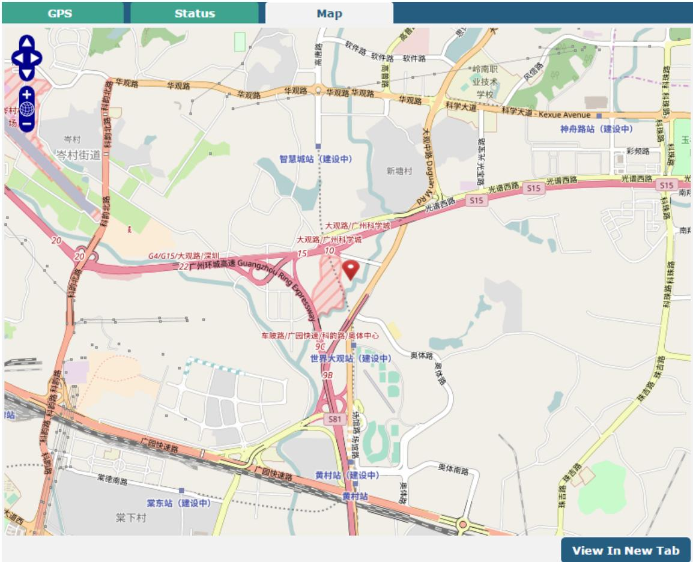


# **4.5.9 Web Server**

This section allows you to modify the parameters of Web Server.

| Web Server         | Certificate Management |          |
|--------------------|------------------------|----------|
| ^ General Settings |                        |          |
|                    | HTTP Port              | C<br>80  |
|                    | HTTPS Port             | C<br>443 |

| General Settings @ Web Server |                                                                                    |         |  |
|-------------------------------|------------------------------------------------------------------------------------|---------|--|
| Item                          | Description                                                                        | Default |  |
| HTTP Port                     | Enter the HTTP port number you want to change in router's Web Server. On a         | 80      |  |
|                               | Web server, port 80 is the port that the server "listens to" or expects to receive |         |  |
|                               | from a Web client. If you configure the router with other HTTP Port number         |         |  |
|                               | except 80, only adding that port number then you can login router's Web            |         |  |
|                               | Server.                                                                            |         |  |
| HTTPS Port                    | Enter the HTTPS port number you want to change in router's Web Server. On a        | 443     |  |
|                               | Web server, port 443 is the port that the server "listens to" or expects to        |         |  |
|                               | receive from a Web client. If you configure the router with other HTTPS Port       |         |  |
|                               | number except 443, only adding that port number then you can login router's        |         |  |
|                               | Web Server.                                                                        |         |  |
|                               | Note: HTTPS is more secure than HTTP. In many cases, clients may be                |         |  |
|                               | exchanging confidential information with a server, which needs to be secured in    |         |  |
|                               | order to prevent unauthorized access. For this reason, HTTP was developed by       |         |  |
|                               | Netscape corporation to allow authorization and secured transactions.              |         |  |

This section allows you to import the certificate file into the router.

| Web Server           | Certificate Management |                              |        |
|----------------------|------------------------|------------------------------|--------|
| A Import Certificate |                        |                              |        |
|                      | Import Type            | CA                           |        |
|                      | HTTPS Certificate      | Choose File   No file chosen | Import |

| Import Certificate |                                                                                          |    |  |
|--------------------|------------------------------------------------------------------------------------------|----|--|
| Item               | Description                                                                              |    |  |
| Import Type        | Select from "CA" and "Private Key".                                                      | CA |  |
|                    | <br>CA: a digital certificate issued by CA center                                       |    |  |
|                    | <br>Private Key: a private key file                                                     |    |  |
| HTTPS Certificate  | Click on "Choose File" to locate the certificate file from your computer, and then<br>-- |    |  |
|                    | click "Import" to import this file into your router.                                     |    |  |


# **4.5.10Advanced**

This section allows you to set the Advanced and parameters. Advanced router settings include system settings and restart.

| System            | Reboot        |                                 |
|-------------------|---------------|---------------------------------|
| へ System Settings |               |                                 |
|                   | Device Name   | 1<br>router                     |
|                   | User LED Type | 3<br>None<br>>                  |
| System            | Reboot        |                                 |
| へ System Settings |               |                                 |
|                   | Device Name   | ಲಿ<br>router                    |
|                   | User LED Type | 2<br>None<br>>                  |
|                   |               | None<br>SIM<br>OpenVPN<br>IPSec |

| System Settings |                                                                                |         |
|-----------------|--------------------------------------------------------------------------------|---------|
| Item            | Description                                                                    | Default |
| Device Name     | Set the device name to distinguish different devices you have installed; valid | router  |
|                 | characters are a-z, A-Z, 0-9, @, ., -, #, \$, and *.                           |         |
| User LED Type   | Specify the display type of your USR LED. Select from "None", "OpenVPN" or     | None    |
|                 | "IPsec".                                                                       |         |
|                 | <br>None: Meaningless indication, and the LED is off                          |         |
|                 | <br>SIM:show the sim status.                                                  |         |
|                 | <br>OpenVPN: USR indicator showing the OpenVPN status                         |         |
|                 | <br>IPsec: USR indicator showing the IPsec status                             |         |
|                 | Note: For more details about USR indicator, see "2.2 LED Indicators".          |         |

| System                     | Reboot            |   |
|----------------------------|-------------------|---|
| ^ Periodic Reboot Settings |                   |   |
|                            | Periodic Reboot   | 0 |
|                            | Daily Reboot Time |   |

| Reboot            |                                                                                 |         |
|-------------------|---------------------------------------------------------------------------------|---------|
| Item              | Description                                                                     | Default |
| Periodic Reboot   | Set the reboot period of the router. 0 means disable.                           | 0       |
| Daily Reboot Time | Set the daily reboot time of the router, you should follow the format as HH:    | Null    |
|                   | MM, in 24h time frame, otherwise the data will be invalid. Leave it empty means |         |
|                   | disable.                                                                        |         |


# 4.6 System

# **4.6.1 Debug**

This section allows you to check and download the syslog details. Click Service > System Log > System Log Settings to open the system log.

| Syslog                                                                                                                                                                                                                                                                                                                                                                                                                                                                                                                                                                                                                                                                                                                                                                                                                                                                                                                                                                                                                                                                                                                                                                                                                                                                                                                                                                                                                                                                                                                                                                                                                                                                                                                                                                                                                                                                                                                                                                                                                                                                                                                                                                                                                                             |                        |           |                                   |
|----------------------------------------------------------------------------------------------------------------------------------------------------------------------------------------------------------------------------------------------------------------------------------------------------------------------------------------------------------------------------------------------------------------------------------------------------------------------------------------------------------------------------------------------------------------------------------------------------------------------------------------------------------------------------------------------------------------------------------------------------------------------------------------------------------------------------------------------------------------------------------------------------------------------------------------------------------------------------------------------------------------------------------------------------------------------------------------------------------------------------------------------------------------------------------------------------------------------------------------------------------------------------------------------------------------------------------------------------------------------------------------------------------------------------------------------------------------------------------------------------------------------------------------------------------------------------------------------------------------------------------------------------------------------------------------------------------------------------------------------------------------------------------------------------------------------------------------------------------------------------------------------------------------------------------------------------------------------------------------------------------------------------------------------------------------------------------------------------------------------------------------------------------------------------------------------------------------------------------------------------|------------------------|-----------|-----------------------------------|
| A Syslog Details                                                                                                                                                                                                                                                                                                                                                                                                                                                                                                                                                                                                                                                                                                                                                                                                                                                                                                                                                                                                                                                                                                                                                                                                                                                                                                                                                                                                                                                                                                                                                                                                                                                                                                                                                                                                                                                                                                                                                                                                                                                                                                                                                                                                                                   |                        |           |                                   |
|                                                                                                                                                                                                                                                                                                                                                                                                                                                                                                                                                                                                                                                                                                                                                                                                                                                                                                                                                                                                                                                                                                                                                                                                                                                                                                                                                                                                                                                                                                                                                                                                                                                                                                                                                                                                                                                                                                                                                                                                                                                                                                                                                                                                                                                    | Log Level              |           | Debua<br>V                        |
|                                                                                                                                                                                                                                                                                                                                                                                                                                                                                                                                                                                                                                                                                                                                                                                                                                                                                                                                                                                                                                                                                                                                                                                                                                                                                                                                                                                                                                                                                                                                                                                                                                                                                                                                                                                                                                                                                                                                                                                                                                                                                                                                                                                                                                                    |                        |           | 0                                 |
| Filtering<br>Feb 27 14:29:07 router user. debug link manager [842]: target link WHAN1, state Connected<br>Feb 27 14:29:07 router user. info link manager [842]: WWAN1 ping test success<br>Feb 27 14:29:23 router user. debug modemd [876]: +CUSATP:<br>"D0648103012500820281828505800055005300490405361589475288F0801807CEE54C1631883508F0A0280618F0<br>AU3804FEF6C11670D52d18F0C0480624B67388154E1153858F0.00680727960E079335305"<br>Feb 27 14:31:23 router user. debug modemd [876]: +CUSATP:<br>"D0648103012500820281828505800055005300490405361589475288F0801807CEE54C1631883508F0A02806C839011884C8BC18F0<br>AC380FFF6C11670D52d18F0C0480624B673884254E1153858F0A0680727960E07935305"<br>Feb 27 14:33:23 router user. debug modemd [876]: +CUSATP:<br>"D064810301250082028182850680055004904053615E9475288F0A01807CEE54C1631883508F0A02806C83901A84C8BC18F0<br>AD3804FFF6C1167DD52A18F0C0480624B673A84254E1A53858F0A05806D4191CF4F13533A8F0A0680727960E07935305"<br>Feb 27 14:34:07 router user. debug link_manager[842]: WWAN1 (wwan) start ping test<br>Feb 27 14:34:07 router user. debug rping [16182]: start ping 8.8.8.8 (wwan)<br>Feb 27 14:34:07 router user.debug pirag[16182]: PING 8.8.8.8 (8.8.8) from 10.122.74.11: 16 data bytes<br>Feb 27 14:34:07 router user.debug ming[16182]: 24 bytes from 8.8.8.8: see 0 ttl=52 time=324.000 ms<br>Feb 27 14:34:07 router user. debug rping [16182] :<br>Feb 27 14:34:07 router user. debug rping [16182]: - 8.8.8.8 ping statistics -<br>Feb 27 14:34:07 router user.debug ming[16182]: 1 packets received, 0% packet loss<br>Feb 27 14:34:07 router user.debug ming [16182]: round-trip min/avg/nax = 324.080/324.080 ms<br>Feb 27 14:34:07 router user. debug link_manager [842]: recv action ping_success_from_rping<br>Feb 27 14:34:07 router user. debug link manager [842]: target link WWAN1, state Connected<br>Feb 27 14:34:07 router user. info link_manager [842]: WWAN1 ping test success<br>Feb 27 14:35:23 router user. debug modemd [876]: +CUSATP:<br>"D06481030125008202818285068000550053049004053615E9475288F0A01807CEE54C1631883508F0A02806C839011884C8BC18F0<br>A03804FBF6C11670D52A18F0C0480624B673A84254E1A53858F0A05806D4191CF4E13533A8F0A0680727960E07935305" |                        |           |                                   |
|                                                                                                                                                                                                                                                                                                                                                                                                                                                                                                                                                                                                                                                                                                                                                                                                                                                                                                                                                                                                                                                                                                                                                                                                                                                                                                                                                                                                                                                                                                                                                                                                                                                                                                                                                                                                                                                                                                                                                                                                                                                                                                                                                                                                                                                    |                        |           | Clear<br>Refres<br>Manual Refresh |
| A Syslog Files                                                                                                                                                                                                                                                                                                                                                                                                                                                                                                                                                                                                                                                                                                                                                                                                                                                                                                                                                                                                                                                                                                                                                                                                                                                                                                                                                                                                                                                                                                                                                                                                                                                                                                                                                                                                                                                                                                                                                                                                                                                                                                                                                                                                                                     |                        |           |                                   |
| Index                                                                                                                                                                                                                                                                                                                                                                                                                                                                                                                                                                                                                                                                                                                                                                                                                                                                                                                                                                                                                                                                                                                                                                                                                                                                                                                                                                                                                                                                                                                                                                                                                                                                                                                                                                                                                                                                                                                                                                                                                                                                                                                                                                                                                                              | File Name              | File Size | Modification Time                 |
| 1                                                                                                                                                                                                                                                                                                                                                                                                                                                                                                                                                                                                                                                                                                                                                                                                                                                                                                                                                                                                                                                                                                                                                                                                                                                                                                                                                                                                                                                                                                                                                                                                                                                                                                                                                                                                                                                                                                                                                                                                                                                                                                                                                                                                                                                  | messages               | 112612    | Mon Feb 27 14:35:23 2017          |
| A System Diagnostic Data                                                                                                                                                                                                                                                                                                                                                                                                                                                                                                                                                                                                                                                                                                                                                                                                                                                                                                                                                                                                                                                                                                                                                                                                                                                                                                                                                                                                                                                                                                                                                                                                                                                                                                                                                                                                                                                                                                                                                                                                                                                                                                                                                                                                                           |                        |           |                                   |
|                                                                                                                                                                                                                                                                                                                                                                                                                                                                                                                                                                                                                                                                                                                                                                                                                                                                                                                                                                                                                                                                                                                                                                                                                                                                                                                                                                                                                                                                                                                                                                                                                                                                                                                                                                                                                                                                                                                                                                                                                                                                                                                                                                                                                                                    | System Diagnostic Data |           | Generate                          |
|                                                                                                                                                                                                                                                                                                                                                                                                                                                                                                                                                                                                                                                                                                                                                                                                                                                                                                                                                                                                                                                                                                                                                                                                                                                                                                                                                                                                                                                                                                                                                                                                                                                                                                                                                                                                                                                                                                                                                                                                                                                                                                                                                                                                                                                    | System Diagnostic Data |           | Download                          |

| Syslog         |                                                                                             |  |
|----------------|---------------------------------------------------------------------------------------------|--|
| Item           | Description                                                                                 |  |
| Syslog Details |                                                                                             |  |
| Log Level      | Select from "Debug", "Info", "Notice", "Warn", "Error" which from low to high. The lower    |  |
|                | level will output more syslog in detail.                                                    |  |
| Filtering      | Enter the filtering message based on the keywords. Use "&" to separate more than one filter |  |
|                | message, such as "keyword1&keyword2".                                                       |  |
| Refresh        | Select from "Manual Refresh", "5 Seconds", "10 Seconds", "20 Seconds" or "30 Seconds". You  |  |
|                | can select these intervals to refresh the log information displayed in the follow box. If   |  |


|                        | selecting "manual refresh", you should click the refresh button to refresh the syslog.              |  |
|------------------------|-----------------------------------------------------------------------------------------------------|--|
|                        | Click the button to clear the syslog.                                                               |  |
|                        | Click the button to refresh the syslog.                                                             |  |
| Syslog Files           |                                                                                                     |  |
| Syslog Files List      | Only when logging is turned on in Services > system log > system log settings can log files be      |  |
|                        | displayed in this list. The log generates a file with the size of 200K, which can display up to six |  |
|                        | system log files. Five files named messages0 ~ messages4 are old logs, and the latest system        |  |
|                        | log file messages will be set at the top.                                                           |  |
| System Diagnosing Data |                                                                                                     |  |
|                        | Click to generate the syslog diagnosing file.                                                       |  |
|                        | Click to download system diagnosing file.                                                           |  |

# **4.6.2 Update**

This section allows you to upgrade the firmware of your router. Click **System > Update > System Update**, and click on "Choose File" to locate the firmware file to be used for the upgrade. Once the latest firmware has been chosen, click

to start the upgrade process. The upgrade process may take several minutes. Do not turn off your Router

during the firmware upgrade process.

**Note**: To access the latest firmware file, please contact your technical support engineer.

| Update          |      |                              |        |
|-----------------|------|------------------------------|--------|
| A System Update |      |                              |        |
|                 | File | Choose File   No file chosen | Update |

# **4.6.3 App Center**

This section allows you to add some required or customized applications to the router. Import and install your applications to the App Center, and reboot the device according to the system prompts. Each installed application will be displayed under the "Services" menu, while other applications related to VPN will be displayed under the "VPN" menu.

**Note:** After importing the applications to the router, the page display may have a slight delay due to the browser cache. It is recommended that you clear the browser cache first and log in the router again.

| App Center    |                                                                                              |
|---------------|----------------------------------------------------------------------------------------------|
|               | For more information about APP Center, refer to http://www.robustel.com/products/app-center/ |
| A App Install |                                                                                              |
|               | Choose File   No file chosen<br>Install<br>File                                              |

Successfully installed apps will be displayed in the following list, click to uninstall the app.


| A Installed Apps |                  |         |         |                  |        |
|------------------|------------------|---------|---------|------------------|--------|
| Index            | Name             | Version | Status  | Description      |        |
|                  | language_chinese | 051101  | Stopped | Chinese language | S<br>C |

| App Center     |                                                                                    |         |  |  |
|----------------|------------------------------------------------------------------------------------|---------|--|--|
| Item           | Description                                                                        | Default |  |  |
| App Install    |                                                                                    |         |  |  |
| Install to SD  | Click the toggle button to enable/disable the ability to install the app to the SD | OFF     |  |  |
| card           | card.                                                                              |         |  |  |
| File           | Click on "Choose File" to locate the App file from your computer, and then click   | --      |  |  |
|                | to import this file into your router.                                              |         |  |  |
|                | Note: File format should be xxx.rpk.                                               |         |  |  |
| Installed Apps |                                                                                    |         |  |  |
| Index          | Indicate the ordinal of the list.                                                  | --      |  |  |
| Name           | Show the name of the App.                                                          | Null    |  |  |
| Version        | Show the version of the App.                                                       | Null    |  |  |
| Status         | Show the status of the App.                                                        | Null    |  |  |
| Location       | Show the installation path.                                                        | Null    |  |  |
| Description    | Show the description for this App.                                                 | Null    |  |  |

# **4.6.4 Tools**

This section provides users three tools: Ping, Traceroute and Sniffer. The Ping tool is used to detect the network connectivity of the router.

| Ørobustel |
|-----------|
|           |

| Ping   | Traceroute        | Sniffer |
|--------|-------------------|---------|
| へ Ping |                   |         |
|        | IP Address        |         |
|        | Number of Request | 5       |
|        | Timeout           | 1       |
|        | Local IP          |         |
|        |                   |         |
|        |                   |         |
|        |                   |         |
|        |                   |         |
|        |                   |         |
|        |                   |         |
|        |                   |         |
|        |                   |         |
|        |                   |         |
|        |                   |         |
|        |                   | Stop    |
|        |                   | Start   |

| Ping               |                                                                               |      |  |
|--------------------|-------------------------------------------------------------------------------|------|--|
| Item               | Description                                                                   |      |  |
| IP address         | Enter the ping's destination IP address or destination domain.                | Null |  |
| Number of Requests | Specify the number of ping requests.                                          | 5    |  |
| Timeout            | Specify the timeout of ping request.                                          | 1    |  |
| Local IP           | Specify the local IP from cellular WAN, Ethernet WAN or Ethernet LAN. Null    | Null |  |
|                    | stands for selecting local IP address from these three automatically.         |      |  |
|                    | Click this button to start ping request, and the log will be displayed in the | Null |  |
|                    | follow box.                                                                   |      |  |
|                    | Click this button to stop ping request.                                       | --   |  |

| 151 |  | robustel |
|-----|--|----------|
|-----|--|----------|

| Ping         | Sniffer<br>Traceroute |               |
|--------------|-----------------------|---------------|
| へ Traceroute |                       |               |
|              | Trace Address         |               |
|              | Trace Hops            | 30            |
|              | Trace Timeout         | 1             |
|              |                       |               |
|              |                       |               |
|              |                       |               |
|              |                       |               |
|              |                       |               |
|              |                       |               |
|              |                       |               |
|              |                       |               |
|              |                       |               |
|              |                       |               |
|              |                       | Start<br>Stop |

| Traceroute    |                                                                                 |         |  |
|---------------|---------------------------------------------------------------------------------|---------|--|
| Item          | Description                                                                     | Default |  |
| Trace Address | Enter the trace's destination IP address or destination domain.                 | Null    |  |
| Trace Hops    | Specify the max trace hops. Router will stop tracing if the trace hops has met  | 30      |  |
|               | max value no matter the destination has been reached or not.                    |         |  |
| Trace Timeout | Specify the timeout of Traceroute request.                                      | 1       |  |
|               | Click this button to start Traceroute request, and the log will be displayed in | --      |  |
|               | the follow box.                                                                 |         |  |
|               | Click this button to stop Traceroute request.                                   | --      |  |

| Ping      | Traceroute            | Sniffer         |                          |
|-----------|-----------------------|-----------------|--------------------------|
| A Sniffer |                       |                 |                          |
|           |                       | Interface       | all<br>V                 |
|           |                       | Host            |                          |
|           |                       | Packets Request | 1000                     |
|           |                       | Protocol        | All<br>V                 |
|           |                       | Status          |                          |
|           |                       |                 | Start<br>Stop            |
|           | ^ Capture Files       |                 |                          |
| Index     | File Name             | File Size       | Modification Time        |
| 1         | 18-04-18_16-17-29.cap | 24              | Wed Apr 18 16:17:30 2018 |


| Sniffer         |                                                                                        |      |  |
|-----------------|----------------------------------------------------------------------------------------|------|--|
| Item            | Description                                                                            |      |  |
| Interface       | Choose the interface according to your Ethernet configuration.                         | All  |  |
| Host            | Filter the packet that contain the specify IP address.                                 |      |  |
| Packets Request | Set the packet number that the router can sniffer at a time.                           |      |  |
| Protocol        | Select from "All", "IP", "TCP", "UDP" and "ARP".                                       | All  |  |
| Port            | Set the port number for TCP or UDP that is used in sniffer.                            | Null |  |
| Status          | Show the current status of sniffer.                                                    | Null |  |
|                 | Click this button to start the sniffer. The grab file will be displayed in the window. | --   |  |
|                 | Click<br>to download the grab file and click<br>to delete the grab file.               |      |  |
|                 | Click this button to stop the sniffer. Once you click this button, a new log file      | --   |  |
|                 | will be displayed in the following List.                                               |      |  |
| Capture Files   | Every times of sniffer log will be saved automatically as a new file. You can find     | Null |  |
|                 | the file from this Sniffer Traffic Data List and click<br>to download the log, click   |      |  |
|                 | to delete the log file. It can cache a maximum of 5 files.                             |      |  |

# **4.6.5 Profile**

This section allows you to import or export the configuration file, and restore the router to factory default setting.

| Profile                     | Rollback                              |                                         |
|-----------------------------|---------------------------------------|-----------------------------------------|
| ^ Import Configuration File |                                       |                                         |
|                             | Reset Other Settings to Default       | 2<br>OFF                                |
|                             | Ignore Invalid Settings               | 2<br>ON                                 |
|                             | XML Configuration File                | No file chosen<br>Choose File<br>Import |
| ^ Export Configuration File |                                       |                                         |
|                             | Ignore Disabled Features              | C<br>OFF                                |
|                             | Add Detailed Information              | 2<br>OFF                                |
|                             | Encrypt Secret Data                   | 2<br>ON                                 |
|                             | XML Configuration File                | Generate                                |
| A Default Configuration     |                                       |                                         |
|                             | Save Running Configuration as Default | C<br>Save                               |
|                             | Restore to Default Configuration      | Restore                                 |

| Profile                   |                                                                       |         |
|---------------------------|-----------------------------------------------------------------------|---------|
| Item                      | Description                                                           | Default |
| Import Configuration File |                                                                       |         |
| Reset Other Settings to   | Click the toggle button as "ON" to return other parameters to default | OFF     |
| Default                   | settings.                                                             |         |


| Ignore Invalid Settings<br>Click the toggle button as "ON" to ignore invalid settings. |                                                                   | ON  |  |
|----------------------------------------------------------------------------------------|-------------------------------------------------------------------|-----|--|
| XML Configuration File                                                                 | Click on<br>to locate the XML configuration file from your        |     |  |
|                                                                                        | computer, and then click<br>to import this file into your router. |     |  |
| Export Configuration File                                                              |                                                                   |     |  |
| Ignore Disabled Features                                                               | Click the toggle button as "ON" to ignore the disabled features.  | OFF |  |
| Add Detailed Information                                                               | Click the toggle button as "ON" to add detailed information.      | OFF |  |
| Encrypt Secret Data                                                                    | Click the toggle button as "ON" to encrypt the secret data.       | ON  |  |
| XML Configuration File                                                                 | Click<br>button to generate the XML configuration file, and click | --  |  |
|                                                                                        | to export the XML configuration file.                             |     |  |
| Default Configuration                                                                  |                                                                   |     |  |
| Save Running                                                                           | Click<br>button to save the current running parameters as default | --  |  |
| Configuration as Default                                                               | configuration.                                                    |     |  |
| Restore to Default                                                                     |                                                                   |     |  |
| Click<br>button to restore the factory defaults.<br>Configuration                      |                                                                   |     |  |

| Profile                                       | Rollback  |           |                   |  |
|-----------------------------------------------|-----------|-----------|-------------------|--|
| へ Configuration Rollback                      |           |           |                   |  |
| (7)<br>Save as a Rollbackable Archive<br>Save |           |           |                   |  |
| へ Configuration Archive Files                 |           |           |                   |  |
| Index                                         | File Name | File Size | Modification Time |  |

| Rollback                    |                                                                           |         |
|-----------------------------|---------------------------------------------------------------------------|---------|
| Item                        | Description                                                               | Default |
| Configuration Rollback      |                                                                           |         |
| Save as a Rollbackable      | Create a save point manually. Additionally, the system will create a save | --      |
| Archive                     | point every day automatically if configuration changes.                   |         |
| Configuration Archive Files |                                                                           |         |
| Configuration Archive       | View the related information about configuration archive files, including | --      |
| Files                       | name, size and modification time.                                         |         |


# **4.6.6 User Management**

This section allows you to change your username and password, and create or manage user accounts. One router has only one super user who has the highest authority to modify, add and manage other common users.

**Note:** Your new password must be more than 5 character and less than 32 characters and may contain numbers, upper and lowercase letters, and standard symbols.

| Super User<br>Common User |    |
|---------------------------|----|
| ^ Super User Settings     |    |
| New Username              | ಲಿ |
| Old Password              | ಲಿ |
| New Password              | ಲಿ |
| Confirm Password          |    |

| Super User Settings |                                                                                   |         |  |
|---------------------|-----------------------------------------------------------------------------------|---------|--|
| Item                | Description                                                                       | Default |  |
| New Username        | Enter a new username you want to create,If you do not want to change              | Null    |  |
|                     | username, leave it blank. 5-32 characters, valid characters: a-z, A-Z, 0-9, @, #, |         |  |
|                     | \$, ., *, !, -                                                                    |         |  |
| Old Password        | Enter the old password of your router. The default is "admin",5-32 characters,    | Null    |  |
|                     | valid characters: a-z, A-Z, 0-9, @, #, \$, ., *, !, -                             |         |  |
| New Password        | Enter a new password you want to create, 5-32 characters, valid characters: a     | Null    |  |
|                     | z, A-Z, 0-9, @, #, \$, ., *, !, -                                                 |         |  |
| Confirm Password    | Enter the new password again to confirm.                                          | Null    |  |

| Super User             |      | Common User |  |  |
|------------------------|------|-------------|--|--|
| へ Common User Settings |      |             |  |  |
| Index                  | Role | Username    |  |  |

#### Click button to add a new common user. The maximum rule count is 5.

| Common User             |              |
|-------------------------|--------------|
| へ Common Users Settings |              |
| Index                   |              |
| Role                    | Visitor<br>V |
| Username                | 2            |
| Password                | 3            |


| Common User Settings |                                                                                          |      |
|----------------------|------------------------------------------------------------------------------------------|------|
| Item                 | Description                                                                              |      |
| Index                | Indicate the ordinal of the list.                                                        | --   |
| Role                 | Select from "Visitor" and "Editor".<br>Visitor                                           |      |
|                      | <br>Visitor: Users only can view the configuration of router under this level           |      |
|                      | <br>Editor: Users can view and set the configuration of router under this level         |      |
| Username             | Set the Username, 5-32 characters, valid characters: a-z, A-Z, 0-9, @, #, \$, ., *, !, - | Null |
| Password             | Set the password, 5-32 characters, valid characters: a-z, A-Z, 0-9, @, #, \$, ., *, !, - | Null |


# Chapter 5 Configuration Examples

# 5.1 Cellular

# **5.1.1 Cellular Dial-Up**

This section shows you how to configure the primary and backup SIM card for Cellular Dial-up. Connect the router correctly and insert two SIM, then open the configuration page. Under the homepage menu, click **Interface > Link Manager > Link Manager > General Settings**, choose "WWAN1" as the primary link, "WWAN2" as the backup link and "Cold Backup "as the backup mode then click "Submit".

**Note:** In the cold backup mode, when WWAN1 is the primary link, all data will be selected as WWAN1 for transmission, and WWAN2 will always be offline as the backup link; when WWAN1 is disconnected, the data will be switched to WWAN2 for transmission

| Link Manager    |                    | Status      |                  |                       |
|-----------------|--------------------|-------------|------------------|-----------------------|
|                 | へ General Settings |             |                  |                       |
|                 |                    |             | Primary Link     | 2<br>WWAN1<br>v       |
|                 |                    |             | Backup Link      | WWAN2<br>V            |
|                 |                    |             | Backup Mode      | 3<br>Cold Backup<br>V |
|                 |                    |             | Revert Interval  | 0<br>0                |
|                 |                    |             | Emergency Reboot | 3<br>OFF              |
| A Link Settings |                    |             |                  |                       |
| Index           | Type               | Description | Connection Type  |                       |
| 1               | WWAN1              |             | DHCP             |                       |
| 2               | WWAN2              |             | DHCP             | જ જિલ્લ               |
| 3               | WAN                |             | DHCP             |                       |
| 4               | WLAN               |             | DHCP             | P                     |

Click the right most of edit button of WWAN1 to set its parameters according to the current ISP.

| Link Manager       |            |
|--------------------|------------|
| へ General Settings |            |
| Index              | 1          |
| Type               | WWAN1<br>V |
| Description        |            |

| natic APN Selection | ON             |   |  |
|---------------------|----------------|---|--|
| Dialup Number       | *gg***1#       |   |  |
| Authentication Type | Auto<br>V      |   |  |
| By Data Allowance   | 0<br>OFF<br>ON |   |  |
| Data Allowance      | 0              | 3 |  |
| Billing Day         | 1              | 1 |  |
|                     |                |   |  |
|                     |                | C |  |
|                     |                |   |  |

| へ Ping Detection Settings | (3              |
|---------------------------|-----------------|
| Enable                    | ON              |
| Primary Server            | 8.8.8.8         |
| Secondary Server          | 114.114.114.114 |
| Interval                  | 3<br>300        |
| Retry Interval            | 3<br>5          |
| Timeout                   | 0<br>3          |
| Max Ping Tries            | 1<br>3          |

| へ Advanced Settings     |            |  |  |
|-------------------------|------------|--|--|
| NAT Enable              | ON         |  |  |
| Upload Bandwidth        | C<br>10000 |  |  |
| Download Bandwidth      | 10000      |  |  |
| Overrided Primary DNS   |            |  |  |
| Overrided Secondary DNS |            |  |  |
| Debug Enable            | ON         |  |  |
| Verbose Debug Enable    | OFF        |  |  |

When finished, click **Submit > Save & Apply** for the configuration to take effect.

#### The window is displayed below by clicking **Interface > Cellular > Advanced Cellular Settings**.

| Cellular |          | Status                       | AT Debug     |                  |    |
|----------|----------|------------------------------|--------------|------------------|----|
|          |          | ^ Advanced Cellular Settings |              |                  |    |
| Index    | SIM Card | Phone Number                 | Network Type | Band Select Type |    |
| 1        | SIM1     |                              | Auto         | All              | R  |
| വ        | SIM2     |                              | Auto         | All              | Pi |

Click the right most of edit button of SIM1 to set its parameters according to your application request.


|                             | Cellular             |              |           |    |  |
|-----------------------------|----------------------|--------------|-----------|----|--|
|                             | へ General Settings   |              |           |    |  |
|                             |                      | Index        | 1         |    |  |
|                             |                      | SIM Card     | SIM1<br>V |    |  |
|                             |                      | Phone Number |           |    |  |
|                             |                      | PIN Code     |           | ு  |  |
|                             |                      | Extra AT Cmd |           | ಲಿ |  |
|                             |                      | Telnet Port  | 0         | ு  |  |
| ^ Cellular Network Settings |                      |              |           |    |  |
|                             | Network Type         | Auto<br>>    | 3         |    |  |
|                             | Band Select Type     | All<br>>     | ಲಿ        |    |  |
| へ Advanced Settings         |                      |              |           |    |  |
|                             | Debug Enable         | ON           |           |    |  |
|                             | Verbose Debug Enable | OFF          |           |    |  |

When finished, click **Submit > Save & Apply** for the configuration to take effect.

# **5.1.2 SMS Remote Control**

The router supports remote control via SMS. You can use following commands to get the status of the router, and set all the parameters.

There are three authentication types for SMS control. You can select from "Password", "Phonenum" or "Both".

#### **An SMS command has the following structure:**

- 1. Password mode—**Username:Password;cmd1;cmd2;cmd3;…cmdn** (available for every phone number).
- 2. Phonenum mode-- **Password;cmd1;cmd2;cmd3;… cmdn** (available when the SMS was sent from the phone number which had been added in R1520's phone group).
- 3. Both mode-- **Username:Password;cmd1;cmd2;cmd3;…cmdn** (available when the SMS was sent from the phone number).

**Note:** All command symbols must be entered in the English input half angle mode.

#### **SMS command Explanation:**

- 1. Password: The SMS control password defaults to the login password of the super user or the login password of the ordinary user who has read and write permissions.
- 2. **cmd1,cmd2,cmd3 to cmdn**, the command format is the same as the CLI command, more details about CLI cmd please refer to **Chapter 6 Introductions for CLI**.

**Note:** Download the configure XML file from the configured web browser. The format of SMS control command can refer to the data of the XML file.

Go to **System > Profile > Export Configuration File**, Select export type as "complete", click to generate the XML file and click to export the XML file.


| Profile                     | Rollback                              |                                         |  |  |
|-----------------------------|---------------------------------------|-----------------------------------------|--|--|
|                             | ^ Import Configuration File           |                                         |  |  |
|                             | Reset Other Settings to Default       | 0<br>OFF                                |  |  |
|                             | Ignore Invalid Settings               | 0<br>ON                                 |  |  |
|                             | XML Configuration File                | No file chosen<br>Choose File<br>Import |  |  |
| ^ Export Configuration File |                                       |                                         |  |  |
|                             | Ignore Disabled Features              | 0<br>OFF                                |  |  |
|                             | Add Detailed Information              | C<br>OFF                                |  |  |
|                             | Encrypt Secret Data                   | 2<br>ON                                 |  |  |
|                             | XML Configuration File                | Generate                                |  |  |
| ^ Default Configuration     |                                       |                                         |  |  |
|                             | Save Running Configuration as Default | C<br>Save                               |  |  |
|                             | Restore to Default Configuration      | Restore                                 |  |  |

#### *XML command:*

<lan>

```
<network max_entry_num="2">
<id>1</id>
<interface>lan0</interface>
<ip>172.16.24.24</ip>
<netmask>255.255.0.0</netmask>
<mtu>1500</mtu>
```
#### **SMS cmd:**

set lan network 1 interface lan0 set lan network 1 ip 172.16.24.24 set lan network 1 netmask 255.255.0.0 set lan network 1 mtu 1500

- 3. The semicolon character (';') is used to separate more than one command packed in a single SMS.
- 4. E.g.

#### Password mode**—admin:admin;status system**

In this command, username is "admin", password is "admin", The control command is status system, and the function of the command is to get the system status.

#### **SMS received:**

hardware_version = 1.1 firmware_version = 3.1.0 firmware_version_full = "3.1.0 (Rev 3199)" kernel_version = 4.9.152 device_model = R1520 serial_number = ""

```
uptime = "0 days, 00:02:55"
```


system_time = "Thu May 14 05:51:56 2020 (NTP not updated)" ram_usage = "75M Free/128M Total"

#### **admin:admin;reboot**

In this command, username is "admin", password is "admin", and the command is to reBoot the R1520 Router. **SMS received:**

OK

#### **admin:admin;set firewall remote_ssh_access false;set firewall remote_telnet_access false**

In this command, username is "admin", password is "admin", and the command is to disaBle the remote_ssh and remote_telnet access.

#### **SMS received:**

OK

OK

#### **admin:admin; set lan network 1 interface lan0;set lan network 1 ip 172.16.24.24;set lan network 1 netmask 255.255.0.0;set lan network 1 mtu 1500**

In this command, username is "admin", password is "admin", and the commands is to configure the LAN parameter.

**SMS received:**

OK OK

OK

OK

# 5.2 VPN Configuration Example

# **5.2.1 IPsec VPN**

IPSec VPN sample topology (configuration of Ike and SA parameters of server and client must be consistent):

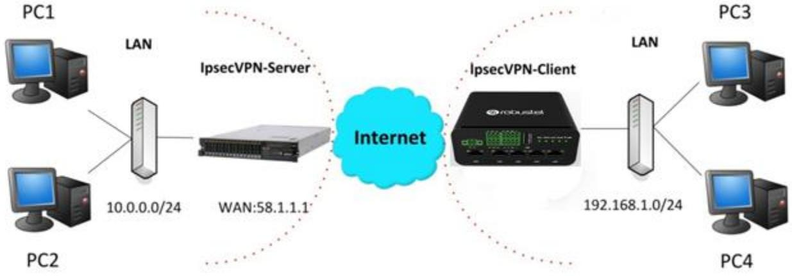


## **IPsec VPN_Server:**

### **Cisco 2811:**


## **IPsec VPN_Client:**

The window is displayed as below by clicking **VPN > IPsec > Tunnel**.

| General           |        | Tunnel      | Status  | ×509         |               |  |
|-------------------|--------|-------------|---------|--------------|---------------|--|
| へ Tunnel Settings |        |             |         |              |               |  |
| Index             | Enable | Description | Gateway | Local Subnet | Remote Subnet |  |

Click button and set the parameters of IPsec Client as below.

| Tunnel                   |                       |
|--------------------------|-----------------------|
| A General Settings       |                       |
| Index                    | 1                     |
| Enable                   | ON                    |
| Description              |                       |
| Gateway                  | ම                     |
| Mode                     | Tunnel<br>V           |
| Protocol                 | ESP<br>V              |
| Local Subnet             | 0                     |
| Remote Subnet            | 0                     |
| Link Binding             | 3<br>Unspecified<br>V |
|                          |                       |
| A IKE Settings           |                       |
| IKE Type                 | IKEv1<br>V            |
| Negotiation Mode         | Main<br>V             |
| Encryption Algorithm     | 3DES<br>V             |
| Authentication Algorithm | SHA1<br>V             |
|                          |                       |
| IKE DH Group             | DHgroup2<br>V         |
| Authentication Type      | PSK<br>V              |
| PSK Secret               |                       |
| Local ID Type            | Default<br>V          |
| Remote ID Type           | Default<br>V          |


| A SA Settings            |               |  |  |  |  |  |
|--------------------------|---------------|--|--|--|--|--|
| Encryption Algorithm     | 3DES<br>V     |  |  |  |  |  |
| Authentication Algorithm | SHA1<br>V     |  |  |  |  |  |
| PFS Group                | DHgroup2<br>V |  |  |  |  |  |
| SA Lifetime              | 0<br>28800    |  |  |  |  |  |
| DPD Interval             | 0<br>30       |  |  |  |  |  |
| DPD Failures             | 0<br>150      |  |  |  |  |  |
| A Advanced Settings      |               |  |  |  |  |  |
| Enable Compression       | OFF           |  |  |  |  |  |
| Enable Forceencaps       | 0<br>OFF      |  |  |  |  |  |
| Expert Options           | 0             |  |  |  |  |  |

When finished, click **Submit > Save & Apply** for the configuration to take effect.

The comparison between IPec Server and Client is as below.

| Server (Cisco 2811)                                                                                                                                                            |                           |               |   |
|--------------------------------------------------------------------------------------------------------------------------------------------------------------------------------|---------------------------|---------------|---|
| Router Panabies                                                                                                                                                                |                           |               |   |
| Rousecoconicia<br>Contigues on from theminal, memory, or setwork [toimling]?                                                                                                   |                           |               |   |
| Tunnel<br>Entes configuration esseands, che per line. End MER CRTL/2.                                                                                                          |                           |               |   |
| Router (config) Scrypto isskep policy 10<br>A Tunnel Settings                                                                                                                  |                           |               |   |
| Rounder [ このベア [ [ = Lasking] # 7                                                                                                                                              |                           |               |   |
| sushensication Tet ausbentlication method for protection walle<br>world from<br>pas and system algorithm for peose estime suite                                                | Index                     |               |   |
| ****<br>Exit from ISANDS protection suite configuresion mode                                                                                                                   | I mallete                 |               |   |
| group<br>Ses Clerie-Mallean group                                                                                                                                              |                           |               |   |
| Set hash algurithm for peccession suite<br>1450                                                                                                                                | Deutription               |               |   |
| Lifeline<br>fer lifetime for ISXING security association                                                                                                                       |                           |               |   |
| Negate a command or set its defeulte<br>N                                                                                                                                      | Galoway                   | 58.1.1.1      | B |
| Rouser (configures) (sescription 3des<br>Rouser (cont-in-isaleg) Thanh mil                                                                                                     | મ્દ્રીનીન                 | Turnel        |   |
| Abused (coolig-1sakes) Rauthensication per-share                                                                                                                               |                           |               |   |
| I mooths (contry-leaking) I group 2                                                                                                                                            | Problem<br>Local Nubriet  | (1)           |   |
| Router (config-isakin) == 11                                                                                                                                                   |                           | 192 : 168.1.0 | 0 |
| Rouner (contine) (0) Peryedd Leaker 7                                                                                                                                          |                           |               |   |
| allent Bas cilent contiguestion pollery                                                                                                                                        | Bornoba frubnet           | 255.255.255.0 | B |
| anable Teable IIIJ220<br>847<br>Int pre-shared hey for sumote poss                                                                                                             |                           |               |   |
| A IKE Settings<br>polloy. Set policy for an IERMOD procedition suite                                                                                                           |                           |               |   |
| Routericonfigiscrypto 188kmp Rey claco address 0.0.0.0 0.0.0.0                                                                                                                 | Nagoliation Mode          | Main          |   |
|                                                                                                                                                                                |                           |               |   |
| IKE Setting in Client must be consistent with server.<br>Router (concig) = mrgpto ?                                                                                            | Autheritication Algorithm | MOS           |   |
| dynamio-map Specify a dynanic crypto map template                                                                                                                              | Encrypt Algorithm         | 3000          |   |
| 10660<br>Configure IPSEC policy                                                                                                                                                |                           |               |   |
| isakmp<br>Configure ISAND(s policy                                                                                                                                             | DOL DE GRING              | MCCP(1024)    |   |
| Ret<br>Long Secm Rey operations                                                                                                                                                | Authentication Type       | MX            |   |
| Coter a crypto map<br>142                                                                                                                                                      |                           |               |   |
| ROUGE (COATIC) SECTINGS (peor 7<br>servity-association Security association paramise                                                                                           | PSK Secret                | ****          |   |
| Define transform and mattings<br>transform-sab                                                                                                                                 | Local ID: Type            | Dielland      |   |
| Router (config) acrypto ipsen transform-set Trans ?                                                                                                                            |                           |               |   |
| ornal, the new<br>ASE-100C-105 Cranafoca                                                                                                                                       | Respots ID: Type          | Chilault      |   |
| alt - alle - haus<br>AM=100AC=550. Transform                                                                                                                                   |                           | 86450         | 8 |
| =========<br>ISP transform using BOEB (EDE) cigher (160 bits)<br>EDP. bransform using AKS ciphat<br>889-1400                                                                   | DX Uretine                |               |   |
| Angidos<br>EBP teansform using DES cipher 18€ bite)<br>A SA Settings                                                                                                           |                           |               |   |
| #ep-md3-hmar EBP Seansform using HDGC-904 subb                                                                                                                                 |                           |               |   |
| angesha-hoar 107 brancform using 2004-100, auth.                                                                                                                               | Encrypt Algorithin        | 3065          |   |
| and as lean later pho lipper Seans comment Teass exp-2dex web-mil-hoad                                                                                                         | Authentication Algorithm  | HOS           |   |
| SA Setting in Client must be consistent with server.                                                                                                                           |                           |               |   |
| Intex (00mf 10) accoass - 1185 ax14mided vya.                                                                                                                                  | PFS Group                 | MODIN(1024)   |   |
| 2005.0.10067.0-400-14011.0000000.000000000000000000000000000000000000000000000000000000000000000000000000000000000000000000000000000000000000000000000000000000000000000000000 | SA Lifettive              | 26800         | B |
| Bouter [008] 19-ext-had]! Secti                                                                                                                                                |                           |               |   |
|                                                                                                                                                                                | DPD Interest              | లిం           | 8 |
| specials ===================================================================================================================================================================== |                           |               | 0 |
| 4 2007K! This nev esysteman attl remain diambled with a year                                                                                                                   | DPD Felleres              | 180           |   |
| and a valid hoceas list have been configured.<br>Routes [config-crypto-map! #match &diters vpn                                                                                 | Advanced Settings         |               |   |
| Touter (configures) supply sus from Comment Trans                                                                                                                              |                           |               |   |
| 30084810000110-083916-048318803 9441 202 113                                                                                                                                   | Enable Compression        | all           |   |
| Tour == [000410-017/040-84818+115                                                                                                                                              |                           |               |   |


# **5.2.2 OpenVPN**

OpenVPN supports two modes, including Client and P2P. Here takes P2P as an example.

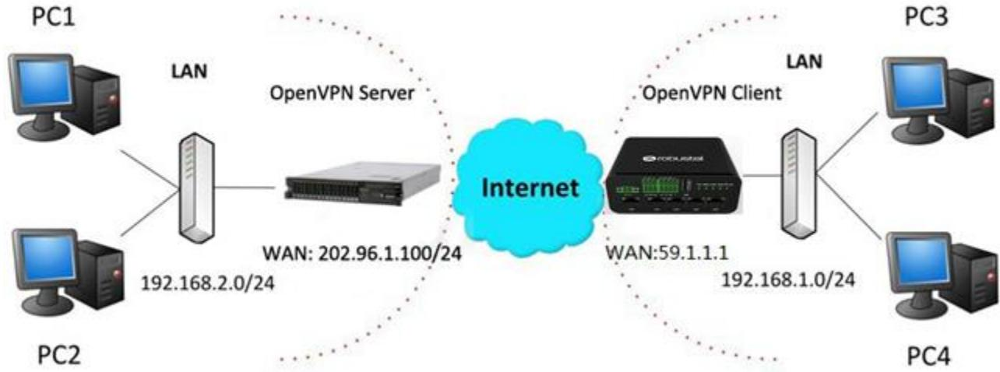

The configuration of two points is as follows.

#### **OpenVPN_Server:**

Generate relevant OpenVPN certificate on the server side firstly, and refer to the following commands to configuration the Server:

local 202.96.1.100 mode server port 1194 proto udp dev tun tun-mtu 1500 fragment 1500 ca ca.crt cert Server01.crt key Server01.key dh dh1024.pem server 10.8.0.0 255.255.255.0 ifconfig-pool-persist ipp.txt push "route 192.168.3.0 255.255.255.0" client-config-dir ccd route 192.168.1.0 255.255.255.0 keepalive 10 120 cipher BF-CBC comp-lzo max-clients 100 persist-key persist-tun status openvpn-status.log verB 3 **Note**: For more configuration details, please contact your technical support engineer.


## **OpenVPN_Client:**

Click **VPN > OpenVPN > OpenVPN** as below.

| OpenVPN           |        | Status      |      | x509     |                |                |  |
|-------------------|--------|-------------|------|----------|----------------|----------------|--|
| へ Tunnel Settings |        |             |      |          |                |                |  |
| Index             | Enable | Description | Mode | Protocol | Server Address | Interface Type |  |

#### Click to configure the Client01 as below.

| A General Settings       |             |    |
|--------------------------|-------------|----|
| Index                    | 1           |    |
| Enable                   | ON          |    |
| Description              |             |    |
| Mode                     | Client<br>V | 3  |
| Protocol                 | UDP<br>V    |    |
| Peer Address             |             |    |
| Peer Port                | 1194        |    |
| Interface Type           | TUN<br>V    |    |
| Authentication Type      | None<br>V   | 0  |
| Encrypt Algorithm        | BF<br>V     |    |
| Authentication Algorithm | SHA1<br>V   |    |
| Renegotiation Interval   | 86400       | 3  |
| Keepalive Interval       | 20          | 3  |
| Keepalive Timeout        | 120         | 0  |
| TUN MTU                  | 1500        |    |
| Max Frame Size           |             |    |
| Enable Compression       | ON          |    |
| Enable NAT               | OFF         |    |
| Enable DNS overrid       | 3<br>OFF    |    |
| Verbose Level            | 0<br>>      | 3  |
| A Advanced Settings      |             |    |
| Enable HMAC Firewall     | OFF         |    |
| Enable PKCS#12           | OFF         |    |
| Enable nsCertType        | OFF         |    |
| Expert Options           |             | ತಿ |

When finished, click **Submit > Save & Apply** for the configuration to take effect.


# **5.2.3 GRE VPN**

GRE VPN example topology:

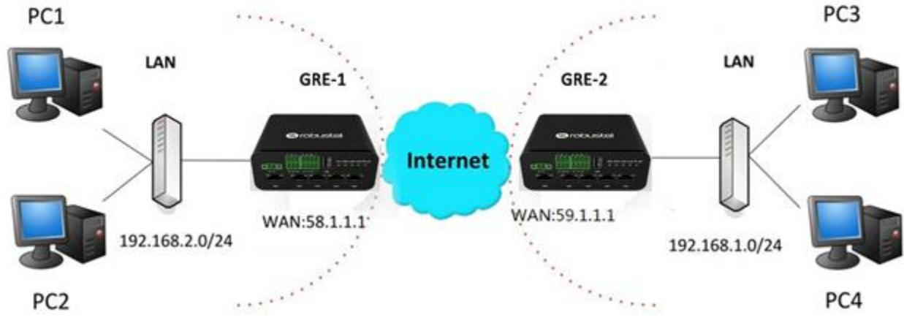

The configuration of two points is as follows.

#### **GRE-1**:

The window is displayed as below by clicking **VPN > GRE > GRE**.

| GRE               |        | Status                        |  |
|-------------------|--------|-------------------------------|--|
| ^ Tunnel Settings |        |                               |  |
| Index             | Enable | Description Remote IP Address |  |

Click button and set the parameters of GRE-1 as below.

| へ Tunnel Settings         |          |
|---------------------------|----------|
| Index                     | 1        |
| Enable                    | ON       |
| Description               | GRE-1    |
| Remote IP Address         | 59.1.1.1 |
| Local Virtual IP Address  | 10.8.0.1 |
| Remote Virtual IP Address | 10.8.0.2 |
| Enable Default Route      | OFF      |
| Enable NAT                | OFF      |
| Secrets                   |          |

When finished, click **Submit > Save & Apply** for the configuration to take effect.


#### **GRE-2:**

Click button and set the parameters of GRE-2 as below.

| へ Tunnel Settings         |           |
|---------------------------|-----------|
| Index                     | 1         |
| Enable                    | ON        |
| Description               | GRE-2     |
| Remote IP Address         | 58.1.1.1  |
| Local Virtual IP Address  | 10.8.0.2  |
| Remote Virtual IP Address | 10.8.0.1  |
| Enable Default Route      | OFF<br>ON |
| Enable NAT                | OFF       |
| Secrets                   |           |

When finished, click **Submit > Save & Apply** for the configuration to take effect.

The comparison between GRE-1 and GRE-2 is as below.

| GRE-1                     |                                     | GRE-2                     |                                     |
|---------------------------|-------------------------------------|---------------------------|-------------------------------------|
| A Tunnel Settings         |                                     | A Tunnel Settings         |                                     |
| Index                     | 1                                   | Index                     | 1                                   |
| Enable                    | ON                                  | Enable                    | ON                                  |
| Description               | GRE- 1                              | Description               | GRE-2                               |
| Remote IP Address         | GRE-1 public IP<br>59.1.1.1         | Remote IP Address         | GRE-2 public IP<br>58.1.1.1         |
| Local Virtual IP Address  | GRE-1 tunnel IP<br>10.8.0.1         | Local Virtual IP Address  | GRE-2 tunnel IP<br>10.8.0.2         |
| Remote Virtual IP Address | GRE-2 tunnel IP<br>10.8.0.2         | Remote Virtual IP Address | GRE-1 tunnel IP<br>10.8.0.1         |
| Enable Default Route      | OFF                                 | Enable Default Route      | ON OFF                              |
| Enable NAT                | set the same secret as GRE-2<br>OFF | Enable NAT                | OFF<br>set the same secret as GRE-1 |
| Secrets                   |                                     | Secrets                   |                                     |


# Chapter 6 Introductions for CLI

# 6.1 What Is CLI

The Command Line Interface (CLI) is a set of software interfaces that provide another way to configure device parameters. Users can connect to the router through SSH or telnet to configure CLI commands. After establishing a Telnet or SSH connection with the router, enter the login account and password (default admin/admin) to enter the router's configuration mode, as shown below.

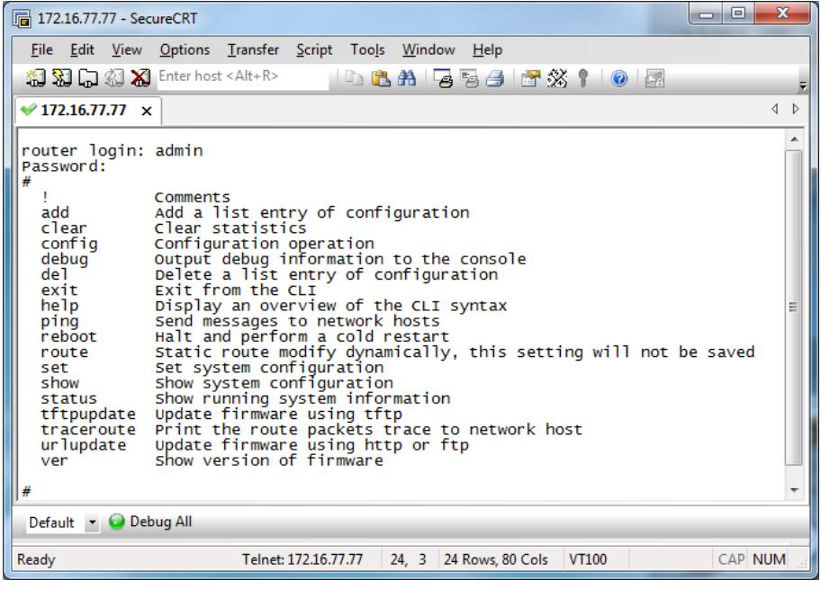

#### **Router login:**

Router login: admin

```
Password: admin
```
#

#### **CLI commands:**

# ? (*Note*: the '?' won't display on the page.)

| ! |               | Comments                                          |
|---|---------------|---------------------------------------------------|
|   | add           | Add a list entry of configuration                 |
|   | clear         | Clear statistics                                  |
|   | config        | Configuration operation                           |
|   | debug         | Output debug information to the console           |
|   | del           | Delete a list entry of configuration              |
|   | exit          | Exit from the CLI                                 |
|   | help          | Display an overview of the CLI syntax             |
|   | ovpn_cert_get | Download OpenVPN certificate file via http or ftp |


| ping       | Send messages to network hosts                   |
|------------|--------------------------------------------------|
| reboot     | Halt and perform a cold restart                  |
| set        | Set system configuration                         |
| show       | Show system configuration                        |
| status     | Show running system information                  |
| tftpupdate | Update firmware or configuration file using tftp |
| traceroute | Print the route packets trace to network host    |
| trigger    | Trigger action                                   |
| urlupdate  | Update firmware via http or ftp                  |
| ver        | Show version of firmware                         |


# 6.2 How to Configure the CLI

| Following is a table about the description of help and the error should be encountered in the configuring program. |  |
|--------------------------------------------------------------------------------------------------------------------|--|
|                                                                                                                    |  |

| Commands /tips                   | Description                                                               |  |  |
|----------------------------------|---------------------------------------------------------------------------|--|--|
| ?                                | Typing a question mark "?" will show you the help information.            |  |  |
|                                  | Example:                                                                  |  |  |
|                                  | # config(Tick<br>'?')                                                     |  |  |
|                                  | config<br>Configuration operation                                         |  |  |
|                                  |                                                                           |  |  |
|                                  | # config(Tick the space key+'?')                                          |  |  |
|                                  | commit<br>Save the configuration changes and take effect changed          |  |  |
|                                  | configuration                                                             |  |  |
|                                  | save_and_apply<br>Save the configuration changes and take effect changed  |  |  |
|                                  | configuration                                                             |  |  |
|                                  | loaddefault<br>Restore Factory Configuration                              |  |  |
| Ctrl+c                           | Tick these two keys at the same time, except its "copy" function but also |  |  |
|                                  | can be used for "break" out of the setting program.                       |  |  |
| Syntax error: The command is not | Command is not completed.                                                 |  |  |
| completed                        |                                                                           |  |  |
| Tick space key+ Tab key          | It can help you finish your currently incomplete commands.                |  |  |
|                                  | Example:                                                                  |  |  |
|                                  | # config (tick Enter key)                                                 |  |  |
|                                  | Syntax error: The command is not completed                                |  |  |
|                                  |                                                                           |  |  |
|                                  | # config (tick space key+ Tab key)                                        |  |  |
|                                  | commit<br>save_and_apply<br>loaddefault                                   |  |  |
| # config save_and_apply /        | When your setting finished, you should enter those commands to make       |  |  |
| #config commit                   | your setting take effect on the device.                                   |  |  |
|                                  | Note: Commit and save_and_apply plays the same role.                      |  |  |

# 6.3 Commands Reference

| Commands | Syntax           | Description                                                                |
|----------|------------------|----------------------------------------------------------------------------|
| Debug    | Debug parameters | enable on or disenable the debug function                                  |
| Show     | Show parameters  | Show current configuration of each function                                |
| Set      | Set parameters   | All the function parameters are set by commands set and add, the           |
| Add      | Add parameters   | difference is that set is for the single parameter and add is for the list |
|          |                  | parameter                                                                  |

**Note:** More detail about CLI command, please refer to "Command Line Interface Guide".


# 6.4 Quick Start with Configuration ExampleS

The best and quickest way to master CLI is firstly to view all features from the webpage and then read all CLI commands at a time, finally learn to configure it with some reference examples.

## **Example 1: Show current version**

# status system hardware_version = 1.1 firmware_version =3.1.0 firmware_version_full = "3.1.0 (Rev 3199)" kernel_version = 4.9.152 device_model = R1520 serial_number = "" uptime = "0 days, 00:06:51" system_time = "Thu May 14 05:55:52 2020 (NTP not updated)" ram_usage = "74M Free/128M Total"

## **Example 2: Update firmware via tftp**

# tftpupdate (space+?) firmware New firmware # tftpupdate firmware (space+?) String Firmware name # tftpupdate firmware r1520-firmware-3.1.0.ruf host 192.168.100.99 // enter a new firmware name Downloading r1520-firmware-s 100% |*******************************| 5018k 0:00:00 ETA Flashing Checking 100% Decrypting 100% Flashing 100% Verifying 100% Verfify Success upgrade success // update success # config save_and_apply OK // make you configuration effect after reboot

## **Example 3: Set link-manager**

| # set           |          |
|-----------------|----------|
| # set (space+?) |          |
| ai              | AI       |
| cellular        | Cellular |


| ddns                    | DDNS                                        |                                  |
|-------------------------|---------------------------------------------|----------------------------------|
| dido                    | DIDO                                        |                                  |
| email                   | Email                                       |                                  |
| ethernet                | Ethernet                                    |                                  |
| event                   | Event Management                            |                                  |
| firewall                | Firewall                                    |                                  |
| gps                     | GPS                                         |                                  |
| gre                     | GRE                                         |                                  |
| ip_passthrough          | IP Passthrough                              |                                  |
| ipsec                   | IPSec                                       |                                  |
| lan                     | Local Area Network                          |                                  |
| link_manager            | Link Manager                                |                                  |
| ntp                     | NTP                                         |                                  |
| openvpn                 | OpenVPN                                     |                                  |
| reboot                  | Automatic Reboot                            |                                  |
| route                   | Route                                       |                                  |
| serial_port             | Serial Port                                 |                                  |
| sms                     | SMS                                         |                                  |
| ssh                     | SSH                                         |                                  |
| syslog                  | Syslog                                      |                                  |
| system                  | System                                      |                                  |
| usb                     | USB                                         |                                  |
| user_management         | User Management                             |                                  |
| web_server              | Web Server                                  |                                  |
| wifi                    | WiFi AP                                     |                                  |
| # set link_management   |                                             |                                  |
| primary_link            | Primary Link                                |                                  |
| Backup_link             | Backup Link                                 |                                  |
| Backup_mode             | BackSup Mode                                |                                  |
| emergency_reBoot        | Emergency ReBoot                            |                                  |
| link                    | Link Settings                               |                                  |
|                         | # set link_management primary_link(space+?) |                                  |
| Enum                    | Primary Link (wwan1/wwan2/wan/wlan)         |                                  |
|                         | # set link_management primary_link wwan1    | //select "wwan1" as primary link |
| OK                      |                                             | //setting succeed                |
| set link_manager link 1 |                                             |                                  |
| type                    | Type                                        |                                  |
| desc                    | Description                                 |                                  |
| connection_type         | Connection Type                             |                                  |
| wwan                    | WWAN Settings                               |                                  |
| static_addr             | Static Address Settings                     |                                  |
| pppoe                   | PPPoE Settings                              |                                  |
| ping                    | Ping Settings                               |                                  |
| mtu                     | MTU                                         |                                  |
| dns1_overrided          | Overrided Primary DNS                       |                                  |
| dns2_overrided          | Overrided Secondary DNS                     |                                  |


| # set link_manager link 1 type wwan1              |                                                                       |                                                  |
|---------------------------------------------------|-----------------------------------------------------------------------|--------------------------------------------------|
| OK                                                |                                                                       |                                                  |
| # set link_manager link 1 wwan                    |                                                                       |                                                  |
| auto_apn                                          | Automatic APN Selection                                               |                                                  |
| apn                                               | APN                                                                   |                                                  |
| username                                          | Username                                                              |                                                  |
| password                                          | Password                                                              |                                                  |
| dialup_numBer                                     | Dialup NumBer                                                         |                                                  |
| auth_type                                         | Authentication Type                                                   |                                                  |
| aggressive_reset                                  | Aggressive Reset                                                      |                                                  |
| switch_By_data_allowance                          | Switch SIM By Data Allowance                                          |                                                  |
| data_allowance                                    | Data Allowance                                                        |                                                  |
| Billing_day                                       | Billing Day                                                           |                                                  |
|                                                   | # set link_manager link 1 wwan switch_By_data_allowance true          |                                                  |
| OK                                                |                                                                       |                                                  |
| #                                                 |                                                                       |                                                  |
| # set link_manager link 1 wwan data_allowance 100 |                                                                       | //open cellular switch_by_data_traffic           |
| OK                                                |                                                                       | //setting succeed                                |
| # set link_manager link 1 wwan Billing_day 1      |                                                                       | //setting specifies the day of month for billing |
| OK                                                |                                                                       | //setting succeed                                |
| …                                                 |                                                                       |                                                  |
| # config save_and_apply                           |                                                                       |                                                  |
| OK                                                | //save and apply current configuration, make you configuration effect |                                                  |

## **Example 4: Set Ethernet**

| # set Ethernet port_setting 2 port_assignment lan0 |                                 | //Set Table 2 (eth1) to lan0 |
|----------------------------------------------------|---------------------------------|------------------------------|
| OK                                                 |                                 |                              |
| # config save_and_apply                            | //make you configuration effect |                              |
| OK                                                 |                                 |                              |

# **Example 5: Set LAN IP address**

```
# show lan all
network {
     id = 1
     interface = lan0
     ip = 192.168.0.1
     netmask = 255.255.255.0
     mtu = 1500
     dhcp {
```


```
 152umber = true
 mode = server
 relay_server = ""
 pool_start = 192.168.0.2
 pool_end = 192.168.0.100
 netmask = 255.255.255.0
 gateway = ""
 primary_dns = ""
 secondary_dns = ""
 wins_server = ""
 lease_time = 120
 expert_options = ""
 152umbe_enaBle = false
   }
}
multi_ip {
   id = 1
   interface = lan0
   ip = 172.16.24.24
   netmask = 255.255.0.0
}
#
# set lan
 network Network Settings
 multi_ip Multiple IP Address Settings
 vlan VLAN
# set lan network 1(space+?)
 interface Interface
 ip IP Address
 netmask Netmask
 mtu MTU
 dhcp DHCP Settings 
# set lan network 1 interface lan0
OK 
# set lan network 1 ip 172.16.24.24 //set IP address for lan
OK //setting succeed
# set lan network 1 netmask 255.255.0.0
OK 
# 
…
# config save_and_apply 
OK //save and apply current configuration, make you configuration 
effect
```


## **Example 6: CLI for setting Cellular**

```
# show cellular all
sim {
    id = 1
    card = sim1
    phone_numBer = ""
    extra_at_cmd = ""
    network_type = auto
    Band_select_type = all
    Band_gsm_850 = false
    Band_gsm_900 = false
    Band_gsm_1800 = false
    Band_gsm_1900 = false
    Band_wcdma_850 = false
    Band_wcdma_900 = false
    Band_wcdma_1900 = false
    Band_wcdma_2100 = false
    Band_lte_800 = false
    Band_lte_850 = false
    Band_lte_900 = false
    Band_lte_1800 = false
    Band_lte_1900 = false
    Band_lte_2100 = false
    Band_lte_2600 = false
    Band_lte_1700 = false
    Band_lte_700 = false
    Band_tdd_lte_2600 = false
    Band_tdd_lte_1900 = false
    Band_tdd_lte_2300 = false
    Band_tdd_lte_2500 = false
}
sim {
    id = 2
    card = sim2
    phone_numBer = ""
    extra_at_cmd = ""
    network_type = auto
    Band_select_type = all
    Band_gsm_850 = false
    Band_gsm_900 = false
    Band_gsm_1800 = false
    Band_gsm_1900 = false
    Band_wcdma_850 = false
    Band_wcdma_900 = false
    Band_wcdma_1900 = false
```


|                | Band_wcdma_2100 = false            |  |
|----------------|------------------------------------|--|
|                | Band_lte_800 = false               |  |
|                | Band_lte_850 = false               |  |
|                | Band_lte_900 = false               |  |
|                | Band_lte_1800 = false              |  |
|                | Band_lte_1900 = false              |  |
|                | Band_lte_2100 = false              |  |
|                | Band_lte_2600 = false              |  |
|                | Band_lte_1700 = false              |  |
|                | Band_lte_700 = false               |  |
|                | Band_tdd_lte_2600 = false          |  |
|                | Band_tdd_lte_1900 = false          |  |
|                | Band_tdd_lte_2300 = false          |  |
|                | Band_tdd_lte_2500 = false          |  |
| }              |                                    |  |
| # set(space+?) |                                    |  |
| ai             | AI                                 |  |
| cellular       | Cellular                           |  |
| ddns           | DDNS                               |  |
| dido           | DIDO                               |  |
| email          | Email                              |  |
| ethernet       | Ethernet                           |  |
| event          | Event Management                   |  |
| firewall       | Firewall                           |  |
| gps            | GPS                                |  |
| gre            | GRE                                |  |
|                | ip_passthrough<br>IP Passthrough   |  |
| ipsec          | IPSec                              |  |
| lan            | Local Area Network                 |  |
| link_manager   | Link Manager                       |  |
| ntp            | NTP                                |  |
| openvpn        | OpenVPN                            |  |
| reboot         | Automatic Reboot                   |  |
| route          | Route                              |  |
| serial_port    | Serial Port                        |  |
| sms            | SMS                                |  |
| ssh            | SSH                                |  |
| syslog         | Syslog                             |  |
| system         | System                             |  |
| usb            | USB                                |  |
|                | user_management<br>User Management |  |
| web_server     | Web Server                         |  |
| wifi           | WiFi AP                            |  |
|                | # set cellular(space+?)            |  |
| sim            | SIM Settings                       |  |
|                | # set cellular sim(space+?)        |  |
|                |                                    |  |


Integer Index (1..2)

#### # set cellular sim 1(space+?)

| card                 | SIM Card                                                          |
|----------------------|-------------------------------------------------------------------|
| phone_number         | Phone Number                                                      |
| pin_code             | PIN Code                                                          |
| extra_at_cmd         | Extra AT Cmd                                                      |
| telnet_port          | Telnet Port                                                       |
| network_type         | Network Type                                                      |
| band_select_type     | Band Select Type                                                  |
| band_settings        | Band Settings                                                     |
| telit_band_settings  | Band Settings                                                     |
| debug_enable         | Debug Enable                                                      |
| verbose_debug_enable | Verbose Debug Enable# set cellular sim 1 phone_numBer 18620435279 |
| OK                   |                                                                   |
| …                    |                                                                   |
|                      |                                                                   |

```
# config save_and_apply
```
OK // save and apply current configuration, make you configuration eff


# Glossary

| Abbr.    | Description                                                |
|----------|------------------------------------------------------------|
| AC       | Alternating Current                                        |
| AI       | Analog Input                                               |
| APN      | Access Point Name of GPRS Service Provider Network         |
| ASCII    | American Standard Code for Information Interchange         |
| CE       | Conformité Européene (European Conformity)                 |
| CHAP     | Challenge Handshake Authentication Protocol                |
| CLI      | Command Line Interface for Batch scripting                 |
| CSD      | Circuit Switched Data                                      |
| CTS      | Clear to Send                                              |
| dB       | Decibel                                                    |
| dBi      | Decibel Relative to an Isotropic radiator                  |
| DC       | Direct Current                                             |
| DCD      | Data Carrier Detect                                        |
| DCE      | Data Communication Equipment (typically modems)            |
| DCS 1800 | Digital Cellular System, also referred to as PCN           |
| DI       | Digital Input                                              |
| DO       | Digital Output                                             |
| DSR      | Data Set Ready                                             |
| DTE      | Data Terminal Equipment                                    |
| DTMF     | Dual Tone Multi-frequency                                  |
| DTR      | Data Terminal Ready                                        |
| EDGE     | Enhanced Data rates for Global Evolution of GSM and IS-136 |
| EMC      | Electromagnetic Compatibility                              |
| EMI      | Electro-Magnetic Interference                              |
| ESD      | Electrostatic Discharges                                   |
| ETSI     | European Telecommunications Standards Institute            |
| FDD LTE  | Frequency Division Duplexing Long Term Evolution           |
| GND      | Ground                                                     |
| GPRS     | General Packet Radio Service                               |
| GRE      | generic route encapsulation                                |
| GSM      | Global System for Mobile Communications                    |
| HSPA     | High Speed Packet Access                                   |
| ID       | identification data                                        |
| IMEI     | International Mobile Equipment Identification              |
| IP       | Internet Protocol                                          |
| IPsec    | Internet Protocol Security                                 |
| kBps     | kbits per second                                           |
| L2TP     | Layer 2 Tunneling Protocol                                 |


| Abbr.       | Description                                                   |
|-------------|---------------------------------------------------------------|
| LAN         | local area network                                            |
| LED         | Light Emitting Diode                                          |
| M2M         | Machine to Machine                                            |
| MAX         | Maximum                                                       |
| Min         | Minimum                                                       |
| MO          | Mobile Originated                                             |
| MS          | Mobile Station                                                |
| MT          | Mobile Terminated                                             |
| OpenVPN     | Open Virtual Private Network                                  |
| PAP         | Password Authentication Protocol                              |
| PC          | Personal Computer                                             |
| PCN         | Personal Communications Network, also referred to as DCS 1800 |
| PCS         | Personal Communication System, also referred to as GSM 1900   |
| PDU         | Protocol Data Unit                                            |
| PIN         | Personal Identity Number                                      |
| PLCs        | Program Logic Control System                                  |
| PPP         | Point-to-point Protocol                                       |
| PPTP        | Point to Point Tunneling Protocol                             |
| PSU         | Power Supply Unit                                             |
| PUK         | Personal Unblocking Key                                       |
| R&TTE       | Radio and Telecommunication Terminal Equipment                |
| RF          | Radio Frequency                                               |
| RTS         | Request to Send                                               |
| RTU         | Remote Terminal Unit                                          |
| Rx          | Receive Direction                                             |
| SDK         | Software Development Kit                                      |
| SIM         | subscriber identification module                              |
| SMA antenna | Rubber antenna or Magnet antenna                              |
| SMS         | Short Message Service                                         |
| SNMP        | Simple Network Management Protocol                            |
| TCP/IP      | Transmission Control Protocol / Internet Protocol             |
| TE          | Terminal Equipment, also referred to as DTE                   |
| Tx          | Transmit Direction                                            |
| UART        | Universal Asynchronous Receiver-transmitter                   |
| UMTS        | Universal Mobile Telecommunications System                    |
| USB         | Universal Serial Bus                                          |
| USSD        | Unstructured Supplementary Service Data                       |
| VDC         | Volts Direct Current                                          |
| VLAN        | Virtual Local Area Network                                    |
| VPN         | Virtual Private Network                                       |
| VSWR        | Voltage Stationary Wave Ratio                                 |


| Abbr. | Description       |
|-------|-------------------|
| WAN   | Wide Area Network |

# Guangzhou Robustel LTD

鲁邦通 R1520 用户手册

| Address: | 3rd Floor, Building F, Kehui Park, No.95 Daguan Road, |
|----------|-------------------------------------------------------|
|          | Guangzhou, China 510660                               |
| Tel:     | 86-20-29019902                                        |
| Email:   | info@robustel.com                                     |

RT_UG_R1520_v.1.0.0 Jun. 11, 2020 159/159