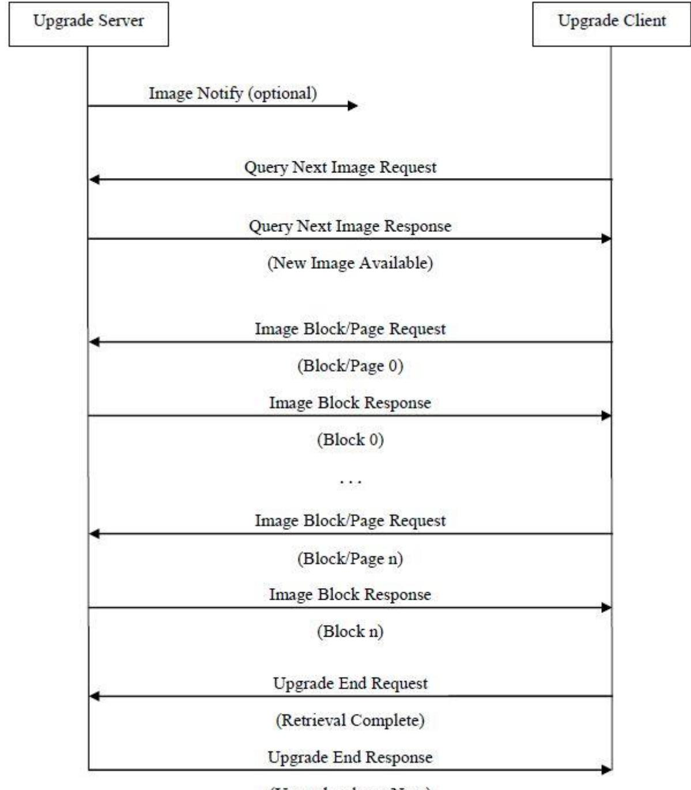
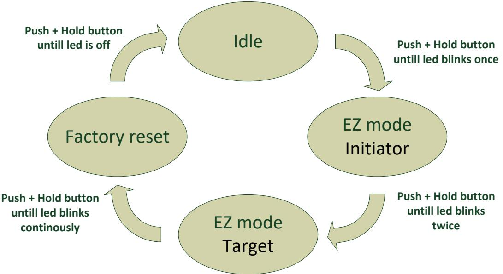

# **Humidity Sensor - HMSZB-110**

# **Technical manual**

Revised 06.05.2020

| 1   | Cautionary notes 5                                            |  |
|-----|---------------------------------------------------------------|--|
| 2   | Features  6                                                   |  |
| 2.1 | Humidity Sensor - HMSZB-110  6                                |  |
|     | Supervising indoor climate  6                                 |  |
| 2.2 | Humidity 6                                                    |  |
| 2.3 | Temperature 6                                                 |  |
| 2.4 | Key features  6                                               |  |
| 3   | Endpoints7                                                    |  |
| 3.1 | ZigBee Device Object (ZDO)7                                   |  |
| 3.2 | Temperature Sensor7                                           |  |
| 3.3 | Develco Utility7                                              |  |
| 4   | Supported Clusters 8                                          |  |
| 4.1 | Temperature Sensor Device – EP 0x26 8                         |  |
|     | 4.1.1 Basic – Cluster id 0x0000 8                          |  |
|     | 4.1.1.1 Attribute 8                                        |  |
|     | 4.1.1.2 Manufacture Specific Attribute 8                   |  |
|     | 4.1.2 Power Configuration - Cluster id 0x0001 8            |  |
|     | 4.1.2.1 Attribute 8                                        |  |
|     | 4.1.3 Identify – Cluster id 0x00039                        |  |
|     | 4.1.3.1 Attribute9                                         |  |
|     | 4.1.3.2 Commands9                                          |  |
|     | 4.1.4 Poll Control - Cluster id 0x00209                    |  |
|     | 4.1.4.1 Attribute9                                         |  |
|     | 4.1.5 Temperature Measurement – Cluster id 0x0402 10       |  |
|     | 4.1.5.1 Attribute 10                                       |  |
|     | 4.1.6 Relative Humidity Measurement – Cluster id 0x0405 11 |  |
|     | 4.1.6.1 Attribute11                                        |  |
|     | 4.1.7 OTA Upgrade - Cluster id 0x001912                    |  |
|     | 4.1.7.1 Attributes 12                                      |  |
|     |                                                               |  |

|       | 4.1.7.2 | Commands13                       |  |
|-------|---------|----------------------------------|--|
|       | 4.1.7.3 | OTA Upgrade Messages Diagram  14 |  |
|       | 4.1.8   | Time – Cluster id 0x000A 15      |  |
|       | 4.1.8.1 | Attribute 15                     |  |
| 5     |         | MMI user guide 16                |  |
| 5.1   |         | Push Button Menu 16              |  |
| 5.1.1 |         | EZ mode - Initiator 16           |  |
|       | 5.1.2   | EZ mode - Target17               |  |
|       | 5.1.3   | Factory reset17                  |  |
| 5.2   |         | Action on Power On17             |  |
| 6     |         | General network behaviour  18    |  |
| 6.1   |         | Installation  18                 |  |
| 6.2   |         | Normal – Keep alive 18           |  |
|       | 6.2.1   | Network lost 18                  |  |
| 6.3   |         | Low battery 19                   |  |
| 7     |         | Specifications 20                |  |
| 8     |         | Contact Information 21           |  |

Copyright © Develco Products A/S

All rights reserved.

Develco Products assumes no responsibility for any errors, which may appear in this manual. Furthermore, Develco Products reserves the right to alter the hardware, software, and/or specifications detailed herein at any time without notice, and Develco Products does not make any commitment to update the information contained herein.

All the trademarks listed herein are owned by their respective owners.

Develco Products A/S Olof Palmes Allé 40 http://develcoproducts.com DK-8200 Aarhus N info@develcoproducts.com

### **1 Cautionary notes**

Develco Products A/S reserves the right to make changes to any product to improve reliability without further notice. Develco Products A/S does not assume any liability arising out of the application or use of any product or circuit described herein; neither does it convey any license under patent rights or the rights of third parties.

## **2 Features**

### **2.1 Humidity Sensor - HMSZB-110**

Extreme temperatures and humidity levels can freeze pipes, cause leaks, encourage mold, and result in costintensive damage. Condensation and mold often form when certain rooms become too damp and humid. Protect your building and belongings by monitoring the temperature and humidity levels in any room and receive immediate alerts if the climate fluctuates to unsafe levels.

#### Supervising indoor climate

By supervising the indoor climate, the wireless Humidity Sensor helps maintain the ideal comfort level and protect interior, electronics, musical instruments, furniture, artwork, and any other humidity-sensitive household item.

Readings from the sensor can be sent via smart home system through SMS, e-mail, or web. The sensor operates under the ZigBee standard, ensuring compatibility with other ZigBee certified products. You can make the sensor activate an existing ventilation system to help reduce condensation levels, or you can trigger a thermostat, an aircondition, or a portable heater.

The sensor features long battery lifetime, long range, and accurate temperature and humidity reporting. The Humidity Sensor includes both adhesive tape and screws allowing you to easily mount the sensor on the wall, on the ground or near vulnerable and valuable items.

### **2.2 Humidity**

The humidity sensor measures humidity with a resolution of 1% RH (accuracy 3%, 20-80% RH). Range 0 to 100% RH. It supports standard ZigBee reporting (on change or interval).

The humidity sensor cluster in located on the temperature sensor end point.

### **2.3 Temperature**

The temperature sensor measures temperature with a resolution of 0.1°C.

It supports standard ZigBee reporting (on change or interval).

The end point is configured as the Home Automation profile "Temperature Sensor"

### **2.4 Key features**

Key features are:

- Humidity sensor
- Temperature sensor
- ZigBee Home Automation certified
- ZigBee PRO is supported
- RoHS compliant according to the EU Directive 2002/95/EC.
- Standard ZigBee Home Automation security and stack settings are used

# **3 Endpoints**

The device implements the following standard HA devices on different end points.

### **3.1 ZigBee Device Object (ZDO)**

- End point number 0x00
- Application profile Id 0x0000
- Application device Id 0x0000
- Supports all mandatory clusters

### **3.2 Temperature Sensor**

- End point number 0x26
- Application profile Id 0x0104 (Home Automation)
- Application device Id 0x0302

### **3.3 Develco Utility**

- Application profile Id 0xC0C9 (Develco Products private profile)
- Application device Id 0x0001
- Manufactor code for Develco Products is 0x1015
- Private profile for internal Develco Products use only.

#### **Reference documents:**

053474r18ZB_CSG-ZigBee-Specification.pdf 075123r03ZB_AFG-ZigBee_Cluster_Library_Specification.pdf 053520r27ZB_HA_PTG-Home-Automation-Profile.pdf 075356r15ZB_ZSE-ZSE-AMI_Profile_Specification.pdf

They can all be downloaded from : [http://www.zigbee.org](http://www.zigbee.org/)

### **4 Supported Clusters**

The ZCL "General Function Domain" clusters in this section are implemented as server clusters. Refer to ZigBee Cluster Library Specification. [http://www.zigbee.org](http://www.zigbee.org/)

### **4.1 Temperature Sensor Device – EP 0x26**

### **4.1.1 Basic – Cluster id 0x0000**

#### **4.1.1.1 Attribute**

| Id#    | Name             | Type       | Range      | Man/Opt | Relevance and ref. |
|--------|------------------|------------|------------|---------|--------------------|
| 0x000  | ZCLVersion       | Uint8      | Type range | M       |                    |
| 0      |                  |            |            |         |                    |
| 0x0004 | ManufacturerName | String     | 0-32 byte  | O       | 4.1.1.1.1          |
| 0x0005 | ModelIdentifier  | String     | 0-32 byte  | O       | 4.1.1.1.2          |
| 0x000  | DateCode         | String     | 0-32 byte  | O       |                    |
| 6      |                  |            |            |         |                    |
| 0x0007 | PowerSource      | 8 bit enum | Type range | M       |                    |

#### **4.1.1.1.1 ManufacturerName**

"Develco Products A/S"

#### **4.1.1.1.2 ModelIdentifier**

"HMSZB-110"

#### **4.1.1.2 Manufacture Specific Attribute**

| Id#    | Name             | Type        | Range | Man/Opt | Relevance and ref. |
|--------|------------------|-------------|-------|---------|--------------------|
| 0x8000 | PrimarySwVersion | OctetString |       | M       | SW version         |

ZCL header setting – Manufactor code for Develco Products is 0x1015.

### **4.1.2 Power Configuration - Cluster id 0x0001**

The power configuration cluster is described in ZigBee Cluster Library Specification

#### **4.1.2.1 Attribute**

| Id#    | Name           | Type  | Range       | Man/Opt | Relevance and ref.         |
|--------|----------------|-------|-------------|---------|----------------------------|
| 0x0020 | BatteryVoltage | Uint8 | 0x00 - 0xFF | O       | ZCL configure reporting is |
|        |                |       |             |         | supported                  |

Note: The attribute "*BatteryVoltage*" is measuring the battery voltage, in units of 100mV.

To detect low battery the system can setup a reporting interval of 12 hour. When a voltage of 2.45V the battery should be replaced with a new one.

### **4.1.3 Identify – Cluster id 0x0003**

#### **4.1.3.1 Attribute**

| Id#    | Name         | Type   | Range      | Man/Opt | Relevance and ref. |
|--------|--------------|--------|------------|---------|--------------------|
| 0x0000 | IdentifyTime | Uint16 | Type range | M       |                    |

#### **4.1.3.2 Commands**

The identify cluster has 2 commands as server.

| Id#  | Name           | Payload                          | Man/Opt | Relevance and ref. |
|------|----------------|----------------------------------|---------|--------------------|
| 0x00 | Identify       | Uint16 - Identify Time (seconds) | M       |                    |
| 0x01 | Identify Query | none                             | M       |                    |

#### The identify cluster has 1 command as client.

| Id#  | Name              |  | Payload                          |   | Relevance and ref. |
|------|-------------------|--|----------------------------------|---|--------------------|
| 0x00 | Identify Query |  | Uint16 - Identify Time (seconds) | M |                    |
|      | Response          |  |                                  |   |                    |

### **4.1.4 Poll Control - Cluster id 0x0020**

The poll control cluster is described in ZigBee Cluster Library Specification

This cluster provides a mechanism for the management of an end device's MAC Data Request rate. For the purposes of this cluster, the term "poll" always refers to the sending of a MAC Data Request from the end device to the end device's parent.

This cluster can be used for instance by a configuration device to make an end device responsive for a certain period of time so that the device can be managed by the controller.

#### **4.1.4.1 Attribute**

| Id#    | Name              | Type   | Range       | Man/Opt | Relevance and ref.      |
|--------|-------------------|--------|-------------|---------|-------------------------|
| 0x0000 | Check-inInterval  | Uint32 | 0x00 - 0xFF | M       | Default value is 1 hour |
| 0x0001 | LongPoll Interval | Uint32 |             | M       | Disabled                |

Develco Products A/S Olof Palmes Allé 40 http://develcoproducts.com DK-8200 Aarhus N info@develcoproducts.com

| 0x0002 | ShortPollIntervall | Uint16 | M | Default value is 3 seconds |
|--------|--------------------|--------|---|----------------------------|
| 0x0003 | FastPollTimeout    | Uint16 | M | Default value is 5 minutes |

Start up, auto scan for client poll control cluster on the coordinator. If it is support on the coordinator an auto bind is created and the humidity sensor will send a check-in command in the interval specified in attribute "CheckinInterval. The coordinator has to reply with a check-in response. The sensor supports the following commands send from the client (Typically the coordinator).

- 0x00 Check-in Response,
- 0x01 Fast Poll Stop,
- 0x02 Set Long Poll Interval,
- 0x03 Set Short Poll Interval,

If it doesn't find a poll client it will search again periodically.

### **4.1.5 Temperature Measurement – Cluster id 0x0402**

The temperature measurement cluster is described in ZigBee Cluster Library Specification section 4.4

#### **4.1.5.1 Attribute**

| Id#    | Name             | Type   | Range          | Man/Opt | Relevance and ref. |
|--------|------------------|--------|----------------|---------|--------------------|
| 0x0000 | MeasuredValue    | Sint16 | MinValue to | M       |                    |
|        |                  |        | MaxValue       |         |                    |
| 0x0001 | MinMeasuredValue | Sint16 | 0              | M       |                    |
| 0x0002 | MaxMeasuredValue | Sint16 | 5000           | M       |                    |

#### **4.1.5.1.1 MeasuredValue**

Default reporting is set to Min reporting interval: 60 sec Max reporting interval: 600 sec Reportable Change: 0.1 °C

If the temperature value is stable it will be send every 10 minutes. If the temperature changes more than 0.1 °C it will be reported but not faster than every 1 minute since last reporting value.

Note: Min reporting interval 0 sec is invalid when reportable change is configured.

#### **4.1.5.1.2 MinMeasuredValue**

The temperature sensor is NOT supporting temperature measurements below 0 degrees Celsius

#### **4.1.5.1.3 MaxMeasuredValue**

The temperature sensor is NOT supporting temperature measurements above 50 degrees Celsius

#### **4.1.6 Relative Humidity Measurement – Cluster id 0x0405**

The relative humidity measurement cluster is described in ZigBee Cluster Library Specification section 4.7

#### **4.1.6.1 Attribute**

| Id#    | Name             | Type   | Range          | Man/Opt | Relevance and ref. |
|--------|------------------|--------|----------------|---------|--------------------|
| 0x0000 | MeasuredValue    | Uint16 | MinValue to | M       |                    |
|        |                  |        | MaxValue       |         |                    |
| 0x0001 | MinMeasuredValue | Uint16 | 0% RH          | M       |                    |
| 0x0002 | MaxMeasuredValue | Uint16 | 100% RH        | M       |                    |
| 0x0003 | Tolerance        | Uint16 | 0 – 20% RH     |         | 3.5 % RH           |

#### **4.1.6.1.1 MeasuredValue**

Default reporting is set to Min reporting interval: 60 sec Max reporting interval: 600 sec Reportable Change: 3.0% RH

If the humidity value is stable it will be send every 10 minutes. If the humidity changes more than 3% RH it will be reported but not faster than every 1 minute since last reporting value.

Note: Min reporting interval 0 sec is invalid when reportable change is configured.

#### **4.1.6.1.2 Tolerance**

The humidity sensor has a tolerance of 3.5 % RH

### **4.1.7 OTA Upgrade - Cluster id 0x0019**

The cluster provides a ZigBee standard way to upgrade devices in the network via OTA messages. The devices support the client side of the cluster.

When the devices has joined a network it will automatically auto scan for a OTA upgrade server in the network. If it finds a server an auto bind is created and ones every 24 hour it will automatically send its "current file version" to the OTA upgrade server. It is the server that initiate the firmware upgrade process.

### **4.1.7.1 Attributes**

| Id#    | Name                         | Type            | Range           | Man/Opt | Relevance and ref. |
|--------|------------------------------|-----------------|-----------------|---------|--------------------|
| 0x0000 | UpgradeServerID              | IEEE Address | -               | M       |                    |
| 0x0001 | FileOffset                   | Uint32          | Type range      | O       |                    |
| 0x0002 | CurrentFileVersion           | Uint32          | Type range      | O       |                    |
| 0x0003 | CurrentZigBeeStackVersion    | Uint16          | Type range      | O       |                    |
| 0x0004 | DownloadedFileVersion        | Uint32          | Type range      | O       |                    |
| 0x0005 | DownloadedZigBeeStackVersion | Uint16          | Type range      | M       |                    |
| 0x0006 | ImageUpgradeStatus           | 8 bit enum   | 0x00 to 0xFF | O       |                    |
| 0x0007 | Manufacturer ID              | Uint16          | Type range      | O       |                    |
| 0x0008 | Image Type ID                | Uint16          | Type range      | O       |                    |
| 0x0009 | MinimumBlockRequestDelay     | Uint16          | Type range      | O       |                    |

Above attribute description is to be found in section 6.7 "OTA Cluster Attributes" in ZigBee document – "zigbeeota-upgrade-cluster-specification" provided by the ZigBee alliance.

#### **4.1.7.2 Commands**

| Id#  | Name                     | Man/Opt | Relevance and ref.                     |
|------|--------------------------|---------|----------------------------------------|
| 0x01 | Query Next Image request | M       | 6.10.1 OTA Cluster Command Identifiers |
| 0x03 | Image Block Request      | M       | 6.10.1 OTA Cluster Command Identifiers |
| 0x06 | Upgrade End Request      | M       | 6.10.1 OTA Cluster Command Identifiers |

#### **4.1.7.3 OTA Upgrade Messages Diagram**

### **4.1.8 Time – Cluster id 0x000A**

The Time cluster is a general cluster for time it is based on a UTC time in seconds since 0 hrs 0 mins 0 sec on 1st January 2000. Refer to [Z2] for ZigBee specification of the time cluster.

The device will use this clusters as a client – provided that a suitable Time Server is available on the coordinator in the network.

#### **4.1.8.1 Attribute**

| Id#    | Name       | Type         | Range      | Man/Opt | Relevance and ref.           |
|--------|------------|--------------|------------|---------|------------------------------|
| 0x0000 | Time       | UTCTime      | Type range | M       | The module will periodically |
|        |            | (Uint32)     |            |         | update its clock by          |
|        |            |              |            |         | synchronizing through this   |
|        |            |              |            |         | cluster                      |
| 0x0001 | TimeStatus | 8 bit bitmap | 00000xxx   | M       |                              |

# **5 MMI user guide**

### **5.1 Push Button Menu**

Pushing the button on a device provides the user with several possibilities.

Pushing the button for longer (push, hold for a few seconds, and release) allows the user to set the device into a desired mode. A mode change happens at 5 second interval. Below, these modes are illustrated in a state chart.

When cycling through the menu modes, the state is indicated by a number of 100ms blinks on the LED. The device is supporting the ZigBee standardized EZ- mode Commissioning.

### **5.1.1 EZ mode - Initiator**

If the devices is not on the network EZ-Mode Network Steering is invoked when the user enter this menu. The led blinks once every 1 sec until the devices has joined the network. If the device was already on the network it will broadcast the PermitJoin messages. It is the trust center policy that decides if the device is allowed to join the network.

When the device has joined the network EZ-Mode Finding and Binding is invoked and the device start to blink every 3 sec until a cluster match is found. When a match is found or the cluster examine is finished the blinking stops and the device sends a messages to the target device to stop the identify time.

The following clusters are support in EZ-mode finding and binding:

- Humidity cluster
- Temperature cluster
- Power configuration cluster

The EZ-mode time is hard coded to 3 minutes. This is the Minimum and recommended PermitJoin time broadcast for EZ-Mode Network Steering and minimum IdentifyTime set for EZ-Mode Finding and Binding. If the user enters the menu again another 3 minutes is started.

### **5.1.2 EZ mode - Target**

If the devices is not on the network EZ-Mode Network Steering is invoked when the user enter this menu. The led blinks twice every 1 sec until the devices has joined the network. If the device was already on the network it will broadcast the PermitJoin messages. It is the trust center policy that decides if the device is allowed to join the network.

When the device has joined the network identify mode is invoke and the device start to blink twice every 3 sec until identify mode is stopped or after the EZ-mode time has expired. If the user enters the menu again another 3 minutes is started.

### **5.1.3 Factory reset**

To allow a device to join a network, one either has to power up a device that has not previously joined a network or push the button until the Reset To Factory default mode is indicated – and subsequently release the button. This will cause the device to reset to its factory default state and scan for a suitable coordinator.

From SW version 3.4.2 the devices will send a network leave indication, if possible, before it starts factory resetting the devices.

### **5.2 Action on Power On**

As a general rule, all end devices and routers that have not previously joined a network (or have been reset to factory default) will start up and search for a network with join permit open. In this mode, the LED will flash once every second.

Once the device has joined the network, is will start scanning for an OTA server, Time server, Poll control client and an IAS Zone client.

If a device has joined a network and is powered down, it will attempt to rejoin this network upon power up. For the first 30 seconds hereafter, the device will be available for communication. This time can be expanded using the poll control cluster functionality.

# **6 General network behaviour**

### **6.1 Installation**

When the device is virgin and powered for the first time it will start looking for a ZigBee PAN Coordinator or router to join. The device will scan each ZigBee channel starting from 11 to 24. The LED will flash once every second until it joins a device.

| #Scan mode - 1                       | #Sleep mode                    | #Scan mode - 2                  | #Sleep mode                    | #Scan mode - 2                  |
|--------------------------------------|--------------------------------|---------------------------------|--------------------------------|---------------------------------|
| Scan all 16 ZigBee                   | MCU is in sleep                | Scan all 16 ZigBee              | MCU is in sleep                | Scan all 16 ZigBee              |
| channels until join network or 15 | mode (Radio off) 15 minutes | ch x 1 or until join network | mode (Radio off) 15 minutes | ch x 1 or until join network |
| minutes                              |                                | ~ 30 seconds                    |                                | ~ 30 seconds                    |

The device will start up using scan mode 1. To increase battery lifetime when the device is joining a network for the first time a scan mode 2 will be used after scan mode 1 has expired. Scan mode 1 it will only be executed one time when the device is powered. If the user invokes EZ-mode it will start scanning the next 3 minutes

In section 5 "MMI" it is explained how to put the device into a join or leave network mode.

Network settings are stored in NV-memory are after a power cycle the device re-join the same network.

If the device has to join a new PAN coordinator the MMI menu supports a **"Reset To Factory Fresh Settings"** mode. This will erase all current network information.

### **6.2 Normal – Keep alive**

The device is sending a "keep alive" message to the PAN coordinator every 15 minute to verify that the device is still connected to the network.

### **6.2.1 Network lost**

If no "keep alive" responses are received 5 times in a row (Worst case 1h15m), the devices will start scanning as specified in the table below.

When the device is in scan mode the LED will flash once every second until it re-joins the network.

According to the ZigBee specification TX is NOT allowed to be enabled all the time and a TX silent period has to be defined.

| #Scan mode - 1    | #Sleep mode      | #Scan mode - 2    | #Sleep mode      | #Scan mode - 2    |
|-------------------|------------------|-------------------|------------------|-------------------|
| Scan current ch 3 | MCU is in sleep  | Scan current ch 3 | MCU is in sleep  | Scan current ch 3 |
| times             | mode (Radio off) | times             | mode (Radio off) | times             |
| Scan remaining 15 | 15 minutes       | Scan remaining 15 | 15 minutes       | Scan remaining 15 |
| ch 1 time         |                  | ch 1 time         |                  | ch 1 time         |
| Scan all 16 ch 3  |                  |                   |                  |                   |
| times             |                  |                   |                  |                   |
|                   |                  |                   |                  |                   |

### **6.3 Low battery**

The current battery voltage can be read from the power configuration cluster described in section 4.3.1. The attribute "*BatteryVoltage"* is measuring the battery voltage, in units of 100mV.

To detect low battery the system can monitor the "*BatteryVoltage*" by setting up a reporting interval of every 12 hour. When a voltage of 2.45V is measured the battery should be replaced.

Low batt LED indication – RED LED will blink twice every 60 second

# **7 Specifications**

| General            |                                                        |
|--------------------|--------------------------------------------------------|
| Dimensions (Ø x H) | Ø 70 x 70 x 21 mm                                      |
| Colour             | White                                                  |
| Power supply       | Battery: 2 x AA exchangeable                           |
|                    | Battery life: up to 5 years, reporting every 5 minutes |
|                    |                                                        |
| Radio              | Sensitivity: -92 dBm                                   |
|                    | Output power: +3 dBm                                   |
|                    |                                                        |
| Environment        | IP class: IP20                                         |
|                    | Operation temperature 0 to +50°C                       |
|                    | Relative humidity 10-95% non-condensing                |
|                    |                                                        |
| Function           |                                                        |
| Humidity sensor    | Range: 0 to 100% RH                                    |
|                    | Resolution: 1% RH (accuracy TYP ± 3,5% rH, 20-80% rH)  |
|                    | Reporting: configurable                                |
|                    |                                                        |
| Temperature sensor | Range: 0 to +50°C                                      |
|                    | Resolution: 0.1°C (Accuracy TYP ±0.5°C and Max ±2°C)   |
|                    | Sample time: config.: 2s – 65,000s                     |
|                    | Reporting: configurable                                |
|                    |                                                        |
| Communication      |                                                        |
| Wireless protocol  | ZigBee Home Automation 1.2 certified                   |
|                    | ZigBee end-device                                      |
|                    |                                                        |
| Certifications     |                                                        |
|                    | Conforming to CE, RED and RoHS and directives          |

## **8 Contact Information**

| Technical support: | Please contact Develco Products for support. |
|--------------------|----------------------------------------------|
|                    | products@develcoproducts.com                 |

**Sales:** Please contact Develco Products for information on prices, availability, and lead time.

[info@develcoproducts.com](mailto:info@develcoproducts.com)

Develco Products A/S Olof Palmes Allé 40 http://develcoproducts.com DK-8200 Aarhus N info@develcoproducts.com