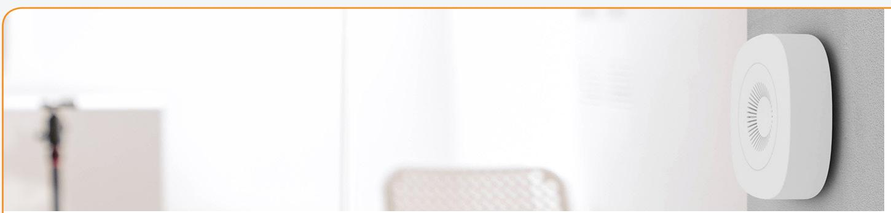
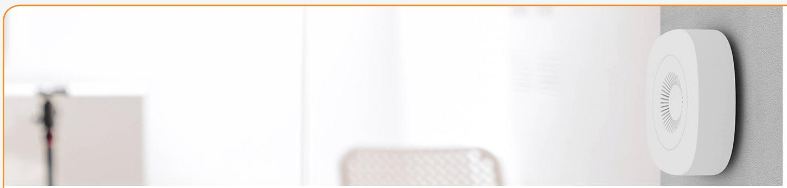

## **Humidity Sensor Supervising indoor climate**

Extreme temperatures and humidity levels can freeze pipes, cause leaks, encourage mold, and result in cost-intensive damage. Condensation and mold often form when rooms become too damp and humid. The Humidity Sensor protects buildings and belongings by monitoring temperature and humidity levels. Additionally, it will alert the user in case indoor humidity fluctuates to undesirable levels.

By supervising the indoor climate, the wireless Humidity Sensor helps maintain the ideal comfort level and protects interior, electronics, musical instruments, furniture, artwork, and any other humidity-sensitive items. The sensor is thus an essential part of any insurtech solution as it helps to prevent humidity damage to houses and valuable household items and lower insurance payouts.

People with illnesses that are affected by humidity can use humidity sensors as part of a home care solution to monitor the humidity levels in the air and know when to open a window.

Key features are:

- Humidity measurement
- Temperature sensor

### **Long-lasting Zigbee sensor**

Readings from the sensor are sent wirelessly through a gateway to a phone or tablet. The sensor operates under the Zigbee standard, ensuring compatibility with Zigbee certified products. In order to reduce condensation levels, the Humidity Sensor can be set to activate, for instance, a ventilation system, thermostat, air-condition, or portable heater.

- **• Easy installation**
- **• Secure communication**
- **• 5 years+ battery life**

The sensor features a long battery life and accurate long-range temperature and humidity reporting. The Humidity Sensor includes both adhesive tape and screws, allowing the sensor to be easily mounted on the wall or on the ground, or near vulnerable and valuable items.

#### www.develcoproducts.com

# **Humidity Sensor - Technical specifications**

**Model number: HMSZB-110**

### **General**

| Dimensions (W x H) | 70 x 70 x 21 mm / 2.76 x 2.76 x 0.83 inches               |
|--------------------|-----------------------------------------------------------|
| Weight             | 27.2 g / 0.96 oz (with packaging: 114.9 g / 4.05 oz)      |
| Colour             | White                                                     |
| Power supply       | Battery: 2 x AA, exchangeable                             |
|                    | Battery life: 5 years, reporting every 5 minutes          |
|                    | Battery level and low battery warning can be reported     |
| Radio              | Sensitivity: -92 dBm                                      |
|                    | Output power: +3 dBm                                      |
| Environment        | IP class: IP20                                            |
|                    | Operation temperature 0 to +50°C / 32-122°F               |
|                    | Relative humidity 5% - 85%, non condensing                |
| Functions          |                                                           |
| Temperature sensor | Range: 0 to +50°C / 32-122°F                              |
|                    | Resolution: 0.1°C / 0.18°F (accuracy Typ ±0.5°C / 1°F and |
|                    | Max ±2°C / 4°F)                                           |
|                    | Sample time: config.: 2 s -65,000 s                       |
| Humidity sensor    | Reporting: configurable                                   |
|                    | Range: 0 to 100% rH                                       |
|                    | Resolution: 1% rH (accuracy ± 3,5% rH, 20 - +80% rH)      |
| Communication      |                                                           |
| Wireless protocol  | Zigbee Home Automation                                    |
|                    | Zigbee end-device                                         |
| Certifications     | Conforming to CE, FCC, IC, ISED, RED and RoHS directives  |
|                    | Zigbee Home Automation 1.2 certified                      |

Version 2.10