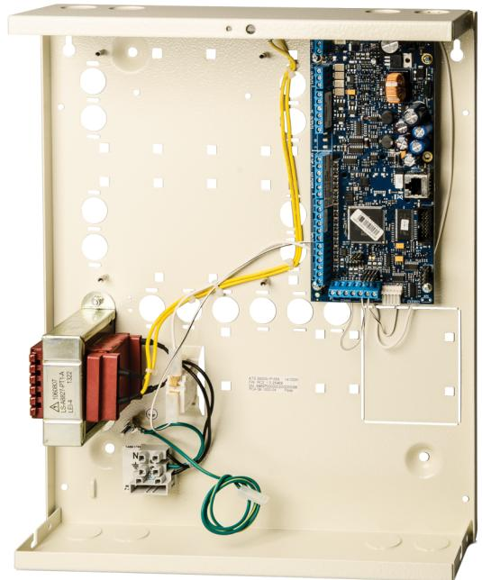

# ATS3500A-IP-MM-MK

**Advisor Advanced 8-128 sektioner, inbyggd IP, Medium Metallkapsling + ATS1136 manöverpanel med inbyggd Mifare kortläsare**

#### **Inbrottslarm**

Advisor Advanced är ett fullvärdigt säkerhetssystem som kombinerar inbrottslarm och passersystem tillsammans med toppmoderna anslutningsmöjligheter som gör det möjligt att använda en mängd fjärranslutningsalternativ.

Produktfamiljen har tre varianter som beroende på modell supporterar 32 till 512 sektioner som kan programmeras i 4 till 64 områden. Sektionerna kan tillhöra ett specifikt område eller ingå i ett flertal områden beroende på anläggningens utformning.

Advisor Advanced är byggd enligt Europanormen EN50131 och är i Sverige klassad enligt SBSC i larmklass 2 & 3 beroende på modell. Advisor Advanced centralerna är en del i ATS8600 för att erhålla ett fullt integrerat system (inbrottslarm, passer, brandlarm och videoövervakning).

## **Kommunikation**

Advisor Advanced erbjuder en flexibel kommunikation till larmcentral och slutanvändare, med eller utan inbyggd IP eller analog telefon. ATSX500A-IP har en inbyggd 10/100mb IP-port som supporterar larmrapportering till larmcentraler med OH-NETREC-mottagaren samt fjärranslutning till PC-programmen ATS85x0.

## **Mobilapp**

Med Advisor Advanced mobilapp, tillgänglig för Android och iOS, kan du övervaka din anläggning, se historik, tillkoppla och frånkoppla oberoende var du befinner dig. Med hjälp av UltraSync molntjänst är uppkopplingen väldigt enkel.

#### **Integrerat passersystem**

Alla centralapparater i Advisor Advanced kan ge användare möjlighet att passera genom dörrar och tillkoppla/frånkoppla områden beroende på behörighet. Centralapparaterna kan även utökas med dörrcentralerna ATS125x samt CDC4 för ett fullvärdigt passersystem med upp till 48 dörrar beroende på modell.

# **UltraSync molntjänst**

Från FW MR4.0 kan alla x500A centralapparater anslutas till molntjänsten UltraSync. Slutkunder kan använda UltraSync för en enkel anslutning till mobilapp. Även PC-programmen ATS85x0 ansluts enkelt via UltraSync. Ingen hänsyn till brandväggar, IP-adresser och routerinställningar krävs.

# **Details**

- Systemet och molntjänst UltraSync är certifierat i högsta cybersäkerhetsklass NFa2P 3 shields
- 8 sektioner och 5 utgångar på moderkortet
- Max 128 sektioner: trådbundna, trådlösa eller kombinerat
- Integrerat passersystem möjligt
- 8 larmområden
- Upp till 2000 användare, 65000 med passersystem
- SBSC Larmklass 3, EN Grade 3 / Miljöklass 2
- USB för dataanslutning
- Flerspråkig: Varje användare kan ha sitt egna språk
- Integration med passerundercentralerna ATS125x och CDC4
- Manöverpanel ATS1136 ingår
- Integrerad 10/100Mb nätverksanslutning
- IP-larmöverföring till OH-NETREC-mottagare eller GPRS

# ATS3500A-IP-MM-MK

**Advisor Advanced 8-128 sektioner, inbyggd IP, Medium Metallkapsling + ATS1136 manöverpanel med inbyggd Mifare kortläsare**

# **Technical specifications**

| System                                |                                         |
|---------------------------------------|-----------------------------------------|
| Product type                          | Integrated Access Control               |
| Panel type                            | Hybrid                                  |
| No. of keypads / readers 16           |                                         |
| Data Gathering Panels (DGP)        | 15                                      |
| No. of alarm groups                   | 64                                      |
| Specified cable                       | WCAT52                                  |
|                                       | WCAT54                                  |
|                                       | or equivalent                           |
| Ingångar                              |                                         |
| Max no. of inputs                     | 128                                     |
| Inputs plug-in expansion 8            |                                         |
| Utgångar                              |                                         |
| No. of outputs                        | 128                                     |
| No. of onboard outputs                | 5                                       |
| Område                                |                                         |
| No. of areas                          | 8                                       |
| Användare/kort                        |                                         |
| Max. no. of users                     | more than 1000                          |
| Users with name                       | 2000                                    |
| Max. no. of cards                     | 2000                                    |
| Max. no. of PIN codes                 | 2000                                    |
| Dörrkontroll                          |                                         |
| Standard doors on control panel    | 8                                       |
| Door groups                           | 128                                     |
| Intelligent doors on 4-door DGPs   | 48                                      |
| Kommunikation                         |                                         |
| Onboard transmission type          | IP                                      |
| Transmission extension GSM/GPRS, PSTN |                                         |
| Databus type                          | RS485                                   |
| Händelselogg                          |                                         |
| Alarm event log                       | 1000                                    |
| Access event log                      | 10000                                   |
| Spänning                              |                                         |
| Power supply type                     | 230 VAC                                 |
| Power supply value                    | 230 VAC +10%, -15%, 50 Hz               |
| Mainboard current consumption      | 150 mA                                  |
| Max system current                    | 1950 mA at 13.8 V                       |
| Max aux power current                 | 1350 mA (depends on backup power needs) |
| Auto-reset fuses                      | 5                                       |
| Glass break fuses                     | 1 (mains power)                         |
|                                       |                                         |

**Mått** Physical dimensions 315 x 388 x 85 mm Housing Medium Metal **Miljö** Operating temperature -10 to +55°C Relative humidity 95% noncondensing Environmental Class Class II, indoor IP rating 30 **Standarder & föreskrifter** EN50131 Grade Grade 3

Compliancy CE

| arrier |
|--------|
|        |

As a company of innovation, UTC Fire & Security reserves the right to change product specifications without notice. For the latest product specifications, visit UTC Fire & Security online or contact your sales representative.

[Powered by TCPDF (www.tcpdf.org)](http://www.tcpdf.org)