# Multi-channel aspirating smoke detector

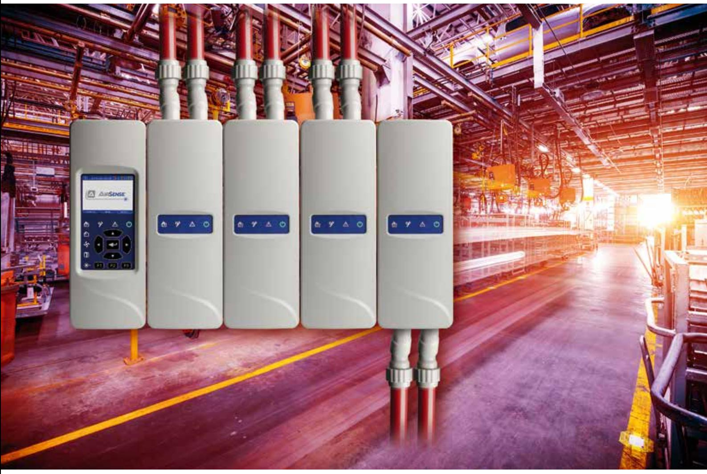

### What, how, where, when, why...

**Transit facilities pose unique challenges.** Thousands of people pass through them every hour. Trains and buses belch smoke, create fumes, and stir up dust. Vandals prowl, looking for mischief. It's a nightmare for point detection. But not so for ModuLaser.

### What it is...

ModuLaser is a scalable aspirating smoke detection solution providing flexibility in design and installation. Compartmentalised detection and display units result in a unique modular design that provides detection of multiple zones while overcoming many of the issues that can exist with nonmodular systems.

A ModuLaser system consists of two basic module types:

**Display module –** provides control and monitoring of detector modules

**Detector module –** draws air from the risk area and samples it for smoke particulate

Up to eight detector modules can be controlled and monitored via one display module with each detector module capable of serving up to 250m of combined sampling pipe.

Display and detector module combinations are known as a cluster with devices in the cluster communicating via RS485. This unique modular design allows for clusters to be non-distributed or distributed giving significant design advantages such as maximising pipework coverage and reduced transport times.

ModuLaser is not just about efficient and flexible system design it also excels with simple user controls, detailed display information, connectivity and easy maintenance. From the designer through to the end user ModuLaser provides benefits for everyone.

ModuLaser embraces exciting new design aspects integrated with proven features and technologies, such as ClassiFire and waste gate technology.

Whether it's providing early warning detection within a clean room environment or providing a problem solving solution for harsh or unusual applications, ModuLaser excels to provide a robust and reliable aspirating smoke detection solution.

#### **Non-distributed cluster Distributed cluster**

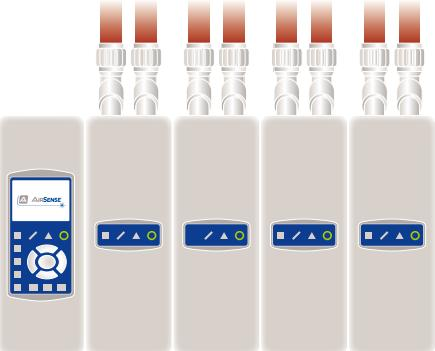

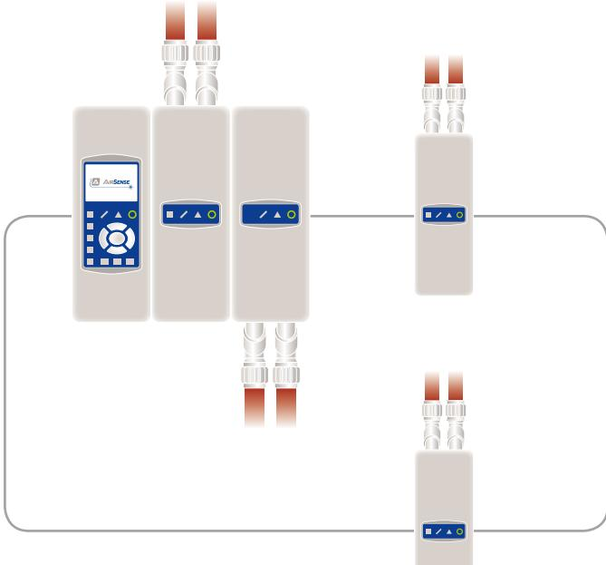

#### **• Modular design**

Separate centrally-controllable detector modules allow efficient piping and discrete zones with no overlap.

Design can be tailored to provide the required number of detection zones to suit the application, with the ability for future expansion.

#### **• Simplified installation**

Innovative docking station design allows detectors to be easily connected together as a group. Sensitive electronics are easily removed to ensure they will not be damaged during first fix installation. Aspirating pipework and cable entries can easily be made into either the top or the bottom of the unit.

#### **• Wizards**

Wizards provide step by step guidance for installation and maintenance, during installation and maintenance, ensuring all key parameters are adjusted during installation and monitored during routine service.

#### **• Easy pipe connection**

The quick fit pipe adaptor system locks down securely, yet leaves plenty of room for easy pipe connection and removal.

#### **• Zoned aspirating smoke detection**

Individual detector modules provide detection for individual areas or zones, specific zone alarm information can be transmitted to the main fire alarm panel via a common APIC address card in the display module or through dedicated alarm relays within each detector module.

#### **• Easy to use interface**

The color display with the support of the navigation and functional buttons provides an attractive, clear and efficient user interface. Detailed status and diagnostic information is displayed in text and graphic formats.

#### **• Multi-lingual support**

The ModuLaser TFT display supports many different languages, the required language can easily be selected through the configuration menus. LED indications are identified by easily recognisable icons on the membrane.

**Concealed detection – hidden in plain sight.** Architectural considerations frequently call for walls and ceilings unblemished by point detectors and wiring conduits. In other instances, the risk of tampering can be greatly reduced by reducing the visibility of smoke detection equipment within the protected space.

### Where to use it...

Aspirating smoke detection is a method of smoke detection, whereby a sample of air is drawn from the protected area via a sampling pipework, and analysed at the aspirating detector (ModuLaser) for the presence of smoke particles. If smoke particles are present in the sample, then based on the aspirating detector's configuration one or multiple alarms will be raised.

Historically aspirating smoke detection was used for very early warning of a potential fire, within very well controlled environments. ClassiFire® makes it possible for Aspirating Smoke Detection to be utilised in a much wider range of applications.

Unlike traditional point detection, air sampling points do not require electrical devices, power, wiring, or junction boxes. In fact, servicing and testing need only be carried out at the display and detector modules, and at the sampling point furthest from the detector module.

In addition, ModuLaser modules can be installed so they remain within reach, regardless of how inaccessible the sampling points are. This permits maintenance to be carried out and electrical connections to be made in a convenient location away from the protected space.

ModuLaser is an excellent choice where spot detection and beam detection are problematic. However it is not limited to these applications only, and supports a much wider range:

- Where very early warning detection is required
- Where high air flow is present
- Where the environment is hostile (very cold, very hot, humid or dusty, strong RF fields)
- Where detection is to be concealed for aesthetic or security purposes
- Where there are areas subject to smoke stratification
- Where access for maintenance is impractical or unsafe
- Where mission critical detection is required for suppression release

#### **Typical applications**

- Aircraft hangars Airport terminals Anti-smoking enforcement Atria Cable tunnels Ceiling voids, raised floors Cleanrooms Coal conveyers Computer cabinets Computer rooms Corrections facilities Data processing centers Engine rooms Escalators Flour mills Food preparation areas Freezer warehouses Heritage buildings High-end residential Hospitals Hotel lobbies Metro tunnels Museums Paper mills Record storage facilities Recycling centers Textile areas Tobacco plants Warehouses Distribution centers
Semiconductor fabrication Telecommunications facilities

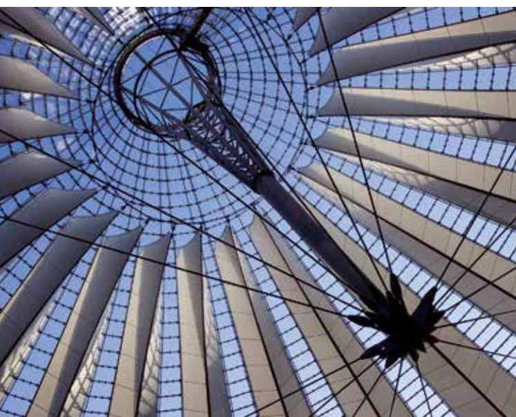

**Things are looking up.** In locations with high ceilings, accessibility plagues maintenance and service efforts, while stratification poses a serious risk to life safety. ModuLaser overcomes these difficulties because devices are installed at ground level, while sampling ports remain high above in optimum sensing locations.

## Why it just adds up...

#### **More efficient, less costly...**

With the unique modular design of the ModuLaser, you buy exactly what you need for a particular installation. Traditional multi-channel aspirating smoke detectors offer a fixed amount of zones or channels, which in many installations result in a detector with more zones than is required by the installation. This in turn may result in a higher cost price. With the ModuLaser this is no longer the case as the detection modules are sold separately, and up to eight detection modules can be controlled and monitored by one display module. On top of this there is no need for the detection modules to have similar sampling pipe layouts. Individual modules provide significant advantages over non-modular systems:

- **–** No need for balanced pipework across zones
- **–** Unaffected by zones of differing pressures or airflow
- **–** Each zone configured completely independently for sensitivity, alarm thresholds etc.
- **–** No delay in the detection of smoke from scanning between zones.
- **–** No cross contamination of smoke between zones.

**Freezer burn.** Cold storage facilities produce environments that would damage the circuitry and clog the smoke chambers of spot detectors. ModuLaser overcomes this problem because the sampling points are not susceptible to cold and humidity, and the detector can be located outside the freezer area where conditions could harm its electronic components.

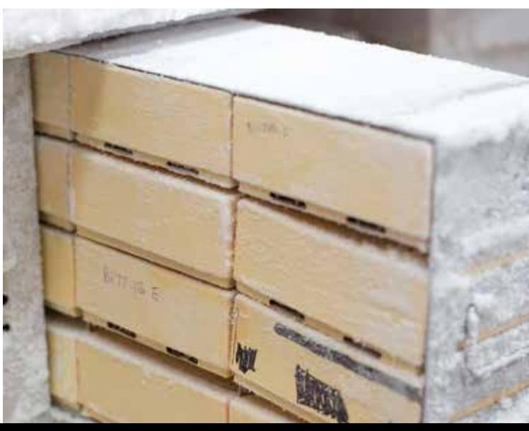

### When it is important...

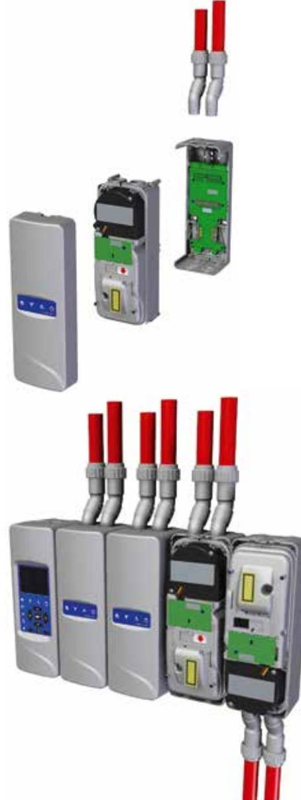

### **Ready when you are**

ModuLaser's innovative back plane docking stations fit securely together with a simple clip mechanism that can be repositioned time and time again, depending on the installer's needs. Docking stations accept all field wiring, so sensitive components can be kept out of harm's way during first fix installation. Once the docking stations are attached to each other, the clips act as cable guides for simple and uncluttered interconnection. Wiring can enter the docking station from the top, from the bottom, and from the back. The docking stations can be fixed to the wall by screws, or simply clip onto a DIN-rail by way of the integrated mounting clips.

Detectors simply screw into place and are quickly secured and oriented to accept pipe from either the top or the bottom.

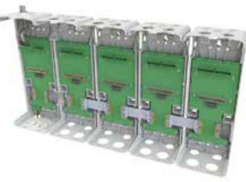

#### **Install it your way**

Thanks to its sophisticated two-way mounting design, ModuLaser provides a clean, efficient, and uncluttered installation. Detector modules slide into their docking stations for top or bottom pipe entry. No jumpers or settings to change – simply slide the detector module into the docking station, orient as desired and snap on the front cover.

The device automatically adjusts its display to match the detector orientation. Configuration of the completed installation can be done via the dedicated display module or via a PC connection. For added security, four different access levels are supported.

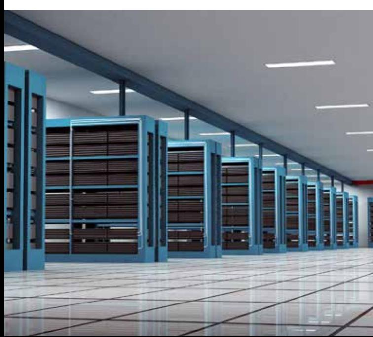

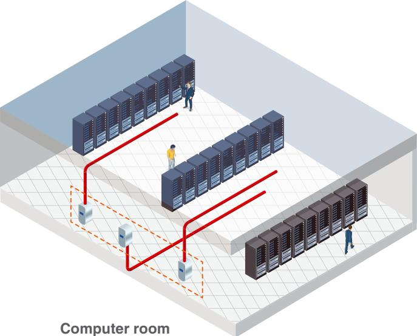

**A VIP pass to any location.** Equipment rooms housing high voltage machinery or sensitive computer equipment are generally secure areas with restricted access making servicing of smoke detection difficult. ModuLaser detector modules can be located outside of the risk area to overcome accessibility problems.

### **Make the right connections**

ModuLaser communicates as readily as it installs. Standard USB A and B onboard connectors can be used for configuration, troubleshooting, and maintenance. In addition, the ModuLaser supports a range of APIC interfaces for compatibility with thirdparty addressable detection loops – a particularly valuable feature for building retrofits and system expansions.

Each docking station backplane provides two fully programmable monitored inputs and three fully programmable volt free outputs for integrating ASD with other systems. Inputs and outputs on any unit in a cluster can be activated by its own module or other modules within the cluster creating many different cause and effect combinations.

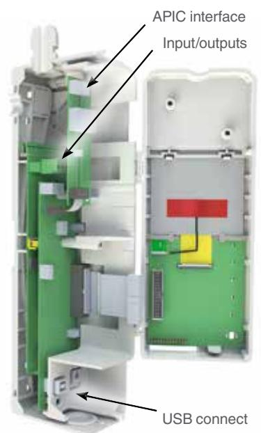

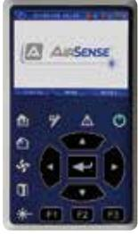

#### **Add some colour to your life**

Bright easy-to-see colour TFT screen combined with universal navigation and control buttons take the guesswork out of programming and diagnostics. The high resolution display adds the dimension of colour to data retrieval and navigation. Its clean, easy-to-follow interface colour-codes critical information for added clarity, while navigation keys and context-dependent buttons provide positive tactile feedback with each interaction. The screen also offers the ability to view data in a graphical format.

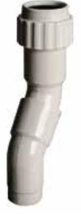

#### **Easy pipe connection**

The patented quick fit pipe adaptor is designed to easily facilitate the connection and removal of pipework from the detector module.

Designed to seal around the pipework by means of a threaded collar, the adaptor can easily accommodate 3/4" or 25mm pipework.

The adaptor is flexible in its two part construction allowing the installer the ability to twist the connector to compensate for any minor pipework misalignment.

### **System overview**

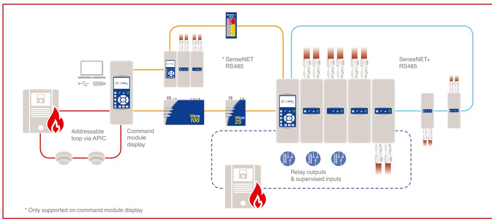

# Why it is the right choice...

ModuLaser incorporates technology that extends its range of applications far beyond those normally associated with air sampling detection. Thanks to advanced sensing technology, it avoids the problems of oversensitivity normally associated with aspirated smoke detection, and provides a reliable general purpose smoke detection solution highly resistant to nuisance alarms.

- Environmental compensation opens the door to projects that prove impractical for other detectors. ModuLaser self-calibration and sliding alarm thresholds overcome difficulties posed by applications where air handling is strictly controlled.
This makes it ideal for public commercial areas – as well as dust and contaminant-laden industrial settings. In fact, ModuLaser technology remains highly sensitive to incipient indicators of fire, yet reliable enough to all but eliminate nuisance alarms.

- Waste gate technology is a powerful ModuLaser advantage that dramatically extends the life of detector
particulate filters. This exclusive aspiration technique diverts most of the particulate matter that would normally load the detector filters, giving ModuLaser longer life and more capacity per maintenance cycle than any such detector on the market today.

- Laser dust discrimination is a sophisticated algorithm that identifies and eliminates spikes in the obscuration reading caused by particulate matter in the airstream. This makes it possible for ModuLaser detectors to reach higher levels of sensitivity without sacrificing reliability – a perennial trade-off among other air sampling products.
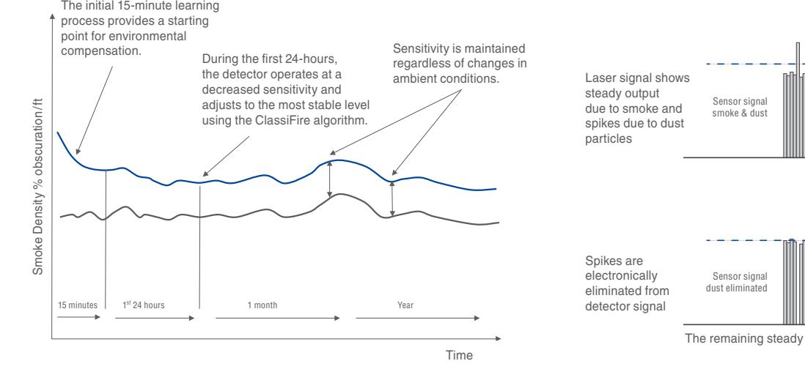

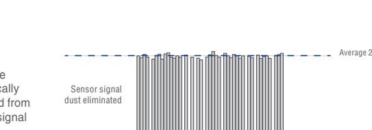

The remaining steady output represents underlying smoke density

Average 1

### firesecurityproducts.com

© 2019 United Technologies Corporation. All rights reserved. Ref. 1138 EN AirSense – WHQ approved– 0206