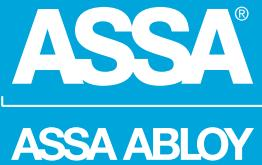
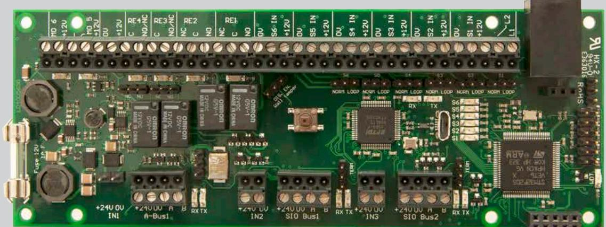
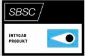
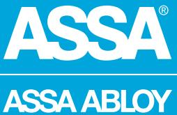

## 9016III MIO6-6

ASSA ABLOY, the global leader in door opening solutions

9016III MIO6-6 är ett tilläggskort till undercentral LCU9016III, till vilket man kan koppla in slavcentraler, manöverpanel eller larmenheter vid användning av larm i ASSA ARX. 9016III MIO6-6 har sex ingångar, fyra reläutgångar samt två övervaktade transistorutgångar.

Samtliga ingångar är programmerbara och kan arbeta normalt öppen eller normalt sluten, dubbelbalanserat med valfria motståndsvärden (standard 2K2 ohm). Även trippelbalansering är möjlig när övertäckningslarm från detektor används.

9016III MIO6-6 kan hantera strömslinga på samtliga ingångar som slingkopplade glasdetektorer och branddetektorer.

Mastercentralen kan även hantera larm via de anslutna dörrmiljöerna direkt från DAC. DAC530III kan kompletteras med ett SIO6-4 kort för att få ytterligare ingångar/utgångar.

9016III MIO6-6 hanterar även intelligenta batteribackuper, vilket innebär att man får in information från batteriaggregatet i realtid.

9016III MIO6-6 har två kommunikationsportar för anslutning av larmenheter, manöverpanel eller undercentraler (bestyckade med slavkommunikation) och en kommunikationsport för intelligenta batteribackuper.

9016III MIO6-6 kan kompletteras med larminterface (MIO-LIF01), för att kunna ansluta ett urval av godkända larmsändare. Samtliga in- och utgångar har lysdiodindikeringar för att förenkla installation och felsökning.

## 9016III MIO6-6

ASSA ABLOY, the global leader in door opening solutions

## **Data**

- 6 ingångar
- 4 Reläutgångar • 2 Övervakade transistorutgångar
- AUX 12V DC
- 2 SIO-kommunikationsportar
- 1 A-kommunikationsport
- 1 Glassäkring 1A
- Matningsspänning 24-28V DC
- Strömförbrukning 40 mA
- Vikt 1,998 Kg
- Temperaturområde +10° till +40°C
- Luftfuktighet 75% (ej kondenserande)
- Miljöklass 2
- Dimension HxBxD (mm) 500x225x85
- 63 SIO-enheter eller 99 slav-centraler kan anslutas till 9016III MIO 6-6-kortet. Dock max 99 enheter totalt till en 9016III MIO 6-6
- Larmgodkänd: SSF 1014,utgåva 4 Larmklass 3/4*
- SBSC-intyg 16-130

## **Artikelnummer**

| • 9016III MIO6-6 | S559 0164 160 | E58 703 46 |
|------------------|---------------|------------|
| Tillbehör        |               |            |
| • MIO-LIF01      | S5590166160   | E58 703 87 |

ASSA ABLOY is the global leader in door opening solutions, dedicated to satisfying end-user needs for security, safety and convenience

ASSA AB P.O. Box 371 SE-631 05 Eskilstuna Sweden Phone +46 (0)16 17 70 00

Fax +46 (0)16 17 70 49 Customer support: phone intl. +46 (0)16 17 71 00 Phone nat. 0771-640 640 Fax +46 (0)16 17 73 72 e-mail: helpdesk.marknad@assaabloy.com

www.assa.se