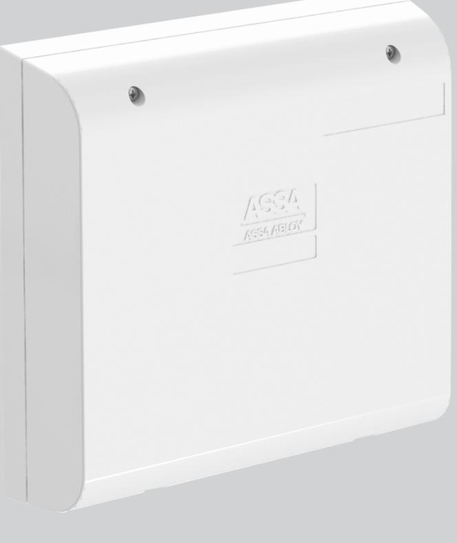
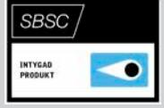
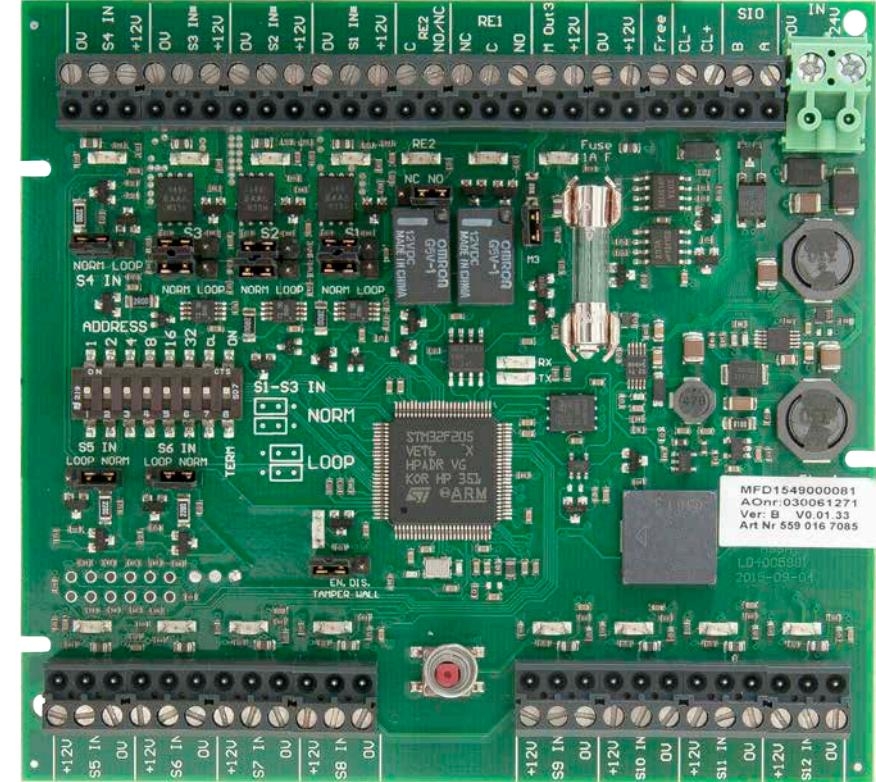
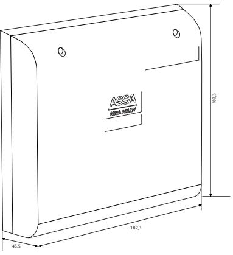

## SIO12-3

ASSA ABLOY, the global leader in door opening solutions

## In- och utgångsenhet för larm i ARX

SIO12-3 är en in- och utgångenhet som används i larm i ARX för att ansluta larmgivare.

SIO12-3 kan anslutas till undercentral LCU9016III direkt på DAC-bussarna eller via SIO-bussen på mastercentralen. SIO12-3 har 12 ingångar samt tre utgångar.

De12 ingångarna är programmerbara och kan arbeta normalt öppen eller normalt sluten, dubbelbalanserat med valfria motståndsvärden (standard 2K2 ohm). Även trippelbalansering är möjlig när övertäckningslarm från detektor används.

Samtliga utgångar är programmerbara var av två reläbestyckade och en övervakad transistorutgång. SIO12-3 är försedd med en intern summer.

SIO12-3-kortet kan hantera strömslinga på samtliga ingångar som slingkopplade glasdetektorer och branddetektorer. Ingångarna 1-3 kan även hantera extra mycket ström med en max belastning på 200mA per ingång.

Samtliga in- och utgångar har lysdiod-indikeringar för att förenkla installation och felsökning.

SIO12-3 kan antingen anslutas direkt till en dörrbuss eller till larmsystemets SIO-buss.

ASSA ABLOY, the global leader in door opening solutions

## In- och utgångsenhet för larm i ARX

## **Data**

- 12 ingångar
- 2 Reläutgångar
- 1 Övervakade transistorutgång
- Intern summer
- AUX 12V DC
- 1 SIO-kommunikationsport
- 1 CL20-kommunikationsport
- 1 Glassäkring 1A
- Strömförbrukning 20mA
- Spänningsmatning 24-28V DC
- Vikt 0,340 Kg
- Temperaturområde: -10°C till + 40°C
	- Luftfuktighet 75% (ej kondenserande)
	- Miljöklass 2
- Dimension H x B x D (mm) 183 x 183 x 46
- Larmgodkänd: SSF 1014, utgåva 4 Larmklass 3/4* *För larmklass 3/4 krävs borrskydd SIO/DACIII-BS02.
- SBSC-intyg 16-130

| ASSA ABLOY is the global          |
|-----------------------------------|
| leader in door opening solutions, |
| dedicated to satisfying           |
| end-user needs for security,      |
| safety and convenience            |

ASSA AB P.O. Box 371 SE-631 05 Eskilstuna Sweden Phone +46 (0)16 17 70 00

Fax +46 (0)16 17 70 49

Customer support: phone intl. +46 (0)16 17 71 00 Phone nat. 0771-640 640 Fax +46 (0)16 17 73 72 e-mail: helpdesk.marknad@assaabloy.com www.assa.se

**Övrigt**

| • Kapsling                     | PC/ABS        |               |
|--------------------------------|---------------|---------------|
| Artikelnummer • SIO12-3     | S559 016 7085 | E58 58 703 61 |
| Tillbehör • SIO/DACIII-BS02 | S5590102131   | E58 703 89    |
|                                |               |               |

CE-inspected and approved