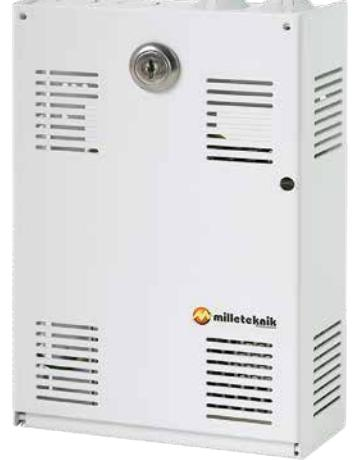
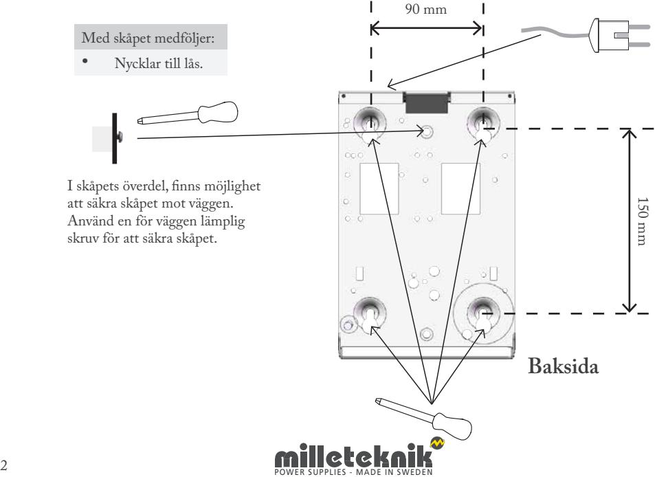
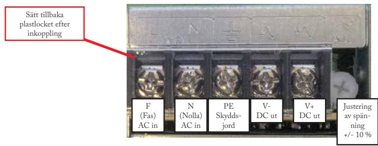
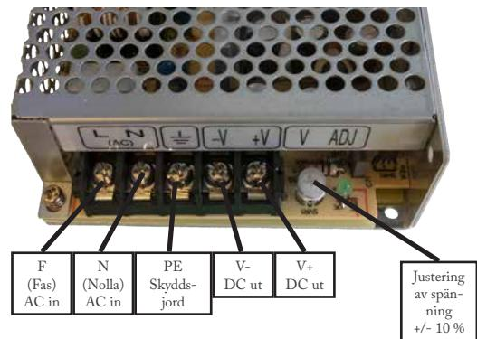

## AGG B3

AGG 24 10-B3 AGG 24 30-B3

Milleteknik ger reservkraft som säkerställer drift. Alla våra produkter är designade för bästa driftsäkerhet och lång livslängd - för såväl elektronik som batterier.

Denna anvisning beskriver installation och driftsättning av AGG i B3 kapsling.

## SÄKERHET - LÄS DET TA FÖRST!

- 100 mm fritt utrymme skall lämnas kring enheten.
- Systemet är avsett för bruk i kontrollerad inomhusmiljö.
- Endast personer med behörighet bör installera och underhålla systemet.
- Det är installatörens ansvar att systemet är lämpat för tänkt bruk.
- Ventilation skall ej övertäckas.
- Nätspänning bör vara bortkopplad under installation.
- Alla uppgifter med reservation för ändringar.

## Montering

Använd för väggen lämpliga skruvar för att sätta upp skåpet.

## Inkoppling AGG 2410-B3

Kablar dras från ovansidan in till nätaggregat där de skruvas fast. Systemet med underhållsfritt och skall installeras i inomhusmiljö.

Inkoppling AGG 24 30-B3

Kablar dras från ovansidan in till nätaggregat där de skruvas fast. Systemet med underhållsfritt och skall installeras i inomhusmiljö.

| Tekniska data |  |  |
|---------------|--|--|
|               |  |  |

|                                                                | AGG 24 10-B3                                            | AGG 24 30-B3 |  |  |  |
|----------------------------------------------------------------|---------------------------------------------------------|--------------|--|--|--|
| Information om rekommenderad omgivning och produktens kapsling |                                                         |              |  |  |  |
| Rekommenderad omgivning:                                       | Miljöklass 1, inomhus , 20 % ~ 90 % relativ fuktighet   |              |  |  |  |
| Omgivningstemperatur:                                          | +5 °C till +40 °C                                       |              |  |  |  |
| Kapslingsklass:                                                | IP 20                                                   |              |  |  |  |
| Rekommenderad montering:                                       | Vägg                                                    |              |  |  |  |
| Dimension (HxBxD):                                             | 200 x 146 x 57 mm                                       |              |  |  |  |
| Antal kabelgenomföringar:                                      | 2 st                                                    |              |  |  |  |
| Kapslingens färg:                                              | Vit                                                     |              |  |  |  |
| Nettovikt:                                                     | 1,1 kg                                                  | 1,1 kg       |  |  |  |
| El-teknisk information                                         | AGG 24 10-B3                                            | AGG 24 30-B3 |  |  |  |
| Nätaggregat                                                    | RS-25-24MT                                              | RS-75-24SZ   |  |  |  |
| Ingående spänning:                                             | 110V - 264 V AC / 47 - 63 Hz                            |              |  |  |  |
| Utgående spänning:                                             | 24 V DC                                                 |              |  |  |  |
| Maxström:                                                      | 1,1 A                                                   | 3 A          |  |  |  |
| Ställbar utspänning + / -:                                     | 10 %                                                    |              |  |  |  |
| Rippel:                                                        | 120 mVp-p                                               | 120 mVp-p    |  |  |  |
| Verkningsgrad:                                                 | 83,5 %                                                  | 88,5 %       |  |  |  |
| Skydd:                                                         | Överlast, överspänning, övertemperatur och kortslutning |              |  |  |  |
| Anslutningsarea belastningsutgång                              | 4 mm2                                                   |              |  |  |  |
| Övrig information                                              | AGG 24 10-B3                                            | AGG 24 30-B3 |  |  |  |
| E-nummer:                                                      | 5257179                                                 | 5269799      |  |  |  |
| Miljödata hos SundaHus: Nej                                 |                                                         |              |  |  |  |
| Garantitid:                                                    |                                                         | 2 år         |  |  |  |

Produkten uppfyller kraven och är testad enligt följande svenska och europeiska regelverk och normer: Europeisk elsäkerhetsnorm. EMC Directive 2014/30/EU. Low Voltage Directive 2014/35/EU. CE-marking 765/2008.

Milleteknik AB Ögärdesvägen 8 B 433 30 Partille

031-340 02 30 info@milleteknik.se www.milleteknik.se