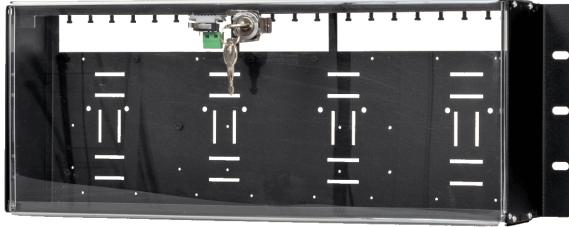
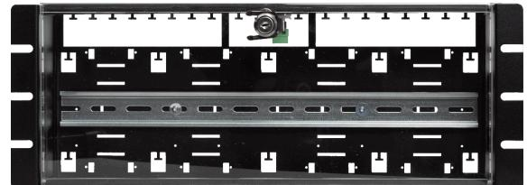
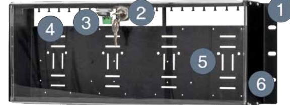
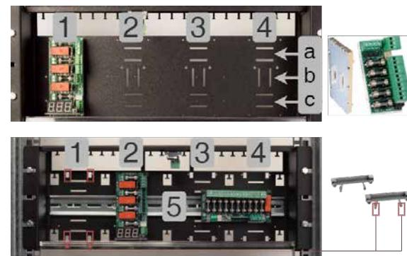
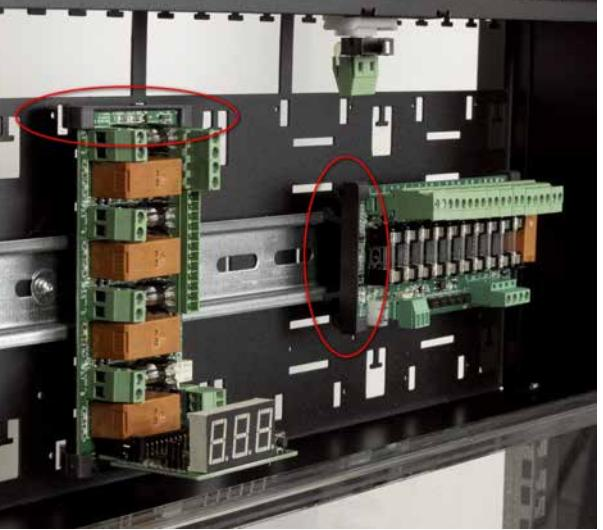
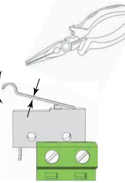
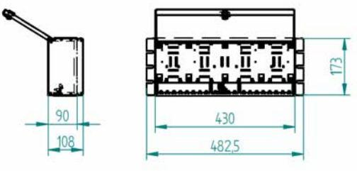

#### Om 19 rack module holder och 19 rack DIN module holder

19 rack module holder och 19 rack DIN module är en fyra höjdenheters hög kapsling för montering i 19" rack eller på vägg. 19 rack module holder har låsbar dörr i plexiglas och kommer med sabotagekontakt som standard. Enheten finns även med monterad DIN-skena för att fästa tillval som automatsäkringar som har DIN-skene fäste. Med DIN-skena monterad heter enheten: 19 rack DIN module holder.

19 rack module holder*

Plåtkapsling för 19" rack eller montering direkt på vägg, levereras med sabotagekontakt.

19 rack DIN module holder*

Plåtkapsling med DIN-skena för 19" rack eller montering direkt på vägg, levereras med sabotagekontakt.

*Kabelgenomföringar kan variera beroende på version av plåtkapsling, antalet kortplatser är detsamma i de olika versionerna.

# **Komponentöversikt - 19 rack module holder**

#### Tabell 1. Komponentöversikt

| Nummer | Förklaring                                            |
|--------|-------------------------------------------------------|
| 1      | Konsoller för montering i 19" rack eller på vägg.     |
| 2      | Låsbar dörr i plexiglas.                              |
| 3      | Sabotagekontakt.                                      |
| 4      | Kabelgenomföringar i ryggen.                          |
| 5      | Positioner för tillvalskort.                          |
| 6      | Kapsling i svart pulverlackad plåt. Dörr i plexiglas. |

## **Montering 19 rack module holder**

Enheten kan monteras i 19" rack eller på vägg.

Vid montering i 19" rack finns tre positioner på varje sida för.

Vid montering på vägg, använd lämplig skruv och plugg för väggtyp.

Tag av skyddsplast på locket efter montering.

OBS! Skruva alltid upp med minst två skruv i varje konsol.

## **Positioner för tillvalskort i 19 rack module holder**

Antal platser för kretskort med större formfaktor: 4 stycken markerade 1-4 i bilden.

Antal platser för kretskort i mindre formfaktorn (L-modul): 12 st - markerade a-c i bilden. Dock får 8 (liggande) tillvalskort plats som mest (a, c), då spåren mitten (b) är anpassade för stående kort.

#### NOTERA

Det är installatörens ansvar att beakta kabeldragning och kabellängder vid installation av kretskort.

#### 19 rack module holder & 19 rack DIN module holder

Figur 1. 19 rack module holder med olika kort monterade.

Överst till höger är ett kort i den mindre formfaktorn, för plats a-c.

Nedre till höger är plastgavlar till kort av den större formfaktorn. Dessa kan sitta på plats 1-4 eller (5) DIN-skena.

#### **Montering av tillvalskort i 19 rack module holder**

- Snäpp fast kortet på valfri postion (1-4, a-c, beroende på kortets formfaktor/storlek).

# **Montering av automatsäkringar i 19 rack DIN module holder**

- Sätt fast och lås fast automatsäkring på DIN-skena.
## **Justering av sabotagekontakt**

Sabotagekontaktens hävarm skall vid stängd skåpdörr vara i slutet läge (stängd). Går larm ("tamper alarm" / larm till undercentral) kan hävarmen behövas justeras.

Hävarmen justeras genom följande steg:

- 1. Nyp åt med en plattång mitt på hävarmen.
- 2. Justera hävarmen försiktigt åt önskat håll (upp/ner).
- 3. Kontrollera genom att stänga dörren. Ett klick hörs när kontakten sluts.

#### OBS!

Sabotagekontakten skall inte larma vid stängd och låst dörr.

# **Tekniska Data: 19 rack module holder och 19 rack DIN module holder**

| Pro dukt namn:       | 19 rack module holder | 19 rack DIN module hol der |
|----------------------------|-----------------------|-------------------------------|
| Arti kel num mer: | 4U010000P00019P01     | 4U01000P00019P01D             |
| E-num mer:              | 5001063               | 5001064                       |

| Pro duktbe skriv ning: | 19" tums modul/linjal för montering av Milletekniks avsäkringskort och/eller larmdonsövervakningskort. Det är även möjligt att an vända modulen tillsammans med Linjators kopplingsmo duler och/eller Sentrion DSS moduler. | 19" tums modul/linjal för montering av automat säkringar eller andra artik lar som har DIN-fäste. |
|---------------------------------|-----------------------------------------------------------------------------------------------------------------------------------------------------------------------------------------------------------------------------------------------------|------------------------------------------------------------------------------------------------------------|
| Antal mo dulplat ser   | 8 st. L-moduler eller 4 st. 10 output module eller 4 st. Fire module 4 outputs. Det går bra att blanda kort bland modulplaser, men antalet modulplatser går ej att utö ka.                                                        | 20 st. automatsäkringar                                                                                    |
| Sabota gekon takt         | Ja                                                                                                                                                                                                                                                  |                                                                                                            |
| Pro dukten passar i:   | 19 rack eller montering direkt på vägg. Vändbara konsoler (standardmontering från fabrik är för rackmontage).                                                                                                                                    | ,                                                                                                          |
| Höj denhe ter:            | 4HE                                                                                                                                                                                                                                                 |                                                                                                            |
| Materi al                    | Plåtkapsling i pulverlackad plåt med låsbar dörr i plexiglas. Sabotagekontakt ingår.                                                                                                                                                             |                                                                                                            |
| Mått:                           | Bredd: 482,5, höjd: 173 mm, djup: 108 mm.                                                                                                                                                                                                           |                                                                                                            |

# **Tekniska data: Sabotagekontakt**

| Artikel benäm ning | Tamperswitch                                                                                                                                                                                                                                                                                                                                                                                                                                                                                                           |
|--------------------------|------------------------------------------------------------------------------------------------------------------------------------------------------------------------------------------------------------------------------------------------------------------------------------------------------------------------------------------------------------------------------------------------------------------------------------------------------------------------------------------------------------------------|
| Artikel nummer        | A-0000000SAB01                                                                                                                                                                                                                                                                                                                                                                                                                                                                                                         |
| Typ                      | Microbrytare                                                                                                                                                                                                                                                                                                                                                                                                                                                                                                           |
| Spänning                 | 12 V / 24 V                                                                                                                                                                                                                                                                                                                                                                                                                                                                                                            |
| Not:                     | Överensstämmelse med RoHS för alla produkter är baserat på dokumentation från producenten på att artikel är i över - ensstämmelse med RoHS-direktivet. Milleteknik har vidta git alla rimliga åtgärder för att bekräfta producenternas på ståenden och andra bevis avseende avsaknad av de förbjud na ämnena för att stödja tillverkarens anspråk om efterlev nad. Baserat på den kunskap vi har uppfyller ovan nämna artiklar som refereras nedan RoHS enligt producentens do kumentation. |

# **Support**

Behöver du hjälp med installation eller inkoppling? Vår supporttelefon finns tillgänglig: Måndag-torsdag 08:00-16:00 och fredagar 08:00-15:00. Telefonsupport har stängt mellan 11:30-13:15.

Du kan även skicka e-post, vi svarar, under vardagar, inom 24 timmar.

Telefon: 031- 340 02 30, e-post: support@milleteknik.se. Du hittar mer information på www.milleteknik.se.

#### **Reservdelar**

Support hanterar frågor om reservdelar, se kontaktuppgifter ovan.

#### **Frågor om produkters prestanda?**

Telefon till försäljning: 031- 340 02 30, e-post: sales@milleteknik.se

# **Adress och kontaktuppgifter**

- Milleteknik AB Ögärdesvägen 8 B 433 30 Partille 031-340 02 30 www.milleteknik.se
------------------------------------------------------------------------------------------------------------------------------------------------------------------------------

TT

------------------------------------------------------------------------------------------------------------------------------------------------------------------------------

-