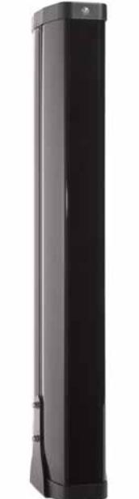

# PB31 **Pelare 3 m – 360° (dubbel riktad) inkl installationskit**

#### **Allmän beskrivning**

Pelare PB31 har ett diskret hölje som skyddar elektroniken väl. Den är tillverkad av pressgjuten aluminium och har akrylglas som täckning.

#### **Hög flexibilitet**

Pelare kan förses med PB600-seriens linjedetektorer. Det resulterar i enkla eller ett flertal strålar (sändare) med räckvidd upp till 200 meter. Linjedetektorerna är säkrade med de justerbara fixeringspunkterna som är inkluderade i varje barriär.

#### **Överklättringsskydd**

För att hindra en inkräktare att klättra över pelarna går det att beställa ett tyngdkänskilt lås som extra tillbehör.

#### **Värme**

Vid svåra miljöförhållanden (kyla etc) kan pelarna kompletteras med värmeelement som extra tillbehör.

#### **Pelare, innehållsförteckning**

- 1. Topp/botten lock: 2 st
- 2. Polycarbonat kåpa: 4 st
- 3. Aluminiumprofil: 1 st
- 4. Sabotageplatta: 1 st (EP1)
- 5. Sabotagekontakt: 1 st (EP1)
- 6. M3 DIN 934: 2 st (EP1)
- 7. M3x16 DIN 84: 2 st (EP1)
- 8. M4x8 DIN 84: 4 st (EP3)
- 9. M4x20 DIN 933: 2 st (EP2)
- 10. M4 DIN 934: 28 st (EP3) (C3)
- 11. M4 DIN 985: 2 st (EP2)
- 12. M4 DIN 125: 2 st (EP2)
- 13. Distans: 2 st (EP2)
- 14. Kabelgenomföring PGM16: 2 st (EP3)
- 15. Kabelgenomföring PGM20: 2 st (EP3)
- 16. M8x16 DIN933: 6 st (TA3)
- 18. Sidokonsol >2m : 2 st
- 19. M8 DIN 985: 6 st (TA3)
- 20. M8 DIN 125: 6 st (TA3)
- 21. M4x12 DIN 7985: 24 st (C3)
- 22. Konsol: 12 st
- 23. 2.9x16 DIN 7981: 24 st (C3)
- 24. Förankringsbult: 4 st (MAN2)
- 29. Koppling: 2 st

## **Details**

- Höjd 3 meter
- 360° synvinkel
- CE-certifierad produkt

## PB31 **Pelare 3 m – 360° (dubbel riktad) inkl installationskit**

### **Technical specifications**

| Allmänt               |                                         |
|-----------------------|-----------------------------------------|
| Accessory group       | Perimeter / Outdoor                     |
| Type                  | Mounting                                |
| Spänning              |                                         |
| Operating voltage     | 12 to 24 V                              |
| Mått                  |                                         |
| Physical dimensions   | 2970 x 130 x 260 mm                     |
| Net weight            | 11.10 kg                                |
| Miljö                 |                                         |
| Operating temperature | -15 to 50 °C                            |
| Voltage               |                                         |
|                       | 12 to 24 VDC                            |
| Angle of view         |                                         |
|                       | 360°                                    |
| Tamper switch output  |                                         |
|                       | CO (change over)                        |
| Operating temperature |                                         |
|                       | -15 to +50°C                            |
| Material              |                                         |
|                       | Aluminium, plastic (polycarbonate, ABS) |
| Dimensions (HxWxD)    |                                         |
|                       | 297 x 13 x 26cm                         |
| Weight                |                                         |
|                       | 11.10 kg                                |

As a company of innovation, UTC Fire & Security reserves the right to change product specifications without notice. For the latest product specifications, visit UTC Fire & Security online or contact your sales representative.

Powered by TCPDF (www.tcpdf.org)