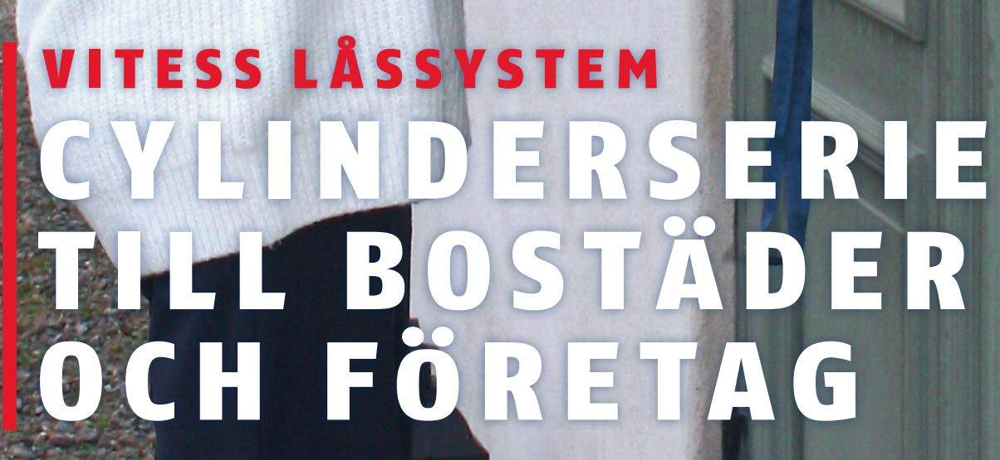

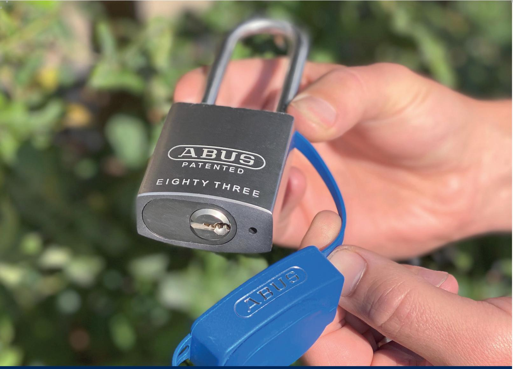

# LÅSSYSTEMET TILL BOSTÄDER OCH FÖRETAG

Vitess är på alla sätt det självklara valet till större låssystem som används hos bostadsföreningar, institutioner och företag som kräver hög säkerhet. Nyckelprofilen i låssystemet Vitess är formad som en mjuk båge. Det betyder att profilen, tillsammans med ett avancerat nyckelstoppsystem, skyddar cylindern mot dyrkning och samtidigt att nycklarna säkras mot olovlig kopiering.

#### FAKTA OM VITESS

- Obegränsat varumärkesskydd
- Certifierad i hög säkerhetsklass enligt SSF 3522, klass 3
- Böjd nyckelprofil
- Intop-nyckelstoppsystem

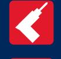

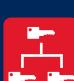

Väl lämpad för stora låssystem med olika nyckelnivåer

- 
För att beställa fler nycklar måste man uppvisa det medföljande säkerhetskort

# INTOP-NYCKELSYSTEM

ABUS Vitess serien har patent för Intop-nyckelsystem som stoppar nyckeln i rätt position. Det betyder t.ex. om någon obehörig ger sig på låset med en nyckel från ett annat system, kommer inte nyckeln stoppas i rätt skärningspunkt och cylindern låses inte upp! Intop-systemet är patenterat fram till år 2034 och är därigenom skyddad mot obehörig kopiering. Vitess cylindern har 6 st fjäderbelastade stift med borrskydd, stift av härdat specialstål i kärnan och Intop-system.

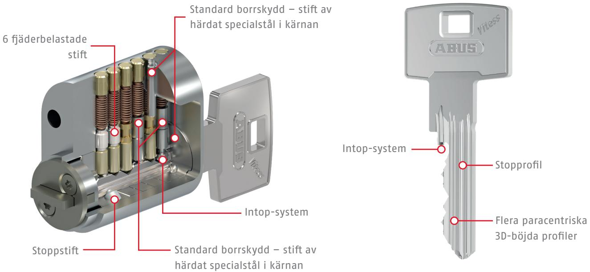

# VITESS KAN FÅS MED MÅNGA OLIKA CYLINDERTYPER

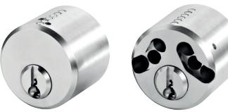

Säkerhetscylindrar ut- och invändigt

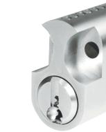

Rokokocylinder

Oval cylinder

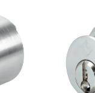

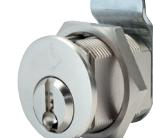

Cylinder till brevlåda

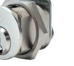

Snowmancylinder

PAT E NT E R AT S Y S T E M F R A M TILL 2034

Trapez möbelcylinder

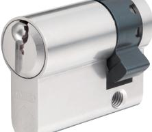

Rund möbelcylinder

Europaprofilcylinder, halv

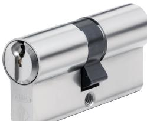

Europaprofilcylinder, dubbel

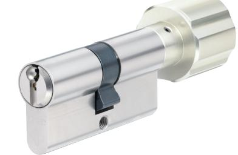

Europaprofil-cylinder, dubbel med vred

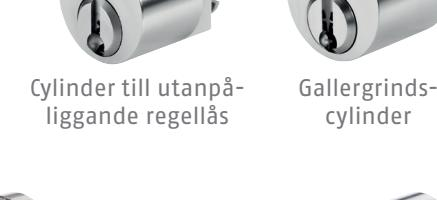

### **ABUS** l Nordic **abus.com**

## ABUS Nordic Kompanigatan 1-2 55305 Jönköping +46 (0)36 36 14 88 sales@abus-nordic.com

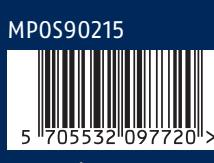

Med förbehåll för tekniska och färgmässiga ändringar. Inget ansvar för ev. tryckfel. © ABUS 09/2020